# Miraikanai Engine Runtime Scheduling／Lifetime Contract

- 文書ID: mirakan.arch.runtime-scheduling-lifetime
- 文書状態: review
- 実装状態: absent
- 検証状態: design-reviewed
- 正本範囲: Simulation Advance／render phase、固定実行順、job dependency、command／event順序、state writer orchestration、callback lifetime、Asset activation、Play／Runtime Entry branch／World／frame lifetime、Runtime Entry transition、fault recovery、Saveへ渡すtimebase input、Runtime contract固有のGameplay Timer capacity（§4.1）
- 非正本範囲: Network endpoint／Transport／connection、Multiplayer session／role／authority／replication／prediction／rollback、Runtime ECS storage・Entity identity・query・selection・Component lease・access manifest・structural delta、World Package binary、Save／Replay payload、共通memory／frame／queue budget、共通capacity、backpressure、測定閾値、Scale Envelope、Debug Store、Subsystem固有schema／Backend。各Owner文書を参照する
- 規範依存: [Architecture Governance](../01-governance/architecture-governance.md)、[Core Architecture](../02-foundation/core-architecture.md)、[Memory／Pointers](../02-foundation/memory-pointers.md)、[Executable Contracts](../02-foundation/executable-contracts.md)
- 関連文書: [Runtime ECS](entity-component-system.md)、[Runtime Package](runtime-package.md)、[Runtime Asset Lifecycle](runtime-asset-lifecycle.md)、[Persistence／Save](persistence-save.md)、[Architecture Plan Closure Review](../appendices/architecture-plan-closure-review.md)、[Advanced Rendering／Multiplayer Ownership Decision](../decisions/2026-07-29-advanced-rendering-multiplayer-ownership.md)、[Product Plan](../00-product/product-plan.md)、[AI Security／Approval](../01-governance/ai-security-approval.md)、[AI Verification／Provenance](../01-governance/ai-verification-provenance.md)、[Core architecture](../02-foundation/core-architecture.md)、[Toolchain／Dependencies](../02-foundation/toolchain-dependencies.md)、[Executable contracts](../02-foundation/executable-contracts.md)、[Memory／Pointers](../02-foundation/memory-pointers.md)、[Project state](../03-authoring/project-state.md)、[Asset lifecycle](../03-authoring/asset-lifecycle.md)、[Gameplay programming model](../03-authoring/gameplay-programming-model.md)、[Native game module](../03-authoring/native-game-module.md)、[Editor Workspace UX](../03-authoring/editor-workspace-ux.md)、[Performance／capacity](performance-capacity.md)、[Debugging／observability／replay](debugging-observability-replay.md)、[Physics](../05-simulation/physics.md)、[Navigation](../05-simulation/navigation.md)、[Animation](../05-simulation/animation.md)、[Render Graph](../06-rendering/render-graph.md)、[World](../06-rendering/world.md)、[LOD](../06-rendering/lod.md)、[Network Transport／Connection](../09-networking/network-transport-connection.md)、[Multiplayer Authority／Replication](../09-networking/multiplayer-authority-replication.md)
- 根拠区分: project-decision（外部仕様を引用する箇所はofficial-spec、未計測の固定値はprovisional）
- 外部根拠確認日: 2026-07-21

## 1. 結論と所有境界

`RuntimeOrchestrator`だけがRuntimeのphase進行、sealed bufferのmerge、構造変更boundary、version activation、fault遷移を所有する。Subsystemは互いを直接呼ばず、型付きcommand、型付きevent、immutable snapshot、version付きAsset、検査済みasync resultだけで連携する。

本書はRuntime phase、Simulation Advance、job dependency、lifetime identifierの唯一の正本である。共通memory／performance budget、queue capacity、backpressure、Scale qualificationは[Performance／capacity](performance-capacity.md)だけが決定する。例外として、§4.1のGameplay Timer capacityはRuntime contract固有のdeterministic上限として本書が所有し、共通queue capacityへ含めない。Product PhaseとCapability maturityは[Product Plan](../00-product/product-plan.md)、MCD上の共有型構造は[Executable contracts](../02-foundation/executable-contracts.md)、Project transactionは[Project state](../03-authoring/project-state.md)が決定する。

[Network Transport／Connection](../09-networking/network-transport-connection.md)はconnection／message deliveryを所有し、[Multiplayer Authority／Replication](../09-networking/multiplayer-authority-replication.md)はsession／authority／replication／predictionを所有する。本書は両Ownerが検証してsealしたmessage batch、typed command、snapshot、state mutation requestを既存phase／publication boundaryへ配置するだけで、remote peer、socket callback、packet arrivalをphase owner、Simulation Advance、state writer authorityにしない。

[Runtime Package](runtime-package.md)のDedicated game Runtimeは`entry_kind=world`＋headless Target＋Presentation absentであり、本書の`presentation_state=absent`を使う。Worldを持たない既存`entry_kind=headless` branchと同一視せず、Dedicated Target packageの存在からTransport／Multiplayer／Online supportを推測しない。

Runtimeが保証する不変条件は次である。

- Worldへの書込は宣言済みownerが宣言済みphaseでだけ行う。
- structural mutationとversion activationは明示boundaryでtransactionalに行う。
- worker completion順、pointer、thread index、registration順をauthoritative順序へ使用しない。
- short-lived objectはlong-lived objectを所有せず、逆向き参照はhandleまたはleaseにする。
- Simulation Advanceがfaultした場合、そのadvanceのWorld snapshotをpublishしない。
- Presentation stateをauthoritative Gameplayへ逆入力しない。

## 2. Runtime moduleと依存DAG

```mermaid
flowchart BT
  Foundation["Foundation"]
  Jobs["Jobs"]
  Contracts["Runtime Contracts"]
  Assets["Asset Runtime"]
  World["Runtime World"]
  Ports["Domain Ports"]
  Domain["Domain Runtime"]
  Adapters["Native Adapters"]
  Package["Runtime Package"]
  Orchestrator["Runtime Orchestrator"]
  Compiler["Runtime Compiler"]
  EditorHost["EditorHost"]
  GameHost["GameHost"]

  Jobs --> Foundation
  Contracts --> Foundation
  Assets --> Foundation
  Assets --> Jobs
  World --> Contracts
  World --> Foundation
  Ports --> Contracts
  Ports --> Assets
  Ports --> Jobs
  Domain --> Ports
  Domain --> World
  Adapters --> Ports
  Package --> Contracts
  Package --> Assets
  Orchestrator --> World
  Orchestrator --> Domain
  Orchestrator --> Package
  Orchestrator --> Jobs
  Orchestrator --> Assets
  Compiler --> Package
  EditorHost --> Orchestrator
  GameHost --> Orchestrator
  GameHost --> Adapters
```



矢印は依存元から依存先を示す。実target edgeはconfigure時に検査し、循環、未許可edge、Domain間直接依存を拒否する。

図中の`Asset Runtime`はSchedulingがcompletion acceptance、publication boundary、retire順を接続する論理module labelであり、initial V1 Owner境界は[Runtime Asset Lifecycle](runtime-asset-lifecycle.md)へ解決する。ただし同文書は`review`、実装は`absent`であり、CMake target、Schema、API、Serviceまたはactive Capabilityの存在を意味しない。本図のedgeから実装、SchemaまたはServiceを生成せず、初期Contract Setではexact Owner／Definition refへ直接束縛する。

| target | 所有 | 禁止 |
|---|---|---|
| Runtime Contracts | typed command／event、phase ref、snapshot ref、共通value | Domain実装、vendor型、Editor |
| Runtime World | Entity location、component storage、Stable ID対応 | Renderer／Physics／Navigation等の実装 |
| Domain Port | Engine-owned interface、Domain value、validator | World実装、他Domain、vendor型 |
| Domain Runtime | query、System、resolver、command／event生成 | vendor型、phase外write、他Domain直接呼出し |
| Native Adapter | vendor変換、native object lifetime、conformance | World、Authoring、AI、他Adapter |
| Runtime Orchestrator | phase、merge、boundary、fault | vendor型、Editor widget |
| Runtime Package | immutable manifest、loader、Runtime schema | Authoring object、Editor、vendor型 |

各SystemのComponent read／write set、query selection、structural permissionは[Runtime ECS](entity-component-system.md)の`RuntimeComponentAccessManifestV1`が所有する。Orchestratorはpackage load時とcallback開始時にmanifest、phase、bindingを照合する。AdapterはWorldへlinkせず、Portが渡した値、typed ref、owned bufferだけを扱う。Rendering、Audio、VFXはWorld leaseを持たず、sealed snapshotまたはPresentation commandを消費する。

Runtime packageは`GameSystemDependencyGraphV1`、`SystemImplementationSetV1`、Contract set hashを持つ。authoritative State Typeごとのactive ownerは厳密に一つでなければならない。Build／Cook edgeはDAG、same-advance write cycleと同phase callback再入は禁止する。次boundaryを越えるcycleは、[Performance／capacity](performance-capacity.md)のcapacity contributionとfailureを宣言し、Replay fixtureに合格した場合だけ許可する。

## 3. Process、Project、Play、Worldのlifecycle

Editor process stateは次のclosed state machineとする。

```text
Boot -> ProjectOpening -> Authoring -> PlayPreparing -> Playing
Playing -> PlayStopping -> Authoring
Authoring -> ProjectClosing -> Shutdown
Boot | ProjectOpening | Authoring | PlayPreparing | Playing | PlayStopping | ProjectClosing -> Faulted
Faulted -> ProjectClosing | Shutdown
```

`Faulted`から同じPlay sessionへ復帰しない。Editor processを継続できる場合はjournalとfault evidenceを保全し、`Faulted -> ProjectClosing`でProjectを閉じ、[Editor Workspace UX](../03-authoring/editor-workspace-ux.md)のEditor session machineが定めるProject非保持state（`NoProject`）をsafe shellとして戻る。継続できない場合は`Faulted -> Shutdown`で安全に終了する。Authoring中のGameHost／Worker crashは同文書のTask failure隔離で処理して`Faulted`へ遷移させず、`Authoring -> Faulted`はHost自身がsafe stopできないprocess faultだけに使う。Shipping GameHostのOS application lifecycleはPlatform Ownerが決定し、OS callbackはWorldを直接変更せずbounded lifecycle eventをOrchestratorへ渡す。

`PlayPreparing`はCommit済み`project_revision`と選択済み`RuntimeEntryPointDocumentV1`を一つ固定し、`RuntimeEntryPackageV1`、System Graph、Implementation Set、Target別Plan、target selector hash、activation policy hash、optional selected provider binding set hash、`entry_branch_closure_hash`を検証する。Runtime Entry Packageは選択`SimulationCadenceProfileRefV1`とTarget Profile Refを必須にし、Cadenceの`physics_substep_profile_ref=null`なら`physics_substep_activation_binding_ref=null`、non-nullならPhysics ownerのpassかつfreshなexact `PhysicsSubstepActivationBindingRefV1`を必須にする。Bindingが解決するCadence／Substep／Target三RefはPackageとbyte equalityでなければならない。binding set hashがpresentならpost-commit Project revision／document set hash、Registry ref／hash／membership、全binding Document ref／content hash、revision非依存semantic hash、tagged stable owner identity、implementation System、Save／Replay contractをcurrent Project／Targetへ照合し、0件ならField omissionを要求する。Binding payload内のProject revisionを所有証明に使わない。`world` branchはWorld closureと、Project State §3.1.1.1のatomic activation後にexact Presentation Bindingが選択された場合だけUI closureを要求する。`ui` branchはUI closure、`headless` branchはWorld／UI closureを要求しない。startup systemが1件以上なら全branchで`startup_system_closure_hash`を検証し、headlessでは必須、world／uiの0件だけcanonical omissionとする。startup closureはtransitive System dependency、Implementation Variant、State owner、Target compatibilityを含む。別branchのDocument、Topology、surfaceを常時要求せず、branch activation set全体がreadyになるまで`Playing`へ進めない。EditorHostはauthoritative child GameHostを同時に一つだけ管理する。Preview Worldは存在する場合だけPresentation専用で、Save／Replay／Gameplay eventへ参加しない。

runtime session配下のWorld instance、UI session、startup system instanceは選択branchごとのoptional childである。`world`はScene 0件／Topology nullでもvalidで、activated exact Presentation BindingがあればUI Sessionも同じbranch generationへ含める。BindingがなければV1規則どおりUI Sessionを要求しない。`ui`はWorldなし、`headless`はWorld／UI／surfaceなしでvalidとする。branch外fieldを混ぜたpackage、headless startup system 0件、entry hash／branch closure hash不一致はPlay開始を拒否し、last-valid packageとAuthoring revisionを維持する。

`Playing`中のRuntime Entry replacementはPlay Sessionを停止／再生成せず、同一Session内でactive branch generationをexact +1する。active branchは常に一件であり、destination staging branchはreadiness完了までauthoritative state、Input target、Presentation、Save rootとして公開しない。UI Screenのpush／pop、同一World内のspatial移動、Stage instanceの切替をRuntime Entry replacementへ近似せず、それぞれのOwner契約を使う。

Project ownerとRuntime ownerのfixtureを名前の類似で結ばず、次のexact integration mappingを登録する。

```text
RuntimeEntryOwnerIntegrationManifestV1
  manifest_version: 1
  manifest_hash
  project_owner_fixture_refs:
    [fixture.project.runtime_entry.document_identity,
     fixture.project.runtime_entry.selector_policy_resolution]
  runtime_owner_fixture_refs:
    [fixture.runtime.runtime_entry.branch_activation,
     fixture.runtime.runtime_entry.reverse_teardown]
  mappings:
    - project fixture ref/hash
      runtime fixture ref/hash
      entry kind
      compile manifest hash
      expected branch closure hash
      expected owner receipt refs/hashes
```

二つのProject owner fixtureと二つのRuntime owner fixtureは各Owner文書で独立に合格し、integration manifestの全mappingがref／hash一致した時だけ`fixture.integration.project-runtime-entry.owner-resolution`を合格にする。一系統のfixtureを他Ownerの合格証拠として再利用せず、missing／duplicate／stale mappingをPlay readinessで拒否する。

Play中のAuthoring変更は新revisionとして保存できるが、Runtimeへ自動適用しない。[Asset lifecycle](../03-authoring/asset-lifecycle.md)またはDomain Ownerが互換性を証明し、本書のboundaryへ提出したtyped activationだけを適用する。`PlayStopping`、Play fault、restartは新規Input、async request、Presentation submitを止め、worker join、queue seal、Save／Replay finalize後、branch activation setのactual dependency DAGをreverse topological orderでteardownする。順序対象はstartup system instance、UI session、World instance、optional Presentation target／surfaceであり、存在しないbranch childを生成して破棄順へ加えない。全lease／submission retire後だけHost resourceを解放する。Runtime値をAuthoringへ戻す場合は[Project state](../03-authoring/project-state.md)の別ChangeSetとし、Runtime handle、native ID、GPU handle、internal slotを含めない。

object lifetimeは長い順に次とする。

```text
Process
  Project
    Authoring Revision / Asset Registry
      Play Session
        Runtime branch activation set
          Runtime World? / UI Session? / Startup Systems?
          Simulation Advance
            Phase
              Job / Callback
        Render Frame Slot?
          GPU Queue Submission
```

短いlifetimeのobjectは長いlifetimeのobjectを所有しない。World破棄は全job、callback、snapshot consumer、Asset lease、GPU submissionの終了または明示fault-retire後だけ行う。

### 3.1 GameHost outer loop、clock、pause

Shipping GameHostとEditor child GameHostは、Platform control event、選択済みSimulation Cadence、optional input、optional presentation、waitを一つのouter loopで接続する。windowを前提にしないHost／Platform-control threadがloop順序と`GameHostLoopStateV1`を所有し、T00～T110はGame simulation thread、Presentation targetが存在する時だけR00～R70をRender submission threadへbounded requestとして一回ずつ委譲する。simulationはpublishまたはfaultのacknowledgement前に次のsimulation stepを開始しない。OS callback、Worker、Renderer、Audio callbackはouter loopまたはRuntime Worldへ再入せず、bounded event／command／snapshot境界だけを使う。現行Productionで実行可能なのは§4.1のreference default `fixed 60/1` Cadenceだけであり、本節のaccumulator／catch-up手順はそのProfile instanceの実行規則である。

```text
GameHostLoopStateV1
  monotonic_now_ns
  previous_outer_loop_ns
  cadence_profile_ref: SimulationCadenceProfileRefV1
  physics_substep_activation_binding_ref:
    null | PhysicsSubstepActivationBindingRefV1
  cadence_runtime_state:
    kind: fixed
      simulation_accumulator_ns
    | kind: variable
      previous_step_sample_ns
    | kind: turn_based
      pending_advance_sequence
    | kind: explicit_step
      pending_step_request_sequence
  advance_sequence
  presentation_state: absent | active | surface_unavailable
  render_frame_id?
  application_state = Starting | Active | Inactive | Suspended | Terminating
  gameplay_clock_mode = running | paused
  debug_execution_mode = running | pause_requested | paused_at_t110 | single_simulation_step
  surface_generation?
  last_published_render_snapshot_advance?
```

`gameplay_clock_mode`は`support_mode=global`の`PausePolicyV1`／`GamePauseStateSnapshotV1`だけのconsumer projectionであり、outer loopが別のPause authorityを持つ意味ではない。Pause非対応Profileでは常に`running`で、Pause要求をtyped `pause_not_supported`としてSource／Runtime state不変で拒否する。`debug_execution_mode`はDebuggerが所有し、Shipping Game pauseの権限またはstateとして使用しない。`presentation_state=absent`では`render_frame_id`、`surface_generation`、`last_published_render_snapshot_advance`を全件省略し、RenderSnapshot acquire／interpolation／R00～R70へ依存しない。`active | surface_unavailable`はPresentation targetがbranch activation setへ明示選択された場合だけ使用し、surfaceを持たないoffscreen presentationでは`surface_generation`だけを省略できる。`surface_unavailable`はApplication lifecycle stateではなくoptional Presentation childの状態であり、simulation branchのactivationやadvanceを暗黙停止しない。strict headlessはWindow、Surface、RenderSnapshot、Render thread dependencyを0件にし、0やfake generationを作らない。

`cadence_runtime_state.kind`は解決した`SimulationCadenceProfileV1.cadence.kind`とbyte equalityで、他branch Fieldを持たない。`physics_substep_activation_binding_ref`はProfileのSubstep Ref nullability、Runtime Package、Targetとbyte equalityにし、non-null時はPhysics ownerのsigned Qualification Receiptのsubject／result／freshnessをT50前に再検査する。現在実行可能なfixed branch以外およびnon-null Substep branchは対応Capability Activationまで構築せず、0、fixed accumulator、Backend既定substepで代用しない。`monotonic_now_ns`と`previous_outer_loop_ns`はwall-clock時刻、timezone、system clock補正を含まない単調clockである。`fixed` Cadenceのadvance intervalは浮動小数または切り捨てnanosecondの反復加算を使わず、Profileの既約な`rate_hz = numerator / denominator`からadvanceごとに次式で求める。

```text
advance_duration_ns(advance_sequence) =
  floor(advance_sequence * 1,000,000,000 * denominator / numerator)
  - floor((advance_sequence - 1) * 1,000,000,000 * denominator / numerator)
```

`advance_sequence`は1開始であり、上式は先頭`0 ns`からの連続partitionを生成する。全積と除算はchecked unsigned 128-bit以上で評価し、narrowing、wrap、float変換を行わない。Profile上限`rate_hz <= 1,000,000,000/1`により各partitionは1 ns以上である。reference default `60/1 Hz`では第1区間を`floor(1,000,000,000/60) - floor(0)`、60 advancesの合計をexactly 1秒とし、`simulation_accumulator_ns`は整数nanosecondだけを保持する。rate変更時も同じ有理数式を使い、Hz literalをphase ABIへ埋め込まない。Outer loopの唯一の順序は次である。

```text
while application_state != Terminating:
  1. bounded Platform lifecycle eventをdrainし、遷移要求をlatchする
  2. monotonic clockを一度sampleし、前回との差を求める
  3. ApplicationState遷移をouter-loop境界へ適用する
  4. Activeかつregistered Input Sourceが存在する場合だけinputを一度sampleする
  5. fixed branchでadvance可能ならelapsedをaccumulatorへ加え、0..cadence.max_catch_up_steps回のT00..T110を完了する
  6. presentation_state != absentの場合だけ完全にpublish済みの最新RenderSnapshotをacquireする
  7. presentation_state != absentの場合だけpresentation専用interpolationを作る
  8. presentation_state = activeかつsurfaceが有効なら0回または1回のR00..R70を実行する
  9. 完了submission／leaseをretireし、frame paceまたはPlatform eventをwaitする
```

- reference default fixed branchでは`Active`かつ`debug_execution_mode = running | pause_requested`のときだけelapsedをaccumulatorへ加える。Debug再開後の最初のouter loopは停止中wall timeを加えない。
- 次の`advance_duration_ns(advance_sequence)`以上のaccumulatorがある間だけ、最大`cadence.max_catch_up_steps` advancesを実行する。上限到達後にも実行可能なら、`overrun_policy=clamp_and_report`は次advance未満の端数だけを残して超過時間を捨て、`dropped_wall_time_ns`、連続clamp回数、最大accumulatorをtelemetryへ記録し、`overrun_policy=fault`は新advanceをpublishせずPlay sessionを`Faulted`へ遷移する。reference defaultでは上限4である。
- registered Input Sourceが存在する場合だけActiveなouter loopごとに一度sampleする。sourceが0件なら空deviceを生成せずInput sample dependencyを省略する。held stateは同じouter loopのcatch-up advancesで再利用できるが、press／release edge、text、gesture eventは最初のeligible advanceへだけ割り当て、後続advanceへ複製しない。Replayは存在したsourceのsample sequenceとsample-to-advance割当を記録する。
- advanceがfaultした場合はそのadvanceのsnapshotをpublishせず、残りcatch-upとrenderを中止してPlay sessionを`Faulted`へ遷移する。直前snapshotをfault後の新しいframeとして提示しない。

Gameplay pauseは§4.1の`support_mode=global`である`PausePolicyV1`と`GamePauseCommandV1`だけが所有する。`gameplay_clock_mode = paused`でもouter loopとT00～T110のphase boundaryは継続するが、freeze対象domainはdeltaを進めず、Physics solver、Gameplay timer、authoritative animationを§4.1のatomic orderどおりskipする。UI、pause menu、presentation、resume inputは許可された継続domainだけで動作する。`support_mode=unsupported`または`pause_policy_ref=null`ではPause／resume Command、Pause snapshot、pause menuの存在を要求しない。

`debug_execution_mode = pause_requested`は実行中advanceのT110完了後だけ`paused_at_t110`へ遷移し、reference default fixed branchでは成立時にaccumulatorを0へする。`paused_at_t110`ではlive deviceのdebug／Replay controlだけを別System Contextへ渡し、停止中に生じたGameplay edgeを将来advanceへqueueしない。`single_simulation_step`はpause時に封印したheld stateを新規edgeなしで使うか、Replayの記録済み`InputSnapshot`を使い、wall timeと無関係にexactly 1回のT00～T110を選択Cadenceのtyped debug-step inputで実行する。Debuggerは[Debugging／observability／replay](debugging-observability-replay.md#9-breakpointwatchpausestep)の`DebugSimulationAdvanceRequestV1`だけを提出し、`SimulationAdvanceIntervalV1`を生成しない。Scheduling Ownerだけがrequest、selected Profile、expected next sequence、turn-based Commandまたはexplicit-step request／ordinalを検証し、検証済み`SimulationAdvanceIntervalV1`を生成・sealしてDebuggerへ返す。publishまたはfault後は`paused_at_t110`へ戻り、公開操作で一部phaseだけを進めない。

Application lifecycleは次の共通policyを持つ。Platform固有の通知対応、checkpoint deadline、surface再生成は各Platform Ownerの追加規則に従う。

| ApplicationState | Authoritative Simulation Advance | Render | 境界policy |
|---|---|---|---|
| `Starting` | なし | なし | 選択Runtime Entryのbranch activation setを準備し、明示選択された場合だけPresentation target／surfaceを準備する |
| `Active` | clock policyに従う | 有効surfaceで0～1 frame | 通常実行 |
| `Inactive` | 現在advanceのT110後に停止 | なし | checkpointを要求し、wall-time駆動Cadenceの蓄積状態をclearする |
| `Suspended` | なし | なし | simulation／render／audio処理を止め、Platform eventをwaitする |
| `Terminating` | 新規advanceなし | なし | checkpoint policyを使い、安全な破棄順序へ進む |

Presentation childが`surface_unavailable`ならR00～R70をskipし、surface generation更新を待つが、Applicationは`Active`のままauthoritative Simulation Advanceを継続する。Platformがinactive／suspendを別lifecycle eventとして通知した場合だけ対応するApplication Stateへ遷移する。Headless Targetでは設計上surfaceが存在しないため`presentation_state=absent`であり、`surface_unavailable`を生成しない。

## 4. Simulation Cadenceとphase identifier

初期Production Runtimeが選択するreference default Profile instanceは`cadence_kind=fixed`、rate `60/1 Hz`、`max_catch_up_steps=4`である。この値は`SimulationCadenceProfileV1`の一instanceであり、Core schema、phase IDまたはNative ABIのliteralではない。別rate、`variable`、`turn_based`、`explicit_step`はschemaとして表現できるが、対応Capability、Physics／Animation／Replay fixture、全Target Qualificationが成立するまでProduction Profileへ選択せず`cadence_profile_not_qualified`で拒否する。reference defaultはwall-clock蓄積から一render frameにつき最大4 stepまでcatch-upし、それ以上はclampしてcounterへ記録する。Game simulation threadがstepの開始と終了を所有し、workerはimmutable inputからprivate resultだけを生成する。

一回のSimulation Advanceで実行する完全なphase sequenceは次の表だけで定義する。current reference defaultでは一advanceが一fixed tickに対応するが、phase ID自体はCadence kindまたはrateを表さない。

| 順序 | Phase ID | 実行内容 | 書込範囲 |
|---:|---|---|---|
| 0 | `T00_BoundaryApply` | sealed structural command、互換なAsset／GameplayDefinitionSet、検証済みbranch activation set／Cell activationを適用 | 構造変更 |
| 1 | `T10_InputLatch` | device inputをadvance sequence付き`InputSnapshot`へ固定 | Input state |
| 2 | `T20_AsyncIntegrate` | deadline内のasync resultをversion検査して統合 | 宣言済みresult field |
| 3 | `T30_PrePhysics` | Gameplay、AI behavior、Cook済みrule／abilityを評価し、直前advanceのsealed snapshotからPerception候補とCollision Query batchを構築 | Simulation command、Perception query batch |
| 4 | `T40_MotionIntent` | root motion proposalとmovement intentをselected Motion Executorで解決 | selected executor input／resolved motion |
| 5 | `T50_PhysicsStep` | active Physics providerがある場合だけ選択Cadenceに資格化された2D／3D Physics stepと登録済みCollision Query batchを実行 | active Physics Adapter内部、private query result |
| 6 | `T60_PhysicsIntegrate` | native eventとPerception Query結果をnormalizeし、dynamic transformと次advance用Perception snapshotをwrite-back | Physics owner field、Perception owner field |
| 7 | `T70_PostPhysics` | contact／trigger配送、owner登録済みpost-physics authoritative Event／rule | owner-typed非構造fieldとcommand |
| 8 | `T80_AnimationFinalize` | blend、IK、pose、boundsをauthoritative transformから確定 | Animation state |
| 9 | `T90_PresentationBuild` | Audio、VFX、UI、camera向けbatchを生成 | Presentation buffer |
| 10 | `T100_ReplayCheckpoint` | Input、accepted async result、state hash、checkpoint candidateをprivateに構築 | private Replay packet |
| 11 | `T110_Publish` | next-boundary commandをsealし、immutable snapshotと対応Replay checkpointをpublish | snapshot／Replay publish |

`TickPhaseId`のserialized値は順序に対応する`0x0000`～`0x000b`とする。`0xffff`はinvalidである。外部latch sourceは`InputDevice=0x0200`、`IoCompletion=0x0201`、`AudioCallback=0x0202`、`AssetWorker=0x0203`とする。追加、削除、順序変更、値変更はpublic behavior変更であり、ADR、schema migration、Replay fixture、全Domain conformanceを必要とする。

T100のcheckpoint candidateはT110成功前にdurable Replay stream、Debug、Save、AIへ公開しない。T110前またはT110 validationでadvanceがfaultした場合はcandidateを破棄し、last published World refに束縛した別のtyped fault recordだけをReplay Evidenceへ追加する。fault recordを成功checkpoint、次advanceの開始state、publication generationの増加として扱わない。

Perception pipelineはT30 candidate／query build、T50 query execution、T60 normalization／publishの三slotへ固定する。T30は直前にpublish済みのWorld／Perception snapshotだけを読み、T50のprivate結果を同じadvanceのGameplay判断へ戻さない。T60でpublishした`PerceptionSnapshotV1`は次advanceのT30から可視とし、query callback、worker完了順、Render visibilityからsame-advance feedback edgeを作らない。

`StructuralCommand`は次boundary、`SimulationCommand<P>`は型が宣言するconsume phase、`PresentationCommand`はpresentation build前にseal済みなら同一advance、それ以外は次presentation frameへ送る。`AuthoringChangeSet`をRuntime advanceへ適用しない。任意phase名、同Subsystem同期再入、implicit last-write-winsを許可しない。

advance `N`で生成したRuntime ECS structural deltaは`N`の`T110_Publish`までにimmutable batchへsealし、exact `requested_apply_advance_sequence=N+1`を持たせる。Orchestratorは`N+1`の`T00_BoundaryApply`でsource publication generationを再検査してECSへ一回だけcommitを要求する。`T110_Publish`は次回batchをlive Worldへ適用せず、`T00_BoundaryApply`は未seal、wrong generation、過去／飛越しadvance、同じlogical boundaryの別hashを受理しない。この二段階以外のphaseでstructural presenceを変更しない。

Stage、UI、headless workflowを含むDomain間遷移のgeneric deliveryはRuntime ownerの次のregistered contractだけを使う。exact MCD refは`McdContractRefV1 {id=type.runtime.boundary_delivery, version=1, contract_set_hash}`であり、T40やLocomotion、World／spatial anchorを前提にしない。

```text
BoundaryDeliveryContractRefV1
  contract_type_ref:
    McdContractRefV1(id=type.runtime.boundary_delivery,
                     version=1, contract_set_hash)
  runtime_owner_revision: positive uint64
  contract_content_hash: SHA-256

BoundaryDeliveryContractV1
  delivery_id: StableId
  idempotency_key: StableId
  source_contract_ref: exact typed owner contract ref
  destination_contract_ref: exact typed owner contract ref
  payload_schema_ref: McdContractRefV1(kind=type)
  sealed_payload_ref: exact typed immutable value ref
  sealed_payload_hash: SHA-256
  source_generation: positive uint64
  requested_apply_advance_sequence: uint64
  precondition_snapshot_hash: SHA-256
  failure_policy: reject_keep_source_active
  delivery_content_hash: SHA-256
```

`delivery_content_hash`はASCII `MIRAKAN_RUNTIME_BOUNDARY_DELIVERY_V1`と自身を除く全FieldのMCD canonical bytesを各`uint32_be` length framingしてSHA-256する。producerはT110までにrecordをsealし、Runtimeは`requested_apply_advance_sequence`の`T00_BoundaryApply`でsource generation、destination contract、payload schema／hash、preconditionを再検証してexactly once適用する。同じidempotency key＋同じhashは同じ結果を返し、別hashはconflictである。同一advance recordはdestination contract ref、source contract ref、delivery IDのcanonical byte順でstrict sortし、duplicate、stale generation、unknown owner／schema、partial destination activationを拒否してsourceとlast-valid destination generationを維持する。payloadのDomain意味は各Ownerが検証し、Runtime contract自体へWorld、Scene、spatial anchor、Character、Motion Executor、UI widget、headless processのFieldまたは仮定を追加しない。

### 4.0 Runtime Entry transition

Title、Result、gameplay、server等のtop-level branch replacementはRuntime ownerの次のclosed contractだけを使う。Screen navigation、Stage transition、World spatial transitionはこのPortを代用せず、top-level branchが変わる場合だけ各Ownerが本Portへtyped requestを提出する。

Runtime Entryに関与する正本分担は次に固定する。

| Owner | 正本責務 | 所有しないもの |
|---|---|---|
| Product Plan | end-to-end scenario、observable outcome、acceptance invariant、Evidence非代替 | transition state、commit、cancel、generation、teardown |
| Project State | Runtime Entry Source definition、Target selection、activation policy、Project revision | Runtime transition execution |
| Scheduling／Lifetime | request受理、prepare／commit boundary、cancel、branch generation、source teardown、terminal result | Source Document、Package内容、Save reconstruction、UI／Stage意味 |
| Runtime Package | destination branch／World／UI／startup dependencyのprivate staging、validation、publication acknowledgement | transition request policy、Screen／Stage／World spatial state |
| Persistence／Save | ContinueのSave Bundle解決、reconstruction payload、identity／digest validation | destination publicationとbranch generation |
| UI | registered command、Screen navigation、Loading projection | Runtime Entry success、World／Stage state |
| Scenario／Stage | completion outcome、Stage instance、次destination role | top-level transition commit |
| World | spatial destinationとWorld内transition | Runtime Entry branch replacement |

同じend-to-end scenarioを複数Ownerが説明できるが、state machine、commit／cancel、branch generation、terminal Receiptは本節だけを正本とする。他文書は本節へのref、提出payloadのOwner意味、consumer固有acceptanceだけを記載し、同じ状態遷移を複写しない。Productのscenario表、UI Loading表示、Stage completion、Save metadata、Package readinessのいずれか単独からtransition成功を推測しない。

```text
RuntimeEntryTransitionPortV1
  port_type_ref:
    McdContractRefV1(id=port.runtime.runtime_entry_transition,
                     version=1, contract_set_hash)
  request_type_ref:
    McdContractRefV1(id=type.runtime.runtime_entry_transition_request,
                     version=1, contract_set_hash)
  cancel_request_type_ref:
    McdContractRefV1(id=type.runtime.runtime_entry_transition_cancel_request,
                     version=1, contract_set_hash)
  receipt_type_ref:
    McdContractRefV1(id=type.runtime.runtime_entry_transition_receipt,
                     version=1, contract_set_hash)

RuntimeEntryTransitionRequestV1
  request_id: StableId
  idempotency_key: StableId
  play_session_id: StableId
  source_branch_generation: positive uint64
  source_runtime_entry_ref:
    DocumentRef<RuntimeEntryPointDocumentV1>
  source_runtime_entry_hash: RuntimeEntryPointSemanticHashV1
  destination_runtime_entry_ref:
    DocumentRef<RuntimeEntryPointDocumentV1>
  destination_runtime_entry_hash: RuntimeEntryPointSemanticHashV1
  destination_entry_branch_closure_hash: SHA-256
  destination_runtime_entry_package_ref: RuntimeEntryPackageRefV1
  transition_mode: replace_branch
  trigger_ref: exact typed command | outcome | load request ref
  destination_activation_payload_schema_ref:
    McdContractRefV1(kind=type) | null
  destination_activation_payload_ref:
    exact typed immutable value ref | null
  destination_activation_payload_hash: SHA-256 | null
  transfer_subject_refs[0..4096]: exact typed immutable subject ref
  requested_apply_advance_sequence: uint64
  precondition_snapshot_hash: SHA-256
  request_content_hash: SHA-256

RuntimeEntryTransitionCancelRequestV1
  cancel_request_id: StableId
  idempotency_key: StableId
  play_session_id: StableId
  transition_request_id: StableId
  transition_request_content_hash: SHA-256
  expected_source_branch_generation: positive uint64
  cancel_request_content_hash: SHA-256

RuntimeEntryTransitionReceiptV1
  request_id: StableId
  request_content_hash: SHA-256
  outcome: committed | rejected | cancelled_before_commit
  source_branch_generation: positive uint64
  destination_branch_generation: positive uint64 | null
  committed_runtime_time_ref: RuntimeTimeRefV1 | null
  diagnostic_refs[0..64]
  receipt_content_hash: SHA-256

RuntimeEntryTransitionReceiptRefV1
  request_id: StableId
  request_content_hash: SHA-256
  receipt_content_hash: SHA-256
```

`request_content_hash`はASCII `MIRAKAN_RUNTIME_ENTRY_TRANSITION_REQUEST_V1`と自身を除く全FieldのMCD canonical bytesをlength framingして計算する。ReceiptもASCII `MIRAKAN_RUNTIME_ENTRY_TRANSITION_RECEIPT_V1`と自身のhash Fieldを除く全Fieldを同様にhashする。`outcome=committed`だけがdestination generation＝source exact +1とcommit Runtime timeをpresentにし、他二outcomeは両Fieldをnullにする。activation payload三Fieldはall-nullまたはall-presentだけを許可し、Runtimeはpayloadのowner意味を解釈しない。Stage／World、Persistence／Save、Project-owned logic等の提出Ownerがschemaとpayloadをsealし、destination branchのOwner validatorがstaging中に検証する。これによりWorld spatial destination、Stage resume、Save reconstruction等をgeneric Runtime schemaのFieldへ追加しない。

受理後はdestination `RuntimeEntryPackageV1`のProject triple、Target、Contract set、entry ref／semantic hash、branch closure、World／UI／startup closure、activation policy、optional activation payloadをsource branch非公開のstagingで検証する。全dependencyがreadyになった場合だけ、`requested_apply_advance_sequence`以後の最初のeligible `T00_BoundaryApply`でdestination branch generationをsourceのexact +1として一回publishする。publish acknowledgement後にsource branchをactual dependency DAGのreverse topological orderでteardownする。sourceを先に破棄する、Worldだけ新しくUIは旧generation、Loading UIを成功oracleにする、同時に二active branchを公開することを禁止する。

同じidempotency key＋同じrequest hashは同じReceiptを返し、同key別hashはrejectする。Cancel Requestも自身を除く全FieldのMCD canonical bytesをASCII `MIRAKAN_RUNTIME_ENTRY_TRANSITION_CANCEL_REQUEST_V1`とlength framingしてhashし、同key＋同hashをidempotentにする。source generation／entry hash／precondition／Packageがstale、dependency不足、owner payload不正、readiness timeout、commit前のexact Cancel Requestではdestination stagingを破棄し、source branchとlast-valid generationを維持する。別Session／request hash／source generationのCancelはrejectする。commit後cancelは`cancelled_before_commit`へ書き換えず、既存`committed` Receiptを返す。`failure_semantics=fault_session_reverse_teardown`のdestination activation policyだけが検証済みfailure後にSession faultを要求でき、それ以外は`reject_activation_keep_last_valid`である。

Runtime Entry transitionのpositive fixtureはUI-only→World＋HUD、World→UI-only Result、Result→Title、UI-only→headlessを含む。negative fixtureはstale source generation、entry semantic／Document hash差、branch closure／Package差、同key別payload、activation payload三Fieldのnullability差、unknown payload owner、prepare中cancel、commit後cancel、readiness failureを各一原因で注入し、source publication、Input target、Screen Stack、World／Stage generationが部分変更されないことを検証する。Scenario／Stage PackなしのUI-only→World transitionも同じPortで成立しなければならない。

本節はinitial V1 review definitionであり、materialized MCD Contract Set、Runtime Port Registry、Operation／Service／Provider／MCP allowlistへ上記三Type／一Portが存在することを意味しない。Foundation Definition Closure、Runtime Entry／Package／UIのexact ref closure、Qualificationが同一subjectで成立するまで、Runtime Entry transitionをavailableまたは実装開始可能と表示しない。

### 4.1 Clock domain、Pause、Gameplay Timer

`ClockDomainRegistryV1`、`SimulationCadenceProfileV1`、`GameClockDomainProfileV1`、Pause、Gameplay Timer、`RuntimeTimeRefV1`は本書だけが定義するRuntime contractである。`AuthoritativeSaveHeaderV1`、Domain binding、bundle rootは[Persistence／Save](persistence-save.md)が所有し、本書のsealed timebase refを消費する。Game System、UI、Audio、Debugging／observability／replay、Domain Save payload、Platform Save transportはこれらを消費し、別path、alias、local bool、ad-hoc counterで同じ意味を再定義しない。CoreはClock DomainとSimulation Cadenceの共通record／selection規則だけに依存し、Feature Pack、Genre Pack、ProjectのDomain IDやrate literalを列挙または必須参照しない。Profile、Save、Replay header、Native invoke contextは同じCadence Profile ref／hashを保存し、表示上のHzやGenreからCadenceを推測しない。

```text
ClockDomainRefV1
  domain_id: namespace付きStableId
  domain_version: positive uint32
  domain_content_hash: SHA-256

ClockDomainRegistryRefV1
  registry_id
  registry_version: positive uint32
  registry_content_hash: SHA-256

ClockDomainEntryV1
  domain_id: namespace付きStableId
  domain_version: positive uint32
  owner_ref: exact {owner_id, owner_revision, owner_content_hash}
  contribution_layer: core | feature_pack | genre_pack | project
  source: simulation_cadence | render_delta | monotonic_time | explicit_step
  paused_behavior_default: freeze | continue | explicit_step_only
  supported_consumer_kinds[]
  required_capability_refs[]
  domain_content_hash: SHA-256

ClockDomainRegistryV1
  registry_id: registry.runtime.clock_domain
  registry_version
  entries[2..64]: ClockDomainEntryV1
  registry_content_hash: SHA-256

ClockDomainActivationProjectionV1
  projection_id
  projection_version: positive uint32
  registry_ref: ClockDomainRegistryRefV1
  selected_domain_refs[2..64]: ClockDomainRefV1
  qualification_binding_refs[2..64]:
    exact {binding_id, binding_version, binding_content_hash}
  projection_content_hash: SHA-256

SimulationCadenceProfileRefV1
  profile_id: namespace付きStableId
  profile_version: positive uint32
  profile_content_hash: SHA-256

ReducedPositiveRationalV1
  numerator: positive uint32
  denominator: positive uint32
  invariant: gcd(numerator, denominator) = 1

SimulationCadenceProfileV1
  profile_id: namespace付きStableId
  profile_version: positive uint32
  cadence:
    kind: fixed
      rate_hz: ReducedPositiveRationalV1
      invariant: rate_hz <= 1,000,000,000/1 Hz
      max_catch_up_steps: uint8[1..16]
      overrun_policy: clamp_and_report | fault
    | kind: variable
      minimum_step_seconds: ReducedPositiveRationalV1
      maximum_step_seconds: ReducedPositiveRationalV1
      sample_quantum: nanosecond
      invariant: each bound is an integer 1..4,294,967,295 nanoseconds
      max_steps_per_outer_loop: uint8[1..16]
      sampling_policy: monotonic_elapsed_clamped
      replay_delta_policy: record_exact_rational_delta
    | kind: turn_based
      advance_command_type_ref: exact McdContractRefV1(kind=type)
      max_pending_steps: positive uint16
      wall_time_advance_policy: forbidden
    | kind: explicit_step
      step_request_type_ref: exact McdContractRefV1(kind=type)
      max_steps_per_request: positive uint16
      logical_step_duration_seconds: null | ReducedPositiveRationalV1
      wall_time_advance_policy: forbidden
  physics_substep_profile_ref: null | PhysicsSubstepProfileRefV1
  profile_content_hash: SHA-256

SimulationAdvanceControlRefV1
  control_type_ref: McdContractRefV1(kind=type)
  control_id: namespace付きStableId
  control_version: positive uint32
  control_content_hash: SHA-256

SimulationAdvanceIntervalV1
  cadence_profile_ref: SimulationCadenceProfileRefV1
  advance_sequence: positive uint64
  interval:
    kind: fixed
      logical_duration_seconds: ReducedPositiveRationalV1
    | kind: variable
      logical_duration_seconds: ReducedPositiveRationalV1
      monotonic_sample_sequence: positive uint64
    | kind: turn_based
      accepted_advance_command_ref: SimulationAdvanceControlRefV1
      accepted_advance_command_sha256: SHA-256
      logical_duration_seconds: null
    | kind: explicit_step
      accepted_step_request_ref: SimulationAdvanceControlRefV1
      accepted_step_request_sha256: SHA-256
      request_step_ordinal: positive uint16
      logical_duration_seconds: null | ReducedPositiveRationalV1
  interval_content_hash: SHA-256

SimulationAdvanceIntervalRefV1
  cadence_profile_ref: SimulationCadenceProfileRefV1
  advance_sequence: positive uint64
  interval_content_hash: SHA-256

RuntimeTimeRefV1
  time:
    kind: simulation
      cadence_profile_ref: SimulationCadenceProfileRefV1
      simulation_advance_interval_ref: SimulationAdvanceIntervalRefV1
      simulation_advance_interval_sha256: SHA-256
      advance_sequence: positive uint64
      phase_id: null | TickPhaseId
    | kind: presentation
      render_frame_id: positive uint64
      render_phase_id: null | RenderPhaseId

// AuthoritativeSaveHeaderV1 and Save bindings are owned by Persistence／Save.

GameClockDomainProfileRefV1
  profile_id: namespace付きStableId
  profile_version: positive uint32
  profile_content_hash: SHA-256

GameClockDomainProfileV1
  profile_id: namespace付きStableId
  profile_version: positive uint32
  simulation_cadence_profile_ref: SimulationCadenceProfileRefV1
  clock_domain_registry_ref: ClockDomainRegistryRefV1
  clock_domain_activation_projection_ref:
    exact {projection_id, projection_version, projection_content_hash}
  selected_domain_refs[2..64]: ClockDomainRefV1
  pause_support_mode: unsupported | global
  pause_policy_ref: null | exact PausePolicyRefV1
  cinematic_policy_ref
  replay_policy_ref
  profile_content_hash: SHA-256

PausePolicyRefV1
  policy_id: namespace付きStableId
  policy_version: positive uint32
  policy_content_hash: SHA-256

PausePolicyV1
  policy_id: namespace付きStableId
  policy_version: positive uint32
  support_mode: unsupported | global
  global_policy:
    when support_mode=unsupported: null
    | when support_mode=global:
        pause_command_ref
        resume_command_ref
        pause_state_owner: scope.core.runtime_session
        paused_domain_policy_ref
        audio_snapshot_ref
        input_context_ref
        async_completion_policy: queue_until_resume
  policy_content_hash: SHA-256

GamePauseCommandV1
  command_id
  operation: pause | resume
  pause_policy_ref: PausePolicyRefV1
  requested_advance_sequence
  apply_advance_sequence

GamePauseStateSnapshotV1
  pause_policy_ref: PausePolicyRefV1
  clock_profile_ref: GameClockDomainProfileRefV1
  state: running | paused
  applied_advance_sequence
  owner: scope.core.runtime_session

ClockDomainAdvanceStateV1
  clock_profile_ref: GameClockDomainProfileRefV1
  cadence_profile_ref: SimulationCadenceProfileRefV1
  clock_domain_ref: ClockDomainRefV1
  outer_advance_sequence: uint64
  domain_advance_sequence: uint64
  state_generation: positive uint64

GameplayTimerDefinitionV1
  timer_definition_id
  clock_domain_ref: ClockDomainRefV1
  duration_domain_advances: uint32[1..2^31-1]
  repeat_policy: one_shot | fixed_interval
  repeat_interval_domain_advances:
    null | uint32[1..2^31-1]
  max_fire_count: uint32[1..1000000]
  fire_event_ref
  save_policy: transient | owner_state

GameplayTimerCommandV1
  command_id
  operation: schedule | cancel
  timer_definition_ref
  owner_ref
  owner_generation
  requested_outer_advance_sequence
  instance_id: scheduleではabsent、cancelではexact GameplayTimerInstanceIdV1

GameplayTimerInstanceIdV1
  owner_ref
  timer_definition_ref
  sequence: uint64

GameplayTimerSnapshotV1
  instance_id
  timer_definition_ref
  owner_ref
  clock_domain_ref: ClockDomainRefV1
  current_domain_advance_sequence: uint64
  deadline_domain_advance_sequence: uint64
  remaining_domain_advances: uint32
  fire_count
  state: scheduled | completed | cancelled | owner_invalidated
  generation

GameplayTimerNextInstanceSequenceV1
  owner_ref
  timer_definition_ref
  next_sequence: positive uint64

GameplayTimerSaveProjectionV1
  projection_id: StableId
  projection_version: positive uint32
  clock_profile_ref: GameClockDomainProfileRefV1
  cadence_profile_ref: SimulationCadenceProfileRefV1
  domain_advance_states[1..64]: ClockDomainAdvanceStateV1
  timer_snapshots[0..65536]: GameplayTimerSnapshotV1
  next_instance_sequences[0..65536]:
    GameplayTimerNextInstanceSequenceV1
  projection_content_hash: SHA-256

GameTimeEffectPolicyV1
  policy_id
  mode: hit_stop | rational_dilation
  affected_domain_refs[]: ClockDomainRefV1
  activation_owner_ref
  duration_contract_ref
  input_policy_ref
  audio_policy_ref
  presentation_policy_ref
  save_replay_policy_ref
```

`ClockDomainEntryV1`、`SimulationCadenceProfileV1`、`GameClockDomainProfileV1`、`PausePolicyV1`のcontent hashは、それぞれASCII domain `MIRAKAN_CLOCK_DOMAIN_ENTRY_V1`、`MIRAKAN_SIMULATION_CADENCE_PROFILE_V1`、`MIRAKAN_GAME_CLOCK_DOMAIN_PROFILE_V1`、`MIRAKAN_PAUSE_POLICY_V1`と、当該content hash Fieldだけを除くclosed recordのRFC 8785 JCS bytesを`uint32_be` length framingしてSHA-256する。各`*RefV1`は完成base recordのID、version、self-excluding content hashからrecord外でmaterializeし、base record自身へRefを埋め戻さない。Refを解決したrecordの三Fieldはbyte equalityでなければならず、IDだけ、`latest`、表示名、同ID別version／hashへのfallbackを拒否する。

`SimulationCadenceProfileV1.cadence`は`kind`をdiscriminatorとするclosed tagged unionで、他branchのField混在、zero denominator、非既約rate、`minimum_step_seconds > maximum_step_seconds`、wall-timeでのturn／explicit step進行を拒否する。fixed rateはexact比較で`numerator <= 1,000,000,000 * denominator`を要求し、1 advanceが0 nsになるrateを許可しない。variable両boundは`bound * 1,000,000,000`が整数かつ`1..UINT32_MAX` nsでなければならず、sample差をそのuint32 ns範囲へclampしてから`delta_ns / 1,000,000,000`を既約化する。これにより`ReducedPositiveRationalV1`のu32 numerator／denominatorへ常にexactに収まり、overflow、rounding、saturation fallbackを許可しない。`fixed`／`variable`だけが時間intervalをRuntimeへ渡し、`turn_based`は登録済みCommandの受理、`explicit_step`は明示step要求だけでstep sequenceを進める。`logical_step_duration_seconds=null`のexplicit stepではwall-time換算を行わない。Physics substepは選択CadenceとTargetに対するfresh Qualificationがある場合だけ使用し、表示名、Genre、既定60 Hzから補完しない。

`SimulationAdvanceIntervalV1`は全authoritative consumerへ渡す一advanceの唯一のtimebase recordである。`cadence_profile_ref`はPlay開始時に選択した完成Profileとbyte equality、`advance_sequence`はPlay session内で1からgapなく増加し、`interval.kind`は解決済みProfileの`cadence.kind`と一致させる。`fixed.logical_duration_seconds`は`rate_hz.denominator / rate_hz.numerator`を既約化したexact値、`variable`は同じadvanceでReplayへ保存するsampling後のexact rational値でProfileのmin／max内、`turn_based`は受理済みCommand一件、`explicit_step`は受理済みrequestと`1..requested_step_count`のordinalへ解決する。各`SimulationAdvanceControlRefV1`はimmutable Command／requestのType、ID、version、self-excluding content hashへexact解決し、隣接`*_sha256`は同Fieldを含む完成control object bytesのSHA-256とbyte equalityにする。turn-based Commandの`control_type_ref`はProfileの`advance_command_type_ref`、explicit-step requestの`control_type_ref`はProfileの`step_request_type_ref`とbyte equalityで、explicit ordinalは解決済みrequestのrequested count内でなければならない。semantic content hashと完成object SHA、Commandとrequest、同ID別version／hashを相互代用しない。explicitのlogical durationはProfile値と同じnullまたはexact rationalである。`interval_content_hash`はASCII `MIRAKAN_SIMULATION_ADVANCE_INTERVAL_V1`と自己hashを除く全FieldのMCD canonical bytesから算出する。consumerはHz、wall time、render frame、Genre、表示名からdurationを推測せず、null durationを0秒、`1/60`秒または直前値へ変換しない。時間積分を必須とするconsumerはnon-null durationとCadence別Qualificationを要求し、turn-based／duration-null explicitではadvance当たりdisplacement等の別typed branchを使うか`cadence_profile_not_qualified`で副作用前に拒否する。

`SimulationAdvanceIntervalRefV1`は完成IntervalのCadence Profile Ref、sequence、self-excluding interval content hashからrecord外でmaterializeする。`RuntimeTimeRefV1.simulation`は同じ完成IntervalからRef、完成record全bytesのSHA-256、sequenceをdirect projectionし、三箇所のProfile／sequence／hash解決をbyte equalityにする。`phase_id=null`はadvance boundaryだけを、non-nullは同advance内のcanonical phaseを表す。`presentation`はRender Frameとoptional canonical Render Phaseだけを表し、Simulation sequence、Cadence、wall timeを推測または混在させない。Debug、Replay、Domain eventはこのclosed tagged unionを消費し、裸`Runtime time ref`、整数timestamp、frame-to-advance変換を別定義しない。

Save header、Domain projection binding、bundle rootのfield・hash・生成順は[Persistence／Save](persistence-save.md#23-timebase-headerとbinding)が所有する。Schedulerは完成したCadence Profile、completed Simulation Advance Interval、Pause／Timerのsealed projectionを発行し、Persistenceがそれらをbyte equalityでheaderへ束縛する。SchedulerはSave headerを再定義せず、bare hash、latest Build、表示Hz、別Target／Project revision、Header外Projectionを入力として補完しない。

current reference defaultのpre-hash source notationは`{profile_id=simulation.cadence.reference.fixed_60, profile_version=1, cadence={kind=fixed, rate_hz=60/1, max_catch_up_steps=4, overrun_policy=clamp_and_report}, physics_substep_profile_ref=null}`である。compilerはこのclosed base recordへ`profile_content_hash`を追加して完成させ、その外側に`SimulationCadenceProfileRefV1`をmaterializeする。C1／C2で現在Production Qualification済みと計画するCadenceはこの一件だけで、他rateおよび`variable | turn_based | explicit_step`は対応するCapability、Target、Clock Domain consumer、Save／Replay fixtureのActivationまで`cadence_profile_not_qualified`を返す。これにより60はdefault instanceとして維持し、`SimulationCadenceProfileV1`、`TickPhaseId`、Native Game Module ABIの固定値にはしない。

全Profileの最小Core required setは`clock.domain.core.gameplay@1`（`simulation_cadence`）と`clock.domain.core.real_time@1`（`monotonic_time`）のexact二件である。Presentation branchは`clock.domain.rendering.presentation@1`、非同期I/O branchは`clock.domain.runtime.async_io@1`を追加で要求し、Physics、authoritative Animation、Cinematic、UI、Audioは各active ownerがqualified contributionを選択した場合だけ、それぞれ`clock.domain.physics.simulation@1`、`clock.domain.animation.authoritative@1`、`clock.domain.camera.cinematic@1`、`clock.domain.ui.presentation@1`、`clock.domain.audio.presentation@1`を要求する。initial reference default Profileはこの九refをexactに選択し、そのPause／Replay fixtureをcanonicalに固定するが、九件を全Projectのclosed必須集合にはしない。strict headless、UI-only、turn-based等のProfileは未使用branchのDomainを偽装登録せず、Core二件と実際に選択したqualified contributionだけを持てる。

| default Domain ref | `source`／`paused_behavior_default` | logical owner | Profile requirement |
|---|---|---|---|
| `clock.domain.core.gameplay@1` | `simulation_cadence`／`freeze` | `mirakan.arch.runtime-scheduling-lifetime` | 全Profile required |
| `clock.domain.core.real_time@1` | `monotonic_time`／`continue` | `mirakan.arch.runtime-scheduling-lifetime` | 全Profile required |
| `clock.domain.runtime.async_io@1` | `monotonic_time`／`continue` | `mirakan.arch.runtime-scheduling-lifetime` | async branchだけ |
| `clock.domain.rendering.presentation@1` | `render_delta`／`continue` | `mirakan.arch.rendering-render-graph` | Presentation branchだけ |
| `clock.domain.physics.simulation@1` | `simulation_cadence`／`freeze` | `mirakan.arch.simulation-physics` | Physics owner選択時だけ |
| `clock.domain.animation.authoritative@1` | `simulation_cadence`／`freeze` | `mirakan.arch.simulation-animation` | authoritative Animation owner選択時だけ |
| `clock.domain.camera.cinematic@1` | `simulation_cadence`／`freeze` | `mirakan.arch.rendering-camera` | Cinematic owner選択時だけ |
| `clock.domain.ui.presentation@1` | `monotonic_time`／`continue` | `mirakan.arch.platform-ui-text-localization-accessibility` | UI owner選択時だけ |
| `clock.domain.audio.presentation@1` | `monotonic_time`／`continue` | `mirakan.arch.platform-audio` | Audio owner選択時だけ |

表のlogical ownerはmaterialization時にrevision／content hashを含むexact `owner_ref`へ解決する。Registry hashはASCII `MIRAKAN_CLOCK_DOMAIN_REGISTRY_V1`、Registry ID／version、entry count、`domain_id`／version順の全完成Entry canonical bytesから計算する。Profileの`clock_domain_registry_ref`とProjectionのRegistry ref、ProfileとProjectionの`selected_domain_refs[]`はbyte equalityである。`simulation_cadence_profile_ref`はcompleted `SimulationCadenceProfileV1`のID／version／hashへexact一件解決し、選択Domainの`source=simulation_cadence` consumer全件が同じCadence kind、Target、Qualificationへ適合しなければならない。selected refsはDomain ID／version／hash順、Binding refsは解決したsubject refの同じ順にstrict sortし、duplicateを拒否する。selected集合はRegistry memberのsubset、`qualification_binding_refs[]`が解決する合格かつfreshなQualification subject集合とexact set equalityでなければならない。Qualification Receipt／BindingはRegistry hashへ戻さない。Feature／Genre contributionは所有Packのexact identity、Project contributionはProject owner identityへ解決し、自己namespace外ID、同一logical IDの上書き、duplicate、unknown、stale owner／version／hash、unqualified entry、必要Capability欠落を`clock_domain_entries_invalid`としてtyped rejectし、Profile、Pause state、Replay headerを変更しない。Registry materializationはProject／Pack dependency closureを解決したCompilerが行い、Generic Engine CoreからPackへのdependency edgeを生成しない。

initial V1 Sourceは完全な`ClockDomainRefV1`だけを受理する。Domain IDのsuffix、裸label、display nameをDomain ref、alias、dispatch keyまたは自動選択keyとしてSchemaへ定義しない。

`supported_consumer_kinds[]`はclosed structural vocabulary `pause | gameplay_timer | sequence | presentation | audio | async_completion`のsubsetであり、Clock Domain名から用途を推測しない。現在のdefaultでGameplay Timerを許可するのは`clock.domain.core.gameplay@1`、`clock.domain.animation.authoritative@1`、`clock.domain.camera.cinematic@1`の三entry、Camera Sequenceを許可するのは`clock.domain.core.gameplay@1`と`clock.domain.camera.cinematic@1`の二entryである。新しいqualified Domainは必要consumer kindを明示し、TimerではReplay／Save／Pause同値性、Sequenceではframe-to-advance mapping／cut／Replay authority分離fixtureを通過した場合だけ選択できる。

Clock Domain contributionのauthoring／Project ProfileへのselectionをGateway権限として先取りしない。計画語彙`planning.runtime.clock_domain_registry_authoring@1`と`planning.runtime.clock_domain_selection@1`はCapability state `not_activated`、reserved Operation ID集合`[]`、current MCD／Owner Manifest／Service allowlist／Policy／Validator／Diagnostic／Receipt／Provider／MCP／CLI／Editor／generated alias／legacy alias集合もすべてexact `[]`である。将来Foundationがexact Operation ID、typed input／result、authority、validator、receipt、qualificationを同じContract set transactionで登録するまで、AI／EditorはRegistryまたはProfileを変更せず`MIRAKAN-POLICY-CAPABILITY_NOT_ACTIVATED`で拒否する。

上記Registry、Projection、default／extension fixtureはtarget contractであり、実装済み、active Gateway surface、Production Qualification済みという主張ではない。

`pause_support_mode=unsupported`では`pause_policy_ref`をnull、`global`ではnon-nullにし、解決した`PausePolicyV1.support_mode`とbyte equalityにする。unsupported branchは`global_policy=null`で、Pause／resume Command、Pause State、paused Domain policy、Audio snapshot、Input context、async queueを要求または生成せず、要求を`pause_not_supported`で拒否する。global branchだけが`global_policy`の全Fieldを必須にし、`pause_state_owner=scope.core.runtime_session`、selected Domain集合、同じClock／Cadence Profileへexact解決する。別branch Field混入、unsupported＋non-null ref、global＋null ref、Debug stepからのPause権限推測をrejectする。reference default `GameClockDomainProfileV1`は既存Pause fixture維持のためqualified global Pause Policyを選択するが、UI-only、turn-based、headless等のProjectがPause非対応を明示しても偽Pause stateを追加しない。

global Pauseのownerは`scope.core.runtime_session`だけである。successful Pause／resumeだけが`GamePauseCommandV1`をReplayへ`apply_advance_sequence`とともに記録し、そのouter advanceのboundaryで一括適用する。当該advanceの`T30_PrePhysics`は、(1) pause batchの全Profile／owner／audio snapshot／input context／queue preconditionをvalidate、(2) Pause／resumeをapply、(3) selected `source=simulation_cadence` Domainごとに新stateがfreezeでなければ`domain_advance_sequence`をchecked exactly +1、freezeなら不変、(4) timerのowner invalidation、(5) timer cancel、(6) timer schedule、(7) timer deadline fire、(8) `T40_MotionIntent`、(9) active Physics providerがある場合だけ`T50_PhysicsStep`の順で一意に進む。pause batchは同じruntime session scope instanceと`apply_advance_sequence`につき一commandだけを許可する。step (1)の不成立、同一advance conflict、domain counter overflowは`pause_apply_atomicity_failure`としてtyped failureにし、clock domain counter、pause owner state、audio snapshot、input context、queued activation state、Timer、Replay recordを一切変更しない。同一advanceのPauseはfreeze対象Domainのcounterを進めないが、timerのowner invalidation／cancel／scheduleはstep (4)～(6)で同じcanonical orderのまま処理する。counterが不変なのでstep (7)で新たなdeadline到達を作らず、`gameplay`／authoritativeの`T40_MotionIntent` pathもadvanceせず、`T50_PhysicsStep`を実行しない。UI／presentationの継続はそれぞれのcontinuing domainだけで行い、authoritative gameplay stateをmutationしない。非freeze domainはstep (3)でcounterを一度進めてから同順でTimerを処理し、同一advanceのresumeもresume適用後にfreeze解除対象counterを一度進め、そのdeadlineをstep (7)で発火する。Replayはsuccessful command ID、outer apply sequence、Domainごとのbefore／after counter、適用済みdomain state、Timer command／fire、T40／T50 skip結果、state hashを記録するため、Pause-apply advanceの結果は一意である。reference defaultのglobal Pauseは`gameplay`、`physics`、`authoritative_animation`を同じadvance boundaryでfreezeし、`ui`と`real_time`をcontinueする。`cinematic`、`presentation`、`audio`はProfileで明示し、Gameplay Timer、owner-typed authoritative cadence／scheduled transition／critical cueをwall clock、render frame、Audio sampleへ接続しない。`async_io`はcompletionまでcontinueできるが、World activation、authoritative Command適用、State owner mutationはresume advance boundaryまでqueueする。Pause中のAudioは`audio_snapshot_ref`を原子的に適用し、UI cueと許可されたmusicだけを継続できる。

Save／Replayのrecord、header、bundle root、migrationは[Persistence／Save](persistence-save.md)が所有する。Schedulerは全eligible Domainの`ClockDomainAdvanceStateV1`、Clock／Cadence Profile Ref、登録済みState ownerが宣言したsealed projectionだけを渡し、Game Flowを全Projectの必須Stateと推測しない。monotonic time、render delta、Pause中の実時間をGameplay stateへ保存しない。global Pauseを選択した場合だけReplayはPause／resume Commandとouter apply sequence、Domain counter before／afterを記録し、Pause区間でfreeze Domainのcounterとauthoritative state hashが不変であることを検証する。`GamePauseStateSnapshotV1`はその検証対象のimmutable projectionであり、任意Subsystemはlocal boolで停止状態を所有しない。Debug stepは通常Pauseと別の`explicit_step_only` policyであり、Shipping Game pauseからDebug権限を取得しない。

`capability.runtime.timer`は2D／3D共通かつFeature／Genre非依存のGeneric Engine Core決定論的Schedulerである。Timerが選択できる`clock_domain_ref`はactive Profile memberで、解決したEntryが`source=simulation_cadence`かつ`supported_consumer_kinds`に`gameplay_timer`を含むものだけである。`duration_domain_advances`は1～`2^31-1`、`one_shot`は`repeat_interval_domain_advances=null`、`fixed_interval`は正のnon-null intervalと1～1,000,000の`max_fire_count`を必須とする。このTimerは当該Domainの非freeze advance countを意味し、outer Simulation Advance、秒、wall time、render frameへ読み替えない。秒単位を要求するconsumerはClock Domain＋exact rational durationを使う別typed Definitionを必要とする。C1 reference Profileはactive timer 65,536、一つのouter advanceでの発火4,096をHard上限とする。この二値はRuntime contract固有のdeterministic上限として本書が所有し、変更は[Performance／capacity](performance-capacity.md) §5と同じ再承認（memory envelope、stress、Replay、Domain qualification）を必要とする。timer fireの配送は同Ownerが所有するGameplay event queue容量の内数である。発火順は`clock_domain_ref canonical bytes, deadline_domain_advance_sequence, owner StableId, timer_definition_id, instance_id`の昇順でcanonicalizeし、異なるDomainのcounter値だけを直接比較せず、同一advanceの登録順、container順、worker完了順を使用しない。

`ClockDomainAdvanceStateV1`の`outer_advance_sequence`と`domain_advance_sequence`はPlay開始時ともに0で、互いに別identityである。Profileが選択する全eligible Timer Domainへexact一件を作り、Domain Ref順へstrict sortする。各T30で全Stateの`outer_advance_sequence`を処理中のexact outer sequenceへ更新し、§4.1のstep (3)だけが`domain_advance_sequence`を変更する。非freezeならchecked +1、freezeなら不変なので、Pause中もouter進行とDomain停止を同じRecordで区別できる。`instance_id`はcallerが生成しない。SchedulerはT30でschedule Commandを`owner StableId, timer_definition_id, Command ID`の順へcanonicalizeした後、play session内の`{owner StableId, timer_definition_id}`別monotonic sequenceを1から割り当て、三Fieldのtupleを`GameplayTimerInstanceIdV1`とする。cancelled／completed／owner-invalidated IDを同じplay sessionで再利用せず、`uint64` overflowはtyped hard failureである。`save_policy=owner_state`ではactive timerに加えてtuple別next sequenceを`GameplayTimerSaveProjectionV1`へ保存し、load、Replay、worker数の違いで再採番しない。

Schedule／cancelは`T30_PrePhysics`で確定する。Pause適用とeligible Domain counter更新後、各T30はowner invalidation、cancel、schedule、deadline fireの順に処理し、各group内を前述canonical keyとCommand IDで整列する。scheduleは更新後の`current_domain_advance_sequence + duration_domain_advances`をchecked加算してdeadlineにし、`remaining_domain_advances=deadline-current`とする。deadline Domain advanceと同じouter advanceのcancelはfireより先に確定し、cancelled timerをfireしない。deadline fireはcounterがdeadlineへ到達したT30で通常のtyped Gameplay Eventとして発行し、fixed intervalは同じdeadlineへ`repeat_interval_domain_advances`をchecked加算する。resume適用advanceは先にcounterを一度進め、その結果到達したdeadlineを同じT30のfire stepで処理する。deadline handlerが同じT30で自身または他timerをscheduleしても、recursive same-advance schedulingを許可しない。

次のrejectはtyped failureであり、silent drop、次advanceへの無記録繰越、wall clock fallbackを行わない。

| reject code | condition |
|---|---|
| `stale_owner_generation` | `owner_generation`がcurrent owner generationと不一致 |
| `unknown_timer_event` | `fire_event_ref`が登録済みtyped Gameplay Eventでない |
| `deadline_domain_advance_overflow` | current Domain counter＋duration／repeat intervalが`uint64`表現域を超過 |
| `active_timer_capacity_exceeded` | active 65,536件で65,537件目をschedule |
| `fire_per_advance_capacity_exceeded` | 同一advanceで4,097件目のdeadline fireが必要 |
| `invalid_timer_clock_domain` | `clock_domain_ref`がactive Registry／Profileにない、Qualification不成立、`source != simulation_cadence`、またはEntryが`gameplay_timer`を許可しない |
| `recursive_same_advance_schedule` | deadline fire中に同じT30へtimerを再帰schedule |

`GameplayTimerSaveProjectionV1.projection_content_hash`はASCII `MIRAKAN_GAMEPLAY_TIMER_SAVE_PROJECTION_V1`と自己hashを除くclosed canonical bytesから計算する。完成Projectionは[Persistence／Save](persistence-save.md#23-timebase-headerとbinding)のroot外`AuthoritativeSaveDomainBindingV1`によってHeaderへ結び、Headerのstate-owner Projection集合にexact一件存在させる。Header／BindingをProjectionへ埋め戻さず、Clock／Cadence Profile、last committed outer IntervalをHeaderとbyte equalityにする。`save_policy=owner_state`のtimerは`deadline_domain_advance_sequence`とcheckpoint時のexact `remaining_domain_advances=max(0, deadline-current)`、fire count、Definition／Domain ref、generationを保存し、load時のouter sequence、wall clockまたは現在時刻から再計算しない。scheduled timerではremaining 1以上、terminal stateでは0とする。ReplayはDomain counter before／after、schedule／cancel Command、deadline／remaining、fire Event、canonical order、state hashを照合する。UI countdownは`GameplayTimerSnapshotV1`のprojectionであり、UI animation終了callbackをauthoritative fire条件にしない。

C1のProduction対象はPauseによるdomain停止だけである。Hit-stop、slow-motion、domainごとのrational dilationは`GameTimeEffectPolicyV1`のC0 schemaとしてowner、対象domain、Save／Replay、Audio／VFX／Input policyを固定するが、C2の個別CapabilityをQualificationするまで有効化しない。任意のfloat time scaleをPhysics `delta_time`やGameplay timerへ直接乗算しない。

## 5. Render frame、Audio、Asset activation

本節のRender sequence、RenderSnapshot acquire、interpolation、`render_frame_id`、`surface_generation`は`presentation_state != absent`のbranchだけに存在するtagged contractである。strict headlessまたはPresentation targetを選択しないbranchは本節へのRuntime dependencyを0件とし、simulation snapshotを偽RenderSnapshotへ変換しない。

render frame sequenceは次とする。

| 順序 | Render phase ID | 契約 |
|---:|---|---|
| 0 | `R00_AcquireSnapshot` | publish済みの完全なsnapshotをlease |
| 1 | `R10_PromoteAssets` | interface-compatibleなready generationをframe boundaryでactivate |
| 2 | `R20_ExtractCullLod` | visible set、LOD、material packetを生成 |
| 3 | `R30_CompileRenderGraph` | resource lifetime、alias、barrier、queue依存を確定 |
| 4 | `R40_Record` | worker-local command listへ記録 |
| 5 | `R50_Submit` | submission dependencyを接続してsubmit |
| 6 | `R60_Present` | current surface generationへpresent |
| 7 | `R70_Retire` | last-use submission完了objectだけを解放 |

`RenderPhaseId`のserialized値は順序に対応する`0x0100`～`0x0107`とする。RenderingはRuntime Worldへ書き戻さず、visibility、occlusion history、temporal historyをSave／Replay hashへ含めない。frames-in-flightと各buffer容量は[Performance／capacity](performance-capacity.md)、Render Graph resource semanticsは[Render Graph](../06-rendering/render-graph.md)が所有する。

Outer loopは完全にpublish済みの最新snapshotだけを取得する。新しいsnapshotがないframeは最後の完全snapshotを再利用し、途中advanceまたはfaultしたadvanceのbufferを読まない。reference default fixed branchは`interpolation_alpha = simulation_accumulator_ns / advance_duration_ns(advance_sequence)`を`[0, 1)`へ制限し、連続する互換snapshotが揃わない場合は0とする。他Cadence kindはkind別のPresentation interpolation policyとQualificationがactiveになるまでalphaをfixed式から推測せず、Presentation branchを`cadence_interpolation_unavailable`とする。InterpolationはTransform、camera、Presentation parameterの一時的な描画値だけを生成し、Runtime World、Save、Replay hash、Physics、Gameplayへ書き戻さない。

Audio control threadがvoice lifecycle、routing、stream refillを所有する。audio callbackはpreallocated recordまたはPCM ringへ値を渡すだけで、allocation、file I/O、blocking、World／AI呼出しを行わない。Gameplay通知はcallbackから直接配送せず、外部latch sourceとして次のasync integrationへ渡す。

Asset activationはdependency closure単位の`AssetGenerationId`を使う。CPU payload、GPU upload、Physics／Navigation payload、Audio decodeを含むclosureがreadyになるまでlive bindingを変えない。Simulation用generationはSimulation Advance boundary、Rendering専用generationはrender promotion boundary、Audio専用generationはaudio control block boundaryでactivateできる。consumerはtransaction途中にlogical Assetを再resolveせず、固定したversion leaseを使う。非互換時は旧generationを維持し`restart_required`を返す。

## 6. Cross-subsystem orderとstate authority

同じfieldへ複数Subsystemがwriteしてはならない。blendが必要なら入力fieldを分け、一つのresolverが最終fieldを所有する。

| state | authoritative writer | consumer rule |
|---|---|---|
| Static entity transform | boundary structural transaction | Simulation／Presentationはread-only |
| Dynamic rigid-body transform | Physics integration | Gameplayはcommandだけ提出 |
| Executor-resolved transform | selected Motion Executor owner | Animation／Gameplay／Path Followingはregistered `resolved_motion_schema_ref`だけを読む |
| Non-physics gameplay transform | owner Gameplay System | Rendererはsnapshotだけ読む |
| Skeletal pose | Animation finalize | 現行C1／C2はAnimation inputだけを受ける。Ragdoll input fieldは`future.capability.vehicle-ragdoll-crowd-motion-warping`の独立採択、契約更新、fresh Qualification後だけ追加できる |
| UI layout transform | UI layout owner | Rendererはsnapshotだけ読む |
| Render interpolation／GPU particle | Presentation owner | authoritative Worldへ戻さない |

Physics／Navigation／Animationのcross-subsystem順は次の不変条件を持つ。

- motion intent集約がroot-motion intervalを一度固定し、registered `MotionIntentContributionV1`をNavigation-owned Port batchでselected Motion Executorへ提出する。個別contributorからProviderへ直接提出せず、Animation finalizeは同じintervalを再利用しclockを二重advanceしない。
- `T40_MotionIntent`はselected executorだけがresolved motionをwriteする。`T50_PhysicsStep`はactive executorまたは別SystemがPhysics providerを選択した時だけ実行し、Physicsなしのboard-token／RTS stubではskipをcanonical Replay結果として記録する。
- 2Dと3D Physicsを併用する場合はgenerated Producer Registryのcanonical system orderで逐次step／joinし、同時にvendor Worldをstepしない。
- native Physics callbackはWorldを変更せず、copied valueをintegrationでStable ID／generation検査後にnormalizeする。
- Navigation obstacle inputは完了済みPhysics snapshotから取り込み、live Physics objectを参照しない。Nav resultはrequest時のmesh versionとowner generationが一致する場合だけ統合する。
- Animationはresolved transformからpose／boundsを確定し、Physics Adapterは最終bone poseへ直接writeしない。現行C1／C2はRagdoll inputを受けず、要求を`capability_unavailable`で拒否する。`future.capability.vehicle-ragdoll-crowd-motion-warping`がactiveへ昇格した場合も、versioned Ragdoll inputを別fieldで提出しAnimation ownerだけが合成する不変条件を維持する。
- root motion、Physics event、Navigation result、Animation eventはcommand／eventのcanonical orderへ参加し、vendor callback順を保持しない。
- Physics、Navigation、Animation固有のshape、solver、path、graph、pose、retarget、memory schemaはそれぞれ[Physics](../05-simulation/physics.md)、[Navigation](../05-simulation/navigation.md)、[Animation](../05-simulation/animation.md)が所有する。

Audio、VFX、camera、render occlusion、Presentation LODをGameplay authorityの入力にしない。Gameplayに必要なexplosion、visibility、damage volumeはauthoritative Domain componentとして別に表す。

## 7. Runtime ECSとのboundary

[Runtime ECS](entity-component-system.md)がEntity identity、Component storage、archetype layout、query selection、Component lease、access manifest、structural deltaとatomic commitを一意に所有する。本書はそれらのfield、chunk容量、row range、handle layoutを再定義しない。

Runtime Orchestratorはmanifestに適合するcallbackを許可phaseへ配置し、callback終了後にcommand／event／structural deltaをprivate bufferへ集約し、T110までに次回boundary向けimmutable batchとしてsealする。次advanceのT00でECSはbatchのpreflightとprivate working Worldへのcommitを行い、T110で成功snapshotを外部publicationにする。Orchestratorはphase進行、DAG、fault遷移、callback lifetimeを所有する。parallel callbackはECS dispatch planが示す非重複selectionだけに限り、worker indexやcompletion順でmerge順を決めない。

callback dispatch前に、query-plan scratch、selection mask、workerごとのcommand buffer、merge scratch、output packetをcapacity検査して予約する。各callbackへ渡す実行単位は、一つのchunk内のone contiguous row rangeと、manifestで宣言したcolumnだけである。callback中はgeneral heap allocation、upstream allocator fallback、shared ownership取得、container growthをすべて禁止する。予約capacityは[Runtime Package](runtime-package.md)のWorld planと[Memory／Pointers](../02-foundation/memory-pointers.md)の`MemoryContractV1`から導出し、いずれかが欠ける、または不足する場合はcallbackを一件も開始せずdispatchを拒否する。

T00でstructural batchをbounded deltaとして受け取り、canonical sort／merge、全handle／lease／capacity検査を完了してから一度だけcommitする。stale handle、競合、またはcapacity不足で拒否した場合は、直前にpublish済みのWorld、location table、query cache、output packetを維持し、[Runtime ECS](entity-component-system.md)所有の診断を発行する。予約済みstructural capacityを超えた場合は`structural-capacity-exceeded`とし、別backendやgeneral heapで再試行しない。

regular Component value writeはcallback／phase scope内だけで可視にし、Renderer、Audio、VFX、Debug、AI、Saveはseal済みsnapshot／publicationだけを読む。structural commit前のlocation、presence、new handleを外部へ公開しない。大量配置、burst生成、Simulation LODは[Performance／capacity](performance-capacity.md)の`ProjectScaleEnvelopeV1`、World cell fieldは[World](../06-rendering/world.md)、LOD strategy fieldは[LOD](../06-rendering/lod.md)を参照する。

## 8. Handle、borrow、lease、job lifetime

Schedulerはcallback scope、job capture、lease失効時点を所有する。Runtime Entity handle、Component lease、query selection、structural mutationによる失効の型は[Runtime ECS](entity-component-system.md)を参照する。handleはobjectを所有せず、Source／Saveへ保存せず、null objectやnative pointerへ暗黙変換しない。

| borrow／lease | 有効範囲 | 無効化 |
|---|---|---|
| Component lease | 現在phase。詳細はRuntime ECS | structural mutation、phase終了、World破棄 |
| CPU frame span | current frameとconsumer job | arena reset |
| Render frame span | corresponding frame slot | 全submission完了後のreset |
| Scratch span | current scope／job | scope／job終了 |
| Physics native view | Adapter callback | callback return／step終了 |
| Nav query temporary | query lease | lease返却／mesh version retire |
| Audio callback buffer | callback | callback return |
| Asset payload lease | lease scope | release後。version swapだけでは失効しない |

Job packetに許可するのはowned value、immutable snapshot、generation handle、Asset version handle、cancellation token、job専用memory resourceだけである。World pointer、Component reference、borrowed span、Gameplay State内部pointer、vendor object pointerをcaptureしない。Job開始時とresult統合時の二回、owner generationとversionを検査する。

Asset Registryがpayload versionを単一所有し、旧versionはlive logical bindingなし、CPU lease 0、全GPU last-use submission完了、Audio／Physics／Navigation lease 0、build／debug pinなしの全条件後にretireする。GPU wrapperはmove-onlyで、descriptor／bindingはresourceを所有しない。destroy requestはretire recordを作るだけで、last-use submission完了前にnative object、heap range、descriptor rangeを再利用しない。

## 9. Artifact、invalidation、hot reload

Derived artifact identity、canonical hash、Tool／dependency pinは[Asset lifecycle](../03-authoring/asset-lifecycle.md)と[Toolchain／Dependencies](../02-foundation/toolchain-dependencies.md)が所有する。本書はRuntimeでのversion integrationだけを決定する。

Runtime Compilerはdependency closureを一つのgenerationへstagingし、schema、cross-reference、Target compatibility、Domain conformance、capacityを検証する。GPU upload、Audio decode、Physics／Navigation buildを含むclosure全体のreadyを確認してmanifestをpublishする。この時点ではlive consumer bindingを変更しない。各consumerは本書のactivation boundaryでgeneration単位にleaseする。一件でも失敗した場合は旧manifestと旧artifact setを維持する。

各runtime interfaceはDomain Ownerのcanonical schemaからhashを生成する。同じlogical Assetでinterface hashが一致する場合だけin-place activation候補とし、不一致はrestartを要求する。Texture／mesh payload、Material、static collider、Navmesh、GameplayDefinitionSet等の個別compatibility predicateは各Ownerが決定し、本書はpredicate結果を上書きしない。Native Game ModuleをPlay中にunloadしない。

## 10. Message merge、async acceptance、randomness

command／eventのcanonical delivery keyは`{advance_sequence, producer_phase_id, producer_system_id, producer_sequence}`の昇順である。single-thread producerはadvance開始でsequenceをresetする。parallel producerはprivate bufferに`logical_work_id`と`local_sequence`を付け、system seal時にその組でmergeして最終sequenceを再採番する。memory address、worker index、completion順、OS schedulingを順序keyにしない。

各command schemaは`combine_policy = single | sum | min | max | ordered_list`と`conflict_key`を宣言する。`single`の競合はadvance fault、`sum`と`ordered_list`はcanonical message順、`min`／`max`はnon-finite拒否後に適用する。各event型はdelivery phaseを一つ持ち、そのphase中または後に生成されたeventは次advanceへ送る。配送中listへhandler生成eventを挿入しない。

async requestは`request_id`、request／deadline advance sequence、owner handle、input revision、target versionを持つ。integration開始時にcompletion queueを一度latchし、requestの次advance以後、request ID順に統合する。deadline超過、cancel済み、owner generation／revision／version不一致を破棄する。Replayはresult内容とaccept advance sequenceを記録し、worker完了時刻を再現条件にしない。

authoritative randomnessの共有Contract `DeterministicRngV1`は本書だけが所有するversion付きEngine-owned deterministic RNGであり、Project seed、System stream、job-local logical work IDから導出する。worker indexやsecurity nonceをstream seedに使わない。algorithm parameter、state encoding、Save migrationはMCD fixtureで固定し、変更は新versionとして追加する。credential、session nonce、UUIDには[AI Security／Approval](../01-governance/ai-security-approval.md)とPlatform crypto ownerのCSPRNGを使う。

queueのentry／arena capacity、critical reserve、overflow／drop／delay policyは[Performance／capacity](performance-capacity.md)が所有する。本書のcanonical merge keyとowner fault ruleを、capacity超過を隠すため変更してはならない。

## 11. Failure、recovery、atomicity

| failure | immediate behavior | recovery |
|---|---|---|
| invalid handle／lease | access拒否、typed diagnostic | current ownerから再resolve |
| authoritative queue fault | Simulation Advance非publish | Play session fault、Replay evidence保全 |
| presentation loss | authoritative state継続 | capacity ownerのfallback／counter |
| stale async／Asset result | result破棄 | current revision／versionで再要求 |
| activation closure failure | partial publish禁止 | last valid branch generationを維持 |
| gameplay evaluation failure | unsealed delta／command破棄 | deterministic faultをReplayへ記録 |
| device／surface failure | new submit停止またはsurface分離 | Platform／Renderer ownerのrecovery |
| Save failure | in-memory state変更なし | last valid target／backup／journalを検証 |
| Scale plan failure | new plan非publish | Sourceとlast valid planを維持 |

Gameplay evaluationはimmutable state view、private command buffer、state-delta journalを使う。Capability、state schema、command semantics、bounded executionを全て満たした場合だけ一transactionとしてsealする。失敗時はそのevaluationのunsealed outputを全破棄し、既に完了した前phaseのstate-deltaを「rollback成功」と報告しない。faulted advanceのprivate working Worldは外部publicationにも別advanceの開始状態にも使わず、last published Worldをexternal authorityとして維持する。継続する場合は明示的なPlay restartまたはqualified checkpoint recoveryを必要とし、faulted working stateから暗黙継続しない。

Domain Save Projection schemaとfile operationの構造は各Domain／Platform ownerが決定する。header、binding、bundle root、reader／writer atomicity、load validationは[Persistence／Save](persistence-save.md)が所有する。Schedulerはreceipt-free Projection base recordへHeader／Bindingを埋め込まず、sealed Profile／Intervalとstate-owner projectionを渡すだけである。

Play fault、device loss、Save failure、process crashでもSource revisionとlast valid packageを削除しない。recoveryがSource meaningを変える場合は[Project state](../03-authoring/project-state.md)の別ChangeSetと[AI Security／Approval](../01-governance/ai-security-approval.md)の承認を必要とする。

## 12. Observability接続

Runtimeはphase、System、job、command／event、queue、handle、lease、Asset generation、faultのtyped measurement pointを発行する。Debug Session、Event envelope、Store／Index／Query、Pause／Watch、Replay UI、Crash bundle、AI diagnosisは[Debugging／observability／replay](debugging-observability-replay.md)が所有する。共通Budgetとmeasurement semanticsは[Performance／capacity](performance-capacity.md)、Evidence envelopeとProvenanceは[AI Verification／Provenance](../01-governance/ai-verification-provenance.md)が所有する。

SubsystemはDebug Store、Editor、AIへ依存せず、generated Debug contractを通してbounded record、counter、snapshotを発行する。Shippingでsource path、prompt、personal data、credentialをruntime traceへ含めない。Instrumentation lossをauthoritative event lossと混同せず、gapとして記録する。

## 13. Test、CI、qualification

最低限、次を自動検証する。

- Simulation Cadence stepとrender sequence、serialized phase ID、禁止再入、consume／delivery phase。
- GameHost outer loopのlifecycle→clock→optional input→Cadence advance→optional presentation snapshot／0～1 render→retire／wait順。reference default fixed `60/1 Hz`だけは0～4 advances、60 advances exactly 1秒、4-advance clamp telemetryを検証し、全branchでProfile ref／hash、input edge非複製、Input Source 0件、optional global Pause、Debug pause／single-step、optional `presentation_state=surface_unavailable`、Application `Suspended`、strict headless、stale snapshot、fault非publishを検証する。
- Clock Domainは現在のdefault九entry Profileとglobal Pause／Timer／Replay結果をgolden fixtureで維持し、Core二entryだけのneutral headless fixture、およびqualified `project.board_game.turn_clock@1` contributionを追加したfixtureを検証する。Cadence schemaは四kindのclosed round-trip、fixed rate既約性と`1,000,000,000 Hz`境界／1超過による0 ns拒否、checked partition overflow、variable min／maxのinteger-nanosecond表現、`UINT32_MAX ns`境界／1超過、non-nanosecond bound、sample変換overflow、turn／explicit wall-time禁止、turn Command Typeとexplicit-step request Typeの相互置換、Profile ref／hash不一致、他branch Field混入を検証し、current Qualificationではreference default以外を`cadence_profile_not_qualified`にする。Physics Substepはnull reference defaultと、owner定義のcompleted `PhysicsSubstepProfileRefV1`、Profile self-hash／外部Ref、dimension／count／exact rational partition／Target Qualificationを検査し、undefined generic Profile ref、hash差、暗黙Backend既定へのfallbackを拒否する。Pauseはunsupported＋nullとglobal＋exact refのpositive、逆のnullability、branch混在、unsupported commandをnegative fixtureで検証する。unknown ref、Qualification欠落、owner／hash stale、Core ID上書き、同一logical ID重複、未許可Timer利用、Pack未選択時のPack Domain要求を各一原因negative fixtureでSource／Profile不変として拒否する。
- Pause／Gameplay Timer fixtureは全eligible Domain counterがPlay開始時`{outer=0, domain=0}`であること、running時に選択された非freeze Domainだけがouter advanceごとにexact一回checked incrementされること、global Pause中もouter counterは進む一方freeze Domain counter／authoritative state hashが不変であること、resume適用advanceではcounterを先に一回進めて到達deadlineを同じT30で発火することを検証する。schedule／owner invalidation／cancel／fireのcanonical順、同advance cancelのfire抑止、fixed intervalの次deadline、instance sequence非再利用、monotonic-time／`gameplay_timer`非対応／未選択／未Qualification Domain拒否、Domain／deadline／instance counter overflow時の副作用0件を各fixtureで固定する。Save／load／Replayはreceipt-free `GameplayTimerSaveProjectionV1`を[Persistence／Save](persistence-save.md)のSave bundleへ渡す。Timer Ownerは`ClockDomainAdvanceStateV1`、deadline／remaining／fire count、next instance sequenceの意味と、Profile／Domain／Timer projection不一致、Pause中のcounter進行、wall-time再計算を拒否するfixtureを所有する。Authoritative Save Header、Domain Binding、Bundle Manifestのshape、hash、生成順、load fallbackはPersistence fixtureだけが検証する。
- `fixture.runtime.entry.world-empty`、`fixture.runtime.entry.ui-only`、`fixture.runtime.entry.headless`でbranch closure、optional child lifetime、startup system closure、surface／RenderSnapshot omission、branch activation setを検証する。
- target `fixture.runtime.entry.world-with-ui-root`でPresentation Binding、World、UI Session、startup systemsを同じbranch generationへpublishし、World-only childまたはUIだけのpartial publicationを拒否する。Binding／Runtime Entry transitionのatomic activation前はcurrent fixture ref集合へ含めない。
- UI-only Title→World＋HUD、World→UI-only Result、Result→Title、UI-only→headlessの`RuntimeEntryTransitionRequestV1`を同一Play Sessionで検証し、branch generation exact +1、destination-first publish、source reverse teardown、idempotent Receiptをread-backする。
- stale source generation、entry／Package／branch closure hash差、同key別request、activation payload nullability／owner差、readiness failure、prepare中cancel、commit後cancelを各一原因でrejectし、source World／UI／Stage、Input target、last-valid packageを不変にする。
- `fixture.integration.project-runtime-entry.owner-resolution`でProject-owned entry／selector／activation policyのref、schema、hash、Target membershipとCompile Manifestをread-backする。
- world／ui／headlessのstop、fault、restartでstartup systems、UI session、World、optional Presentationをactual dependencyのreverse orderでteardownし、strict headlessのWindow／Surface／Render thread依存が0件であるfixture。
- branch field混在、headless startup system 0、default 0／2、unknown Target selector、selected entry／selector／activation policy／branch closure hash不一致をPlay開始前に拒否する。
- exactly-one State owner、System dependency DAG、same-advance cycle拒否、Implementation Variant同値。
- structural transactionのpreflight／commit atomicity、canonical iteration／merge。
- 単一chunkでone contiguous row rangeだけをdispatchするfixtureと、複数chunkでchunkごとに一実行単位へ分割するfixture。
- selection maskが非選択rowを隠し、undeclared column accessとcallback中の直接structural mutationを拒否するfixture。
- worker command buffer、merge scratch、structural capacityの各上限超過をcallback開始前またはatomic commit前に拒否し、`structural-capacity-exceeded`を含むexact診断をread-backするfixture。
- callback中のgeneral heap allocation、upstream allocator fallback、shared ownership取得、container growthを検出して拒否するfixture。
- dispatch／merge／commitのいずれかが失敗しても、直前のWorld、location table、query cache、output packetがbitwise-equivalentに維持されるfailure atomicity fixture。
- handle generation、wrap retire、random invalid handle、borrow epoch、arena reset後の失効。
- selected Motion Executor／Navigation／Animation order、native callback非mutation、stale result拒否、root-motion single advance、Physics providerなしのT50 skip。
- Asset closure、generation非混在、boundary activation、failure時last valid維持。
- deterministic Input／async accept／RNGから同じReplay hash。
- Schedulerは[Persistence／Save](persistence-save.md)へtyped Game Candidate Build Receipt、exact Project triple、Contract set、Target、Game Clock／Cadence Profile、optional Substep Binding、last committed Interval、receipt-free state-owner projectionをsealed inputとして渡す。Authoritative Save Header、Domain Binding、Bundle Manifestのclosed shape、hash、生成順、read-backとnegative fixtureはPersistence Ownerだけが所有する。
- Play stop、fault、Save、device／surface、queue、cancel raceのfailure injection。
- Platform lifecycleがWorld lifetimeとsurface lifetimeを混同しないこと。

CIはtarget依存DAG違反、Manifest外access、phase外structural mutation、event／commandへのpointer／unbounded payload、raw owning pointer、一般heap fallback、artifact hash不一致、Runtime handleのSource／Save保存を拒否する。performance／memory／queueの合否は[Performance／capacity](performance-capacity.md)、test Evidenceの形式は[AI Verification／Provenance](../01-governance/ai-verification-provenance.md)へ委譲する。

## 14. AI／C++適用とcontract closure

AI、GameplayDefinition、Native Game Module、Engine Systemは同じphase、State owner、component access、command／event、lifetime、faultを使う。実装方式を理由に新phase、独自thread pool、直接World write、vendor pointer、unbounded queueを追加しない。新しいphase、queue class、thread role、lifetime classの提案はArchitecture Changeとして扱う。

大量要求は個数だけで拒否せず、[Performance／capacity](performance-capacity.md)のowner-typed Workload Envelope、semantic requirement、Target別Representation Planへ解決する。Presentation-only最適化でowner登録済みauthoritative instance／event／interaction／destination／timing semanticsを変えない。C++最適化候補も同じSource revision、fixture、Replay、budget、fault Gateで比較する。

本書が所有する候補contract subjectは次である。列挙順は実装順序またはProduct Phaseを意味しない。

1. Runtime Contracts target、Domain Port／Runtime／Adapter依存検査。
2. Simulation Advance／render phase IDとgenerated conformance table。
3. [Runtime ECS](entity-component-system.md)所有の`RuntimeComponentAccessManifestV1`、System dependency graph、exactly-one owner integration fixture。
4. command／event canonical merge、consume／delivery、async acceptance fixture。
5. generation slot、handle、lease、borrow epoch、retire fixture。
6. Runtime ECS structural transactionとWorld storage microfixtureのboundary integration。
7. Asset generation activationとlast-valid recovery fixture。
8. deterministic Input／async result／RNG／Replay integration fixture。
9. Physics／Navigation／Animation cross-subsystem ordering fixture。
10. Play start／stop、fault、Save、Platform lifecycle conformance。

memory／queue容量、benchmark、Scale、observability artifactは各Ownerのcontractを参照し、本書へ複写しない。Product Phase、実装Task、作業順またはmaturityを本書で定義しない。

## 15. 明示的に採用しないもの

- Subsystem間の直接同期呼出し、同phase再入、callbackからのWorld mutation。
- worker completion順、pointer、OS thread ID、registration順によるauthoritative順序。
- Runtime WorldとAuthoring object、Undo buffer、Editor hierarchyのpointer共有。
- lease、span、native object、GPU addressのjob capture／event／Save格納。
- partial Asset／branch activation、incompatible live swap、Play中Native Module unload。
- visibility、LOD、Audio、VFX、GPU resultからGameplay authorityを決めること。
- faultしたSimulation Advance、部分structural transaction、不完全snapshotのpublish。
- OS callback／Worker／Rendererからouter loopまたはRuntime Worldへの再入、catch-up advanceへの同一input edge／text／gesture複製、Debug pause中のaccumulator増加。
- Runtime固有のProduct Phase、共通Budget、Debug Store、Domain schemaの再定義。
