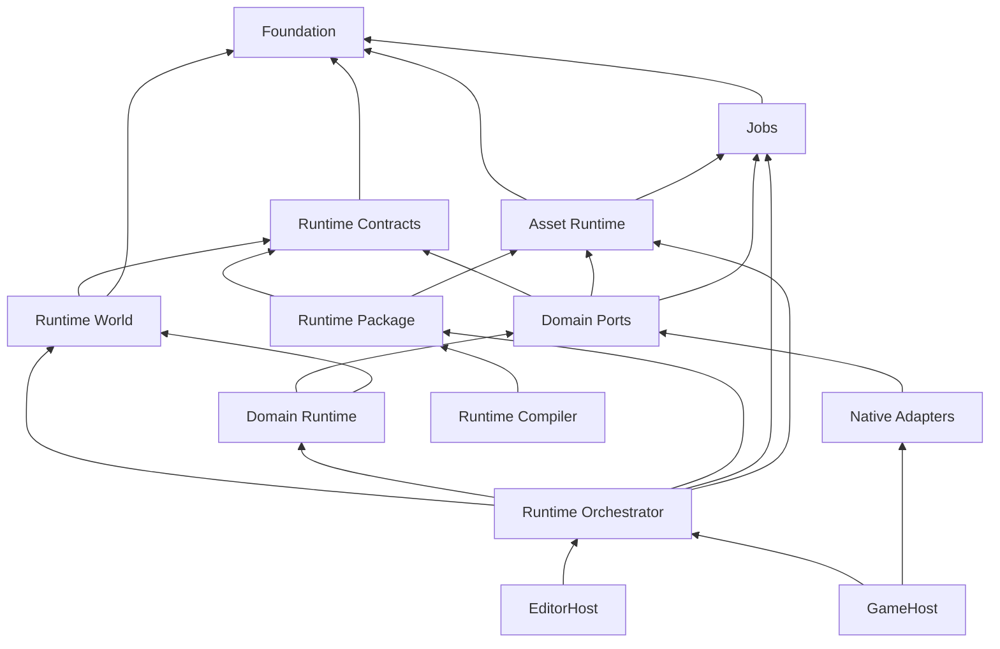

# Miraikanai Engine Runtime Scheduling／Lifetime Contract

- 文書ID: mirakan.arch.runtime-scheduling-lifetime
- 状態: review
- 正本範囲: Runtime tick／render phase、固定実行順、job dependency、command／event順序、state writer、handle／borrow／lease、Asset activation、Play／World／frame lifetime、fault recovery
- 非正本範囲: 共通memory／frame／queue budget、capacity、backpressure、測定閾値、Scale Envelope、Debug Store、Subsystem固有schema／Backend。各Owner文書を参照する
- 依存: [文書体系再編Decision](../decisions/2026-07-21-document-system-restructure.md)、[Product Plan](../00-product/product-plan.md)、[AI Security／Approval](../01-governance/ai-security-approval.md)、[AI Verification／Provenance](../01-governance/ai-verification-provenance.md)、[Core architecture](../02-foundation/core-architecture.md)、[Toolchain／Dependencies](../02-foundation/toolchain-dependencies.md)、[Executable contracts](../02-foundation/executable-contracts.md)、[Memory／Pointers](../02-foundation/memory-pointers.md)、[Project state](../03-authoring/project-state.md)、[Asset lifecycle](../03-authoring/asset-lifecycle.md)、[Gameplay programming model](../03-authoring/gameplay-programming-model.md)、[Native game module](../03-authoring/native-game-module.md)、[Performance／capacity](performance-capacity.md)、[Debugging／observability／replay](debugging-observability-replay.md)、[Physics](../05-simulation/physics.md)、[Navigation](../05-simulation/navigation.md)、[Animation](../05-simulation/animation.md)、[Render Graph](../06-rendering/render-graph.md)、[World](../06-rendering/world.md)、[LOD](../06-rendering/lod.md)
- 外部根拠検証日: 2026-07-21

## 1. 結論と所有境界

`RuntimeOrchestrator`だけがRuntimeのphase進行、sealed bufferのmerge、構造変更boundary、version activation、fault遷移を所有する。Subsystemは互いを直接呼ばず、型付きcommand、型付きevent、immutable snapshot、version付きAsset、検査済みasync resultだけで連携する。

本書はRuntime phase、tick、job dependency、lifetime identifierの唯一の正本である。共通memory／performance budget、queue capacity、backpressure、Scale qualificationは[Performance／capacity](performance-capacity.md)だけが決定する。Product PhaseとCapability maturityは[Product Plan](../00-product/product-plan.md)、MCD上の共有型構造は[Executable contracts](../02-foundation/executable-contracts.md)、Project transactionは[Project state](../03-authoring/project-state.md)が決定する。

Runtimeが保証する不変条件は次である。

- Worldへの書込は宣言済みownerが宣言済みphaseでだけ行う。
- structural mutationとversion activationは明示boundaryでtransactionalに行う。
- worker completion順、pointer、thread index、registration順をauthoritative順序へ使用しない。
- short-lived objectはlong-lived objectを所有せず、逆向き参照はhandleまたはleaseにする。
- tickがfaultした場合、そのtickのWorld snapshotをpublishしない。
- Presentation stateをauthoritative Gameplayへ逆入力しない。

## 2. Runtime moduleと依存DAG



矢印は依存元から依存先を示す。実target edgeはconfigure時に検査し、循環、未許可edge、Domain間直接依存を拒否する。

| target | 所有 | 禁止 |
|---|---|---|
| Runtime Contracts | typed command／event、phase ref、snapshot ref、共通value | Domain実装、vendor型、Editor |
| Runtime World | Entity location、component storage、Stable ID対応 | Renderer／Physics／Navigation等の実装 |
| Domain Port | Engine-owned interface、Domain value、validator | World実装、他Domain、vendor型 |
| Domain Runtime | query、System、resolver、command／event生成 | vendor型、phase外write、他Domain直接呼出し |
| Native Adapter | vendor変換、native object lifetime、conformance | World、Authoring、AI、他Adapter |
| Runtime Orchestrator | phase、merge、boundary、fault | vendor型、Editor widget |
| Runtime Package | immutable manifest、loader、Runtime schema | Authoring object、Editor、vendor型 |

`ComponentAccessManifest`は各Systemのread／write setと許可phaseを固定する。Orchestratorはpackage load時に実registrationと照合する。AdapterはWorldへlinkせず、Portが渡した値、handle、owned bufferだけを扱う。Rendering、Audio、VFXはWorld leaseを持たず、snapshotまたはPresentation commandを消費する。

Runtime packageは`GameSystemDependencyGraphV1`、`SystemImplementationSetV1`、Contract set hashを持つ。authoritative State Typeごとのactive ownerは厳密に一つでなければならない。Build／Cook edgeはDAG、same-tick write cycleと同phase callback再入は禁止する。次boundaryを越えるcycleは、[Performance／capacity](performance-capacity.md)のcapacity contributionとfailureを宣言し、Replay fixtureに合格した場合だけ許可する。

## 3. Process、Project、Play、Worldのlifecycle

Editor process stateは次のclosed state machineとする。

```text
Boot -> ProjectOpening -> Authoring -> PlayPreparing -> Playing
Playing -> PlayStopping -> Authoring
Authoring -> ProjectClosing -> Shutdown
Boot | ProjectOpening | PlayPreparing | Playing | PlayStopping | ProjectClosing -> Faulted
```

`Faulted`から同じPlay sessionへ復帰しない。Editor processを継続できる場合はjournalとfault evidenceを保全し、Projectを閉じたsafe shellへ戻す。Shipping GameHostのOS application lifecycleはPlatform Ownerが決定し、OS callbackはWorldを直接変更せずbounded lifecycle eventをOrchestratorへ渡す。

`PlayPreparing`はCommit済み`project_revision`を一つ固定し、Runtime package、System Graph、Implementation Set、World／Level／Topology、Target別Plan、Asset／Navigation closureを検証する。最初のactivation group全体がreadyになるまで`Playing`へ進めない。EditorHostはauthoritative child GameHostを同時に一つだけ管理する。Preview WorldはPresentation専用で、Save／Replay／Gameplay eventへ参加しない。

Play中のAuthoring変更は新revisionとして保存できるが、Runtimeへ自動適用しない。[Asset lifecycle](../03-authoring/asset-lifecycle.md)またはDomain Ownerが互換性を証明し、本書のboundaryへ提出したtyped activationだけを適用する。`PlayStopping`は新規Input、async request、Presentation submitを止め、worker join、queue seal、Save／Replay finalize、Domain lease release、World破棄、Host resource解放の順で進める。Runtime値をAuthoringへ戻す場合は[Project state](../03-authoring/project-state.md)の別ChangeSetとし、Runtime handle、native ID、GPU handle、internal slotを含めない。

object lifetimeは長い順に次とする。

```text
Process
  Project
    Authoring Revision / Asset Registry
      Play Session
        Runtime World
          Tick
            Phase
              Job / Callback
        Render Frame Slot
          GPU Queue Submission
```

短いlifetimeのobjectは長いlifetimeのobjectを所有しない。World破棄は全job、callback、snapshot consumer、Asset lease、GPU submissionの終了または明示fault-retire後だけ行う。

## 4. 60 Hz fixed tickとphase identifier

初期Production Runtimeのsimulationはexactly 60 Hz、`fixed_delta = 1/60 s`とする。別rateは新しいProduct／Architecture decision、Physics／Animation／Replay fixture改訂、全Target qualificationなしに追加しない。wall-clock蓄積から一render frameにつき最大4 stepまでcatch-upし、それ以上はclampしてcounterへ記録する。Game simulation threadがtickの開始と終了を所有し、workerはimmutable inputからprivate resultだけを生成する。

固定tickの完全なsequenceは次の表だけで定義する。

| 順序 | Phase ID | 実行内容 | 書込範囲 |
|---:|---|---|---|
| 0 | `T00_BoundaryApply` | sealed structural command、互換なAsset／GameplayDefinitionSet、検証済みLevel／Cell activationを適用 | 構造変更 |
| 1 | `T10_InputLatch` | device inputをtick付き`InputSnapshot`へ固定 | Input state |
| 2 | `T20_AsyncIntegrate` | deadline内のasync resultをversion検査して統合 | 宣言済みresult field |
| 3 | `T30_PrePhysics` | Gameplay、AI behavior、Cook済みrule／abilityを評価 | Simulation command |
| 4 | `T40_MotionIntent` | root motion proposal、character motor、kinematic targetを解決 | Physics input |
| 5 | `T50_PhysicsStep` | 2D／3D Physics fixed step | Physics Adapter内部 |
| 6 | `T60_PhysicsIntegrate` | native eventをnormalizeしdynamic transformをwrite-back | Physics owner field |
| 7 | `T70_PostPhysics` | contact／trigger配送、damage、quest、post-physics rule | 非構造fieldとcommand |
| 8 | `T80_AnimationFinalize` | blend、IK、pose、boundsをauthoritative transformから確定 | Animation state |
| 9 | `T90_PresentationBuild` | Audio、VFX、UI、camera向けbatchを生成 | Presentation buffer |
| 10 | `T100_ReplayCheckpoint` | Input、accepted async result、state hash、checkpointを記録 | Replay stream |
| 11 | `T110_Publish` | next-boundary commandをsealしimmutable snapshotをpublish | snapshot publish |

`TickPhaseId`のserialized値は順序に対応する`0x0000`～`0x000b`とする。`0xffff`はinvalidである。外部latch sourceは`InputDevice=0x0200`、`IoCompletion=0x0201`、`AudioCallback=0x0202`、`AssetWorker=0x0203`とする。追加、削除、順序変更、値変更はpublic behavior変更であり、ADR、schema migration、Replay fixture、全Domain conformanceを必要とする。

`StructuralCommand`は次boundary、`SimulationCommand<P>`は型が宣言するconsume phase、`PresentationCommand`はpresentation build前にseal済みなら同tick、それ以外は次presentation frameへ送る。`AuthoringChangeSet`をRuntime tickへ適用しない。任意phase名、同Subsystem同期再入、implicit last-write-winsを許可しない。

### 4.1 Clock domain、Pause、Gameplay Timer

`GameClockDomainProfileV1`、Pause、Gameplay Timerは本書だけが定義するRuntime contractである。Game System、UI、Audio、Debugging／observability／replay、Save ownerはこれらを消費し、別path、alias、local bool、ad-hoc counterで同じ意味を再定義しない。C1／C2の`fixed_tick_hz`は60だけを許可し、ProfileとReplay headerへ保存する。

```text
GameClockDomainProfileV1
  profile_id
  fixed_tick_hz: 60
  domains[]
  pause_policy_ref
  cinematic_policy_ref
  replay_policy_ref

ClockDomainEntryV1
  domain: gameplay | physics | authoritative_animation | cinematic | presentation | ui | audio | real_time | async_io
  source: fixed_tick | render_delta | monotonic_time | explicit_step
  paused_behavior: freeze | continue | explicit_step_only

PausePolicyV1
  policy_id
  pause_command_ref
  resume_command_ref
  pause_state_owner: play_session
  audio_snapshot_ref
  input_context_ref
  async_completion_policy: queue_until_resume

GamePauseCommandV1
  command_id
  operation: pause | resume
  pause_policy_ref
  requested_tick
  apply_tick

GamePauseStateSnapshotV1
  pause_policy_ref
  clock_profile_ref
  state: running | paused
  applied_tick
  owner: play_session

GameplayTimerDefinitionV1
  timer_definition_id
  clock_domain: gameplay | authoritative_animation | cinematic
  duration_ticks: uint32
  repeat_policy: one_shot | fixed_interval
  repeat_interval_ticks: optional uint32
  max_fire_count: uint32
  fire_event_ref
  save_policy: transient | owner_state

GameplayTimerCommandV1
  command_id
  operation: schedule | cancel
  timer_definition_ref
  owner_ref
  owner_generation
  requested_tick
  instance_id

GameplayTimerSnapshotV1
  instance_id
  timer_definition_ref
  owner_ref
  deadline_tick
  fire_count
  state: scheduled | completed | cancelled | owner_invalidated
  generation

GameTimeEffectPolicyV1
  policy_id
  mode: hit_stop | rational_dilation
  affected_domains[]
  activation_owner_ref
  duration_contract_ref
  input_policy_ref
  audio_policy_ref
  presentation_policy_ref
  save_replay_policy_ref
```

通常Pauseのownerは`play_session`だけである。Pause／resumeは`GamePauseCommandV1`をReplayへ`apply_tick`とともに記録し、そのapply tickのboundaryで一括適用する。通常Pauseは`gameplay`、`physics`、`authoritative_animation`を同じtick boundaryでfreezeし、`ui`と`real_time`をcontinueする。`cinematic`、`presentation`、`audio`はProfileで明示し、Gameplay timer、Weapon cadence、Encounter、authoritative VFX cueをwall clock、render frame、Audio sampleへ接続しない。`async_io`はcompletionまでcontinueできるが、World activation、authoritative Command適用、State owner mutationはresume tick boundaryまでqueueする。Pause中のAudioは`audio_snapshot_ref`を原子的に適用し、UI cueと許可されたmusicだけを継続できる。

Saveはauthoritative elapsed tick、clock Profile ref、Game Flow stateを保存し、monotonic time、render delta、pause中の実時間をGameplay stateへ保存しない。ReplayはPause／resume Commandとapply tickを記録し、Pause区間のauthoritative state hashが不変であることを検証する。`GamePauseStateSnapshotV1`はその検証対象のimmutable projectionであり、任意Subsystemはlocal boolで停止状態を所有しない。Debug stepは通常Pauseと別の`explicit_step_only` policyであり、Shipping Game pauseからDebug権限を取得しない。

`capability.gameplay.timer.c1`は2D／3D共通の決定論的Schedulerである。`duration_ticks`は1～`2^31-1`とし、`fixed_interval`は正の`repeat_interval_ticks`と1～1,000,000の`max_fire_count`を必須とする。C1 reference Profileはactive timer 65,536、1 tickの発火4,096をHard上限とする。発火順は`deadline_tick, owner StableId, timer_definition_id, instance_id`の昇順でcanonicalizeし、同tickの登録順、container順、worker完了順を使用しない。

Schedule／cancelは`T30_PrePhysics`で確定する。各T30はowner invalidation、cancel、schedule、deadline fireの順に処理し、各group内を前述canonical keyとCommand IDで整列する。deadline tickと同tickのcancelはfireより先に確定し、cancelled timerをfireしない。deadline fireはその期限tickのT30で通常のtyped Gameplay Eventとして発行する。deadline handlerが同じT30で自身または他timerをscheduleしても、recursive same-tick schedulingを許可しない。

次のrejectはtyped failureであり、silent drop、次tickへの無記録繰越、wall clock fallbackを行わない。

| reject code | condition |
|---|---|
| `stale_owner_generation` | `owner_generation`がcurrent owner generationと不一致 |
| `unknown_timer_event` | `fire_event_ref`が登録済みtyped Gameplay Eventでない |
| `deadline_tick_overflow` | `requested_tick + duration_ticks`がdeadline表現域を超過 |
| `active_timer_capacity_exceeded` | active 65,536件で65,537件目をschedule |
| `fire_per_tick_capacity_exceeded` | 同一tickで4,097件目のdeadline fireが必要 |
| `invalid_timer_clock_domain` | `clock_domain`が`gameplay`、`authoritative_animation`、`cinematic`以外 |
| `recursive_same_tick_schedule` | deadline fire中に同じT30へtimerを再帰schedule |

`save_policy=owner_state`のtimerはownerのSave fieldとしてremaining ticks、fire count、Definition ref、generationを保存し、load時のwall clockまたは現在時刻から再計算しない。Replayはschedule／cancel Commandとfire Eventを記録し、deadline、canonical order、state hashを照合する。UI countdownは`GameplayTimerSnapshotV1`のprojectionであり、UI animation終了callbackをauthoritative fire条件にしない。

C1のProduction対象はPauseによるdomain停止だけである。Hit-stop、slow-motion、domainごとのrational dilationは`GameTimeEffectPolicyV1`のC0 schemaとしてowner、対象domain、Save／Replay、Audio／VFX／Input policyを固定するが、C2の個別CapabilityをQualificationするまで有効化しない。任意のfloat time scaleをPhysics `delta_time`やGameplay timerへ直接乗算しない。

## 5. Render frame、Audio、Asset activation

render frame sequenceは次とする。

| 順序 | Render phase ID | 契約 |
|---:|---|---|
| 0 | `R00_AcquireSnapshot` | publish済みの完全なsnapshotをlease |
| 1 | `R10_PromoteAssets` | interface-compatibleなready generationをframe boundaryでactivate |
| 2 | `R20_ExtractCullLod` | visible set、LOD、material packetを生成 |
| 3 | `R30_CompileRenderGraph` | resource lifetime、alias、barrier、queue依存を確定 |
| 4 | `R40_Record` | worker-local command listへ記録 |
| 5 | `R50_Submit` | submission dependencyを接続してsubmit |
| 6 | `R60_Present` | current surface generationへpresent |
| 7 | `R70_Retire` | last-use submission完了objectだけを解放 |

`RenderPhaseId`のserialized値は順序に対応する`0x0100`～`0x0107`とする。RenderingはRuntime Worldへ書き戻さず、visibility、occlusion history、temporal historyをSave／Replay hashへ含めない。frames-in-flightと各buffer容量は[Performance／capacity](performance-capacity.md)、Render Graph resource semanticsは[Render Graph](../06-rendering/render-graph.md)が所有する。

Audio control threadがvoice lifecycle、routing、stream refillを所有する。audio callbackはpreallocated recordまたはPCM ringへ値を渡すだけで、allocation、file I/O、blocking、World／AI呼出しを行わない。Gameplay通知はcallbackから直接配送せず、外部latch sourceとして次のasync integrationへ渡す。

Asset activationはdependency closure単位の`AssetGenerationId`を使う。CPU payload、GPU upload、Physics／Navigation payload、Audio decodeを含むclosureがreadyになるまでlive bindingを変えない。Simulation用generationはtick boundary、Rendering専用generationはrender promotion boundary、Audio専用generationはaudio control block boundaryでactivateできる。consumerはtransaction途中にlogical Assetを再resolveせず、固定したversion leaseを使う。非互換時は旧generationを維持し`restart_required`を返す。

## 6. Cross-subsystem orderとstate authority

同じfieldへ複数Subsystemがwriteしてはならない。blendが必要なら入力fieldを分け、一つのresolverが最終fieldを所有する。

| state | authoritative writer | consumer rule |
|---|---|---|
| Static entity transform | boundary structural transaction | Simulation／Presentationはread-only |
| Dynamic rigid-body transform | Physics integration | Gameplayはcommandだけ提出 |
| Kinematic transform | Character motor proposalをPhysicsが解決 | Animation／Gameplayはresolved値を読む |
| Non-physics gameplay transform | owner Gameplay System | Rendererはsnapshotだけ読む |
| Skeletal pose | Animation finalize | ragdollは別input fieldを提出 |
| UI layout transform | UI layout owner | Rendererはsnapshotだけ読む |
| Render interpolation／GPU particle | Presentation owner | authoritative Worldへ戻さない |

Physics／Navigation／Animationのcross-subsystem順は次の不変条件を持つ。

- motion intentがroot-motion intervalを一度固定し、Physicsへtargetを提出する。Animation finalizeは同じintervalを再利用しclockを二重advanceしない。
- 2Dと3D Physicsを併用する場合はgenerated Producer Registryのcanonical system orderで逐次step／joinし、同時にvendor Worldをstepしない。
- native Physics callbackはWorldを変更せず、copied valueをintegrationでStable ID／generation検査後にnormalizeする。
- Navigation obstacle inputは完了済みPhysics snapshotから取り込み、live Physics objectを参照しない。Nav resultはrequest時のmesh versionとowner generationが一致する場合だけ統合する。
- Animationはresolved transformからpose／boundsを確定し、Physics Adapterは最終bone poseへ直接writeしない。ragdoll inputは別fieldを通してAnimation ownerが合成する。
- root motion、Physics event、Navigation result、Animation eventはcommand／eventのcanonical orderへ参加し、vendor callback順を保持しない。
- Physics、Navigation、Animation固有のshape、solver、path、graph、pose、retarget、memory schemaはそれぞれ[Physics](../05-simulation/physics.md)、[Navigation](../05-simulation/navigation.md)、[Animation](../05-simulation/animation.md)が所有する。

Audio、VFX、camera、render occlusion、Presentation LODをGameplay authorityの入力にしない。Gameplayに必要なexplosion、visibility、damage volumeはauthoritative Domain componentとして別に表す。

## 7. Runtime data storageとstructural transaction

Runtime Worldの標準storageはarchetype chunk方式とし、chunk payload sizeは[Memory／PointersのEngine-owned正本値](../02-foundation/memory-pointers.md#22-既存engineから採用する教訓)をexactに消費して本書で再定義しない。先頭64-byte alignment、Component列はSoA、location tableは`EntityHandle -> {archetype_id, chunk_id, row, generation}`とする。iterationのcanonical orderは`archetype_id`、`chunk_id`、rowの昇順である。Component addressはchunk移動で無効になる。

頻繁に走査するscalar／small vectorをhot component、debug name、Editor metadata、長いstring、可変長payloadをcold tableまたはAssetへ置く。256 byteを超えるComponent、可変長data、non-trivially relocatable objectはchunkへ直接置かずDomain-owned typed handleを格納する。Entityごとのvirtual `Update()`と個別heap objectを標準経路にしない。

World queryはmove-onlyな`ReadLease<Component...>`または`WriteLease<Component...>`を返す。write exclusion keyは`{component_type_id, chunk_id, half-open row range}`である。schedulerがcanonicalに非重複rangeを割り当てた場合だけparallel writeを許可する。leaseは生成phaseとWorld epochを持ち、structural mutation、phase終了、tick終了、World破棄で失効する。lease、span、referenceをmember、event、job packetへ保存しない。

Structural command batchは、全handle、precondition、conflict、destination容量を先に検査・予約し、live location tableを変更せずstaging mutation planへ構築する。全command成功後の単一commit pointでchunk owner、location table、World epochをpublishする。commit前の失敗はstagingだけを破棄し、live Worldを変更しない。

大量配置、burst生成、Simulation LODは[Performance／capacity](performance-capacity.md)の`ProjectScaleEnvelopeV1`とTarget別Representation Planから解決する。World cell fieldは[World](../06-rendering/world.md)、LOD strategy fieldは[LOD](../06-rendering/lod.md)が所有し、本書はactivation boundaryとstate ownerだけを決定する。

## 8. Handle、borrow、lease、job lifetime

Runtime handleはtypedな`index32 + generation32`とする。0値はinvalid、valid index／generationは1から始め、slot再利用でgenerationを増やす。wrapするslotは永久retireする。handleはobjectを所有せず、Source／Saveへ保存しない。resolveはowner context内で`Result<ReadLease<T>>`またはimmutable viewを返し、null objectやnative pointerへ暗黙変換しない。

| borrow／lease | 有効範囲 | 無効化 |
|---|---|---|
| Component lease | 現在phase | structural mutation、phase終了、World破棄 |
| CPU frame span | current frameとconsumer job | arena reset |
| Render frame span | corresponding frame slot | 全submission完了後のreset |
| Scratch span | current scope／job | scope／job終了 |
| Physics native view | Adapter callback | callback return／step終了 |
| Nav query temporary | query lease | lease返却／mesh version retire |
| Audio callback buffer | callback | callback return |
| Asset payload lease | lease scope | release後。version swapだけでは失効しない |

Job packetに許可するのはowned value、immutable snapshot、generation handle、Asset version handle、cancellation token、job専用memory resourceだけである。World pointer、Component reference、borrowed span、Gameplay State内部pointer、vendor object pointerをcaptureしない。Job開始時とresult統合時の二回、owner generationとversionを検査する。

Asset Registryがpayload versionを単一所有し、旧versionはlive logical bindingなし、CPU lease 0、全GPU last-use submission完了、Audio／Physics／Navigation lease 0、build／debug pinなしの全条件後にretireする。GPU wrapperはmove-onlyで、descriptor／bindingはresourceを所有しない。destroy requestはretire recordを作るだけで、last-use submission完了前にnative object、heap range、descriptor rangeを再利用しない。

## 9. Artifact、invalidation、hot reload

Derived artifact identity、canonical hash、Tool／dependency pinは[Asset lifecycle](../03-authoring/asset-lifecycle.md)と[Toolchain／Dependencies](../02-foundation/toolchain-dependencies.md)が所有する。本書はRuntimeでのversion integrationだけを決定する。

Runtime Compilerはdependency closureを一つのgenerationへstagingし、schema、cross-reference、Target compatibility、Domain conformance、capacityを検証する。GPU upload、Audio decode、Physics／Navigation buildを含むclosure全体のreadyを確認してmanifestをpublishする。この時点ではlive consumer bindingを変更しない。各consumerは本書のactivation boundaryでgeneration単位にleaseする。一件でも失敗した場合は旧manifestと旧artifact setを維持する。

各runtime interfaceはDomain Ownerのcanonical schemaからhashを生成する。同じlogical Assetでinterface hashが一致する場合だけin-place activation候補とし、不一致はrestartを要求する。Texture／mesh payload、Material、static collider、Navmesh、GameplayDefinitionSet等の個別compatibility predicateは各Ownerが決定し、本書はpredicate結果を上書きしない。Native Game ModuleをPlay中にunloadしない。

## 10. Message merge、async acceptance、randomness

command／eventのcanonical delivery keyは`{tick_id, producer_phase_id, producer_system_id, producer_sequence}`の昇順である。single-thread producerはtick開始でsequenceをresetする。parallel producerはprivate bufferに`logical_work_id`と`local_sequence`を付け、system seal時にその組でmergeして最終sequenceを再採番する。memory address、worker index、completion順、OS schedulingを順序keyにしない。

各command schemaは`combine_policy = single | sum | min | max | ordered_list`と`conflict_key`を宣言する。`single`の競合はtick fault、`sum`と`ordered_list`はcanonical message順、`min`／`max`はnon-finite拒否後に適用する。各event型はdelivery phaseを一つ持ち、そのphase中または後に生成されたeventは次tickへ送る。配送中listへhandler生成eventを挿入しない。

async requestは`request_id`、request／deadline tick、owner handle、input revision、target versionを持つ。integration開始時にcompletion queueを一度latchし、requestの次tick以後、request ID順に統合する。deadline超過、cancel済み、owner generation／revision／version不一致を破棄する。Replayはresult内容とaccept tickを記録し、worker完了時刻を再現条件にしない。

authoritative randomnessの共有Contract `DeterministicRngV1`は本書だけが所有するversion付きEngine-owned deterministic RNGであり、Project seed、System stream、job-local logical work IDから導出する。worker indexやsecurity nonceをstream seedに使わない。algorithm parameter、state encoding、Save migrationはMCD fixtureで固定し、変更は新versionとして追加する。credential、session nonce、UUIDには[AI Security／Approval](../01-governance/ai-security-approval.md)とPlatform crypto ownerのCSPRNGを使う。

queueのentry／arena capacity、critical reserve、overflow／drop／delay policyは[Performance／capacity](performance-capacity.md)が所有する。本書のcanonical merge keyとowner fault ruleを、capacity超過を隠すため変更してはならない。

## 11. Failure、recovery、atomicity

| failure | immediate behavior | recovery |
|---|---|---|
| invalid handle／lease | access拒否、typed diagnostic | current ownerから再resolve |
| authoritative queue fault | tick非publish | Play session fault、Replay evidence保全 |
| presentation loss | authoritative state継続 | capacity ownerのfallback／counter |
| stale async／Asset result | result破棄 | current revision／versionで再要求 |
| activation closure failure | partial publish禁止 | last valid generation／Level維持 |
| gameplay evaluation failure | unsealed delta／command破棄 | deterministic faultをReplayへ記録 |
| device／surface failure | new submit停止またはsurface分離 | Platform／Renderer ownerのrecovery |
| Save failure | in-memory state変更なし | last valid target／backup／journalを検証 |
| Scale plan failure | new plan非publish | Sourceとlast valid planを維持 |

Gameplay evaluationはimmutable state view、private command buffer、state-delta journalを使う。Capability、state schema、command semantics、bounded executionを全て満たした場合だけ一transactionとしてsealする。失敗時はそのevaluationのunsealed outputを全破棄し、既に完了した前phaseの状態を暗黙rollbackしたように扱わない。

Save schemaとfile operationの構造はProject／Platform ownerが決定する。Runtime Save serviceは同時reader／writerを許さず、temporary write、flush、再読込検証、atomic replaceまたはrecoverable journal、target再検証、commit recordの順で処理する。Runtime handle、pointer、vendor IDをSave validationで拒否する。起動時はhashとschemaがvalidな最新generationだけを選び、同generationの競合を自動選択しない。

Play fault、device loss、Save failure、process crashでもSource revisionとlast valid packageを削除しない。recoveryがSource meaningを変える場合は[Project state](../03-authoring/project-state.md)の別ChangeSetと[AI Security／Approval](../01-governance/ai-security-approval.md)の承認を必要とする。

## 12. Observability接続

Runtimeはphase、System、job、command／event、queue、handle、lease、Asset generation、faultのtyped measurement pointを発行する。Debug Session、Event envelope、Store／Index／Query、Pause／Watch、Replay UI、Crash bundle、AI diagnosisは[Debugging／observability／replay](debugging-observability-replay.md)が所有する。共通Budgetとmeasurement semanticsは[Performance／capacity](performance-capacity.md)、Evidence envelopeとProvenanceは[AI Verification／Provenance](../01-governance/ai-verification-provenance.md)が所有する。

SubsystemはDebug Store、Editor、AIへ依存せず、generated Debug contractを通してbounded record、counter、snapshotを発行する。Shippingでsource path、prompt、personal data、credentialをruntime traceへ含めない。Instrumentation lossをauthoritative event lossと混同せず、gapとして記録する。

## 13. Test、CI、qualification

最低限、次を自動検証する。

- fixed tickとrender sequence、serialized ID、禁止再入、consume／delivery phase。
- exactly-one State owner、System dependency DAG、same-tick cycle拒否、Implementation Variant同値。
- structural transactionのpreflight／commit atomicity、canonical iteration／merge。
- handle generation、wrap retire、random invalid handle、borrow epoch、arena reset後の失効。
- Physics／Navigation／Animation order、native callback非mutation、stale result拒否、root-motion single advance。
- Asset closure、generation非混在、boundary activation、failure時last valid維持。
- deterministic Input／async accept／RNGから同じReplay hash。
- Play stop、fault、Save、device／surface、queue、cancel raceのfailure injection。
- Platform lifecycleがWorld lifetimeとsurface lifetimeを混同しないこと。

CIはtarget依存DAG違反、Manifest外access、phase外structural mutation、event／commandへのpointer／unbounded payload、raw owning pointer、一般heap fallback、artifact hash不一致、Runtime handleのSource／Save保存を拒否する。performance／memory／queueの合否は[Performance／capacity](performance-capacity.md)、test Evidenceの形式は[AI Verification／Provenance](../01-governance/ai-verification-provenance.md)へ委譲する。

## 14. AI／C++適用とPhase 0 artifacts

AI、GameplayDefinition、Native Game Module、Engine Systemは同じphase、State owner、component access、command／event、lifetime、faultを使う。実装方式を理由に新phase、独自thread pool、直接World write、vendor pointer、unbounded queueを追加しない。新しいphase、queue class、thread role、lifetime classの提案はArchitecture Changeとして扱う。

大量要求は個数だけで拒否せず、[Performance／capacity](performance-capacity.md)のScale Envelope、fidelity floor、Target別Representation Planへ解決する。Presentation-only最適化でGameplayの敵数、Damage、collision、goal、timingを変えない。C++最適化候補も同じSource revision、fixture、Replay、budget、fault Gateで比較する。

Product Phase 0に必要な本書所有artifactは次である。

1. Runtime Contracts target、Domain Port／Runtime／Adapter依存検査。
2. tick／render phase IDとgenerated conformance table。
3. Component access manifest、System dependency graph、exactly-one owner fixture。
4. command／event canonical merge、consume／delivery、async acceptance fixture。
5. generation slot、handle、lease、borrow epoch、retire fixture。
6. structural transactionとWorld storage microfixture。
7. Asset generation activationとlast-valid recovery fixture。
8. deterministic Input／async result／RNG／Replay integration fixture。
9. Physics／Navigation／Animation cross-subsystem ordering fixture。
10. Play start／stop、fault、Save、Platform lifecycle conformance。

memory／queue容量、benchmark、Scale、observability artifactは各ownerのPhase 0 requirementを参照し、本書へ複写しない。Product Phaseの順序やmaturityを本書で再定義しない。

## 15. 明示的に採用しないもの

- Subsystem間の直接同期呼出し、同phase再入、callbackからのWorld mutation。
- worker completion順、pointer、OS thread ID、registration順によるauthoritative順序。
- Runtime WorldとAuthoring object、Undo buffer、Editor hierarchyのpointer共有。
- lease、span、native object、GPU addressのjob capture／event／Save格納。
- partial Asset／Level activation、incompatible live swap、Play中Native Module unload。
- visibility、LOD、Audio、VFX、GPU resultからGameplay authorityを決めること。
- faultしたtick、部分structural transaction、不完全snapshotのpublish。
- Runtime固有のProduct Phase、共通Budget、Debug Store、Domain schemaの再定義。
