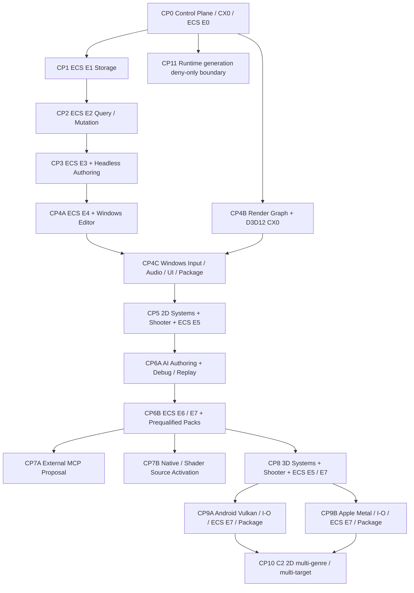

# Product Critical Path Execution Plan

> **For agentic workers:** REQUIRED SUB-SKILL: Use `superpowers:test-driven-development` for each implementation task and `superpowers:verification-before-completion` before recording a lifecycle transition. This plan is executable only after the Control Plane bootstrap approval is valid.

**Goal:** Product PlanのPhase 0～9に登録されたWork Packageを、Control Plane→ECS→Headless Authoring→Windows Editor→2D First Playable→AI MVP-A→External Agent／Project Source→3D First Playable→Mobile→C2 2D→deny-only Runtime generation boundaryの順で、推測なしに実装・検証できるtask-level DAGへ落とす。

**Authority:** [Product Plan §11](../architecture/00-product/product-plan.md#11-product-execution-registries)がPhase、Work Package、Capability、Target、Fixture、Gate、scheduling stateの唯一の正本である。本書は実行順、artifact root、test、Receipt、rollbackを定めるconsumerであり、Product registry行を複写してActivationさせない。

**Initial condition:** 本書作成時点のWork PackageはProduct Planに記載された`declared | deferred`のままであり、実装済み、qualified、production、shippingを意味しない。CX2、CX3、C2 3Dは各Decision Gateが`blocked`のため実行対象外である。

## 1. Execution truth and stop rules

1. 実行開始時にcurrent Product Registry hashをread-backし、本書記載IDの集合と差があれば`diagnostic.architecture.baseline-mismatch`で停止して本書を更新する。古い行へbest effortで合わせない。
2. `scheduling_state=ready`へ進めるのは、全`requires_work_package_refs[]`が`complete`、Owner文書がapproved、有効な`ControlPlaneBootstrapApprovalV1`がある場合だけである。
3. Work Package完了はappend-only `WorkPackageLifecycleRecordV1`だけに記録する。Product RegistryへReceipt refやRequirementを追記しない。
4. Phase completionはそのPhaseの`PhaseFixtureBindingRegistryV1.exit_gate_refs[]`だけが判定する。Work Packageの`provided_fixture_refs[]`だけではPhaseを完了しない。
5. required／optional Capability Target bindingにexact `CapabilityTargetActivationV1`行がなければaggregate前に停止する。missingを`not_activated`へ補正しない。
6. Source、Candidate、Contract、Toolchain、Target、Device、policy、Receipt freshnessが同じclosureへ閉じないEvidenceをjoinしない。
7. failed／cancelled taskはSourceとlast-valid Project revisionを不変にし、staging／intermediateだけを破棄または隔離する。前回Qualified artifactへの明示fallback以外を自動選択しない。
8. calendar日数、人数、費用は計画値を発明しない。§3のrelative sizeと、同じtask classで得たactual lead time／failure rate／review latencyからだけ予測を更新する。
9. Portable Work Packageの`complete`とTarget別Capability Activationを同一視しない。Ownerが定義した全Targetのcontract／cross-compile Receiptでportable WPを完了できても、Windows実機ReceiptでAndroid／Appleの`CapabilityTargetActivationV1`を昇格させない。実機利用可能性はPhase 7のexact Target gateが別に所有する。

## 2. Critical path DAG



CP7AとCP7Bは同じPhase 5に属するが、Proposal-only external clientとCode owner付きSource生成を相互依存させない。CP9AとCP9Bは共通portable contractまでを共有し、Device／backend／package／ReceiptをTarget間で流用しない。CP11はC2へ依存しないdeny-only境界である。

## 3. Work unit and estimation contract

各implementation taskは次を必須FieldとしてPlanning artifactへ記録する。

```text
CriticalPathTaskV1
  task_plan_id
  work_package_refs[]
  product_registry_sha256
  owner_document_refs[]
  prerequisite_lifecycle_record_refs[]
  baseline_receipt_ref
  target_refs[]
  artifact_roots[]
  positive_fixture_refs[]
  negative_fixture_refs[]
  build_driver_profile_refs[]
  verification_commands[]
  completion_receipt_policy_ref
  rollback_and_last_valid_ref
  size_band
  blocked_diagnostic_ref?
```

Size bandはcalendar estimateではない。

| Band | Mechanical definition |
|---|---|
| S | 1 WP、1 Owner、1 Target、external dependency／device／migrationなし |
| M | 2～4 WPまたは2 Owner、1 Target、bounded migrationあり |
| L | 5～9 WP、複数Owner、またはTarget device／package／Code owner gateあり |
| XL | 10件以上のWP、複数Target join、Product Phase aggregate、またはexternal program／shipping gateあり |

実測後は`{completed task class, size band, changed source lines, fixture count, review cycles, lead time, rework}`をReceiptへ記録する。別classの速度を換算せず、minimum 3件の同class sampleがない間はcalendar予測を`unknown`とする。

## 4. Common artifact and verification contract

### 4.1 Artifact roots

| Concern | Canonical root |
|---|---|
| shared contract | `schemas/mirakan/`、ECS contractは`schemas/runtime/ecs/` |
| engine C++ | `engine/<domain>/<component>/`。各Componentは`CMakeLists.txt`、`include/`、`source/`、`tests/`、hot pathなら`benchmarks/` |
| authoring | `authoring/{model,changes,validation,assets,build}/` |
| editor | `editor/{app,ui,shell,docking,panels,workspaces,semantics,recovery}/` |
| host/service | `hosts/`、`orchestrator/`、`integrations/` |
| test | `tests/{contracts,integration,conformance,security,performance,fixtures}/` |
| Game Project source | `source/{assets,worlds,gameplay,ui,localization,native}/`。Project Shader sourceは`ProjectShaderModuleV1.source_files[].project_relative_path`としてSource root内へ閉じ、absolute／parent traversalを拒否する |
| generated/candidate/package | Game Projectの`derived/`、`intermediate/`、`staging/`、`packages/`。Sourceへ生成物を置かない |

### 4.2 Test-first order

各taskは次の順だけを許可する。

1. Owner Requirementとsuccess／failureをread-backする。
2. positive、boundary、single-cause negative、cancel／rollback testを作り、未実装理由でfailすることを確認する。
3. 最小のOwner componentへ実装する。
4. Unit→contract→integration→target/device→packageの順で広げる。
5. current CandidateからReceiptを発行し、artifact hashとtest inputをread-backする。
6. independent review後に`WorkPackageLifecycleRecordV1`をappendする。

### 4.3 Common commands

Control Plane実装後は、各task固有testに加えて次を実行する。

```powershell
npm ci --prefix tools/architecture_lint --ignore-scripts --offline --no-audit --no-fund
npx --prefix tools/architecture_lint tsc --build --force --singleThreaded
node --test tools/architecture_lint/test/*.test.mjs
node tools/architecture_lint/dist/main.js check
node tools/architecture_lint/dist/main.js generate-index --check
git diff --check
```

C++／package command lineはTargetごとのexact `BuildDriverProfileV1`から生成し、手入力の別Generator／Compilerへ差し替えない。CTestは各Work Package IDをそのままLabelに持たせ、`ctest --test-dir <resolved build tree> --label-regex '^<exact work_package_id>$' --output-on-failure`をReceiptへ記録する。`<resolved build tree>`と`<exact work_package_id>`は実行前にProfile／Registryから展開した値を保存し、literal placeholderのまま実行しない。

## 5. Phase 0: Foundation and ECS E1/E2

### CP0: Approved baseline, CX0, Math/Memory, Scheduling, ECS E0

**WP:** `wp.architecture.control-plane`、`wp.foundation.cpp23-cx0`、`wp.foundation.math-memory`、`wp.runtime.scheduling-core`、`wp.runtime.ecs-e0`。

**Existing executable plans:** [Control Plane](2026-07-22-architecture-evolution-control-plane-implementation-plan.md)、[ECS E0](2026-07-22-runtime-ecs-e0-implementation-plan.md)、[D3D12/CX0](2026-07-22-d3d12-backend-implementation-plan.md)。重複実装計画を作らず、三計画のbaseline／Toolchain／Receipt hashを同じCandidateへ束縛する。

- Positive: `fixture.product.headless-contract-smoke`、E0 contract round-trip、deterministic scheduling、CX0 header build。
- Negative: bootstrap approval差、dirty tree、old Work Package Field、invalid entity handle、scheduler dependency cycle、Production `.ixx`混入。
- Completion: 各WPのfresh contract Receipt＋`gate.product.phase-0-headless-contract`。CX1 probeはCX0 completionに数えない。
- Rollback: Control Plane materialization前のapproved baselineとCX0 Headerをlast-validに維持する。
- Size: XL。既存三計画を別Candidateで並行完了させない。

### CP1: ECS E1 storage

**WP:** `wp.runtime.ecs-e1-storage`。**Prerequisite:** `wp.runtime.ecs-e0`のcurrent lifecycle stateが`complete`。

- Artifacts: `engine/runtime/ecs/` storage/archetype/chunk/location components、`tests/contracts/runtime_ecs/`、`tests/performance/runtime_ecs/`。
- Positive: create/destroy、archetype transition、16 KiB chunk、generation retirement、deterministic layout、allocation failure rollback。
- Negative: index 0、stale generation、oversize/non-trivial component、double free、chunk exhaustion、partial move、iteration中即時structural mutation。
- Completion: all required Targetsのcontract build、sanitizer/stress、layout golden、E1 lifecycle Record。性能値はcalibrated RequirementなしにProduction保証へ使わない。
- Rollback: failed batch前後のlive digest一致、E0 contract artifactを維持。
- Size: L。

### CP2: ECS E2 query and mutation

**WP:** `wp.runtime.ecs-e2-query-mutation`。**Prerequisite:** E1 lifecycle Record。

- Artifacts: ECS query normalization、access manifest、lease、command merge、structural commit components。
- Positive: query cache、readonly/write lease、canonical iteration、deferred command batch、conflict-free parallel access。
- Negative: aliasing write、undeclared access、lease escape、thread-completion-order merge、reentrant structural mutation、batch partial commit、stale query plan。
- Completion: cross-language contract/golden、concurrency stress、cancel、deterministic replay digest、E2 lifecycle Record。
- Rollback: current World root publicationを変更せずbatchを破棄する。
- Size: L。

Phase 0 exitはCP0～CP2の全WPがcompleteで、同一Candidateの`gate.product.phase-0-headless-contract` fresh Receiptがある場合だけ成立する。

## 6. Phase 1: ECS E3 and Headless Authoring

### CP3: Cook/load and authoring transaction

**WP:** `wp.runtime.ecs-e3-cook-load`、`wp.authoring.project-state-headless`、`wp.authoring.asset-save-headless`、`wp.authoring.headless-core`。

- Artifacts: ECS world image／loader、`authoring/model`、`authoring/changes`、`authoring/assets`、`authoring/build`、Project transaction/recovery tests。
- Parallelism: E3 world image testsの後、Project State transactionとAsset/Save importerを別componentで並行可能。`wp.authoring.headless-core`がjoinする。
- Positive: new project→typed change→commit→cook→load→save→reload、二回cook byte一致、manual authoring round-trip。
- Negative: stale revision、unknown Field、missing Asset、corrupt section、cancel mid-import/cook、disk full、partial commit、recovery snapshotをSource扱いする試行。
- Completion: `fixture.product.authoring-transaction`、`gate.product.phase-1-authoring-transaction`、4 lifecycle Records。
- Rollback: atomic transaction前のProject revision、last-valid Cook image、Source Assetを維持。Derived／intermediateは再生成する。
- Size: XL。

## 7. Phase 2: Windows Editor Runtime

### CP4A: ECS E4 and Editor host

**WP:** `wp.runtime.ecs-e4-game-system`。

- Artifacts: Game System binding、Runtime contracts/orchestration、Editor Host bridge、system discovery fixtures。
- Positive: typed System registration、phase assignment、Editor play start/stop、World teardown/reload。
- Negative: duplicate System ID、undeclared component access、phase cycle、callback後handle保持、hot-reload partial closure。
- Completion: E4 lifecycle Record; Editor aggregateはCP4B/CP4C後までcompleteにしない。
- Rollback: GameHost processを破棄しEditor／Source revisionを維持。
- Size: L。

### CP4B: Render Graph and D3D12 CX0

**WP:** `wp.rendering.render-graph-core`、`wp.runtime.d3d12-backend`。

- Existing plan: [D3D12 backend implementation](2026-07-22-d3d12-backend-implementation-plan.md)。public surfaceは`engine/rendering/d3d12/include/mirakan/rendering/d3d12/backend.hpp`だけを使う。
- Positive: WARP conformance、qualified hardware smoke、resource lifetime、barrier/queue trace、device-loss recovery。
- Negative: undeclared resource、use-after-retire、wrong device generation、descriptor exhaustion、device removal、Production `.ixx`、baseline required Field欠落。
- Completion: CX0 Development/Test/candidate/internal Technology Preview Receipt。Release/CX3 Receiptとして扱わない。
- Rollback: headless authoringを維持しWindows visual Targetだけをnot activatedにする。
- Size: XL。

### CP4C: Portable I/O/UI, Windows adapters, package, aggregate

**WP:** `wp.platform.input-core`、`wp.platform.audio-core`、`wp.platform.ui-core`、`wp.platform.input-windows`、`wp.platform.audio-windows`、`wp.platform.ui-windows`、`wp.platform.windows-package`、`wp.product.editor-runtime-windows`。

- Parallelism: portable Input/AudioはE4後に並行、UI coreは両者をjoin。Windows adaptersは各portable WP後に並行し、PackageとProduct aggregateがjoinする。
- Positive: empty scene、keyboard/controller、audio device switch、UI/text/accessibility、clean package/install/offline launch。
- Negative: Windows Receiptでportable Targetを自動昇格、device replacement、DPI/locale/input method変化、audio loss、missing redistributable、dirty install、package hash差。
- Completion: portable Input／Audio／UIはWindows／Android／Appleのcontract／cross-compile closure、Windows adapters／Packageは`fixture.product.windows-empty-scene`のtarget-device Receipt、`gate.product.phase-2-windows-empty-scene`、全8 lifecycle Records。portable WP完了時にMobile Activation行を昇格させない。
- Rollback: last-valid Windows packageとheadless pathを維持し、partial installをuninstall/transaction rollbackする。
- Size: XL。

## 8. Phase 3: Manual 2D First Playable

### CP5: Generic 2D stack and Shooter reference composition

**WP:** `wp.gameplay.core-c1`、`wp.runtime.timer`、`wp.rendering.world-2d`、`wp.rendering.camera-2d`、`wp.simulation.collision-2d`、`wp.simulation.physics-2d`、`wp.simulation.animation-2d`、`wp.navigation.path-following`、`wp.runtime.ecs-e5-2d-integration`、`wp.domain.shooter-core`、`wp.domain.shooter-2d`。

- Parallelism: Gameplay core後、Timer／World／Collisionを並行。CameraはWorld、PhysicsはCollision、AnimationはTimer、NavigationはCollisionに続く。E5が全subsystemをjoinし、Shooter Core＋2D compositionがfinal joinする。
- Artifacts: `engine/gameplay/`のgeneric definitions/systems、`engine/world/`、`engine/physics/`、`engine/animation/`、`engine/navigation/`、Shooter Pack fixture data。Shooter固有logicをgeneric Ownerへ入れない。
- Positive: title→play→wave/boss→result、save/load/replay、keyboard/controller、deterministic headless and visual run。
- Negative: Shooter IDをgeneric Capabilityへ埋込み、float timer drift、tunneling、animation authoritative state mismatch、path invalidation、capacity overflow、save/replay divergence。
- Completion: generic 2D／Shooter portable WPは全declared Targetのcontract／cross-compile closure、Windows Desktopの`fixture.product.shooter-2d` fresh target-device Receipt、`gate.product.phase-3-manual-2d`、全11 lifecycle Records。Android／Apple Shooter ActivationはPhase 7まで`not_activated`を維持する。
- Rollback: subsystem単位のapproved fallbackを使い、First Playable claimを停止。別Genreの成功で代用しない。
- Size: XL。

## 9. Phase 4: AI Authoring MVP-A

### CP6A: AI authoring and diagnosis operations

**WP:** `wp.authoring.ai-core`、`wp.runtime.debug-replay-support`。

- Artifacts: `orchestrator/`、Build Gateway Operation、Debug/Replay query services、Editor AI task UI、MCD Provider/MCP projection、evals。
- Positive: Prompt→question→Game Brief→Proposal→Preview→human approval→Commit→build→play→diagnose→bounded correction、manual edit後のAI再読込。
- Negative: stale Candidate、arbitrary path write、unknown Operation、approval/commit bypass、forged finding、Receipt chain差、silent provider/cloud fallback、cancel after irreversible boundary。
- Completion: signed operation Receipt chainとMVP eval Receipt。AI出力の自然言語だけをEvidenceにしない。
- Rollback: staging proposalを破棄しmanual authoring pathとlast-valid Project revisionを維持。
- Size: XL。

### CP6B: ECS E6/E7, prequalified packs, MVP aggregate

**WP:** `wp.runtime.ecs-e6-debug-ai`、`wp.authoring.prequalified-source-packs`、`wp.runtime.ecs-e7-windows-2d`、`wp.product.ai-authoring-mvp-a`。

- Positive: E6 capture/diagnosis、Definition-first生成、exact prequalified Pack選択、Windows Editor/Desktop E7 run、同じProject historyでAI/manual round-trip。
- Negative: beginner flowから新規Native/Shader生成、expired/revoked Pack、Pack hash差、E6 trace gap、E7 Target差、AI評価だけでActivation。
- Completion: `fixture.product.shooter-2d`のWindows Editor/Desktop fresh target-device Receiptと`gate.product.phase-4-ai-mvp-a`。新規Project SourceはPhase 5へ残す。
- Rollback: Definition/prequalified Pack不能なら`capability_unavailable`。Source Workerへ暗黙fallbackしない。
- Size: L。

## 10. Phase 5: External client and Project Source freedom

### CP7A: External MCP proposal lane

**WP:** `wp.product.external-agent`。

- Artifacts: Miraikanai MCP Server boundary、STDIO／Streamable HTTP conformance fixtures、Host/Transport/Provider/Deployment/Model Profiles。
- Positive: supported exact Host+Transport profileからquery/proposal、schema/result/cancel、Receipt read-back。
- Negative: ChatGPT web local STDIO表示、Host名だけでsupported、expired profile、unknown model branch、Commit/Activation/Signing/Release Tool露出。
- Completion: `fixture.product.external-agent-proposal`、`gate.product.phase-5-external-agent` contract-ci Receipt。
- Rollback: Editor/manual pathを維持しexternal hostを`proposal_only | not_activated`にする。
- Size: L。

### CP7B: Native module and Project Shader activation

**WP:** `wp.authoring.project-native-module`、`wp.rendering.project-shader`、`wp.product.project-source-activation`。

- Artifacts: Game Project `source/native/` module、Source root内のbounded Project Shader module/technique、isolated Source Worker、Code Owner Assignment/Approval、Target artifacts。
- Positive: exact Role/Scope Assignment→isolated generation→build/test→independent review→exact Diff Approval→Promotion→Windows package/play。
- Negative: Code owner absent/expired/revoked、wrong Role/Scope、unknown Assignment Field、Diff/Source/Toolchain/Target drift、Engine private include、Vendor SDK/raw backend access、shader undeclared resource/side effect。
- Completion: Windows Editor/Desktop target-device Receiptと`gate.product.phase-5-project-source-activation`。CP7A successを代用しない。
- Rollback: previous Qualified module/shader variantを維持し、new source/artifactをstagingからPromotionしない。
- Size: XL。

## 11. Phase 6: 3D First Playable

### CP8: Generic 3D stack and TPS reference composition

**WP:** `wp.rendering.world-3d`、`wp.rendering.camera-3d`、`wp.simulation.collision-3d`、`wp.simulation.physics-3d`、`wp.simulation.animation-3d`、`wp.runtime.ecs-e5-3d-integration`、`wp.runtime.ecs-e7-windows-3d`、`wp.domain.shooter-3d`。

- Parallelism: World/Collisionを並行し、Camera→World、Physics→Collision、Animation→Physics。E5がjoinし、Windows E7とportable TPS compositionがfinal joinする。
- Positive: compact single-player TPS arenaのtitle-to-result、save/load/replay、3D collision/physics/animation/camera、target performance calibration。
- Negative: 2D-only assumption、camera collision failure、physics/animation authority conflict、nondeterministic replay、Target Capability excluded edge、TPS successをFPS/C2 3D claimへ転用。
- Completion: generic 3D／Shooter portable WPは全declared Targetのcontract／cross-compile closure、Windows Desktopの`fixture.product.shooter-arena-3d` fresh target-device Receiptと`gate.product.phase-6-first-playable-3d`。Android／Apple Shooter ActivationはPhase 7まで`not_activated`を維持する。
- Rollback: 2D Productを維持し、Product labelを`3D First Playable`より上へ上げない。
- Size: XL。

## 12. Phase 7: Android and Apple mobile closure

### CP9A: Android

**WP:** `wp.rendering.vulkan-backend`、`wp.platform.mobile-offline`のAndroid row、`wp.platform.mobile-io-ui-android`、`wp.runtime.ecs-e7-android-2d`、`wp.runtime.ecs-e7-android-3d`、`wp.platform.android-package`。

- Positive: clean package/install/offline launch、lifecycle suspend/resume/terminate、touch/controller/audio/UI、Shooter 2Dと3Dのsame-target run、Vulkan/device loss。
- Negative: Windows/Apple Receipt流用、Device generation/OS/driver/package drift、background loss、surface recreate、permission denial、ABI/page-size/package failure、2Dだけで3D gate通過。
- Completion: `gate.product.phase-7-android-lifecycle`、`gate.product.phase-7-android-runtime-2d`、`gate.product.phase-7-android-runtime-3d`のfresh target-device Receipts。
- Rollback: Android Targetだけをnot activatedに保ち、Windows／Apple stateを変更しない。
- Size: XL。

### CP9B: Apple

**WP:** `wp.rendering.metal-backend`、`wp.platform.mobile-offline`のApple row、`wp.platform.mobile-io-ui-apple`、`wp.runtime.ecs-e7-apple-2d`、`wp.runtime.ecs-e7-apple-3d`、`wp.platform.apple-package`。

- Positive: clean package/install/offline launch、lifecycle、input/audio/UI、Shooter 2D/3D same-target run、Metal/device loss。
- Negative: Windows/Android Receipt流用、Device/profile/OS/package/signing drift、background suspension、drawable/device loss、permission denial、2Dだけで3D gate通過。
- Completion: `gate.product.phase-7-apple-lifecycle`、`gate.product.phase-7-apple-runtime-2d`、`gate.product.phase-7-apple-runtime-3d`のfresh target-device Receipts。
- Rollback: Apple Targetだけをnot activatedに保ち、他Target stateを変更しない。
- Size: XL。

`wp.platform.mobile-offline`は一つのportable WPであり、Android laneとApple laneから二重のlifecycle transitionを発行しない。両TargetのOwner acceptance Receiptが揃った一回だけ`complete`へ遷移する。一方、Activation EvidenceはAndroid/Apple exact Target行へ別々に発行する。一Targetのfailureで他Target Receiptをrevokedにしないが、aggregate Product labelはrequired Target全行がfresh productionになるまで発行しない。

## 13. Phase 8: C2 2D production coverage

### CP10: Provider lanes and three-genre aggregate

**WP:** `wp.domain.platformer`、`wp.domain.puzzle-dialogue`、`wp.rendering.environment-c2`、`wp.rendering.vfx-c2`、`wp.rendering.material-realistic`、`wp.rendering.material-toon`、`wp.ui.native-widget`、`wp.product.general-coverage-2d`。

- Parallelism: Platformer/Puzzle、Environment/VFX/Material、Native WidgetをOwner別に並行し、`wp.product.general-coverage-2d`だけが最後にjoinする。
- Positive: Shooter、Platformer、Puzzle/DialogueをmanualとAI authoringの両経路でWindows/Android/Appleへpackage/install/play/save/load/replayし、same Candidate closureを保持する。
- Negative: 一Genre／一Target／manual-or-AI片方だけ、stale Receipt、fallback不一致、Capability row missing、cross-target Receipt流用、aggregate state write-back。
- Completion: `gate.product.phase-8-c2-shooter-2d`、`gate.product.phase-8-c2-platformer-2d`、`gate.product.phase-8-c2-puzzle-dialogue-2d`の全target-device Receiptと2D aggregate lifecycle Record。
- Rollback: 個別Capability stateを変更せずC2 Product labelだけをfail closedにする。
- Size: XL。

`wp.foundation.cpp23-cx2-cutover`と`wp.foundation.cpp23-cx3-shipping`はdeferredのまま、`gate.product.reconsider-cpp23-cx2-cutover`／`gate.product.reconsider-cpp23-cx3-shipping`および[C++23 gate](../architecture/02-foundation/cpp23-modules.md)の外部条件成立後に別計画で実行する。`wp.product.general-coverage-3d`も`gate.product.reconsider-c2-3d`がsatisfiedになるまでdeferredであり、Shooter 3D一件でC2 3Dを発行しない。

## 14. Phase 9: deny-only runtime generation boundary

### CP11: Runtime mutation denial

**WP:** `wp.product.runtime-generation`。**Prerequisite:** `wp.architecture.control-plane`だけ。C2を要求しない。

- Artifacts: Runtime Operation allowlist/deny policy、signed baseline binding、security/conformance fixtures。
- Positive: runtimeから許可されていないgeneration/mutationが全Targetで拒否され、Project/Save/authoritative Worldが不変。
- Negative: natural-language fallback、unknown Operation、unsigned payload、quota/authority missing、runtime network/provider call、AI proposalをRuntime Commit扱いする試行。
- Completion: `fixture.product.runtime-generation-denial`と`gate.product.phase-9-runtime-generation-denial` contract-ci Receipt。
- Rollback: deny-only policyを維持する。positive runtime generationへfallbackしない。
- Size: M。

Positive runtime structured-data generationは[Future Capability Inception Plan](2026-07-23-future-capability-inception-plan.md)の`future.capability.runtime-structured-data-generation`でplanning-onlyとして扱う。

## 15. Cross-phase verification and completion

最終Candidateは次をすべて満たすまで「Critical Path完了」と表示しない。

1. Product Registryの全non-deferred WPについて、前stateと同じRegistry hashへ束縛された有効なlifecycle transition chainがある。
2. dependency cycle、forward Phase dependency、Phase↔WP mismatch、missing Owner／Target／fallback／Capability rowが0。
3. Phase 0～9のexit gateが各Requirement／Target／Candidate／freshnessをexact評価する。
4. Package→Install→Launch→SmokeとDebug Receipt chainのref/hash/signature/purposeが全て一致する。
5. Windows、Android、AppleのTarget-device ReceiptがTarget間で共有されていない。
6. AI Beginner、External Proposal、Project Native/Shader Source、Runtime generation deny-onlyが互いのGateを代替していない。
7. CX2、CX3、C2 3D、Future Capabilityのstateが自動昇格していない。
8. failure/cancel injection後、last-valid Project revision、Save、Package、Capability stateが不変または承認済みrollbackへ収束する。
9. local Markdown link／anchor、table、schema、architecture lint、C++ tests、package inspectionのblocking errorが0。

Completion Receiptにはcurrent Git tree、Product Registry hash、Control Plane baseline hash、Toolchain lock、Contract set、全Phase Gate Receipt ref、全Target、known blocked/deferred IDsを含める。deferred/blocked項目を除外して全機能完成と表現しない。
