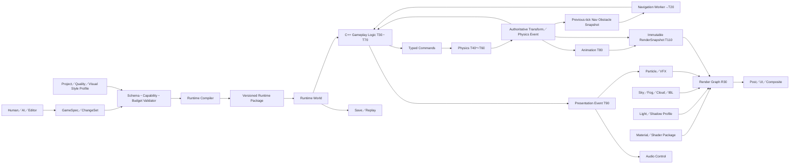

# Miraikanai Engine 2D／3D機能計画

- 文書版: 2.17
- 作成日: 2026-07-19
- 最終更新日: 2026-07-20
- 対象: 2D／3D Game Runtime、Editor、Asset pipeline、AI Authoring
- 状態: プロジェクト公式の機能範囲と段階設計
- 上位文書: [AIネイティブ独自ゲームエンジン 設計計画書](./2026-07-18-ai-native-game-engine-authoring-design.md)
- 基盤規約: [Miraikanai Engine 基盤アーキテクチャ規約](./2026-07-19-engine-foundation-architecture-design.md)
- Math／Core Utilities規約: [Miraikanai Engine AI可読Math／Core Utilitiesアーキテクチャ規約](./2026-07-20-ai-readable-math-core-utilities-architecture-design.md)
- C++言語・Modules規約: [Miraikanai Engine C++23・Named Modules・`import std`移行規約](./2026-07-20-cpp23-modules-import-std-transition-design.md)
- Runtime詳細規約: [Miraikanai Engine Runtime連携・寿命・性能規約](./2026-07-19-runtime-integration-lifetime-performance-design.md)
- Game実装規約: [Miraikanai Engine C++実行コード・構造化ゲームデータ規約](./2026-07-19-cpp-structured-game-data-design.md)
- Shooter Gameplay規約: [Miraikanai Engine AI可読Shooter Gameplay／Weapon／Projectileアーキテクチャ規約](./2026-07-20-ai-readable-shooter-gameplay-architecture-design.md)
- Renderer規約: [Miraikanai Engine Rendering／Render Graphアーキテクチャ規約](./2026-07-19-rendering-render-graph-architecture-design.md)
- Material／Visual Style規約: [Miraikanai Engine Material／Visual Style／AI Authoringアーキテクチャ規約](./2026-07-20-material-visual-style-ai-authoring-architecture-design.md)
- Lighting規約: [Miraikanai Engine Lighting／AI Authoringアーキテクチャ規約](./2026-07-20-lighting-ai-authoring-architecture-design.md)
- Post Process規約: [Miraikanai Engine Post Process／AI Authoringアーキテクチャ規約](./2026-07-20-post-process-ai-authoring-architecture-design.md)
- Camera規約: [Miraikanai Engine Camera Platform／AI Authoring／Virtual Productionアーキテクチャ規約](./2026-07-20-camera-platform-ai-authoring-virtual-production-architecture-design.md)
- LOD規約: [Miraikanai Engine AI可読LODアーキテクチャ規約](./2026-07-20-ai-readable-lod-architecture-design.md)
- Particle／VFX規約: [Miraikanai Engine 独自Particle／VFX Platformアーキテクチャ規約](./2026-07-20-particle-vfx-architecture-design.md)
- Debugging規約: [Miraikanai Engine AI可読Debugging／Observability／Replayアーキテクチャ規約](./2026-07-20-ai-readable-debugging-observability-replay-architecture-design.md)
- Water規約: [Miraikanai Engine Water Surface Platformアーキテクチャ規約](./2026-07-20-water-surface-platform-architecture-design.md)
- Weather／Snow規約: [Miraikanai Engine Weather／Snow Surfaceアーキテクチャ規約](./2026-07-20-weather-snow-surface-architecture-design.md)
- Asset規約: [Miraikanai Engine Asset Pipeline／Content Package規約](./2026-07-19-asset-pipeline-content-packaging-design.md)
- Asset Import／AI／Editor規約: [Miraikanai Engine Asset Import／AI Authoring／Editor UXアーキテクチャ規約](./2026-07-20-asset-import-ai-authoring-editor-ux-design.md)
- Physics Engine規約: [Miraikanai Engine 独自Physics Platform／Dynamicsアーキテクチャ規約](./2026-07-20-physics-engine-architecture-design.md)
- Navigation規約: [Miraikanai Engine 独自Navigation Platformアーキテクチャ規約](./2026-07-20-navigation-platform-architecture-design.md)
- Simulation連携規約: [Miraikanai Engine Physics／Navigation／Animation連携規約](./2026-07-19-physics-navigation-animation-architecture-design.md)
- Collision詳細規約: [Miraikanai Engine Collision／Colliderアーキテクチャ規約](./2026-07-19-collision-collider-architecture-design.md)
- Player I/O規約: [Input](./2026-07-19-input-action-device-architecture-design.md)／[UI・Text](./2026-07-19-ui-text-localization-accessibility-design.md)／[Audio](./2026-07-19-audio-mixer-spatial-architecture-design.md)
- Editor規約: [Miraikanai Engine Editor／Workspace／UX規約](./2026-07-19-editor-workspace-ux-design.md)
- Editor UI Framework規約: [Miraikanai Engine 独自Editor UI Framework／Shellアーキテクチャ規約](./2026-07-20-editor-ui-framework-architecture-design.md)
- Windows規約: [Miraikanai Engine Windows Platform／Distribution規約](./2026-07-19-windows-platform-distribution-design.md)
- モバイル規約: [Miraikanai Engine モバイルPlatformアーキテクチャ規約](./2026-07-19-mobile-platform-architecture-design.md)
- Domain Pack規約: [Miraikanai Engine Domain Pack／将来Capability規約](./2026-07-19-domain-pack-future-capability-roadmap.md)
- AI実装・保守規約: [Miraikanai Engine AI実装・保守ガバナンス規約](./2026-07-19-ai-engine-development-governance-design.md)
- 実行可能契約規約: [Miraikanai Engine 実行可能契約・Schema・Codegen規約](./2026-07-19-executable-contract-schema-codegen-design.md)
- AI検証規約: [Miraikanai Engine AI検証・評価・来歴規約](./2026-07-19-ai-verification-evaluation-provenance-design.md)
- Game System規約: [Miraikanai Engine Game System／AI Code Generationアーキテクチャ規約](./2026-07-20-game-system-ai-codegen-architecture-design.md)
- World／Level／Map規約: [Miraikanai Engine World／Level／Map／AI Authoringアーキテクチャ規約](./2026-07-20-world-level-map-ai-authoring-architecture-design.md)

## 1. 結論

2Dと3Dは同格のFirst-class runtimeとし、2Dを「奥行きが0の3D」として実装しない。Asset、Input、Audio、UI、GameplayDefinition、AI Authoring、Build、Save、Diagnosticsは共有し、描画、Physics、Navigation、Animation authoringは専用Subsystemを持つ。

Game Flow、Level Gameplay、Character、Combat、Ability、Encounter等のPublic Game System Contractは2D／3Dで共通にし、Physics／Navigation／Animation／CameraのImplementation VariantだけをTarget／Dimensionに応じて切り替える。World、Scene、Level、Streaming Cell、Map PresentationもDimensionに依存しないStable identityとSource／Derived境界を共有する。

映像表現は、`scene_dimension`（2D／3D／Hybrid）、`art_direction`（Realistic／Toon／Pixel等）、`composition`（Native／Pixel Diorama等）、`shading_model`（PBR／Toon／Unlit等）を独立して扱う。2DをPixel表現、3DをRealistic表現と同一視しない。自然言語で「HD-2D風」と要求された場合は、特定製品を模倣する名前や実装を正規dataへ保存せず、「2D Pixel Artと3D空間を合成する」という一般要件へ分解し、独自の`pixel_diorama` Composition Profileとして実現する。

すべてのkernelを自作する方針は採らない。Miraikanai Engineが独自に所有するのは、公開Capability、正規data model、Editor UX、AI command、validation、lifetime、serialization、fallbackである。Collision solver、3D Navmesh polygon生成／query、GPU heap suballocationなど、検証済みLibraryが安全性と開発速度を大きく改善する部分はAdapter内で利用する。Navigationは独自契約＋交換可能Backendとし、2D GridはEngine-owned、3D C1はRecast／Detour 1.6.0をprivate基準Backendにする。Game programming modelはC++23と`GameplayDefinition`に固定し、First-party C++公開境界はNamed Modules＋`import std`へ一方向移行する。汎用Game scripting runtimeは導入しない。

大量配置、大量spawn、敵味方の同時VFXは、固定個数を超えたら制作不可にする機能ではない。AIとRuntime CompilerがGameplay上の意味を保ったまま、Full Entity、simulation LOD、pool、instance、HLOD、streaming、CPU／GPU VFXへTarget別に解決する。ただし、無限の同時Full Simulationを保証するのではなく、Projectが宣言した最大ゲーム体験を統合負荷試験で実測し、未達Targetを「最適化済み」と表示しない。

## 2. Capability成熟度

Product Phaseと機能の成熟度を混同しないため、各機能を次の四段階で管理する。

| Level | 意味 | 合格条件 |
|---|---|---|
| C0 Foundation | API、schema、validation、debug表示が存在 | Unit／conformance test |
| C1 First Playable | 一つの完成した2Dまたは3D縦切りで利用可能 | 開始から終了までplay可能 |
| C2 Production | 品質tier、profiling、authoring、fallbackを備える | Reference sceneの性能・安定性gate |
| C3 Advanced | 大規模World、高品質表現、特殊genre向け | 専用BenchmarkとDomain Pack |

初期MVPはC0を完成させた後、**2D top-down shooterをC1、同じShooter Coreを使う3D compact third-person shooter arenaをC1**へ順に到達させる。両方を同時に実装しない。AI Authoringの基盤検証を優先する最初の縦切りは2Dとし、Direct3D 12 rendererのProduction検証を行う第二の縦切りを3Dとする。

## 3. 全機能に共通する規約

各Capabilityの状態書込、実行phase、event順序、pointer／borrow、Asset version、memory／performance budget、overflow、failure recoveryはRuntime詳細規約へ従う。Capability同士は直接呼び出さず、typed command、event、immutable snapshot、version付きAssetを`RuntimeOrchestrator`が統合する。

### 3.1 座標、単位、角度

本節は製品上の座標系と単位を決定する。`mirakan::foundation`／`mirakan::math`のtarget、storage／semantic type、finite／normalization／failure、floating-point、AI projection、backend QualificationはMath／Core Utilities規約を正本とする。AI／Editor／Authoring／Save／Subsystem公開境界では、裸の`Vec2f`／`Vec3f`ではなく`WorldPosition*`、`LocalPosition*`、`Displacement*`、`UnitDirection*`、`Velocity*`、`Scale*`、`NormalizedQuaternion`等の意味型を使用する。

| 空間 | 規約 |
|---|---|
| 3D World | 右手系、+Y up、meter、radian |
| 3D object forward | +Z。Camera view forwardは−Z |
| 2D World | +X right、+Y up、float meter。Box2D境界でも1 World unit = 1 meter |
| 2D Asset mapping | `pixels_per_unit` = Source texture texel数／1 World meter。`pixel_2d`既定32 |
| UI | origin top-left、+X right、+Y down、DIP |
| Texture UV | origin top-leftのAsset APIへ正規化 |
| Clip／Depth | Engine正規clipのX／Yは`[-1,1]`、Zは`[0,1]`。reversed-Zでnear=1、far=0、depth clear=0、compare=`GREATER_EQUAL`。D3D12／Vulkan／Metal差とsurface pre-rotationはBackendで補正 |

2Dの`reference_resolution`はCamera出力のlogical pixel数であり、World座標単位ではない。たとえば32×32 texelのSpriteを`pixels_per_unit = 32`でimportするとWorld上の大きさは1×1 meterになる。ScaleをPhysics bodyへ直接適用しない。Collider生成時に固定scaleをbakeし、実行中のvisual scaleとphysics scaleを分離する。単位変換はImporterまたはAdapter境界だけで行い、暗黙変換を禁止する。

glTF importではglTF 2.0の右手系、+Y up、+Z forward、meter、radianを保持する。Objectの意味上のfront convention差はimport metadataとConversion Reportへ記録し、mesh data、Root Transform、Pivot、Hierarchyを無理由に再変換しない。補正、Static geometry bake、Preview、Reimport Conflictの正式契約はAsset Import／AI Authoring／Editor UX規約を基準とする。

Engine mathはcolumn vector、column-major storage、`world = parent_world * T * R * S`とする。HLSLは`column_major float4x4`と`mul(matrix, vector)`だけを使い、CPU／Shader境界で暗黙transposeしない。Quaternionのfield順は`x,y,z,w`、rotation合成は`q_world = q_parent * q_local`、保存前に長さ1へ正規化する。`q`と`-q`の二重表現は、`w > 0`、`w == 0`なら最初の非0成分が正となる側へcanonicalizeする。zero-length、NaN／InfのQuaternionを拒否する。

### 3.2 Color、HDR、Alpha

- Lighting計算はscene-linear colorで行う。
- Base color／emissiveなど色textureはsRGBとしてdecodeする。
- Normal、roughness、metallic、depthなどdata textureはlinearとして読む。
- 2D spriteとUIはpremultiplied alphaを正規形式とし、import時に変換する。
- HDR scene bufferはC1でFP16を使用する。
- SDR出力はsRGB、HDR10出力はC2で追加する。
- Tone mapping、exposure、white balanceはCamera／Post Process Profileへ保存する。

### 3.3 時間

- Simulationはfixed tick、renderは可変tick＋interpolationとする。
- C1／C2の`fixed_tick_hz`はexactly 60、最大catch-upは4 step。ProfileとReplay headerへ60を保存し、別値をschemaで拒否する。
- Game pause、UI time、cinematic time、physics timeを明示的なclock domainに分ける。
- Animation curve、particle、audio schedulingはsecondを正規単位とする。
- Authoritative RandomnessはRuntime詳細規約のversion付き`DeterministicRngV1`とsystem／logical job別seed streamを使い、global random generatorとworker index由来seedを禁止する。

### 3.4 AIへ公開する編集単位

AIはGPU command、Physics native body、Navmesh polygon、raw shader resourceを直接操作しない。各Subsystemが次を提供する。

```text
CapabilitySchema
AuthoringComponent
TypedCommand
Validator
Preview
RuntimeCompiler
Diagnostics
```

例:

- `SetLightProfile`
- `CreateParticleEmitter`
- `ConfigureNavAgent`
- `AssignPhysicsMaterial`
- `CreateMaterialGraph`
- `BakeEnvironmentLighting`

CommandはStable ID、base project revision、型付き引数、precondition、推定costを持つ。Engineが生成したpreviewとDiffだけをCommit候補にする。

#### 3.4.1 大量制作IntentとAIの責務

AIは「敵を大量に」「街を埋める」「弾幕」「味方と敵が一斉に魔法を使う」を、単一のobject countへ短絡しない。最低限、総配置、最大同時存在、最大可視、1 tick／1秒spawn burst、interaction範囲、敵／味方／中立、戦闘cue別VFX同時数、Target、Gameplay fidelity floorへ分解する。

AIは次の順で制作する。

1. Game BriefへScale intentと、敵数、Damage、collision、goal、timing等の変更禁止項目を記録する。
2. Runtime規約のRepresentation PlanとRenderer規約のindividual／instanced／spatial／presentation分類を生成する。
3. 予測costを表示し、Project固有Integrated Scale Fixtureを生成する。
4. Target実測が未合格なら`Predicted`または`OptimizationRequired`と明示し、instance、partition、streaming、pool、LOD、VFX aggregate／GPU化を再提案する。
5. Presentation-only最適化で合格できない場合、Gameplay変更またはTarget除外を自動Commitせず、体験差を人間へ提示する。

有名Engineが通常object経路とは別にUnity Entities／GPU Instancing、Unreal Mass／HLOD／World Partition／Niagara Scalability、Godot Server／MultiMeshを持つ構造を参考にする。ただしMiraikanaiでは、利用者に実装方式を選ばせるのではなく、AIが意味分類と候補を作り、Engineのtyped contractと実測Gateが安全性を決定する。

#### 3.4.2 全LODのAI可読契約

Mesh／Sprite、Representation／HLOD、Simulation、Animation、Material、VFX、Terrain／Foliage／Water、Geometry residencyの共通語彙、Intent、Policy envelope、metric、transition、AI Operation、fallback、ReceiptはLOD規約を正本とする。一つの距離値または万能`lod_index`を全Domainへ共有しない。

AIは`LodIntentV1`と`LodPolicySetV1`を提案し、Runtime CompilerがTarget別`LodResolutionPlanV1`へ解決する。MeshはFOVと解像度を含む`projected_error_px_q16`、HLODはstatic decorative Source、Simulationはauthoritativeな`gameplay_relevance_q16`だけを入力にする。Camera visibility、GPU occlusion、VFX表示結果をSimulationへ逆入力しない。

Quality ProfileはPresentationの実装品質だけを変更できる。敵数、Damage、Collision、Navigation、goal、spawn timing、Simulation ContractをTarget性能に合わせて黙って変更せず、未達時は`OptimizationRequired`とする。AIが自動適用できるのはVisual Style、critical cue、Gameplay fidelity floor、Target fallbackを満たすPresentation-only Policyに限る。

### 3.5 映像表現の正規四軸

次の四軸をGameSpecとWorld Modelの正規概念とする。自由文字列、Shader名、既存製品名を正規値として使わない。

| 軸 | 正規値 | 意味 |
|---|---|---|
| `scene_dimension` | `canvas_2d`、`world_3d`、`hybrid_2d3d` | 座標、Camera、Visibility、Physicsとの接続方式 |
| `art_direction` | `realistic`、`toon`、`pixel`、`illustrated`、`graphic`、`custom` | 作品全体の視覚言語 |
| `composition` | `native_2d`、`native_3d`、`pixel_diorama`、`layered_2d3d`、`custom` | Render layerと最終合成の方式 |
| `shading_model` | Material Domainごとに許可された型付き値 | 光と表面の応答方式 |

`shading_model`はProject全体で一つに固定しない。たとえば`pixel_diorama`は、3D背景に`pbr_metal_rough`、Character spriteに`hybrid_sprite_lit`、UIに`ui_unlit`を同時使用できる。ただし、組合せは承認済み`VisualStyleProfile`のallowlistに含まれなければならない。

「2.5D」は曖昧語なので正規値にしない。Requirement Resolverは、Side-view 3D、2D gameplay＋3D background、Billboard sprite in 3D、Pixel Dioramaのどれを意味するか解決する。

### 3.6 Capability連携の公式経路

次図は製品Capability間の概要である。Render pass／resource／barrierはRenderer規約、Asset generation／Catalog／PackageはAsset規約、Physics World／Dynamics／Joint／CharacterはPhysics Engine規約、Nav／AnimationとSubsystem間phaseはSimulation連携規約、入力・UI・Audioの各境界はPlayer I/O三規約を詳細基準とする。

Game Systemの責務、State owner、System Catalog、Implementation VariantはGame System規約、World／Scene／Level／Cell、Topology、Streaming、Procedural、Map PresentationはWorld／Level／Map規約を正本とする。2D／3D差を理由にSystem ID、Save field、Command／Event意味を分裂させない。



| Producer | 渡す契約 | Consumer／反映点 | 禁止する近道 |
|---|---|---|---|
| Human／AI／Editor | revision付きChangeSet | Authoring Validator→Commit | UI widgetやLLMからlive Worldへ直接write |
| Gameplay Logic | typed Simulation／Structural command | 宣言consume phase／次`T00` | Physics、Nav、Render native API呼出し |
| Physics | normalized event、authoritative transform | `T60`後のGameplay、Animation、snapshot | callbackからEntity破棄、Render transform直接write |
| Navigation | version付きquery result | 次の`T20`→Gameplay | Physics pointer共有、stale Navmesh result適用 |
| Animation | pose、root-motion proposal、bounds | `T40` resolver／`T80`／RenderSnapshot | Physics transformとの二重write |
| Material／Light／Environment／VFX | version付きPresentation Asset／Profile | `R10` promotion→Render Graph | GPU resource、pass、bindingの直接編集 |
| Audio／VFX／Camera shake | bounded Presentation command | `T90`以後 | gameplay damage、Save、AI perceptionへの逆流 |

Asset、Profile、`GameplayDefinition`、C++の変更はdependency closure全体をstagingし、Runtime詳細規約の`T00`／`R10`だけでgenerationを切り替える。上図にないSubsystem間edgeを追加する場合は、Domain Port、typed contract、owner、phase、budget、failure policyをADRへ追加し、CMake DAGとconformance testを同じ変更で更新する。

## 4. 共通Engine機能

| Capability | C1 | C2 | C3 |
|---|---|---|---|
| Window／display | Platform surface、resolution、logical scale、orientation、safe area | HDR、desktop multi-monitor、mobile quality auto-detect | Multi-view特殊display |
| Input | Keyboard、mouse、touch、Platform controller、action map、rebinding、chord／context、C1 haptics、accessibility preset | Sensor optional、adaptive trigger／HD haptics、registered response curve | Specialized device |
| Game System | Game Flow、Level、Character、Combat、Ability、Encounterの共通Contract、Definition evaluator | Project-defined／Native／Target-specialized Variant | Engine Extension、advanced Domain System |
| World | Stable ID、compact Level、Topology、transform、component、composition recipe | Target別Streaming Plan、World Partition、HLOD、procedural authoring | continuous large-world origin rebasing |
| Asset | Import、content hash、cook、cache、hot reimport、bounded async streaming、`.mirakanpack` | LOD cook、Patch／DLC、remote build cache | Distributed cook |
| Save | Versioned save schema、checkpoint、atomic save | Slot、cloud adapter、partial world state | Large-world partition save |
| Audio | Engine mixer、voice、bus、spatial emitter、streaming music、Platform audio Adapter | reverb zone、ducking、profiler | Geometry acoustics |
| UI／Text | Layout、style、focus、touch／controller nav、Platform text／IME Adapter、Localization、screen reader semantics | UI animation、limited rich text span、MSDF | Advanced vector effects |
| GameplayDefinition | Rule／FSM／Ability／Quest／Dialogue／UI Flow schema、Validator、offline Cook、C++ evaluator | Behavior Tree、Blackboard、profiler、互換性検証済みhot reload | 署名済みdata-only Runtime content |
| Native code | NativeGameModule、isolated build、test | Incremental build、source-level profiling | Stable external SDKは1.0後 |
| Gameplay logic／AI | Typed state machine、Rule Graph、Cook済みRule、seeded random | Blackboard、perception、behavior tree／utility composition | Large-agent simulation policy |
| Camera | 2D／3D camera、viewport、blend、shake | Cinematic sequence、split view | Multi-camera recording、Virtual Production、Timecode／Genlock |
| Diagnostics | Engine-owned Session、構造化Event／Counter、Console／Problems／Profiler、Breakpoint／Watch、T110 safe pause、tick／frame step、Replay divergence | record／scrub／inspect、Causality、Reproduction Bundle、remote capture、AI evidence diagnosis | Policy承認済みの自動追加計測／修正提案。自動Commit／根拠なしcause確定は禁止 |
| Test | Unit、headless simulation、golden state | Image／audio／performance regression | Large scenario automation |
| Build | Development／Profile／Shipping、Target／Distribution Profile、signed manifest | AAB／archive packaging、crash symbols、Asset chunks | Multi-platform farm |
| Collaboration | ChangeSet history、text-diffable source、conflict検出 | Git status／diff連携、Asset lock adapter | Remote multi-user authoring |
| Networking | 対象外 | Transport abstractionの調査 | Authoritative multiplayer |

NetworkingをC1/C2へ暗黙に含めない。FPS/TPSというgenreはC1でsingle-playerとして成立させ、multiplayerは独立したC3計画とする。

### 4.1 Cameraの公式Contract

CameraのSource Document、Rig Graph、Director、AI Semantic／Operation、Sequence、Recording、Device Gateway、Timecode／Genlock、Calibration、Security、Budget、Diagnostic、Qualificationは[Camera Platform規約](./2026-07-20-camera-platform-ai-authoring-virtual-production-architecture-design.md)を正本とする。本節は2D／3D製品機能から参照するProjection初期値とRuntime不変条件だけを固定する。

CameraはProjection、Viewport、Exposure／Post参照、Presentation rigを分離する。Gameplay aim／visibilityは`CameraIntentSnapshot`を入力にWorld／Physics側が判定し、Render interpolation後のCamera transformやcamera shakeをauthoritative判定へ使わない。

| Profile | Projection | 初期公式値 | Validation |
|---|---|---|---|
| `PerspectiveGameplayV1` | 右手系reversed-Z perspective | vertical FOV 60°、near 0.05 m、culling far 10,000 m | FOV 5～170°、near 0.01～10 m、far `> near`かつ最大1,000,000 m |
| `OrthographicGameplayV1` | 右手系reversed-Z orthographic | vertical size 11.25 m、near 0.01 m、far 1,000 m | size 0.001～1,000,000 m、far `> near` |
| `Pixel2DReferenceV1` | Orthographic＋logical raster | 640×360、32 PPUなのでvertical size `360/32=11.25 m` | Point sampling、integer scale、pixel-locked layerへのTAA jitter禁止 |

Perspective projectionはfinite culling farをVisibility、cluster、fogへ必ず渡し、projection matrixだけをinfinite-farへ変更することをC1では許可しない。Viewportはnormalized `(x,y,width,height)`、各field 0～1、width／heightは0より大きく、右端／下端が1以下であることを必須とする。Aspectは実viewport pixel幅／高さから毎frame計算し、Profileへ重複保存しない。

Camera blendの既定durationは0.35 s、positionはcubic smoothstep `t²(3-2t)`、rotationはshortest-path normalized slerp、vertical FOVは`tan(fov/2)`を同じsmoothstepで補間する。Base Camera rigは`T30`でfixed tick時間から決定論的に進めるauthoritative stateとし、Renderingは直前／現在のbase poseを補間するだけとする。duration 0は次の`T30`でcutとして適用し、同tickの`T90`がtemporal history破棄eventを出す。Camera shakeだけをPresentation stateとしてbase poseから分離する。

Camera collisionは`T30`でversion付きtyped sphere-cast requestを生成し、Physics Adapterが`T40`で直前に完了したPhysics worldへqueryし、`T60`でEngine値へnormalizeする。Camera rigは次tick`T20`でowner generationとPhysics scene versionが一致する結果だけを統合する。既定sphere radius 0.20 m、skin 0.05 m、最大補正距離10 mである。当該tickに結果がない場合は前回valid resultを最大2 tick保持し、3 tick目はcollision補正なしへ切り替えて`CameraCollisionStale`を記録する。Render threadからPhysics objectを直接queryしない。

Camera shakeはseed、開始tick、duration、translation／rotation amplitude、frequencyを持つbounded Presentation commandであり、最終View matrixへだけ合成する。既定上限は同時16 shake、translation各軸2 m、rotation各軸20°、frequency 0～60 Hz、duration 0～30 sとし、Gameplay aim、Physics、Save transformへ戻さない。

C2 Cinematicは同じCamera Rig／Director／TransitionをSequenceから駆動し、別Camera実装へ分裂させない。C3 RecordingはBase Pose、Lens、Presentation channel、Clock、Calibration、Gapを非破壊Takeへ記録し、外部Deviceを別Process Adapterへ隔離する。C3 CapabilityはRecording、Device、Timecode、Genlock、Remote Preview、Hardware Adapterごとに個別Qualificationし、一括Production表示しない。

## 5. 2D RuntimeとEditor

### 5.0 独自実装と公式Backend方針

Miraikanai Engineは、2DのSource／Cooked Asset、`CanvasRenderer`、Tilemap chunk、Animation Graph、Editor、AI Operation、validation、serialization、streaming、fallback、telemetryを独自に所有する。D3D12、Vulkan、MetalはGPU Backend API、Box2Dは2D Physicsのprivate kernelとして利用するが、native handle、descriptor、command buffer、Box2D ID／callbackをProject C++、GameplayDefinition、Save、AI Schemaへ公開しない。他EngineのSprite／Tilemap runtimeまたはEditorを組み込まない。

`Renderer2DExecutionPlanV1`はProject要求、Visual Style、Scale intent、Target Profile、`RendererCapabilitySignatureV1`、Qualification ReceiptからCook時に生成し、次を保存する。

| Field | 正規値／意味 |
|---|---|
| `submission_path` | `cpu_direct \| cpu_instanced \| gpu_indirect` |
| `resource_binding_path` | `bounded_table \| indexed_table`。native descriptor方式名は保存しない |
| `visibility_path` | `cpu_bounds \| gpu_bounds`。authoritative visibilityには使わない |
| `atlas_path` | `packed_pages \| qualified_paged_residency` |
| `tile_chunk_path` | `cpu_built_static \| async_streamed \| gpu_indirect` |
| `animation_pose_path` | `cpu_pose \| qualified_gpu_presentation_pose` |
| `required_capability_ids` | Targetで実測済みのCapability ID集合 |
| `fallback_chain` | 意味同等な低位Plan。順序、理由、予測costを必須保存 |

C1のPortable基準はCPU bounds culling、canonical stable sort、offline packed atlas、bounded resource table、CPU生成instance buffer、direct instanced drawである。単一instanceにできないMaterial／mask／blendだけをbounded direct drawへ分離する。この経路をWindows、Android、Appleのgolden意味基準とし、高速化経路が存在するTargetでも削除しない。

Backend別高速化は次の公式API条件をすべて満たした場合だけ有効化する。

| Backend | C1基準 | C2以後の任意高速化 | 必須Gate |
|---|---|---|---|
| D3D12 | Root Signature 1.1、descriptor table、placed／committed resource、explicit upload | SM 6.6 direct heap indexing、`ExecuteIndirect`、placed resource pool | `CheckFeatureSupport`、Resource Binding Tier、Shader Model、DXGI memory budget、GPU validation。Enhanced Barrier使用時は個別support |
| Vulkan | Target Vulkan Profile内のdescriptor set、indexed／instanced draw、staging upload | descriptor indexing、draw indirect count、GPU culling、async transfer | API version、Profile、全required feature／limit、queue family、format、validation、Android DEQP／実機Receipt |
| Metal | CPU encoding、bounded texture／sampler binding、triple-buffered dynamic data | argument buffer、heap、Indirect Command Buffer、Metal I/O | `MTLDevice` family／feature table、argument buffer tier、heap／ICB support、residency宣言、Xcode GPU validation／実機Receipt |

API名はBackend AdapterとQualification Receiptにだけ記録する。GPU名、OS名、Vendor名からCapabilityを推測せず、起動時feature queryと署名済みTarget Capability Manifestの積でPlanを選ぶ。任意高速化が未対応、driver denylist、memory pressure、device recovery後の再Qualification不一致となった場合は`gpu_indirect -> cpu_instanced -> cpu_direct`、`indexed_table -> bounded_table`の順で、事前Cook済みfallbackへ遷移する。実行中にshader／pipelineをcompileせず、fallback artifactがない必須Capabilityは起動前に拒否する。

GPU memoryはD3D12公式方針と同じくclassify、budget、streamを基本とし、Vulkan／Metalでも同じEngine-owned residency contractへ正規化する。Atlas、Tile chunk、instance／animation buffer、render targetを別Classへ計上し、Platform budget、working set、eviction、upload、promotion、retire serialをtelemetryへ出す。Quality縮小はPresentationだけに適用し、Collision、Navigation、Gameplay event、tile semantic、animation eventを変更しない。

### 5.1 2D Renderer

2Dは専用`CanvasRenderer`を持つ。3D opaque passへquadを混ぜる設計にしない。

#### C1: 2D Renderer Core

- Sprite、sprite sheet、texture atlas
- Region、flip、pivot、modulate color
- Nine-slice、tiled sprite
- Layer、explicit order、Y-sort group
- CPU bounds culling、canonical sort、direct／instanced batching、texture／sampler grouping
- Orthographic camera、pixel snap、integer scale option
- Parallax layer
- Scissor、mask、blend mode
- Polyline、polygon、basic shape
- 2D normal map
- Directional／point 2D light
- Signed-distance-field 2D shadow occluder
- Sprite material graphの制限subset
- CPU Sprite LOD、animation update LOD、critical cueの最低表示floor
- Draw-call、overdraw、atlas occupancy debug view

#### C2: 2D Renderer Advanced

- Capability-qualified GPU culling／indirect submission
- Texture array／indexed resource binding、atlas group間のbounded rebatch
- Palette swap、mesh sprite、per-sprite Material parameter block
- 2D light clustering
- Soft shadow、shadow atlas
- Vector path tessellation cache
- Render-to-texture、multi-camera composition
- 2D post process stack

#### C3: 2D Renderer Specialized

- Qualification済みpaged Sprite residency／sparse resource
- GPU Presentation pose／animation decodeとCPU pose fallback
- 大規模2D World向けGPU-generated visibility／draw list
- Vector／mesh spriteの高度なdeformation、specialized Domain renderer

Blendの既定はpremultiplied alphaとする。Straight alpha Assetはimport時に変換し、Materialが明示要求した場合だけ別pipelineを使う。

#### Spriteの正規Asset／Component

`SpriteImportSettingsV1`をTexture importのoptional projectionとして正式定義する。

```text
SpriteImportSettingsV1
  rect_mode: single | grid | explicit
  rects: bounded array<SpriteRectV1>
  grid_cell_px: optional uint2
  grid_margin_px: uint2
  grid_spacing_px: uint2
  default_pivot_normalized: float2
  pixels_per_unit: float
  border_px: uint4
  trim_policy: none | transparent_bounds
  packing_policy: standalone | atlas_group
  atlas_group_id: optional StableId
  allow_rotation_in_atlas: bool
  extrude_texels: uint8
```

`SpriteRectV1`はStable Sprite ID、Source rect、pivot、nine-slice border、tag、optional collision polygon参照を持つ。rectはTexture bounds内、正のextent、相互overlapはProfileが明示許可したanimation alias以外禁止、pivotは各軸`[-8, 8]`、`pixels_per_unit`はfiniteな`[0.001, 65,536]`とする。C1 atlasは最大4,096×4,096 texelのoffline packed page、Sprite数は一Source Asset最大65,535、atlas rotationは既定falseとする。Targetのtexture extent上限がProfile未満なら自動縮小せずTarget Cookを失敗させ、Source分割Previewを提示する。

`rect_mode=single`は`rects`を空にしてTexture全体から一Spriteを作る。`grid`は正の`grid_cell_px`を必須、`rects`を禁止し、margin／spacingから右下exclusive boundsを超えるcellを生成しない。`explicit`は1～65,535件の`rects`を必須、grid fieldをzeroとする。`packing_policy=atlas_group`だけが`atlas_group_id`を必須とし、`standalone`での指定を拒否する。Pixel Profileはatlas rotationを禁止し、Illustrated Profileで許可する場合もpivot、border、collision座標の回転変換をgolden fixtureへ固定する。

C1 packerは`height desc, width desc, Stable Sprite ID asc`で入力をcanonicalizeする`skyline_v1`とする。同じ入力、Profile、Cooker versionから同じpage、rect、padding、hashを生成する。mipを持つSpriteは全mipで隣接Spriteをsampleしないpadding／extrudeをCookerが検証し、満たせないpageを拒否する。Runtime repack、frame中のatlas pointer差替え、使用中pageへの上書きを禁止し、hot reloadは新page集合全体をstaging後に`R10`でatomic promotionする。

`SpriteRendererComponentV1`はSprite Asset ID、material instance ID、layer、order、Y-sort group、color、flip、visibility、Sprite LOD Policy IDを持つ。Texture handle、UV、native descriptor index、batch indexを保存しない。`CanvasBatchKeyV1`はresolved pipeline、blend、mask、sampler、atlas page、material parameter layoutからRendererが毎Snapshot生成し、stable rendering IDを最終tie-breakにする。

#### 2D LightのC1公式Profile

`Light2DProfile::ReferenceMediumV1`をC1 fixtureへ固定する。

| 項目 | 初期公式値 | Hard上限／overflow |
|---|---:|---|
| 可視Directional 2D light | 1 | 1。2個目はvalidation error |
| 可視Point 2D light | 64 | 64。`importance rank desc, priority_u8 desc, screen_coverage desc, StableId asc`で上限内を選ぶ |
| 1 spriteが評価するPoint light | 8 | 8。9個目以降は同じcanonical順で除外しcounterを出す |
| Shadow caster light | 8 | 8。AI ChangeSetは事前予測で超過したら拒否 |
| SDF occluder atlas | 2,048×2,048、`R16_SNORM` | 8 MiB。1 texel padding、skyline pack、repackは`R10`でatomic promotion |
| Shadow mask | internal resolutionの1/2 linear、最大960×540、`R8_UNORM` | Render Graph transient。camera cut／occluder generation変更で再生成 |

2D lightはscene-linearで合成し、sprite normalの既定は`(0, 0, 1)`、normal mapの接線基底はsprite local `+X,+Y,+Z`とする。Point lightの距離はmeter、fluxはlumen、rangeは0.01～1,000 mを必須とする。無限range、NaN／Inf、負のfluxを拒否する。C2 clusteringへ移行しても上記の選択順、物理単位、overflow telemetryを維持する。

### 5.2 Tilemap

Tilemapは単一巨大arrayではなく、変更・streaming・culling単位のchunkへ分割する。

Tile chunkはTilemap内部の編集、Cook、描画、Collider／Nav差分単位であり、World／Level／Map規約のWorld、Region、Level、Streaming Cellではない。World topology、Level lifecycle、Partition Intent、Cell grouping／activation、Map PresentationはWorld／Level／Map規約を正本とする。Tilemapは`WorldStreamingPlanV1`がresident／activeにしたCellのAsset closureへ参加し、その内部payloadをchunkで管理するが、Tile chunk単独でLevel Entity、Objective、Portal、authoritative gameplayをactivateしない。

#### Tilemapの正規Asset

```text
TileSetAssetV1
  grid: TileGridV1
  sprite_table_id: StableId
  tiles: bounded array<TileDefinitionV1>
  terrain_rule_sets: bounded array<TerrainRuleSetV1>
  custom_property_schema_id: optional StableId

TilemapAssetV1
  orientation: orthogonal | isometric | staggered | hexagonal
  tile_set_sources: bounded array<TileSetRevisionV1>
  layers: bounded array<TileLayerV1>
  chunk_extent_tiles: uint2
  source_bounds: optional RectI64
  generation: uint64

TileChunkArtifactV1
  chunk_coord: int2
  source_generation: uint64
  occupied_bounds: RectU32
  draw_spans: bounded array<TileDrawSpanV1>
  collision_artifact_key: optional ArtifactKey
  navigation_artifact_key: optional ArtifactKey
  content_sha256: bytes32
```

`TileGridV1`はtile texel extent、`pixels_per_unit`、origin、axis、orientation固有stagger／hex sideを持つ。`TileSetRevisionV1`は`AssetId<TileSet>`と`AssetRevision`、`TileLayerV1`はStable Layer ID、kind、optional parent、chunk map、表示／semantic policy、`TileDrawSpanV1`はCanvas Batch Key、instance offset／count、local boundsを持つ。`RectI64`／`RectU32`はinclusive min／exclusive maxであり、empty、overflow、negative unsigned extentを拒否する。

`TileDefinitionV1`はStable Tile ID、Sprite ID、最大256 frameのanimation、material slot、collision tag、navigation area／blocked tag、terrain／Wang-like edge・corner tag、最大32件のtyped custom propertyを持つ。frame durationは1～60,000 ms、総clip durationは24時間以下とする。Source外部形式のglobal tile IDや配列indexをStable Tile IDとして保存しない。未知property、未登録class、dangling tileset、負duration、非finite offset、未対応orientationをLoss Reportなしに破棄しない。

C1は一TileSet最大65,535 Tile、一Tilemap最大64 Layer、全Layer合計最大16,777,216 occupied cell、chunk extentは各軸8～256の2冪、Reference 32×32、一Chunk最大4,096 draw spanとする。C2 streaming SourceはProfileに`max_authored_chunk_count`、`max_resident_chunk_count`、serialized／resident byte上限を必須指定し、上限のないinfinite mapを受理しない。C3も無制限値を導入せず、Regionごとに同じbounded Profileを適用する。

`TilemapAssetV1`のC1 orientationは`orthogonal`、C2で`isometric`、`staggered`、`hexagonal`を個別Qualificationする。layer kindはC1でtile／group、C2でtyped object stamp／image／height semanticを追加する。LayerはStable Layer ID、visibility、lock、opacity、tint、blend、parallax、offset、collision／navigation contribution policyを保存する。Editor表示用visibilityをCollision／Navigationの有効性へ暗黙接続しない。

#### C1: Tilemap Core

- Multiple tile layer
- Atlas tile、animated tile、collision shape、navigation tag
- 既定32×32 tileのchunk。Projectで変更可能
- 専用chunk renderer、空chunk除外、同一Batch Keyのdraw span結合
- Rectangle／line／fill／stamp／selection
- Deterministic terrain／edge／corner rule paint
- Dirty rectangleから影響chunkだけを再Cook／mesh rebuild
- Collider merge
- Paletteとcustom metadata
- Chunk bounds、resident、dirty、draw span、collision／nav generation debug

#### C2: Tilemap Advanced

- Camera／GameSpec interest sourceによるWorld streamingとprefetch
- Background async chunk cook
- Procedural rule preview
- Occlusion／light mask
- Revision付きRuntime tile command、undo／save／replay
- Isometric／staggered／hexagonal grid
- Typed entity／prefab stamp、layer template
- Chunk-level portal graphとhierarchical pathfinding接続

#### C3: Tilemap Specialized

- World規約のRegion参照を持つlarge-world paged tile database。Region identity／originは所有しない
- Qualification済みGPU tile visibility／draw generation
- Bounded procedural biome／terrain generation cache
- Multiplayer／collaborative editはNetworking規約の個別Gate後

`TileLayoutCommandV1`はtarget Tilemap／expected revision、region、`paint | erase | fill | stamp | apply_rule | replace_by_query`のclosed operation、Rule Set／Stamp Asset ID、seed、allowed Tile／terrain tag、connectivity／reachability constraint、`max_changed_tile_count`、preview hashを持つ。AIはtile IDの巨大配列を直接生成せず、本Commandを提案する。Engineが実tileへ決定論的に展開し、接続不良、到達不能、未登録Tile、上限超過を検証する。Preview hashとCommit直前の再展開hashが異なるCommandを拒否する。

Tile editはimmutableな新`TileChunkArtifactV1`を作り、変更regionの1 tile外側、terrain rule依存半径、Collider seam、Navigation overlapを含めて再Cookする。Renderer、Collision、Navigationの全Derived ArtifactがReadyになるまでgenerationを公開しない。Presentationだけの変更はCollision／Navigation Artifactを再利用できるが、dependency hash一致を必須とする。

C2 streamerは`WorldStreamingPlanV1`のactive／prefetch Cell、Camera、Gameplay required region、Physics body swept bounds、Navigation query corridor、save checkpointをinterest sourceとして統合する。World Cellのall-or-nothing activationをTile chunk単位へ弱めず、Tilemap側ReadyはCell activation groupの一条件として報告する。Presentation chunkはvisual fallbackへevictできるが、active authoritative regionのCollider／Navを先にevictしない。load deadline未達時は空Tileや無衝突状態を表示せず、World Planのfailure policyに従って境界停止、既存generation維持、loading transitionのいずれかを実行する。

外部2D SourceはEngine-native Assetを正本にせず、隔離Importerで独自IRへ変換する。C2候補はAseprite CLIのPNG＋JSON sprite sheet、Tiledのversion付きJSON／TMX／TSX、LDtkのversion付きJSON Schemaである。Importerはformat version、tool version、Source hash、外部IDからStable IDへの対応、unsupported field、Loss Reportを保存し、network、script、plugin discoveryを禁止する。各形式はDependency ADR、license、malformed／zip bomb／path traversal fixture、round-tripではなく意味fixture、reimport conflictを合格した後だけCatalogへ公開する。

### 5.3 2D Physics

Box2D 3.1.1を`Physics2DBackend`のprivate kernelとして採用する。設計上の選択は確定しているが、対象TargetのKernel QualificationとC1 fixture合格前は`candidate_locked`でありProduction表示しない。

本節はCapability範囲を決める。Body／Collider分離、shape field、Material、Filter、Sensor、Query、Event、Cook、Editor、AI Operation、budget、合格条件の正本はCollision詳細規約とする。

World／Solver全値、Box2D build／job／allocator bridge、Dynamics、Joint、Character Motor、Save／Replay、Physics AI／Editor、Kernel Qualification、memory／failureはPhysics Engine規約を詳細基準とする。PhysicsとNavigation／Animationのsnapshot／command接続はSimulation連携規約を基準とする。

#### C1: 2D Physics Core

- Static／kinematic／dynamic body
- Circle、capsule、box、convex polygon、segment、chain shape
- Sensor、collision layer／mask
- Distance、revolute、prismatic、weld joint
- Physics material
- Ray cast、shape cast、overlap query
- Contact begin／end、trigger event
- Kinematic character motor
- Fixed 60 Hz、`sub_step_count=4`をC1 reference値とする
- Collider、contact、sleep state debug draw

#### C2: 2D Physics Advanced

- One-way platform
- Continuous collision quality profile
- Buoyancy／area force
- Ragdoll-like joint authoring
- Large tile collider streaming
- Concave sourceの明示Preview付きconvex piece生成
- Physics query profiler

`Physics2DWorldProfileV1`はPhysics Engine規約8.2節の全fieldを保存し、`sub_step_count`はinteger 1～8、Reference 4とする。Box2D 3.1.1のgravity -10、maximum linear speed 400を暗黙採用せず、Miraikanaiの-9.81 m/s²、hard上限1,000 m/s、contact／sleep／continuous／worker値を全展開する。Play中変更を拒否する。

Physics eventは`T60`でStable IDへ変換し、Runtime詳細規約7.3節のcanonical keyで配送する。Box2D pointer、body ID、callback中のWorld変更をGame APIへ露出しない。Event ordering、invalid ID破棄、同一native event bufferを二度consumeしないことをAdapter conformance testで固定する。

公式Box2D integrationではexactly 60 Hz、固定`sub_step_count`、Engine worker bridge、step後のbody／contact／sensor event array取得を基準経路とする。Callback中はpreallocated bufferへのcopy以外を行わず、World変更、allocation、logging、Gameplay呼出しを禁止する。Tile terrainは隣接boxの内部cornerを量産せず、semanticが同一のedgeをchain／merged static shapeへCookする。Characterの既定shapeはcapsuleまたはrounded polygonとし、rectangular characterをTile seam品質の基準にしない。

### 5.4 2D Navigation

2Dではgrid navigationとpolygon navigationを別backendとして提供する。

Nav grid／query／Profile／status／budget／Backend／AI／Editorは独自Navigation Platform規約、obstacle snapshot／async resultのphaseとstale結果破棄はSimulation連携規約を詳細基準とする。

#### C1: 2D Navigation Core

- Tilemapからwalkable grid生成
- A* query、cost layer、blocked cell
- Agent radiusを考慮したclearance
- Reachability validation
- Path debug overlay

#### C2: 2D Navigation Advanced

- Polygon navigation region
- Dynamic obstacle update
- Chunk portal graphによるhierarchical pathfinding
- Generation付きpath cacheと同一goal batch query
- Flow field（Simulation Domain Pack）
- Local avoidance

#### C3: 2D Navigation Specialized

- Large-world multi-level portal graph
- Strategy Domain向けbounded crowd／flow-field solver
- Runtime生成Regionの永続cacheとdistributed cookは個別Gate後

AIがlevelを作る際はspawnからgoalまで、必須interaction point間、escape routeの到達可能性を自動Testする。

#### 2D NavigationのC1公式Profile

`GridNav2DProfile::ReferenceV1`は次で固定する。

| 項目 | 初期公式値 |
|---|---:|
| Navigation cell | 0.25 m正方形 |
| 接続 | 8近傍。斜め移動は両隣の直交cellがwalkableな場合だけ許可 |
| Cost | 直交`65,536`、斜め`92,682`のQ16.16。area multiplierは`[0.0625, 64.0]` |
| Heuristic | admissibleなoctile distance。同点は`f`, `h`, canonical cell indexの昇順 |
| 1 queryの展開node | 65,536 |
| 1 pathのcell | 8,192 |
| 1 assetのwalkable grid | 最大16,777,216 cell、cell payload 32 MiB、metadataを含むresident／serialized hard cap 34 MiB |
| Agent radius | 0.40 m、schema範囲0～8 m。clearanceは`ceil(radius / cell_size)` |

cell payloadはrow-major `cell_index = y * width + x`で、1 cell exactly 2 byteの`uint8 area_id`＋`uint8 clearance_cells`とする。2D／3D共通の`area_id=0`はblocked、1～63は64-entryのQ16.16 area-cost tableを参照し、64～255はinvalidとしてcook／loadを拒否する。clearanceは0～255 cellで飽和するが、Profileの必要clearanceを255超へ設定したAssetはcook errorにする。Path累積costは`uint64`で計算し、加算前overflow検査に失敗したqueryを`CostOverflow`とする。

Tilemap cellとNavigation cellが一致しない場合、各Navigation cellが重なるcollision／blocked sourceを保守的ORで集約し、狭い障害を消さない。上限到達はpartial pathに偽装せず`SearchBudgetExceeded`、到達不能は`NoPath`、入力generation不一致は2D／3D共通の`StaleNavMesh`を返す。Project Profile変更はgrid全体をDerived Assetとして再cookし、Play中の暗黙resampleを禁止する。2D／3D Navigationを併用するProjectでも、live Nav payload合計36 MiBとRuntime詳細規約13.1節のNavigation Domain内訳を超えてはならない。

### 5.5 2D Animation

Sprite animationのAsset／state graph／event／root motion proposal、pose反映phase、buffer lifetime、budgetはSimulation連携規約を詳細基準とする。

#### C1: 2D Animation Core

- Flipbook
- Property track
- Curve／event track
- Tween
- State machineとtransition condition
- Blend parameter
- Preview、scrub、onion skin
- Animation update LOD、不可視pose保持、critical event floor

#### C2: 2D Animation Advanced

- Cutout skeleton
- IK chain
- Blend space
- Animation retarget profile
- Root-like 2D displacement
- Sprite mesh deformation、palette／material track
- Clip compressionとCPU pose batch evaluation

#### C3: 2D Animation Specialized

- Qualification済みGPU Presentation pose evaluation
- Procedural cutout rig、advanced constraint graph
- 大規模crowd用pose sharingとvisual variation

Animation eventは任意関数名を文字列で呼ばず、登録済みtyped Gameplay Eventを発行する。

Animation update LODはpose計算頻度とPresentation補間だけを変更する。event cursorは60 Hzのauthoritative timeで進め、不可視化、GPU culling、offscreen、Quality tierを理由にGameplay Eventをdrop、重複、遅延しない。C2 GPU poseはPresentation専用で、hitbox、Collider、Navigation obstacle、root-like displacementはCPU正規pose／typed commandを使用する。

### 5.6 2D CameraとComposition

Camera Source、Rig、Director、Sequence、Recording、AI Operationの正本はCamera Platform規約とし、本節は2D固有Capabilityを定める。

#### C1: 2D Camera Core

- Orthographic projection、logical resolution、integer／fractional scale policy
- Follow target、dead／soft zone、look-ahead、bounded zoom
- World bounds／region confiner、pixel snap、parallax
- Typed camera shake、screen transition、safe-area aware viewport

#### C2: 2D Camera Advanced

- Camera stack、layer別camera／post、render-to-texture
- Split view、local multiplayer viewport、multi-camera composition
- Rail／room transition、target group framing、cinematic sequence
- Pixel-locked layerとsubpixel layerのcoverage-aware composite

#### C3: 2D Camera Specialized

- Multi-camera recording、external device、timecode／genlockはCamera規約の個別Qualification後

Camera confiner、look-ahead、shake、Presentation interpolation後のtransformをPhysics、aim、Navigation、visibility authorityへ戻さない。Pixel-locked layerはlogical resolutionでrasterizeし、TAA、motion blur、temporal upscaler、frame generationへ混ぜず、最終compositeでsafe-area／UIと合成する。

### 5.7 2D最適化、Fallback、Qualification

2D最適化は総Asset数の拒否ではなく、authored、resident、active、visibleを分離し、Sprite LOD、animation update LOD、chunk、atlas、instance、streamingへ解決する。CPU／GPU経路は同じ`Renderer2DExecutionPlanV1`、Sprite／Tile Stable ID、sort key、coverage ruleを使い、Backendごとに見た目やGameplay意味を変えない。

最低telemetryは次とする。

- CPU: Snapshot extract、bounds cull、LOD、sort、batch build、Tile dirty propagation、Cook queue、upload staging、Render Graph record／submit
- GPU: Canvas／Light／Shadow／Post／Composite pass、draw／instance／visible／culled Sprite、Tile chunk／draw span、overdraw、pixel invocation
- Resource: atlas page／occupancy／padding waste、descriptor／argument usage、instance／pose ring peak、Tile authored／resident／requested／miss、upload／evict／retire bytes
- Quality: fallback reason、Plan hash、critical cue floor、image diff、pixel-grid violation、animation event drift

高速化Capabilityは次の全fixtureに合格して個別に昇格する。

| Fixture | C1／C2入力 | 合格条件 |
|---|---|---|
| `2d_crowded_battle_v1` | C1の10,000 visible Sprite、500 dynamic body、VFX／Audio／Camera同時負荷 | Runtime規約の60 fps hard acceptance、event drop 0、Replay一致 |
| `2d_sprite_throughput_v1` | C2 Windows Referenceで100,000 authored、50,000 visible、8 layer、4 atlas group、25% animated | CPU基準とimage tolerance一致、P95 14.00 ms soft／16.67 ms hard、fallback再実行合格 |
| `2d_streaming_tileworld_v1` | 4,096×4,096 cell、4 layer、32×32 chunk、最大256 resident chunk、World Cell activation、連続Camera移動と64 tile edit／s | Cell all-or-nothing、active region hole 0、Collider／Nav世代不一致0、queue／memory cap内、10分soak |
| `2d_light_overdraw_v1` | C1上限64 Point light、1 Sprite最大8、8 shadow caster、Sprite／VFX重複 | canonical light選択一致、GPU pass cap、atlas overflow／fallback検証 |
| `2d_editor_iteration_v1` | 64×64 stamp、terrain rule、undo／redo、reimport conflict、Play hot reload | input→preview P95 50 ms以下、UI thread blocking 50 ms超0、atomic generation、undo hash一致 |

C2の数値はWindows Reference fixtureであり、Product上限またはMobile達成を意味しない。Android／Appleは同じSource intentと意味fixtureからTarget固有Scale ProfileをCookし、minimum／reference実機で個別にvisible working set、memory、thermal、battery、frame pacingを測る。個数を減らした結果critical cue、Collision、Navigation、Gameplay Eventが変わるProfileは不合格とする。

正規fallbackは次のとおり。

| 高位Capability | Fallback | 禁止 |
|---|---|---|
| GPU culling／indirect | CPU bounds＋instanced、次にbounded direct | draw skip、前frame visibilityの無期限再利用 |
| Indexed resource binding | offline atlas group＋bounded table | missing texture、descriptor 0への置換 |
| Paged Sprite／Tile residency | packed page／bounded preloaded region | 空Tile、無衝突Tile、Nav欠落 |
| Clustered 2D light／soft shadow | C1 canonical light selection＋hard SDF shadow | Gameplay light意味の変更 |
| GPU／cutout pose | CPU poseまたはCook済みflipbook | animation event、hitbox、root変位の省略 |
| Runtime Tile edit | 事前Cook済みCommandだけ、またはCapability block | 未保存edit、部分generation公開 |

### 5.8 2D縦切りの合格Scene

最初のC1は`mirakan.feature.shooter_core.c1`と`shooter.profile.2d_top_down.c1`を使用する`pixel_2d` top-down shooterとする。論理解像度640×360、`pixels_per_unit = 32`、`integer_scale_policy = letterbox`を固定fixtureとし、1920×1080では3倍Point upscaleで表示する。

- Title、settings、play、result
- 一つのtilemap level
- Player movement／aim、primary fire、reload optional、Weapon switch optional
- typed Weapon、single／automatic／burst、hitscan／straight projectile、fixed／fan／radial Pattern
- Health、Shield optional、Damage、Team、invulnerability、defeat
- 3 enemy archetype、Wave／spawn rule、1 Bossと複数phase
- Score、Combo、persistent high score
- Goal、checkpoint、save／load／replay／restart
- 2D light、particle、camera shake、music／SFX
- `pixel_2d` Profile、Sprite Material Template、Pixel-safe Post設定
- AIが自然言語からlevel、rule、UI、`GameplayDefinition`を生成
- 人間がInspector、Graph、table／form、必要時はC++で修正後、AIが差分を保持して再編集
- 1080p60、10,000 visible sprite、500 dynamic physics bodyのReference stress scene
- `2d_shooter_c1_v1`: 256 active combat entity、2,048 live authoritative projectile、256 projectile spawn／tick、128 hitscan query／tick、Fire→Hit→Damage→Defeat→Scoreのauthoritative drop 0
- `2d_crowded_battle_v1`: 上記描画／Physics負荷と同じrunで、256 active combat entity、1秒に128 enemy／ally spawn、128 active VFX emitter、16,384 alive particle、同一tick 2,048 particle burst、hit／trail／projectile／area／explosion、Audio／Camera cueを再生

`2d_shooter_c1_v1`はWeapon、Projectile、Collision query、Damage、Pickup、Score、Save／Replayの正当性を所有し、`2d_crowded_battle_v1`は大量配置、spawn、Gameplay、Physics、敵味方VFXを分離runに逃がさず同時に要求する。両FixtureはReference hardwareでP95 frame time 16.67 ms以内、GPU／CPUの継続budget超過なし、authoritative event drop 0、Replay結果一致を合格条件とする。この個数はC1の最低組込みfixtureであって製品上限ではない。ProjectのScale intentが上回る場合はProject固有fixtureで再Qualificationする。

## 6. 3D RuntimeとEditor

### 6.1 MeshとWorld Rendering

#### C1: Mesh／World Rendering Core

- Static mesh、skinned mesh、morph target
- glTF 2.0 import
- Source／Engine軸、Root、Pivot、bounds、Hierarchy、SkeletonのImport Preview
- 型付きImport Profile、Conversion／Loss Report、Reimport Conflict
- Vertex／index buffer cook
- PBR metallic-roughness material
- Normal、occlusion、emissive
- Camera frustum culling
- `MeshLodProfileV1`によるManual／generated static Mesh LOD、CPU `projected_error_px_q16`選択、hysteresis、LOD0 fallback
- skinned／morphはSource chainを基準とし、generated chainはdeformation／bone／morph error Gate後だけ昇格
- Hardware instancing
- Decal
- Transparent forward pass
- Debug wireframe、bounds、normal、material view

#### C2: Mesh／World Rendering Advanced

- 承認済み公式Blender→glTF Source Conversion Worker
- `ufbx`候補のFBX AdapterとImporter migration fixture
- CPU selectorと同じ量子化規則を使うGPU frustum／LODとindirect instance culling
- 前real frame HZBによるconservative occlusion culling
- `HlodProfileV1`によるstatic decorative限定HLOD。interactive／mutable Physics／Save／animation Source混入拒否
- CPU direct fallbackを持つBackend別indirect draw
- portable meshlet artifact。Mesh Shader／Work Graphは個別Qualification後の任意path
- Streaming cell
- Terrain、foliage、Water C2 Body／Surface
- Reflection probe

glTFはinterchange formatであり、Runtime source of truthにしない。Import後は独自Asset schemaへ変換し、cook時にGPU向けformatへ変換する。

Blend／FBXはC2、USD／USDZはC3の入力Capabilityであり、glTFとは別のRuntime objectを生成しない。全形式を`SceneImportIRV1`へ変換し、同じTransform、Mesh、Material、Skeleton／Animation ValidatorとCookを通す。Source形式固有の意味損失、Importer version差、Hierarchy／rest pose／material order差はConversion ReportとMigration Conflictとして明示する。

### 6.2 Renderer architecture

`RenderSnapshot`、extract、Render Graphのresource／pass／access宣言、graph compile、Backend Adapter、GPU lifetime、device-loss recoveryはRenderer規約を詳細基準とする。本節は2D／3D製品機能と品質到達点だけを決定する。

Render GraphをC0で作り、resource lifetime、state transition、queue、aliasingをcompileする。

- **C1**: Forward+ opaque／masked、forward transparent、depth prepassを基本とする。
- **C2**: Deferred opaque lighting、GPU-driven visibility、Temporal Reconstructionを追加し、Material／quality profile単位でForward+と選択するHybrid rendererにする。
- **C2 optional**: DLSS／XeSS／FSR／MetalFX、Frame Generation、Ray Traced Shadow／ReflectionをRenderer規約のProvider／Qualification Gate後に選択できる。
- **C3**: RTGI、Path Tracing、Ray Reconstruction、Neural Denoising／Radiance Cache／Shaderを個別Capabilityとして段階昇格する。
- Compute、copy、direct queueをRender Graphが依存関係からscheduleする。
- Render pathは同じMaterial IRとlighting data contractを使う。
- 全てのRT／Neural pathはRaster／非Neural fallbackを必須とし、Frame Generationをbase frame性能合格へ使用しない。

Forward+を最初にする理由は、透明、MSAA、2D／3D合成を一つの実装で成立させ、最初の縦切りを過剰に広げないためである。多数lightと複雑なopaque materialの実測が必要になった段階でDeferred pathを加える。

### 6.3 LightとShadow

本節はLight／Shadowの製品成熟度、C1／C2到達点、Target別初期値を決定する。Light Source、物理単位、Intent、Style Profile、Resolver、2D selection、3D cluster、Runtime Snapshot、AI Operationの機械可読正本は[Lighting／AI Authoring規約](./2026-07-20-lighting-ai-authoring-architecture-design.md)とする。Shadow Intent、Graph、Technique、atlas／cache／Virtual／RT方式の正本は引き続き本節とする。

物理量を使用し、無単位の「強さ」だけを公開しない。

| Light | 単位 | C1 | C2 |
|---|---|---|---|
| Directional | lux | 最大2 visible、shadow caster 1 | 最大4 visible、shadow caster 1 |
| Point | lumen（C1）／candela配光（C2 IES） | lumen source | IES profile |
| Spot | lumen（C1）／candela配光（C2 IES） | lumen source | IES profile |
| Rectangle／Disk | nit | 非対応 | LTC近似 |
| Emissive surface | nit | 見た目のみ | probe／GIへの寄与 |

Shadow:

- DirectionalはCascaded Shadow Map。
- Spotはatlas 2D shadow。
- Pointはcubemap shadow。
- Resolution、cascade、bias、update frequencyをLight Quality Profileで制御する。
- Shadow atlasはbudgetを持ち、priority、screen influence、distanceで割り当てる。
- 無効なbias、過大resolution、atlas overflowをValidatorで拒否または明示fallbackする。

AIはlightを無制限に追加できない。Project Profileのvisible light数、shadow caster数、shadow texel budgetをChangeSet validationで検査する。

#### Light schemaと初期公式値

Engineは単位ごとのfieldを別型で保持し、内部で一つの無単位`intensity`へ畳み込まない。

| 型 | Authoring field | Preset既定 | Schema範囲 |
|---|---|---:|---:|
| Directional | `illuminance_lux` | daylight 100,000 lux／moonlight 0.20 lux | 0～200,000 lux |
| Point | `luminous_flux_lm`, `range_m` | 1,000 lm、10 m | 0～1,000,000 lm、0.01～10,000 m |
| Spot | `luminous_flux_lm`, `inner_deg`, `outer_deg`, `range_m` | 1,500 lm、20°、35°、20 m | flux／rangeはPoint同等、`0 <= inner < outer < 179` |
| Rectangle／Disk | `luminance_nit`, size | 1,000 nit、1×1 m | 0～100,000 nit、各辺0.001～1,000 m |
| 共通 | linear RGB／CCT、`priority_u8`、mobility | D65 6,500 K、`priority_u8=128`、dynamic | CCT 1,000～20,000 K、`priority_u8` 0～255 |

色はlinear RGBまたはCCT＋tintのどちらか一方をsource of truthとし、両方の同時編集を拒否する。CCT presetからlinear RGBへの変換versionをCook manifestへ保存する。Light range外は物理的に寄与0とし、しきい値からEngineが暗黙にrangeを逆算しない。

C1 Point／Spot Lightのsource of truthは`luminous_flux_lm`だけとし、candela入力とIES profileをschemaで拒否する。C2 IES modeはPoint／Spotのどちらでも、ANSI/IES LM-63-19(R25) Asset内のcandela配光とdimensionlessな`intensity_scale`をsource of truthに切り替え、`luminous_flux_lm`との同時指定を拒否する。初期ImporterはLM-63-19(R25)のPhotometric Type C、`TILT=NONE | INCLUDE`だけを受理し、Type A／B、外部TILT file参照、旧版識別子は`UnsupportedPhotometricProfile`で拒否する。単位、縦横角、lamp multiplier、有限かつ非負のcandela値を検証して独自`PhotometricDistributionV1`へcookし、raw IES配列をRuntime APIやAIへ公開しない。C2実装開始前に、開発組織が利用できる正規の規格本文と再配布可能なconformance fixtureのlicenseを記録する。未取得ならIES CapabilityだけをC1のまま維持し、推測実装しない。

#### 3D Light／Shadow Quality Profile

`ReferenceMediumV1`をC1／1080p fixtureの公式Profileとする。Forward+ clusterは16×16 internal pixel tile、near～cluster farを対数分割し、cluster farは`min(camera_far, 10,000 m)`とする。Compact light-reference listは32-bit index、cluster headerは32-bit offset＋16-bit count＋16-bit flagsである。

| 項目 | Low | ReferenceMediumV1 | High |
|---|---:|---:|---:|
| 可視local light | 128 | 512 | 2,048 |
| 可視Directional light | 1 | 2 | 4 |
| Z slice | 16 | 24 | 32 |
| 1 clusterのlocal light | 32 | 64 | 96 |
| 全clusterのreference | 262,144 | 1,048,576 | 2,097,152 |
| Shadowed local face-equivalent | 4 | 16 | 32 |
| Shadowed Point light | 最大0 | 最大2 | 最大4 |

Point shadowは6 face-equivalent、Spot shadowは1を消費する。Light listは`importance rank desc, priority_u8 desc, screen_influence desc, distance asc, StableId asc`でstable sortする。GPU cull後に上限を超えた場合はこの順で末尾を除外し、`ClusterLightOverflow`をframe、cluster、除外StableId付きで記録する。AI提案が静的解析またはpreview sceneで上限を超える場合はChangeSetを拒否し、runtime overflowへ依存させない。

Shadow resourceの論理formatは`shadow_depth16_sampled`とし、Profileのpersistent capへmetadataとalignmentを含める。D3D12は`R16_TYPELESS` resource＋`D16_UNORM` depth view＋`R16_UNORM` shader view、Vulkanはsampled depth対応の`D16_UNORM`、Metalはsample可能な`Depth16Unorm`へBackend Adapterが写像する。Targetが16-bit sampled depthを満たさない場合はCatalogに登録された32-bit logical fallbackへProfile全体を再解決し、native format名をSource、AI Operation、Saveへ保存しない。

| 項目 | Low | ReferenceMediumV1 | High |
|---|---:|---:|---:|
| Directional cascade | 2×1,024² | 4×2,048² | 4×4,096² |
| Shadow distance | 80 m | 150 m | 300 m |
| Split | practical split λ=0.70 | 同左 | 同左 |
| Cascade transition | 各cascade範囲の10% | 同左 | 同左 |
| Local shadow atlas | 2,048² | 4,096² | 8,192² |
| 既定Spot tile | 512² | 1,024² | 2,048² |
| 既定Point face | 非対応 | 512² | 1,024² |
| Shadow persistent cap | 16 MiB | 80 MiB | 288 MiB |

CSM projectionをtexel単位でstabilizeし、cascade splitはcamera nearとShadow distanceから毎frame再計算する。既定biasはconstant 1.0 texel、slope 1.5 texel、normal offset 0.5 texel、schema範囲は各0～8 texelとする。Lightごとのresolution要求は128、256、512、1,024、2,048、4,096のいずれかに限定し、atlasへ入らない要求は自動縮小せず`ShadowAtlasExceeded`とする。LowでPoint shadowを要求した場合も同じtyped errorを返す。Shadow passはRuntime詳細規約14.4節の2.00 ms soft cap、16.67 ms frame hard acceptanceの両方を満たす。

Shadow updateは`static`をLight／caster Asset generation変更時だけ、`stationary`をLightまたはcaster transform／visibility generation変更時、`dynamic`を毎frameとする。1 frameのlocal updateはLow 4、Medium 16、High 32 face-equivalentまでで、`importance rank desc, priority_u8 desc, StableId asc`にdirty tileを更新する。上限を超えたdirty tileは旧generationを表示して`ShadowUpdateDeferred`を記録し、新旧cascade／cubemap faceを一組のLight内で混在させない。Directional shadow casterは全Tierで1とし、複数Directionalがvisibleでもshadow対象は`casts_shadow=true`のうち同じ`importance rank desc, priority_u8 desc, StableId asc`の先頭だけである。AI proposalが2個以上を要求した場合はfallbackせずvalidation errorにする。

Shadowアーキテクチャは次の比較で段階Hybrid方式を採用する。

| 方式 | 評価 | 判断 |
|---|---|---|
| CSM／atlasだけを高解像度化 | C1とMobileに適するが、大規模Sceneで更新量とatlas fragmentationが上限になる | C1／Mobile Backendとして維持 |
| Virtual／ray tracingへ全面移行 | High-end品質は高いが、Mobile、低Tier、driver capability、実装順序を壊す | 不採用 |
| 共通Intent／Resolver＋Target別Backend | AI理解性、Artist自由度、Mobile互換、高品質拡張を同じ正本で両立できる | **採用** |

#### AIが理解できるShadow Authoring契約

Shadowの正規Sourceは解像度、cascade数、page座標、bias、shader名を並べたBackend設定ではなく、意味Intent、型付きGraph、承認済みTechnique Manifestである。AIと人間は同じAuthoring Operationを使い、`ShadowIntentV1`から開始する。AIは既定経路でCSM、Virtual Shadow、ray tracing等のアルゴリズム名を推測選択せず、望む見た目、対象、重要度、範囲、fallback優先事項を提案する。

`ShadowIntentV1`を次で固定する。

| Field | 型／規則 |
|---|---|
| `intent_id` | Project内Stable ID |
| `role` | `environment \| primary_character \| secondary_character \| prop \| effect` |
| `style` | `physically_based \| hard \| soft \| contact_hardening \| toon_banded \| pixel_crisp \| art_directed` |
| `importance` | `critical \| important \| decorative` |
| `coverage` | `near \| near_to_medium \| world` |
| `softness_policy` | `light_source_derived \| fixed_artistic \| profile_default` |
| `fallback_priority` | `preserve_contact \| preserve_silhouette \| preserve_distance \| preserve_style` |
| `caster_group_ids`／`receiver_group_ids` | 登録済みGroup ID。任意query、Entity pointer、Component式は禁止 |
| `profile_override_id` | optionalな登録済み`ShadowStyleProfileV1`。未指定はVisual Styleから解決 |

Canonical priority rankは`decorative=0`、`important=1`、`critical=2`とする。Lightの`mobility`、source radius／angle、caster／receiver generationは既存Light／Renderable契約を正本とし、Intentへ重複保存しない。L1 Profileで許可する数値はfiniteなopacity 0～1、linear tint、distance、source size、Style範囲内のsoftnessだけである。cascade、atlas tile、virtual page、sample count、denoiser、native format、barrierをL0／L1入力にしない。

Authoring自由度を次の四段階にする。

| Level | 正規表現 | 許可 | 禁止／Gate |
|---|---|---|---|
| L0 Intent | 自然言語から`ShadowIntentV1` | 役割、見た目、重要度、範囲、fallback優先 | Backend方式、raw数値、shader指定 |
| L1 Profile | `ShadowStyleProfileV1` | 半影、opacity、tint、distance、caster／receiver groupをSchema範囲で編集 | resource／pass／sample loopの編集 |
| L2 Graph | `ShadowGraphV1` | 登録済みSource／Filter／Mask／Style／Composite nodeの型付きDAG | raw HLSL、任意pass、native resource、loop／recursion |
| L3 Technique | `ProjectShadowTechniqueV1` | 承認済みC++／HLSL moduleでShadow Subsystem Techniqueを追加 | Renderer全体差替え、World直接参照、Runtime compile、未宣言GPU access |

`ShadowGraphV1`は最大64 node、128 edge、8 Source node、Final Output一つとし、loop、recursion、動的node生成を禁止する。Schema-level Node CatalogはSourceに`shadow_map_2d`、`csm_atlas`、`cached_csm_atlas`、`virtual_shadow`、`ray_traced_shadow`、`sdf_2d`、`contact_shadow`、`capsule_shadow`、`cloud_shadow`、Filterに`pcf`、`pcss`、`temporal_stabilize`、`denoise`、Maskにcaster／receiver group、distance、Light Channel、Styleにtint、opacity、Toon band、pixel snap、Compositeに`multiply`、`minimum_attenuation`、priority selectを持つ。各Product PhaseとTargetのActive Catalogは有効Capabilityだけを掲載し、未有効NodeをAIへ選択肢として提示せず、直接入力されても`CapabilityNotActivated`で拒否する。Nodeは意味IDであり、GraphがRender pass名やshader entryを所有しない。2D SDF、Toon face／hair、Cloud Shadowは対応するGraphへ意味入力として合成できるが、各Subsystemの正規Assetとgenerationを複製しない。

#### Shadow Resolver、Backend、説明可能性

`ShadowResolverV1`は`ShadowIntentV1`、optional `ShadowGraphV1`、Light／casterのimmutable view、`VisualStyleProfile`、Target Capability、Shadow Quality Profile、GPU／memory budgetを入力にし、canonicalな`ResolvedShadowPlanV1`を生成する。L0／L1ではEngineがTechniqueを選び、L2では明示NodeをCapabilityとbudget内に解決し、L3では承認済みManifestだけをCatalogへ登録する。同じ入力から同じPlan hashを生成し、Device照会順、pointer、実行時登録順をtie-breakに使わない。

`ResolvedShadowPlanV1`は少なくとも`technique_id`、`backend_id`、Graph Artifact hash、resolved caster／receiver group、予測GPU時間、persistent／transient byte、update上限、選択理由、unsupported reason、適用したfallback、debug channelを持つ。AIへは`CreateShadowIntent`、`UpdateShadowIntent`、`CreateShadowGraph`、`PreviewShadowPlan`、`EstimateShadowCost`、`ExplainShadowPlan`、`ValidateShadowChange`だけを公開し、Provider出力をGatewayで同じSchemaとbudgetへ完全再検証する。

実行Backendを段階化する。

| Capability | Backend | Target／成熟度 |
|---|---|---|
| 2D C1／C2 | `Shadow2DBackendV1` | 全Target。C1はSDF occluder、half-linear mask、hard shadow。C2でPCF／soft shadowを追加 |
| 3D C1 | `ShadowMapBackendV1` | 全Target。Directional CSM、Spot atlas、Point cubemap |
| 3D C2 | `CachedShadowMapBackendV1` | static／dynamic caster分離、cache、PCSS／contact-hardeningをQuality Profileで選択 |
| 3D C2 High | `VirtualShadowBackendV1` | `windows_desktop_v1`のCapability Gate合格後だけ。128×128 texel page、Directional clipmap、on-demand residency、generation cache |
| 3D C3 | `RayTracedShadowBackendV1` | 対応TargetでStyle-critical Light／receiverだけ。Virtual／conventional fallback必須 |
| 3D C3 | `ProjectShadowTechniqueV1` | Stable Shadow Extension SDK、A1、R3、全Targetまたは明示fallback、専用Qualification後 |

Virtual Shadowのphysical pool、page table、metadata、precompiled conventional fallback resourceはHighのShadow persistent cap 288 MiBへ全て含め、virtual pool部分は最大192 MiBとする。128×128 `R16` pageの実数はBackend alignmentとmetadataを先に差し引いてCook時に決定し、上限超過allocationを行わない。Page要求は`importance desc, screen_influence desc, distance asc, StableId asc, virtual_page_key asc`で選ぶ。Evictionは`visible asc, importance asc, last_used_frame asc, StableId asc, virtual_page_key asc`のcanonical順とし、同順位なら古い非表示pageを先に解放する。visible working setが収まらない場合はresidentなcoarser ancestorを使用して`ShadowPagePoolPressure`を記録し、critical receiverにancestorも存在しないFrameはProfileで事前承認しprecompileした`cached_csm_atlas` GraphへそのFrameから切り替える。fallback未定義なら`ShadowFallbackApprovalRequired`としてCookを拒否する。移動Light、caster bounds／visibility、WPO／deformation generation、camera cut、clipmap origin変更のcache invalidationをDebug Viewで追跡可能にする。

`ProjectShadowTechniqueV1`は`ShadowTechniqueManifestV1`を内包し、`technique_id`、version、Target requirement、入力Semantic、出力`shadow_attenuation_linear`、登録済みPass Template、resource上限、予測／実測cost、fallback technique、debug channel、Shader Interface hashを必須とする。Cooked moduleは`ShadowTechniquePortV1`だけを実装する。Project moduleはRender Graphへ宣言したresourceだけを読み書きし、World、Entity、Gameplay state、native GPU handle、raw barrier、filesystem、networkへaccessしない。隔離offline compile、static validation、watchdog付き隔離GPU Runner、golden image、全対象Target cook、人間Review、Promotion Receiptに合格したArtifactだけをCatalogへ追加する。AIはL3を「Graphで表現不能」または人間の明示要求時だけ提案でき、直接有効化できない。

既存Schema内のL0／L1／L2 instance変更はR2、Node CatalogまたはSchema互換性の変更とL3 Project C++／HLSLはR3、Engine Backendまたは`ShadowTechniquePortV1`／Extension SDKの変更はR4とする。AIはR2を有効な事前委任範囲内でだけ昇格でき、R3／R4を自動昇格しない。

Resolver／Graph／Backendは次のtyped errorを共有する。

- `ShadowBudgetExceeded`
- `ShadowTechniqueUnsupported`
- `ShadowGraphInvalid`
- `ShadowStyleConflict`
- `ShadowFallbackApprovalRequired`
- `ShadowCachePressure`
- `ShadowPagePoolPressure`
- `ShadowTechniqueValidationFailed`

DiagnosticsはIntent、resolved Plan、fallback差、GPU／memory予測、caster／receiver、cache invalidation、page residency、filter sample、最終attenuationを相互参照できる。Screen-space／temporal／ray-traced結果をGameplay visibility、stealth、Physics、Navigation、AI perceptionへ入力しない。

#### Shadowの段階導入と合格条件

Phase 0で`ShadowIntentV1`、`ShadowStyleProfileV1`、`ShadowGraphV1`、`ResolvedShadowPlanV1`、`ShadowTechniqueManifestV1`のSchema、Capability ID、未有効Backendの`CapabilityNotActivated`拒否を固定する。Phase 3はL0／L1と2D SDF C1、Phase 6はL0／L1と3D conventional C1、Phase 8はL2、cache、PCSS／contact-hardening、Windows HighのVirtual Shadowを個別GateでProduction化する。L3 Project TechniqueとHardware RTはC3であり、Phase 8完了だけを理由に有効化しない。

Shadow機能の追加合格条件は次である。

1. Intent／Graph／PlanのC++、TypeScript、Cooked descriptor、AI Tool projectionが同じMCDから生成される。
2. L0自然言語、L1 Editor、L2 Graphが同じPlanへ正規化されるfixtureと、同入力のPlan hash一致がある。
3. Graph cycle、node／edge超過、unsupported node、group不整合、未宣言resource、fallback欠落を拒否する。
4. 2D SDF、CSM／atlas／cubemap、cache、PCSS、Virtual page、選択的RTのgolden sceneとStyle別回帰がある。
5. static／stationary／dynamic、camera cut、deformation、Asset promotion、device lossのcache invalidation testがある。
6. Atlas／page pool／descriptor／memory圧迫、dirty update超過、fallback、復旧をfailure injectionで検証する。
7. ReferenceMediumは既存2.00 ms Shadow soft cap、各Tierのpersistent cap、16.67 ms frame hard acceptanceを維持する。C3が変更を必要とする場合はBenchmark付きADRを先に承認する。
8. L3 Techniqueはforbidden access、shader hang、resource過少申告、Target欠落、stale interface hashをnegative fixtureで拒否する。
9. AI Diffは見た目の代表Preview、選択理由、Target交差、fallback差、GPU時間、memory、更新負荷を表示する。

Global illuminationは次に段階化する。

- C1: direct lighting＋environment IBL。Dynamic GIを前提にしない。
- C2: offline baked lightmap、irradiance probe volume、reflection probe。Static／stationary／dynamic mobilityを明示する。
- C3: hardware非依存のdynamic diffuse GIを研究し、ray tracingは品質向上用の任意backendとする。

Lightmap、probe、IBLはDerived Assetとし、geometry、material、light、baker version、quality settingsのhashから再生成する。AIは`BakeLighting`を要求できるが、bake結果のtexelを直接生成・編集しない。

### 6.4 Sky、Atmosphere、Fog、Cloud、Environment Lighting

これらを別々の装飾機能ではなく、共通の`EnvironmentProfile`として連携させる。

Environment Source型、自然言語Intent、Preset、AI／Editor Operation、Validator、Preview Receipt、Runtime Compiler、Derived Artifact、Budget、Diagnostic、Qualificationの正本は[Environment Platform／AI Authoring規約](./2026-07-20-environment-platform-ai-authoring-architecture-design.md)とする。本節はC1／C2／C3の製品到達点とReview用数値要約を所有する。数値またはCapabilityを変更する場合は両文書を同じChangeSetで更新し、実装契約はEnvironment規約を優先する。

#### C1: Environment Core

- Solid／gradient sky
- HDR environment cubemap
- Directional sun／moon link
- Image Based Lightingのdiffuse irradianceとspecular prefilter
- Height fog＋exponential distance fog
- Automatic／manual exposure
- Environment bake command

`EnvironmentProfile::ReferenceEarthV1`の物理presetは次をsource dataとして保存する。C1ではsun／ground／IBLだけを使用し、atmospheric scatteringはC2 Capabilityが有効な場合だけ評価する。距離単位はmeter、係数は`m^-1`であり、shader内のkm表現へ暗黙変換しない。

| 項目 | 初期公式値 |
|---|---|
| ground／top radius | 6,360,000 m／6,460,000 m |
| ground albedo | linear RGB `(0.3, 0.3, 0.3)` |
| Rayleigh scattering／scale height | `(5.802, 13.558, 33.100) × 10^-6 m^-1`／8,000 m |
| Rayleigh absorption | `(0, 0, 0) m^-1` |
| Mie scattering／absorption／scale height／g | `3.996 × 10^-6 m^-1`／`4.400 × 10^-6 m^-1`／1,200 m／0.8 |
| Ozone absorption | `(0.650, 1.881, 0.085) × 10^-6 m^-1` |
| Ozone density | 25,000 mで1、そこから上下15,000 mで0となるtriangle profile |
| Sun angular radius | 0.267° |

任意planet presetではground radius、top radius、各scattering／absorption、density profile、phase g、ground albedoをすべて明示する。`top_radius > ground_radius > 0`、全係数finiteかつ0以上、`-0.999 <= g <= 0.999`を必須にし、欠落値をEarth presetから個別補完しない。

C1 IBLはdiffuse irradiance cubemap 32²×6 `RGBA16_FLOAT`、specular prefilter cubemap 256²×6・9 mip `RGBA16_FLOAT`、split-sum BRDF LUT 256² `RG16_FLOAT`とする。HDR source cubemapはProject Assetであり、sourceを除くこのpersistent IBL setは8 MiBへ収める。Exposureはautomaticを既定とし、EV100 -16～32を256 log-luminance binへ量子化した0.5～99.5 percentile histogram、18% middle gray、出力EV100範囲-6～16、compensation 0、brighten 1.5 EV/s、darken 3.0 EV/sをCook済みProfileへ保存する。

Height fogは`e=clamp(-height_falloff*(y-base_height), -80, 80)`、`extinction(y)=base_extinction*exp(e)`、距離fogは`optical_depth=clamp(extinction*d, 0, 80)`、`transmittance(d)=exp(-optical_depth)`と定義する。既定は`base_extinction=0.01 m^-1`、`height_falloff=0.10 m^-1`、`base_height=0 m`、albedo `(0.9,0.9,0.9)`、max distance 10,000 mである。extinction／falloffは0～10 `m^-1`、base heightは±1,000,000 m、albedoは各0～1、distanceは1～1,000,000 mとし、負数、NaN／Infを拒否する。

#### C2: Environment Advanced

- Physically based atmosphereのtransmittance、multi-scattering、sky-view LUT
- Aerial perspective
- Froxel volumetric fog
- Local fog volume
- Volumetric cloud ray march
- Weather coverage／density map
- Temporal reprojection、blue-noise jitter
- Dynamic skyからIBLを段階更新
- Cloud shadow map

Atmosphere LUTはHillaire 2020の構成を採り、Miraikanaiの`AtmosphereLutProfile::ReferenceV1`を次に固定する。

| LUT | 解像度／format | 1 texelのray-march step | 更新条件 |
|---|---|---:|---|
| Transmittance | 256×64 `RGBA16_FLOAT` | 40 | atmosphere generation変更 |
| Multiple scattering | 32×32 `RGBA16_FLOAT` | 20 | transmittance／light generation変更 |
| Sky view | 200×100 `RGBA16_FLOAT` | 30 | observer altitude／sun direction／atmosphere generation変更 |
| Aerial perspective | 32×32×32 `RGBA16_FLOAT` | 30 | camera frustum／sun／atmosphere generation変更 |

step数は最大値ではなく正確なreference値とし、Quality Profile以外から変更できない。各rayではjittered stratified midpointを使い、光学的厚さまたはplanet boundary到達で終了する。LUTの旧generationは新しい4枚すべてがreadyになるまでliveとし、`R10`でatomic promotionする。

Volumetric fogはcamera-aligned froxelを使う。

| 項目 | Medium | High |
|---|---:|---:|
| 最大grid | 160×90×64 | 240×135×96 |
| XY寸法 | `min(ceil(internal/12), 160×90)` | `min(ceil(internal/8), 240×135)` |
| Z分布 | near～fog farのexponential、隣接slice幅比1.2 | 同左 |
| Local fog volume | 32 | 128 |
| Fogへ注入するlocal light | 64 | 128 |
| current／history scattering | 各`RGBA16_FLOAT` | 各`RGBA16_FLOAT` |
| extinction | `R16_FLOAT` | `R16_FLOAT` |

`fog_far = min(EnvironmentProfile.max_fog_distance, camera_far)`とし、`N` sliceの最初の幅を`Δz0 = (fog_far-near) * (1.2-1) / (1.2^N-1)`、以後`Δzi = Δz0 * 1.2^i`とする。`fog_far <= near`はProfile validation errorである。

Cloud layerの既定bottom／topはgroundから1,500 m／5,000 m、最大view ray distanceは100,000 m、coverage 0.50、density multiplier 1.0である。bottomは0～100,000 m、topは`bottom + 1 m`～200,000 m、coverage／densityは0～1／0～10を許可する。Volumetric cloudはMediumで`ceil(internal_width/4) × ceil(internal_height/4)`（最大480×270）、primary 48 step、light 6 step、Highで`ceil(internal_width/2) × ceil(internal_height/2)`（最大960×540）、primary 96 step、light 8 stepとする。view segment `[entry, exit]`のstep長は`(exit-entry)/N`、sample位置は`entry + (i + blue_noise_0_1) * step_length`、sun方向のlight sampleも同じuniform ruleを使う。blue-noise phaseを256 frameで循環し、accumulated opacity 0.995またはscene depthでearly-outする。Cloud sourceは512² weather map `RGBA8_UNORM`、128³ base noise `R8_UNORM`、32³ detail noise `R8_UNORM`のDerived Assetとする。Cloud shadowはMedium 1,024² `R16_FLOAT`を4 frameごと、High 2,048²を2 frameごとに更新し、sun directionが1°以上変化またはweather generation変更時は即時更新する。

Dynamic IBL更新は6 face capture、1 diffuse convolution、9 specular mipのexactly 16 work unitで構成し、staging setへ最大1 unit／frameを実行する。16 unitすべてがreadyになった時だけ`R10`でgenerationを切り替える。1 frameの更新soft capは0.25 msで、超過時は作業を次frameへ送るが部分generationを公開しない。

#### C3: Environment Research

- Multiple atmosphere body
- Advanced weather front
- Large-world cloud streaming
- Hardware ray traced environment option

### 6.4.1 Water／Weather Surface

WaterのBody、Surface、Volume、Wave、Flow、Depth、CPU Query、Underwater、Budget、Qualificationは[Water Surface Platform規約](./2026-07-20-water-surface-platform-architecture-design.md)を正本とする。降雪VFXと静的／動的積雪、融雪、圧雪、footprint表示は[Weather／Snow Surface規約](./2026-07-20-weather-snow-surface-architecture-design.md)を正本とする。

段階実装を次で固定する。

| Level | Water | Snow |
|---|---|---|
| C1 | 小規模`bounded_plane`／`mesh_region`、静的水位、dual normal、Fresnel、Environment IBL、flat Water Volume | CPU降雪VFX、静的snow mask、world-up Material blend、contact由来footprint Decal／VFX |
| C2 | lake／spline river／ocean、解析波、flow、depth、probe＋SSR、underwater、CPU Query、buoyancy連携 | GPU降雪、turbulence、visual collision、paged dynamic snow field、accumulation、melt、compaction |
| C3 | FFT ocean、shallow-water、相互作用流体、large-world water | deformable snow、avalanche、persistent large-world snow |

Water GPU波、SSR、foam、Snow GPU field、Particle collisionをGameplayへ逆入力しない。浮力はCPU Water Query、摩擦はauthoritative `GameplaySurfaceState`、飛沫／足跡はauthoritative contactから生成したPresentation Eventを使用する。

Quality fallback:

| Tier | Atmosphere | Fog | Cloud |
|---|---|---|---|
| Low | Precomputed sky cubemap | Height／distance fog | 2D cloud layer |
| Medium | Atmosphere LUT | 最大160×90×64 froxel | 1/4-linear、48／6 step volumetric |
| High | Atmosphere LUT＋dynamic IBL | 最大240×135×96 froxel | 1/2-linear、96／8 step＋shadow |

Environmentのpersistent、history、当該pass専用transientを合算した同時peak capはLow 32 MiB、Medium 128 MiB、High 256 MiBとし、Runtime詳細規約12.1節のTextureまたはRender target／transient Domainにも二重ではなく所属classで計上する。Render Graph aliasで物理heapを共有するresourceはcommitted physical byteを一度だけ数えるが、aliasを見込んだ未証明の0 byte見積りを禁止する。MediumをC2 reference acceptanceに使い、Atmosphere／Environment pass全体を同規約14.4節の2.00 ms soft capへ収める。Highも14.00 ms GPU frame soft targetを免除しない。

Cloudとvolumetric fogはtransparent lighting、depth、motion vector、exposureとRender Graph上で明示依存する。履歴は、明示camera cut、world-origin rebase、internal width／height変更、非jitter projection変更、Environment generation変更、sun directionが1 frameで5°以上変化、weather coverage／density fieldの最大絶対差が正規化値0.20以上になった場合に全破棄する。履歴を破棄したframeはhistory weight 0、次の7 frameで`min(0.90, valid_frames / 8)`まで増加させる。AIはhistory weightや破棄判定を直接編集できない。

### 6.5 Post Processing

非AA Post effectのIntent、Profile、Volume、Node Catalog、固定execution stage、履歴、UI／pixel-locked分離、Resolver、AI Operationの正本は[Post Process／AI Authoring規約](./2026-07-20-post-process-ai-authoring-architecture-design.md)とする。本節は製品成熟度とC1／C2範囲を決定し、AAの意味Intentは6.5.1節、AA実行はRenderer規約を正本とする。

#### C1: Post Processing Core

- Exposure
- Tone mapping
- Bloom
- Color grading LUT
- Vignette
- Depth of fieldの簡易版
- FXAA、Engine基準`mirakan_taa_v1`
- Forward+限定MSAA 2x／4x。Target別sample count／resolve Qualificationに合格した場合だけ選択可能
- Motion vector infrastructure

#### C2: Post Processing Advanced

- Motion blur
- High-quality depth of field
- Screen-space ambient occlusion
- Screen-space reflection
- SMAA 1x。Temporalを禁止する鮮明さ重視ProfileのPortable spatial候補
- Forward+ MSAA 8x。`offline_reference`または実機High Profileの個別Qualification専用で、自動選択しない
- Engine `TemporalFrameInputV1`、Mirakan TAAU、DirectSR、DLSS／XeSS／FSR／MetalFX Adapter
- Provider別Frame GenerationとLatency Adapter
- Reactive／Composition mask、HUD-less Color、UI分離、camera cut／dynamic extent reset
- HDR10 output

#### 6.5.1 Anti-alias／UpscaleのAI可読Authoring契約

人間とAIが編集する正本はBackend名、console variable、sampled texture、history bufferではなく`AntiAliasingIntentV1`である。RendererはこのIntent、`VisualStyleProfile`、Camera Profile、Target／Quality Profile、`RendererCapabilitySignatureV1`、Qualification Receiptから`ResolvedAntiAliasingPlanV1`を決定する。実行Plan、排他、sample／resolve、history、Provider Adapterの正本はRenderer規約16.0節とする。

| Field | 型／規則 |
|---|---|
| `intent_id`／`revision` | Stable IDと単調増加revision。別revisionのPlanを流用しない |
| `scope` | `project_default \| view_family \| camera_profile`。Camera指定も最終的には所属ViewFamily単位で解決する |
| `goal` | `balanced \| low_gpu_cost \| minimum_blur \| minimum_ghosting \| temporal_stability \| pixel_crisp \| vr_low_latency \| offline_reference` |
| `mode_policy` | `auto \| fixed`。`fixed`は`preferred_method`と明示fallbackを必須にする |
| `preferred_method` | `none \| fxaa \| smaa_1x \| msaa \| mirakan_taa_v1 \| mirakan_taau_v1 \| qualified_provider`。`auto`ではhintであり強制しない |
| `msaa_samples` | `auto \| 2 \| 4 \| 8`。`msaa`以外で2／4／8を指定したIntentは拒否する |
| `render_scale_policy` | `native \| dynamic \| fixed_scale`。`fixed_scale`はQ16で0.50～2.00、Target Profile上限内 |
| `style_constraints` | `preserve_pixel_grid`、`forbid_temporal_jitter`、`forbid_added_blur`、`preserve_ui_bit_exact`のclosed flag |
| `target_selector`／`quality_selector` | TargetとQualityのbounded selector。空集合、未知Target、未定義Qualityを拒否する |
| `fallback_policy` | 順序付きmethod候補、許容する画質差、User通知要否。Art Direction変更を含めない |

自然言語は次の意味へ正規化する。AIは「高品質だからTAAU」のように方式名だけで決めず、競合する目標をHigh Impactとして確認する。

| User intent | Resolverへ渡すGoal／制約 | 既定候補順 |
|---|---|---|
| 「軽く」「低スペック向け」 | `low_gpu_cost` | FXAA、明示許可時だけNone |
| 「ぼかしたくない」「くっきり」 | `minimum_blur`＋`forbid_added_blur` | Forward+ MSAA 2x／4x、SMAA 1x、FXAA |
| 「残像を避けたい」 | `minimum_ghosting` | MSAA、SMAA 1x、FXAA。Temporal候補を除外 |
| 「細線や遠景のちらつきを抑えたい」 | `temporal_stability` | Mirakan TAA、Mirakan TAAU、Qualified temporal Provider |
| 「Pixel Artを崩さない」 | `pixel_crisp`＋`preserve_pixel_grid`＋`forbid_temporal_jitter` | Pixel-locked layerを全Scene AAから分離し、Point／integer scaleで最終合成 |
| 「VRで遅延と鮮明さを優先」 | `vr_low_latency`＋`forbid_temporal_jitter` | Forward+ MSAA 2x／4x。8xは実機Gate後 |
| 指定なし | `balanced` | Target／Style／BudgetからResolverが選択し、理由を保存 |

`none`はUserの明示指定、bit-exact diagnostic、またはAA対象外のpixel-locked layerだけに許可し、AIが性能最適化として自動選択しない。MSAAとTAA／TAAU／temporal Providerは同じViewFamilyで併用しない。MSAAとFXAA／SMAAの併用は、単独方式よりAA visual fixtureを改善し、GPU／memory Gateを満たしたTarget固有Planだけに許可し、既定候補にはしない。

AI／EditorはMCD Operation `operation.rendering.aa.search`、`operation.rendering.aa.read`、`operation.rendering.aa.resolve_intent`、`operation.rendering.aa.plan_change`、`operation.rendering.aa.preview_change`だけを使用する。MCPでは同じSchemaを`mirakan.rendering.aa.*` aliasへ投影する。Provider activation、Pipeline rebuild、Project CommitはAI Toolへ公開しない。Previewは選択方式、却下候補と理由、対象／除外layer、history reset条件、予測GPU／memory、fallback、必要Receiptを表示する。

Effectの順序は`ResolvedPostProcessPlanV1`と`PostProcessNodeCatalogV1`の固定stageで決まり、AIはIntent、Profile、登録済みNodeの範囲検証済みparameterだけを編集する。Temporal effectにはPost Process規約のhistory invalidation contractを必須とする。

### 6.6 3D Physics

Jolt Physics 5.6.0を`Physics3DBackend`のprivate kernelとして採用する。設計上の選択は確定しているが、対象TargetのKernel QualificationとC1 fixture合格前は`candidate_locked`でありProduction表示しない。

本節はCapability範囲を決める。Body／Collider分離、shape field、Material、Filter、Sensor、Query、Event、Cook、Editor、AI Operation、budget、合格条件の正本はCollision詳細規約とする。

World／Solver全値、Dynamics、Constraint、Character Motor、Jolt build／job／allocator bridge、Save／Replay、Physics AI／Editor、Kernel Qualification、memory／failureはPhysics Engine規約を詳細基準とする。Navigation／Animationとのsnapshot／command接続はSimulation連携規約を基準とする。

#### C1: 3D Physics Core

- Static／kinematic／dynamic rigid body
- Box、sphere、capsule、cylinder、convex hull、static triangle mesh、non-streaming heightfield
- Collision layer／mask、sensor
- Ray、shape cast、overlap
- Contact／trigger event
- Character controller
- Fixed 60 Hz、`collision_steps=1`をC1 reference値とする
- sleep、`Discrete | LinearCast` continuous collision profile
- Fixed、Point、Distance、Hinge、Slider、SwingTwist constraint
- Debug draw、island、contact profiler

#### C2: 3D Physics Advanced

- Ragdoll
- Vehicle
- Destructible constraint setup
- Tiled heightfield update／large static world streaming
- SixDOF constraint

#### C3 Research（C1／C2の実装範囲外）

- Jolt CPU soft bodyはResearch Capabilityとし、C1／C2 package schemaでは拒否する
- GPU compute、GPU／hair simulationは基盤規約どおりBuild無効のままとする
- CPU soft bodyをProductionへ昇格するには、rigid bodyとのcontact、save／reload、deterministic replay範囲、32 MiB TempAllocator上限、両Reference GPU環境でのCPU frame budgetを専用fixtureで合格させ、本書を改訂する

Dynamic bodyへtriangle mesh colliderを許可しない。非uniform scaleはcook時にbakeする。Runtimeでscale変更されたcolliderは自動再cookせず、明示errorにする。

`Physics3DWorldProfileV1`はPhysics Engine規約8.3節でJolt 5.6.0 `PhysicsSettings{}`の全field、`PhysicsSystem::Init` capacity、64 body mutex、32 MiB TempAllocator、worker、Build Profileを保存する。`collision_steps`はinteger 1～2、Reference 1とする。HighSpeed bodyだけ`LinearCast`を明示でき、既定は`Discrete`、Play中のProfile変更は拒否する。

Physics determinismは同一version／platform／thread設定のreplay範囲で検証する。Network lockstep相当のcross-platform determinismは保証しない。

### 6.7 3D Navigation

独自Navigation契約と交換可能Backend Portを実装し、C1基準BackendとしてRecast／Detour 1.6.0、commit `6dc1667f580357e8a2154c28b7867bea7e8ad3a7`を使用する。RecastでEditor／cook時にNavmeshを構築し、DetourでRuntime queryを行う。Project C++、GameplayDefinition、AI、Editor、SaveへRecast／Detour型、polygon ref、status bit、tile binaryを公開しない。

Backend採用理由、Build input、Profile換算、tile／ref capacity、Artifact envelope、query status、dynamic obstacle、off-mesh connection、AI／Editor、Qualificationは独自Navigation Platform規約を正本とする。Physics snapshot、async publish、T00／T20、lease、global budgetはSimulation連携規約とRuntime詳細規約を正本とする。

#### C1: 3D Navigation Core

- Walkable slope、height、step、radiusを持つAgent Profile
- Geometry収集filter
- Tile Navmesh build
- Point projection、path query、straight path
- Off-mesh link
- Area typeとcost
- Navmesh overlay、tile、failed query debug
- Spawn／goal reachability test

#### C2: 3D Navigation Advanced

- TileCacheによるdynamic obstacle
- Partial tile rebuild
- Crowd local avoidance
- Hierarchical long-distance query
- Streaming tile
- Jump／climb／door linkのtyped action

#### Runtime生成の制限

初期RuntimeではAIがpolygonを生成しない。許可するのは既存tile上のcost、off-mesh link、dynamic obstacle、goalの変更だけとする。Navmesh rebuildはEditorまたはserver-controlled bounded regionに限定する。

Navmesh build resultはDerived Assetであり、source geometry、Agent Profile、builder version、settings hashから再生成できる。

#### 3D NavigationのC1公式Profile

`NavAgentProfile::HumanReferenceV1`と、そのRecast cook値を次に固定する。`cell_size = radius / 2`はRecastの公開starting guidanceに従い、それ以外の値は本Projectの初期公式値である。

| Agent／Recast field | 初期公式値 |
|---|---:|
| Agent height／radius／max climb／max slope | 1.80 m／0.40 m／0.40 m／50° |
| `cs`／`ch` | 0.20 m／0.10 m |
| `walkableHeight`／`walkableRadius`／`walkableClimb` | `ceil(1.80/0.10)=18`／`ceil(0.40/0.20)=2`／`floor(0.40/0.10)=4` voxel |
| `tileSize`／world tile width | 64 voxel／12.80 m |
| `borderSize` | `walkableRadius + 3 = 5` voxel |
| partition | Watershed |
| `minRegionArea`／`mergeRegionArea` | 64／400 voxel² |
| `maxEdgeLen`／`maxSimplificationError` | 16 voxel／1.3 voxel |
| `maxVertsPerPoly` | 6 |
| `detailSampleDist`／`detailSampleMaxError` | 1.20 m／0.10 m |
| build filter | low-hanging obstacle、ledge span、low-height spanをすべて有効 |

1 Navmesh versionは全layer合計で最大1,024 loaded Detour tile slot、36 MiB cooked／resident data、1 tile 4,096 polygon、1 query node pool 4,096 node、corridor 2,048 polygon ref、straight path 256 pointとする。標準32-bit `dtPolyRef`ではtile／polygon／saltが10／12／10 bitとなり、Detour 1.6.0の最低10 salt bitを満たす。旧値8,192 polygonはsaltが9 bitとなり初期化失敗するため禁止する。cook時にいずれかを超えたら分割済みWorld cellを要求し、値を切り捨てない。

Detourのhigh-level successだけで成功判定せず、detail bitとEngine validationを`Success | NoPath | PartialPath | InvalidRequest | InvalidEndpoint | SearchBudgetExceeded | CostOverflow | StaleNavMesh | QueueFull | Cancelled | BackendFailure`へ正規化する。`DT_OUT_OF_NODES`または`DT_BUFFER_TOO_SMALL`は`SearchBudgetExceeded`であり、`PartialPath`へ格下げしない。`PartialPath`はrequestが`allow_partial=true`のときだけ利用可能とする。Runtime request／result各4,096／tickと、2D／3D live payload合計36 MiBを含むNavigation Domain 64 MiB内訳はRuntime詳細規約11.2節／13.1節を優先する。

EngineのNav areaは`uint8` 0～63、0をblocked、1をwalkable defaultとし、Detourの6-bit areaへ同値変換する。area traversal multiplierはfiniteな`[0.0625, 64.0]`、既定1.0で、cook時に`round_ties_to_even(multiplier*65,536)`のQ16.16へ正規化する。0または負値を「通行不可」の別表現にしない。Point projection half-extentsは`(2.0, 4.0, 2.0) m`、endpointがこのbox内のpolygonへprojectできなければ`InvalidEndpoint`とする。Custom extentは各軸0.01～100 mで、query payloadへ明示する。

Agent Profile変更はsource geometry hashが同じでも全tileを再cookする。AIは登録済みProfileの選択、area cost、typed off-mesh linkを編集できるが、voxel値、tile header、polygon refを直接指定しない。Custom Agentは`cs=clamp(radius/2,0.05,0.50)`、`ch=cs/2`、`walkableHeight=ceil(height/ch)`、`walkableRadius=ceil(radius/cs)`、`walkableClimb=floor(climb/ch)`、`tileSize=64`、`borderSize=walkableRadius+3`、detail sampleを`6*cs`／`ch`として一意に導出する。voxel field範囲はNavigation規約8.4節を満たし、予測cook memory、build時間、clearance fixtureをpreviewして人間の承認後だけProject既定へ昇格できる。

### 6.8 3D Animation

ozz-animationをsampling／compression primitiveとしてAdapter内で利用し、Animation Graphは独自に実装する。

Skeleton／clip、Engine-owned Animation Graph、state machine、root motion、IK policy、data flow、phase、pose buffer lifetime、budgetはSimulation連携規約を詳細基準とする。

#### C1: 3D Animation Core

- Skeleton、clip、compressed track
- Sampling、cross-fade、layer、mask
- State machine
- Parameter／typed event
- Root motion
- Skinning
- Preview、scrub、transition debug

#### C2: 3D Animation Advanced

- 1D／2D blend space
- Additive animation
- IK、look-at、foot placement
- Retarget profile
- Motion warping
- Ragdoll blend

Game ruleはclip名文字列へ依存せず、Animation Capabilityとsemantic tagを参照する。Root motionの所有者をCharacter MotorまたはAnimationのどちらか一方に明示し、二重適用を禁止する。

### 6.9 3D縦切りの合格Scene

第二C1は同じ`mirakan.feature.shooter_core.c1`へ`shooter.profile.tps_single_player.c1`を適用し、`realistic_basic` VisualStyleProfileを使用するsingle-player third-person compact shooter arenaとする。

- Title、settings、play、result
- Player locomotion、camera、aim、hitscan／projectile、single／automatic／burst、ammo／reload／Weapon switch
- Health、Damage、Team、hit reaction
- 3 enemy archetype、Navmesh追跡
- One quest goal、checkpoint、save／load
- Directional、point、spot lightとshadow
- Sky／IBL／height fog
- PBR material、particle、animation、spatial audio
- glTF core／Unlit／Emissive Strength／Texture Transform Material importとPBR reference sphere
- AIが自然言語からarena、rule、UI、`GameplayDefinition`、Asset設定を生成
- Inspector、Scene View、Graph、table／form、NativeGameModule Capabilityの手動修正
- 2,000 visible mesh instance、100 dynamic rigid body、50 navigation agentのstress scene
- `tps_shooter_c1_v1`: 50 active combat actor、256 live authoritative projectile、64 projectile spawn／tick、128 hitscan query／tick、Weapon／Damage／Scoreが2Dと同じPublic Contract
- `3d_crowded_battle_v1`: 上記描画／Physics／Navigation負荷と同じrunで、50 active combat actor、1秒に32 enemy／ally spawn、64 active VFX emitter、32,768 alive particle、同一tick 2,048 particle burst、hit／trail／projectile／area／explosion、Animation／Audio／Camera cueを再生

`tps_shooter_c1_v1`と`3d_crowded_battle_v1`はReference hardwareで1080p60、P95 frame time 16.67 ms以内、Game runtime CPU memory 2 GiB以内、GPU Project budget内、authoritative event drop 0、Replay結果一致を合格条件とする。この個数はC1の最低組込みfixtureであって製品上限ではない。ProjectのScale intentが上回る場合はProject固有fixtureで再Qualificationする。

### 6.10 Advanced Rendererの公式Fixture

Advanced Capabilityは3D arenaだけで合格させず、次のRenderer専用fixtureを固定する。Gameplay SimulationのEntity保証数とは分離し、Snapshot、visible packet、draw／dispatch、triangle、material、light、skin、history、streaming負荷をmanifestへ保存する。

| Fixture | 正規負荷 | Target Gate |
|---|---|---|
| `Horde2DRendererC2V1` | 50,000 visible sprite、200,000 candidate、512 atlas／texture-array layer、256 material packet、透明overdraw 4.0以下 | Windows baseline 1080p60 |
| `RpgTownRendererC2V1` | 5,000 visible mesh instance、200 skinned character、12,000,000 visible triangle、1,024 material、512 visible local light | Advanced lane 1440p60 |
| `OpenWorldVisibilityC2V1` | 100,000 candidate instance、5,000 visible、HLOD／cell streaming、camera cut／teleport | Advanced lane 1440p60、CPU direct fallback一致 |
| `TemporalAdversarialC2V1` | thin geometry、foliage、particle、transparent、emissive、skinning、急加速、camera cut、dynamic extent、HDR、UI | Native TAAと全Qualified Providerのvisual／history Gate |
| `RayTracingInteriorC3V1` | dynamic emissive／area／local light、glossy reflection、alpha test、skinned object、RTGI cache invalidation | Provider別RT／denoiser Gate |
| `PathTracingReferenceC3V1` | 同じMaterial BSDF、Light、Camera、EnvironmentをRaster／RT／Pathで共有 | convergence、reference error、peak memory |

`Horde2DRendererC2V1`は50,000体のGameplay、Physics、AIを保証しない。大量Entity gameplayはRuntime／Collision／Domain Packの別fixtureを必要とする。`RpgTownRendererC2V1`の全local lightへshadowを要求せず、Shadow Profileのface-equivalent上限を同時に適用する。

## 7. Particle／VFX

Particle／VFXのAsset、Emitter、Graph、Node Catalog、CPU／GPU execution、Renderer binding、AI／Editor Operation、Diagnostic、Qualificationの正本は[独自Particle／VFX Platform規約](./2026-07-20-particle-vfx-architecture-design.md)とする。本節は製品CapabilityとMilestone上の到達点、およびReview用Budget要約を所有する。数値を変更する場合は両文書を同じChangeSetで更新し、Particle／VFX規約を実装契約の正本とする。

2D／3Dで共通の型付きauthoring graph、curve、parameter、AI Operationを使い、Cook時に2D／3DおよびCPU／GPU専用Artifactへspecializeする。初心者向けModule Stackと上級者向けGraphは同じSource AssetのProjectionであり、別Runtimeを持たない。

### C1: Particle／VFX Core

- Emitter shape
- Rate／burst
- Lifetime、velocity、acceleration、drag
- Color／size／rotation over life
- Sprite sheet animation
- World／local space
- 2D／3D billboard
- Trailの基本版
- CPU simulation
- Seed固定preview
- Bounds、particle count、overdraw debug

### C2: Particle／VFX Advanced

- GPU compute simulation
- Mesh particle
- Depth／SDF collision
- Light emissionのbudget付きsubset
- Event-driven child emitter
- Ribbon
- Vector field
- LOD、distance culling、fixed budget

GPU particleはvisual effectであり、gameplayの正規状態やSaveへ使用しない。Gameplay判定が必要なeffectはCPUのdeterministic gameplay entityを別に持つ。AIが指定できるparticle上限、spawn rate、light count、collision modeはValidatorでProject budgetに制限する。

### 7.1 Particle公式Budget Profile

`ParticleBudgetProfile::ReferenceV1`を次に固定する。alive／spawn上限は全Emitter合計と各Emitterの両方を検査し、超過分を黙って間引かない。Game Brief／Scale intentとVFX SourceはTarget budget超過だけで破棄せず`OptimizationRequired`として保持するが、対象TargetのPreview実行、Cook、Shipping promotionは有効なRepresentation Planができるまで拒否する。Shippingで突発的に上限へ達した場合だけ、Engine解決済み`priority desc, screen_influence desc, emitter StableId asc, particle_spawn_id asc`の末尾を生成しない。

| 項目 | C1 CPU | C2 CPU | C2 GPU |
|---|---:|---:|---:|
| Active emitter | Project 256 | Project 256 | Project 1,024 |
| Alive particle | Project 65,536／Emitter 8,192 | Project 65,536／Emitter 8,192 | Project 1,048,576／Emitter 262,144 |
| Spawn | Project 20,000／s／Emitter 4,096／s | Project 20,000／s／Emitter 4,096／s | Project 524,288／s／Emitter 131,072／s |
| Burst／tick | Project 8,192／Emitter 2,048 | Project 8,192／Emitter 2,048 | Project 131,072／Emitter 32,768 |
| Trail point | Project 16,384／Trail 64 | Project 16,384／Trail 64 | Project 262,144／Trail 256 |
| Internal event／tick | 0 | Project 16,384／Emitter 2,048 | Project 65,536／Emitter 4,096 |
| Event child depth | 0 | 2。親Particle当たり最大8 | 2。親Particle当たり最大8 |
| Particle light | 0 | Project 32／Emitter 4 | Project 32／Emitter 4 |
| Simulation memory | CPU 32 MiB | CPU 32 MiB | GPU persistent 128 MiB＋transient 64 MiB |
| Reference soft cap | CPU simulation P95 0.75 ms | CPU simulation P95 0.75 ms | GPU simulation＋draw P95 0.75 ms |

C1 CPU simulation 32 MiBはRuntime詳細規約11.2節のRendering CPU／upload配下`VFX CPU simulation`へchargeする。GPU memoryは同規約12.1節のRender target／transient Domainへchargeし、Particle textureはTexture Domainへ別途chargeする。Transparent／VFX全体のGPU soft capは1.50 msであり、Particleの0.75 msは予約保証ではない。Pipeline statisticsが利用可能なProfile buildでは`particle PS invocations / internal output pixel`をoverdraw ratioとし、4.0超でwarning、8.0超でAI proposal拒否、Stress fixtureのP95 8.0超でC2 gate失敗とする。counter非対応環境では1/4-resolution overdraw accumulation passをdiagnostic runだけ実行し、Shippingへ含めない。

CPU previewとGPU Node乱数はParticle／VFX規約8.2節のcounter-based `VfxCounterRngV1`を使い、per-particle MT19937 stateを保持しない。これはPresentation専用であり、Runtime詳細規約5.6節のauthoritative `DeterministicRngV1`を変更しない。GPU simulationは同じcounter入力から同じ整数乱数を得るが、浮動小数点simulation全体はbitwise replay対象外である。SaveにはPersistent VFXのAsset、parameter、seed、start tickだけを保存し、alive ParticleまたはGPU bufferを保存しない。C2のlight emissionはRender light listだけへ入り、Physics、Navigation、AI perception、gameplay damageへ接続しない。

rate emissionは`rate_q32:uint64`のQ32.32 particle／secondで保存する。各60 Hz tickに`numerator = rate_q32 + division_remainder`、`accumulator_q32 += floor(numerator / 60)`、`division_remainder = numerator mod 60`、`spawn = accumulator_q32 >> 32`、`accumulator_q32 &= 0xffffffff`をこの順で行う。`accumulator_q32:uint64`と0～59の`division_remainder:uint8`をEmitter stateへ保持し、rateを0へ変更した場合だけ両方を0へresetする。Burstは指定tickに整数countを加えるが、同tickの合計は上表のalive／spawn上限とqueue capacityを通す。生成しなかった数は`ParticleSpawnDropped{emitter, tick, reason, count}`へ集計し、次tickへ繰り越さない。

Shadow、Environment、Particle等のCapability別memory値は予約ではなく個別Hard上限である。同時に選んだProfileのworst-case committed bytesを所属GPU／CPU Domainごとに合算し、Runtime詳細規約のParent／global capを超えるProject ProfileをCook前に拒否する。未使用Capabilityの枠を別Capabilityへ暗黙移譲せず、貸借はRuntime詳細規約11.4節の期限付き規則だけに従う。

## 8. Visual Style、Shader、Material

Material、Shader、Visual Style、AI Authoring、Preview、Explain、Validator、Evalの正本は、[Material／Visual Style／AI Authoring規約](./2026-07-20-material-visual-style-ai-authoring-architecture-design.md)とする。本節は2D／3D製品計画上の到達点とPhase配置だけを所有し、Schema、Node、Operation、budget、compiler、fallback、合格条件を重複定義しない。

### 8.1 公式方式と利用モデル

公式方式は、型付きMaterial IR、複数Shading Model、version付きVisualStyleProfile、意味Catalog、型付きAI Operationの組合せとする。単一Uber Shader、StyleごとのRenderer複製、AIによる自由なHLSL／Render Pass生成を標準経路にしない。

人間とAIは次の順で最小限の自由度を選ぶ。

```text
Intent
  -> MaterialTemplate
  -> MaterialInstance
  -> MaterialDefinition／typed Graph
  -> 承認済みProject HLSL
```

通常制作はTemplateとInstanceを基準とする。GraphはTemplateで不足する場合、Project HLSLはGraphで表現不能または人間が明示要求した場合だけ使用する。

### 8.2 AI／Editorの到達点

- Stable semantic role、Template、Parameter、Node、CapabilityをCatalogから段階的に発見できる。
- Basic／Advanced／Expertは同じ正規DocumentのProjectionとし、別設定を持たない。
- AIはbounded inspectからPlanを作り、Preview、Explain、Estimate、Validate後にtyped ChangeSetを提案する。
- AIへraw GPU command、任意Render pass、native binding、未検証Shader sourceを公開しない。
- 描画MaterialとCollision Materialを別namespaceにし、必要な接続だけを明示Surface Bindingで行う。
- missing／invalid／unsupported MaterialをShippingで成功表示しない。
- 未成熟Profile、Template、Node、OperationをCapability Manifestへ掲載しない。

### 8.3 Capability成熟度

| Capability | C0 | C1 | C2 | C3 |
|---|---|---|---|---|
| Semantic Catalog／AI Operation | Schema、fixture、R0 query | Template／Instance R2 | Graph／Style R2 | Project／Engine拡張 |
| VisualStyleProfile／Resolver | Schema、Validator、Decision | 2D候補 | 3D／Hybrid比較 | Custom style補助 |
| 2D | Pixel／Illustrated schema | `pixel_2d`、`illustrated_2d`、`lit_sprite_2d` | Vector、advanced post | Specialized |
| Realistic | Material IR、PBR Preview | `realistic_basic` | advanced、Skin／Hair／Eye／Cloth | RT／offline reference |
| Toon | Schema、ramp／outline Preview | 非Production | `toon_basic`、`toon_character` | advanced contour |
| Pixel Diorama | Schema、composition Preview | 非Production | 両composition mode | Large-world／advanced Camera |
| Project HLSL | Interface設計 | 非Production | sandbox prototype | Stable extension Gate後 |

### 8.4 Phase配置

1. Phase 2までにMaterial IR、Catalog、Validator、Preview、offline compiler基盤を作る。
2. Phase 3で2D C1 ProfileをProduction化する。
3. Phase 4でAI候補生成、推薦、委任時選択、Material R0～R2を有効化する。
4. Phase 6で`realistic_basic`をProduction化する。
5. Phase 7でAndroid／AppleのTarget validationを行う。
6. Phase 8で`realistic_advanced`、Toon、Pixel Dioramaを一Capabilityずつ昇格する。
7. Project HLSL、RT／offline reference等はPhase 8以後の個別Gateとする。

Material機能は、MCD、Editor、AI Operation、Validator、offline Cook／Compile、Diagnostic、fallback、Target別Reference Scene、Material専用Evalが揃うまで完了としない。

## 9. Asset pipeline

本章は2D／3D Capabilityから必要となるAsset種別を示す。Source／Import／Derived／Packageの正規四層、Importer隔離、dependency graph、content-addressed cache、Catalog／VFS、Cook、`.mirakanpack`、Patch／DLC、AI生成Assetの来歴は[Asset Pipeline／Content Package規約](./2026-07-19-asset-pipeline-content-packaging-design.md)を基準とする。

| Asset | Source／Interchange | Runtime |
|---|---|---|
| Texture | PNG、JPEG、EXR、KTX2、DDS | Windows BCn、Android ASTC＋ETC2、Apple ASTC、mip／streaming metadata |
| 3D | C1 glTF 2.0、C2 Blend／FBX、C3 USD／USDZ | 共通`SceneImportIRV1`から独自mesh／skeleton／animation package |
| Sprite | C1 Image＋`SpriteImportSettingsV1`、C2隔離Aseprite PNG＋JSON Adapter | Packed page＋stable sprite table＋animation／collision binding |
| TileSet／Tilemap | C1 Engine-native Asset、C2隔離Tiled／LDtk Adapter | Target別Tile chunk、draw span、Collider／Nav Derived Artifact |
| Audio | WAV、FLAC等 | PCM16またはOpus stream chunk＋Platform audio metadata |
| Shader | Engine HLSL／Project HLSL | Windows DXIL、Android SPIR-V、Apple metallib＋共通ShaderInterface |
| Material | Material Graph、Definition、Instance、Template | Material package＋parameter block＋pipeline key |
| Visual Style | VisualStyleProfile＋sub-profile参照 | Cooked Style Manifest＋Capability requirement |
| Nav | Source geometry＋profile | Tiled nav data |
| Physics | Shape authoring data | Cooked shape data |

OpenUSDはC0～C2では採用しない。C3でDCC collaboration interchangeが必要になった場合だけ、Asset Import／AI Authoring／Editor UX規約のbounded Stage、resolver／plugin allowlist、composition／variant／payload Loss Report、別ADR、vertical prototypeを通して有効化する。採用する場合もProject source of truthにはしない。OpenUSDは一般的なGUID systemや完全なrigging solutionを提供するものではなく、MiraikanaiのStable ID、GameSpec、Gameplay Capability Contractを置き換えない。

Importerは別Processで実行し、networkなし、許可pathだけ、timeout、memory capを持たせる。Blend変換はImporter child processではなくJob Orchestratorが別sandboxで公式Blenderを起動する。AI生成Assetも同じstaging、license metadata、content safety、Import Plan、Conversion Report、Preview、validationを通す。

## 10. Editor機能との対応

本章は2D／3D Capabilityに必要なPanelを列挙する。Document model、command、dock／resize／floating、workspace persistence、AI Partner、初心者用`AI Creator`、crash recovery、Editor製品性能Budgetは[Editor／Workspace／UX規約](./2026-07-19-editor-workspace-ux-design.md)、MirakanUi Core、Widget、Rendering、UI Automation、AI Semantic Interfaceの実装契約は[独自Editor UI Framework規約](./2026-07-20-editor-ui-framework-architecture-design.md)を基準とする。

### 共通Panel

- Scene／Canvas View
- Hierarchy／Outliner projection
- Inspector
- Asset Browser
- Sprite Slicer／Atlas Inspector、Sprite coverage／padding／mip Preview
- Tile Palette、Tilemap Paint、Terrain Rule、Layer／Chunk／Residency Inspector
- 2D Animation／Camera Rig／Light／Shadow Inspector
- 2D Renderer Plan、batch／overdraw／atlas／streaming／fallback Profiler
- Import Inspector、Source／Engine軸・Pivot・Root・Hierarchy Preview、Conversion／Loss Report、Reimport Conflict
- Game／Rule Graph
- Timeline／Animation
- Material／VFX Graph
- Visual Style、Art Asset、Animation presentation、Camera、Lighting、PostのProfile Inspector
- Navigation／Physics debug
- Collider Editing Mode、Collision matrix、Query probe、Contact／Trigger timeline
- Build／Playtest
- Debug Workspace: Session／Console／Problems／Profiler／Timeline／Causality／Breakpoint／Watch／Replay／Reproduction／External Tools
- Target／Distribution Profile、Capability Matrix、Package Inspector
- Device Manager、Apple Unsigned Build／Signing／Upload Service、safe-area／cutout／orientation／touch preview
- Diff／History
- AI Partner

Panelは上下左右edgeでresizeでき、tab docking、split、floating、入替え、複数monitor、pinを持つ。AI Partnerは通常Panelと同様にdock可能で、常時表示をworkspaceごとに保存する。

Editor shellはC++23の独自`MirakanUi Core`と`MirakanEditor Shell`を使用する。通常ControlはRetained Mode、Scene／Graph／Timeline／Profilerの高頻度可視化だけはRetained `UiCanvasSurface`内のEngine登録済みtyped Immediate Canvas producerを使用する。

- 1920×1080、2560×1440、100／125／150／200% DPIをlayout test対象にする。
- Mouseだけでなくkeyboard focus、tab order、shortcut、command paletteですべての主要操作へ到達できる。
- Windows UI Automationへ公開する`EditorSemanticSnapshotV1`を`EditorViewDescriptor`とcommitted Layoutから直接生成し、Draw primitiveやpixelから逆算しない。
- Focus indicator、high contrast、color以外の状態表現、remappable shortcutを必須にする。
- Scene中央領域を常に残し、Panelが画面外へ消えた場合は`Reset Workspace`で回復できる。
- Modal dialogを長時間taskの進捗表示に使わず、cancel可能なbackground jobとして表示する。
- AI提案、Engine validation、実際にCommitされるDiffを視覚的に区別する。
- AIが画風を推奨する場合は、候補ごとの代表Scene thumbnail、必要Capability、予測制作量、GPU差、未解決事項を同じ比較Viewへ表示する。
- Style Validator errorから、原因となるMaterial、Light、Camera、Post、Asset import設定へ直接移動できる。
- Target intersectionで未対応のMaterial／Texture／Input／UIをPlatform別に示し、fallback、memory／thermal／Store影響をAI Diffと同じ画面で確認できる。
- Pixel Viewではlogical pixel grid、integer scale、Sprite coverage、3D depthとの交差をoverlay表示する。
- Toon Viewではdiffuse ramp、shadow attenuation、Key／accent light、outline sourceをdebug表示する。

### 保存可能Workspace

- AI Creator: AI Partner、Game Brief、Preview、承認Diffを中心
- Production: Scene、Hierarchy、Inspector、Asset、AI Partner
- Level: Scene、Outliner、Navigation、Physics、AI Partner
- Gameplay Logic: Definition Graph／Table、C++ Code、API、Test、Console、AI Partner
- Rendering: Scene、Material、VFX、Lighting、GPU profiler
- Debug: Game、Log、Profiler、History、AI Partner

初心者用AI Creatorも同じWorld ModelとChangeSetを使う。上級者向け機能を隠すだけで、別の簡易Project formatや別Editorを作らない。

## 11. Quality ProfileとFallback

| 項目 | Low | Medium | High |
|---|---|---|---|
| Renderer | Forward+ | Forward+ | Hybrid選択可 |
| Visibility | CPU frustum＋screen-space Mesh LOD | GPU indirect＋HZB、CPU selector fallback | GPU indirect＋HZB＋HLOD、Qualified meshlet任意 |
| LOD Transition | hysteresis、LOD0／Full fallback | dither／cross-fadeはProfileとBackend Gate内 | Domain blend、HLOD transitionは個別Qualification後 |
| Simulation LOD | Projectの契約済みFull／dormant | Quality非依存。同じContract | Quality非依存。同じContract。C2 reduced-frequencyはDomain equivalence Gate必須 |
| Shadow | 少数、低解像度 | CSM＋atlas | 高解像度＋area approximation |
| Atmosphere | Cubemap | LUT | LUT＋dynamic IBL |
| Fog | Height | Half-res volumetric | High-quality volumetric |
| Cloud | 2D layer | Reduced volumetric | Full temporal volumetric |
| Particle | CPU／低上限 | GPU standard | GPU high budget |
| Water | bounded surface＋IBL | analytic wave＋probe | analytic wave＋probe／SSR＋underwater |
| Snow Surface | static mask | dynamic field reduced | dynamic field full |
| Reflection | Probe | Probe＋SSR | Probe＋SSR＋Qualified RT |
| GI | Lightmap／probe | Lightmap／probe | Qualified RTGI／Radiance Cache、probe fallback |
| Anti-alias／Upscale | FXAA。鮮明さ／VR IntentではQualified MSAA 2x | Mirakan TAA。Temporal禁止時はMSAA 2x／4xまたはC2 SMAA 1x | Mirakan TAAU／Qualified DLSS・XeSS・FSR・MetalFX。MSAA 4x、8xは個別Gate |
| Frame Generation | Off | Off | Qualified Provider。real 60 fps必須 |
| Path Tracing | Off | Off | Editor Reference。Runtimeは専用C3 Gate後 |
| Neural Rendering | Off | Off | Qualified denoise／reconstruction／cache、非Neural fallback必須 |
| Realistic material | Basic PBR | Basic PBR | Advanced PBR featureを選択可 |
| Toon outline | Inverted hull低上限 | Inverted hull | Inverted hull／screen-space |
| Pixel composition | Point＋integer scale | Point＋integer scale | Point＋integer scale。品質低下で変更しない |

本表はCapabilityの意味を示す共通tierであり、resource数の直接値はTarget Profileが決める。Mobileはモバイル規約14.4節のBaseline／Standard／High matrixを適用し、Baselineでvolumetric cloud／fog、local-light shadow、GPU particle等を自動有効化しない。World renderだけをdynamic resolution対象とし、UI、text、pixel-locked layerはdisplay resolutionを維持する。

起動時にhardware featureとmemory budgetを検査し、Projectの最低Tier未満なら黙って品質を落とさず、理由と不足Capabilityを表示する。Userが許可した場合だけ下位Tierへfallbackする。

Quality Tierは同じArt Direction内の実装品質だけを変更する。RealisticからToon、PixelからIllustrated、Pixel Dioramaから通常3Dへ切り替えるfallbackを禁止する。PixelのPoint／integer scale、ToonのStyle-critical ramp等はQuality TierよりVisualStyleProfileを優先する。

## 12. Domain Packとの境界

Pack manifest、依存、version、配布、AI vocabulary、test scene、Core昇格禁止規則、初期Packの正確な内容、将来Capabilityの設計着手Gateは[Domain Pack／将来Capability規約](./2026-07-19-domain-pack-future-capability-roadmap.md)を基準とする。

Coreはgenreを知らない。次はDomain Packで提供する。

- Shooter Core Feature: Weapon、Fire Mode、Shot Pattern、hitscan／Projectile、ammo／reload、Damage／Vital／Team、Pickup、Score、Encounter
- 2D top-down shooter Profile: orthographic aim、fixed／fan／radial Pattern、Wave／Boss、Score／Combo
- FPS／TPS Profile: Character weapon、aim、camera、hit reaction。Weapon／Damage契約はShooter Coreを再利用
- RPG／Action RPG: Attribute、ability、item、quest、dialogue
- Simulation: Time scale、agent、economy、flow field、large data table
- 2D Action: Platform motor、one-way platform、tile rule
- Strategy: Selection、formation、fog of war、large-agent navigation

Domain PackはCore Capabilityをcompositionし、C++継承階層へgenreを埋め込まない。Packはschema、template、validator、AI vocabulary、test scenarioを一つのversioned packageとして配布する。

## 13. 実装順序

### 13.1 Delivery Work Package

詳細機能を一列に並べるだけでなく、独立してReview、測定、停止できるWork Packageへ束ねる。後段PackageはEntry Gateを満たすまで開始せず、先行prototypeがあってもProduction依存にしない。

| Work Package | 対応Phase | 最小の動く成果物 | Promotion Gate |
|---|---|---|---|
| `WP0_foundation_measurement` | Phase 0 | 固定Toolchainで起動／終了する最小Host、Foundation／Math MCD生成、portable scalar Math、`DBG0_contract`／`DBG1_flight_recorder`、trace、memory／queue計測、Receipt | Toolchain／Artifact再現、Math unit／property／golden／cross-language／CPU・HLSL conformance、Debug Event／Counter／priority／gap／bounded Query／crash recovery、negative test、ASan、測定Availability。2D／3D機能は含めない |
| `WP1_headless_authoring` | Phase 1 | ChangeSetとWorld／Scene／Level／Topology、`AuthoringSelectionContextV1`／`WorldAuthoringContextV1`、System Implementation Setをvalidate→commit→save→load→replayするHeadless Project | state hash、State owner、Topology、Scene永続化owner／Level membership／Cell assignment分離、`world_authoring_semantics_v1`、crash recovery、Budget／revision拒否 |
| `WP2_common_runtime_editor` | Phase 2 | World Outline／Scene／Topology Graph／Level Form／Streaming Inspectorを使うWindows空Levelのedit→play→save→cook→packageと`DBG2_editor_local` Debug Workspace | `world_authoring_cross_view_v1` 64 scenarioのOperation／after hash一致、Runtime phase、System Graph、Level／Cell lifecycle、Derived read-only、Render Graph、Asset promotion、device recovery、safe pause／step、IDE／GPU tool関連付け、起動／reload baseline |
| `WP3_2d_c1_vertical` | Phase 3 | compact 2D Level、Portal、Game Flow／Level／Character／Weapon／Projectile／Combat／Vital／Score／Ability／Encounter、独自Sprite／Tilemap、TitleからResultまでの2D top-down shooter、`DBG3_replay_causality` | Level transition、旧Level維持、atomic Fire、System／Save／Replay、first divergence／causal edge／Reproduction Bundle、`2d_shooter_c1_v1`、`2d_crowded_battle_v1`、1080p60、memory／queue、authoritative drop 0 |
| `WP4_ai_authoring` | Phase 4～5 | 同じ2D ProjectのSystem／Level生成→手動編集→AI再編集、bounded World Discovery、`world_authoring_intent_v1` 240件（明確6分類×30件＋曖昧／High Impact 60件）と`DBG4_ai_diagnosis` | System／World Bundle、Map intent明確Case 97%以上、Blocking recall 100%、Scene／Level／Cell誤変更0、未知StableId／Derived write／直接Commit 0、Definition／Native同値性、AI evidence diagnosis Eval、Replay回帰、Source Promotion |
| `WP5_3d_c1_vertical` | Phase 6 | 同じShooter／Game System／Level Contractの`realistic_basic` compact third-person shooter arena | compact 3D Level transition、`tps_shooter_c1_v1`、`3d_crowded_battle_v1`、RTX 3060／RX 6600、1080p60、Physics／Nav／Animation／VFX統合 |
| `WP6_mobile_vertical` | Phase 7 | 同じ2D C1、次に3D C1をAndroid／AppleでPackage／Playし、`DBG5_remote_shipping`で認証済みremote capture | minimum／reference実機、partial capture／gap、Session再結合、memory、30分thermal、2時間endurance、Shipping debug artifact除外、Store／privacy |
| `WP7a_2d_production_c2` | Phase 8先行 | GPU-qualified Sprite、streaming Tilemap、advanced Animation／Camera／Light、隔離2D Importer | 5.7節の全C2 fixture、CPU基準image diff、fallback、Windows／Mobile個別Receipt |
| `WP7b_production_c2` | Phase 8 | World Partition／HLOD／procedural authoring、Advanced Renderer、Visual Style、Water／Snow、Domain Packを一Capabilityずつ追加 | World／Capability固有fixture、Portable／Mobile fallback、Before／After、全Vendorまたは限定Profile Receipt |
| `WP8_research_c3` | Phase 8以後の個別C3 Gate | RTGI／Path／Neural、continuous origin-rebased Large World、Multiplayer等の隔離prototype | 別正式仕様、Threat Model、基準経路非退行、意味同等fallback、個別承認 |

各Work PackageはRuntime規約14.1.2節の測定loopを使い、機能追加と観測基盤追加を同じ未検証taskへ混ぜない。Gate不合格時は後段Packageを開始せず、last valid playableとSource intentを維持する。C2／C3の複数Capabilityを一つの巨大変更で同時昇格せず、一件ごとに有効化、無効化、rollback、性能差を証明する。

### 13.2 詳細依存順序

1. Foundation、ID、memory、Result、Job、Math semantic contract、portable scalar Math、Transform／Quaternion／projection、Runtime Contract、fixed phase、bounded queue、Debug Session／Event／Counter／priority／gap／bounded Query／crash-safe chunk、`game_system`／World／Level最小Schema fixture
2. ChangeSet、World／Scene／Level／Topology、Scene永続化owner／Level membership／Cell assignment分離、`AuthoringSelectionContextV1`／`WorldAuthoringContextV1`、System Implementation Set、Authoring Service、`LodIntentV1`／Policy envelope、`world_authoring_semantics_v1` headless test
3. 独自MirakanUi Core／MirakanEditor Shell、World Outline／Scene／Topology Graph／Level Form／Streaming Inspector、`world_authoring_cross_view_v1`、Windows／D3D12 device、Render Graph、Asset cooker、CPU LOD reference metric／Preview trace、Debug Workspace／safe pause／step／IDE・GPU tool Adapter
4. Material IR、VisualStyleProfile、StyleCapabilityManifest、`LightSourceV1`／`LightIntentV1`／`ResolvedLightPlanV1`、`PostProcessIntentV1`／`PostProcessProfileV1`／`ResolvedPostProcessPlanV1`、Validator、headless Resolver、Preview
5. compact 2D Level／Portal、Game Flow／Level Gameplay／Character／Weapon／Shooter Projectile／Combat／Vital／Score／Ability／Encounter Contract、`mirakan.feature.shooter_core.c1`、`shooter.profile.2d_top_down.c1`、`SpriteImportSettingsV1`、TileSet／Tilemap／Chunk、Portable Canvas、C1 2D Light selection、C1 Post Process、CPU LOD、Pixel／Illustrated Profile、Input、Audio、UI、GameplayDefinition evaluator、Box2D、Replay／Rewind／Causality／Reproduction Bundleとmanual vertical slice
6. TypeScript AI Orchestrator、System Catalog／Implementation Plan／Bundle、bounded World Discovery、Map intent／World Bundle、`world_authoring_intent_v1` holdout、named-pipe IPC、OpenAI Provider、VisualStyleResolver、Evidence ID付きAI debug diagnosisを含むAI editing loop
7. 外部MCP、Codex／Claude Plugin
8. 同じLevel／Game System Contractの3D Variant、3D manual／generated static Mesh LOD、Animation presentation LOD、`realistic_basic`、Forward+、3D Light cluster、`AntiAliasingIntentV1`／FXAA／`mirakan_taa_v1`／MSAA 2x・4x、C1 Post Process、Shadow ResolverとCSM／atlas／cubemap、Jolt、独自Navigation契約、Recast／Detour基準Backend、animation
9. `shooter.profile.tps_single_player.c1`を適用した`realistic_basic` 3D compact shooter arena
10. Android GameActivity／Vulkan／Oboe／touch／AABで同じ2D C1
11. Apple UIScene／Metal／AudioUnit／touch／TestFlightで同じ2D C1
12. Mobile 3D品質、Target shader／texture cook、memory／thermal governor、content delivery
13. 2D GPU culling／indirect、indexed binding、streaming Tilemap、C2 grid、cutout／IK、Camera stack、2D Light clustering、Aseprite／Tiled／LDtk隔離Importerを一CapabilityずつQualification
14. `realistic_advanced` Material feature
15. `toon_basic`、inverted-hull outline、`toon_character`
16. `pixel_diorama`の`crisp_sprite_over_high_res_3d`
17. `pixel_diorama`の`unified_low_resolution`
18. C1 bounded Water、CPU降雪VFX、静的snow maskを3D reference sceneへ追加
19. Shadow Graph L2、cache、PCSS／contact-hardening、Windows High Virtual Shadow、Production lighting、atmosphere、volumetric fog／cloud、GPU VFX
20. C2 Water Body／Query／Underwater、dynamic snow field
21. GPU LOD selector、indirect、HZB、HLOD、geometry residency／streaming、generated skinned／morph Gate、portable meshlet artifactとCPU direct比較
22. Hybrid deferred path、terrain／foliage、Advanced Renderer Fixture
23. SMAA 1x、MSAA 8x、`TemporalFrameInputV1`、Mirakan TAAU、DirectSR、DLSS／XeSS／FSR／MetalFXを方式／Provider別にQualification
24. Frame Generation、Latency Provider、UI／pixel-locked分離、real 60 fps Gate
25. Hardware Ray Traced Shadow／Reflection、acceleration structure、Raster fallback
26. RTGI／Radiance Cache、Editor Reference Path Tracer、Ray Reconstruction／Neural Denoising
27. Neural Radiance Cache／Shader、Runtime Path Tracing、Work Graphは個別C3 Gate後
28. Domain Pack拡張
29. Store-readyなdata-only Runtime generation
30. Project Shadow Technique L3、FFT／shallow-water、deformable snow、Multiplayer／continuous origin-rebased large worldは個別C3 Gate後

2Dと3Dの全機能を先に並行実装しない。共有基盤→2D complete loop→3D complete loopの順で、毎段階にplayable resultを置く。各番号は「実装した」だけで次へ進まず、所属Work PackageのPromotion GateとRuntime規約のsoft／hard budgetを満たして閉じる。計測で最大寄与と確認できないmicro optimization、Target固有高速化の共通経路化、将来利用を理由にした抽象化を前倒ししない。

## 14. 機能完了の定義

機能は「画面に出た」だけでは完了しない。次をすべて満たす。

1. MCDでAuthoring type、typed command、Capability、Requirementが定義され、C++／TS／Cooked binary descriptor／AI Toolが同じ正本から生成される。
2. C++ semantic validatorとbudget validatorがある。
3. Editorで作成、編集、preview、undoできる。
4. AIがCapabilityを発見し、ChangeSetとして提案できる。
5. Runtime packageへcookできる。
6. Debug visualizationだけでなく、Engine-owned Session／Event／Counter、bounded Query、priority／gap、safe pause／stepを持つ。stateful／async機能はReplay／Rewind、first divergence、Causality、Reproduction Bundleを同じID体系で追跡し、AI診断はEvidence ID、不足データ、反証条件を返す。
7. Unit、conformance、integration、performance testがある。
8. Invalid input、OOM、device lost、missing assetのfailure behaviorが定義される。
9. Quality tierとfallbackが定義される。
10. Reference sceneでbudgetを満たす。
11. User documentationとAI tool descriptionが同じschema versionを参照する。
12. Visual featureの場合、VisualStyleProfile、Style Validator、代表Scene preview、Style-specific regression testがある。
13. AIが未対応Styleを選択できず、曖昧なHigh Impact表現を無確認でlockできない。
14. 状態のauthoritative writer、consume phase、event payload、borrow期限、Asset invalidationをRuntime詳細規約へ割り当てている。
15. Subsystem別CPU／GPU／memory／queue budgetとoverflow／recovery testを満たす。
16. 選択した全Target Profileでshader／texture／package cookとCapability intersection validationが合格する。
17. Mobile対象の場合、minimum／reference実機でlifecycle、touch／controller、audio、memory、thermal、Store packageを合格する。
18. Requirement Coverage Matrixがvalidator、test、実装Symbol、Receiptを追跡できる。
19. MCP／OpenAI／Anthropic Provider projectionとGateway完全再検証のconformance testがある。
20. AIが選んだGameplayDefinition／C++方式はBehavior Budgetと10分×3回のBenchmark Receiptを持つ。
21. State、authority、promotionを変更する機能は、対象TLA+ modelまたは「形式モデル対象外」の明示理由とtransition conformanceを持つ。
22. AI／人間の変更がRisk別Verification、Review、Promotion Receiptへ接続される。
23. 2D／3DのGame Flow、Level、Character、Weapon、Shooter Projectile、Combat、Vital、Score、Ability、Encounterが同じPublic System Contract、Save／Replay、semantic equivalence fixtureを使う。
24. Scene、Level、Streaming Cell、Navigation、Map Presentationが別identity／ownerを持ち、Level transition失敗時に旧Levelとauthoritative stateを維持する。
25. Shooter機能では、Fire transactionの原子性、authoritative ProjectileとPresentation Particleの分離、Fire→Hit→Damage→Defeat→ScoreのCausality、Profile Scaleを専用Shooter Fixtureで検証する。
26. Anti-alias／Upscale機能は`AntiAliasingIntentV1`、`ResolvedAntiAliasingPlanV1`、方式互換表、sample／resolve、history reset、layer分離、typed Diagnostic、Preview、AA visual／performance Receiptを持ち、AIと手動Editorが同じOperationを使う。
27. Lighting機能は`LightSourceV1`、`LightIntentV1`、`LightingStyleProfileV1`、`ResolvedLightPlanV1`、`LightSnapshotV1`、物理単位、安定selection／cluster、overflow、Preview、Explain、Target別Receiptを持ち、AIと手動Editorが同じOperationを使う。
28. Post Process機能は`PostProcessIntentV1`、`PostProcessProfileV1`、`PostProcessVolumeV1`、`PostProcessNodeCatalogV1`、`ResolvedPostProcessPlanV1`、固定stage、AA互換、history reset、UI／pixel-locked分離、Preview、Target別Receiptを持ち、AIと手動Editorが同じOperationを使う。

## 15. 主要リスクと確定対策

| リスク | 対策 |
|---|---|
| 2Dが3D実装へ従属して使いにくい | 専用Canvas、2D Physics、2D Navigation、専用Editor tool |
| 多genre対応でCoreが巨大化 | Capability＋Domain Pack、継承ではなくcomposition |
| High-end表現で低Tierが破綻 | Quality Profileと明示fallback |
| AIが過大なLight／Particle／Nav変更を作る | Cost宣言、budget validation、preview、approval |
| Physics libraryへProject dataが固定 | Engine componentとAdapter、独自serialization |
| Navmeshがsource of truthになる | 独自Navigation契約とEngine envelopeを正本にし、Source＋ProfileからDerived Assetとして再生成 |
| Recast／DetourがProject／AI APIへ漏れる | Backend-only include／link、MCD／Save／binary scan、Vendor refをquery内で破棄 |
| 32-bit Detour ref capacityが成立しない | 1,024 tile×4,096 polygon、10 salt bitをProfile Validatorとinit fixtureで固定 |
| 完全自作Navigationが目的化して3D完成を遅らせる | C1はRecast基準Backend。自作は同一契約で機能／性能Evidenceとrollbackを満たすC3 Gateだけ |
| GPU particleがgameplayを壊す | Gameplay stateとの分離 |
| Shader自由度がdriver hangを招く | Graph優先、隔離compile、検証、budget |
| Shadow Graph自由度でPass／variantが爆発する | closed Node Catalog、node／edge／Source上限、offline compile、Plan cost gate |
| Virtual Shadow cacheが動的Sceneでthrashする | generation invalidation、canonical residency、coarse ancestor、precompiled fallback、page telemetry |
| Project Shadow TechniqueがRenderer安全性を破る | Shadow専用Port、宣言resource、隔離GPU Runner、全Targetまたはfallback、C3 Promotion |
| AA方式名だけでAIが不適切な方式を固定する | `AntiAliasingIntentV1`の意味Goal、Target／Style／Budget Resolver、却下理由、Preview、High Impact確認 |
| TAA／MSAA／dynamic resolution／Camera構成が不正に混在する | ViewFamily単位`ResolvedAntiAliasingPlanV1`、closed排他表、Graph compile拒否、Settings Apply境界での再構築 |
| MSAAがGeometry edgeだけを改善しShader／specular／透明aliasを残す | AA方式別fixture、alpha-to-coverage／roughness対策、SMAA／Temporal候補、制限をPreviewへ明示 |
| AIがGenreだけで画風を決める | 正規四軸、判断優先順位、High Impact確認、Decision Ledger |
| StyleがScene／Material／UI／VFX間で崩れる | Versioned VisualStyleProfile、semantic role、Style Validator |
| ToonのLight追加で陰影境界が破綻 | Key Light一意制約、accent light別ramp、Light Channel |
| Pixel表現がTAAや非整数scaleでぼける | Pixel-locked layer、Point sampler、integer scale、temporal分離 |
| 2D Pixel＋3D表現が既存作品の模倣になる | 一般属性へ分解した独自`pixel_diorama`、固有名をschemaへ保存しない |
| PBR importで未対応featureが消える | Ratified extension単位の対応表、停止または承認済みfallback |
| Material variantが爆発する | Definition単位compile feature、Instanceで増やさないhard limit |
| 2D／3D同時開発で完成しない | 共有Foundation後に2D、次に3Dの縦切り |
| 有名Engineの模倣になる | 独自World Model、ChangeSet、Capability、Editor projectionを維持 |
| Physics／Nav／Animation／Renderの直接連携で循環する | Runtime Contractと固定phaseを介し、Domain間target依存をCIで拒否 |
| hot reload中に新旧derived Assetが混在する | dependency closureをstagingし、完全合格後だけboundaryでatomic promotion |
| Windows専用Shader／Input／UIが正規dataへ漏れる | Target非依存enum、Material IR、Platform Port、CX0 Public Header／CX3 Module interfaceのVendor型scan |
| Mobileで高品質Effectがthermal／memory破綻する | Mobile別quality matrix、dynamic resolution、thermal governor、実機soak |
| AIがTarget非対応Styleを生成する | 全Target Capability intersection compile、fallback preview、人間承認 |

## 16. 一次資料

### 16.1 根拠と採用規則

| 一次資料群 | 確認した事実 | Miraikanai Engineの規範決定 |
|---|---|---|
| Microsoft D3D12／HLSL | Root Signature 1.1はdescriptor／dataの静的性を宣言でき、SM 6.6 direct heap indexingはShader Model 6.6とResource Binding Tier 3の両方を必要とする | SM 6.6／Root Signature 1.1をHard gate、Domain別Root SignatureをEngine所有、Tier 3未満はdescriptor table |
| Microsoft D3D12 Capability／Memory／Indirect | Featureは`CheckFeatureSupport`で照会し、memoryはclassify／budget／stream、GPU生成引数は`ExecuteIndirect`で実行できる | 2D C1はbounded descriptor table＋CPU instanced、direct heap／indirectはfeature、budget、GPU validation、fallbackを満たすC2 |
| Khronos Vulkan／Android Vulkan | API version、Profile、feature／limit、queue／formatを実機で照会し、Android native EngineはVulkan version、Profile、frame pacing、pre-rotationを明示管理する | descriptor indexing／indirect／async transferを名前やVendorで推測せず、Target Profileと実機Receiptで個別有効化 |
| Apple Metal Feature Table／Best Practices | argument buffer tier、heap、ICBはDevice family／featureに依存し、動的dataの多重buffer、resource residencyの明示が必要 | C1 CPU encoding＋bounded binding、C2 argument buffer／heap／ICB、全経路でretire serialとCPU fallbackを保持 |
| ANSI/IES LM-63-19(R25) | luminaireのphotometric dataを電子移送する標準file formatを規定する | C2はType Cとembedded／no tiltだけを受理し、candela配光を独自IRへcookする。C1 lumen fieldと同時指定しない |
| Khronos glTF 2.0／Extension Registry | CoreはMetallic-Roughness PBR、extensionは個別のratification statusを持つ | C1／C2 import範囲をextension IDで固定し、未対応featureを黙って破棄しない |
| Khronos Sample Assets | Core materialとextension別の公開fixtureがある | Import、Material IR、golden imageのconformance inputに固定 |
| Filament Material資料 | GGX系real-time PBR、Material parameter、Energy／roughness処理の公開実装知見がある | 比較根拠に使うが、そのAPIやMaterial schemaは採用せず、独自IRとProject既定値を持つ |
| Box2D公式Manual／FAQ | Solver toleranceはMKSを前提に調整され、pixelを物理単位にすることは非推奨 | 2D World／Physicsをmeterで統一し、`pixels_per_unit`は描画Asset変換だけに使う |
| Box2D Simulation | 60 Hzは通常高品質で、推奨sub-step countは4、精度向上例は8 | C1既定4、schema範囲1～8、Play開始時固定 |
| Box2D Tile Environment FAQ | 多数の隣接boxは内部cornerでcharacterが引っ掛かり得るためchain terrainとrounded characterが推奨される | Tile Colliderをsemantic別chain／merged static shapeへCookし、capsule／rounded polygonをCharacter基準fixtureにする |
| Jolt Simulation Step | 60 Hz／1 collision stepで一般に安定し、`Update`完了時に内部Jobはjoin済み | C1既定1、schema範囲1～2、Engine worker bridgeを共有 |
| Recast `rcConfig`／Detour source | `cs`はAgent radiusの1/2または1/3がstarting guidanceで、小さいほどbuild costが急増する。fieldごとにworld／voxel単位と範囲が異なる。標準32-bit refはtile／poly／saltへbit分割し、salt 10 bit未満を拒否する | Human Profileの`cs=radius/2`、meterからvoxelへの丸め式、1,024 tile×4,096 polygon、query／memory上限をNavigation規約で固定 |
| Hillaire 2020 atmosphere paper | Transmittance、multiple scattering、sky-view、aerial perspectiveを分離したscalable LUT構成とEarth係数を公開している | `ReferenceEarthV1`のsource係数とLUT fixtureに採用し、Engine schema、更新境界、resource capは独自規範とする |
| Frostbite 2015／Patry 2021 volumetric資料 | Participating mediaをfroxelへ統合し、低解像度grid、指数depth、temporal filteringで実用化している | Medium／Highの固定froxel上限、履歴破棄、2.00 ms Environment capを独自Profileとして検証する |
| NVIDIA off-screen particle資料 | 大量のscreen-space particleはoverdraw／fill-rateが支配的になり、低解像度描画がtrade-offになる | alive数だけでなくPS invocation由来overdrawとGPU時間をC2 gateにする |
| Unity Entities／GPU Instancing、Unreal Mass／HLOD／World Partition／Niagara、Godot Server／MultiMesh | 通常object経路とは別にdata-oriented entity、instancing、LOD／HLOD、streaming、pooling、VFX scalabilityを組み合わせる | Scale intentをTarget別Representation PlanへCookし、AIが方式候補を作り、Gameplay fidelity floorと統合実測Gateで採否を決める |
| D3D12 Filter、Unity／GodotのPixel資料 | Point filtering、logical resolution、integer scalingがPixel edge保持に必要 | 640×360 fixture、Point、integer scale、letterbox、temporal分離を独自Profile contractとして固定 |
| Unreal Virtual Shadow／RDG、Unity SRP／Custom Pass、Godot Shadow／Compositor資料 | Virtual page／clipmap／cache、高水準設定からcustom pass／pipelineまでの拡張層、Renderer別Capabilityと2D occluderの公開方式がある | coverage比較だけに使い、共通Intent／Resolver、L0～L3、Target別Backend、budget／fallbackを独自契約として採用 |
| NPR一次論文／NVIDIA技術資料 | Ramp shading、outline、view-dependent contour等は複数方式で、共通の単一Toon物理規格ではない | Toonを独立Shading Modelとし、Key Light、Ramp、Outline、Art／Animation Profileを独自に規範化 |
| Square Enix公式説明 | 「HD-2D」はPixel Artと3D CGの融合を表す製品側の語 | 要求理解にだけ使い、正規名は一般化した独自`pixel_diorama`とする |
| Android Vulkan Profile／Apple Metal feature table | Mobile GPUの共通最低機能はdesktop SM 6.6と同一でなく、A12はApple family 5 | `portable_mobile_v1`、AVP 2022、A12 baseline、Target別offline shader cook |
| Aseprite CLI／Tiled JSON・TMX／LDtk JSON Schema | Sprite sheet／Tilemapをversion付きの画像＋metadataまたはJSON／XMLとしてexportでき、formatはversion間で変化する | C2隔離Importer候補とし、Engine-native ID／schemaへ変換、version allowlist、Loss Report、reimport conflict、malformed fixtureを必須化 |

本表の「事実」と「規範決定」を混同しない。外部資料が規定するinterchange／API要件はconformance対象とし、Miraikanai固有のProfile、既定値、Render順序、budgetは本書を規範とする。DXC v1.9.2602.24、Agility SDK 1.619.4、SPIRV-Tools 2026.2、SPIRV-Cross Vulkan SDK 1.4.350.0、KTX-Software 4.4.2、各Native Libraryのtag／commitは基盤規約の初期値を`toolchain.lock.json`とvcpkg manifestへ固定する。glTF specification／extension registry／Sample Assetsも取得日、revision、fixture hashをContent Conformance Manifestへ固定する。移動する`main` branch上のstatusが変わっても自動で対応範囲を変えず、一次資料の再確認、fixture、ADR、性能測定を通して本書を改訂する。

### 16.2 参照資料

- [Direct3D 12 Programming Guide](https://learn.microsoft.com/en-us/windows/win32/direct3d12/directx-12-programming-guide)
- [Direct3D 12 Capability Querying](https://learn.microsoft.com/en-us/windows/win32/direct3d12/capability-querying)
- [ANSI/IES LM-63-19(R25) official standard page](https://store.ies.org/product/approved-method-ies-standard-file-format-for-the-electronic-transfer-of-photometric-data-and-related-information/)
- [Direct3D 12 Memory Management Strategies](https://learn.microsoft.com/en-us/windows/win32/direct3d12/memory-management-strategies)
- [Direct3D 12 ExecuteIndirect](https://learn.microsoft.com/en-us/windows/win32/direct3d12/indirect-drawing)
- [DirectX Shader Compiler v1.9.2602.24](https://github.com/microsoft/DirectXShaderCompiler/releases/tag/v1.9.2602.24)
- [HLSL Specification](https://microsoft.github.io/hlsl-specs/specs/hlsl.pdf)
- [Direct3D 12 Root Signatures Overview](https://learn.microsoft.com/en-us/windows/win32/direct3d12/root-signatures-overview)
- [Root Signature Version 1.1](https://learn.microsoft.com/en-us/windows/win32/direct3d12/root-signature-version-1-1)
- [Shader Model 6.6 Dynamic Resources](https://microsoft.github.io/DirectX-Specs/d3d/HLSL_SM_6_6_DynamicResources.html)
- [D3D12 Texture Filter](https://learn.microsoft.com/en-us/windows/win32/api/d3d12/ne-d3d12-d3d12_filter)
- [DirectX Agility SDK](https://devblogs.microsoft.com/directx/directx12agility/)
- [Microsoft.Direct3D.D3D12 1.619.4](https://www.nuget.org/packages/Microsoft.Direct3D.D3D12/1.619.4)
- [D3D12 Enhanced Barriers](https://microsoft.github.io/DirectX-Specs/d3d/D3D12EnhancedBarriers.html)
- [`D3D12_FEATURE_DATA_D3D12_OPTIONS12`](https://learn.microsoft.com/en-us/windows/win32/api/d3d12/ns-d3d12-d3d12_feature_data_d3d12_options12)
- [Vulkan Specification](https://registry.khronos.org/vulkan/specs/latest/html/vkspec.html)
- [Android native／proprietary Engine Vulkan support](https://developer.android.com/games/develop/vulkan/native-engine-support)
- [Android Frame Pacing](https://developer.android.com/games/sdk/frame-pacing)
- [Metal Feature Set Tables](https://developer.apple.com/metal/Metal-Feature-Set-Tables.pdf)
- [Metal argument buffer performance](https://developer.apple.com/documentation/metal/improving-cpu-performance-by-using-argument-buffers)
- [Metal indirect command buffers](https://developer.apple.com/documentation/metal/encoding-indirect-command-buffers-on-the-cpu)
- [Metal Resource Heaps](https://developer.apple.com/library/archive/documentation/Miscellaneous/Conceptual/MetalProgrammingGuide/ResourceHeaps/ResourceHeaps.html)
- [GameInput Introduction](https://learn.microsoft.com/en-us/gaming/gdk/docs/features/common/input/overviews/input-overview)
- [XAudio2 Programming Guide](https://learn.microsoft.com/en-us/windows/win32/xaudio2/programming-guide)
- [DirectWrite](https://learn.microsoft.com/en-us/windows/win32/directwrite/direct-write-portal)
- [モバイルPlatformアーキテクチャ規約のAndroid／Apple／dependency一次資料](./2026-07-19-mobile-platform-architecture-design.md#23-一次資料)
- [glTF 2.0 Specification](https://registry.khronos.org/glTF/specs/2.0/glTF-2.0.html)
- [glTF 2.0 Extension Registry and Status](https://github.com/KhronosGroup/glTF/blob/main/extensions/README.md)
- [Khronos glTF Sample Assets](https://github.com/KhronosGroup/glTF-Sample-Assets)
- [Khronos Physically-Based Rendering: From Theory to glTF](https://github.khronos.org/glTF-Tutorials/PBR/)
- [Google Filament Material System](https://google.github.io/filament/Filament.md.html)
- [Google Filament Materials Reference](https://google.github.io/filament/Materials.md.html)
- [KTX 2.0 Specification](https://registry.khronos.org/KTX/specs/2.0/ktxspec.v2.html)
- [OpenUSD Introduction](https://openusd.org/release/intro.html)
- [Box2D Documentation](https://box2d.org/documentation/)
- [Box2D Simulation and sub-steps](https://box2d.org/documentation/md_simulation.html)
- [Box2D Tile Based Environment FAQ](https://box2d.org/documentation/md_faq.html)
- [Aseprite CLI sprite sheet／tileset export](https://www.aseprite.org/docs/cli/)
- [Tiled JSON Map Format](https://doc.mapeditor.org/en/stable/reference/json-map-format/)
- [Tiled TMX／TSX Map Format](https://doc.mapeditor.org/en/stable/reference/tmx-map-format/)
- [LDtk versioned JSON Schema](https://ldtk.io/json/)
- [Jolt Physics Documentation](https://jrouwe.github.io/JoltPhysics/)
- [Jolt Physics Simulation Step](https://jrouwe.github.io/JoltPhysics/#the-simulation-step)
- [Recast Navigation Repository](https://github.com/recastnavigation/recastnavigation)
- [Recast Navigation 1.6.0](https://github.com/recastnavigation/recastnavigation/releases/tag/v1.6.0)
- [Recast `rcConfig` reference](https://recastnav.com/structrcConfig.html)
- [Detour NavMesh 1.6.0](https://github.com/recastnavigation/recastnavigation/blob/v1.6.0/Detour/Include/DetourNavMesh.h)
- [Detour NavMesh initialization 1.6.0](https://github.com/recastnavigation/recastnavigation/blob/v1.6.0/Detour/Source/DetourNavMesh.cpp)
- [Production Ready Atmosphere Rendering, EGSR 2020](https://sebh.github.io/publications/egsr2020.pdf)
- [Towards Unified and Physically-Based Volumetric Lighting in Frostbite, SIGGRAPH 2015](https://advances.realtimerendering.com/s2015/)
- [Real-Time Samurai Cinema, SIGGRAPH 2021](https://advances.realtimerendering.com/s2021/jpatry_advances2021/index.html)
- [NVIDIA GPU Gems 3: High-Speed, Off-Screen Particles](https://developer.nvidia.com/gpugems/gpugems3/part-iv-image-effects/chapter-23-high-speed-screen-particles)
- [ozz-animation Documentation](https://guillaumeblanc.github.io/ozz-animation/)
- [Godot Dedicated 2D Engine](https://docs.godotengine.org/en/stable/about/list_of_features.html#dedicated-2d-engine)
- [Godot Multiple Resolutions and Integer Scaling](https://docs.godotengine.org/en/stable/tutorials/rendering/multiple_resolutions.html)
- [Godot Optimization using Servers](https://docs.godotengine.org/en/stable/tutorials/performance/using_servers.html)
- [Godot Optimization using MultiMeshes](https://docs.godotengine.org/en/stable/tutorials/performance/using_multimesh.html)
- [Unity 2D Pixel Perfect](https://docs.unity3d.com/6000.0/Documentation/Manual/com.unity.2d.pixel-perfect.html)
- [Unity GPU Instancing](https://docs.unity3d.com/Manual/gpu-instancing-enable.html)
- [Unity Entities Entity Command Buffer](https://docs.unity.cn/Packages/com.unity.entities%401.0/manual/systems-entity-command-buffers.html)
- [Unreal Engine Mass Gameplay Overview](https://dev.epicgames.com/documentation/en-us/unreal-engine/overview-of-mass-gameplay-in-unreal-engine)
- [Unreal Engine World Partition](https://dev.epicgames.com/documentation/unreal-engine/world-partition-in-unreal-engine)
- [Unreal Engine Niagara Scalability](https://dev.epicgames.com/documentation/en-us/unreal-engine/scalability-and-best-practices-for-niagara)
- [Unreal Engine Virtual Shadow Maps](https://dev.epicgames.com/documentation/en-us/unreal-engine/virtual-shadow-maps-in-unreal-engine)
- [Unreal Engine Render Dependency Graph](https://dev.epicgames.com/documentation/en-us/unreal-engine/render-dependency-graph-in-unreal-engine)
- [Unity URP Custom Render Pass workflow](https://docs.unity3d.com/Manual/urp/renderer-features/custom-rendering-pass-workflow-in-urp.html)
- [Unity Graphics Scriptable Render Pipeline](https://github.com/Unity-Technologies/Graphics)
- [Godot 3D lights and shadows](https://docs.godotengine.org/en/stable/tutorials/3d/lights_and_shadows.html)
- [Godot Compositor](https://docs.godotengine.org/en/stable/tutorials/rendering/compositor.html)
- [Cartoon-Looking Rendering of 3D Scenes, INRIA RR-2919](https://phildec.users.sourceforge.net/Research/Publis/RR-2919-en.pdf)
- [A Non-Photorealistic Lighting Model for Automatic Technical Illustration](https://users.cs.northwestern.edu/~ago820/SIG98/paper/drawing.html)
- [Suggestive Contours for Conveying Shape](https://doi.org/10.1145/882262.882354)
- [NVIDIA GPU Toon Shading](https://developer.download.nvidia.com/assets/gamedev/docs/GDC2K_GPU_Toon_Shading.pdf)
- [Square EnixによるHD-2Dの説明](https://www.jp.square-enix.com/column/detail/101/)

Microsoft資料はHLSL／DXIL／D3D12 bindingの契約、Khronos資料はPBR interchangeとconformance、Filament資料はreal-time BRDFの比較検討、NPR論文とNVIDIA資料はToon技法の比較検討に使用する。Unreal／Unity／Godot資料は大量表現経路、Shadow方式、Renderer拡張層、2D／3D coverageの比較確認に使用し、そのAPI、型、Editor UXをMiraikanaiの正規契約へ転用しない。Square Enix資料はユーザー語「HD-2D」がPixel Artと3D CGの融合を指すことの確認にだけ使用する。

既存Engineや製品の資料はcoverage確認にだけ使う。Miraikanai Engineの型、Scene、Editor command、serialization、lifecycle、Profile parameter、既定値を既存製品へ合わせる根拠にはしない。
