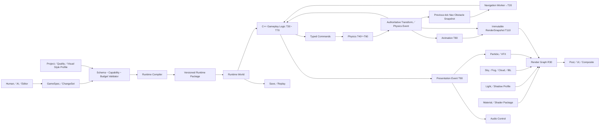

# Miraikanai Engine 2D／3D機能計画

- 文書版: 2.1
- 作成日: 2026-07-19
- 最終更新日: 2026-07-20
- 対象: 2D／3D Game Runtime、Editor、Asset pipeline、AI Authoring
- 状態: プロジェクト公式の機能範囲と段階設計
- 上位文書: [AIネイティブ独自ゲームエンジン 設計計画書](./2026-07-18-ai-native-game-engine-authoring-design.md)
- 基盤規約: [Miraikanai Engine 基盤アーキテクチャ規約](./2026-07-19-engine-foundation-architecture-design.md)
- C++言語・Modules規約: [Miraikanai Engine C++23・Named Modules・`import std`移行規約](./2026-07-20-cpp23-modules-import-std-transition-design.md)
- Runtime詳細規約: [Miraikanai Engine Runtime連携・寿命・性能規約](./2026-07-19-runtime-integration-lifetime-performance-design.md)
- Game実装規約: [Miraikanai Engine C++実行コード・構造化ゲームデータ規約](./2026-07-19-cpp-structured-game-data-design.md)
- Renderer規約: [Miraikanai Engine Rendering／Render Graphアーキテクチャ規約](./2026-07-19-rendering-render-graph-architecture-design.md)
- Particle／VFX規約: [Miraikanai Engine 独自Particle／VFX Platformアーキテクチャ規約](./2026-07-20-particle-vfx-architecture-design.md)
- Asset規約: [Miraikanai Engine Asset Pipeline／Content Package規約](./2026-07-19-asset-pipeline-content-packaging-design.md)
- Physics Engine規約: [Miraikanai Engine 独自Physics Platform／Dynamicsアーキテクチャ規約](./2026-07-20-physics-engine-architecture-design.md)
- Simulation連携規約: [Miraikanai Engine Physics／Navigation／Animation連携規約](./2026-07-19-physics-navigation-animation-architecture-design.md)
- Collision詳細規約: [Miraikanai Engine Collision／Colliderアーキテクチャ規約](./2026-07-19-collision-collider-architecture-design.md)
- Player I/O規約: [Input](./2026-07-19-input-action-device-architecture-design.md)／[UI・Text](./2026-07-19-ui-text-localization-accessibility-design.md)／[Audio](./2026-07-19-audio-mixer-spatial-architecture-design.md)
- Editor規約: [Miraikanai Engine Editor／Workspace／UX規約](./2026-07-19-editor-workspace-ux-design.md)
- Editor UI Framework規約: [Miraikanai Engine 独自Editor UI Framework／Shellアーキテクチャ規約](./2026-07-20-editor-ui-framework-architecture-design.md)
- Windows規約: [Miraikanai Engine Windows Platform／Distribution規約](./2026-07-19-windows-platform-distribution-design.md)
- モバイル規約: [Miraikanai Engine モバイルPlatformアーキテクチャ規約](./2026-07-19-mobile-platform-architecture-design.md)
- Domain Pack規約: [Miraikanai Engine Domain Pack／将来Capability規約](./2026-07-19-domain-pack-future-capability-roadmap.md)
- AI実装・保守規約: [Miraikanai Engine AI実装・保守ガバナンス規約](./2026-07-19-ai-engine-development-governance-design.md)
- 実行可能契約規約: [Miraikanai Engine 実行可能契約・Schema・Codegen規約](./2026-07-19-executable-contract-schema-codegen-design.md)
- AI検証規約: [Miraikanai Engine AI検証・評価・来歴規約](./2026-07-19-ai-verification-evaluation-provenance-design.md)

## 1. 結論

2Dと3Dは同格のFirst-class runtimeとし、2Dを「奥行きが0の3D」として実装しない。Asset、Input、Audio、UI、GameplayDefinition、AI Authoring、Build、Save、Diagnosticsは共有し、描画、Physics、Navigation、Animation authoringは専用Subsystemを持つ。

映像表現は、`scene_dimension`（2D／3D／Hybrid）、`art_direction`（Realistic／Toon／Pixel等）、`composition`（Native／Pixel Diorama等）、`shading_model`（PBR／Toon／Unlit等）を独立して扱う。2DをPixel表現、3DをRealistic表現と同一視しない。自然言語で「HD-2D風」と要求された場合は、特定製品を模倣する名前や実装を正規dataへ保存せず、「2D Pixel Artと3D空間を合成する」という一般要件へ分解し、独自の`pixel_diorama` Composition Profileとして実現する。

すべてのkernelを自作する方針は採らない。Miraikanai Engineが独自に所有するのは、公開Capability、正規data model、Editor UX、AI command、validation、lifetime、serialization、fallbackである。Collision solver、Navmesh polygon処理、GPU heap suballocationなど、検証済みLibraryが安全性と開発速度を大きく改善する部分はAdapter内で利用する。Game programming modelはC++23と`GameplayDefinition`に固定し、First-party C++公開境界はNamed Modules＋`import std`へ一方向移行する。汎用Game scripting runtimeは導入しない。

## 2. Capability成熟度

Product Phaseと機能の成熟度を混同しないため、各機能を次の四段階で管理する。

| Level | 意味 | 合格条件 |
|---|---|---|
| C0 Foundation | API、schema、validation、debug表示が存在 | Unit／conformance test |
| C1 First Playable | 一つの完成した2Dまたは3D縦切りで利用可能 | 開始から終了までplay可能 |
| C2 Production | 品質tier、profiling、authoring、fallbackを備える | Reference sceneの性能・安定性gate |
| C3 Advanced | 大規模World、高品質表現、特殊genre向け | 専用BenchmarkとDomain Pack |

初期MVPはC0を完成させた後、**2D縦切りをC1、3D compact action arenaをC1**へ順に到達させる。両方を同時に実装しない。AI Authoringの基盤検証を優先する最初の縦切りは2Dとし、Direct3D 12 rendererのProduction検証を行う第二の縦切りを3Dとする。

## 3. 全機能に共通する規約

各Capabilityの状態書込、実行phase、event順序、pointer／borrow、Asset version、memory／performance budget、overflow、failure recoveryはRuntime詳細規約へ従う。Capability同士は直接呼び出さず、typed command、event、immutable snapshot、version付きAssetを`RuntimeOrchestrator`が統合する。

### 3.1 座標、単位、角度

| 空間 | 規約 |
|---|---|
| 3D World | 右手系、+Y up、meter、radian |
| 3D object forward | +Z。Camera view forwardは−Z |
| 2D World | +X right、+Y up、float meter。Box2D境界でも1 World unit = 1 meter |
| 2D Asset mapping | `pixels_per_unit` = Source texture texel数／1 World meter。`pixel_2d`既定32 |
| UI | origin top-left、+X right、+Y down、DIP |
| Texture UV | origin top-leftのAsset APIへ正規化 |
| Clip／Depth | Engine正規clipのX／Yは`[-1,1]`、Zは`[0,1]`。reversed-Zでnear=1、far=0、depth clear=0、compare=`GREATER_EQUAL`。D3D12／Vulkan／Metal差とsurface pre-rotationはBackendで補正 |

2Dの`reference_resolution`はCamera出力のlogical pixel数であり、World座標単位ではない。たとえば32×32 texelのSpriteを`pixels_per_unit = 32`でimportするとWorld上の大きさは1×1 meterになる。ScaleをPhysics bodyへ直接適用しない。Collider生成時に固定scaleをbakeし、実行中のvisual scaleとphysics scaleを分離する。単位変換はImporterまたはAdapter境界だけで行い、暗黙変換を禁止する。

glTF importではglTF 2.0の右手系、+Y up、meter、radianを保持する。Objectのfront convention差はimport metadataへ記録し、mesh dataを無理由に再変換しない。

Engine mathはcolumn vector、column-major storage、`world = parent_world * T * R * S`とする。HLSLは`column_major float4x4`と`mul(matrix, vector)`だけを使い、CPU／Shader境界で暗黙transposeしない。Quaternionのfield順は`x,y,z,w`、rotation合成は`q_world = q_parent * q_local`、保存前に長さ1へ正規化する。`q`と`-q`の二重表現は、`w > 0`、`w == 0`なら最初の非0成分が正となる側へcanonicalizeする。zero-length、NaN／InfのQuaternionを拒否する。

### 3.2 Color、HDR、Alpha

- Lighting計算はscene-linear colorで行う。
- Base color／emissiveなど色textureはsRGBとしてdecodeする。
- Normal、roughness、metallic、depthなどdata textureはlinearとして読む。
- 2D spriteとUIはpremultiplied alphaを正規形式とし、import時に変換する。
- HDR scene bufferはC1でFP16を使用する。
- SDR出力はsRGB、HDR10出力はC2で追加する。
- Tone mapping、exposure、white balanceはCamera／Post Process Profileへ保存する。

### 3.3 時間

- Simulationはfixed tick、renderは可変tick＋interpolationとする。
- C1／C2の`fixed_tick_hz`はexactly 60、最大catch-upは4 step。ProfileとReplay headerへ60を保存し、別値をschemaで拒否する。
- Game pause、UI time、cinematic time、physics timeを明示的なclock domainに分ける。
- Animation curve、particle、audio schedulingはsecondを正規単位とする。
- Authoritative RandomnessはRuntime詳細規約のversion付き`DeterministicRngV1`とsystem／logical job別seed streamを使い、global random generatorとworker index由来seedを禁止する。

### 3.4 AIへ公開する編集単位

AIはGPU command、Physics native body、Navmesh polygon、raw shader resourceを直接操作しない。各Subsystemが次を提供する。

```text
CapabilitySchema
AuthoringComponent
TypedCommand
Validator
Preview
RuntimeCompiler
Diagnostics
```

例:

- `SetLightProfile`
- `CreateParticleEmitter`
- `ConfigureNavAgent`
- `AssignPhysicsMaterial`
- `CreateMaterialGraph`
- `BakeEnvironmentLighting`

CommandはStable ID、base project revision、型付き引数、precondition、推定costを持つ。Engineが生成したpreviewとDiffだけをCommit候補にする。

### 3.5 映像表現の正規四軸

次の四軸をGameSpecとWorld Modelの正規概念とする。自由文字列、Shader名、既存製品名を正規値として使わない。

| 軸 | 正規値 | 意味 |
|---|---|---|
| `scene_dimension` | `canvas_2d`、`world_3d`、`hybrid_2d3d` | 座標、Camera、Visibility、Physicsとの接続方式 |
| `art_direction` | `realistic`、`toon`、`pixel`、`illustrated`、`graphic`、`custom` | 作品全体の視覚言語 |
| `composition` | `native_2d`、`native_3d`、`pixel_diorama`、`layered_2d3d`、`custom` | Render layerと最終合成の方式 |
| `shading_model` | Material Domainごとに許可された型付き値 | 光と表面の応答方式 |

`shading_model`はProject全体で一つに固定しない。たとえば`pixel_diorama`は、3D背景に`pbr_metal_rough`、Character spriteに`hybrid_sprite_lit`、UIに`ui_unlit`を同時使用できる。ただし、組合せは承認済み`VisualStyleProfile`のallowlistに含まれなければならない。

「2.5D」は曖昧語なので正規値にしない。Requirement Resolverは、Side-view 3D、2D gameplay＋3D background、Billboard sprite in 3D、Pixel Dioramaのどれを意味するか解決する。

### 3.6 Capability連携の公式経路

次図は製品Capability間の概要である。Render pass／resource／barrierはRenderer規約、Asset generation／Catalog／PackageはAsset規約、Physics World／Dynamics／Joint／CharacterはPhysics Engine規約、Nav／AnimationとSubsystem間phaseはSimulation連携規約、入力・UI・Audioの各境界はPlayer I/O三規約を詳細基準とする。



| Producer | 渡す契約 | Consumer／反映点 | 禁止する近道 |
|---|---|---|---|
| Human／AI／Editor | revision付きChangeSet | Authoring Validator→Commit | UI widgetやLLMからlive Worldへ直接write |
| Gameplay Logic | typed Simulation／Structural command | 宣言consume phase／次`T00` | Physics、Nav、Render native API呼出し |
| Physics | normalized event、authoritative transform | `T60`後のGameplay、Animation、snapshot | callbackからEntity破棄、Render transform直接write |
| Navigation | version付きquery result | 次の`T20`→Gameplay | Physics pointer共有、stale Navmesh result適用 |
| Animation | pose、root-motion proposal、bounds | `T40` resolver／`T80`／RenderSnapshot | Physics transformとの二重write |
| Material／Light／Environment／VFX | version付きPresentation Asset／Profile | `R10` promotion→Render Graph | GPU resource、pass、bindingの直接編集 |
| Audio／VFX／Camera shake | bounded Presentation command | `T90`以後 | gameplay damage、Save、AI perceptionへの逆流 |

Asset、Profile、`GameplayDefinition`、C++の変更はdependency closure全体をstagingし、Runtime詳細規約の`T00`／`R10`だけでgenerationを切り替える。上図にないSubsystem間edgeを追加する場合は、Domain Port、typed contract、owner、phase、budget、failure policyをADRへ追加し、CMake DAGとconformance testを同じ変更で更新する。

## 4. 共通Engine機能

| Capability | C1 | C2 | C3 |
|---|---|---|---|
| Window／display | Platform surface、resolution、logical scale、orientation、safe area | HDR、desktop multi-monitor、mobile quality auto-detect | Multi-view特殊display |
| Input | Keyboard、mouse、touch、Platform controller、action map、rebinding、chord／context、C1 haptics、accessibility preset | Sensor optional、adaptive trigger／HD haptics、registered response curve | Specialized device |
| World | Stable ID、transform、component、prefab-like templateではないcomposition recipe | Streaming cell、dependency graph | Large-world origin rebasing |
| Asset | Import、content hash、cook、cache、hot reimport、bounded async streaming、`.mirapack` | LOD cook、Patch／DLC、remote build cache | Distributed cook |
| Save | Versioned save schema、checkpoint、atomic save | Slot、cloud adapter、partial world state | Large-world partition save |
| Audio | Engine mixer、voice、bus、spatial emitter、streaming music、Platform audio Adapter | reverb zone、ducking、profiler | Geometry acoustics |
| UI／Text | Layout、style、focus、touch／controller nav、Platform text／IME Adapter、Localization、screen reader semantics | UI animation、limited rich text span、MSDF | Advanced vector effects |
| GameplayDefinition | Rule／FSM／Ability／Quest／Dialogue／UI Flow schema、Validator、offline Cook、C++ evaluator | Behavior Tree、Blackboard、profiler、互換性検証済みhot reload | 署名済みdata-only Runtime content |
| Native code | NativeGameModule、isolated build、test | Incremental build、source-level profiling | Stable external SDKは1.0後 |
| Gameplay logic／AI | Typed state machine、Rule Graph、Cook済みRule、seeded random | Blackboard、perception、behavior tree／utility composition | Large-agent simulation policy |
| Camera | 2D／3D camera、viewport、blend、shake | Cinematic track、split view | Multi-camera recording |
| Diagnostics | Log、trace、memory、frame、capture | In-editor profiler、comparison baseline | Automated bottleneck advisor |
| Test | Unit、headless simulation、golden state | Image／audio／performance regression | Large scenario automation |
| Build | Development／Profile／Shipping、Target／Distribution Profile、signed manifest | AAB／archive packaging、crash symbols、Asset chunks | Multi-platform farm |
| Collaboration | ChangeSet history、text-diffable source、conflict検出 | Git status／diff連携、Asset lock adapter | Remote multi-user authoring |
| Networking | 対象外 | Transport abstractionの調査 | Authoritative multiplayer |

NetworkingをC1/C2へ暗黙に含めない。FPS/TPSというgenreはC1でsingle-playerとして成立させ、multiplayerは独立したC3計画とする。

### 4.1 Cameraの公式Contract

CameraはProjection、Viewport、Exposure／Post参照、Presentation rigを分離する。Gameplay aim／visibilityは`CameraIntentSnapshot`を入力にWorld／Physics側が判定し、Render interpolation後のCamera transformやcamera shakeをauthoritative判定へ使わない。

| Profile | Projection | 初期公式値 | Validation |
|---|---|---|---|
| `PerspectiveGameplayV1` | 右手系reversed-Z perspective | vertical FOV 60°、near 0.05 m、culling far 10,000 m | FOV 5～170°、near 0.01～10 m、far `> near`かつ最大1,000,000 m |
| `OrthographicGameplayV1` | 右手系reversed-Z orthographic | vertical size 11.25 m、near 0.01 m、far 1,000 m | size 0.001～1,000,000 m、far `> near` |
| `Pixel2DReferenceV1` | Orthographic＋logical raster | 640×360、32 PPUなのでvertical size `360/32=11.25 m` | Point sampling、integer scale、pixel-locked layerへのTAA jitter禁止 |

Perspective projectionはfinite culling farをVisibility、cluster、fogへ必ず渡し、projection matrixだけをinfinite-farへ変更することをC1では許可しない。Viewportはnormalized `(x,y,width,height)`、各field 0～1、width／heightは0より大きく、右端／下端が1以下であることを必須とする。Aspectは実viewport pixel幅／高さから毎frame計算し、Profileへ重複保存しない。

Camera blendの既定durationは0.35 s、positionはcubic smoothstep `t²(3-2t)`、rotationはshortest-path normalized slerp、vertical FOVは`tan(fov/2)`を同じsmoothstepで補間する。Base Camera rigは`T30`でfixed tick時間から決定論的に進めるauthoritative stateとし、Renderingは直前／現在のbase poseを補間するだけとする。duration 0は次の`T30`でcutとして適用し、同tickの`T90`がtemporal history破棄eventを出す。Camera shakeだけをPresentation stateとしてbase poseから分離する。

Camera collisionは`T30`でversion付きtyped sphere-cast requestを生成し、Physics Adapterが`T40`で直前に完了したPhysics worldへqueryし、`T60`でEngine値へnormalizeする。Camera rigは次tick`T20`でowner generationとPhysics scene versionが一致する結果だけを統合する。既定sphere radius 0.20 m、skin 0.05 m、最大補正距離10 mである。当該tickに結果がない場合は前回valid resultを最大2 tick保持し、3 tick目はcollision補正なしへ切り替えて`CameraCollisionStale`を記録する。Render threadからPhysics objectを直接queryしない。

Camera shakeはseed、開始tick、duration、translation／rotation amplitude、frequencyを持つbounded Presentation commandであり、最終View matrixへだけ合成する。既定上限は同時16 shake、translation各軸2 m、rotation各軸20°、frequency 0～60 Hz、duration 0～30 sとし、Gameplay aim、Physics、Save transformへ戻さない。

## 5. 2D RuntimeとEditor

### 5.1 2D Renderer

2Dは専用`CanvasRenderer`を持つ。3D opaque passへquadを混ぜる設計にしない。

#### C1: 2D Renderer Core

- Sprite、sprite sheet、texture atlas
- Region、flip、pivot、modulate color
- Nine-slice、tiled sprite
- Layer、explicit order、Y-sort group
- Dynamic batching、texture／sampler grouping
- Orthographic camera、pixel snap、integer scale option
- Parallax layer
- Scissor、mask、blend mode
- Polyline、polygon、basic shape
- 2D normal map
- Directional／point 2D light
- Signed-distance-field 2D shadow occluder
- Sprite material graphの制限subset
- Draw-call、overdraw、atlas occupancy debug view

#### C2: 2D Renderer Advanced

- Instanced sprite、GPU culling
- 2D light clustering
- Soft shadow、shadow atlas
- Vector path tessellation cache
- Render-to-texture、multi-camera composition
- Tilemap専用chunk renderer
- 2D post process stack

Blendの既定はpremultiplied alphaとする。Straight alpha Assetはimport時に変換し、Materialが明示要求した場合だけ別pipelineを使う。

#### 2D LightのC1公式Profile

`Light2DProfile::ReferenceMediumV1`をC1 fixtureへ固定する。

| 項目 | 初期公式値 | Hard上限／overflow |
|---|---:|---|
| 可視Directional 2D light | 1 | 1。2個目はvalidation error |
| 可視Point 2D light | 64 | 64。`priority desc, screen_coverage desc, StableId asc`で上限内を選ぶ |
| 1 spriteが評価するPoint light | 8 | 8。9個目以降は同じcanonical順で除外しcounterを出す |
| Shadow caster light | 8 | 8。AI ChangeSetは事前予測で超過したら拒否 |
| SDF occluder atlas | 2,048×2,048、`R16_SNORM` | 8 MiB。1 texel padding、skyline pack、repackは`R10`でatomic promotion |
| Shadow mask | internal resolutionの1/2 linear、最大960×540、`R8_UNORM` | Render Graph transient。camera cut／occluder generation変更で再生成 |

2D lightはscene-linearで合成し、sprite normalの既定は`(0, 0, 1)`、normal mapの接線基底はsprite local `+X,+Y,+Z`とする。Point lightの距離はmeter、fluxはlumen、rangeは0.01～1,000 mを必須とする。無限range、NaN／Inf、負のfluxを拒否する。C2 clusteringへ移行しても上記の選択順、物理単位、overflow telemetryを維持する。

### 5.2 Tilemap

Tilemapは単一巨大arrayではなく、変更・streaming・culling単位のchunkへ分割する。

#### C1: Tilemap Core

- Multiple tile layer
- Atlas tile、animated tile、collision shape、navigation tag
- 既定32×32 tileのchunk。Projectで変更可能
- Rectangle／line／fill／stamp／selection
- Rule-based terrain paint
- Chunk単位mesh rebuild
- Collider merge
- Paletteとcustom metadata

#### C2: Tilemap Advanced

- World streaming
- Background async chunk cook
- Procedural rule preview
- Occlusion／light mask
- Runtime editを許可するtile command

AIはtile IDの巨大配列を直接生成せず、region、rule、seed、constraintを持つ`TileLayoutCommand`を提案する。Engineが実tileへ展開し、接続不良、到達不能、過大変更を検証する。

### 5.3 2D Physics

Box2D 3.1.1を`Physics2DBackend`のprivate kernelとして採用する。設計上の選択は確定しているが、対象TargetのKernel QualificationとC1 fixture合格前は`candidate_locked`でありProduction表示しない。

本節はCapability範囲を決める。Body／Collider分離、shape field、Material、Filter、Sensor、Query、Event、Cook、Editor、AI Operation、budget、合格条件の正本はCollision詳細規約とする。

World／Solver全値、Box2D build／job／allocator bridge、Dynamics、Joint、Character Motor、Save／Replay、Physics AI／Editor、Kernel Qualification、memory／failureはPhysics Engine規約を詳細基準とする。PhysicsとNavigation／Animationのsnapshot／command接続はSimulation連携規約を基準とする。

#### C1: 2D Physics Core

- Static／kinematic／dynamic body
- Circle、capsule、box、convex polygon、segment、chain shape
- Sensor、collision layer／mask
- Distance、revolute、prismatic、weld joint
- Physics material
- Ray cast、shape cast、overlap query
- Contact begin／end、trigger event
- Kinematic character motor
- Fixed 60 Hz、`sub_step_count=4`をC1 reference値とする
- Collider、contact、sleep state debug draw

#### C2: 2D Physics Advanced

- One-way platform
- Continuous collision quality profile
- Buoyancy／area force
- Ragdoll-like joint authoring
- Large tile collider streaming
- Concave sourceの明示Preview付きconvex piece生成
- Physics query profiler

`Physics2DWorldProfileV1`はPhysics Engine規約8.2節の全fieldを保存し、`sub_step_count`はinteger 1～8、Reference 4とする。Box2D 3.1.1のgravity -10、maximum linear speed 400を暗黙採用せず、Miraikanaiの-9.81 m/s²、hard上限1,000 m/s、contact／sleep／continuous／worker値を全展開する。Play中変更を拒否する。

Physics eventは`T60`でStable IDへ変換し、Runtime詳細規約7.3節のcanonical keyで配送する。Box2D pointer、body ID、callback中のWorld変更をGame APIへ露出しない。Event ordering、invalid ID破棄、同一native event bufferを二度consumeしないことをAdapter conformance testで固定する。

### 5.4 2D Navigation

2Dではgrid navigationとpolygon navigationを別backendとして提供する。

Nav grid／query／obstacle snapshot／async resultのfield、phase、budget、stale結果破棄はSimulation連携規約を詳細基準とする。

#### C1: 2D Navigation Core

- Tilemapからwalkable grid生成
- A* query、cost layer、blocked cell
- Agent radiusを考慮したclearance
- Reachability validation
- Path debug overlay

#### C2: 2D Navigation Advanced

- Polygon navigation region
- Dynamic obstacle update
- Hierarchical pathfinding
- Flow field（Simulation Domain Pack）
- Local avoidance

AIがlevelを作る際はspawnからgoalまで、必須interaction point間、escape routeの到達可能性を自動Testする。

#### 2D NavigationのC1公式Profile

`GridNav2DProfile::ReferenceV1`は次で固定する。

| 項目 | 初期公式値 |
|---|---:|
| Navigation cell | 0.25 m正方形 |
| 接続 | 8近傍。斜め移動は両隣の直交cellがwalkableな場合だけ許可 |
| Cost | 直交`65,536`、斜め`92,682`のQ16.16。area multiplierは`[0.0625, 64.0]` |
| Heuristic | admissibleなoctile distance。同点は`f`, `h`, canonical cell indexの昇順 |
| 1 queryの展開node | 65,536 |
| 1 pathのcell | 8,192 |
| 1 assetのwalkable grid | 最大16,777,216 cell、cell payload 32 MiB、metadataを含むresident／serialized hard cap 34 MiB |
| Agent radius | 0.40 m、schema範囲0～8 m。clearanceは`ceil(radius / cell_size)` |

cell payloadはrow-major `cell_index = y * width + x`で、1 cell exactly 2 byteの`uint8 area_id`＋`uint8 clearance_cells`とする。`area_id=0`はblocked、1～255は256-entryのQ16.16 area-cost tableを参照する。clearanceは0～255 cellで飽和するが、Profileの必要clearanceを255超へ設定したAssetはcook errorにする。Path累積costは`uint64`で計算し、加算前overflow検査に失敗したqueryを`CostOverflow`とする。

Tilemap cellとNavigation cellが一致しない場合、各Navigation cellが重なるcollision／blocked sourceを保守的ORで集約し、狭い障害を消さない。上限到達はpartial pathに偽装せず`SearchBudgetExceeded`、到達不能は`NoPath`、入力generation不一致は`StaleInput`を返す。Project Profile変更はgrid全体をDerived Assetとして再cookし、Play中の暗黙resampleを禁止する。2D／3D Navigationを併用するProjectでも、live Nav payload合計36 MiBとRuntime詳細規約13.1節のNavigation Domain内訳を超えてはならない。

### 5.5 2D Animation

Sprite animationのAsset／state graph／event／root motion proposal、pose反映phase、buffer lifetime、budgetはSimulation連携規約を詳細基準とする。

#### C1: 2D Animation Core

- Flipbook
- Property track
- Curve／event track
- Tween
- State machineとtransition condition
- Blend parameter
- Preview、scrub、onion skin

#### C2: 2D Animation Advanced

- Cutout skeleton
- IK chain
- Blend space
- Animation retarget profile
- Root-like 2D displacement

Animation eventは任意関数名を文字列で呼ばず、登録済みtyped Gameplay Eventを発行する。

### 5.6 2D縦切りの合格Scene

最初のC1は`pixel_2d` VisualStyleProfileを使用するtop-down action gameとする。論理解像度640×360、`pixels_per_unit = 32`、`integer_scale_policy = letterbox`を固定fixtureとし、1920×1080では3倍Point upscaleで表示する。

- Title、settings、play、result
- 一つのtilemap level
- Player movement、attack、damage
- 3 enemy archetype、spawn rule
- Goal、checkpoint、save／load
- 2D light、particle、camera shake、music／SFX
- `pixel_2d` Profile、Sprite Material Template、Pixel-safe Post設定
- AIが自然言語からlevel、rule、UI、`GameplayDefinition`を生成
- 人間がInspector、Graph、table／form、必要時はC++で修正後、AIが差分を保持して再編集
- 1080p60、10,000 visible sprite、500 dynamic physics bodyのReference stress scene

Stress sceneはgameplay sceneと分離し、同時にすべてを要求しない。Reference hardwareでP95 frame time 16.67 ms以内、GPU／CPUいずれも継続的budget超過なしを合格条件とする。

## 6. 3D RuntimeとEditor

### 6.1 MeshとWorld Rendering

#### C1: Mesh／World Rendering Core

- Static mesh、skinned mesh、morph target
- glTF 2.0 import
- Vertex／index buffer cook
- PBR metallic-roughness material
- Normal、occlusion、emissive
- Camera frustum culling
- Manual／generated LOD
- Hardware instancing
- Decal
- Transparent forward pass
- Debug wireframe、bounds、normal、material view

#### C2: Mesh／World Rendering Advanced

- GPU-driven instance culling
- Occlusion culling
- HLOD
- Meshlet／indirect pathはfeature query後に任意
- Streaming cell
- Terrain、foliage、water
- Reflection probe

glTFはinterchange formatであり、Runtime source of truthにしない。Import後は独自Asset schemaへ変換し、cook時にGPU向けformatへ変換する。

### 6.2 Renderer architecture

`RenderSnapshot`、extract、Render Graphのresource／pass／access宣言、graph compile、Backend Adapter、GPU lifetime、device-loss recoveryはRenderer規約を詳細基準とする。本節は2D／3D製品機能と品質到達点だけを決定する。

Render GraphをC0で作り、resource lifetime、state transition、queue、aliasingをcompileする。

- **C1**: Forward+ opaque／masked、forward transparent、depth prepassを基本とする。
- **C2**: Deferred opaque lightingを追加し、Material／quality profile単位でForward+と選択するHybrid rendererにする。
- Compute、copy、direct queueをRender Graphが依存関係からscheduleする。
- Render pathは同じMaterial IRとlighting data contractを使う。
- Ray tracingはC3 optional pathであり、raster fallbackを必須とする。

Forward+を最初にする理由は、透明、MSAA、2D／3D合成を一つの実装で成立させ、最初の縦切りを過剰に広げないためである。多数lightと複雑なopaque materialの実測が必要になった段階でDeferred pathを加える。

### 6.3 LightとShadow

物理量を使用し、無単位の「強さ」だけを公開しない。

| Light | 単位 | C1 | C2 |
|---|---|---|---|
| Directional | lux | 最大2 visible、shadow caster 1 | 最大4 visible、shadow caster 1 |
| Point | lumen（C1）／candela配光（C2 IES） | lumen source | IES profile |
| Spot | lumen（C1）／candela配光（C2 IES） | lumen source | IES profile |
| Rectangle／Disk | nit | 非対応 | LTC近似 |
| Emissive surface | nit | 見た目のみ | probe／GIへの寄与 |

Shadow:

- DirectionalはCascaded Shadow Map。
- Spotはatlas 2D shadow。
- Pointはcubemap shadow。
- Resolution、cascade、bias、update frequencyをLight Quality Profileで制御する。
- Shadow atlasはbudgetを持ち、priority、screen influence、distanceで割り当てる。
- 無効なbias、過大resolution、atlas overflowをValidatorで拒否または明示fallbackする。

AIはlightを無制限に追加できない。Project Profileのvisible light数、shadow caster数、shadow texel budgetをChangeSet validationで検査する。

#### Light schemaと初期公式値

Engineは単位ごとのfieldを別型で保持し、内部で一つの無単位`intensity`へ畳み込まない。

| 型 | Authoring field | Preset既定 | Schema範囲 |
|---|---|---:|---:|
| Directional | `illuminance_lux` | daylight 100,000 lux／moonlight 0.20 lux | 0～200,000 lux |
| Point | `luminous_flux_lm`, `range_m` | 1,000 lm、10 m | 0～1,000,000 lm、0.01～10,000 m |
| Spot | `luminous_flux_lm`, `inner_deg`, `outer_deg`, `range_m` | 1,500 lm、20°、35°、20 m | flux／rangeはPoint同等、`0 <= inner < outer < 179` |
| Rectangle／Disk | `luminance_nit`, size | 1,000 nit、1×1 m | 0～100,000 nit、各辺0.001～1,000 m |
| 共通 | linear RGB／CCT、priority、mobility | D65 6,500 K、priority 128、dynamic | CCT 1,000～20,000 K、priority 0～255 |

色はlinear RGBまたはCCT＋tintのどちらか一方をsource of truthとし、両方の同時編集を拒否する。CCT presetからlinear RGBへの変換versionをCook manifestへ保存する。Light range外は物理的に寄与0とし、しきい値からEngineが暗黙にrangeを逆算しない。

C1 Point／Spot Lightのsource of truthは`luminous_flux_lm`だけとし、candela入力とIES profileをschemaで拒否する。C2 IES modeはPoint／Spotのどちらでも、ANSI/IES LM-63-19(R25) Asset内のcandela配光とdimensionlessな`intensity_scale`をsource of truthに切り替え、`luminous_flux_lm`との同時指定を拒否する。初期ImporterはLM-63-19(R25)のPhotometric Type C、`TILT=NONE | INCLUDE`だけを受理し、Type A／B、外部TILT file参照、旧版識別子は`UnsupportedPhotometricProfile`で拒否する。単位、縦横角、lamp multiplier、有限かつ非負のcandela値を検証して独自`PhotometricDistributionV1`へcookし、raw IES配列をRuntime APIやAIへ公開しない。C2実装開始前に、開発組織が利用できる正規の規格本文と再配布可能なconformance fixtureのlicenseを記録する。未取得ならIES CapabilityだけをC1のまま維持し、推測実装しない。

#### 3D Light／Shadow Quality Profile

`ReferenceMediumV1`をC1／1080p fixtureの公式Profileとする。Forward+ clusterは16×16 internal pixel tile、near～cluster farを対数分割し、cluster farは`min(camera_far, 10,000 m)`とする。Compact light-reference listは32-bit index、cluster headerは32-bit offset＋16-bit count＋16-bit flagsである。

| 項目 | Low | ReferenceMediumV1 | High |
|---|---:|---:|---:|
| 可視local light | 128 | 512 | 2,048 |
| 可視Directional light | 1 | 2 | 4 |
| Z slice | 16 | 24 | 32 |
| 1 clusterのlocal light | 32 | 64 | 96 |
| 全clusterのreference | 262,144 | 1,048,576 | 2,097,152 |
| Shadowed local face-equivalent | 4 | 16 | 32 |
| Shadowed Point light | 最大0 | 最大2 | 最大4 |

Point shadowは6 face-equivalent、Spot shadowは1を消費する。Light listは`priority desc, screen_influence desc, distance asc, StableId asc`でstable sortする。GPU cull後に上限を超えた場合はこの順で末尾を除外し、`ClusterLightOverflow`をframe、cluster、除外StableId付きで記録する。AI提案が静的解析またはpreview sceneで上限を超える場合はChangeSetを拒否し、runtime overflowへ依存させない。

Shadow resourceは`R16_TYPELESS`＋depth view／`R16_UNORM` shader viewを使い、Profileのpersistent capへmetadataとalignmentを含める。

| 項目 | Low | ReferenceMediumV1 | High |
|---|---:|---:|---:|
| Directional cascade | 2×1,024² | 4×2,048² | 4×4,096² |
| Shadow distance | 80 m | 150 m | 300 m |
| Split | practical split λ=0.70 | 同左 | 同左 |
| Cascade transition | 各cascade範囲の10% | 同左 | 同左 |
| Local shadow atlas | 2,048² | 4,096² | 8,192² |
| 既定Spot tile | 512² | 1,024² | 2,048² |
| 既定Point face | 非対応 | 512² | 1,024² |
| Shadow persistent cap | 16 MiB | 80 MiB | 288 MiB |

CSM projectionをtexel単位でstabilizeし、cascade splitはcamera nearとShadow distanceから毎frame再計算する。既定biasはconstant 1.0 texel、slope 1.5 texel、normal offset 0.5 texel、schema範囲は各0～8 texelとする。Lightごとのresolution要求は128、256、512、1,024、2,048、4,096のいずれかに限定し、atlasへ入らない要求は自動縮小せず`ShadowAtlasExceeded`とする。LowでPoint shadowを要求した場合も同じtyped errorを返す。Shadow passはRuntime詳細規約14.4節の2.00 ms soft cap、16.67 ms frame hard acceptanceの両方を満たす。

Shadow updateは`static`をLight／caster Asset generation変更時だけ、`stationary`をLightまたはcaster transform／visibility generation変更時、`dynamic`を毎frameとする。1 frameのlocal updateはLow 4、Medium 16、High 32 face-equivalentまでで、`priority desc, StableId asc`にdirty tileを更新する。上限を超えたdirty tileは旧generationを表示して`ShadowUpdateDeferred`を記録し、新旧cascade／cubemap faceを一組のLight内で混在させない。Directional shadow casterは全Tierで1とし、複数Directionalがvisibleでもshadow対象は`casts_shadow=true`のうち同じ`priority desc, StableId asc`の先頭だけである。AI proposalが2個以上を要求した場合はfallbackせずvalidation errorにする。

Global illuminationは次に段階化する。

- C1: direct lighting＋environment IBL。Dynamic GIを前提にしない。
- C2: offline baked lightmap、irradiance probe volume、reflection probe。Static／stationary／dynamic mobilityを明示する。
- C3: hardware非依存のdynamic diffuse GIを研究し、ray tracingは品質向上用の任意backendとする。

Lightmap、probe、IBLはDerived Assetとし、geometry、material、light、baker version、quality settingsのhashから再生成する。AIは`BakeLighting`を要求できるが、bake結果のtexelを直接生成・編集しない。

### 6.4 Sky、Atmosphere、Fog、Cloud、Environment Lighting

これらを別々の装飾機能ではなく、共通の`EnvironmentProfile`として連携させる。

#### C1: Environment Core

- Solid／gradient sky
- HDR environment cubemap
- Directional sun／moon link
- Image Based Lightingのdiffuse irradianceとspecular prefilter
- Height fog＋exponential distance fog
- Automatic／manual exposure
- Environment bake command

`EnvironmentProfile::ReferenceEarthV1`の物理presetは次をsource dataとして保存する。C1ではsun／ground／IBLだけを使用し、atmospheric scatteringはC2 Capabilityが有効な場合だけ評価する。距離単位はmeter、係数は`m^-1`であり、shader内のkm表現へ暗黙変換しない。

| 項目 | 初期公式値 |
|---|---|
| ground／top radius | 6,360,000 m／6,460,000 m |
| ground albedo | linear RGB `(0.3, 0.3, 0.3)` |
| Rayleigh scattering／scale height | `(5.802, 13.558, 33.100) × 10^-6 m^-1`／8,000 m |
| Rayleigh absorption | `(0, 0, 0) m^-1` |
| Mie scattering／absorption／scale height／g | `3.996 × 10^-6 m^-1`／`4.400 × 10^-6 m^-1`／1,200 m／0.8 |
| Ozone absorption | `(0.650, 1.881, 0.085) × 10^-6 m^-1` |
| Ozone density | 25,000 mで1、そこから上下15,000 mで0となるtriangle profile |
| Sun angular radius | 0.267° |

任意planet presetではground radius、top radius、各scattering／absorption、density profile、phase g、ground albedoをすべて明示する。`top_radius > ground_radius > 0`、全係数finiteかつ0以上、`-0.999 <= g <= 0.999`を必須にし、欠落値をEarth presetから個別補完しない。

C1 IBLはdiffuse irradiance cubemap 32²×6 `RGBA16_FLOAT`、specular prefilter cubemap 256²×6・9 mip `RGBA16_FLOAT`、split-sum BRDF LUT 256² `RG16_FLOAT`とする。HDR source cubemapはProject Assetであり、sourceを除くこのpersistent IBL setは8 MiBへ収める。Exposureはautomaticを既定とし、EV100 -16～32を256 log-luminance binへ量子化した0.5～99.5 percentile histogram、18% middle gray、出力EV100範囲-6～16、compensation 0、brighten 1.5 EV/s、darken 3.0 EV/sをCook済みProfileへ保存する。

Height fogは`e=clamp(-height_falloff*(y-base_height), -80, 80)`、`extinction(y)=base_extinction*exp(e)`、距離fogは`optical_depth=clamp(extinction*d, 0, 80)`、`transmittance(d)=exp(-optical_depth)`と定義する。既定は`base_extinction=0.01 m^-1`、`height_falloff=0.10 m^-1`、`base_height=0 m`、albedo `(0.9,0.9,0.9)`、max distance 10,000 mである。extinction／falloffは0～10 `m^-1`、base heightは±1,000,000 m、albedoは各0～1、distanceは1～1,000,000 mとし、負数、NaN／Infを拒否する。

#### C2: Environment Advanced

- Physically based atmosphereのtransmittance、multi-scattering、sky-view LUT
- Aerial perspective
- Froxel volumetric fog
- Local fog volume
- Volumetric cloud ray march
- Weather coverage／density map
- Temporal reprojection、blue-noise jitter
- Dynamic skyからIBLを段階更新
- Cloud shadow map

Atmosphere LUTはHillaire 2020の構成を採り、Miraikanaiの`AtmosphereLutProfile::ReferenceV1`を次に固定する。

| LUT | 解像度／format | 1 texelのray-march step | 更新条件 |
|---|---|---:|---|
| Transmittance | 256×64 `RGBA16_FLOAT` | 40 | atmosphere generation変更 |
| Multiple scattering | 32×32 `RGBA16_FLOAT` | 20 | transmittance／light generation変更 |
| Sky view | 200×100 `RGBA16_FLOAT` | 30 | observer altitude／sun direction／atmosphere generation変更 |
| Aerial perspective | 32×32×32 `RGBA16_FLOAT` | 30 | camera frustum／sun／atmosphere generation変更 |

step数は最大値ではなく正確なreference値とし、Quality Profile以外から変更できない。各rayではjittered stratified midpointを使い、光学的厚さまたはplanet boundary到達で終了する。LUTの旧generationは新しい4枚すべてがreadyになるまでliveとし、`R10`でatomic promotionする。

Volumetric fogはcamera-aligned froxelを使う。

| 項目 | Medium | High |
|---|---:|---:|
| 最大grid | 160×90×64 | 240×135×96 |
| XY寸法 | `min(ceil(internal/12), 160×90)` | `min(ceil(internal/8), 240×135)` |
| Z分布 | near～fog farのexponential、隣接slice幅比1.2 | 同左 |
| Local fog volume | 32 | 128 |
| Fogへ注入するlocal light | 64 | 128 |
| current／history scattering | 各`RGBA16_FLOAT` | 各`RGBA16_FLOAT` |
| extinction | `R16_FLOAT` | `R16_FLOAT` |

`fog_far = min(EnvironmentProfile.max_fog_distance, camera_far)`とし、`N` sliceの最初の幅を`Δz0 = (fog_far-near) * (1.2-1) / (1.2^N-1)`、以後`Δzi = Δz0 * 1.2^i`とする。`fog_far <= near`はProfile validation errorである。

Cloud layerの既定bottom／topはgroundから1,500 m／5,000 m、最大view ray distanceは100,000 m、coverage 0.50、density multiplier 1.0である。bottomは0～100,000 m、topは`bottom + 1 m`～200,000 m、coverage／densityは0～1／0～10を許可する。Volumetric cloudはMediumで`ceil(internal_width/4) × ceil(internal_height/4)`（最大480×270）、primary 48 step、light 6 step、Highで`ceil(internal_width/2) × ceil(internal_height/2)`（最大960×540）、primary 96 step、light 8 stepとする。view segment `[entry, exit]`のstep長は`(exit-entry)/N`、sample位置は`entry + (i + blue_noise_0_1) * step_length`、sun方向のlight sampleも同じuniform ruleを使う。blue-noise phaseを256 frameで循環し、accumulated opacity 0.995またはscene depthでearly-outする。Cloud sourceは512² weather map `RGBA8_UNORM`、128³ base noise `R8_UNORM`、32³ detail noise `R8_UNORM`のDerived Assetとする。Cloud shadowはMedium 1,024² `R16_FLOAT`を4 frameごと、High 2,048²を2 frameごとに更新し、sun directionが1°以上変化またはweather generation変更時は即時更新する。

Dynamic IBL更新は6 face capture、1 diffuse convolution、9 specular mipのexactly 16 work unitで構成し、staging setへ最大1 unit／frameを実行する。16 unitすべてがreadyになった時だけ`R10`でgenerationを切り替える。1 frameの更新soft capは0.25 msで、超過時は作業を次frameへ送るが部分generationを公開しない。

#### C3: Environment Research

- Multiple atmosphere body
- Advanced weather front
- Large-world cloud streaming
- Hardware ray traced environment option

Quality fallback:

| Tier | Atmosphere | Fog | Cloud |
|---|---|---|---|
| Low | Precomputed sky cubemap | Height／distance fog | 2D cloud layer |
| Medium | Atmosphere LUT | 最大160×90×64 froxel | 1/4-linear、48／6 step volumetric |
| High | Atmosphere LUT＋dynamic IBL | 最大240×135×96 froxel | 1/2-linear、96／8 step＋shadow |

Environmentのpersistent、history、当該pass専用transientを合算した同時peak capはLow 32 MiB、Medium 128 MiB、High 256 MiBとし、Runtime詳細規約12.1節のTextureまたはRender target／transient Domainにも二重ではなく所属classで計上する。Render Graph aliasで物理heapを共有するresourceはcommitted physical byteを一度だけ数えるが、aliasを見込んだ未証明の0 byte見積りを禁止する。MediumをC2 reference acceptanceに使い、Atmosphere／Environment pass全体を同規約14.4節の2.00 ms soft capへ収める。Highも14.00 ms GPU frame soft targetを免除しない。

Cloudとvolumetric fogはtransparent lighting、depth、motion vector、exposureとRender Graph上で明示依存する。履歴は、明示camera cut、world-origin rebase、internal width／height変更、非jitter projection変更、Environment generation変更、sun directionが1 frameで5°以上変化、weather coverage／density fieldの最大絶対差が正規化値0.20以上になった場合に全破棄する。履歴を破棄したframeはhistory weight 0、次の7 frameで`min(0.90, valid_frames / 8)`まで増加させる。AIはhistory weightや破棄判定を直接編集できない。

### 6.5 Post Processing

#### C1: Post Processing Core

- Exposure
- Tone mapping
- Bloom
- Color grading LUT
- Vignette
- Depth of fieldの簡易版
- FXAA、TAA
- Motion vector infrastructure

#### C2: Post Processing Advanced

- Motion blur
- High-quality depth of field
- Screen-space ambient occlusion
- Screen-space reflection
- Upscaling adapter
- HDR10 output

Effectの順序はPost Process Graphで固定し、AIは登録済みnodeと範囲検証済みparameterだけを編集する。Temporal effectにはhistory invalidation contractを必須とする。

### 6.6 3D Physics

Jolt Physics 5.6.0を`Physics3DBackend`のprivate kernelとして採用する。設計上の選択は確定しているが、対象TargetのKernel QualificationとC1 fixture合格前は`candidate_locked`でありProduction表示しない。

本節はCapability範囲を決める。Body／Collider分離、shape field、Material、Filter、Sensor、Query、Event、Cook、Editor、AI Operation、budget、合格条件の正本はCollision詳細規約とする。

World／Solver全値、Dynamics、Constraint、Character Motor、Jolt build／job／allocator bridge、Save／Replay、Physics AI／Editor、Kernel Qualification、memory／failureはPhysics Engine規約を詳細基準とする。Navigation／Animationとのsnapshot／command接続はSimulation連携規約を基準とする。

#### C1: 3D Physics Core

- Static／kinematic／dynamic rigid body
- Box、sphere、capsule、cylinder、convex hull、static triangle mesh、non-streaming heightfield
- Collision layer／mask、sensor
- Ray、shape cast、overlap
- Contact／trigger event
- Character controller
- Fixed 60 Hz、`collision_steps=1`をC1 reference値とする
- sleep、`Discrete | LinearCast` continuous collision profile
- Fixed、Point、Distance、Hinge、Slider、SwingTwist constraint
- Debug draw、island、contact profiler

#### C2: 3D Physics Advanced

- Ragdoll
- Vehicle
- Destructible constraint setup
- Tiled heightfield update／large static world streaming
- SixDOF constraint

#### C3 Research（C1／C2の実装範囲外）

- Jolt CPU soft bodyはResearch Capabilityとし、C1／C2 package schemaでは拒否する
- GPU compute、GPU／hair simulationは基盤規約どおりBuild無効のままとする
- CPU soft bodyをProductionへ昇格するには、rigid bodyとのcontact、save／reload、deterministic replay範囲、32 MiB TempAllocator上限、両Reference GPU環境でのCPU frame budgetを専用fixtureで合格させ、本書を改訂する

Dynamic bodyへtriangle mesh colliderを許可しない。非uniform scaleはcook時にbakeする。Runtimeでscale変更されたcolliderは自動再cookせず、明示errorにする。

`Physics3DWorldProfileV1`はPhysics Engine規約8.3節でJolt 5.6.0 `PhysicsSettings{}`の全field、`PhysicsSystem::Init` capacity、64 body mutex、32 MiB TempAllocator、worker、Build Profileを保存する。`collision_steps`はinteger 1～2、Reference 1とする。HighSpeed bodyだけ`LinearCast`を明示でき、既定は`Discrete`、Play中のProfile変更は拒否する。

Physics determinismは同一version／platform／thread設定のreplay範囲で検証する。Network lockstep相当のcross-platform determinismは保証しない。

### 6.7 3D Navigation

Recast／Detour 1.6.0でEditor／cook時にNavmeshを構築し、DetourでRuntime queryを行う。

Build input、tile generation、query handle、dynamic obstacle、off-mesh connection、async publish、budget／failureはSimulation連携規約を詳細基準とする。

#### C1: 3D Navigation Core

- Walkable slope、height、step、radiusを持つAgent Profile
- Geometry収集filter
- Tile Navmesh build
- Point projection、path query、straight path
- Off-mesh link
- Area typeとcost
- Navmesh overlay、tile、failed query debug
- Spawn／goal reachability test

#### C2: 3D Navigation Advanced

- TileCacheによるdynamic obstacle
- Partial tile rebuild
- Crowd local avoidance
- Hierarchical long-distance query
- Streaming tile
- Jump／climb／door linkのtyped action

#### Runtime生成の制限

初期RuntimeではAIがpolygonを生成しない。許可するのは既存tile上のcost、off-mesh link、dynamic obstacle、goalの変更だけとする。Navmesh rebuildはEditorまたはserver-controlled bounded regionに限定する。

Navmesh build resultはDerived Assetであり、source geometry、Agent Profile、builder version、settings hashから再生成できる。

#### 3D NavigationのC1公式Profile

`NavAgentProfile::HumanReferenceV1`と、そのRecast cook値を次に固定する。`cell_size = radius / 2`はRecastの公開starting guidanceに従い、それ以外の値は本Projectの初期公式値である。

| Agent／Recast field | 初期公式値 |
|---|---:|
| Agent height／radius／max climb／max slope | 1.80 m／0.40 m／0.40 m／50° |
| `cs`／`ch` | 0.20 m／0.10 m |
| `walkableHeight`／`walkableRadius`／`walkableClimb` | `ceil(1.80/0.10)=18`／`ceil(0.40/0.20)=2`／`floor(0.40/0.10)=4` voxel |
| `tileSize`／world tile width | 64 voxel／12.80 m |
| `borderSize` | `walkableRadius + 3 = 5` voxel |
| partition | Watershed |
| `minRegionArea`／`mergeRegionArea` | 64／400 voxel² |
| `maxEdgeLen`／`maxSimplificationError` | 16 voxel／1.3 voxel |
| `maxVertsPerPoly` | 6 |
| `detailSampleDist`／`detailSampleMaxError` | 1.20 m／0.10 m |
| build filter | low-hanging obstacle、ledge span、low-height spanをすべて有効 |

1 Navmesh versionは最大1,024 active tile、36 MiB cooked／resident data、1 tile 8,192 polygon、1 query node pool 4,096 node、corridor 2,048 polygon ref、straight path 256 pointとする。cook時にいずれかを超えたら分割済みWorld cellを要求し、値を切り捨てない。Detour queryのstatus bitを`Success | NoPath | PartialPath | SearchBudgetExceeded | StaleNavMesh | InvalidEndpoint`へ正規化し、`PartialPath`はrequestが`allow_partial=true`のときだけ成功扱いにする。Runtime request／result各4,096／tickと、2D／3D live payload合計36 MiBを含むNavigation Domain 64 MiB内訳はRuntime詳細規約11.2節／13.1節を優先する。

EngineのNav areaは`uint8` 0～63、0をblocked、1をwalkable defaultとし、Detourの6-bit areaへ同値変換する。area traversal multiplierはfiniteな`[0.0625, 64.0]`、既定1.0で、0または負値を「通行不可」の別表現にしない。Point projection half-extentsは`(2.0, 4.0, 2.0) m`、endpointがこのbox内のpolygonへprojectできなければ`InvalidEndpoint`とする。Custom extentは各軸0.01～100 mで、query payloadへ明示する。

Agent Profile変更はsource geometry hashが同じでも全tileを再cookする。AIは登録済みProfileの選択、area cost、typed off-mesh linkを編集できるが、voxel値、tile header、polygon refを直接指定しない。Custom Profileは上記式とschemaを通し、予測cook memory、build時間、clearance fixtureをpreviewして人間の承認後だけProject既定へ昇格できる。

### 6.8 3D Animation

ozz-animationをsampling／compression primitiveとしてAdapter内で利用し、Animation Graphは独自に実装する。

Skeleton／clip、Engine-owned Animation Graph、state machine、root motion、IK policy、data flow、phase、pose buffer lifetime、budgetはSimulation連携規約を詳細基準とする。

#### C1: 3D Animation Core

- Skeleton、clip、compressed track
- Sampling、cross-fade、layer、mask
- State machine
- Parameter／typed event
- Root motion
- Skinning
- Preview、scrub、transition debug

#### C2: 3D Animation Advanced

- 1D／2D blend space
- Additive animation
- IK、look-at、foot placement
- Retarget profile
- Motion warping
- Ragdoll blend

Game ruleはclip名文字列へ依存せず、Animation Capabilityとsemantic tagを参照する。Root motionの所有者をCharacter MotorまたはAnimationのどちらか一方に明示し、二重適用を禁止する。

### 6.9 3D縦切りの合格Scene

第二C1は`realistic_basic` VisualStyleProfileを使用するsingle-player third-person compact action arenaとする。

- Title、settings、play、result
- Player locomotion、camera、attack、damage
- 3 enemy archetype、Navmesh追跡
- One quest goal、checkpoint、save／load
- Directional、point、spot lightとshadow
- Sky／IBL／height fog
- PBR material、particle、animation、spatial audio
- glTF core／Unlit／Emissive Strength／Texture Transform Material importとPBR reference sphere
- AIが自然言語からarena、rule、UI、`GameplayDefinition`、Asset設定を生成
- Inspector、Scene View、Graph、table／form、NativeGameModule Capabilityの手動修正
- 2,000 visible mesh instance、100 dynamic rigid body、50 navigation agentのstress scene

Reference hardwareで1080p60、P95 frame time 16.67 ms以内、Game runtime CPU memory 2 GiB以内、GPU Project budget内を合格条件とする。

## 7. Particle／VFX

Particle／VFXのAsset、Emitter、Graph、Node Catalog、CPU／GPU execution、Renderer binding、AI／Editor Operation、Diagnostic、Qualificationの正本は[独自Particle／VFX Platform規約](./2026-07-20-particle-vfx-architecture-design.md)とする。本節は製品CapabilityとMilestone上の到達点、およびReview用Budget要約を所有する。数値を変更する場合は両文書を同じChangeSetで更新し、Particle／VFX規約を実装契約の正本とする。

2D／3Dで共通の型付きauthoring graph、curve、parameter、AI Operationを使い、Cook時に2D／3DおよびCPU／GPU専用Artifactへspecializeする。初心者向けModule Stackと上級者向けGraphは同じSource AssetのProjectionであり、別Runtimeを持たない。

### C1: Particle／VFX Core

- Emitter shape
- Rate／burst
- Lifetime、velocity、acceleration、drag
- Color／size／rotation over life
- Sprite sheet animation
- World／local space
- 2D／3D billboard
- Trailの基本版
- CPU simulation
- Seed固定preview
- Bounds、particle count、overdraw debug

### C2: Particle／VFX Advanced

- GPU compute simulation
- Mesh particle
- Depth／SDF collision
- Light emissionのbudget付きsubset
- Event-driven child emitter
- Ribbon
- Vector field
- LOD、distance culling、fixed budget

GPU particleはvisual effectであり、gameplayの正規状態やSaveへ使用しない。Gameplay判定が必要なeffectはCPUのdeterministic gameplay entityを別に持つ。AIが指定できるparticle上限、spawn rate、light count、collision modeはValidatorでProject budgetに制限する。

### 7.1 Particle公式Budget Profile

`ParticleBudgetProfile::ReferenceV1`を次に固定する。alive／spawn上限は全Emitter合計と各Emitterの両方を検査し、超過分を黙って間引かない。Editor preview／AI ChangeSetは`BudgetExceeded`で拒否し、Shippingで突発的に上限へ達した場合だけ`priority desc, screen_influence desc, emitter StableId asc, particle_spawn_id asc`の末尾を生成しない。

| 項目 | C1 CPU | C2 CPU | C2 GPU |
|---|---:|---:|---:|
| Active emitter | Project 256 | Project 256 | Project 1,024 |
| Alive particle | Project 65,536／Emitter 8,192 | Project 65,536／Emitter 8,192 | Project 1,048,576／Emitter 262,144 |
| Spawn | Project 20,000／s／Emitter 4,096／s | Project 20,000／s／Emitter 4,096／s | Project 524,288／s／Emitter 131,072／s |
| Burst／tick | Project 8,192／Emitter 2,048 | Project 8,192／Emitter 2,048 | Project 131,072／Emitter 32,768 |
| Trail point | Project 16,384／Trail 64 | Project 16,384／Trail 64 | Project 262,144／Trail 256 |
| Internal event／tick | 0 | Project 16,384／Emitter 2,048 | Project 65,536／Emitter 4,096 |
| Event child depth | 0 | 2。親Particle当たり最大8 | 2。親Particle当たり最大8 |
| Particle light | 0 | Project 32／Emitter 4 | Project 32／Emitter 4 |
| Simulation memory | CPU 32 MiB | CPU 32 MiB | GPU persistent 128 MiB＋transient 64 MiB |
| Reference soft cap | CPU simulation P95 0.75 ms | CPU simulation P95 0.75 ms | GPU simulation＋draw P95 0.75 ms |

C1 CPU simulation 32 MiBはRuntime詳細規約11.2節のRendering CPU／upload配下`VFX CPU simulation`へchargeする。GPU memoryは同規約12.1節のRender target／transient Domainへchargeし、Particle textureはTexture Domainへ別途chargeする。Transparent／VFX全体のGPU soft capは1.50 msであり、Particleの0.75 msは予約保証ではない。Pipeline statisticsが利用可能なProfile buildでは`particle PS invocations / internal output pixel`をoverdraw ratioとし、4.0超でwarning、8.0超でAI proposal拒否、Stress fixtureのP95 8.0超でC2 gate失敗とする。counter非対応環境では1/4-resolution overdraw accumulation passをdiagnostic runだけ実行し、Shippingへ含めない。

CPU previewとGPU Node乱数はParticle／VFX規約8.2節のcounter-based `VfxCounterRngV1`を使い、per-particle MT19937 stateを保持しない。これはPresentation専用であり、Runtime詳細規約5.6節のauthoritative `DeterministicRngV1`を変更しない。GPU simulationは同じcounter入力から同じ整数乱数を得るが、浮動小数点simulation全体はbitwise replay対象外である。SaveにはPersistent VFXのAsset、parameter、seed、start tickだけを保存し、alive ParticleまたはGPU bufferを保存しない。C2のlight emissionはRender light listだけへ入り、Physics、Navigation、AI perception、gameplay damageへ接続しない。

rate emissionは`rate_q32:uint64`のQ32.32 particle／secondで保存する。各60 Hz tickに`numerator = rate_q32 + division_remainder`、`accumulator_q32 += floor(numerator / 60)`、`division_remainder = numerator mod 60`、`spawn = accumulator_q32 >> 32`、`accumulator_q32 &= 0xffffffff`をこの順で行う。`accumulator_q32:uint64`と0～59の`division_remainder:uint8`をEmitter stateへ保持し、rateを0へ変更した場合だけ両方を0へresetする。Burstは指定tickに整数countを加えるが、同tickの合計は上表のalive／spawn上限とqueue capacityを通す。生成しなかった数は`ParticleSpawnDropped{emitter, tick, reason, count}`へ集計し、次tickへ繰り越さない。

Shadow、Environment、Particle等のCapability別memory値は予約ではなく個別Hard上限である。同時に選んだProfileのworst-case committed bytesを所属GPU／CPU Domainごとに合算し、Runtime詳細規約のParent／global capを超えるProject ProfileをCook前に拒否する。未使用Capabilityの枠を別Capabilityへ暗黙移譲せず、貸借はRuntime詳細規約11.4節の期限付き規則だけに従う。

## 8. Visual Style、Shader、Material

### 8.1 プロジェクト公式方式

**型付きMaterial IR＋複数のShading Model＋Versioned VisualStyleProfile**を公式方式とする。Visual Styleを一つの巨大Shader、Post Effectだけ、AI生成HLSLだけで表現しない。

比較した方式:

| 方式 | 評価 | 決定 |
|---|---|---|
| 単一Uber Shaderに全機能を静的switchで搭載 | 導入は速いが、Permutation、pipeline variant、未使用resource、品質tierの組合せが増殖する | 不採用 |
| Styleごとに無関係なRendererを複製 | 表現ごとの自由度は高いが、Light、Shadow、Material、Tool、AI schemaが分裂する | 不採用 |
| AIへ自由なHLSLとRender Passを生成させる | 試作自由度は高いが、binding、GPU hang、互換性、再現性を保証できない | 標準経路として不採用 |
| 共通Render Graph／Lighting Contract＋型付きMaterial Domain＋Style Profile | 共通基盤を維持しつつ、Realistic、Toon、2D、Hybridを明示的に検証できる | **採用** |

Toonには業界共通の単一物理モデルがなく、Pixel Artと3Dの混合表現にも公開された汎用Shader規格はない。したがって、一次資料から技法と制約を確認したうえで、最終的なparameter、pass順序、fallback、合格条件はMiraikanai Engineの公式規約として固定する。

### 8.2 正規Authoring object

| Object | 責務 | 変更規則 |
|---|---|---|
| `MaterialDefinition` | Domain、Shading Model、typed graph、render state、compile feature | Graphまたはcompile feature変更で新revision |
| `MaterialInstance` | Textureと公開parameterの上書き | Shading Model、Alpha Mode、Depth policyは変更不可 |
| `MaterialTemplate` | `character_skin`、`terrain`、`sprite_actor`等のsemantic roleと既定Definition | Style Profileがroleごとに選択 |
| `ArtAssetProfile` | Shape language、mesh／sprite密度、Texture制作規則、Palette、semantic role | Importer、Asset generator、Validatorが共有 |
| `AnimationPresentationProfile` | Smooth／stepped sampling、pose hold、motion accent、Cameraとの同期 | Simulation tickから分離した表示規則 |
| `VisualStyleProfile` | Project全体の画風、許可Material、Light、Camera、Post、VFX、UIの契約 | ChangeSet＋Style Validator＋Preview＋承認 |
| `StyleCapabilityManifest` | 現在のEngine build、Renderer path、Quality Tierで利用可能な機能 | Engine buildから生成し、AIは変更不可 |
| `VisualStyleDecision` | AIの候補、除外理由、選択理由、未解決事項 | Decision Ledgerへ記録 |

`MaterialDefinition`と`VisualStyleProfile`はAssetとしてStable ID、schema version、content hashを持つ。Runtime packageは承認revisionからcookし、EditorのGraph nodeやAI promptをRuntimeへ持ち込まない。

Engine同梱Profileはimmutable templateとする。Projectで変更する場合は`CreateDerivedVisualStyle`が全fieldを解決した独立Profileを作り、`source_profile_id`をprovenanceとしてだけ保持する。Runtime inheritance、複数親、変更が自動伝播するProfile chainを禁止する。

`VisualStyleProfile`の必須fieldを次に固定する。

```text
schema_version
profile_id: StableId
source_profile_id: optional StableId
display_name
scene_dimension
art_direction
composition
composition_variant: native | crisp_sprite_over_high_res_3d | unified_low_resolution
gameplay_space: canvas_2d | world_3d
camera_profile_id
lighting_profile_id
post_process_profile_id
vfx_style_profile_id
ui_style_profile_id
art_asset_profile_id
animation_presentation_profile_id
allowed_material_domains[]
allowed_shading_models[]
material_template_by_semantic_role{}
texture_policy
  color_texture_encoding: srgb
  data_texture_encoding: linear
  default_filter: point | linear | anisotropic
  mip_policy: none | nearest | linear
  integer_scale_policy: not_applicable | letterbox | crop | fractional_scale
  pixels_per_unit: null | positive_number
  reference_resolution: null | { width: positive_integer, height: positive_integer }
  transform_policy: unrestricted | axis_aligned_pixel | logical_resolution_rasterized
  world_texel_density: null | object
    reference_distance_m: positive_number
    min_screen_pixel_ratio: positive_number
    max_screen_pixel_ratio: positive_number
outline_profile_id: optional
palette_profile_id: optional
quality_profile_id
fallback_policy: forbid | allow_listed
allowed_fallbacks[]
style_critical_fields[]
reference_assets[]
  asset_id
  content_hash
  source_uri_or_local_provenance
  license_or_usage_basis
  extracted_attributes[]
locked_fields[]
```

`gameplay_space`がPhysicsとNavigationの所有空間を決める。`hybrid_2d3d`や`pixel_diorama`という見た目からPhysics2D／Physics3Dを推測しない。`composition = pixel_diorama`では二つのPixel Diorama variantのどちらか、それ以外では`composition_variant = native`を必須とする。`reference_resolution`は`pixel_2d`と`unified_low_resolution`で正整数のwidth／heightを必須、`crisp_sprite_over_high_res_3d`ではnullとし、Camera Profileの対象出力解像度を使用する。`integer_scale_policy`は前二者で`not_applicable`以外、crisp variantと非Pixel系では`not_applicable`とする。`pixels_per_unit`はPixel spriteを使う場合だけ1以上の正数を必須とする。`world_texel_density`は`pixel_diorama`で必須、それ以外ではnullとする。`min_screen_pixel_ratio <= max_screen_pixel_ratio`を必須とし、既定は0.8～1.2とする。Profile新規作成時の`reference_distance_m`既定はCamera Profileのfocus distanceから複製して保存し、Camera変更時に暗黙更新しない。

`style_critical_fields`と`locked_fields`はVisualStyleProfile内を指すJSON Pointerとして保存する。`fallback_policy = allow_listed`では`allowed_fallbacks`を1件以上必須とし、`forbid`では空配列を必須とする。`reference_assets`は空配列を許可するが、要素がある場合は`license_or_usage_basis`を`user_owned`、`licensed`、`public_domain`、`reference_only`のいずれかで必須記録する。

参考画像は、Palette、輪郭線、陰影段数、Texture密度、Camera、構図、Material傾向などの属性へ分解する。既存ゲーム名、作者名、作品固有AssetをShader名、Profile名、生成Textureへ転用しない。出所または利用根拠を記録できない参考AssetはProjectへCommitできない。`reference_only`のSource byteはuser-managed Reference Vaultへ置き、Project source、Cooked package、生成Assetへ複製しない。Projectへ保存するのはcontent hash、provenance、抽出した一般属性だけとし、共同repositoryへSource byteを追加するには`licensed`等の再配布可能なbasisへ更新する。

`ArtAssetProfile`は、semantic roleごとの`min/max_triangles_at_lod0`、`min/max_texels_per_meter`、Spriteの`canvas_width/height`と`pixels_per_unit`、Palette参照、normal map policy、alpha padding pixel数、許可Texture channelを持つ。数値範囲外はhard warning、必須channel欠落とPixel spriteのpadding不足はimport errorとする。`shape_language_tags`と`silhouette_complexity`はAI説明と検索に使うadvisory metadataであり、C++ Validatorが「アニメらしさ」を主観判定する根拠にしない。

`AnimationPresentationProfile`は`sampling_mode: continuous | stepped`、`presentation_fps: null | positive_integer`、`interpolation: none | pose_blend`、許可されたmotion accent／smear effect、Camera shake scaleを持つ。`stepped`では`presentation_fps`を1～Project目標FPSの整数で必須、`continuous`ではnullとする。`stepped`の表示pose時刻は`floor(simulation_time_seconds * presentation_fps) / presentation_fps`で決め、表示FPSの約数でない場合もこの式に従って決定的にholdする。これは表示poseのsamplingだけを変え、60 Hz Simulation、collision、root motion積分を間引かない。

### 8.3 Material DomainとShading Model

Material Graphの出力はDomainごとに固定し、任意のRender PassやGPU resourceへ接続させない。

| Material Domain | 許可Shading Model | 主な出力 |
|---|---|---|
| `surface_3d` | `pbr_metal_rough`、`toon_surface`、`unlit_surface` | Surface normal、color、opacity、model固有parameter |
| `sprite_2d` | `sprite_unlit`、`sprite_lit`、`sprite_toon` | Premultiplied color、opacity、2D normal、emissive、mask |
| `hybrid_sprite_3d` | `hybrid_sprite_unlit`、`hybrid_sprite_lit`、`hybrid_sprite_toon` | Sprite出力＋depth coverage、shadow coverage |
| `decal` | `pbr_decal`、`toon_decal` | Base color／normal／roughness等の許可channel |
| `vfx` | `vfx_unlit`、`vfx_lit` | Color、opacity、distortion、emissive |
| `ui` | `ui_unlit` | Premultiplied color、opacity、clip mask |
| `post_process` | 登録済みPost nodeだけ | HDR colorまたはmask。Depth／motionはread-only |

`AlphaMode`は`opaque`、`mask`、`blend_premultiplied`の三つに固定する。`MaterialInstance`による変更を禁止し、Definitionのcompile featureとする。`blend_premultiplied`はdepth writeを既定off、`mask`はcoverage判定後にdepthを書き込む。

Toon objectはC2 Hybrid rendererでもForward+ pathへ送る。PBR opaqueだけをDeferred pathの候補とし、Toon専用G-bufferを初期実装へ追加しない。Spriteとtransparentは常にForward compositionを使う。

### 8.4 Realistic表現

`realistic`はPBR Shaderを選ぶだけでは成立しない。物理scale、Material parameter、Light単位、IBL、Camera exposure、Texture／Mesh密度、Animation、Post Processが同じProfileに従うことを必要条件とする。AIは`pbr_metal_rough`を使用した事実だけで「Realistic達成」と報告できない。

#### C1: `realistic_basic`

- Scene-linear HDR、物理単位Light、Image Based Lighting
- Cook-Torrance microfacet BRDF
- GGX normal distribution、Smith height-correlated visibility、Schlick Fresnel
- Metallic-Roughness workflow
- Base color、metallic、perceptual roughness、normal、occlusion、emissive
- Opaque、alpha mask、premultiplied transparent
- Reflection probe、shadow、height fog、exposure、tone mapping
- glTF 2.0 core material、`KHR_materials_unlit`、`KHR_materials_emissive_strength`、`KHR_texture_transform` import

Authoring上の`perceptual_roughness`は0～1を保持し、shader内部ではFP32計算時に0.045～1へclampして0除算と過小specular highlightを防ぐ。`metallic`は0～1を許可する。`MaterialDefinition.metallic_usage`を`binary`または`blend_mask`で必須宣言し、`binary`で0.1超0.9未満のtexelが全有効texelの5%を超えた場合はwarningとする。Base color textureへ焼き込まれたdirect lightとshadowの検出はheuristic warningに限り、自動修正しない。

#### C2: `realistic_advanced`

- `KHR_materials_clearcoat`
- `KHR_materials_sheen`
- `KHR_materials_specular`
- `KHR_materials_ior`
- `KHR_materials_transmission`＋`KHR_materials_volume`
- `KHR_materials_anisotropy`
- `KHR_materials_iridescence`
- `KHR_materials_dispersion`
- `KHR_materials_variants`を独自`MaterialVariantSet`へ変換
- Skin用screen-space subsurface profile
- Cloth用sheen／fiber response
- Hair用anisotropic dual-highlight profile
- Eye用sclera／iris／cornea layered template
- Foliage用two-sided transmission approximation
- Parallax occlusion mapping

glTF extensionはinterchangeの意味を保って独自Material IRへ変換する。対応していないratified extensionを黙って無視せず、Importerが`unsupported_material_feature`として停止するか、Project Profileで明示許可されたfallbackをPreviewする。2026-07-19時点でRatifiedでない`KHR_materials_diffuse_transmission`や`KHR_materials_subsurface`等は正式import対象にせず、ratification後に別ADRとconformance fixtureを通す。Skin、Hair、Eye等のEngine専用modelはglTFへlossless exportできるとは宣言しない。

#### C3: Realistic Research

- Displacement用offline mesh refinement
- Spectral／thin-filmの高度近似
- Hardware ray tracingによるreflection、shadow、GIの任意品質向上
- Offline path-traced referenceとのMaterial calibration

Runtime tessellationをRealistic表現の必須要件にしない。C0～C2ではgeometry detail、normal map、parallax、offline subdivisionを使用する。

### 8.5 Toon／アニメ調表現

Toonは「PBR結果を最後にPosterizeするEffect」ではなく、独立した`toon_surface` Shading Modelとする。ただし、Shaderだけでアニメ調が成立したとは判定しない。Silhouette／形状、Texture、Palette、Outline、Animation timing、Camera、VFXを`ArtAssetProfile`と`AnimationPresentationProfile`まで含めて検証する。C1 3D縦切りを増大させないため、Production実装はC2とするが、C0でschema、Material preview、Validatorを確定する。

#### `toon_basic`

- Artist-authored 1D diffuse ramp。既定はlight／mid／shadowの3領域
- Ramp thresholdとsoftness。値域は0～1、thresholdは昇順を必須とする
- Base、mid、shadow color multiplier
- Shadow map attenuationとToon rampを別入力として合成
- Banded specular、specular size、specular softness
- View-dependent rim light、rim mask、rim color
- Emissive、normal map、ambient／IBL contribution clamp
- Material単位のLight Channel
- Key Lightを一つ明示し、未指定時はSceneの`primary_key` semantic tagを一意に解決

複数Lightを無差別に各bandへ通すと陰影境界が増殖するため、Key Lightだけがmain diffuse rampを駆動する。Local Lightは`accent`として別のclamped additive rampへ入り、Project Profileのvisible accent light上限に従う。Key Lightが0個または複数あるSceneはStyle Validator errorとする。

#### `toon_character`

- Head local axisを使うFace Shadow Map
- Left／right対応の顔影threshold texture
- Cheek／nose等のdetail shadow mask
- Hair anisotropic highlight mask
- Hair fringeのface-shadow projection
- Skin、hair、eye、clothのsemantic Material Template
- Per-character Light Rig override。Scene Lightを複製せずparameterだけを上書き

#### Outline

| 方式 | 利点 | 制約 | 採用段階 |
|---|---|---|---|
| Inverted hull | Character silhouetteが安定し、object単位に色と幅を制御可能 | Mesh増描画、hard edgeで割れ、内部線を描けない | C2既定 |
| Screen-space depth／normal／object ID | 内部境界、Scene全体、選択的outlineに対応 | 解像度、MSAA、temporal history、透明物に敏感 | C2 optional |
| Mesh edge／suggestive contour | 高品質な線画制御 | Preprocess、adjacency、camera依存costが高い | C3 |

Outline width unitはsemantic roleごとに`screen_pixels`または`world_units`のどちらか一つをProfileで明示する。一つのOutline instance内では両単位を混在させないが、Profileはrole別mapを持てる。Character既定は`screen_pixels`、World prop既定は`world_units`とする。線色は黒固定にせずPalette tokenを参照する。

Toon ProfileのStyle-critical fieldは、ramp、shadow color、Key Light policy、outline method／width、specular band、face shadow policyである。これらを別Profileの値へ部分変更するChangeSetは、派生Profileの作成として扱い、Scene内の偶発的な混在を禁止する。

### 8.6 2D表現Profile

2DはPixel Artに限定しない。次を別Profileとして提供する。

| Profile | Texture | Camera／scale | Light／Material | C1 |
|---|---|---|---|---|
| `pixel_2d` | Point filter、原則no mip、整数texel | 論理解像度、integer scale、pixel snap | Unlitまたはbanded 2D light | 対応 |
| `illustrated_2d` | Linear filter、mip optional | Subpixel camera可 | Unlit／2D normal light | 対応 |
| `lit_sprite_2d` | LinearまたはPointをProfileで固定 | Orthographic | 2D normal、SDF shadow、emissive | 対応 |
| `vector_graphic_2d` | Vector sourceをtessellation cache | Resolution-independent | Fill、stroke、gradient | C2 |

`pixel_2d`では`reference_resolution`、`pixels_per_unit`、`integer_scale_policy`、`transform_policy`を必須とする。既定`integer_scale_policy`は`letterbox`、既定`transform_policy`は`axis_aligned_pixel`とする。`axis_aligned_pixel`では表示時のtranslationをpixel gridへsnapし、rotationを90度の整数倍、scaleを整数倍へ制限する。Simulation transformはfloatのまま保持する。任意角回転が必要な場合はScene全体または対象layerを論理解像度へrasterizeする`logical_resolution_rasterized`を選ぶ。表示解像度が整数倍にならない場合に非整数拡大へ自動変更しない。`crop`または`fractional_scale`はユーザーがProfileで明示した場合だけ許可する。

Pixel textureの既定SamplerはEngine enum `SamplerFilter::Point`、mip countは1とし、BackendがD3D12／Vulkan／Metalのpoint filterへ変換する。遠距離縮小が必要なAssetは`mip_policy = nearest`を明示するか、別のIllustrated／Hybrid Assetへ分類する。Pixel-locked layerへTAA、motion blur、通常のlinear upscaleを適用しない。

### 8.7 `pixel_diorama` Hybrid Composition

自然言語の「HD-2D風」は、Square Enixの公式説明にある「Pixel Artと3D CGの融合」という要求理解にだけ使用する。Schema、UI preset、code symbolでは`pixel_diorama`と呼び、特定作品のPalette、Camera、Post Effect、Assetを再現しない。

`pixel_diorama`は一つのShaderではなく、次の契約を持つComposition Profileである。

- `scene_dimension = hybrid_2d3d`
- `art_direction = pixel`
- `composition = pixel_diorama`
- `gameplay_space`はProjectが`canvas_2d`または`world_3d`を明示
- Camera projectionは`perspective_diorama`または`orthographic_diorama`を明示
- 3D background、2D／billboard actor、VFX、UIを別Render layerとして管理
- 2D actorはStable 3D anchor、pivot、feet contact point、billboard modeを持つ
- Billboardは`camera_facing`、`vertical_axis_locked`、`fixed_orientation`から選ぶ
- Opaque Pixel spriteはalpha maskを既定とし、coverage pixelだけdepthとshadow coverageを書く
- 半透明Spriteはpremultiplied blend、depth write off、sort group＋view depthで安定順序を作る
- Cast shadowとReceive fog／shadowは別flag。矩形quad全体をshadow casterにしない

#### 合成Mode

| Mode | 用途 | Render順序 |
|---|---|---|
| `crisp_sprite_over_high_res_3d` | 高解像度3D背景と鮮明なPixel actor | 3D depth／opaque→3D temporal AA→Pixel actor depth-tested color→Style-aware fog／DOF mask→Bloom allowlist→UI stage policy |
| `unified_low_resolution` | 3Dを含むScene全体を意図的にPixel化 | 論理解像度へWorld＋logical UI render→Point integer upscale→Pixel-safe color grade→display UI |

既定は`crisp_sprite_over_high_res_3d`とする。このModeでPixel actor colorをTAA historyへ混ぜない。Depth of Field、Fog、Bloomが必要な場合はactor depth／emissive／coverage maskを入力にする専用compositeを使い、Pixel edgeのlinear blurをProfileの`style_critical_fields`として禁止できる。

`UiStyleProfile.composition_stage`は`logical_before_upscale`または`display_after_upscale`とする。Pixel frame、world label等は前者、可読性を優先する本文、IME、Accessibility overlay等は後者を使用できる。同じUI elementを両stageへ重複配置しない。

3D objectの`world_texel_density`とSpriteの見かけ上のpixel sizeはCamera基準距離で比較する。Perspectiveはviewへ正対するprobe planeについて`projected_screen_pixels_per_meter = output_height_px / (2 * reference_distance_m * tan(vertical_fov_radians / 2))`、Orthographicは`output_height_px / ortho_height_m`とする。`material_texels_per_meter`はImporterが非退化UV triangleから算出するsurface-area加重中央値を使う。3D側を`projected_screen_pixels_per_meter / material_texels_per_meter`、Sprite側を`projected_screen_pixels_per_meter / pixels_per_unit`とし、`screen_pixel_ratio = 3d_pixels_per_texel / sprite_pixels_per_texel`で定義する。crisp modeは最終display pixel、unified low-resolution modeはupscale前のlogical pixelで測定する。比率が`min_screen_pixel_ratio`未満または`max_screen_pixel_ratio`超のAssetをwarningにし、Engine defaultは0.8～1.2とする。

### 8.8 Compiler pipeline

```text
Material Graph
  → Domain/type validation
  → Material IR
  → Shading Model template specialization
  → portable HLSL 2021 source
  → isolated Target compiler pipeline
      Windows: DXC → DXIL → DXIL/Root Signature validation
      Android: DXC -spirv → SPIR-V → SPIRV-Tools validation
      Apple: DXC -spirv → SPIR-V → SPIRV-Cross → MSL
             → Apple metal/metallib validation
  → Engine ShaderInterface
  → Target pipeline／Shader cache
```

- HLSL 2021とDXC v1.9.2602.24を共通source／compiler baselineとするが、`portable_mobile_v1`ではmesh／geometry／tessellation／ray tracing、unbounded bindless、wave size依存を禁止する。
- WindowsはShader Model 6.6、Root Signature 1.1、Stable Agility SDK 1.619.4／SDKVersion 619、Enhanced BarriersをHard gateとし、legacy `ResourceBarrier` pathを実装しない。
- Windows起動時に`D3D12_FEATURE_ROOT_SIGNATURE`をqueryし、`D3D_ROOT_SIGNATURE_VERSION_1_1`未対応deviceはSupport対象外とする。Root Signature 1.0へ自動downgradeしない。
- AndroidはVulkan 1.1／AVP 2022のSPIR-V環境をHard gateとし、SPIRV-Tools v2026.2で全moduleをoffline validationする。
- AppleはA12／Apple family 5を最低とし、SPIRV-Cross Vulkan SDK 1.4.350.0経由のMSLをXcode 26.6の`metal`／`metallib`でoffline compileする。Argument Buffers Tier 2を必要とするMetal Shader ConverterをA12 defaultにしない。
- DXC、Agility SDK、SPIRV-Tools、SPIRV-Cross、Apple compilerを基盤／モバイル規約のhashで`toolchain.lock.json`へ固定し、Preview toolchainをShippingへ使わない。
- Source hash、include hash、Material IR hash、Shading Model version、define、compiler version、target、optimizationからcache keyを作る。
- DXIL／SPIR-V／MSL reflectionを同じ独自`ShaderInterface`へ変換し、RuntimeがCompilerまたはvendor型へ依存しないようにする。
- Binding layoutはEngineがDomain別の少数layoutとして所有し、MaterialやAIがRoot Signature、descriptor set layout、Metal argument layoutを直接定義しない。
- Windows C1／C2は`D3D_SHADER_MODEL_6_6`をHard gateとする。SM 6.6 dynamic resource heapは`D3D12_RESOURCE_BINDING_TIER_3`も実機queryできた場合だけ使い、未対応時はEngine-owned descriptor table pathを使う。
- AIが複数Targetを選んだProjectではCapability intersectionで全variantをcompileし、Target限定featureには承認済みfallbackを必須とする。

Shipping BuildはすべてのMaterial variantをTarget別にoffline compileする。RuntimeでAI出力、Project source、download contentから任意Shaderをcompileまたはloadしない。

### 8.9 Material authoring Level

| Level | 編集方式 | AIの既定動作 |
|---|---|---|
| Level 0 | 「濡れた石」「3段影の青い髪」等の自然言語intent | 既存TemplateとInstance parameterを優先 |
| Level 1 | Material Graphとparameter | 型付きnodeだけを編集 |
| Level 2 | Safe custom expression subset | Loop、resource宣言、include、UAV、barrierを禁止 |
| Level 3 | Project HLSL module | Graphで表現不能または明示要求時だけ生成 |

Material Graphはtyped IRへcompileし、そこからHLSLを生成する。AIは、`MaterialInstance`→既存`MaterialTemplate`→新規Graph→Project HLSLの順に、最小権限の方式を選ぶ。

Project HLSL moduleもEngine提供entry pointとbindingだけを使う。Root Signature／descriptor set／Metal argument layout、filesystem include、dynamic resource heapの直接index、material surfaceからのUAV write、recursion、関数pointer、終了回数を静的に証明できないloopを禁止する。Surface用loopの静的上限は64 iterationとし、Compute Shaderは別Capabilityとして審査する。

### 8.10 AI Visual Style Resolver

`Requirement Resolver`の後、`Implementation Strategy Planner`の前に`VisualStyleResolver`を置く。AIはShader名を直接選ばず、Engineが返す`StyleCapabilityManifest`内のProfileとMaterial Templateだけを候補にする。

判断優先順位を次に固定する。

1. Lockされた人間の決定
2. 現在依頼で明示された表現
3. 承認済みGame Brief／GameSpec
4. Provenance確認済み参考Assetから抽出した一般属性
5. 再利用必須の既存Assetとの互換性
6. Platform、FPS、memory、制作量、予定期間
7. Project default
8. ユーザーが「おまかせ」を選んだ場合のAI推奨

Genreだけで画風を決めない。「RPGだからPixel Diorama」「FPSだからRealistic」のような規則を禁止する。ToonがRealisticより常に低cost、Pixel Artが常に短納期とも仮定しない。Mesh／Texture制作量、Sprite frame数、Animation量、Lighting量、Composition complexityを個別に見積もる。

`VisualStyleDecision`は次を必須出力する。

```text
request_id
decision_authority: explicit_human | delegated_ai | confirmed_recommendation
delegation_record_id: optional
resolved_requirements[]
unknowns[]
conflicts[]
eligible_profile_ids[]
rejected_candidates[]
  profile_id
  reason_code
selected_profile_id: optional
selection_reasons[]
production_cost_estimate
  asset_counts_by_semantic_role{}
  labor_class: low | medium | high | unknown
  assumptions[]
runtime_cost_estimate
  estimated_texture_mib
  estimated_optional_passes
  estimated_gpu_delta_ms_range
  measurement_status: predicted | measured
required_capabilities[]
missing_capabilities[]
confidence: high | medium | low
requires_human_confirmation
```

`delegation_record_id`は`decision_authority = delegated_ai`の場合だけ必須とし、Project revision、decision key、許可候補集合、一回限りのnonceへEngineが紐付ける。`estimated_gpu_delta_ms_range`はReference sceneが存在するまでは`predicted`であり、性能合否には使用しない。Prototype計測後にEngine telemetryが`measured`へ置換する。候補をLLMの総合点だけで決めない。EngineがCapability、budget、互換性をhard gateし、残った候補だけをAIが説明付きで順位付けする。

`confidence`はAIの自己申告をそのまま使わず、Engineが次の条件から再計算する。`high`は全Blocking事項解決、Conflict 0、候補1件以上、Capability／runtime budget hard gate合格、必要Asset種別と制作量の仮定がGame Briefへ記録済み、さらにArt Directionが明示済みまたは有効な`allow_ai_select`委任あり、の全条件を満たす場合だけとする。Hard gateは合格したがArt Directionの明示／委任がない、または制作量の仮定が未記録の場合は`medium`、Blocking unknown、Conflict、必要budget欠落のいずれかがあれば`low`とする。`medium`と`low`は常に`requires_human_confirmation = true`とする。

| 未指定事項 | 影響度 | 動作 |
|---|---|---|
| 2D／3D／Hybrid | Blocking | 回答までStyle確定を停止 |
| Realistic／Toon／Pixel等のArt Direction | High Impact | 明示または`おまかせ`委任がなければ2～3候補と推奨を提示 |
| Hybridのgameplay space | Blocking | Physics／Navigation設計前に質問 |
| Pixel DioramaのCamera projection | High Impact | Preview比較後に承認 |
| Pixelの論理解像度／PPU | High Impact | Asset本制作前に承認 |
| Outline方式、陰影段数、Palette | Medium Impact | 仮値＋Preview。Style lock前に承認 |
| 内部Shader variant名、cache key | Low Impact | Engineが決定 |

明示的に「3D Toon」「2D Pixel」等が指定され、Capabilityとbudgetが成立する場合は同じ質問を繰り返さない。ユーザーが`おまかせ`を選んだ操作は、現在のStyle決定一件だけに有効な`allow_ai_select`委任として記録する。全Blocking事項が解決済み、Conflictなし、Engine hard gate合格、`confidence = high`の場合、AIは最上位候補を選択して理由とPreviewを表示し、追加回答を待たずに進められる。いずれかを満たさない場合は委任があっても質問する。

委任がないHigh Impact判断では、代表Sceneの低cost Previewを最大三つ提示し、人間の選択後にStyleをlockする。PreviewはEngine同梱の権利確認済みproxy mesh／sprite、reference light rig、Material parameterだけで作り、外部Asset生成Providerを必須にしない。PlaceholderだけのFirst PlayableはStyle lock前にも生成できるが、本制作Assetを大量生成しない。

既存Styleを変更する指示は、MaterialだけでなくArt Asset、Animation presentation、Lighting、Camera、Post、VFX、UI、Asset importへの影響を一つの`StyleChangeSet`へまとめる。部分適用はEngineがdependencyを満たす場合だけ許可する。

### 8.11 ValidationとComplexity budget

#### Material Validator

- Graph cycle、pin型、Domain出力、NaN／Inf、parameter range
- Texture dimension、color／data encoding、normal convention、alpha mode
- Resource数、sampler数、graph node数、static variant数
- 禁止include、filesystem path、recursion、未証明loop
- Binding collision、Target binding layout、ShaderInterface compatibility
- DXC／SPIR-V／MSL compile・validation、Target pipeline作成
- Transparent depth、double-sided、shadow passの整合
- Reference material preview
- GPU timeoutを避けるisolated compiler process

Material-owned resourceの初期hard limitを次に固定する。Scene global、Light、Shadow、IBL resourceは別budgetとする。

| Quality Tier | Texture SRV／Material | Unique sampler | Graph node | Static variant／Definition | Optional Engine-owned pass |
|---|---:|---:|---:|---:|---:|
| Low | 8 | 2 | 128 | 16 | 1 |
| Medium | 12 | 4 | 256 | 32 | 2 |
| High | 16 | 8 | 384 | 64 | 3 |

Shader instruction数だけをhard gateにしない。同じIRでもBackend、GPU、occupancy、texture latency、branch coherenceでcostが異なるためである。Compiler estimateはwarningと順位付けに使用し、最終合否はTarget別Reference sceneのGPU timing、frame P95、regression gateで決める。

Optional passはOutline、coverage shadow、special depth等、登録済みShading Modelが要求するEngine-owned passだけを数える。Material GraphやProject HLSLが任意passを追加することは全Tierで禁止する。

Compile-time featureは`MaterialDefinition`だけが持ち、Instance parameterでvariantを増やさない。Variant上限超過時は、featureをdynamic parameterへ移す、Definitionをsemantic roleごとに分割する、不要featureを削る、の順に修正し、上限を自動緩和しない。

#### Style Validator

次はerrorとしてCommitを拒否する。

- ProfileにないShading Model、Material Domain、Post nodeの使用
- Pixel-locked layerへのlinear filter、TAA、motion blur
- `pixel_diorama`で必須のgameplay space、Camera projection、composition modeのいずれかが欠落
- `toon_surface`または`hybrid_sprite_toon`を使用するSceneのKey Lightが0個または複数
- Style-critical fieldの未承認変更
- missing CapabilityまたはQuality Tier未対応feature
- Provenance未記録の参考Asset
- Profileが`fallback_policy = forbid`なのにfallbackを必要とするBuild

次はwarningとし、Previewで可視化する。

- Pixel size／world texel density比がProfileのmin／max範囲外
- Palette、outline width、shadow color、material roleの外れ値
- PBR Base colorへdirect lightが焼き込まれた疑い
- screen coverageとoverdrawから予測したMaterial budget超過

### 8.12 Testと合格条件

| 対象 | 必須Test |
|---|---|
| PBR | Khronos glTF Sample AssetsのMetal／Roughness、Unlit、Emissive Strength、Texture Transform、Clearcoat等。C1はcore／Unlit／Emissive Strength／Texture Transform、C2は本節`realistic_advanced`に列挙したextension |
| Toon | Sphere、hard／smooth normal mesh、顔、髪、透明髪、outline、複数解像度、camera距離、Key／accent light |
| Pixel 2D | 1280×720、1920×1080、2560×1440、3440×1440、3840×2160でinteger scale／letterbox、camera scroll、rotation禁止検査 |
| Pixel Diorama | Spriteと3Dのdepth、occlusion、shadow coverage、Fog、DOF、Bloom、TAA分離、transparent sort、camera cut |
| Material compiler | Invalid graph、resource上限、全禁止HLSL、DXIL／SPIR-V／MSLとBinding不一致、Target別cache再現性 |
| AI Resolver | 明示、未指定、おまかせ、矛盾、unsupported、Style変更のprompt suite |

同一Reference GPU／driverのgolden imageはSSIM 0.995以上、絶対channel差2/255超のpixelが0.1%未満を既定gateとする。Cross-vendor比較はpixel完全一致を要求せず、Material parameter sweep、luminance ordering、NaN／Infなし、outline width、pixel grid等のanalytic invariantを検証する。正当な見た目変更でbaselineを更新する場合はBefore／After、理由、性能差、人間承認を必須とする。

AI Resolver Evalは、明示12件、未指定12件、`おまかせ`委任12件、矛盾12件、未対応12件の60 promptを各3回実行する。Engine hard gate違反と無権限Commitは0件、fixtureごとに期待されるBlocking question、明示Style保持、委任scope遵守、unsupported拒否は180件すべて正解、推奨候補順位は承認済みrubricに対して95%以上を合格条件とする。

### 8.13 FailureとFallback

- Shader compile失敗時に直前のvalid Target pipelineを保持するのはEditor previewだけとする。
- Shipping buildはTarget別compile／validation、pipeline、Style validationのいずれかが失敗したartifactを含めない。
- Capability不足時に別Styleへ黙って変更しない。
- `fallback_policy = allow_listed`でも、実際に使うfallbackと見た目の差をBuild reportへ記録する。
- Pixel-locked outputで整数scaleが不可能な場合は既定でletterboxする。Fractional scaleへ黙って変更しない。
- ProfileまたはMaterial Assetがmissingの場合はmagenta等の出荷可能な代替表示で継続せず、Editorだけ診断Materialを表示し、Shipping buildを失敗させる。

許可可能な初期fallback:

| Feature | Listed fallback |
|---|---|
| PBR clearcoat | Base PBR。Style-critical指定時は禁止 |
| PBR anisotropy | Isotropic PBR |
| Skin subsurface | Energy-clamped wrapped diffuse |
| Toon screen-space outline | Inverted hull対応meshだけに限定 |
| Toon face shadow | Basic ramp。Character-closeupでStyle-criticalの場合は禁止 |
| Pixel Diorama volumetric fog | Height fog＋coverage-aware composite |
| High-quality DOF | Style-safe simple depth blurまたはoff |

### 8.14 Capability成熟度と実装順

| Capability | C0 | C1 | C2 | C3 |
|---|---|---|---|---|
| VisualStyleProfile／Resolver | Schema、Validator、Decision | 2D候補生成・推薦・委任時選択 | 3D／Hybrid候補、Preview比較 | Custom style learning補助 |
| 2D | Pixel／Illustrated schema | `pixel_2d`、`illustrated_2d`、`lit_sprite_2d` | Vector、advanced 2D post | Specialized |
| Realistic | Material IR、PBR preview | `realistic_basic` | `realistic_advanced`、Skin／Hair／Eye／Cloth | RT／offline reference |
| Toon | Schema、ramp／outline preview | 非Production | `toon_basic`、`toon_character` | Suggestive contour等 |
| Pixel Diorama | Schema、composition preview | 非Production | 両composition mode | Large-world／advanced camera |
| Custom HLSL | Interface設計 | 非Production | Project module＋sandbox | Stable extension SDK後 |

Phase 3で2D Profile、Phase 4で候補生成・推薦・委任時選択、Phase 6で`realistic_basic`、Phase 7でmobile Target validation、Phase 8でRealistic advanced、Toon、Pixel Dioramaをこの順にProduction化する。未完成Profileは`StyleCapabilityManifest`へ掲載せず、AIに選択させない。

## 9. Asset pipeline

本章は2D／3D Capabilityから必要となるAsset種別を示す。Source／Import／Derived／Packageの正規四層、Importer隔離、dependency graph、content-addressed cache、Catalog／VFS、Cook、`.mirapack`、Patch／DLC、AI生成Assetの来歴は[Asset Pipeline／Content Package規約](./2026-07-19-asset-pipeline-content-packaging-design.md)を基準とする。

| Asset | Source／Interchange | Runtime |
|---|---|---|
| Texture | PNG、JPEG、EXR、KTX2、DDS | Windows BCn、Android ASTC＋ETC2、Apple ASTC、mip／streaming metadata |
| 3D | glTF 2.0 | 独自mesh／skeleton／animation package |
| 2D atlas | Image＋atlas metadata | Packed page＋sprite table |
| Audio | WAV、FLAC等 | PCM16またはOpus stream chunk＋Platform audio metadata |
| Shader | Engine HLSL／Project HLSL | Windows DXIL、Android SPIR-V、Apple metallib＋共通ShaderInterface |
| Material | Material Graph、Definition、Instance、Template | Material package＋parameter block＋pipeline key |
| Visual Style | VisualStyleProfile＋sub-profile参照 | Cooked Style Manifest＋Capability requirement |
| Nav | Source geometry＋profile | Tiled nav data |
| Physics | Shape authoring data | Cooked shape data |

OpenUSDはC0～C2では採用しない。C3でDCC collaboration interchangeが必要になった場合だけ、別ADRとvertical prototypeを通して採否を決める。採用する場合もProject source of truthにはしない。OpenUSDは一般的なGUID systemや完全なrigging solutionを提供するものではなく、MiraikanaiのStable ID、GameSpec、Gameplay Capability Contractを置き換えない。

Importerは別Processで実行し、networkなし、許可pathだけ、timeout、memory capを持たせる。AI生成Assetも同じstaging、license metadata、content safety、import validationを通す。

## 10. Editor機能との対応

本章は2D／3D Capabilityに必要なPanelを列挙する。Document model、command、dock／resize／floating、workspace persistence、AI Partner、初心者用`AI Creator`、crash recovery、Editor製品性能Budgetは[Editor／Workspace／UX規約](./2026-07-19-editor-workspace-ux-design.md)、MiraUI Core、Widget、Rendering、UI Automation、AI Semantic Interfaceの実装契約は[独自Editor UI Framework規約](./2026-07-20-editor-ui-framework-architecture-design.md)を基準とする。

### 共通Panel

- Scene／Canvas View
- Hierarchy／Outliner projection
- Inspector
- Asset Browser
- Game／Rule Graph
- Timeline／Animation
- Material／VFX Graph
- Visual Style、Art Asset、Animation presentation、Camera、Lighting、PostのProfile Inspector
- Navigation／Physics debug
- Collider Editing Mode、Collision matrix、Query probe、Contact／Trigger timeline
- Build／Playtest
- Profiler
- Target／Distribution Profile、Capability Matrix、Package Inspector
- Device Manager、Apple Unsigned Build／Signing／Upload Service、safe-area／cutout／orientation／touch preview
- Diff／History
- AI Partner

Panelは上下左右edgeでresizeでき、tab docking、split、floating、入替え、複数monitor、pinを持つ。AI Partnerは通常Panelと同様にdock可能で、常時表示をworkspaceごとに保存する。

Editor shellはC++23の独自`MiraUI Core`と`MiraEditor Shell`を使用する。通常ControlはRetained Mode、Scene／Graph／Timeline／Profilerの高頻度可視化だけはRetained `UiCanvasSurface`内のEngine登録済みtyped Immediate Canvas producerを使用する。

- 1920×1080、2560×1440、100／125／150／200% DPIをlayout test対象にする。
- Mouseだけでなくkeyboard focus、tab order、shortcut、command paletteですべての主要操作へ到達できる。
- Windows UI Automationへ公開する`EditorSemanticSnapshotV1`を`EditorViewDescriptor`とcommitted Layoutから直接生成し、Draw primitiveやpixelから逆算しない。
- Focus indicator、high contrast、color以外の状態表現、remappable shortcutを必須にする。
- Scene中央領域を常に残し、Panelが画面外へ消えた場合は`Reset Workspace`で回復できる。
- Modal dialogを長時間taskの進捗表示に使わず、cancel可能なbackground jobとして表示する。
- AI提案、Engine validation、実際にCommitされるDiffを視覚的に区別する。
- AIが画風を推奨する場合は、候補ごとの代表Scene thumbnail、必要Capability、予測制作量、GPU差、未解決事項を同じ比較Viewへ表示する。
- Style Validator errorから、原因となるMaterial、Light、Camera、Post、Asset import設定へ直接移動できる。
- Target intersectionで未対応のMaterial／Texture／Input／UIをPlatform別に示し、fallback、memory／thermal／Store影響をAI Diffと同じ画面で確認できる。
- Pixel Viewではlogical pixel grid、integer scale、Sprite coverage、3D depthとの交差をoverlay表示する。
- Toon Viewではdiffuse ramp、shadow attenuation、Key／accent light、outline sourceをdebug表示する。

### 保存可能Workspace

- AI Creator: AI Partner、Game Brief、Preview、承認Diffを中心
- Production: Scene、Hierarchy、Inspector、Asset、AI Partner
- Level: Scene、Outliner、Navigation、Physics、AI Partner
- Gameplay Logic: Definition Graph／Table、C++ Code、API、Test、Console、AI Partner
- Rendering: Scene、Material、VFX、Lighting、GPU profiler
- Debug: Game、Log、Profiler、History、AI Partner

初心者用AI Creatorも同じWorld ModelとChangeSetを使う。上級者向け機能を隠すだけで、別の簡易Project formatや別Editorを作らない。

## 11. Quality ProfileとFallback

| 項目 | Low | Medium | High |
|---|---|---|---|
| Renderer | Forward+ | Forward+ | Hybrid選択可 |
| Shadow | 少数、低解像度 | CSM＋atlas | 高解像度＋area approximation |
| Atmosphere | Cubemap | LUT | LUT＋dynamic IBL |
| Fog | Height | Half-res volumetric | High-quality volumetric |
| Cloud | 2D layer | Reduced volumetric | Full temporal volumetric |
| Particle | CPU／低上限 | GPU standard | GPU high budget |
| Reflection | Probe | Probe＋SSR | Probe＋SSR＋optional RT |
| Anti-alias | FXAA | TAA | TAA／upscaler |
| Realistic material | Basic PBR | Basic PBR | Advanced PBR featureを選択可 |
| Toon outline | Inverted hull低上限 | Inverted hull | Inverted hull／screen-space |
| Pixel composition | Point＋integer scale | Point＋integer scale | Point＋integer scale。品質低下で変更しない |

本表はCapabilityの意味を示す共通tierであり、resource数の直接値はTarget Profileが決める。Mobileはモバイル規約14.4節のBaseline／Standard／High matrixを適用し、Baselineでvolumetric cloud／fog、local-light shadow、GPU particle等を自動有効化しない。World renderだけをdynamic resolution対象とし、UI、text、pixel-locked layerはdisplay resolutionを維持する。

起動時にhardware featureとmemory budgetを検査し、Projectの最低Tier未満なら黙って品質を落とさず、理由と不足Capabilityを表示する。Userが許可した場合だけ下位Tierへfallbackする。

Quality Tierは同じArt Direction内の実装品質だけを変更する。RealisticからToon、PixelからIllustrated、Pixel Dioramaから通常3Dへ切り替えるfallbackを禁止する。PixelのPoint／integer scale、ToonのStyle-critical ramp等はQuality TierよりVisualStyleProfileを優先する。

## 12. Domain Packとの境界

Pack manifest、依存、version、配布、AI vocabulary、test scene、Core昇格禁止規則、初期Packの正確な内容、将来Capabilityの設計着手Gateは[Domain Pack／将来Capability規約](./2026-07-19-domain-pack-future-capability-roadmap.md)を基準とする。

Coreはgenreを知らない。次はDomain Packで提供する。

- FPS／TPS: Character weapon、aim、camera、hit reaction
- RPG／Action RPG: Attribute、ability、item、quest、dialogue
- Simulation: Time scale、agent、economy、flow field、large data table
- 2D Action: Platform motor、one-way platform、tile rule
- Strategy: Selection、formation、fog of war、large-agent navigation

Domain PackはCore Capabilityをcompositionし、C++継承階層へgenreを埋め込まない。Packはschema、template、validator、AI vocabulary、test scenarioを一つのversioned packageとして配布する。

## 13. 実装順序

1. Foundation、ID、memory、Result、Job、diagnostics、Runtime Contract、fixed phase、bounded queue
2. ChangeSet、World Model、Authoring Service、headless test
3. 独自MiraUI Core／MiraEditor Shell、Windows／D3D12 device、Render Graph、Asset cooker
4. Material IR、VisualStyleProfile、StyleCapabilityManifest、Validator、Preview
5. 2D Canvas、Pixel／Illustrated Profile、Input、Audio、UI、GameplayDefinition cooker／C++ evaluator、Box2Dとmanual vertical slice
6. TypeScript AI Orchestrator、named-pipe IPC、OpenAI Provider、VisualStyleResolverを含むAI editing loop
7. 外部MCP、Codex／Claude Plugin
8. 3D mesh、`realistic_basic`、Forward+、Jolt、Recast、animation
9. `realistic_basic` 3D compact action arena
10. Android GameActivity／Vulkan／Oboe／touch／AABで同じ2D C1
11. Apple UIScene／Metal／AudioUnit／touch／TestFlightで同じ2D C1
12. Mobile 3D品質、Target shader／texture cook、memory／thermal governor、content delivery
13. `realistic_advanced` Material feature
14. `toon_basic`、inverted-hull outline、`toon_character`
15. `pixel_diorama`の`crisp_sprite_over_high_res_3d`
16. `pixel_diorama`の`unified_low_resolution`
17. Production lighting、atmosphere、volumetric fog／cloud、GPU VFX
18. Hybrid deferred path、streaming、terrain／foliage
19. Domain Pack拡張
20. Store-readyなdata-only Runtime generation
21. Multiplayer／large world／ray tracingは個別設計後

2Dと3Dの全機能を先に並行実装しない。共有基盤→2D complete loop→3D complete loopの順で、毎段階にplayable resultを置く。

## 14. 機能完了の定義

機能は「画面に出た」だけでは完了しない。次をすべて満たす。

1. MCDでAuthoring type、typed command、Capability、Requirementが定義され、C++／TS／Cooked binary descriptor／AI Toolが同じ正本から生成される。
2. C++ semantic validatorとbudget validatorがある。
3. Editorで作成、編集、preview、undoできる。
4. AIがCapabilityを発見し、ChangeSetとして提案できる。
5. Runtime packageへcookできる。
6. Debug visualizationとtelemetryがある。
7. Unit、conformance、integration、performance testがある。
8. Invalid input、OOM、device lost、missing assetのfailure behaviorが定義される。
9. Quality tierとfallbackが定義される。
10. Reference sceneでbudgetを満たす。
11. User documentationとAI tool descriptionが同じschema versionを参照する。
12. Visual featureの場合、VisualStyleProfile、Style Validator、代表Scene preview、Style-specific regression testがある。
13. AIが未対応Styleを選択できず、曖昧なHigh Impact表現を無確認でlockできない。
14. 状態のauthoritative writer、consume phase、event payload、borrow期限、Asset invalidationをRuntime詳細規約へ割り当てている。
15. Subsystem別CPU／GPU／memory／queue budgetとoverflow／recovery testを満たす。
16. 選択した全Target Profileでshader／texture／package cookとCapability intersection validationが合格する。
17. Mobile対象の場合、minimum／reference実機でlifecycle、touch／controller、audio、memory、thermal、Store packageを合格する。
18. Requirement Coverage Matrixがvalidator、test、実装Symbol、Receiptを追跡できる。
19. MCP／OpenAI／Anthropic Provider projectionとGateway完全再検証のconformance testがある。
20. AIが選んだGameplayDefinition／C++方式はBehavior Budgetと10分×3回のBenchmark Receiptを持つ。
21. State、authority、promotionを変更する機能は、対象TLA+ modelまたは「形式モデル対象外」の明示理由とtransition conformanceを持つ。
22. AI／人間の変更がRisk別Verification、Review、Promotion Receiptへ接続される。

## 15. 主要リスクと確定対策

| リスク | 対策 |
|---|---|
| 2Dが3D実装へ従属して使いにくい | 専用Canvas、2D Physics、2D Navigation、専用Editor tool |
| 多genre対応でCoreが巨大化 | Capability＋Domain Pack、継承ではなくcomposition |
| High-end表現で低Tierが破綻 | Quality Profileと明示fallback |
| AIが過大なLight／Particle／Nav変更を作る | Cost宣言、budget validation、preview、approval |
| Physics libraryへProject dataが固定 | Engine componentとAdapter、独自serialization |
| Navmeshがsource of truthになる | Derived Assetとして再生成 |
| GPU particleがgameplayを壊す | Gameplay stateとの分離 |
| Shader自由度がdriver hangを招く | Graph優先、隔離compile、検証、budget |
| AIがGenreだけで画風を決める | 正規四軸、判断優先順位、High Impact確認、Decision Ledger |
| StyleがScene／Material／UI／VFX間で崩れる | Versioned VisualStyleProfile、semantic role、Style Validator |
| ToonのLight追加で陰影境界が破綻 | Key Light一意制約、accent light別ramp、Light Channel |
| Pixel表現がTAAや非整数scaleでぼける | Pixel-locked layer、Point sampler、integer scale、temporal分離 |
| 2D Pixel＋3D表現が既存作品の模倣になる | 一般属性へ分解した独自`pixel_diorama`、固有名をschemaへ保存しない |
| PBR importで未対応featureが消える | Ratified extension単位の対応表、停止または承認済みfallback |
| Material variantが爆発する | Definition単位compile feature、Instanceで増やさないhard limit |
| 2D／3D同時開発で完成しない | 共有Foundation後に2D、次に3Dの縦切り |
| 有名Engineの模倣になる | 独自World Model、ChangeSet、Capability、Editor projectionを維持 |
| Physics／Nav／Animation／Renderの直接連携で循環する | Runtime Contractと固定phaseを介し、Domain間target依存をCIで拒否 |
| hot reload中に新旧derived Assetが混在する | dependency closureをstagingし、完全合格後だけboundaryでatomic promotion |
| Windows専用Shader／Input／UIが正規dataへ漏れる | Target非依存enum、Material IR、Platform Port、CX0 Public Header／CX3 Module interfaceのVendor型scan |
| Mobileで高品質Effectがthermal／memory破綻する | Mobile別quality matrix、dynamic resolution、thermal governor、実機soak |
| AIがTarget非対応Styleを生成する | 全Target Capability intersection compile、fallback preview、人間承認 |

## 16. 一次資料

### 16.1 根拠と採用規則

| 一次資料群 | 確認した事実 | Miraikanai Engineの規範決定 |
|---|---|---|
| Microsoft D3D12／HLSL | Root Signature 1.1はdescriptor／dataの静的性を宣言でき、SM 6.6 direct heap indexingはShader Model 6.6とResource Binding Tier 3の両方を必要とする | SM 6.6／Root Signature 1.1をHard gate、Domain別Root SignatureをEngine所有、Tier 3未満はdescriptor table |
| ANSI/IES LM-63-19(R25) | luminaireのphotometric dataを電子移送する標準file formatを規定する | C2はType Cとembedded／no tiltだけを受理し、candela配光を独自IRへcookする。C1 lumen fieldと同時指定しない |
| Khronos glTF 2.0／Extension Registry | CoreはMetallic-Roughness PBR、extensionは個別のratification statusを持つ | C1／C2 import範囲をextension IDで固定し、未対応featureを黙って破棄しない |
| Khronos Sample Assets | Core materialとextension別の公開fixtureがある | Import、Material IR、golden imageのconformance inputに固定 |
| Filament Material資料 | GGX系real-time PBR、Material parameter、Energy／roughness処理の公開実装知見がある | 比較根拠に使うが、そのAPIやMaterial schemaは採用せず、独自IRとProject既定値を持つ |
| Box2D公式Manual／FAQ | Solver toleranceはMKSを前提に調整され、pixelを物理単位にすることは非推奨 | 2D World／Physicsをmeterで統一し、`pixels_per_unit`は描画Asset変換だけに使う |
| Box2D Simulation | 60 Hzは通常高品質で、推奨sub-step countは4、精度向上例は8 | C1既定4、schema範囲1～8、Play開始時固定 |
| Jolt Simulation Step | 60 Hz／1 collision stepで一般に安定し、`Update`完了時に内部Jobはjoin済み | C1既定1、schema範囲1～2、Engine worker bridgeを共有 |
| Recast `rcConfig` | `cs`はAgent radiusの1/2または1/3がstarting guidanceで、小さいほどbuild costが急増する。fieldごとにworld／voxel単位と範囲が異なる | Human Profileの`cs=radius/2`、meterからvoxelへの丸め式、tile／query／memory上限を本書で固定 |
| Hillaire 2020 atmosphere paper | Transmittance、multiple scattering、sky-view、aerial perspectiveを分離したscalable LUT構成とEarth係数を公開している | `ReferenceEarthV1`のsource係数とLUT fixtureに採用し、Engine schema、更新境界、resource capは独自規範とする |
| Frostbite 2015／Patry 2021 volumetric資料 | Participating mediaをfroxelへ統合し、低解像度grid、指数depth、temporal filteringで実用化している | Medium／Highの固定froxel上限、履歴破棄、2.00 ms Environment capを独自Profileとして検証する |
| NVIDIA off-screen particle資料 | 大量のscreen-space particleはoverdraw／fill-rateが支配的になり、低解像度描画がtrade-offになる | alive数だけでなくPS invocation由来overdrawとGPU時間をC2 gateにする |
| D3D12 Filter、Unity／GodotのPixel資料 | Point filtering、logical resolution、integer scalingがPixel edge保持に必要 | 640×360 fixture、Point、integer scale、letterbox、temporal分離を独自Profile contractとして固定 |
| NPR一次論文／NVIDIA技術資料 | Ramp shading、outline、view-dependent contour等は複数方式で、共通の単一Toon物理規格ではない | Toonを独立Shading Modelとし、Key Light、Ramp、Outline、Art／Animation Profileを独自に規範化 |
| Square Enix公式説明 | 「HD-2D」はPixel Artと3D CGの融合を表す製品側の語 | 要求理解にだけ使い、正規名は一般化した独自`pixel_diorama`とする |
| Android Vulkan Profile／Apple Metal feature table | Mobile GPUの共通最低機能はdesktop SM 6.6と同一でなく、A12はApple family 5 | `portable_mobile_v1`、AVP 2022、A12 baseline、Target別offline shader cook |

本表の「事実」と「規範決定」を混同しない。外部資料が規定するinterchange／API要件はconformance対象とし、Miraikanai固有のProfile、既定値、Render順序、budgetは本書を規範とする。DXC v1.9.2602.24、Agility SDK 1.619.4、SPIRV-Tools 2026.2、SPIRV-Cross Vulkan SDK 1.4.350.0、KTX-Software 4.4.2、各Native Libraryのtag／commitは基盤規約の初期値を`toolchain.lock.json`とvcpkg manifestへ固定する。glTF specification／extension registry／Sample Assetsも取得日、revision、fixture hashをContent Conformance Manifestへ固定する。移動する`main` branch上のstatusが変わっても自動で対応範囲を変えず、一次資料の再確認、fixture、ADR、性能測定を通して本書を改訂する。

### 16.2 参照資料

- [Direct3D 12 Programming Guide](https://learn.microsoft.com/en-us/windows/win32/direct3d12/directx-12-programming-guide)
- [ANSI/IES LM-63-19(R25) official standard page](https://store.ies.org/product/approved-method-ies-standard-file-format-for-the-electronic-transfer-of-photometric-data-and-related-information/)
- [Direct3D 12 Memory Management Strategies](https://learn.microsoft.com/en-us/windows/win32/direct3d12/memory-management-strategies)
- [DirectX Shader Compiler v1.9.2602.24](https://github.com/microsoft/DirectXShaderCompiler/releases/tag/v1.9.2602.24)
- [HLSL Specification](https://microsoft.github.io/hlsl-specs/specs/hlsl.pdf)
- [Direct3D 12 Root Signatures Overview](https://learn.microsoft.com/en-us/windows/win32/direct3d12/root-signatures-overview)
- [Root Signature Version 1.1](https://learn.microsoft.com/en-us/windows/win32/direct3d12/root-signature-version-1-1)
- [Shader Model 6.6 Dynamic Resources](https://microsoft.github.io/DirectX-Specs/d3d/HLSL_SM_6_6_DynamicResources.html)
- [D3D12 Texture Filter](https://learn.microsoft.com/en-us/windows/win32/api/d3d12/ne-d3d12-d3d12_filter)
- [DirectX Agility SDK](https://devblogs.microsoft.com/directx/directx12agility/)
- [Microsoft.Direct3D.D3D12 1.619.4](https://www.nuget.org/packages/Microsoft.Direct3D.D3D12/1.619.4)
- [D3D12 Enhanced Barriers](https://microsoft.github.io/DirectX-Specs/d3d/D3D12EnhancedBarriers.html)
- [`D3D12_FEATURE_DATA_D3D12_OPTIONS12`](https://learn.microsoft.com/en-us/windows/win32/api/d3d12/ns-d3d12-d3d12_feature_data_d3d12_options12)
- [GameInput Introduction](https://learn.microsoft.com/en-us/gaming/gdk/docs/features/common/input/overviews/input-overview)
- [XAudio2 Programming Guide](https://learn.microsoft.com/en-us/windows/win32/xaudio2/programming-guide)
- [DirectWrite](https://learn.microsoft.com/en-us/windows/win32/directwrite/direct-write-portal)
- [モバイルPlatformアーキテクチャ規約のAndroid／Apple／dependency一次資料](./2026-07-19-mobile-platform-architecture-design.md#23-一次資料)
- [glTF 2.0 Specification](https://registry.khronos.org/glTF/specs/2.0/glTF-2.0.html)
- [glTF 2.0 Extension Registry and Status](https://github.com/KhronosGroup/glTF/blob/main/extensions/README.md)
- [Khronos glTF Sample Assets](https://github.com/KhronosGroup/glTF-Sample-Assets)
- [Khronos Physically-Based Rendering: From Theory to glTF](https://github.khronos.org/glTF-Tutorials/PBR/)
- [Google Filament Material System](https://google.github.io/filament/Filament.md.html)
- [Google Filament Materials Reference](https://google.github.io/filament/Materials.md.html)
- [KTX 2.0 Specification](https://registry.khronos.org/KTX/specs/2.0/ktxspec.v2.html)
- [OpenUSD Introduction](https://openusd.org/release/intro.html)
- [Box2D Documentation](https://box2d.org/documentation/)
- [Box2D Simulation and sub-steps](https://box2d.org/documentation/md_simulation.html)
- [Jolt Physics Documentation](https://jrouwe.github.io/JoltPhysics/)
- [Jolt Physics Simulation Step](https://jrouwe.github.io/JoltPhysics/#the-simulation-step)
- [Recast Navigation Repository](https://github.com/recastnavigation/recastnavigation)
- [Recast `rcConfig` reference](https://recastnav.com/structrcConfig.html)
- [Production Ready Atmosphere Rendering, EGSR 2020](https://sebh.github.io/publications/egsr2020.pdf)
- [Towards Unified and Physically-Based Volumetric Lighting in Frostbite, SIGGRAPH 2015](https://advances.realtimerendering.com/s2015/)
- [Real-Time Samurai Cinema, SIGGRAPH 2021](https://advances.realtimerendering.com/s2021/jpatry_advances2021/index.html)
- [NVIDIA GPU Gems 3: High-Speed, Off-Screen Particles](https://developer.nvidia.com/gpugems/gpugems3/part-iv-image-effects/chapter-23-high-speed-screen-particles)
- [ozz-animation Documentation](https://guillaumeblanc.github.io/ozz-animation/)
- [Godot Dedicated 2D Engine](https://docs.godotengine.org/en/stable/about/list_of_features.html#dedicated-2d-engine)
- [Godot Multiple Resolutions and Integer Scaling](https://docs.godotengine.org/en/stable/tutorials/rendering/multiple_resolutions.html)
- [Unity 2D Pixel Perfect](https://docs.unity3d.com/6000.0/Documentation/Manual/com.unity.2d.pixel-perfect.html)
- [Cartoon-Looking Rendering of 3D Scenes, INRIA RR-2919](https://phildec.users.sourceforge.net/Research/Publis/RR-2919-en.pdf)
- [A Non-Photorealistic Lighting Model for Automatic Technical Illustration](https://users.cs.northwestern.edu/~ago820/SIG98/paper/drawing.html)
- [Suggestive Contours for Conveying Shape](https://doi.org/10.1145/882262.882354)
- [NVIDIA GPU Toon Shading](https://developer.download.nvidia.com/assets/gamedev/docs/GDC2K_GPU_Toon_Shading.pdf)
- [Square EnixによるHD-2Dの説明](https://www.jp.square-enix.com/column/detail/101/)

Microsoft資料はHLSL／DXIL／D3D12 bindingの契約、Khronos資料はPBR interchangeとconformance、Filament資料はreal-time BRDFの比較検討、NPR論文とNVIDIA資料はToon技法の比較検討に使用する。Unity／Godot資料はPixel Artで必要になる解像度、integer scale、filteringのcoverage確認、Square Enix資料はユーザー語「HD-2D」がPixel Artと3D CGの融合を指すことの確認にだけ使用する。

既存Engineや製品の資料はcoverage確認にだけ使う。Miraikanai Engineの型、Scene、Editor command、serialization、lifecycle、Profile parameter、既定値を既存製品へ合わせる根拠にはしない。
