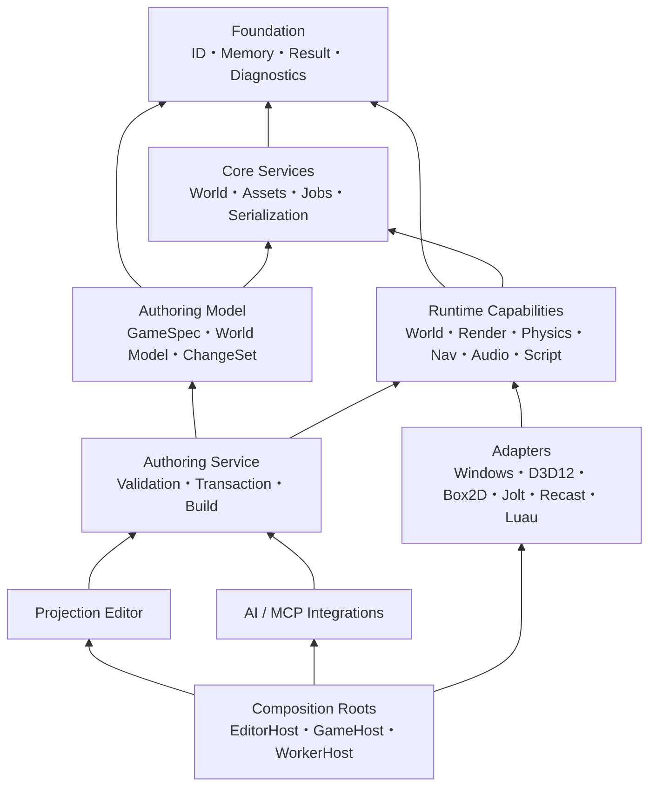

# Miraikanai Engine 基盤アーキテクチャ規約

- 文書版: 1.1
- 作成日: 2026-07-19
- 対象: C++ Engine、Authoring Service、Editor、Tool、Native Extension
- 状態: プロジェクト公式の規範設計
- 上位文書: [AIネイティブ独自ゲームエンジン 設計計画書](./2026-07-18-ai-native-game-engine-authoring-design.md)

## 1. 目的と規範の読み方

本書は、メモリ管理、所有権、ポインタ、並行処理、エラー処理、モジュール境界、命名、ディレクトリ、Build、依存関係、互換性を実装開始前に固定する。目的は「独自Allocatorを作ること」ではなく、正しさを証明でき、計測に基づいて最適化でき、AI生成コードも同じ規則で検証できる基盤を作ることである。

本文では次の意味を用いる。

- **必須**: 違反をReviewまたはCIで拒否する。
- **禁止**: First-party codeへ導入しない。
- **推奨**: 原則として採用し、例外はArchitecture Decision Record（ADR）へ根拠と計測値を残す。
- **任意**: Project ProfileまたはSubsystemの要件で選択できる。

「Microsoft、ISO C++、各Libraryの公式推奨」と「Miraikanai Engineの公式規約」は同一ではない。本書は一次資料を根拠に、対象製品へ適した選択をプロジェクト公式規約として確定する。

## 2. 確定した基準

| 項目 | 公式基準 |
|---|---|
| 開発Host | Windows 11 x64 |
| 初期Game出力 | Windows 11 x64 |
| Graphics API | Direct3D 12 |
| 言語 | C++20 |
| Primary compiler | Visual C++（最新の検証済みStable toolsetを固定） |
| Secondary compiler | clang-cl（CIの診断用。出荷ABIはMSVCで統一） |
| Build | CMake Presets |
| Dependency管理 | vcpkg manifest mode、baselineとversionを固定 |
| AI Orchestrator | Node.js 24 LTS、TypeScript 6.0 strict、別Process |
| Engine–Orchestrator IPC | ACL付きWindows named pipe、length-prefixed JSON-RPC 2.0 |
| 初期Model Provider | OpenAI Responses API、公式TypeScript SDK |
| 初期評価Model | `gpt-5.6-sol`、reasoning effort `medium`を明示 |
| Shader | HLSL 2021、DXC、Shader Model 6.6、Root Signature 1.1を必須基準 |
| Script VM | Luau strict mode、Engine-owned Capability APIだけを公開 |
| 2D Physics kernel | Box2D 3.xをAdapter内で利用 |
| 3D Physics kernel | Jolt Physicsの検証済みtagをAdapter内で利用 |
| 3D Navigation kernel | Recast Navigation／DetourをAdapter内で利用 |
| GPU suballocation | D3D12 Memory AllocatorをEngine-owned wrapper内で利用 |
| Reference runtime target | 1920×1080、60 fps、RTX 3060／RX 6600級、8 GB VRAM |
| CPU memory baseline | Game runtime 2 GiB soft budget |
| GPU residency baseline | 5.5 GiB Project budgetか、OS通知budgetの80%の小さい方 |
| Editor memory baseline | 4 GiB soft budget。外部Compiler／AI processは別計測 |
| Physics tick | 60 Hz固定を初期値とし、Project Profileで明示変更可能 |

Windows 10は2025年10月14日に一般サポートが終了しているため正式Targetに含めない。動作する可能性は否定しないが、CI、性能保証、Support matrixの対象外とする。

数値予算は無期限の定数ではない。Reference sceneのBenchmarkを根拠にADRで改定する。ただし、改定されるまで上表が合否判定値であり、実装者ごとの暗黙値を認めない。

初期Reference Projectの2 GiB CPU soft budgetは次に分割する。各Domainはreserve 128 MiBを除いて未使用分を一時的に貸借できるが、peakは元Domainと借用先の両方へ記録する。

| CPU Domain | 初期soft budget |
|---|---:|
| Core World／Save | 256 MiB |
| Rendering CPU data／upload staging | 256 MiB |
| Physics／Navigation／Animation | 256 MiB |
| Script VM全体 | 128 MiB |
| Audio | 128 MiB |
| Asset streaming cache | 768 MiB |
| Frame／Job transient | 128 MiB |
| Emergency reserve | 128 MiB |

Scriptは1 module 32 MiB、Project全体128 MiBを既定quotaとする。5.5 GiB GPU budgetはtexture 3 GiB、geometry 1 GiB、render target／transient 1 GiB、shader／descriptor 256 MiB、emergency reserve 256 MiBへ分ける。OSのBudgetが5.5 GiB未満ならcritical resourceとreserveを維持し、texture mip、streaming距離、shadow、transient resolutionの順にQuality Profileを下げる。

## 3. 後方互換性を持たないClean実装の意味

### 3.1 Pre-1.0の互換性方針

Pre-1.0では、C++ source API、binary ABI、内部module API、Script API、Editor内部protocolの後方互換性を保証しない。

- 廃止APIのalias、互換wrapper、二重実装、legacy分岐を残さない。
- 変更時は全First-party caller、Test、Sample、生成Templateを同じChangeSetで更新する。
- Native Extensionは現在のSDKへsourceから再Buildする。旧binaryを読み込まない。
- Runtimeは現在のschemaだけを読む。
- Build cache、shader cache、cooked assetはDisposableとし、version不一致時に再生成する。

### 3.2 永続Project dataの保護

「互換コードを持たないこと」と「ユーザーProjectを無断で破棄すること」は別である。GameSpec、World Model、Asset metadata、Decision Ledgerには`schema_version`を必須とし、変更時は専用のoffline migratorで現在版へ一方向変換する。

Migratorは次を必須とする。

1. 元Projectを変更せずbackupを作る。
2. 対応する旧schemaから現在schemaへ段階的に変換する。
3. Schema validationとsemantic validationを実行する。
4. 機械可読Diffと人間向けreportを出力する。
5. 成功後にだけatomic renameで切り替える。
6. 変換できない情報は黙って捨てず、明示的なerrorとして停止する。

Runtime、Editor、Game codeへ旧schemaの条件分岐を埋め込まない。移行処理は`tools/project_migrator`だけに隔離する。

## 4. アーキテクチャ方式

### 4.1 Modular Monolith＋Ports and Adapters

初期実装は一つのRepositoryと少数ProcessからなるModular Monolithとする。SubsystemはCMake targetで分離し、外部LibraryやOS APIはAdapterの外へ漏らさない。Microservice化、汎用plugin ABI、分散Worldは初期設計に導入しない。



矢印は「依存する側から依存先」を示す。循環target依存は禁止する。

### 4.2 正規Authoring状態とRuntime状態の分離

- **Authoring Model**は編集可能性、Stable ID、履歴、説明可能性を優先する。
- **Runtime Model**はcache locality、batch処理、GPU upload、並列実行を優先する。
- **Compiler**が承認済みAuthoring revisionからRuntime packageを決定論的に生成する。
- Editor hierarchyをRuntime object hierarchyとして直接実行しない。
- Pointer、address、allocator内部indexを永続化しない。

Runtime Worldはdata-orientedなEntity／Component storageを採用するが、特定の既存ECS APIを公開モデルにしない。Component storageはSoAまたはarchetype chunkを用い、実測によりSubsystem単位で選ぶ。

### 4.3 唯一の状態変更経路

AI、Editor UI、Script tool、CLI、MCP clientはすべて不変なChangeSetを提案する。World ModelのCommitはC++ Authoring Service内のCommand Gatewayだけが行う。

ChangeSetのrevision fieldは`base_project_revision`とする。WorldだけでなくScript、Asset metadata、Build設定を含むProject全体の楽観的並行制御に利用するためである。

### 4.4 AI OrchestratorとIPC

EngineはModel Provider SDK、API key、HTTP clientをlinkしない。Node.js 24 LTS／TypeScript 6.0 strictの`AiOrchestrator`を別Processとして起動し、Provider adapter、prompt／schema version、session、retry、rate limit、cost、audit、MCP serverを隔離する。

初期ProviderはOpenAI Responses APIと公式TypeScript SDK、初期評価Modelは`gpt-5.6-sol`、reasoning effortは`medium`を明示する。Model IDはEngine codeへhard-codeせず、検証済みProvider manifestに固定する。品質、latency、costのEvalを通した後だけrole別にSol／Terra／Lunaを追加し、すべてをflagshipへ送るroutingを禁止する。Anthropic adapterは同一Provider conformance suiteを満たした後に追加する。

OpenAIではtool接続にstrict function calling、Game Brief／GameSpec案の生成にStructured Outputsを使用する。ただしSchema準拠はsyntax上の補助であり、Engineのsemantic validation、budget、revision、approvalを省略しない。ProviderへCommit toolを公開しない。

Local IPCは次に固定する。

- Windows named pipe。ACLは現在Userと起動したEngine processだけに限定する。
- UTF-8 JSON-RPC 2.0を32 bit little-endian length prefixでframe化する。
- 1 messageの上限は8 MiB。巨大WorldやAssetは送らず、query、summary、content hash、read-only staging fileで参照する。
- `protocol_version`、`schema_version`、`request_id`、deadline、cancellation、trace contextを必須とする。
- 30秒を超える処理はjob IDを即時返し、progress／completion notificationで追跡する。
- 接続ごとに256 bit session nonceを交換し、再接続時に再発行する。
- Engine側がserver、Orchestrator側がclientとなり、Engineはinbound network portを開かない。

CredentialはWindows Credential Managerへ保存し、Project、log、ChangeSet、crash dumpへ含めない。Network accessはOrchestrator processだけに与える。

## 5. ID、参照、所有権

### 5.1 二種類のID

| 種類 | 表現 | 用途 | 永続化 |
|---|---|---|---|
| `StableId` | RFC 9562 UUIDv7、128 bit | Authoring entity、Asset、Rule、UI element | する |
| `EntityHandle`／`ResourceHandle` | index 32 bit＋generation 32 bit | Runtimeの高速参照 | しない |

- `StableId`は生成後に再利用しない。
- 0のRuntime handleは常にinvalidとし、generationは1から開始する。
- Slotを再利用するたびgenerationをincrementし、wrap時はそのslotをretireする。
- Save dataはStable IDまたは明示的なSave IDを使い、Runtime handleを保存しない。
- Runtime handleの解決失敗はuse-after-freeとして検出可能にする。

### 5.2 所有権の公式規則

C++ Core GuidelinesのRAIIとownership規則を基準に、次を必須とする。

| 状況 | 使用する型 |
|---|---|
| 小さくscope内で完結する値 | value／stack object |
| 単一所有 | `std::unique_ptr<T>` |
| 真に複数所有される非同期寿命 | `std::shared_ptr<T>` |
| 必須の借用 | `T&`／`const T&` |
| 任意の借用 | `T*`／`const T*` |
| 連続領域の借用 | `std::span<T>` |
| 文字列の借用 | `std::string_view` |
| Runtime object／resource参照 | generation付きtyped handle |
| COM object | `Microsoft::WRL::ComPtr<T>`をAdapter内だけで利用 |
| Win32 handle | move-only RAII wrapper |

以下を禁止する。

- First-party codeの所有権を表すraw pointer
- application codeでの明示的な`new`／`delete`、`malloc`／`free`
- Entity、Component、Asset、GPU resourceの寿命管理に`shared_ptr`を使うこと
- addressのserialization、addressをStable IDとして使うこと
- borrowの寿命を越えてpointer、reference、`span`、`string_view`を保持すること
- C-style cast、unchecked pointer arithmetic

`shared_ptr`は「便利だから」では使用しない。許可箇所は非同期tool jobの結果、immutable shared blobなど、複数の独立ownerが実在する場合に限り、Reviewでownerを列挙する。

Placement new、Allocator内部のraw storage操作、C API境界は`engine/foundation`または該当Adapterのprivate implementationだけで許可する。RAII wrapper、alignment test、failure test、sanitizerを必須とし、呼出側へ所有raw pointerを返さない。

### 5.3 Nullと結果

- 必須引数はreferenceまたはvalueで表現し、nullを許可しない。
- 任意の借用だけpointerを使用する。
- 値が存在しない正常状態は`std::optional<T>`を使う。
- 失敗し得る処理は`Result<T, Error>`を返す。
- sentinel値、`-1`、空文字による失敗表現を公開APIに使わない。

## 6. CPUメモリ管理

### 6.1 基本方針

最初から全面的な独自general-purpose allocatorを作らない。標準Allocator／OS heapを基準に、`std::pmr::memory_resource`でallocation policyを注入できる境界を設け、profileで必要性が証明された領域だけ専用化する。

`pmr`は最適化そのものではない。次を可能にするmechanismである。

- allocation domainの分離
- lifetimeに合った一括解放
- allocation countとpeakの計測
- Test用failure resourceの注入
- Subsystem budgetの強制

### 6.2 Memory domain

| Domain | 用途 | 解放規則 |
|---|---|---|
| `SystemMemory` | 長寿命、頻度が低い一般object | ownerのRAII |
| `FrameMemory` | 1 frame内の一時data | frame job完了後に一括reset |
| `RenderFrameMemory` | GPUへ参照されるframe data | 対応GPU fence完了後にreset |
| `ScratchMemory` | 一つのscope／jobだけで使う作業領域 | scope終了時にreset |
| `PoolMemory` | 同サイズで頻繁に生成破棄する内部object | poolへ返却 |
| `StreamingMemory` | Asset decode、upload staging、cache | budgetとLRU／priorityでevict |
| `ScriptMemory` | Luau VM／module | VM quotaとProject quota |
| `EditorMemory` | Panel model、preview、undo view | Editor telemetryで別計測 |
| `TestMemory` | leak、OOM、failure injection | Test終了時にzero-liveを検証 |

`FrameMemory`はthreadごとに所有し、他threadからallocateしない。`RenderFrameMemory`はframes-in-flightごとに独立させ、CPU frame終了だけでresetしない。

Arenaとpoolの初期容量をsource codeのmagic numberで固定しない。開発Buildで記録したP99.9 peakに25% headroomを加え、Project Profileへversion付きで保存する。cap超過はDevelopmentでは即座にdiagnostic、Shippingでは設定されたfallbackまたは安全な失敗にする。

Memory resourceの実装構成は次に固定する。

- `SystemMemoryResource`: aligned allocationの基準。追跡Decoratorの最終upstream。
- `TrackingMemoryResource`: domain tag、counter、source locationを記録する。
- `BudgetMemoryResource`: allocation前にdomain capを検査する。
- `MonotonicArenaResource`: Frame、RenderFrame、Scratchのbump allocationと一括reset。
- `PoolMemoryResource`: 実測でsize distributionが安定したprivate objectだけに使用。
- `FailureMemoryResource`: N回目または指定sizeで失敗させるTest専用resource。

`std::pmr::set_default_resource`でProcess全体の暗黙Allocatorを変更しない。`pmr` containerを所有するServiceはconstructorでresourceを受け取り、そのresourceがcontainerより長生きすることを型のcontractとTestで保証する。異なるmemory resource間へcontainerを移動する場合は明示的にcopy／move policyを指定する。

### 6.3 Allocation metadata

Development／Profile Buildでは、すべてのEngine allocationを次の軸で集計する。

```text
domain
subsystem
type_or_purpose
size
alignment
thread
frame_or_job
source_location
```

最低限のcounterはcurrent bytes、peak bytes、allocation count、free count、largest allocation、high-water frame、budget超過回数である。Allocatorが提供する場合はfragmentationとunused rangeも記録する。Shipping Buildではsource locationを除去できるが、domain別bytesとbudget監視は残す。

### 6.4 Hot path規則

「frame中のheap allocationをすべて禁止」という一律規則にはしない。次のidentified hot pathでは、許可されたarena／pool以外のallocationを禁止する。

- Render submission
- Physics step
- Navigation query batch
- Animation sampling／blend
- Audio callback
- Script scheduler inner loop
- Entity iteration

CI performance testはallocation countを検査し、意図しない増加をregressionとして失敗させる。最適化はprofile、benchmark、cache miss、contention、allocation traceの根拠なしに導入しない。

### 6.5 OOM

- Editorは作業を停止し、未Commit ChangeSetとjournalを保全してerrorを表示する。
- Asset cookerは現在jobを失敗させ、partial outputを公開しない。
- Game runtimeはnonessential streaming cacheをevictして一度だけretryする。
- Core World、physics、render graphの必須allocationが失敗した場合は不整合状態で継続せず、diagnosticとcrash dumpを生成して停止する。
- `new`が返すnullを期待しない。例外境界で`std::bad_alloc`をEngine errorへ変換する。

## 7. GPUメモリとDirect3D 12寿命

Direct3D 12ではresource state、descriptor、queue同期、resource lifetimeをapplicationが管理する。本Engineは次を必須とする。

### 7.1 GPU allocator

`GpuAllocator`はEngine-owned interfaceとし、実装AdapterでD3D12 Memory Allocator（D3D12MA）を利用する。D3D12MAの型をRendering public APIへ公開しない。

- 小～中規模のbuffer／textureはplaced resourceとしてsuballocateする。
- 特殊alignment、大容量、共有resourceはdedicated committed allocationを選択できる。
- transient resourceはRender Graphがlifetimeを解析し、互換条件を満たす場合だけaliasする。
- uploadはfence-aware ring buffer、readbackはsize class poolを使う。
- defragmentationはEditor／loading boundaryでだけ実行し、frame中に暗黙実行しない。

### 7.2 Residency budget

DXGI Adapter3の`QueryVideoMemoryInfo`をlocal／non-local segmentごとに定期取得する。Project budgetは`min(configured_budget, 0.80 × Budget)`とし、`RegisterVideoMemoryBudgetChangeNotificationEvent`の通知時に再評価する。`CurrentUsage`がProject budgetへ近づいた時点で段階的にstreaming cacheを縮小する。

Eviction priorityは次の順序で固定する。

1. 再生成可能なtransient cache
2. 未使用の高Mip
3. 遠距離streaming asset
4. Editor preview cache
5. 現在Sceneに必要なresource

5をevictしなければならない状況はbudget failureとして扱い、無制限なthrashingを許可しない。

### 7.3 Fence-deferred destruction

CPU ownerがresourceを破棄しても、最後に参照したすべてのqueueのfenceが完了するまでnative resource、heap range、descriptorを再利用しない。

Deferred release recordは次を持つ。

```text
resource_allocation
descriptor_ranges[]
last_use_fence[direct | compute | copy]
debug_name
memory_tag
```

複数queue間のownership transferとstate transitionはRender Graph compilerが生成する。手動barrierは低level adapterの限定APIだけで許可する。

### 7.4 Descriptor

- RTV／DSV／CPU-visible descriptorはfence-aware free listを使う。
- Shader-visible descriptorはpersistent領域とframe transient領域を分離する。
- Descriptorはresourceを所有しない。resource ownerが寿命を保持する。
- 無効handle、二重解放、generation不一致をDevelopment Buildで検出する。
- Root Signature version、Resource Binding Tier、Shader Model、heap上限は起動時にfeature queryし、Root Signature 1.1またはShader Model 6.6を満たさないdeviceは明示的に起動を拒否する。旧target向けRoot Signature 1.0／旧Shader Model互換pathは初期製品に持たない。

## 8. Threading、Job、決定性

### 8.1 Thread ownership

| Thread／queue | 所有する変更 |
|---|---|
| Authoring thread | World Modelの構造変更、ChangeSet commit、Undo journal |
| Game simulation thread | Runtime Worldのtick境界での構造変更 |
| Worker threads | immutable inputから結果／command bufferを生成 |
| Render submission thread | Render GraphからD3D12 command listを記録・submit |
| Audio callback | preallocated bufferだけを処理 |

Global mutable singletonは禁止する。ServiceはComposition Rootから明示注入する。Thread affinityを持つ型は型名、contract、assertで明示する。

### 8.2 Job lifetime

- Jobへ渡すdataはowned task packet、stable handle、immutable snapshotのいずれかとする。
- 呼出scopeを越えるraw pointer／reference captureを禁止する。
- Cancellation tokenを長時間jobへ必須とする。
- Job completion前にscratch memoryをresetしない。
- Worldの構造変更はworkerから直接行わず、command bufferをtick boundaryでmergeする。

### 8.3 Simulation

Physicsとgameplay simulationは60 Hz fixed stepを初期値とし、renderはinterpolationする。最大catch-up stepを4とし、それを超えた時間はspiral of deathを避けるためdiagnostic付きでclampする。

Deterministic replayは同一Engine version、同一platform、同一build、同一seed、同一input streamを保証範囲とする。異なるCPU architecture、compiler、physics library version間のbitwise determinismは初期保証に含めない。

## 9. Error、Exception、Assertion

### 9.1 Error category

| 種類 | 処理 |
|---|---|
| User／content error | typed `Result`で返し、位置と修正方法を表示 |
| Recoverable runtime error | `Result`＋定義済みfallback |
| Transient external error | deadline付きretry、回数上限、cancel |
| Programmer invariant violation | assertion、Developmentでは停止 |
| Corruption／unsafe continuation | crash dumpを生成してfail fast |

C++20には標準`std::expected`がないため、Foundationに小さな`Result<T, Error>`を定義する。例外は`/EHsc`で有効にするが、Engine frame、Subsystem boundary、C ABI、Script boundaryを越えて伝播させない。Third-party／tool adapterでcatchし、typed errorへ変換する。`/EHa`とSEHによる継続は使用しない。

Public errorにはstable error code、category、human message、source context、causal chainを持たせる。Logだけを書いてsuccessを返すことを禁止する。

## 10. C++言語・Compiler規約

### 10.1 Language baseline

C++20を採用する。MSVCのC++23 modeは現時点でpreviewでABI変更可能性があるため、Shipping toolchainに採用しない。C++23の必要機能はCompilerのstable提供と全dependency検証後にADRで一括移行する。

First-party targetの基準Optionは次とする。

```text
/std:c++20
/permissive-
/W4
/WX
/utf-8
/EHsc
/Zc:__cplusplus
/MP
```

- WarningはFirst-party codeでerrorにする。
- External headerはsystem／external扱いとし、警告levelを分離する。
- `/std:c++latest`、`/EHa`、warningの全体無効化を禁止する。
- RTTIはToolとThird-party互換のため初期は有効にするが、Engine reflection、serialization、component dispatchに`typeid`／`dynamic_cast`を使わない。無効化はmodule単位の計測後にADRで行う。
- Sanitizer BuildはAddressSanitizerを必須Presetとする。clang-clではUBSan相当の利用可能範囲もCIで実行する。

### 10.2 Header規則

- Headerはself-containedで単独compileできる。
- Include What You Useを原則とする。
- Public headerは`include/mira/<module>/`だけに置く。
- Public headerからWindows、D3D12、Box2D、Jolt、Recast、Luauの型を露出しない。
- Forward declarationはownershipとdestructor要件を満たす場合だけ使う。
- `#pragma once`を採用する。
- Unity buildは通常Buildで使わない。専用Presetで計測し、診断性を落とさない範囲で任意採用する。
- C++20 ModulesはtoolchainとIDEの安定性が確認できるまで採用しない。

## 11. 命名規則

C++標準やCore Guidelinesは唯一の命名方式を規定していない。本節をMiraikanai Engineの公式方式として統一する。

| 対象 | 方式 | 例 |
|---|---|---|
| Root namespace | lowercase | `mira` |
| Subnamespace | lowercase | `mira::render` |
| Type、concept | PascalCase | `RenderGraph`, `GpuResource` |
| Function、method | snake_case | `compile_graph()` |
| Local、parameter | snake_case | `frame_index` |
| Private data member | snake_case＋末尾`_` | `frame_index_` |
| Compile-time constant | `k`＋PascalCase | `kInvalidIndex` |
| `enum class`型／値 | PascalCase | `QueueType::Compute` |
| Macro | `MIRA_`＋UPPER_SNAKE | `MIRA_ASSERT` |
| File | snake_case | `render_graph.hpp` |
| CMake target | `mira::<name>` alias | `mira::foundation` |
| Test | `<subject>_<condition>_<result>` | `handle_stale_generation_is_rejected` |

追加規則:

- Headerは`.hpp`、implementationは`.cpp`に統一する。
- Booleanは`is_`、`has_`、`can_`、`should_`など、trueの意味が読める名前にする。
- Interfaceへ機械的な`I` prefixを付けない。役割名を使う。例: `RendererBackend`。
- Hungarian notation、型を重複するprefix、曖昧な`manager`、`util`、`helper`を禁止する。
- 単位を隠さない。`Duration`、`Radians`などのstrong type、または境界APIで`timeout_ms`のように明示する。
- 略語は一般的なものだけを一貫して使う。`id`、`gpu`、`ui`はidentifier内で通常語として扱う。
- Macroはplatform、export、assert、compile configurationへ限定する。

Formatはrepository rootの`.clang-format`、static analysisは`.clang-tidy`を唯一の設定とする。手動の見た目論争ではなくCIで機械適用する。

## 12. RepositoryとDirectory構造

```text
/
├─ CMakeLists.txt
├─ CMakePresets.json
├─ vcpkg.json
├─ vcpkg-configuration.json
├─ cmake/
├─ config/
├─ schemas/
├─ docs/
│  ├─ architecture/
│  ├─ adr/
│  └─ superpowers/
│     ├─ specs/
│     └─ plans/
├─ engine/
│  ├─ foundation/
│  ├─ platform/
│  │  └─ windows/
│  ├─ world/
│  ├─ assets/
│  ├─ jobs/
│  ├─ rendering/
│  │  ├─ core/
│  │  ├─ materials/
│  │  ├─ visual_styles/
│  │  └─ backends/d3d12/
│  ├─ physics/
│  │  ├─ core/
│  │  └─ backends/{box2d,jolt}/
│  ├─ navigation/
│  │  ├─ core/
│  │  └─ backends/recast/
│  ├─ animation/
│  ├─ audio/
│  ├─ input/
│  ├─ ui/
│  ├─ scripting/
│  │  └─ backends/luau/
│  └─ vfx/
├─ authoring/
│  ├─ model/
│  ├─ changes/
│  ├─ validation/
│  ├─ assets/
│  ├─ visual_styles/
│  └─ build/
├─ editor/
│  ├─ app/
│  ├─ panels/
│  └─ workspaces/
├─ orchestrator/
│  ├─ package.json
│  ├─ package-lock.json
│  ├─ tsconfig.json
│  ├─ src/
│  │  ├─ providers/
│  │  ├─ requirements/
│  │  ├─ visual_styles/
│  │  ├─ strategy/
│  │  ├─ engine_bridge/
│  │  └─ mcp/
│  └─ tests/
├─ integrations/
│  ├─ codex/
│  └─ claude/
├─ tools/
│  ├─ asset_compiler/
│  ├─ shader_compiler/
│  ├─ project_migrator/
│  └─ test_runner/
├─ hosts/
│  ├─ editor_host/
│  ├─ game_host/
│  └─ worker_host/
├─ tests/
│  ├─ integration/
│  ├─ conformance/
│  ├─ performance/
│  └─ fixtures/
├─ samples/
└─ third_party/
   ├─ ports/
   ├─ patches/
   └─ notices/
```

`engine/rendering/materials`はMaterial IR、Shading Model contract、ShaderInterface、compile keyを所有する。`engine/rendering/visual_styles`はcook済みVisual StyleのRuntime適用とRender layer compositionを所有し、Authoring schemaやAI判断を持たない。`authoring/visual_styles`はVisualStyleProfile、StyleChangeSet、Validator、Preview modelを所有する。`orchestrator/src/visual_styles`は候補生成と説明だけを行い、Capability hard gate、Style validation、Commit権限を持たない。

各moduleは次を標準形とする。

```text
<module>/
├─ CMakeLists.txt
├─ include/mira/<module>/   # 公開API
├─ src/                     # private implementation
├─ tests/
└─ benchmarks/              # hot pathがあるmoduleだけ必須
```

規則:

- Generated source、object、cache、downloaded dependencyをsource treeへ置かない。
- 一つのdirectoryに複数の無関係なSubsystemを置かない。
- `common`、`misc`、`shared`、巨大な`utils` directoryを作らない。
- `third_party`へvendor sourceを手動copyしない。Patchとnoticeだけを追跡し、取得はvcpkg manifestで再現する。
- Public includeはmoduleの契約であり、他moduleの`src`をincludeしてはならない。
- Hostだけがconcrete adapterを生成し、core module内でservice locatorを構築しない。
- C++とTypeScriptで共有するwire schemaは`schemas/`から双方の型を生成し、手書きで二重管理しない。

## 13. Dependency採用規則

「独自Engine」は、OS、Graphics API、Compiler、数学的algorithmまで再発明する意味ではない。独自であるべき範囲は、製品の正規data model、公開API、編集protocol、validation、lifecycle、UX、統合方式である。

Dependencyを採用する条件:

1. 公式repositoryとlicenseを確認する。
2. 検証済みtag／commitとvcpkg baselineを固定する。
3. SBOMとthird-party noticeへ記録する。
4. Engine-owned interfaceのAdapter内へ隔離する。
5. Vendor型を永続format、Game API、Editor APIへ露出しない。
6. Determinism、threading、allocator、exception、coordinate系をconformance testで固定する。
7. 更新は専用ChangeSetで行い、replay、performance、serialized fixtureを再検証する。

Node.js／TypeScript側も同じ考え方を適用し、Node.js 24.xの正確なpatch、npm package、integrity hashを`package-lock.json`とCI imageへ固定する。Node.jsのCurrent版、TypeScript preview、floating version rangeをShipping toolchainに使わない。

初期採用:

| Dependency | 初期検証baseline | License | 採用範囲 | 独自で保持する範囲 |
|---|---|---|---|---|
| D3D12MA | 3.2.0 | MIT | D3D12 heap suballocation、budget stats | GPU handle、tag、lifetime、residency policy |
| Box2D | 3.1.1 | MIT | 2D collision／solver | Engine component、unit変換、event、serialization |
| Jolt Physics | 5.5.0 | MIT | 3D collision／solver | Engine component、job bridge、event、serialization |
| Recast／Detour | 1.6.0 | zlib | Navmesh build／query kernel | Build profile、tile asset、AI command、debug UX |
| Luau | 0.730 | MIT | Parser、bytecode、VM、GC | Capability API、quota、permission、hot reload policy |
| ozz-animation | 0.16.0 | MIT | Skeleton compression、sampling、blend primitives | Animation graph、state machine、root motion、IK policy |
| DirectXTex | may2026 | MIT | Offline texture decode／mipmap／BC encoding | Asset schema、import policy、cooked format |
| Dear ImGui Docking | 1.92.8-docking | MIT | 初期Editor shellのPanel描画、Docking、multi-viewport | Document、workspace、command、undo、design system、accessibility |

上表はfloating rangeではなく初回conformance testの入力である。License、MSVC／C++20 Build、allocator hook、sanitizer、determinism、performanceに合格したexact tag／SHAをvcpkg baselineまたはlock manifestへ記録する。失敗時は無言で別versionへ置き換えず、原因、代替version、API差分をADRへ残す。Release更新は自動追従しない。

Dear ImGuiのDocking版は初期Editor shellのPanel描画とDockingに限って利用する。ただし、Editor document model、workspace、command、undo、accessibility metadataをImGui固有stateにしない。複雑なtext renderingはDirectWriteを利用する。

## 14. Serialization、Schema、Build Artifact

- Authoring dataはhuman-diffableなversioned schemaで保存する。
- Runtime packageは独自のversioned binary formatへcookする。
- Endianness、alignment、integer widthをformat仕様に明記する。
- Native structを`memcpy`して永続化しない。
- Assetはcontent hash、importer version、source hash、settings hashで識別する。
- Build outputはinput revision、toolchain、dependency lock、schema、compiler flagをmanifestへ記録する。
- 同一input manifestから同一artifact hashを得ることを目標とし、非決定要因をreportする。
- Secret、Provider credential、local absolute pathをProject dataへ保存しない。

## 15. Observabilityと性能検証

最適化可能性は設計名ではなく計測で担保する。Development、Profile、Shippingの三Buildを用意する。

### 15.1 必須telemetry

- CPU frameとSubsystem span
- Job queue latency、worker utilization、contention
- Allocation domain別current／peak／count
- GPU pass timing、queue overlap、barrier数
- GPU committed／resident／budget／eviction
- Descriptor使用量
- Draw／dispatch／triangle／visible object
- Physics body／contact／step time
- Navigation tile／query time
- Script VM memory／GC pause／instruction budget
- Streaming request latencyとcache hit

PIX capture markerとDRED breadcrumbへProject revision、frame、Render pass、resource debug nameを関連付ける。

### 15.2 Regression gate

- Unit／integration testはDebug Layerのwarning／errorを0件にする。Driver固有の誤検知を除外する場合はdevice、driver、message ID、根拠、有効期限をallowlistへ記録する。
- GPU-based validationは小規模renderer testで定期実行する。
- Device Removed Extended Data（DRED）をDevelopment／Profileで有効にする。
- Reference sceneのCPU／GPU frame P95、memory peak、allocation count、load timeをbaselineと比較する。
- Performance CIは3回warm-up後に5回測定し、各runのP95からmedianを求める。同一OS image、power profile、driver、background policyを使う。
- Frame時間はbaselineから5%かつ0.2 msを超える悪化、memory／allocation countは5%を超える悪化、またはbudget超過を自動失敗とする。意図的変更は測定結果付きbaseline updateを必要とする。
- 平均値だけで合格させず、P95とworst hitchを記録する。

## 16. TestとCI

| Test | 必須内容 |
|---|---|
| Unit | Handle generation、Result、allocator、schema、command precondition |
| Property／fuzz | Serializer、ChangeSet parser、asset importer、Script boundary |
| Conformance | Box2D／Jolt／Recast／Luau Adapterの座標、event、lifetime |
| Integration | ChangeSet→validate→stage→commit→save→load→replay |
| Graphics | Headless／WARP smoke、reference GPU image test、Debug Layer |
| Performance | Allocation count、frame P95、streaming、physics、nav、script |
| Migration | 各保存fixtureをcurrent schemaへ変換しDiffを検証 |
| Soak | 長時間play、resource churn、device lost、memory pressure |

CIはformat、compile、static analysis、test、sanitizer、package manifestを順に実行する。生成C++はFirst-partyと同じwarning、sanitizer、test基準を通過しなければProjectへCommitできない。

## 17. AI生成Script／C++への追加制約

- AIはallocator、raw address、D3D12 native objectを直接操作しない。
- ScriptはCapability allowlist外のfilesystem、network、process、clockへアクセスできない。
- NativeCodeChangeSetは許可directory、CMake target、dependencyを宣言する。
- 新規dependency、unsafe compiler option、public API変更、memory budget変更は重要操作として人間承認を必要とする。
- Generated codeはownership annotation相当のAPI形、static analysis、ASan、unit test、isolated buildを通す。
- Engine coreの自動書換えはMVP対象外。Project C++と明示されたExtension pointだけを対象とする。

## 18. 実装開始条件

次が揃うまでEngine feature実装へ進まない。

1. Root CMake Presetsとvcpkg manifestが固定されている。
2. Foundation targetとdependency DAGがCIで検査できる。
3. `StableId`、generation handle、`Result`、memory tagのcontract testがある。
4. `.clang-format`、`.clang-tidy`、warning policyがCIで強制される。
5. ChangeSetの`base_project_revision`とoffline migration policyがschemaへ反映される。
6. Development／Profile／Shipping Buildの診断差が定義される。
7. 2D／3D capability planのcoordinate、unit、color、tick規約が承認される。
8. Scene dimension、Art Direction、Composition、Shading Modelの正規四軸とVisualStyleProfile schemaが承認される。
9. Material IR、Domain output、Engine-owned Root Signature、StyleCapabilityManifestの境界が承認される。

## 19. 一次資料と判断の対応

| 判断 | 一次資料 |
|---|---|
| Windows 11を正式TargetとしWindows 10を外す | [Windows 10 reaching end of support](https://learn.microsoft.com/en-us/lifecycle/announcements/windows-10-end-of-support) |
| RAII、raw pointerは非所有、`unique_ptr`優先、明示`new`回避 | [C++ Core Guidelines R.1–R.30](https://isocpp.github.io/CppCoreGuidelines/CppCoreGuidelines#S-resource) |
| Pointer arithmeticより`span` | [Microsoft C26481](https://learn.microsoft.com/en-us/cpp/code-quality/c26481?view=msvc-170) |
| C++20採用、C++23 previewを出荷に使わない | [MSVC `/std`](https://learn.microsoft.com/en-us/cpp/build/reference/std-specify-language-standard-version?view=msvc-170) |
| Standards conformance | [MSVC `/permissive-`](https://learn.microsoft.com/en-us/cpp/build/reference/permissive-standards-conformance?view=msvc-170) |
| Warning policy | [MSVC warning level](https://learn.microsoft.com/en-us/cpp/build/reference/compiler-option-warning-level?view=msvc-170) |
| UTF-8 source | [MSVC `/utf-8`](https://learn.microsoft.com/en-us/cpp/build/reference/source-charset-set-source-character-set?view=msvc-170) |
| Standard exception model | [MSVC exception handling model](https://learn.microsoft.com/en-us/cpp/build/reference/eh-exception-handling-model?view=msvc-170) |
| ASanを開発とCIで利用 | [Microsoft C++ AddressSanitizer](https://learn.microsoft.com/en-us/cpp/sanitizers/asan?view=msvc-170) |
| D3D12でapplicationがmemory、sync、stateを管理 | [Direct3D 12 Programming Guide](https://learn.microsoft.com/en-us/windows/win32/direct3d12/directx-12-programming-guide) |
| GPU memoryをclassify、budget、streamする | [D3D12 Memory Management Strategies](https://learn.microsoft.com/en-us/windows/win32/direct3d12/memory-management-strategies) |
| `Budget`と`CurrentUsage`を別々に監視する | [`DXGI_QUERY_VIDEO_MEMORY_INFO`](https://learn.microsoft.com/en-us/windows/win32/api/dxgi1_4/ns-dxgi1_4-dxgi_query_video_memory_info) |
| Descriptorはresourceを所有しない | [D3D12 Descriptors Overview](https://learn.microsoft.com/en-us/windows/win32/direct3d12/descriptors-overview) |
| Shader-visible descriptorとresource寿命をfenceで管理する | [D3D12 Resource Binding Overview](https://learn.microsoft.com/en-us/windows/win32/direct3d12/resource-binding-flow-of-control) |
| GPU-based validationを小規模Test／定期CIで使う | [GPU-based validation](https://learn.microsoft.com/en-us/windows/win32/direct3d12/using-d3d12-debug-layer-gpu-based-validation) |
| D3D12 heap suballocation | [GPUOpen D3D12 Memory Allocator](https://github.com/GPUOpen-LibrariesAndSDKs/D3D12MemoryAllocator) |
| Dependency baseline release | [D3D12MA 3.2.0](https://github.com/GPUOpen-LibrariesAndSDKs/D3D12MemoryAllocator/releases/tag/v3.2.0), [Box2D 3.1.1](https://github.com/erincatto/box2d/releases/tag/v3.1.1), [Jolt 5.5.0](https://github.com/jrouwe/JoltPhysics/releases/tag/v5.5.0), [Recast 1.6.0](https://github.com/recastnavigation/recastnavigation/releases/tag/v1.6.0), [Luau 0.730](https://github.com/luau-lang/luau/releases/tag/0.730), [ozz 0.16.0](https://github.com/guillaumeblanc/ozz-animation/releases/tag/0.16.0), [DirectXTex may2026](https://github.com/microsoft/DirectXTex/releases/tag/may2026), [Dear ImGui 1.92.8-docking](https://github.com/ocornut/imgui/releases/tag/v1.92.8-docking) |
| Manifest modeとversion固定 | [vcpkg Manifest Mode](https://learn.microsoft.com/en-us/vcpkg/concepts/manifest-mode) |
| CMake Presetsとの統合 | [vcpkg CMake Integration](https://learn.microsoft.com/en-us/vcpkg/users/buildsystems/cmake-integration) |
| Namingは一貫したproject styleとして機械化 | [Google C++ Style Guide](https://google.github.io/styleguide/cppguide), [ClangFormat](https://clang.llvm.org/docs/ClangFormatStyleOptions.html), [clang-tidy](https://clang.llvm.org/extra/clang-tidy/) |
| UUIDv7 format | [RFC 9562](https://www.rfc-editor.org/rfc/rfc9562.html) |
| ProductionでLTS Node.jsを使う | [Node.js Releases](https://nodejs.org/en/about/previous-releases) |
| TypeScript strict toolchain baseline | [TypeScript 6.0 release notes](https://www.typescriptlang.org/docs/handbook/release-notes/typescript-6-0.html) |
| Local IPCをUser ACLで制限する | [Named Pipe Security and Access Rights](https://learn.microsoft.com/en-us/windows/win32/ipc/named-pipe-security-and-access-rights), [JSON-RPC 2.0](https://www.jsonrpc.org/specification) |
| API keyをProjectから隔離する | [Windows Credentials Management](https://learn.microsoft.com/en-us/windows/win32/secauthn/credentials-management) |
| OpenAI公式TypeScript SDK | [OpenAI SDKs and CLI](https://developers.openai.com/api/docs/libraries#install-an-official-sdk) |
| 初期quality-first評価Model | [GPT-5.6 Sol model reference](https://developers.openai.com/api/docs/models/gpt-5.6-sol) |
| 新規tool workflowにResponses APIとstrict function callingを使う | [OpenAI Using Tools](https://developers.openai.com/api/docs/guides/tools) |
| JSON modeではなくStructured Outputsを使い、schemaと型の乖離を防ぐ | [OpenAI Structured Outputs](https://developers.openai.com/api/docs/guides/structured-outputs) |
| 外部AI Hostとの標準接続 | [MCP Architecture](https://modelcontextprotocol.io/specification/2025-11-25/architecture), [MCP TypeScript SDK](https://modelcontextprotocol.io/docs/sdk) |
| Editor dockingとmulti-viewport基盤 | [Dear ImGui Docking](https://github.com/ocornut/imgui/wiki/Docking), [Multi-Viewports](https://github.com/ocornut/imgui/wiki/Multi-Viewports) |

## 20. 明示的に採用しないもの

- 独自general-purpose allocatorを最初から全Processへ強制すること
- raw pointerを「高速だから」という理由でownershipに使うこと
- Entityごとのheap objectとvirtual update
- Service Locatorとglobal mutable singleton
- Vendor型を公開API、serialization、GameSpecへ露出すること
- Header-only巨大Engine、循環module、unity build前提
- Engine reflectionとしてC++ RTTIへ依存すること
- Runtime内legacy schema分岐
- 未固定dependency、preview compiler mode、preview Agility SDKのShipping採用
- Profile結果のないdata-oriented化、pool化、lock-free化

この禁止事項に例外が必要な場合は、再現可能なBenchmark、代替案、破棄条件、影響範囲をADRへ記録しなければならない。
