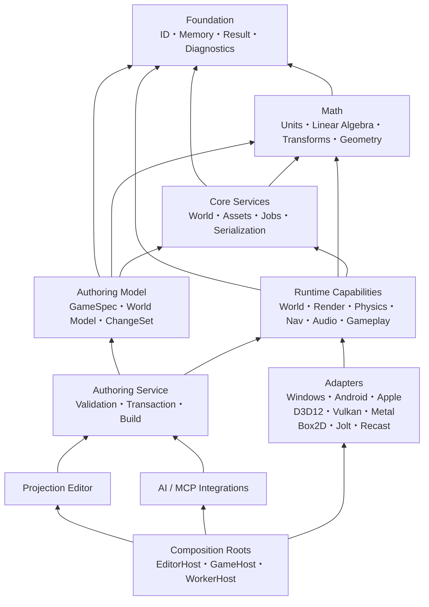

# Miraikanai Engine 基盤アーキテクチャ規約

- 文書版: 1.22
- 作成日: 2026-07-19
- 最終更新日: 2026-07-21
- 対象: C++ Engine、Authoring Service、Editor、Tool、Native Extension
- 状態: プロジェクト公式の規範設計
- 上位文書: [AIネイティブ独自ゲームエンジン 設計計画書](./2026-07-18-ai-native-game-engine-authoring-design.md)
- Game実装方式: [Miraikanai Engine C++実行コード・構造化ゲームデータ規約](./2026-07-19-cpp-structured-game-data-design.md)
- Game制作時のEngine不変境界: [Miraikanai Engine 不変Engine境界・初心者向けAI技術承認規約](./2026-07-21-immutable-engine-beginner-ai-approval-design.md)
- C++言語・Modules規約: [Miraikanai Engine C++23・Named Modules・`import std`移行規約](./2026-07-20-cpp23-modules-import-std-transition-design.md)
- 命名・技術識別子規約: [Miraikanai Engine AI可読命名・技術識別子規約](./2026-07-20-ai-readable-engine-naming-convention-design.md)
- Authoring状態規約: [Miraikanai Engine Authoring Model／Project State規約](./2026-07-19-authoring-model-project-state-design.md)
- Native Game規約: [Miraikanai Engine NativeGameModuleアーキテクチャ規約](./2026-07-19-native-game-module-architecture-design.md)
- Runtime詳細規約: [Miraikanai Engine Runtime連携・寿命・性能規約](./2026-07-19-runtime-integration-lifetime-performance-design.md)
- Memory／Pointer規約: [Miraikanai Engine AI可読Memory／Pointerアーキテクチャ規約](./2026-07-20-ai-readable-memory-pointer-architecture-design.md)
- Math／Core Utilities規約: [Miraikanai Engine AI可読Math／Core Utilitiesアーキテクチャ規約](./2026-07-20-ai-readable-math-core-utilities-architecture-design.md)
- Rendering／Asset規約: [Rendering／Render Graph](./2026-07-19-rendering-render-graph-architecture-design.md)／[Asset Pipeline／Content Package](./2026-07-19-asset-pipeline-content-packaging-design.md)
- Editor／Player I/O規約: [Editor](./2026-07-19-editor-workspace-ux-design.md)／[独自Editor UI Framework](./2026-07-20-editor-ui-framework-architecture-design.md)／[Input](./2026-07-19-input-action-device-architecture-design.md)／[UI・Text](./2026-07-19-ui-text-localization-accessibility-design.md)／[Audio](./2026-07-19-audio-mixer-spatial-architecture-design.md)
- Physics Engine規約: [Miraikanai Engine 独自Physics Platform／Dynamicsアーキテクチャ規約](./2026-07-20-physics-engine-architecture-design.md)
- Navigation規約: [Miraikanai Engine 独自Navigation Platformアーキテクチャ規約](./2026-07-20-navigation-platform-architecture-design.md)
- Simulation連携規約: [Physics／Navigation／Animation連携](./2026-07-19-physics-navigation-animation-architecture-design.md)
- Platform規約: [Windows](./2026-07-19-windows-platform-distribution-design.md)／[Mobile](./2026-07-19-mobile-platform-architecture-design.md)
- Collision詳細規約: [Miraikanai Engine Collision／Colliderアーキテクチャ規約](./2026-07-19-collision-collider-architecture-design.md)
- モバイル規約: [Miraikanai Engine モバイルPlatformアーキテクチャ規約](./2026-07-19-mobile-platform-architecture-design.md)
- AI実装・保守規約: [Miraikanai Engine AI実装・保守ガバナンス規約](./2026-07-19-ai-engine-development-governance-design.md)
- 実行可能契約規約: [Miraikanai Engine 実行可能契約・Schema・Codegen規約](./2026-07-19-executable-contract-schema-codegen-design.md)
- AI検証規約: [Miraikanai Engine AI検証・評価・来歴規約](./2026-07-19-ai-verification-evaluation-provenance-design.md)
- Game System規約: [Miraikanai Engine Game System／AI Code Generationアーキテクチャ規約](./2026-07-20-game-system-ai-codegen-architecture-design.md)
- World／Level／Map規約: [Miraikanai Engine World／Level／Map／AI Authoringアーキテクチャ規約](./2026-07-20-world-level-map-ai-authoring-architecture-design.md)
- Debugging／Replay規約: [Miraikanai Engine AI可読Debugging／Observability／Replayアーキテクチャ規約](./2026-07-20-ai-readable-debugging-observability-replay-architecture-design.md)

## 1. 目的と規範の読み方

本書は、メモリ管理、所有権、ポインタ、並行処理、エラー処理、モジュール境界、命名、ディレクトリ、Build、依存関係、互換性を実装開始前に固定する。目的は「独自Allocatorを作ること」ではなく、正しさを証明でき、計測に基づいて最適化でき、AI生成コードも同じ規則で検証できる基盤を作ることである。Mathの型、数値意味、失敗契約はMath／Core Utilities規約を正本とし、`mirakan::foundation`から分離する。

本文では次の意味を用いる。

- **必須**: 違反をReviewまたはCIで拒否する。
- **禁止**: First-party codeへ導入しない。
- **推奨**: 原則として採用し、例外はArchitecture Decision Record（ADR）へ根拠と計測値を残す。
- **任意**: Project ProfileまたはSubsystemの要件で選択できる。

「Microsoft、ISO C++、各Libraryの公式推奨」と「Miraikanai Engineの公式規約」は同一ではない。本書は一次資料を根拠に、対象製品へ適した選択をプロジェクト公式規約として確定する。

## 2. 確定した基準

| 項目 | 公式基準 |
|---|---|
| Editor／主要開発Host | Windows 11 25H2以降 x64（OS build 26200以上） |
| Apple Build／Release | macOS Tahoe 26.2以降、Xcode 26.6 Stable。SecretなしUnsigned Build WorkerがC++／Metal compileとlinkを行い、適合済みSigning／Upload ServiceまたはXcode Cloudが後段を担う。結合型credential-bearing Agentは禁止 |
| 公式Game Target | `windows_desktop_v1`、`android_mobile_v1`、`apple_mobile_v1` |
| Graphics API | WindowsはDirect3D 12、AndroidはVulkan 1.1＋AVP 2022、AppleはMetal |
| 言語 | C++23。CX0はMSVC 14.51 Stable＋`/std:c++23preview`の非Shipping bootstrap、CX3はMSVC 14.52以降Stable＋正式`/std:c++23`を必須とする |
| Windows SDK | 10.0.26100.8249 |
| Primary compiler | CX0はVisual Studio Build Tools 2026 18.8.0 Stable（build 12009.203）＋MSVC Build Tools v14.51 x64/x86。CX3は正式`/std:c++23`を持つPreviewでないv14.52以降をexact lock |
| Secondary compiler | CX0／CX1はLLVM／clang-cl 22.1.8。CX3 Cutover時にNamed Modules／`import std`／analysisへ合格したStable LLVMをexact lock（CI診断用。Windows出荷ABIはMSVCで統一） |
| Windows CRT | `Development`／`ASan`は`MultiThreadedDebugDLL`（`/MDd`）、`Profile`／`Shipping`は`MultiThreadedDLL`（`/MD`）。First-party、NativeGameModule、static Vendor libraryを同一linkで混在させない |
| Build | CMakeをFirst-party C++ Build定義の唯一の正本とする。WindowsはNinja Multi-Config 1.13.2、AndroidはGradle `externalNativeBuild`からABI／Variant別Single-Config Ninja 1.13.2、Apple CX0はXcode 26.6、CX1以降のportable C++ Module graphはNinja Multi-Config、CX2／CX3のApp shell／最終link／archiveはXcode。Makefiles系と`ndk-build`はFirst-party公式経路にしない |
| Dependency管理 | vcpkg manifest mode、builtin baseline `cd61e1e26a038e82d6550a3ebbe0fbbfe7da78e3` |
| AI Orchestrator | Node.js 24.18.0 LTS＋同梱npm 11.16.0、TypeScript 7.0.2 strict、別Process |
| Engine–Orchestrator IPC | ACL付きWindows named pipe、length-prefixed JSON-RPC 2.0 |
| 初期Model Provider | OpenAI Responses API、公式TypeScript SDK 6.48.0 |
| 初期評価Model | `gpt-5.6-sol`、reasoning effort `medium`を明示 |
| 実行可能契約 | `/schemas/mirakan/`のMCDを正本とし、Contract compilerがC++／TS／MCP／Provider／Cooked binary projectionを生成 |
| Formal model checker | TLA+／TLC CLI v1.7.4をBuild-onlyで固定。v1.8.0 Pre-releaseとToolboxをCIへ採用しない |
| Shader | Material／Shader IR＋portable HLSL 2021。WindowsはDXIL／SM 6.6／Root Signature 1.1、AndroidはSPIR-V、AppleはMSL／metallibへoffline cook |
| Windows D3D12 runtime | Stable Agility SDK 1.619.4、Enhanced Barriers必須。legacy ResourceBarrier pathなし |
| Game実装 | CPU実行CodeはC++23だけ。Game内容は検証済み`GameplayDefinition`をoffline Cookし、C++ Runtimeが実行 |
| Game System | 契約固定・実装開放型。Engine標準、Project-defined、Engine Extensionを同じ`GameSystemSpecV1`、一意State owner、typed Port、Target／Testへ接続し、固定Class hierarchyまたはWhitelistを作らない |
| World／Level | World／Scene／Level／Cellを別identityとし、Source IntentからTarget別Streaming Planをoffline生成する。`MapManager`へ責務を集約しない |
| 2D Physics kernel | Box2D 3.1.1、commit `8c661469c9507d3ad6fbd2fea3f1aa71669c2fe3`を`candidate_locked`としてAdapter内で利用。Target別Qualification後だけProduction昇格 |
| 3D Physics kernel | Jolt Physics 5.6.0、commit `e77f175595e64cb44218cc9d9d56fc365ad0e36a`を`candidate_locked`としてAdapter内で利用。CPU rigid body限定、Target別Qualification後だけProduction昇格 |
| 3D Navigation kernel | Recast Navigation／Detour 1.6.0、commit `6dc1667f580357e8a2154c28b7867bea7e8ad3a7`を`candidate_locked`として交換可能なprivate Backend内で利用。標準32-bit refに固定 |
| GPU suballocation | D3D12MA 3.2.0、VMA 3.3.0、Metal `MTLHeap`をEngine-owned Adapter内で利用 |
| Windows reference runtime | 1920×1080、60 fps、Ryzen 5 5600、16 GB DDR4-3200 dual-channel、PCIe 3.0 NVMe、RTX 3060 12 GB／RX 6600 8 GB |
| Windows CPU memory baseline | Game runtime 2 GiB soft budget |
| Windows GPU residency baseline | 5.5 GiB Project budgetか、OS通知budgetの80%の小さい方 |
| Mobile baseline | 30／60 fps、process 1,024 MiB、Engine CPU 768 MiB、GPU working set 384 MiB。実機classと測定法はモバイル規約に固定 |
| Editor memory baseline | Editor process group 4 GiB soft budget。Play Runtime 2 GiB＋Authoring 2 GiBを含み、外部Compiler／AI processは別計測 |
| Tool process memory baseline | Editor-launched child tree全体4 GiB hard commit cap。AI／Asset／Shader／Native Buildは個別nested Job limit |
| AI Source実行境界 | A1／A2のPromotion可能なlocal実行はWindows 11 Pro／Enterprise＋Hyper-Vの`HyperVIsolatedWorkerV1`。Home／Hyper-V unavailableはProposalのみ、または同等remote Worker |
| Physics tick | C1／C2はexactly 60 Hz。Profileへ保存するが60以外を拒否し、可変rateはC3 ADR対象 |

Windows 10は2025年10月14日に一般サポートが終了し、Windows 11 24H2 Home／Proも2026年10月13日に更新終了となるため正式Targetに含めない。Windows 11 25H2の初期build familyである26200を最小とし、Support対象はMicrosoftが更新提供中のeditionと累積更新を適用した環境に限る。26H1は新規device向けで既存24H2／25H2 deviceへのin-place updateではないため、最小Targetの根拠にしない。

実装順序はWindows Editor／`windows_desktop_v1`を先行し、共通Contractの成立後に`android_mobile_v1`、`apple_mobile_v1`を追加する。AndroidはAPI 29以上、arm64-v8a、Vulkan 1.1、AVP 2022、AppleはiOS／iPadOS 17以上、arm64、A12／Apple GPU family 5以上を最低Targetとする。Platform API、package、Store、mobile memory／performanceの決定権はモバイル規約に置き、本書のWindows固有値をmobileへ暗黙適用しない。

### 2.1 Toolchain lockと再現可能Build

本節のversionは2026年7月19日時点の`windows_desktop_v1`初期検証baselineであり、「最新」を意味するfloating指定ではない。Phase 0はrepository rootの`toolchain.lock.json`へPlatform別profileを設け、Developer bootstrap、CI image、Build manifestが同じ値を照合する。version、URL、size、hash、署名、実行file versionのいずれかが異なる環境はconfigure前に失敗させる。Android NDK／SDK／GradleとApple Xcode／SDKの固定値、Store policy lockはモバイル規約5節に従う。

| Tool | 固定artifact／source | 固定値 |
|---|---|---|
| Visual Studio Build Tools | [18.8.0 fixed-version Build Tools bootstrapper](https://download.visualstudio.microsoft.com/download/pr/e05c0bc8-d058-4b2b-937c-1c80073d7633/b62e8829c6a6c043aacf2ef657456213ab71099c7e46a610f95d6778bfc9beb0/vs_BuildTools.exe) | 5,687,056 bytes、SHA-256 `b62e8829c6a6c043aacf2ef657456213ab71099c7e46a610f95d6778bfc9beb0`、ProductVersion 18.8.0、FileVersion 18.8.12009.203 |
| MSVC | Stableの「MSVC Build Tools v14.51 for x64/x86」versioned component | `cl.exe`／`link.exe` 14.51.36231以上。`Latest`／`Preview` componentは禁止し、固定bootstrapperが解決したexact `VCToolsVersion`と各binary SHA-256をlockへ保存 |
| Windows SDK | Visual Studio installerのversioned component | 10.0.26100.8249。`CMAKE_SYSTEM_VERSION`と`WindowsTargetPlatformVersion`を一致させる |
| CMake CX0／CX1 | [cmake-4.4.0-windows-x86_64.zip](https://cmake.org/files/v4.4/cmake-4.4.0-windows-x86_64.zip) | 54,388,920 bytes、SHA-256 `156d70eb7625a7b469444df7d0861d2af8d5d0a437fce32c350372b08f5620e8`。CX3では`import std`非Experimental化を確認したStable releaseへToolchain更新ChangeSetで一括更新 |
| Ninja | [ninja-win.zip v1.13.2](https://github.com/ninja-build/ninja/releases/download/v1.13.2/ninja-win.zip) | 291,570 bytes、SHA-256 `07fc8261b42b20e71d1720b39068c2e14ffcee6396b76fb7a795fb460b78dc65` |
| LLVM診断toolchain | [LLVM-22.1.8-win64.exe](https://github.com/llvm/llvm-project/releases/download/llvmorg-22.1.8/LLVM-22.1.8-win64.exe) | commit `ca7933e47d3a3451d81e72ac174dcb5aa28b59d1`、455,545,840 bytes、SHA-256 `16e5709785fef73c854646241c4a92c5cd574318d1b33c63330dd7721903e55c` |
| vcpkg registry | [2026.06.24](https://github.com/microsoft/vcpkg/releases/tag/2026.06.24) | `builtin-baseline` `cd61e1e26a038e82d6550a3ebbe0fbbfe7da78e3` |
| DXC | [dxc_2026_05_27.zip](https://github.com/microsoft/DirectXShaderCompiler/releases/download/v1.9.2602.24/dxc_2026_05_27.zip) | tag v1.9.2602.24、commit `d355aa8364d34df3f0822ba0de8d1dfc75ae6f48`、27,108,038 bytes、SHA-256 `cf658aacf070d3045e31b8f1f8a696c2945f37c1095019481ef7c513368db3b4` |
| Node.js／npm | [node-v24.18.0-win-x64.zip](https://nodejs.org/dist/v24.18.0/node-v24.18.0-win-x64.zip) | Node.js 24.18.0 LTS、同梱npm 11.16.0、37,176,245 bytes、SHA-256 `0ae68406b42d7725661da979b1403ec9926da205c6770827f33aac9d8f26e821` |
| TypeScript | npm `typescript@7.0.2` | tarball 365,612 bytes、integrity `sha512-8FYau96o3NKOhbjKi/qNvG/W5jhzxkbdm5sj9AbZ/5T5sWqn3hJgLfGx27sRKZWTvyzCP8dLRBTf5tBTSRVUNA==` |
| OpenAI TypeScript SDK | npm `openai@6.48.0` | commit `ee5bce84fccb97135948a4838255804d4af1b7dd`、tarball 1,707,934 bytes、integrity `sha512-KhVp+FyV50QrXNextvL9hIU5l6ox5HYuKQjGVk7lIqprgJol90+dQXWONV6S1lRWsKA1bXjrow8RsUT14M1hNA==` |
| Strict JSON tokenizer／tree | npm [`jsonc-parser@3.3.1`](https://www.npmjs.com/package/jsonc-parser/v/3.3.1) | tag commit `3c9b4203d663061d87d4d34dd0004690aef94db5`、0 dependency、MIT、tarball 27,354 bytes、integrity `sha512-HUgH65KyejrUFPvHFPbqOY0rsFip3Bo5wb4ngvdi1EpCYWUQDC5V+Y7mZws+DLkr4M//zQJoanu1SP+87Dv1oQ==`。Build-only |
| RFC 8785 JCS | npm [`canonicalize@3.0.0`](https://www.npmjs.com/package/canonicalize/v/3.0.0) | tag commit `aba9209d044f2729c51141d8a73b11e80816e42c`、0 dependency、Apache-2.0、tarball 6,020 bytes、integrity `sha512-yYLfHyDMIXRyRqsKBRLX023riFLpXY2YOfdtqKXZRZy9qsfOJ9U+4F9YZL7MEzL5+ziN2x2nlBvY/Voi3EBljA==`。Build-only |
| Microsoft Build of OpenJDK | [microsoft-jdk-17.0.19-windows-x64.zip](https://aka.ms/download-jdk/microsoft-jdk-17.0.19-windows-x64.zip) | 17.0.19 LTS、186,907,952 bytes、SHA-256 `394d1d8253d58b462300f15f9c81369478cf8813f82dca914c3b5dfdef080f9f`。Android buildとTLC CLIで共用 |
| TLA+／TLC CLI | [tla2tools.jar v1.7.4](https://github.com/tlaplus/tlaplus/releases/download/v1.7.4/tla2tools.jar) | Stable tag v1.7.4、2,274,532 bytes、SHA-256 `936a262061c914694dfd669a543be24573c45d5aa0ff20a8b96b23d01e050e88`。Build-only |

Windows installerはSHA-256に加えてAuthenticode chainとPublisherを検証する。GitHub release artifactはrelease APIのdigest、tag commit、取得後hashを照合する。npm packageは各許可rootへCommitした`package-lock.json`のexact versionとintegrityを、事前充填したcontent-addressed cacheに対する`npm ci --ignore-scripts --offline --no-audit --no-fund`で検証する。初期Dependencyはinstall／prepare scriptを必要としないものに限定し、script実行が必要なDependencyは専用ADR、exact package hash、閉じたscript allowlist、隔離Dependency Buildを先に承認しなければならない。通常BuildとCIで`npm install`を使わず、lock更新とcache充填はNetwork許可済み専用Dependency ChangeSetだけが行う。

`toolchain.lock.json`のschema version 5は次のfieldを必須とする。schemaにないfield、`null`、重複profile／tool／Driver ID、相対URL、複数hash候補を許可しない。`profiles[]`は`profile_id`、artifact arrayは`tool_id`、Driver arrayは`driver_profile_id`のASCII昇順、fileは正規化したrelative pathのunsigned UTF-8 byte順に保存し、canonical JSONのSHA-256をBuild manifestへ記録する。

| Field | 型／固定規則 |
|---|---|
| `lock_schema_version` | `uint32`、値5 |
| `profiles[].profile_id` | `windows_desktop_v1`、`android_mobile_v1`、`apple_mobile_v1`をexactly各1件 |
| `profiles[].host` | `{os, architecture, minimum_version, image_digest}`。WindowsとAndroid profileはWindows x64／build 26200、Apple profileはmacOS arm64／26.2 |
| `profiles[].artifacts[].tool_id` | lowercase ASCII snake_case、profile内重複不可 |
| `profiles[].artifacts[].version` | exact UTF-8 string。range、`latest`、wildcard禁止 |
| `profiles[].artifacts[].url`／`resolved_url` | 本節またはモバイル規約のHTTPS URLとredirect完了後URL。redirectなしは同値 |
| `profiles[].artifacts[].size_bytes` | `uint64`、downloaded byte数と完全一致 |
| `profiles[].artifacts[].sha256` | 64文字lowercase hex |
| `profiles[].artifacts[].source_commit` | 対応source tagがあるtoolは40文字lowercase Git SHA-1、それ以外は空文字 |
| `profiles[].resolved_files[]` | `{tool_id, relative_path, size_bytes, file_version, sha256, signer}`。実際に実行／linkするcompiler、SDK、shader、build toolを列挙 |
| `shared.cxx_frontend_profiles[]` | `{profile_id, state, source_api_mode, standard_library_mode, promotion_allowed, shipping_allowed}`。C++23・Modules規約から生成した四件をProfile ID順で保持し、Toolchain値を重複保存しない |
| `shared.build_driver_profile_set_hash` | MCDの全`BuildDriverProfileV1`をDriver ID順にcanonicalizeしたroot SHA-256 |
| `profiles[].build.cxx_bindings[]` | `{frontend_profile_id, language_standard, compiler_standard_flag, compiler_tool_id, compiler_full_version, standard_library_hash, cmake_tool_id, experimental_import_std_token, module_cache_policy, msvc_runtime_by_configuration}`。Profile ID順、重複不可。`language_standard`は`c++23`、Module cacheは`toolchain_and_configuration_local`。CX1だけtokenをexact stringで持ち、CX0／CX2／CX3は空文字。Windowsは`Development/ASan=MultiThreadedDebugDLL`、`Profile/Shipping=MultiThreadedDLL`、非MSVC Targetは空map。Generatorは`BuildDriverProfileV1`だけが所有する |
| `profiles[].build.driver_bindings[]` | `{driver_profile_id, driver_profile_hash, tool_ids, toolchain_file_hash, driver_config_hash}`。Targetに属するMCD DriverだけをID順でbindし、`tool_ids`は実行するCMake／Ninja／Gradle／Xcode artifact IDのASCII昇順。`toolchain_file_hash`はhost-native Windowsだけ空文字、Android／Appleは64文字SHA-256。`driver_config_hash`はPresetまたはGradle CMake設定のSHA-256。任意Generator名、任意command、Makefiles系を受理しない |
| `profiles[windows_desktop_v1].build` | MSVC exact directory、Windows SDK `10.0.26100.8249`、CMake `4.4.0`、`Ninja Multi-Config`、Ninja `1.13.2`。CX0 flagは`/std:c++23preview`、CX3 flagは正式`/std:c++23` |
| `profiles[android_mobile_v1].build` | API compile／target 36、min 29、NDK `29.0.14206865`、AGP `9.3.0`、Gradle `9.5.0`、Build Tools `36.0.0`、Microsoft OpenJDK `17.0.19` LTS、CMake `4.4.0`、Single-Config `Ninja` `1.13.2`、`-std=c++23`、Shipping ABI `arm64-v8a` |
| `profiles[apple_mobile_v1].build` | CMake `4.4.0`、Xcode `26.6`、iOS／iPadOS SDK `26.5`、deployment `17.0`、arm64、`-std=c++23`。CX0はXcode generator、CX1はNinja Multi-Configの非Promotion Probe、CX2–CX3はC++ archive用Ninja Multi-Config＋App shell／archive用Xcodeの両Receipt |
| `shared.vcpkg.builtin_baseline` | 40文字commit `cd61e1e26a038e82d6550a3ebbe0fbbfe7da78e3` |
| `shared.npm.package_manager` | exact string `npm`。`bun`、`pnpm`、`yarn`、Corepack解決を受理しない |
| `shared.npm.node_version`／`npm_version` | `24.18.0`／`11.16.0`。固定Node archive内の`node.exe`と`npm-cli.js`を`resolved_files[]`へ列挙する |
| `shared.npm.allowed_roots` | `["orchestrator","tools/contract_compiler"]`をexactly保持し、他directoryからpackage managerを起動しない |
| `shared.npm.package_locks[]` | `{package_root, lockfile_version, sha256}`。各許可rootをexactly一件、`lockfile_version=3`、64文字lowercase SHA-256でpackage root順に保持する |
| `shared.npm.packages` | `{package_root, name, version, tarball_url, size_bytes, integrity}`をpackage root、name順で列挙 |
| `shared.source_worker` | `{profile_id, guest_os_version, base_vhdx_sha256, base_manifest_sha256, guest_service_sha256, hyperv_service_guid, protocol_version}`。A1 Activation前に全値を固定し、空値ではSource実行を拒否 |

machine comparisonはWindowsなら`host.os_build == 26200 && host.ubr == 8875`、AppleならmacOS／Xcode build versionの独立fieldで行う。月次OS／SDK baseline更新は該当field、CI image digest、Runtimeまたはモバイル規約のbridge baselineを同じChangeSetで更新する。

`BuildDriverProfileV1`はMCDの正規Profileであり、`{driver_profile_id, target_profile_id, allowed_frontend_profile_ids, configure_driver, cpp_generator, configuration_model, package_owner}`を持つ。Tool version／path／hashはMCDへ入れず、上記`driver_bindings[]`がexact artifactとchecked-in Preset／Gradle設定へ結び付ける。正規entryを次に固定する。

| Driver Profile | Target／C++ Profile | Configure driver | C++ Generator | Configuration identity | Package owner |
|---|---|---|---|---|---|
| `windows_cmake_ninja_multi_v1` | Windows／CX0–CX3 | `cmake_preset` | `Ninja Multi-Config` | `Development`、`Profile`、`Shipping`、`ASan` | Windows Distribution規約 |
| `android_gradle_ninja_v1` | Android／CX0–CX3 | `gradle_external_native_build` | `Ninja` | Gradle Variant × ABI × C++ ProfileごとのSingle-Config tree | Gradle |
| `apple_cx0_xcode_v1` | Apple／CX0 | `cmake_preset` | `Xcode` | Xcode configuration | Xcode |
| `apple_modules_probe_ninja_v1` | Apple／CX1 | `cmake_preset` | `Ninja Multi-Config` | Probe configuration、Promotion不可 | なし |
| `apple_modules_ninja_xcode_v1` | Apple／CX2–CX3 | `cmake_preset` | `Ninja Multi-Config` | C++ archive configurationとXcode configurationをReceiptで一致 | Xcode |

初期lockは全TargetのCX0 C++ bindingと該当Driver bindingを必須とし、CX1はProbeを実行するTargetだけに追加できる。CX2／CX3 bindingは正式Cutover用Toolchain更新ChangeSetで追加する。Build Gatewayは要求TargetすべてにActive C++ Profile、MCD Driver Profile、Toolchain Driver bindingの一致する組があることをconfigure前に確認し、Profile set hash、Driver hash、Compiler／Generator／Tool、CX1 Promotionの不一致を失敗させる。

Root `CMakePresets.json`はschema 12とし、WindowsとAppleの正規DriverでGenerator、Binary directory、Toolchain fileを固定する。Androidの正規入口はGradle Wrapperと`externalNativeBuild.cmake`であり、同じRoot `CMakeLists.txt`を`-G Ninja`で構成する。Androidは`Development -> debug`、`Profile -> profile`、`Shipping -> release`、`ASan -> asan`へ一対一で写像し、Variant × ABI × C++ Profileごとに別Single-Config Build treeを使用する。Gradleが生成した`.so`をAPK／AABへpackageし、CMake／NinjaはAPK／AABを組み立てない。

Windowsは`Ninja Multi-Config`、Appleは上表のXcodeまたは`Ninja Multi-Config`を使う。Target、C++ Profile、Driver、Generator、Toolchain hashが一つでも異なるBuild treeを共有しない。通常操作はWindows／Appleが`cmake --preset`と`cmake --build --preset`、Androidが固定Gradle Wrapperだけを使用し、`ninja`を直接Product Build入口にしない。CI／Promotionでは`-G`、`CMAKE_GENERATOR`環境変数、`CMakeUserPresets.json`によるGenerator上書きを拒否する。

First-party targetではCMakeの`Unix Makefiles`、`NMake Makefiles`、`NMake Makefiles JOM`、`MinGW Makefiles`、`MSYS Makefiles`、raw Makefile、Android `ndk-build`を禁止し、Make／Ninja選択Switchと二重CIを作らない。CMake／Ninjaへ転送する互換`Makefile`も作らず、Phase 0から正規Driverだけを実装する。上流がMakeしか提供しないThird-party dependencyは隔離Dependency Build内だけで使用できるが、hash／license／patchをlockしたimmutable artifactまたはCMake imported targetとして取り込み、Engine／Projectの公式Build modeへMakeを公開しない。

CX0／CX1は全Hostで`cmake_minimum_required(VERSION 4.4.0)`と実行CMake exact 4.4.0を照合し、AppleはさらにXcode 26.6との組合せをlockする。CX3 Cutoverは採用するStable CMakeに合わせてminimum version、Preset schema、全Host artifact hashを同じChangeSetで更新し、4.4互換分岐を残さない。

CX0のMSVCはversioned v14.51 Stable componentを使い、`Latest`を選ばない。固定installerで一度offline layoutとcatalog manifestを作り、そのlayoutをcontent-addressed CI imageへ封入する。`VCToolsVersion`、`_MSC_FULL_VER`、`cl.exe`、`link.exe`、STL、Windows SDKの実file hashを`toolchain.lock.json`へ確定する作業はPhase 0の最初のtaskであり、値が確定するまでC++ dependency conformance testを開始しない。CX1だけは別lockされた14.52 PreviewをProbeに使用できるが、そのartifactをPromotionしない。CX3は14.52以降がStableとなり正式`/std:c++23`を提供した後、別Toolchain更新ChangeSetでexact versionとhashを固定する。これは設計選択の保留ではなく、Microsoft署名済みpayloadを取得して機械転記するbootstrap／Cutover手順である。

TypeScript 7.0.2はOrchestratorのcompileとlanguage-service CLIに限定し、現時点で安定公開されていないTypeScript compiler programmatic APIへ製品codeを依存させない。OrchestratorとContract compilerは`package.json`の`"type": "module"`、TypeScriptの`module`／`moduleResolution`を`NodeNext`に固定し、CommonJS／ESM二重Buildを作らない。正式artifactのcompileは`--strict --singleThreaded`を明示して、experimentalな`--checkers`／`--builders`を使わない。Developerのwatch／language serviceは既定の並列処理を使えるが、その出力をShipping artifactとして採用せず、Commit gateでsingle-threaded clean buildを再実行する。

### 2.1.1 Node.js／npmの採用境界と代替toolchain Gate

公式JavaScript toolchainは、固定Node.js 24.18.0 LTS archiveと、そのarchiveに同梱されたnpm 11.16.0の一組とする。利用範囲は`orchestrator/`のAI Orchestratorと`tools/contract_compiler/`のBuild-only CLIだけであり、First-party C++ Buildの正本、Content Build、GameHost、Editor本体、Android／Apple Shipping Runtimeへ拡張しない。Editor配布物がAI機能用Node runtimeを同梱する場合も、npm CLI、npm cache、development dependency、lock更新機能をRuntime artifactへ含めず、EditorまたはGameからpackage managerを起動しない。

各許可rootの`package.json`は`"private": true`、`"type": "module"`、`"packageManager": "npm@11.16.0"`、`engines.node`のexact `24.18.0`、`engines.npm`のexact `11.16.0`を必須とする。BootstrapはRepository内で固定archiveを展開した絶対pathの`node.exe`／`npm-cli.js`だけを使い、PATH上のglobal Node、npm、Corepack shimを拒否する。正式入口はBuild Gatewayが型付きTaskとして起動する`npm ci`、clean compile、test、packageだけであり、npm scriptからCMake／Ninja／Gradle／Xcodeの正規Product Buildを再定義しない。

初期選択を次に固定する。

| 候補 | Phase 0の公式状態 | 判断 |
|---|---|---|
| Node.js 24.18.0 LTS＋npm 11.16.0 | **採用** | 既存のNodeNext、OpenAI SDK、MCP、child process、診断toolとの互換面を保ち、Node公式archive、npm lockfile、CI imageを一組で固定できる |
| Bun | **不採用・再評価可能** | install／起動速度は評価対象になり得るが、Node API互換とJavaScriptCore上の挙動をAiOrchestratorの全境界で再Qualificationする追加costが、初期の小規模Dependency graphに見合わない |
| pnpm | **不採用・再評価可能** | content-addressed storeと厳密なdependency layoutは有用だが、初期二rootへ別lockfile、store、link layout、bootstrap artifactを追加する利益が現時点で小さい |

Bunまたはpnpmの評価は、公式Buildから分離したBenchmark workspaceでのみ行い、`bun.lock`／`pnpm-lock.yaml`、Bun binary、pnpm storeを正規Repository、CI image、Build Receiptへ混在させない。再評価は、npm restoreまたはNode実行が計測済みbottleneckとなった時だけ開始し、Windows reference環境で20回以上のclean restore、clean compile、contract test、AiOrchestrator conformanceを比較する。共通Gateは中央値20%以上のend-to-end短縮と、機能／診断／determinism／SBOM／license／offline mirrorの無回帰とする。Bunはさらに`node:child_process`、`node:worker_threads`、ESM／NodeNext、named pipe、OpenAI SDK、MCP、cancel／exit code、crash dumpの互換fixtureへ全合格しなければならない。pnpmはNode.js 24.18.0を維持し、isolated dependency layout、offline store、package resolution、Windows link／pathのfixtureへ全合格しなければならない。採用にはADRとToolchain更新ChangeSetを先に承認し、BunならNode／npm、pnpmならnpmだけを同じChangeSetで置換する。複数Runtime、package manager、lockfileの恒久併存は認めない。

### 2.2 Build layerの責務とNinja採用Gate

NinjaはMiraikanai EngineのBuild architectureそのものではなく、CMakeが生成したC++依存DAGを低overheadで実行するBackendである。製品Buildを次の閉じた層へ分け、隣接層の責務をNinjaへ移さない。

| Layer | 所有する責務 | 所有しない責務 |
|---|---|---|
| Build Gateway | Editor／AI／CLI／CIからの正規Request、Authorization、Target／C++／Driver Profile照合、resource予約、C++／Asset／Shader／Test／Packageの順序、cancel、Diagnostic、Build Receipt | C++ target依存の手書き複製、任意shell、署名secret |
| CMake | First-party C++ target、compile definition、include／Module依存、code generation edge、test target、install可能なnative artifactの正本 | Project Revision、Asset Catalog、APK／AAB、Apple archive／署名 |
| Ninja／Ninja Multi-Config | CMakeが生成したcommand DAGのincremental判定、parallel scheduling、compile／link／declared code generationの実行 | Product workflow、Toolchain選択、Package policy、Asset／Shaderの正規状態、権限判断 |
| Content Build | Asset Import／Cook、Material／Shader compile、Derived Data、`.mirakanpack`、Target別Content Package | C++ target graphの正本 |
| Platform owner | AndroidはGradleがManifest／resource／DEX／APK／AAB、AppleはXcodeがApp shell／resource／最終link／archive、各Signing Serviceが署名を所有 | C++ source依存の独自再定義 |

EditorとBuild Gatewayは、checked-in `CMakePresets.json`のallowlist IDだけを指定し、CMake File APIのcodemodel、toolchains、cache、cmakeFilesとEngine-owned Build ReceiptからTarget、Configuration、Artifact、Diagnosticを取得する。`build.ninja`、`build-<Config>.ninja`、`.ninja_deps`、`.ninja_log`はBuild tree内の一時生成物であり、RepositoryへCommitせず、Editor、AI、Test、Project fileが解析または書換えない。CMake File API versionまたは必要object kindが利用できなければconfigureを失敗させ、Ninja file解析へfallbackしない。

Asset／Shader変更をCMake configureへ暗黙連結しない。C++ compile前に必要なSchema／generated Header／ModuleだけはCMake custom commandとして全Input、Output、Byproduct、Depfile、working directoryを宣言し、その他のContent BuildはBuild Gatewayの型付きTask DAGが実行する。Ninjaの成功だけでProduct Build成功、Package成功、Promotion可能と判定しない。

Build GatewayはRuntime連携規約のTool process memory予約を先に取得し、Ninja compile並列数を`min(max(logical_processors - 4, 1), 6)`以下、link poolを1に固定する。Process tree commitがNative Build予約の90%へ達した時点で新規compileを開始せず、4 GiB hard capを超えたProcess treeを終了して失敗Receiptを残す。無制限のNinja既定並列へ委ねない。

Phase 0は`windows_desktop_v1` reference hardware上で次のNinja採用検証を実行する。

1. Header bootstrapのclean Build、warm-up後10回のno-op Build、単一leaf `.cpp`変更、generated Header変更、Module interface変更を独立測定する。
2. no-op `cmake --build --preset`のmedianを1.0秒以下、P95を1.5秒以下とし、Process起動、CMake、Ninjaを含むend-to-end時間を記録する。
3. clean Buildと一連のincremental mutation後Buildについて、正規化可能なnative artifact、generated descriptor、test resultのcontent hashを一致させ、staleまたは欠落した再Buildを0件にする。
4. compile中断、link中断、code generator失敗、Build Gateway cancel後に同じPresetを再実行し、手動file削除なしで正しいartifactへ収束させる。
5. `Development`、`Profile`、`Shipping`、`ASan`、異なるC++ Profile、Toolchain hashのBuild treeがobject、BMI、log、Receiptを共有しないことをnegative testで確認する。
6. WindowsはNinja Multi-Config、AndroidはGradle経由Single-Config Ninja、Apple CX1以降はNinja C++ archiveとXcode後段の境界をfixtureで確認する。

採用検証はAI検証規約の`VerificationReceiptV1`を使い、`gate_id=mirakan.build.ninja_adoption.v1`、`gate_version=1`へ固定する。`input_artifacts`へSource revision、Preset、Toolchain lock、CMake File API codemodelの各hash、`metrics`へ`clean_duration_ms`、`noop_duration_ms`、`executed_command_count`、`restat_command_count`、`peak_process_tree_commit_bytes`、`artifact_hash_mismatch_count`、`stale_output_count`、`interrupt_recovery_failure_count`を型付きで記録する。Target graphは`module_graph_hash`またはCMake codemodel output artifactとして結び付け、failureは`exit_class`とclosed Diagnostic IDへ保存する。正当性、memory、no-op budgetのいずれかに失敗した場合、Makeまたは別Generatorへ暗黙fallbackせず、CMake graph、dependency宣言、pool設定を修正して再測定する。Generator変更が必要ならEvidence、全Target影響、Modules／`import std`互換性を持つADRと正式仕様ChangeSetを先に承認する。

Object cacheまたはdistributed compileはPhase 0必須機能にしない。導入時はCMakeのcompiler launcher接続点からToolchain／command／Source content hashでkeyし、BMIをremote cacheへ保存せず、Releaseにcacheなし再検証laneを残す。

### 2.3 Reference resource budget

数値予算は無期限の定数ではない。Reference sceneのBenchmarkを根拠にADRで改定する。ただし、改定されるまで上表が合否判定値であり、実装者ごとの暗黙値を認めない。

`windows_desktop_v1`初期Reference Projectの2 GiB CPU soft budgetは次に分割する。Emergency reserveとUnassigned headroomは貸し出さない。それらを除く未使用Parent budgetは一つのload jobまたは最大120 frameだけ貸借でき、貸出元、借用先、global totalへ同時に記録する。child配分、80／90／100% threshold、Editor 4 GiB配分、貸借失敗時の処理はRuntime詳細規約を唯一の基準とする。Mobileの絶対値とprocess／GPU重複計測はモバイル規約13節を基準とする。

| CPU Domain | 初期soft budget |
|---|---:|
| Core World／Save | 256 MiB |
| Rendering CPU data／upload staging | 256 MiB |
| Physics／Navigation／Animation | 256 MiB |
| Unassigned headroom | 128 MiB |
| Audio | 128 MiB |
| Asset streaming cache | 768 MiB |
| Frame／Job transient | 128 MiB |
| Emergency reserve | 128 MiB |

Unassigned headroom 128 MiBはownerを持たず、通常allocation、Domain間の一時貸借、cacheへ使用しない。Reference fixture、Before／After、peak memory、allocation count、10分soak、人間Reviewを持つADRでだけDomainへ再配分できる。GameplayDefinitionのAuthoring／Cook stagingはEditor／Asset build、unloaded packageはAsset streaming、active immutable definitionとauthoritative stateはCore World／Save、per-job scratchはFrame／Job transientへchargeする。5.5 GiB GPU budgetはtexture 3 GiB、geometry 1 GiB、render target／transient 1 GiB、shader／descriptor 256 MiB、emergency reserve 256 MiBへ分ける。OSのBudgetが5.5 GiB未満ならcritical resourceとreserveを維持し、texture mip、streaming距離、shadow、transient resolutionの順にQuality Profileを下げる。

## 3. 後方互換性を持たないClean実装の意味

### 3.1 Pre-1.0の互換性方針

Pre-1.0では、C++ source API、binary ABI、内部module API、GameplayDefinition schema、Editor内部protocolの後方互換性を保証しない。

- 廃止APIのalias、互換wrapper、二重実装、legacy分岐を残さない。
- 変更時は全First-party caller、Test、Sample、生成Templateを同じChangeSetで更新する。
- Native Extensionは現在のSDKへsourceから再Buildする。旧binaryを読み込まない。
- Runtimeは現在のschemaだけを読む。
- Build cache、shader cache、cooked assetはDisposableとし、version不一致時に再生成する。

### 3.2 永続Project dataの保護

「互換コードを持たないこと」と「ユーザーProjectを無断で破棄すること」は別である。GameSpec、World Model、Asset metadata、Decision Ledgerには`schema_version`を必須とし、変更時は専用のoffline migratorで現在版へ一方向変換する。

Migratorは次を必須とする。

1. 元Projectを変更せずbackupを作る。
2. 対応する旧schemaから現在schemaへ段階的に変換する。
3. Schema validationとsemantic validationを実行する。
4. 機械可読Diffと人間向けreportを出力する。
5. 成功後にだけatomic renameで切り替える。
6. 変換できない情報は黙って捨てず、明示的なerrorとして停止する。

Runtime、Editor、Game codeへ旧schemaの条件分岐を埋め込まない。移行処理は`tools/project_migrator`だけに隔離する。

## 4. アーキテクチャ方式

### 4.1 Modular Monolith＋Ports and Adapters

初期実装は一つのRepositoryと少数ProcessからなるModular Monolithとする。SubsystemはCMake targetで分離し、外部LibraryやOS APIはAdapterの外へ漏らさない。Microservice化、汎用plugin ABI、分散Worldは初期設計に導入しない。



矢印は「依存する側から依存先」を示す。循環target依存は禁止する。

### 4.2 正規Authoring状態とRuntime状態の分離

- **Authoring Model**は編集可能性、Stable ID、履歴、説明可能性を優先する。
- **Runtime Model**はcache locality、batch処理、GPU upload、並列実行を優先する。
- **Compiler**が承認済みAuthoring revisionからRuntime packageを決定論的に生成する。
- Editor hierarchyをRuntime object hierarchyとして直接実行しない。
- Pointer、address、allocator内部indexを永続化しない。

Runtime Worldの公式storageは、16 KiB payload、64 byte alignment、ComponentごとのSoA列を持つ独自archetype chunkとする。構造変更はfixed tickの`T00_BoundaryApply`だけで行い、chunk移動後のComponent address保持を禁止する。Domain private storageに純粋SoA、sparse set、poolを採る場合は、公開World契約を変えず、archetype基準との再現可能な比較BenchmarkとADRを必須とする。

### 4.3 唯一の状態変更経路

AI、Editor UI、GameplayDefinition tool、CLI、MCP clientはすべて不変な`ProjectChangeSet`を提案する。Authoring Document集合と`ProjectRevision`のCommitは、C++ Authoring Service内の`AuthoringCommandGateway`だけが行う。

ChangeSetのrevision fieldは`base_project_revision`とする。WorldだけでなくGameplayDefinition、NativeGameModule、Asset metadata、Build設定を含むProject全体の楽観的並行制御に利用するためである。

### 4.4 AI OrchestratorとIPC

EngineはModel Provider SDK、API key、HTTP clientをlinkしない。Node.js 24.18.0 LTS／TypeScript 7.0.2 strictの`AiOrchestrator`を別Processとして起動し、Provider adapter、prompt／schema version、session、retry、rate limit、cost、audit、MCP serverを隔離する。

初期ProviderはOpenAI Responses APIと公式TypeScript SDK、初期評価Modelは`gpt-5.6-sol`、reasoning effortは`medium`を明示する。Model IDはEngine codeへhard-codeせず、検証済みProvider manifestに固定する。品質、latency、costのEvalを通した後だけrole別にSol／Terra／Lunaを追加し、すべてをflagshipへ送るroutingを禁止する。Anthropic adapterは同一Provider conformance suiteを満たした後に追加する。

OpenAIではtool接続にstrict function calling、Game Brief／GameSpec案の生成にStructured Outputsを使用する。ただしSchema準拠はsyntax上の補助であり、Engineのsemantic validation、budget、revision、approvalを省略しない。ProviderへCommit toolを公開しない。

Windows Editor Host上のLocal IPCは次に固定する。GameのAndroid／Apple Shipping RuntimeはAI Orchestratorを同梱せず、このIPCも開かない。

- Windows named pipe。ACLは現在Userと起動したEngine processだけに限定する。
- UTF-8 JSON-RPC 2.0を32 bit little-endian length prefixでframe化する。
- 1 messageの上限は8 MiB。巨大WorldやAssetは送らず、query、summary、content hash、read-only staging fileで参照する。
- `protocol_version`、`schema_version`、`request_id`、deadline、cancellation、trace contextを必須とする。
- 30秒を超える処理はjob IDを即時返し、progress／completion notificationで追跡する。
- 接続ごとに256 bit session nonceを交換し、再接続時に再発行する。
- Engine側がserver、Orchestrator側がclientとなり、Engineはinbound network portを開かない。

CredentialはWindows Credential Managerへ保存し、Project、log、ChangeSet、crash dumpへ含めない。Network accessはOrchestrator processだけに与える。

## 5. ID、参照、所有権

### 5.1 IDと参照の型

| 種類 | 表現 | 用途 | 永続化 |
|---|---|---|---|
| `StableId` | RFC 9562 UUIDv7、128 bit | Authoring entity、Asset、Rule、UI element | する |
| `McdContractRefV1` | MCD ID＋`uint32 version`＋contract set SHA-256 | Type、Operation、Capability、Game System等の契約 | する |
| `ArtifactRefV1` | artifact kind＋schema version＋content SHA-256 | Cooked／Derived Artifact | する |
| Domain-local ID | Domainが定める固定幅integer＋owner `StableId`または`ArtifactRefV1` | 一つのDocument、Manifest、Package内のcompact dispatch | owner参照と組にする場合だけ可 |
| `EntityHandle`／`ResourceHandle`等のRuntime handle | index 32 bit＋generation 32 bit | 一つのRuntime instance内の高速参照 | しない |

- `StableId`は生成後に再利用しない。
- `StableId`、MCD Contract ID、Artifact hash、Domain-local ID、Runtime handleを相互変換可能な同一identityとして扱わない。
- Domain-local IDは型名、bit幅、0の意味、owner scope、割当順、永続可否を所有文書で必ず定義する。「stable numeric ID」だけを型定義として使用しない。
- Domain-local IDを永続化する場合はowner `StableId`または`ArtifactRefV1`、owner version／hashを同時保存し、別ownerの同じ数値と比較しない。
- 0のRuntime handleは常にinvalidとし、generationは1から開始する。
- Slotを再利用するたびgenerationをincrementし、wrap時はそのslotをretireする。
- Save dataは`StableId`、exact `McdContractRefV1`、または所有範囲を固定した明示的なSave IDを使い、Runtime handleを保存しない。
- Runtime handleの解決失敗はuse-after-freeとして検出可能にする。

### 5.2 所有権の公式規則

C++ Core GuidelinesのRAIIとownership規則を基準に、次を必須とする。

| 状況 | 使用する型 |
|---|---|
| 小さくscope内で完結する値 | value／stack object |
| Engine内部の単一所有 | `std::unique_ptr<T>`またはmove-only RAII wrapper |
| NativeGameModuleの単一所有 | `MirakanUniqueOwner<T>`を生成factoryから取得 |
| 真に複数所有される非同期寿命 | `std::shared_ptr<T>` |
| 必須の借用 | `T&`／`const T&` |
| 任意の借用 | `T*`／`const T*` |
| 連続領域の借用 | `std::span<T>` |
| 文字列の借用 | `std::string_view` |
| Runtime object／resource参照 | generation付きtyped handle |
| COM object | `Microsoft::WRL::ComPtr<T>`をAdapter内だけで利用 |
| Win32 handle | move-only RAII wrapper |

以下を禁止する。

- First-party codeの所有権を表すraw pointer
- First-party application codeとProject C++での明示的な`new`／`delete`、`malloc`／`free`
- Entity、Component、Asset、GPU resourceの寿命管理に`shared_ptr`を使うこと
- addressのserialization、addressをStable IDとして使うこと
- borrowの寿命を越えてpointer、reference、`span`、`string_view`を保持すること
- C-style cast、unchecked pointer arithmetic

`shared_ptr`は「便利だから」では使用しない。許可箇所は非同期tool jobの結果、immutable shared blobなど、複数の独立ownerが実在する場合に限り、Reviewでownerを列挙する。

Placement new、Allocator内部のraw storage操作、C API境界は`engine/foundation`または該当Adapterのprivate implementationだけで許可する。RAII wrapper、alignment test、failure test、sanitizerを必須とし、呼出側へ所有raw pointerを返さない。

Memory／Pointerの公開型、safe／unsafe境界、AI生成規則、`PointerContractV1`、`MemoryContractV1`はMemory／Pointer規約を正本とする。Project C++のpersistent allocationはNativeGameModule規約の`MirakanMakePersistent`と`MirakanUniqueOwner`だけを使用し、通常の`std::make_unique`がModule Memory Portを迂回することを許可しない。

### 5.3 Nullと結果

- 必須引数はreferenceまたはvalueで表現し、nullを許可しない。
- 任意の借用だけpointerを使用する。
- 値が存在しない正常状態は`std::optional<T>`を使う。
- 失敗し得る処理は`Result<T>`を返す。
- sentinel値、`-1`、空文字による失敗表現を公開APIに使わない。

## 6. CPUメモリ管理

### 6.1 基本方針

最初から全面的な独自general-purpose allocatorを作らない。標準Allocator／OS heapを基準に、`std::pmr::memory_resource`でallocation policyを注入できる境界を設け、profileで必要性が証明された領域だけ専用化する。

`std::pmr::memory_resource`は同一C++ Module graph内部のpolicy注入に限る。NativeGameModuleのDLL／C ABI境界は`MirakanNativeMemoryPortV1`のcontext＋allocate／deallocate function tableへ投影し、STL object、PMR object、allocator ownershipを越境させない。Module側でPMRを使う場合は、そのfunction tableを包むAdapterをModule内部に構築する。

`pmr`は最適化そのものではない。次を可能にするmechanismである。

- allocation domainの分離
- lifetimeに合った一括解放
- allocation countとpeakの計測
- Test用failure resourceの注入
- Subsystem budgetの強制

### 6.2 Memory domain

| Domain | 用途 | 解放規則 |
|---|---|---|
| `SystemMemory` | 長寿命、頻度が低い一般object | ownerのRAII |
| `FrameMemory` | 1 frame内の一時data | frame job完了後に一括reset |
| `RenderFrameMemory` | GPUへ参照されるframe data | 対応する全`GpuSubmissionSerial`完了後にreset |
| `ScratchMemory` | 一つのscope／jobだけで使う作業領域 | scope終了時にreset |
| `PoolMemory` | 同サイズで頻繁に生成破棄する内部object | poolへ返却 |
| `StreamingMemory` | Asset decode、upload staging、cache | budgetとLRU／priorityでevict |
| `GameplayDefinitionMemory` | active Cooked definition、Gameplay state／task | Core World／Save budget、versioned package lease |
| `EditorMemory` | Panel model、preview、undo view | Editor telemetryで別計測 |
| `TestMemory` | leak、OOM、failure injection | Test終了時にzero-liveを検証 |

上表はallocationの寿命と解放方式を表す`memory_resource_class`であり、Runtime規約のPhysics、Navigation、Animation、Rendering等のSubsystem別`charge_domain`とは別軸である。すべてのEngine／Vendor allocationは`{charge_domain, memory_resource_class}`を同時に持つ。例えばJolt TempAllocatorはPhysics課金Domain＋`ScratchMemory`、Physicsのlive Body storageはPhysics課金Domain＋`PoolMemory`、Collision cook stagingはReadyまではAsset streaming課金Domain＋`StreamingMemory`、T00 promotion後はPhysics課金Domain＋`PoolMemory`である。二つの軸を一つのenumへ統合せず、budgetは`charge_domain`、reset／free条件は`memory_resource_class`で判定する。

`FrameMemory`はthreadごとに所有し、他threadからallocateしない。`RenderFrameMemory`はframes-in-flightごとに独立させ、CPU frame終了だけでresetしない。

Arenaとpoolの初期容量をsource codeのmagic numberで固定しない。開発Buildで記録したP99.9 peakに25% headroomを加え、Project Profileへversion付きで保存する。cap超過はDevelopmentでは即座にdiagnostic、Shippingでは設定されたfallbackまたは安全な失敗にする。

Memory resourceの実装構成は次に固定する。

- `SystemMemoryResource`: aligned allocationの基準。追跡Decoratorの最終upstream。
- `TrackingMemoryResource`: domain tag、counter、source locationを記録する。
- `BudgetMemoryResource`: allocation前にdomain capを検査する。
- `MonotonicArenaResource`: Frame、RenderFrame、Scratchのbump allocationと一括reset。
- `PoolMemoryResource`: 実測でsize distributionが安定したprivate objectだけに使用。
- `FailureMemoryResource`: N回目または指定sizeで失敗させるTest専用resource。

`std::pmr::set_default_resource`でProcess全体の暗黙Allocatorを変更しない。`pmr` containerを所有するServiceはconstructorでresourceを受け取り、そのresourceがcontainerより長生きすることを型のcontractとTestで保証する。異なるmemory resource間へcontainerを移動する場合は明示的にcopy／move policyを指定する。

各allocation siteはMemory／Pointer規約の`MemoryContractV1`または承認済みVendor Adapter mappingを持つ。identified hot pathの最終upstreamはbudget failureまたは`null_memory_resource`相当とし、Development／Shippingとも一般heapへ暗黙fallbackしない。

`ASan` ConfigurationでCRT／OS allocatorを直接使うResourceはMSVC ASanのinterceptorを利用する。予約済みpageをsuballocateするArena／Poolは`sanitizer/asan_interface.h`の`ASAN_POISON_MEMORY_REGION`／`ASAN_UNPOISON_MEMORY_REGION` wrapperだけをFoundation Adapterから呼び、inactive／freed／reset済み領域をpoison、現在のallocationだけをunpoisonする。8 byte shadow granularityに必要なpaddingとalignmentをAllocator contractへ含め、1～64 byte、各alignment、red-zone越境、use-after-free、reset後access、double freeをASan fixtureにする。これを満たせない専用ResourceはASan Configurationで`SystemMemoryResource` passthroughへ切り替え、その相違をBuild Receiptへ記録する。Vendor allocator hookも同じASan-aware Resourceを経由し、専用AllocatorのためにASan Gateを省略しない。

### 6.3 Allocation metadata

Development／Profile Buildでは、すべてのEngine allocationを次の軸で集計する。

```text
domain
subsystem
type_or_purpose
size
alignment
thread
frame_or_job
source_location
```

最低限のcounterはcurrent bytes、peak bytes、allocation count、free count、largest allocation、high-water frame、budget超過回数である。Allocatorが提供する場合はfragmentationとunused rangeも記録する。Shipping Buildではsource locationを除去できるが、domain別bytesとbudget監視は残す。

### 6.4 Hot path規則

「frame中のheap allocationをすべて禁止」という一律規則にはしない。次のidentified hot pathでは、許可されたarena／pool以外のallocationを禁止する。

- Render submission
- Physics step
- Navigation query batch
- Animation sampling／blend
- Audio callback
- GameplayDefinition evaluator inner loop
- Entity iteration

CI performance testはallocation countを検査し、意図しない増加をregressionとして失敗させる。最適化はprofile、benchmark、cache miss、contention、allocation traceの根拠なしに導入しない。

### 6.5 OOM

- Editorは作業を停止し、未Commit ChangeSetとjournalを保全してerrorを表示する。
- Asset cookerは現在jobを失敗させ、partial outputを公開しない。
- Game runtimeはnonessential streaming cacheをevictして一度だけretryする。
- Core World、physics、render graphの必須allocationが失敗した場合は不整合状態で継続せず、diagnosticとcrash dumpを生成して停止する。
- `new`が返すnullを期待しない。例外境界で`std::bad_alloc`をEngine errorへ変換する。

## 7. GPUメモリとBackend寿命

D3D12、Vulkan、Metalのresource state／usage、binding、queue／command同期、resource lifetimeは異なる。本Engineは共通のresource handle、Render Graph access、`GpuSubmissionSerial`、allocator Portを所有し、Backend差をAdapterへ閉じ込める。

### 7.1 GPU allocator

`GpuAllocator`はEngine-owned interfaceとし、Windows AdapterでD3D12MA、Android AdapterでVMA、Apple Adapterで`MTLHeap`／memoryless resourceを利用する。Vendor型をRendering public APIへ公開しない。

- 小～中規模のbuffer／textureはBackend heapからsuballocateする。
- 特殊alignment、大容量、共有resourceはBackendのdedicated allocationを選択できる。
- transient resourceはRender Graphがlifetimeを解析し、互換条件を満たす場合だけaliasする。
- uploadはsubmission-aware ring buffer、readbackはsize class poolを使う。
- defragmentationはEditor／loading boundaryでだけ実行し、frame中に暗黙実行しない。

### 7.2 Residency／working-set budget

共通counterはcommitted、resident／allocated、OS／allocator budget、eviction、allocation classとする。WindowsはDXGI Adapter3の`QueryVideoMemoryInfo`をlocal／non-local segmentごとに取得し、`min(configured_budget, 0.80 × Budget)`をProject budgetとする。AndroidはVMA heap budgetとprocess memory、AppleはMetal allocationとunified process footprintを同時に測定する。Mobileの絶対値とpressure thresholdはモバイル規約13節に従う。

Eviction priorityは次の順序で固定する。

1. 再生成可能なtransient cache
2. 未使用の高Mip
3. 遠距離streaming asset
4. Editor preview cache
5. 現在Sceneに必要なresource

5をevictしなければならない状況はbudget failureとして扱い、無制限なthrashingを許可しない。

### 7.3 Submission-deferred destruction

CPU ownerがresourceを破棄しても、最後に参照したすべてのqueue／command submissionが完了するまでnative resource、heap range、binding rangeを再利用しない。

Deferred release recordは次を持つ。

```text
resource_allocation
binding_ranges[]
last_use_submission_serials[]
debug_name
memory_tag
```

複数queue間のownership transferとstate transitionはRender Graph compilerが生成する。手動barrierは低level adapterの限定APIだけで許可する。

### 7.4 Binding

- D3D12 descriptor、Vulkan descriptor、Metal argument／resource bindingはEngine-owned `BindingHandle`へ正規化する。
- Persistent領域とframe transient領域を分離し、submission-aware free listを使う。
- Bindingはresourceを所有しない。resource ownerが寿命を保持する。
- 無効handle、二重解放、generation不一致をDevelopment Buildで検出する。
- Target Profileごとのbinding／resource上限を起動時にqueryする。WindowsはRoot Signature 1.1／SM 6.6、AndroidはAVP 2022、AppleはA12／Apple family 5を最低gateとし、別Targetの要件で代用しない。

## 8. Threading、Job、決定性

### 8.1 Thread ownership

| Thread／queue | 所有する変更 |
|---|---|
| Authoring thread | World Modelの構造変更、ChangeSet commit、Undo journal |
| Game simulation thread | Runtime Worldのtick境界での構造変更 |
| Worker threads | immutable inputから結果／command bufferを生成 |
| Render submission thread | Render GraphからBackend commandを記録・submit |
| Audio callback | preallocated bufferだけを処理 |

Global mutable singletonは禁止する。ServiceはComposition Rootから明示注入する。Thread affinityを持つ型は型名、contract、assertで明示する。

### 8.2 Job lifetime

- Jobへ渡すdataはowned task packet、stable handle、immutable snapshotのいずれかとする。
- 呼出scopeを越えるraw pointer／reference captureを禁止する。
- Cancellation tokenを長時間jobへ必須とする。
- Job completion前にscratch memoryをresetしない。
- Worldの構造変更はworkerから直接行わず、command bufferをtick boundaryでmergeする。

### 8.3 Simulation

C1／C2のPhysicsとgameplay simulationはexactly 60 Hz fixed stepとし、renderはinterpolationする。最大catch-up stepを4とし、それを超えた時間はspiral of deathを避けるためdiagnostic付きでclampする。別rateはC3 ADRと全fixture改訂なしに許可しない。

Deterministic replayは同一Engine version、同一platform、同一build、同一seed、同一input streamを保証範囲とする。異なるCPU architecture、compiler、physics library version間のbitwise determinismは初期保証に含めない。

RuntimeはRuntime詳細規約の12段階tickと8段階render frameを唯一の実行順序とする。Domain同士は直接呼び出さず、`RuntimeOrchestrator`がtyped command、event、immutable snapshot、version付きAssetをphase境界で統合する。非同期結果はowner generation、input revision、対象versionを統合時に再検査する。

## 9. Error、Exception、Assertion

### 9.1 Error category

| 種類 | 処理 |
|---|---|
| User／content error | typed `Result`で返し、位置と修正方法を表示 |
| Recoverable runtime error | `Result`＋定義済みfallback |
| Transient external error | deadline付きretry、回数上限、cancel |
| Programmer invariant violation | assertion、Developmentでは停止 |
| Corruption／unsafe continuation | crash dumpを生成してfail fast |

C++23の`std::expected`を採用し、Foundationは`template<class T> using Result = std::expected<T, Error>;`を公開Source表記とする。独自Expected実装、Compiler別Polyfill、Exceptionからの暗黙変換を作らない。例外は`/EHsc`で有効にするが、Engine frame、Subsystem boundary、C ABI、GameplayDefinition／NativeGameModule boundaryを越えて伝播させない。Third-party／tool adapterでcatchし、typed errorへ変換する。`/EHa`とSEHによる継続は使用しない。

Public errorにはstable error code、category、human message、source context、causal chainを持たせる。Logだけを書いてsuccessを返すことを禁止する。

## 10. C++言語・Compiler規約

### 10.1 Language baseline

C++23を採用する。C++言語・Modules規約のCX0ではMSVC 14.51 Stable＋`/std:c++23preview`をDevelopment／CI bootstrapに限定し、Production Shipping artifactを生成しない。CX3はPreviewでないMSVC 14.52以降の正式`/std:c++23`、全Targetの`-std=c++23`、Named Modules、`import std`のGate合格を必須とする。CX0ではP2564R3とP0533R9へ依存せず、Polyfillを作らない。

Windows First-party targetの基準Optionは次とする。

```text
/std:c++23preview  # CX0 Development／CIだけ。CX3では /std:c++23
/permissive-
/W4
/WX
/utf-8
/EHsc
/Zc:__cplusplus
/MP
/MDd  # Development／ASan
/MD   # Profile／Shipping
```

- WarningはFirst-party codeでerrorにする。
- External headerはsystem／external扱いとし、警告levelを分離する。
- CMake target property `MSVC_RUNTIME_LIBRARY`をToolchain bindingから設定し、Source／subdirectoryが`/MT`、`/MTd`、`/MD`、`/MDd`を個別追加することを禁止する。Vendor CMake optionもEngine値へ上書きし、同一link invocationの全objectを一致させる。
- `/std:c++latest`は`cxx26_readiness` compile-only CI以外で禁止する。`/EHa`、warningの全体無効化も禁止する。
- RTTIはToolとThird-party互換のため初期は有効にするが、Engine reflection、serialization、component dispatchに`typeid`／`dynamic_cast`を使わない。無効化はmodule単位の計測後にADRで行う。
- Sanitizer BuildはAddressSanitizerを必須Presetとする。clang-clではUBSan相当の利用可能範囲もCIで実行する。

Android／Apple First-party C++もCMake `cxx_std_23`、warning-as-error、hidden visibility、stack protector、sanitizer profileを同じtarget propertyから生成し、Clangでは`-std=c++23 -Wall -Wextra -Wpedantic -Werror`を基準とする。MSVC optionをportable targetへ直接埋め込まず、Compiler policy targetが同じ意味へ変換する。Platform C ABI、JNI、Objective-C++境界でexceptionを伝播させない。Apple AdapterのObjective-C++だけARCを有効にする。

### 10.2 Header準備期とNamed Modules規則

- CX0 Headerはself-containedで単独compileでき、Include What You Use、cycle禁止、macro／include順非依存を満たす。
- CX0 Public Headerは`include/mirakan/<component>/`だけに置き、CX3 Cutoverで削除する。
- Public APIからWindows、Android、Apple、D3D12、Vulkan、Metal、JNI、Objective-C、Box2D、Jolt、Recastの型を露出しない。
- Forward declarationはownershipとdestructor要件を満たす場合だけ使う。
- CX0 Headerは`#pragma once`を採用する。CX3で残るHeaderはC ABI、Preprocessor macro、言語bridgeだけとする。
- Unity buildは通常Buildで使わない。専用Presetで計測し、診断性を落とさない範囲で任意採用する。
- C++ Named Modulesと`import std`を最終方式として採用する。CX0からModule名／CMake target／依存DAGを固定し、CX1 Probe、CX2 Cutover、CX3 Shippingの一方向移行、`.cppm`、`FILE_SET CXX_MODULES`、BMI cache、Header例外はC++言語・Modules規約を唯一の基準とする。

## 11. 命名規則

命名の唯一の正本を[AI可読命名・技術識別子規約](./2026-07-20-ai-readable-engine-naming-convention-design.md)とする。同規約はC++だけでなく、C ABI、Named Module、CMake、HLSL、Tool言語、Schema、Contract ID、Diagnostic、Test、Generated code、File／Directoryと自動検査を所有する。

基盤規約では次の不変条件だけを保持する。

- 自然言語の製品名は`Miraikanai Engine`、Engine所有の技術stemは`mirakan`／`Mirakan`／`MIRAKAN`とする。
- C++ root namespace、Public include root、Primary Named Module、CMake aliasを同じcomponent identityから決定論的に導出する。
- 名前、path、array index、content hashを永続identityに使わず、Stable ID、reference、runtime handle、index、key、hashを型と正規suffixで区別する。
- First-party codeはC++ Core Guidelinesの原則へ従い、未規定箇所だけProject house styleを使う。Third-party sourceは原Styleを保持してAdapter境界で変換する。
- Naming Policy、`.clang-tidy`、repository linter、positive／negative fixtureをCIで照合し、Reviewだけへ依存しない。
- 規範例は`mirakan`へcutover済みとし、legacy表記は命名正本で明示したMigration Table、negative example、historical fixture、外部引用だけに置く。

Formatはrepository rootの`.clang-format`、static analysisは`.clang-tidy`を唯一の設定とする。手動の見た目論争ではなくCIで機械適用する。

改行とtext/binary判定はrepository rootの`.gitattributes`を唯一の基準とする。C／C++、CMake、HLSL、TypeScript、JSON、YAML、TOML、Markdown、PowerShellはUTF-8 without BOM＋LF、`.bat`／`.cmd`だけCRLF、画像、音声、動画、Font、Archive、compiled Artifactは`-text`に固定する。BootstrapとCIは`core.autocrlf=false`を強制し、`git check-attr`とGit blob scanでBOM、改行、binary誤判定を拒否する。Hash、Source Bundle、generated goldenはWorking tree表示ではなくGit blobまたは正規Artifactのbyte列を使う。

## 12. RepositoryとDirectory構造

```text
/
├─ CMakeLists.txt
├─ CMakePresets.json
├─ .gitattributes
├─ toolchain.lock.json
├─ store_policy.lock.json
├─ vcpkg.json
├─ vcpkg-configuration.json
├─ cmake/
│  ├─ dependencies/
│  │  └─ agility.cmake
│  └─ toolchains/
├─ config/
├─ schemas/
│  ├─ mirakan/
│  │  ├─ meta/
│  │  ├─ requirements/
│  │  ├─ types/
│  │  ├─ operations/
│  │  ├─ state_machines/
│  │  ├─ capabilities/
│  │  ├─ policies/
│  │  ├─ profiles/
│  │  └─ providers/
│  └─ contract.lock.json
├─ evidence/
│  ├─ external/
│  ├─ decisions/
│  └─ locks/
├─ formal/
│  └─ tla/
├─ docs/
│  ├─ architecture/
│  ├─ adr/
│  └─ superpowers/
│     ├─ specs/
│     └─ plans/
├─ engine/
│  ├─ foundation/
│  ├─ math/
│  ├─ platform/
│  │  ├─ contracts/
│  │  ├─ windows/
│  │  ├─ android/
│  │  └─ apple/
│  ├─ world/
│  ├─ assets/
│  ├─ jobs/
│  ├─ runtime/
│  │  ├─ contracts/
│  │  ├─ orchestration/
│  │  ├─ package/
│  │  └─ compiler/
│  ├─ rendering/
│  │  ├─ contracts/
│  │  ├─ core/
│  │  ├─ render_graph/
│  │  ├─ materials/
│  │  ├─ visual_styles/
│  │  └─ backends/{d3d12,vulkan,metal}/
│  ├─ physics/
│  │  ├─ contracts/
│  │  ├─ core/{world,dynamics,joints,character,save_replay}/
│  │  ├─ collision/
│  │  ├─ diagnostics/
│  │  └─ backends/{box2d,jolt}/
│  ├─ navigation/
│  │  ├─ contracts/
│  │  ├─ core/{build,query,runtime,artifacts}/
│  │  ├─ grid2d/
│  │  ├─ diagnostics/
│  │  └─ backends/recast/
│  ├─ animation/
│  ├─ audio/
│  │  └─ backends/{xaudio2,oboe,apple_audio_unit}/
│  ├─ input/
│  │  └─ backends/{windows,android,apple}/
│  ├─ content/
│  │  └─ backends/{local,play_asset_delivery,apple_background_assets}/
│  ├─ ui/
│  │  ├─ core/
│  │  ├─ layout/
│  │  ├─ events/
│  │  ├─ semantics/
│  │  ├─ text/
│  │  ├─ rendering/
│  │  └─ backends/
│  │     ├─ d3d12/
│  │     ├─ windows/{directwrite,tsf,uia}/
│  │     ├─ harfbuzz_freetype/
│  │     ├─ android/
│  │     └─ apple/
│  ├─ gameplay/
│  │  ├─ contracts/
│  │  ├─ definitions/
│  │  └─ runtime/
│  └─ vfx/
├─ authoring/
│  ├─ model/
│  ├─ changes/
│  ├─ validation/
│  ├─ assets/
│  ├─ visual_styles/
│  ├─ collision/
│  ├─ physics/
│  └─ build/
├─ editor/
│  ├─ app/
│  ├─ ui/
│  ├─ shell/
│  ├─ docking/
│  ├─ panels/
│  ├─ workspaces/
│  ├─ semantics/
│  ├─ backends/windows_ole/
│  └─ recovery/
├─ orchestrator/
│  ├─ package.json
│  ├─ package-lock.json
│  ├─ tsconfig.json
│  ├─ source/
│  │  ├─ providers/
│  │  ├─ requirements/
│  │  ├─ visual_styles/
│  │  ├─ strategy/
│  │  ├─ engine_bridge/
│  │  └─ mcp/
│  └─ tests/
├─ integrations/
│  ├─ codex/
│  └─ claude/
├─ tools/
│  ├─ asset_compiler/
│  │  └─ collision/
│  ├─ shader_compiler/
│  ├─ contract_compiler/
│  │  ├─ package.json
│  │  ├─ package-lock.json
│  │  ├─ tsconfig.json
│  │  ├─ source/
│  │  └─ tests/
│  ├─ contract_lint/
│  ├─ source_worker/
│  ├─ source_promotion/
│  ├─ packaging/
│  ├─ device_bridge/
│  ├─ remote_mac_agent/
│  ├─ project_migrator/
│  └─ test_runner/
├─ templates/
│  ├─ native_game_module/
│  ├─ android_game_shell/
│  └─ apple_game_shell/
├─ hosts/
│  ├─ editor_host/
│  ├─ game_host/
│  └─ worker_host/
├─ tests/
│  ├─ contracts/
│  ├─ integration/
│  ├─ conformance/
│  ├─ security/
│  ├─ performance/
│  └─ fixtures/
├─ evals/
│  ├─ public/
│  ├─ holdout.manifest.json
│  ├─ adversarial/
│  └─ incidents/
├─ samples/
└─ third_party/
   ├─ ports/
   ├─ patches/
   └─ notices/
```

波括弧は同じ親を共有する兄弟Directoryの文書上の省略記法であり、`backends/{d3d12,vulkan,metal}`という文字列のDirectoryを作らない。

`engine/rendering/materials`はMaterial IR、Shading Model contract、ShaderInterface、compile keyを所有する。`engine/rendering/visual_styles`はcook済みVisual StyleのRuntime適用とRender layer compositionを所有し、Authoring schemaやAI判断を持たない。`authoring/visual_styles`はVisualStyleProfile、StyleChangeSet、Validator、Preview modelを所有する。`orchestrator/source/visual_styles`は候補生成と説明だけを行い、Capability hard gate、Style validation、Commit権限を持たない。

`engine/runtime/contracts`はDomain実装を持たないtyped command／event／snapshotだけを所有する。`engine/runtime/orchestration`はphase順序とbuffer mergeを所有し、vendor型をincludeしない。`engine/runtime/package`はversioned binary manifestとloaderを所有し、Authoring objectを参照しない。`engine/runtime/compiler`はCommit済みAuthoring revisionからRuntime packageを生成し、live Runtime Worldを参照しない。

各`engine/<domain>`は公開契約の`<domain>_port`、World query／System／resolverを持つ`<domain>_runtime`、vendor変換の`<domain>_<backend>_adapter`を別CMake targetにする。Runtimeだけが宣言済みComponent accessを通して`mirakan_world`へ依存でき、AdapterはWorldへ依存しない。Rendering、Audio、VFX等、snapshot／commandだけで動くconcrete targetには、上限DAGにedgeがあってもWorld dependencyを与えない。GameplayDefinition evaluatorは`gameplay_runtime`内のC++ Systemであり、汎用VM Adapterを持たない。正確な許可edgeとread／write setはRuntime詳細規約を基準にする。

`engine/gameplay/contracts`はMCD-generated Game System ID、Command／Event／Snapshot、State owner、Dependency Graph projectionだけを所有する。`engine/gameplay/definitions`はbounded Definitionのcompiler／evaluator、`engine/gameplay/runtime`はactive System instanceとImplementation Set接続を所有する。Game Systemごとに独立CMake target、global singleton、`Manager`基底Classを自動生成しない。Project固有C++は`NativeGameModule`のgenerated descriptorとして同じContractへ登録し、Engine private targetへ直接linkしない。

各C++ componentは次を標準形とする。

```text
<component>/
├─ CMakeLists.txt
├─ include/mirakan/<component>/ # CX0移行用公開API。CX3で削除
├─ modules/                     # .cppm Primary interface／partition
├─ source/                      # implementation unit／private source
├─ tests/
└─ benchmarks/                  # hot pathがあるcomponentだけ必須
```

規則:

- Generated source、object、cache、downloaded dependencyをsource treeへ置かない。
- 一つのdirectoryに複数の無関係なSubsystemを置かない。
- `common`、`misc`、`shared`、巨大な`utils` directoryを作らない。
- `third_party`へvendor sourceを手動copyしない。Patchとnoticeだけを追跡する。C／C++ Libraryはvcpkg manifest、Agility SDKは公式NuGet flat-container URL＋SHA-512で取得を再現する。
- CX0 Public includeとCX3 Primary Named Moduleは同じcomponent契約を表し、他componentの`source`をincludeしてはならない。CX3ではConsumerがPrimary Named Moduleだけをimportする。
- Hostだけがconcrete adapterを生成し、core module内でservice locatorを構築しない。
- Domain targetから別Domain targetへの直接依存を禁止し、cross-domain dataは`engine/runtime/contracts`を経由する。
- C++、TypeScript、MCP、Provider、Cooked binaryで共有する契約は`schemas/mirakan/`のMCDから生成し、手書きで二重管理しない。
- Generated source、Provider Schema、Reference docsはsource treeへ置かず、Build treeへ生成する。正本とgolden hashだけを追跡する。
- `evidence/`は外部資料のclaim、URL、hash、取得日、期限を保持し、Web page全文の無断複製やBuild中の自動取得を行わない。
- `formal/tla/`は有限State machineだけを対象とし、C++実装全体の証明を表明しない。

## 13. Dependency採用規則

「独自Engine」は、OS、Graphics API、Compiler、数学的algorithmまで再発明する意味ではない。独自であるべき範囲は、製品の正規data model、公開API、編集protocol、validation、lifecycle、UX、統合方式である。

Dependencyを採用する条件:

1. 公式repositoryとlicenseを確認する。
2. 検証済みtag／commitとvcpkg baseline、または公式binary packageのexact version、SHA-256、lock fileを固定する。
3. SBOMとthird-party noticeへ記録する。
4. Engine-owned interfaceのAdapter内へ隔離する。
5. Vendor型を永続format、Game API、Editor APIへ露出しない。
6. Determinism、threading、allocator、exception、coordinate系をconformance testで固定する。
7. 更新は専用ChangeSetで行い、replay、performance、serialized fixtureを再検証する。

Node.js／TypeScript側も同じ考え方を適用し、Node.js 24.18.0、同梱npm 11.16.0、TypeScript 7.0.2、npm package、integrity hashを`toolchain.lock.json`、各許可rootの`package-lock.json`、CI imageへ固定する。Node.jsのCurrent版、別配布npm、Corepackによるfloating解決、TypeScript preview、floating version rangeを公式toolchainに使わない。

初期採用:

| Dependency | 初期検証baseline | License | 採用範囲 | 独自で保持する範囲 |
|---|---|---|---|---|
| Microsoft.Direct3D.D3D12 | 1.619.4／SDKVersion 619／package SHA-512は下記 | Package同梱`LICENSE.txt`／`LICENSE-CODE.txt` | Agility runtime、D3D12 header、Enhanced Barriers | Device gate、Render Graph、resource lifetime、packaging validation |
| D3D12MA | v3.2.0／`1d86c1130f61453634b1df85782e1fecfd59a525` | MIT | D3D12 heap suballocation、budget stats | GPU handle、tag、lifetime、residency policy |
| Vulkan Memory Allocator | v3.3.0／`1d8f600fd424278486eade7ed3e877c99f0846b1` | MIT | Vulkan heap suballocation、budget、defrag primitives | GPU handle、submission lifetime、eviction、quality policy |
| SPIRV-Cross | Vulkan SDK 1.4.350.0／`1a6169566c73d3da552748fc372fe2bbb856e46e`、vcpkg source SHA-512 `f4f9f62a9ff15e9b707b820ce603bda1ea9fe7138bf505307791e55058063d9362e9bba6e508f5d302836a53b51e115b03b9ce7478fbc7b86a4b266b426eaa5d` | Apache-2.0 | SPIR-V reflection／MSL生成 | Material IR、ShaderInterface、Capability、Apple validation |
| SPIRV-Tools | v2026.2／`0539c81f69a3daeb706fd3477dca61435b475156` | Apache-2.0 | SPIR-V validation／offline optimization | Shader policy、resource budget、package gate |
| KTX-Software | v4.4.2／`936b655d10fe75f900967f524ba31005bebcbb47` | Apache-2.0 | Offline KTX／ASTC処理 | Texture schema、Target cook、quality policy |
| Oboe | 1.10.0／`a81bb9f87d4105b84b682685d3bfbb5beca371d1` | Apache-2.0 | Android low-latency audio stream | Mixer、Audio command、callback budget、route policy |
| libopus | 1.6.1／source SHA-256 `6ffcb593207be92584df15b32466ed64bbec99109f007c82205f0194572411a1` | BSD-3-Clause | Streaming music／voice decode | Audio Asset schema、buffering、loop、thread policy |
| libFLAC | 1.5.0／source SHA-256 `f2c1c76592a82ffff8413ba3c4a1299b6c7ab06c734dee03fd88630485c2b920` | Xiph.org BSD | Asset Import Worker内のnative FLAC decode／metadata／integrity確認 | Source validation、channel／gain／loop policy、conversion、Cooked Audio artifact |
| Box2D | v3.1.1／`8c661469c9507d3ad6fbd2fea3f1aa71669c2fe3`、`candidate_locked` | MIT | private 2D collision／solver kernel | World／Body／Joint／Character／Command／Save／AI契約、Target別Qualification |
| Jolt Physics | v5.6.0／`e77f175595e64cb44218cc9d9d56fc365ad0e36a`、`candidate_locked` | MIT | private CPU 3D collision／solver kernel | World／Body／Constraint／Character／Command／Save／AI契約、Target別Qualification |
| Recast／Detour | v1.6.0／`6dc1667f580357e8a2154c28b7867bea7e8ad3a7`、`candidate_locked`、32-bit `dtPolyRef` | zlib | private 3D Navmesh build／query kernel | Navigation契約、Backend Port、Profile、Engine Artifact envelope、status、version／lease、AI／Editor、Qualification |
| ozz-animation | 0.16.0／`6cbdc790123aa4731d82e255df187b3a8a808256` | MIT | Skeleton compression、sampling、blend primitives | Animation graph、state machine、root motion、IK policy |
| HarfBuzz | 14.2.1／`77a832110d40b0179636f5be8f8781f8299d7e50` | MIT | OpenType shaping、script／language／direction付きglyph sequence | UI／Text model、run分割、Font fallback、layout、cache、Editor／AI操作 |
| FreeType | 2.14.1／`3bd82b5f543bc84ccf2b1d0cdb63b95218099ee6` | FreeType License | Bundled OTF／TTF validation、glyph metrics／rasterization | Font Asset、coverage、atlas、lifetime、render policy |
| ICU4C | 78.3／`21d1eb0f306e1141c10931e914dfc038c06121da` | Unicode-3.0 | BCP 47、BiDi、text boundary、plural／number／date／message format | Localization schema／fallback、bounded Message AST、package filtering、UI semantics |
| DirectXTex | may2026／`4feb3e11a020f35b796fc769a74216a555d4f5ef` | MIT | Offline texture decode／mipmap／BC encoding | Asset schema、import policy、cooked format |

上表はfloating rangeではなく初回conformance testの入力である。License、MSVC／C++23 Build、Named Module private Adapter境界、allocator hook、sanitizer、determinism、performanceに合格したexact tag／SHAをvcpkg baselineまたはlock manifestへ記録する。失敗時は無言で別versionへ置き換えず、原因、代替version、API差分をADRへ残す。Release更新は自動追従しない。

`third_party/ports`のoverlay portは上表のcommitとsource archive SHA-512を固定する。vcpkg builtin portが別commitを指す場合はbuiltinへ追従せずoverlayを使う。CIはresolved source commit、patch hash、compiler options、license hashをSBOMとBuild manifestへ出力する。

Editor UIはC++23の独自`MirakanUi Core`と`MirakanEditor Shell`で構築し、汎用GUI toolkit dependencyを持たない。Widget、Layout、Event、Docking、Rendering、Semantic Tree、AI Interfaceの正本は独自Editor UI Framework規約に置く。Windows Editor shellのtext layout／system Font／glyph analysisはDirectWrite、text inputはTSF、custom control accessibilityはUI Automationをprivate Platform Adapterで利用する。Shipping Game UIは全Target共通のHarfBuzz／FreeType／ICU4C Adapterを使い、bundled Font、UI Layout、Localization、Accessibilityの正本はUI／Text正式規約に置く。

HarfBuzzはFreeType＋ICU integrationだけを有効にし、GLib、Cairo、Graphite2、Shipping不要のtool／docsを無効にする。FreeTypeはTrueType／OpenType、CFF／CFF2、SFNTだけをC1必須とし、BZip2、Brotli／WOFF2、PNG、SVG optional moduleを無効にする。ICU4Cは`common`＋`i18n`を使い、ShippingではProject locale setと必要serviceにfiltered dataを生成する。Compiler option、Source archive SHA-512、patch、license file hash、filtered data hashはoverlay port、`toolchain.lock.json`、SBOM、Package Receiptへ固定する。

Box2D／Jolt overlay portの全product／Qualification option、World／Solver値、昇格状態は独自Physics Platform規約を正本とする。Jolt 5.6.0で追加されたGPU compute／hair simulationは初期採用範囲外とし、`JPH_USE_DX12=OFF`、`JPH_USE_VK=OFF`、`JPH_USE_MTL=OFF`、`JPH_USE_CPU_COMPUTE=OFF`でCPU rigid-body kernelだけをBuildする。MiraikanaiのD3D12 device、Render Graph、GPU memory所有権へJoltを接続しない。

D3D12 Adapterは公式NuGet `Microsoft.Direct3D.D3D12` 1.619.4を次の固定値で取得する。

```text
URL:
https://api.nuget.org/v3-flatcontainer/microsoft.direct3d.d3d12/1.619.4/microsoft.direct3d.d3d12.1.619.4.nupkg
Size:
35169986 bytes
SHA-512:
6a275381027ed758714eedf1ccaeea446b1d9afeddc1f6b6bbc3c85939ef9ffd02b7fae780cd50da635b66b09f5fce99535788551cd64e3663b9e59fe6f7d9de
```

`cmake/dependencies/agility.cmake`がBuild treeへdownload／extractし、sizeとSHA-512不一致をconfigure errorにする。GPUを使う`EditorHost`／`GameHost` EXEは`D3D12SDKVersion=619`と`D3D12SDKPath=".\\D3D12\\"`をexportし、packageのheaderをWindows SDKより先にincludeする。Development／Profile packageは対応する`D3D12Core.dll`と`D3D12SDKLayers.dll`、Shippingは`D3D12Core.dll`だけをEXE隣接`D3D12/`へ配置し、起動前packaging testでversionとhashを検証する。GPUを使わない`WorkerHost`はAgility DLLもexportも持たない。

起動時に`D3D12_FEATURE_D3D12_OPTIONS12.EnhancedBarriersSupported`を検査する。falseのdeviceはSupport対象外として不足Capabilityを表示し、legacy `ResourceBarrier`へdowngradeしない。Preview 1.719以降だけのFence Barriersは使用せず、queue間同期はstableなqueue fenceで行う。

## 14. Serialization、Schema、Build Artifact

- Authoring dataはhuman-diffableなversioned schemaで保存する。
- Runtime packageは独自のversioned binary formatへcookする。
- Endianness、alignment、integer widthをformat仕様に明記する。
- Native structを`memcpy`して永続化しない。
- Assetのcontent hash、source hash、settings hash、artifact keyはRuntime詳細規約のSHA-256 canonical encodingを使い、importer／tool versionと組み合わせて識別する。
- Build outputはinput revision、toolchain、dependency lock、schema、compiler flagをmanifestへ記録する。
- 同一input manifestから同一artifact hashを得ることを目標とし、非決定要因をreportする。
- Secret、Provider credential、local absolute pathをProject dataへ保存しない。

## 15. Observabilityと性能検証

最適化可能性は設計名ではなく計測で担保する。Development、Profile、Shippingの三Buildを用意する。

`windows_desktop_v1`はRuntime詳細規約のCPU／GPU P95 14.00 ms soft target、16.67 ms hard acceptance、2 GiB CPU Domain配分、5.5 GiB GPU配分、bounded queue、10分soakをReference sceneの公式合否値とする。Android／Appleはモバイル規約のmemory class、30／60 fps、実機10分run、30分thermal soak、2時間enduranceを適用し、desktop値を代用しない。

### 15.1 必須telemetry

- CPU frameとSubsystem span
- Job queue latency、worker utilization、contention
- Allocation domain別current／peak／count
- GPU pass timing、queue overlap、barrier数
- GPU committed／resident／budget／eviction
- Descriptor使用量
- Draw／dispatch／triangle／visible object
- Physics body／contact／step time
- Navigation tile／query time
- GameplayDefinition evaluation数／node visit／transaction／state／task／budget超過
- Streaming request latencyとcache hit

PIX capture markerとDRED breadcrumbへProject revision、frame、Render pass、resource debug nameを関連付ける。

### 15.2 Regression gate

- Unit／integration testはDebug Layerのwarning／errorを0件にする。Driver固有の誤検知を除外する場合はdevice、driver、message ID、根拠、有効期限をallowlistへ記録する。
- GPU-based validationは小規模renderer testで定期実行する。
- Device Removed Extended Data（DRED）をDevelopmentとProfile diagnostic runで有効にする。Profile performance runでは同じBuildのDREDを無効にし、計測条件をmanifestへ記録する。
- Reference sceneのCPU／GPU frame P95、memory peak、allocation count、load timeをbaselineと比較する。
- Performance CIは3回warm-up後に5回測定し、各runのP95からmedianを求める。同一OS image、power profile、driver、background policyを使う。
- Frame時間はbaselineから5%かつ0.2 msを超える悪化、memory／allocation countは5%を超える悪化、またはbudget超過を自動失敗とする。意図的変更は測定結果付きbaseline updateを必要とする。
- 平均値だけで合格させず、P95とworst hitchを記録する。

## 16. TestとCI

| Test | 必須内容 |
|---|---|
| Unit | Handle generation、Result、allocator、schema、command precondition |
| Property／fuzz | Serializer、ChangeSet parser、asset importer、GameplayDefinition boundary |
| Conformance | Box2D／Jolt／Recast Adapterの座標、event、lifetime、GameplayDefinition cook／state transaction |
| C++ frontend | C++23 mode、P2564R3／P0533R9 availability、`std::expected`、Named Module DAG、`import std`、BMI identity、Header exception、C++26 readiness |
| Integration | ChangeSet→validate→stage→commit→save→load→replay、fixed phase、Asset atomic promotion |
| Graphics | Headless／WARP smoke、reference GPU image test、Debug Layer |
| Mobile graphics | SPIR-V／Metal validation、Android emulator／Apple Simulator smoke、Adreno／Mali／Apple実機golden |
| Mobile package | AAB、ABI、16 KiB alignment、PAD、Apple archive、privacy manifest、実行code混入検査 |
| Performance | Allocation count、Subsystem／frame P95、queue peak、streaming、physics、nav、gameplay、10分soak |
| Mobile endurance | 実機memory pressure、surface loss、audio interruption、30分thermal、2時間endurance |
| Migration | 各保存fixtureをcurrent schemaへ変換しDiffを検証 |
| Soak | 長時間play、resource churn、device lost、memory pressure、stale async result |

CIはformat、compile、static analysis、test、sanitizer、package manifestを順に実行する。生成C++はFirst-partyと同じwarning、sanitizer、test基準を通過しなければProjectへCommitできない。

## 17. AI生成構造化データ／C++への追加制約

- AIはallocator、raw address、D3D12／Vulkan／Metal native object、JNI／Objective-C object、Platform lifecycleを直接操作しない。
- GameplayDefinitionはMCDで許可された有限Capability、bounded collection、明示State transitionだけを使用し、filesystem、network、process、clock、FFI、任意loop／recursionを持たない。
- NativeCodeChangeSetは許可directory、CMake target、`CppDependencySetV1`のModule import／Header例外を宣言し、Source scan結果と一致させる。
- 新規dependency、unsafe compiler option、public API変更、memory budget変更は重要操作として人間承認を必要とする。
- Generated codeはownership annotation相当のAPI形、static analysis、ASan、unit test、isolated buildを通す。
- Engine coreへのAI Patch／Test生成は、Game制作から分離したEngine製品開発RepositoryとR4 Authorizationだけで行える。Game制作ProfileはEngine source、Patch Tool、Worktreeを持たず、Engine変更が必要なら`capability_unavailable`で停止する。
- AI可視のTask本文と、Risk、Path、Network、Dependency、Gateを持つ署名済みAuthorization Envelopeを別Artifactにする。
- External CLIのFile／Shell権限はMCP Tool allowlistだけで制御しない。Managed modeは`ExternalClientSecurityProfile`、Credential／Tool child分離、OS sandbox、Network deny、resolved path broker、差分Promotionを必須とし、非conformance ClientはMCP Proposal modeに限定する。
- Provider向けSchemaは正本にせず、MCDから生成したsubsetとして扱い、C++ Gatewayが完全再検証する。
- Android／Apple Shipping Runtimeでは構造化data以外のcode／shader生成、post-install remote download、JIT、dynamic loadを禁止する。Store審査対象base packageのoffline compile済みshaderは通常Buildとして扱う。

## 18. Phase 0完了・Feature実装開始Gate

Phase 0自体は、設計Review後に別途承認された実装計画に従って着手する。次はPhase 0の実装成果物であり、すべてが揃うまでPhase 1以降のEngine feature実装へ進まない。

1. `toolchain.lock.json` schema version 5、`BuildDriverProfileV1`、Root CMake Presets、Android Gradle CMake設定、vcpkg manifest、CI image digestが固定され、bootstrapがversion／hash／署名／Driver／Generator差を拒否する。
2. `cxx23_headers_bootstrap`が固定MSVC 14.51 Stable／ClangでCompileし、P2564R3／P0533R9を使わず、`std::expected`とC++23 conformance fixtureへ合格する。
3. `mirakan.foundation`の`cxx23_modules_probe`、`import std`、BMI identity、Module graph negative fixture、`cxx26_readiness`が非Promotion CIで再現可能に実行される。
4. `mirakan_add_cpp_component()`、`CxxComponentGraphV1`、Foundation targetとdependency DAGがCIで検査できる。
5. `StableId`、generation handle、`Result`、memory tagのcontract testがある。
6. `mirakan_math`が`mirakan_foundation`だけへ依存し、portable scalar reference、storage／semantic type、finite／normalization／failure contract、Math MCD projection、unit／property／golden／cross-language／CPU・HLSL conformance testを持つ。
7. `.gitattributes`のtext／binary／改行、`.clang-format`、`.clang-tidy`、warning policyがCIで強制される。
8. ChangeSetの`base_project_revision`とoffline migration policyがschemaへ反映される。
9. Development／Profile／Shipping Buildの診断差が定義され、CX0からProduction Shipping artifactを生成できない。
10. 2D／3D capability planのcoordinate、unit、color、tick規約が承認される。
11. Scene dimension、Art Direction、Composition、Shading Modelの正規四軸とVisualStyleProfile schemaが承認される。
12. Material IR、Domain output、Engine-owned Target Binding Layout、StyleCapabilityManifestの境界が承認される。
13. Runtime詳細規約のmodule DAG、phase、write authority、handle／borrow、Asset promotion、memory／performance、failure matrixが承認される。
14. `mirakan_runtime_contracts`、bounded queue、generation slot、borrow epoch、Domain budgetのcontract test計画が承認される。
15. モバイル規約のTarget／Distribution Profile、Platform Port、Toolchain／Store lock、shipping data-only AI policyが承認される。
16. Android／Apple Adapterが未実装の段階でも、Target validatorが`UnsupportedTarget`を返し、空packageを成功扱いしない。
17. MCD meta-schema、Requirement、Type、Operation、State machine、Capability、`game_system`、Policy、Profile、`CppDependencySetV1`、`BuildDriverProfileV1`の共通規約が承認される。World／Topology／Level／Partition Intent／Streaming Plan／Map Intentは最小fixtureだけを含み、実Game System本文、large-world Runtime、空Class／Directoryを作らない。
18. Contract compilerの決定論生成、Provider projection、cross-language round-trip、generated file driftのTest計画が承認される。
19. `TaskSpecification`とAIが変更不能な`TaskAuthorizationEnvelope`、R0–R5、Approval／Promotion境界が承認される。
20. Source Workerのsandbox、Path escape、Network、Secret、Process tree、差分Promotionのnegative test計画が承認される。
21. TLA+対象5 State machine、実装transition conformance、16 AI Eval suite、`VisualEffectRoutingFixtureV1` 96 Case、`VfxAiAuthoringFixtureV1` 360 Case、Provider migration gateが承認される。
22. Verification／Generation／Review／Promotion Receipt、SPDX SBOM、SLSA provenance、Evidence freshnessの発行Authorityが承認される。
23. `PhysicsKernelLockV1`、Box2D／Joltのexact commit、product／Qualification build option、Target別昇格状態、全World／Solver Profile、Joint／Character／Save／Replay契約が承認され、未Qualification TargetをProduction表示しないGateが定義される。
24. 固定Node.js 24.18.0 LTS＋npm 11.16.0だけで両許可rootの`npm ci --ignore-scripts --offline --no-audit --no-fund`、single-threaded clean compile、test、packageがnetworkなしで再現し、global Node／npm、Corepack、Bun、pnpm、未許可root、異種lockfileをnegative fixtureで拒否する。

## 19. 一次資料と判断の対応

| 判断 | 一次資料 |
|---|---|
| Windows 11 25H2以降を正式TargetとしWindows 10／11 24H2 Home・Proを外す | [Windows 10 reaching end of support](https://learn.microsoft.com/en-us/lifecycle/announcements/windows-10-end-of-support), [Windows 11 release information](https://learn.microsoft.com/en-us/windows/release-health/windows11-release-information) |
| Build Tools 18.8.0 fixed bootstrapper | [Visual Studio 2026 release history](https://learn.microsoft.com/en-us/visualstudio/releases/2026/release-history) |
| Stable MSVC v14.51をversion指定で固定 | [MSVC Build Tools 14.51 GA](https://devblogs.microsoft.com/cppblog/msvc-version-1451-available/), [Visual Studio 2026 release notes](https://learn.microsoft.com/en-us/visualstudio/releases/2026/release-notes) |
| Windows SDK 10.0.26100.8249 | [Windows SDK release notes](https://learn.microsoft.com/en-us/windows/apps/windows-sdk/release-notes) |
| CMake 4.4.0とPresets schema 12 | [CMake 4.4 download](https://cmake.org/download/), [CMake 4.4 release notes](https://cmake.org/cmake/help/v4.4/release/4.4.html) |
| Ninja、LLVM、DXC、vcpkgの固定release | [Ninja 1.13.2](https://github.com/ninja-build/ninja/releases/tag/v1.13.2), [LLVM 22.1.8](https://github.com/llvm/llvm-project/releases/tag/llvmorg-22.1.8), [DXC v1.9.2602.24](https://github.com/microsoft/DirectXShaderCompiler/releases/tag/v1.9.2602.24), [vcpkg 2026.06.24](https://github.com/microsoft/vcpkg/releases/tag/2026.06.24) |
| RAII、raw pointerは非所有、`unique_ptr`優先、明示`new`回避 | [C++ Core Guidelines R.1–R.30](https://isocpp.github.io/CppCoreGuidelines/CppCoreGuidelines#S-resource) |
| Pointer arithmeticより`span` | [Microsoft C26481](https://learn.microsoft.com/en-us/cpp/code-quality/c26481?view=msvc-170) |
| C++23採用、14.51の`/std:c++23preview`はCX0非Shippingだけ、CX3はStable正式`/std:c++23` | [MSVC `/std`](https://learn.microsoft.com/en-us/cpp/build/reference/std-specify-language-standard-version?view=msvc-170), [MSVC 14.51 C++23 support](https://devblogs.microsoft.com/cppblog/c23-support-in-msvc-build-tools-14-51/) |
| Named Modules、`import std`、CMake Module scan／Generator制約、Ninja正規化 | [Microsoft Module／Import／Export](https://learn.microsoft.com/en-us/cpp/cpp/import-export-module?view=msvc-170), [Microsoft inclusion methods comparison](https://learn.microsoft.com/en-us/cpp/build/compare-inclusion-methods?view=msvc-170), [CMake C++ Modules](https://cmake.org/cmake/help/v4.4/manual/cmake-cxxmodules.7.html), [CMake Presets](https://cmake.org/cmake/help/v4.4/manual/cmake-presets.7.html), [CMake Ninja Multi-Config](https://cmake.org/cmake/help/v4.4/generator/Ninja%20Multi-Config.html), [CMake IDE Integration](https://cmake.org/cmake/help/v4.4/guide/ide-integration/index.html), [CMake File API](https://cmake.org/cmake/help/v4.4/manual/cmake-file-api.7.html), [Ninja manual](https://ninja-build.org/manual.html), [Android CMake configuration](https://developer.android.com/studio/projects/configure-cmake) |
| Standards conformance | [MSVC `/permissive-`](https://learn.microsoft.com/en-us/cpp/build/reference/permissive-standards-conformance?view=msvc-170) |
| Warning policy | [MSVC warning level](https://learn.microsoft.com/en-us/cpp/build/reference/compiler-option-warning-level?view=msvc-170) |
| UTF-8 source | [MSVC `/utf-8`](https://learn.microsoft.com/en-us/cpp/build/reference/source-charset-set-source-character-set?view=msvc-170) |
| Standard exception model | [MSVC exception handling model](https://learn.microsoft.com/en-us/cpp/build/reference/eh-exception-handling-model?view=msvc-170) |
| 同一link内のMSVC Runtime Library統一、`/MD[d]`の意味 | [Microsoft `/MD`, `/MT`, `/LD`](https://learn.microsoft.com/en-us/cpp/build/reference/md-mt-ld-use-run-time-library?view=msvc-170) |
| ASanを開発とCIで利用し、専用Allocatorを手動poisoningする | [Microsoft C++ AddressSanitizer](https://learn.microsoft.com/en-us/cpp/sanitizers/asan?view=msvc-170), [AddressSanitizer runtime／manual poisoning](https://learn.microsoft.com/en-us/cpp/sanitizers/asan-runtime?view=msvc-170) |
| D3D12でapplicationがmemory、sync、stateを管理 | [Direct3D 12 Programming Guide](https://learn.microsoft.com/en-us/windows/win32/direct3d12/directx-12-programming-guide) |
| Enhanced Barriersはoptional feature queryが必須 | [`D3D12_FEATURE_DATA_D3D12_OPTIONS12`](https://learn.microsoft.com/en-us/windows/win32/api/d3d12/ns-d3d12-d3d12_feature_data_d3d12_options12), [Enhanced Barriers specification](https://microsoft.github.io/DirectX-Specs/d3d/D3D12EnhancedBarriers.html) |
| 固定Stable Agility SDK | [Microsoft.Direct3D.D3D12 1.619.4](https://www.nuget.org/packages/Microsoft.Direct3D.D3D12/1.619.4), [Agility SDK setup](https://devblogs.microsoft.com/directx/gettingstarted-dx12agility/) |
| GPU memoryをclassify、budget、streamする | [D3D12 Memory Management Strategies](https://learn.microsoft.com/en-us/windows/win32/direct3d12/memory-management-strategies) |
| `Budget`と`CurrentUsage`を別々に監視する | [`DXGI_QUERY_VIDEO_MEMORY_INFO`](https://learn.microsoft.com/en-us/windows/win32/api/dxgi1_4/ns-dxgi1_4-dxgi_query_video_memory_info) |
| Descriptorはresourceを所有しない | [D3D12 Descriptors Overview](https://learn.microsoft.com/en-us/windows/win32/direct3d12/descriptors-overview) |
| Shader-visible descriptorとresource寿命をfenceで管理する | [D3D12 Resource Binding Overview](https://learn.microsoft.com/en-us/windows/win32/direct3d12/resource-binding-flow-of-control) |
| GPU-based validationを小規模Test／定期CIで使う | [GPU-based validation](https://learn.microsoft.com/en-us/windows/win32/direct3d12/using-d3d12-debug-layer-gpu-based-validation) |
| D3D12 heap suballocation | [GPUOpen D3D12 Memory Allocator](https://github.com/GPUOpen-LibrariesAndSDKs/D3D12MemoryAllocator) |
| Dependency baseline release | [D3D12MA 3.2.0](https://github.com/GPUOpen-LibrariesAndSDKs/D3D12MemoryAllocator/releases/tag/v3.2.0), [Box2D 3.1.1](https://github.com/erincatto/box2d/releases/tag/v3.1.1), [Jolt 5.6.0](https://github.com/jrouwe/JoltPhysics/releases/tag/v5.6.0), [Recast 1.6.0](https://github.com/recastnavigation/recastnavigation/releases/tag/v1.6.0), [ozz 0.16.0](https://github.com/guillaumeblanc/ozz-animation/releases/tag/v0.16.0), [HarfBuzz 14.2.1](https://github.com/harfbuzz/harfbuzz/releases/tag/14.2.1), [FreeType 2.14.1](https://freetype.org/), [ICU 78.3](https://github.com/unicode-org/icu/releases/tag/release-78.3), [DirectXTex may2026](https://github.com/microsoft/DirectXTex/releases/tag/may2026) |
| Physics kernelの独自契約、Build option、Qualification、全Solver値 | [独自Physics Platform／Dynamics規約](./2026-07-20-physics-engine-architecture-design.md#19-公式資料と採用根拠) |
| Manifest modeとversion固定 | [vcpkg Manifest Mode](https://learn.microsoft.com/en-us/vcpkg/concepts/manifest-mode) |
| CMake Presetsとの統合 | [vcpkg CMake Integration](https://learn.microsoft.com/en-us/vcpkg/users/buildsystems/cmake-integration) |
| Namingは一貫したproject styleとして機械化 | [Google C++ Style Guide](https://google.github.io/styleguide/cppguide), [ClangFormat](https://clang.llvm.org/docs/ClangFormatStyleOptions.html), [clang-tidy](https://clang.llvm.org/extra/clang-tidy/) |
| UUIDv7 format | [RFC 9562](https://www.rfc-editor.org/rfc/rfc9562.html) |
| ProductionでNode.js 24.18.0 LTSと同梱npm 11.16.0を使う | [Node.js 24.18.0 release](https://nodejs.org/en/blog/release/v24.18.0), [Node.js 24.18.0 archive](https://nodejs.org/en/download/archive/v24.18.0), [Node.js Releases](https://nodejs.org/en/about/previous-releases), [`npm ci`](https://docs.npmjs.com/cli/v11/commands/npm-ci/) |
| Bun／pnpmを初期公式toolchainへ混在させず、計測と互換Gateを通した一括置換だけを再評価する | [Bun Node.js compatibility](https://bun.sh/docs/runtime/nodejs-compat), [Bun lockfile](https://bun.sh/docs/pm/lockfile), [pnpm installation](https://pnpm.io/installation), [pnpm supply chain security](https://pnpm.io/supply-chain-security) |
| TypeScript 7.0.2 strict toolchain baseline。unstable programmatic APIには依存しない | [TypeScript 7.0 announcement](https://devblogs.microsoft.com/typescript/announcing-typescript-7-0/), [TypeScript npm package](https://www.npmjs.com/package/typescript/v/7.0.2) |
| Local IPCをUser ACLで制限する | [Named Pipe Security and Access Rights](https://learn.microsoft.com/en-us/windows/win32/ipc/named-pipe-security-and-access-rights), [JSON-RPC 2.0](https://www.jsonrpc.org/specification) |
| API keyをProjectから隔離する | [Windows Credentials Management](https://learn.microsoft.com/en-us/windows/win32/secauthn/credentials-management) |
| OpenAI公式TypeScript SDK | [OpenAI SDKs and CLI](https://developers.openai.com/api/docs/libraries#install-an-official-sdk), [openai-node 6.48.0](https://github.com/openai/openai-node/releases/tag/v6.48.0) |
| 初期quality-first評価Model | [GPT-5.6 Sol model reference](https://developers.openai.com/api/docs/models/gpt-5.6-sol) |
| 新規tool workflowにResponses APIとstrict function callingを使う | [OpenAI Using Tools](https://developers.openai.com/api/docs/guides/tools) |
| JSON modeではなくStructured Outputsを使い、schemaと型の乖離を防ぐ | [OpenAI Structured Outputs](https://developers.openai.com/api/docs/guides/structured-outputs) |
| 外部AI Hostとの標準接続 | [MCP Architecture](https://modelcontextprotocol.io/specification/2025-11-25/architecture), [MCP TypeScript SDK](https://modelcontextprotocol.io/docs/sdk) |
| 独自Editor UI、Docking、DPI、Text、IME、Accessibilityの基盤 | [独自Editor UI Framework規約の一次資料と判断](./2026-07-20-editor-ui-framework-architecture-design.md#23-一次資料と判断の対応) |
| Android／Apple Target、Vulkan／Metal、package、Store、privacyの規範 | [モバイルPlatformアーキテクチャ規約の一次資料一覧](./2026-07-19-mobile-platform-architecture-design.md#23-一次資料) |
| Mobile graphics／Asset／Audio dependency | [VMA 3.3.0](https://github.com/GPUOpen-LibrariesAndSDKs/VulkanMemoryAllocator/releases/tag/v3.3.0), [SPIRV-Cross](https://github.com/KhronosGroup/SPIRV-Cross), [SPIRV-Tools 2026.2](https://github.com/KhronosGroup/SPIRV-Tools/releases/tag/v2026.2), [KTX-Software 4.4.2](https://github.com/KhronosGroup/KTX-Software/releases/tag/v4.4.2), [Oboe 1.10.0](https://github.com/google/oboe/releases/tag/1.10.0), [Opus](https://opus-codec.org/downloads/) |

## 20. 明示的に採用しないもの

- 独自general-purpose allocatorを最初から全Processへ強制すること
- raw pointerを「高速だから」という理由でownershipに使うこと
- Entityごとのheap objectとvirtual update
- Service Locatorとglobal mutable singleton
- Vendor型を公開API、serialization、GameSpecへ露出すること
- Header-only巨大Engine、循環module、unity build前提
- Engine reflectionとしてC++ RTTIへ依存すること
- Runtime内legacy schema分岐
- 未固定dependency、preview compiler mode、preview Agility SDKのShipping採用
- Node.js／npmとBun／pnpm／Yarn、複数package manager、複数lockfileを公式Build、CI image、配布artifactへ混在させること
- Profile結果のないdata-oriented化、pool化、lock-free化
- Dear ImGui、Qt、WinUI、WPF、Windows Forms、GTK、wxWidgets、Electron、CEFをEditor GUI Frameworkとして利用すること
- Domain間の直接呼出しと相互pointer保持
- callback、job、event配送中の再入的なWorld構造変更
- Asset dependency closureの一部だけをlive化するhot reload
- Android／Apple Shipping packageでのC++、native／managed executable、shaderの生成、remote download、JIT、dynamic load
- Mobile用に別World、別GameSpec、別Save schema、別AI command体系を作ること

この禁止事項に例外が必要な場合は、再現可能なBenchmark、代替案、破棄条件、影響範囲をADRへ記録しなければならない。
