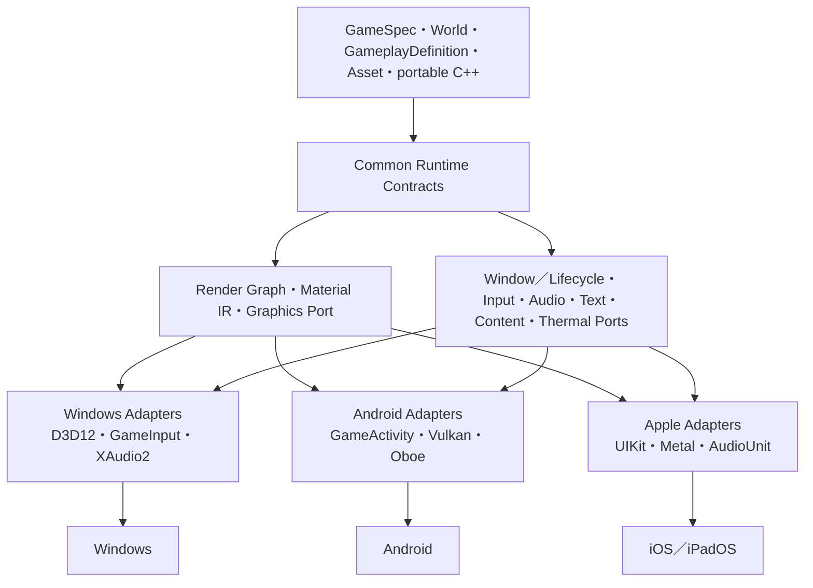

# Miraikanai Engine モバイルPlatformアーキテクチャ規約

- 文書版: 1.6
- 作成日: 2026-07-19
- 調査基準日: 2026-07-20
- 対象: Android、iOS／iPadOS、共通C++ Runtime、Windows Editor、Build／配布、AI Authoring
- 状態: プロジェクト公式の規範設計レビュー版
- 上位文書: [AIネイティブ独自ゲームエンジン 設計計画書](./2026-07-18-ai-native-game-engine-authoring-design.md)
- Game実装方式: [Miraikanai Engine C++実行コード・構造化ゲームデータ規約](./2026-07-19-cpp-structured-game-data-design.md)
- Native Game規約: [Miraikanai Engine NativeGameModuleアーキテクチャ規約](./2026-07-19-native-game-module-architecture-design.md)
- 基盤規約: [Miraikanai Engine 基盤アーキテクチャ規約](./2026-07-19-engine-foundation-architecture-design.md)
- C++言語・Modules規約: [Miraikanai Engine C++23・Named Modules・`import std`移行規約](./2026-07-20-cpp23-modules-import-std-transition-design.md)
- Runtime規約: [Miraikanai Engine Runtime連携・寿命・性能規約](./2026-07-19-runtime-integration-lifetime-performance-design.md)
- 機能範囲: [Miraikanai Engine 2D／3D機能計画](./2026-07-19-2d-3d-capability-plan.md)
- Renderer／Asset規約: [Rendering／Render Graph](./2026-07-19-rendering-render-graph-architecture-design.md)／[Asset Pipeline／Content Package](./2026-07-19-asset-pipeline-content-packaging-design.md)
- Player I/O規約: [Input](./2026-07-19-input-action-device-architecture-design.md)／[UI・Text](./2026-07-19-ui-text-localization-accessibility-design.md)／[Audio](./2026-07-19-audio-mixer-spatial-architecture-design.md)
- AI実装・保守規約: [Miraikanai Engine AI実装・保守ガバナンス規約](./2026-07-19-ai-engine-development-governance-design.md)
- 実行可能契約規約: [Miraikanai Engine 実行可能契約・Schema・Codegen規約](./2026-07-19-executable-contract-schema-codegen-design.md)
- AI検証規約: [Miraikanai Engine AI検証・評価・来歴規約](./2026-07-19-ai-verification-evaluation-provenance-design.md)

## 1. 結論

Miraikanai Engineは、**Windows Editor＋共通Runtime Contract＋Platform Adapter**方式でAndroidとiOS／iPadOSへ対応する。Windows版を別Engineとして移植せず、GameSpec、World、Asset ID、GameplayDefinition／Capability、Render Graph、入力action、Save schema、AI ChangeSetを共通の正規形式に保ち、OS、Graphics、Audio、Lifecycle、Text、Content Delivery、Thermal／MemoryだけをAdapterへ隔離する。

初期の公式範囲を次に固定する。

| 区分 | 公式範囲 |
|---|---|
| Editor Host | Windows 11 25H2以降 x64だけ。モバイル端末上のEditorは作らない |
| Windows出力 | `windows_desktop_v1` |
| Android出力 | Android phone／tablet／foldable、`android_mobile_v1` |
| Apple出力 | iPhone／iPad、`apple_mobile_v1` |
| 初期対象外 | Android TV／Wear OS／Android Auto／Android XR、tvOS、visionOS、macOS Game、Web |
| 制作方式 | Editor制作型を先行。出荷後のRuntime AIは検証済み構造化data変更だけ |
| Game実装 | 共通の構造化ゲームデータ＋portable C++。Platform固有処理はEngine Adapterだけ |

広告、課金、push notification、platform account／achievement／leaderboard、cloud save、camera／microphone／location、background gameplayはC1 mobile vertical sliceへ含めない。忘却ではなくProduction用`PlatformServiceCapability`の別設計対象であり、各機能はGoogle Play／Apple API、permission、privacy、子ども向けpolicy、offline／failure、test account、receipt／server authorityを個別に規範化してからC2へ追加する。初期C1はpermissionなしで成立するoffline single-playerを合格fixtureとする。

この方式を採る理由は、単一の正規Projectを維持しながら、D3D12、Vulkan、Metalの差、Androidのprocess／surface lifecycle、Appleのsigning／store要件を明示的に封じ込められるためである。Unity、Unreal Engine、GodotのExporter、Scene、Component、Editor配置をコピーしない。一次資料と実機挙動は参照するが、Capability schema、Target Profile、Device workflow、品質縮退、AIの安全境界はMiraikanai Engine独自の契約とする。

## 2. 規範、優先順位、変更管理

### 2.1 用語

- **Platform fact**: OS vendorまたはLibrary公式資料が定めるAPI、制限、配布要件。
- **Project official rule**: Platform factを満たすため本Engineが選択した、CIで検査する規約。
- **Target Profile**: OS、CPU ABI、Graphics backend、最低Capability、memory／性能tierの組。
- **Distribution Profile**: Store、package、asset delivery、signing方法の組。
- **Capability Signature**: 実機が報告したOS、GPU、feature、memory class、display、thermal能力の正規化値。
- **Cook**: 共通AssetをTarget Profile固有のshader、texture、packageへoffline変換する工程。
- **Shipping Runtime**: Storeへ提出する署名済みGame binary。

### 2.2 文書の決定権

| 項目 | 決定権 |
|---|---|
| Product、AI制作経路、全体Phase | 上位の設計計画書 |
| C++／GameplayDefinition境界、NativeGameModule | Game実装方式規約 |
| C++所有権、module、依存、共通directory | 基盤規約 |
| Runtime phase、handle、queue、共通memory規約 | Runtime規約 |
| 2D／3D Capabilityと表現 | 2D／3D機能計画 |
| Android／AppleのTarget、Adapter、package、実機budget、store gate | 本書 |

本書はPlatform固有事項について他文書より優先する。矛盾を見つけた場合は実装者が暗黙に片方を選ばず、文書修正またはADRを先に行う。

### 2.3 更新規約

- Toolchainは`toolchain.lock.json`、Store／OS要件は`store_policy.lock.json`へ分離する。
- Shipping候補作成前14日以内、Store提出前7日以内に、Google PlayとAppleの要件を公式URLから再確認する。
- minimum OS、minimum device capability、Runtime AI許可範囲を緩和または強化する変更はADR、移行影響、実機bridge baselineを必須とする。
- Preview／beta SDKをShipping baselineへ採用しない。
- exact binary hash、署名、package integrityはbootstrap時に機械取得してlockする。値の転記は未決設計ではなく再現Build手順である。

## 3. 採用方式と不採用方式

| 方式 | 判定 | 理由 |
|---|---|---|
| Windows Editor＋共通Runtime Contract＋Platform Adapter | 採用 | Editor投資を集中し、共通GameSpecと各OSの安全な境界を両立できる |
| Windows版完成後にExporterだけを追加 | 不採用 | D3D12、desktop memory、mouse前提が正規dataへ混入し、後付け変換が破綻する |
| Windows／Android／Appleで別Runtimeを作る | 不採用 | Gameplay、Save、AI ChangeSet、testの意味がPlatformごとに分岐する |
| 最初から各OS用Editorを作る | 不採用 | UI shell、IME、windowing、signingの範囲が増え、Game出力の完成を遅らせる |
| AndroidでOpenGL ES fallbackを持つ | 初期不採用 | Renderer、shader、同期、QAを二重化する。Vulkan 1.1＋AVP 2022を最低gateにする |
| AppleでMetal Shader Converterを唯一のdefaultにする | 不採用 | approved minimumのA12／Apple5はArgument Buffers Tier 2を持たず、Converter出力の前提を満たさない |
| Shipping端末でshader／native codeを生成・取得 | 禁止 | Store policy、code signing、安全性、再現性に反する |

## 4. 公式Target Profile

### 4.1 Profile一覧

| Profile ID | 最低OS／Device | CPU／ABI | Graphics | Shipping package |
|---|---|---|---|---|
| `windows_desktop_v1` | Windows 11 25H2、build family 26200 | x86-64 | D3D12、SM 6.6、Enhanced Barriers | signed desktop package |
| `android_mobile_v1` | Android 10、API 29、AVP 2022合格端末 | `arm64-v8a` | Vulkan 1.1、Android Vulkan Profile 2022 | Android App Bundle（AAB） |
| `apple_mobile_v1` | iOS／iPadOS 17、A12／Apple GPU family 5以上 | arm64 | Metal | signed archive／App Store package |

`x86_64` Android ABIはemulatorと開発CIだけに使用し、Store出荷対象に含めない。Apple Simulator buildはtest用であり、実機arm64 packageの代替にしない。

### 4.2 Distribution Profile

| Profile ID | 対象 | Asset delivery |
|---|---|---|
| `android_play_v1` | Google Play | base module＋Play Asset Delivery |
| `apple_bundle_v1` | iOS／iPadOS 17以上 | app bundle内Asset＋必要に応じてself-hosted unmanaged Background Assets |
| `apple_managed_assets_v1` | iOS／iPadOS 26以上を別製品variantとして選ぶ場合だけ | Apple-hosted Managed Background Assets |

`apple_bundle_v1`と`apple_managed_assets_v1`は同じbinary variantで混在させない。後者を選ぶProjectはminimum OS 26の別Distribution Profileとしてvalidation、package、TestFlightを分離する。

### 4.3 正規schema

Projectは少なくとも次の型付きdataを保存する。free-form stringでPlatform条件を表さない。

```text
TargetProfileRef {
  profile_id
  profile_revision
  render_quality_tier
  memory_class
  target_fps
  optional_capabilities[]
}

DistributionProfileRef {
  profile_id
  package_id
  version_name
  version_code
  signing_profile_ref
  content_delivery_policy
}

ProjectMobileSpec {
  orientation_policy
  resize_policy
  safe_area_policy
  touch_fallback_policy
  permissions[]
  privacy_declarations[]
  content_safety_profile_ref
}
```

`profile_revision`不一致、未知Capability、禁止permission、budget超過、minimum deviceとshader要求の不整合はCook前に拒否する。

## 5. Toolchainと再現Build

### 5.1 Android baseline

調査基準日時点のShipping baselineを次に固定する。

| 項目 | 固定値 |
|---|---|
| compile／target SDK | Android API 36 |
| minimum SDK | API 29 |
| Android NDK | r29、`29.0.14206865` |
| Android Gradle Plugin | 9.3.0 |
| Gradle | 9.5.0 |
| Android SDK Build Tools | 36.0.0 |
| JDK | Microsoft Build of OpenJDK 17.0.19 LTS。Windows x64 zip 186,907,952 bytes、SHA-256 `394d1d8253d58b462300f15f9c81369478cf8813f82dca914c3b5dfdef080f9f` |
| Native Build | 固定Gradle Wrapper／AGP `externalNativeBuild.cmake` → CMake 4.4.0 → Single-Config Ninja 1.13.2 |
| GameActivity | AndroidX Games 4.4.2 |
| Game Controller | AndroidX Games Controller 2.0.2 |
| Frame Pacing | AndroidX Games Frame Pacing 2.1.3 |
| Audio | Oboe 1.10.0 |
| Shipping ABI | `arm64-v8a` |
| Development ABI | `arm64-v8a`、必要なCIだけ`x86_64` |
| STL | `c++_shared`をappと全native dependencyで統一 |

GameActivityが統合するGameTextInputを利用し、重複したtext input dependencyを追加しない。GameActivity、Controller、Frame PacingはPrefabからC++ targetへ接続する。Version catalog、Gradle dependency verification、SDK package metadata、NDK source properties、全artifact SHA-256をlockする。

Android configureは少なくとも次を固定する。

```text
CMAKE_SYSTEM_NAME=Android
CMAKE_ANDROID_ARCH_ABI=arm64-v8a
CMAKE_SYSTEM_VERSION=29
CMAKE_ANDROID_STL_TYPE=c++_shared
ANDROID_PLATFORM=android-29
```

First-party Android C++の正本はRoot `CMakeLists.txt`、公式入口は固定Gradle Wrapperと`externalNativeBuild.cmake`、CMake Generatorはexact `Ninja`とする。この経路の正規Driver Profile IDは`android_gradle_ninja_v1`であり、基盤規約のMCDと`toolchain.lock.json` bindingから解決する。`Ninja Multi-Config`、`ndk-build`、Unix／NMake／MinGW／MSYS Makefiles、raw MakefileをAndroid公式経路にしない。Gradle外のcompile-only診断を行う場合も同じCMake／NDK lockと`-G Ninja`を使用し、Package／Promotion Receiptを発行しない。

Configuration写像を次に固定する。

| Mira configuration | Gradle build type | `CMAKE_BUILD_TYPE` | 制約 |
|---|---|---|---|
| `Development` | `debug` | `Debug` | debuggable、Shipping不可 |
| `Profile` | `profile` | `RelWithDebInfo` | profiling用、Shipping不可 |
| `Shipping` | `release` | `Release` | CX3とRelease Gate合格時だけ |
| `ASan` | `asan` | `Debug`＋AddressSanitizer | test packageだけ、Shipping不可 |

`profile`は`release`、`asan`は`debug`から明示初期化するが、署名、debuggable、最適化、sanitizer、package suffixを個別に上書きし、fallback build typeへ暗黙変換しない。Resolved Build tree identityは`module_id × variant_id × ABI × C++ Frontend Profile × toolchain_lock_hash`とする。`buildStagingDirectory`は`out/build/android/<module_id>/<cxx_frontend_profile_id>/`をProject-owned rootとし、AGPが管理するVariant／ABI別子directoryを別Profileや別Moduleと共有しない。実際のresolved pathと`CMAKE_GENERATOR=Ninja`をBuild Receiptへ記録する。

GradleはCMake targetを選択し、Ninjaが生成した`.so`をAPK／AABへpackageする。CMake／NinjaはManifest merge、Android resource、DEX、APK／AAB assembly、Signingを所有しない。AI、Editor、CIはGradle Wrapperを呼び、`ninja`、`cmake -G`、Gradle daemon内部pathをProduct Build入口として公開しない。

### 5.2 Apple baseline

| 項目 | 固定値 |
|---|---|
| Unsigned Build host | macOS Tahoe 26.2以降の専用またはephemeral CI Mac worker。署名鍵、Provisioning profile、Store credentialを持たない |
| Xcode | 26.6 Stable |
| SDK | iOS／iPadOS 26.5 |
| Deployment target | 17.0 |
| Architecture | arm64 |
| CMake／generator | CX0は`apple_cx0_xcode_v1`でCMake 4.4.0／Xcode。CX1 Probeは`apple_modules_probe_ninja_v1`でCMake／Ninja Multi-Config 1.13.2、packageなし。CX2–CX3は`apple_modules_ninja_xcode_v1`でportable C++23 Module graphをCMake／Ninja Multi-Config、App shell／最終link／archiveをXcode |
| Language boundary | C++23 core＋Generated C ABI＋Objective-C／Objective-C++ Adapter、ARC有効。Xcode側bridgeはC++ Named Moduleをimportしない |
| Shipping backend | `apple_xcode_cloud_v1`または適合済み`apple_self_hosted_split_v1`だけ |
| Shipping | source-free signing／export、archive validation、TestFlight、App Store |

WindowsはApple用Asset cook、portable shader validation、source生成まで行えるが、最終Metal compilationとarm64 linkは行わない。CX0のApple Unsigned Build Workerは`apple_cx0_xcode_v1`でlockされたXcodeを実行する。CX1は`apple_modules_probe_ninja_v1`のcompile-only Probeだけで`UnsignedApplePayloadV1`を生成しない。CX2–CX3は`apple_modules_ninja_xcode_v1`でlockされたNinja C++ Module buildとXcode App shell／archive buildを実行し、`UnsignedApplePayloadV1`を生成する。CX2–CX3ではBMIをNinja Build tree外へ出さず、Xcode側はGenerated C ABI Headerとopaque handleだけでEngine archiveへ接続する。このWorkerはAI生成SourceとBuild phaseを実行する非信頼実行系であり、Provisioning profile、certificate private key、App Store Connect credential、Production secretを一切持たない。

自己hostする`AppleUnsignedBuildWorkerV1`は、Apple hardware上の次の隔離Profileを全て満たす。

- 非管理者のTask専用macOS identityで実行し、User home、Keychain、他Project、Source control credential、Signing／Upload ServiceのfilesystemまたはIPC endpointをmountしない。
- 組織が利用権を持つmacOS／Xcodeから作った署名済みimmutable Base imageとToolchain manifestを使う。Taskごとに新しいVM／ephemeral volumeを作り、停止後にOutput Receiptを確定してTask diskを破棄する。単なるworkspace削除、同じ長寿命login session、前Task snapshotからの継続をclean workerとみなさない。
- Build guestへ一般virtual NICを公開せず、入力／出力はHost側Brokerが認証するlength-framed content-addressed channelだけにする。SDK／Dependencyは事前承認Bundleへ含め、Build中のdownload、Source control接続、任意egressを禁止する。
- CPU、memory、process、File数、単一／総Output byte、wall timeをHostとguestの両方で制限し、子Processを含めて終了する。Outputは`UnsignedApplePayloadV1`とbounded Log／Receiptだけで、guest filesystem archiveを返さない。
- Signing／Upload Serviceと同じmacOS kernel／user namespaceで動かさない。別host、またはBuild guestからHost secretへ到達できないPlatform-managed virtualization境界を必須にし、境界のversion／hash／negative-test ReceiptをToolchain lockへ含める。

このProfile、macOS／Xcode利用許諾Evidence、task reset、Broker isolationを証明できない自己host MacはProduction BackendとしてActivationしない。OS kernel／hypervisor／firmware侵害はガバナンス規約のTrust boundary外だが、疑いがある場合はBase image再利用ではなくHost隔離とclean rebuildを行う。

Apple Shipping backendは次の二つだけを公式対応にする。

| Backend | 採用条件 | Secret境界 |
|---|---|---|
| `apple_xcode_cloud_v1` | Appleのephemeral build、Cloud Signing、built-in TestFlight／App Store配布を使い、組織Policyと料金が許容する | Distribution private keyをBuild scriptまたはMiraikanai Serviceへ渡さない。独自secretをBuild environmentへ置かない |
| `apple_self_hosted_split_v1` | 下記のsource-free signing適合試験を、lockしたXcode／SDKごとに合格する | Unsigned Build Worker、Apple Signing Service、Store Upload Serviceを別identity、別workspace、別credentialで分離する |

`apple_self_hosted_split_v1`のApple Signing Serviceは、`UnsignedApplePayloadV1`、承認済みEntitlement／Provisioning参照、署名済みRelease Authorizationだけを受け取る。Project source、`.xcodeproj`、`.xcworkspace`、CMake／Swift Package／Build script、任意shell、任意environmentを受け取らず、compile、link、Run Script phaseを実行しない。固定したfirst-party packagerがbundle path、Mach-O、nested code、Info.plist、Entitlement、Privacy Manifest、provisioning対応、hashを検査し、内側から外側の順に署名し、archive／export／validationを行う。Signing ServiceはOS keychainまたはHSM-backed identityだけを使い、private keyをFile、Environment、標準入出力、Logへ展開しない。Store Upload Serviceは署名済みpackageと短命App Store Connect credentialだけを持ち、SourceとSigning keyを持たない。

Appleの公式文書はarchive export時の再署名と手動署名を規定するが、任意の未署名iOS payloadからSourceなしで全Project形状をApp Store提出物へ変換できることまでは保証しない。このため`apple_self_hosted_split_v1`は、実在する最小2D fixtureで次を全て満たすまでActivationしない。

1. Unsigned Build WorkerにKeychain identity、Provisioning profile、Store credentialが存在しない状態でarm64 binaryと`UnsignedApplePayloadV1`を再現生成する。
2. Signing ServiceにSource、Project、Build script、compilerを置かず、固定Toolと固定RPCだけでnested signing、archive／export、`codesign`検証、Xcode validationを完了する。
3. TestFlight internal testingへuploadし、A12実機でinstall／launch／saveを確認する。
4. 悪意あるBuild scriptによるKeychain列挙、Environment読取り、Network送信がSecretを得られないことをnegative testで示す。
5. Signing ServiceがSource、script、symlink／hardlink／reparse相当、不正bundle path、未宣言nested code、Entitlement差替え、payload hash差を拒否する。

いずれかが不合格なら結合型のcredential-bearing Mac buildへfallbackせず、`apple_xcode_cloud_v1`を使うかApple Shippingを`UnsupportedCapability`で停止する。Xcode／SDK更新ごとに同じ適合試験を再実行する。

Remote Apple ServiceはTLS 1.3のmutual authenticationを必須とし、`status`、`submit_unsigned_build`、`submit_signing`、`submit_upload`、`cancel`、`fetch_artifact`、`fetch_receipt`、`fetch_log`のversioned RPCだけをRole別に公開する。任意shell、任意path、任意environment変数をWindows Editorへ公開しない。入力はcontent-addressed manifest、lock digest、署名済みRequest schemaで受け、専用ephemeral workspaceへmaterializeし、完了／失敗後にSecretを含まない成果物だけを返してworkspaceを削除する。受信fileごとにsizeとSHA-256、成果物manifestにService ID、Xcode build、SDK build、signing profile IDの非秘密識別子を記録する。

### 5.3 共通lock

`toolchain.lock.json`はPlatformごとの`profiles`を持ち、各toolについてversion、download URL、size、SHA-256、署名者、license、実行file version、resolved dependency graphを記録する。Build manifestにはlock digest、Engine commit、Target／Distribution Profile revision、shader compiler digest、Asset cooker digestを埋め込む。差異があればconfigure前に失敗させる。

`store_policy.lock.json`は次を持つ。

```text
StorePolicyLock {
  checked_at_utc
  effective_requirements[]
  official_source_urls[]
  reviewer
  toolchain_lock_digest
}
```

Shipping候補で`checked_at_utc`が14日を超えた場合はrelease jobを拒否する。Store提出Jobでは7日を超えたLockも拒否し、同じ公式URLを再確認して新しいReview付きLockを発行する。

## 6. Platform非依存アーキテクチャ

### 6.1 Module境界



CX0 Common Public HeaderとCX3 Module interfaceへ`ID3D12*`、`Vk*`、`MTL*`、JNI、Objective-C object、Android／UIKit enumを出さない。永続dataへOS handle、vendor enum、display device名を保存しない。AdapterはEngine-owned enum、handle、Resultへ変換する。

### 6.2 必須Port

| Port | 共通契約 | Platform Adapter |
|---|---|---|
| `IGraphicsDevice` | resource、pipeline、submission、present、budget | D3D12／Vulkan／Metal |
| `IApplicationSurface` | logical size、pixel size、orientation、safe area、surface generation | Win32／GameActivity surface／UIScene＋MTKView |
| `ILifecycleService` | active、inactive、suspended、surface lost、terminate、memory pressure | Win32／Android callbacks／UIKit callbacks |
| `IInputDeviceHub` | action、touch、pointer、controller、sensor snapshot | GameInput／GameActivity＋Paddleboat／UIKit＋GameController |
| `ITextInputService` | composition、selection、commit、cancel | TSF／GameTextInput／UIKit text input |
| `IAudioDevice` | callback、route、latency、interruption | XAudio2／Oboe／AVAudioSession＋AudioUnit |
| `IHapticsService` | named pattern、strength、duration、availability | Windows／Android vibration／Core Haptics fallback |
| `IContentDeliveryService` | chunk state、progress、verify、mount | local／PAD／Background Assets |
| `IDeviceConditionService` | thermal、power、memory pressure、refresh range | desktop／ADPF＋OS callbacks／ProcessInfo＋UIKit |
| `IPlatformCrypto` | SHA-256、secure random、signature verify | CNG／Android platform crypto／Apple Security・CommonCrypto |

Platform APIがない場合は、意味のない成功を返さず`UnsupportedCapability`を返す。AIはこの結果をCapability Matrixから事前に判断し、必須機能ならTargetを不合格にする。

### 6.3 Directory

```text
engine/
  platform/
    contracts/
    windows/
    android/
    apple/
  rendering/
    contracts/
    render_graph/
    material_ir/
    backends/
      d3d12/
      vulkan/
      metal/
  audio/
    contracts/
    backends/
      xaudio2/
      oboe/
      apple_audio_unit/
  input/
    contracts/
    backends/
      windows/
      android/
      apple/
  content/
    contracts/
    backends/
      local/
      play_asset_delivery/
      apple_background_assets/
tools/
  cooker/
  shader_pipeline/
  packaging/
  device_bridge/
  remote_mac_agent/
templates/
  android_game_shell/
  apple_game_shell/
```

`android`／`apple` directoryから上位のWorldやGameplay moduleへ依存してはならない。Project codeからPlatform Adapterを直接includeすることも禁止する。

## 7. Lifecycleと永続状態

### 7.1 共通状態機械

Runtime lifecycleを次へ正規化する。

```text
Cold -> Starting -> Active
Active <-> Inactive
Active|Inactive -> Suspended
Active|Inactive|Suspended <-> SurfaceUnavailable
Any -> Terminating
```

- `Active`: simulationとpresentationを実行できる。
- `Inactive`: foregroundだがinteractionを受けない。authoritative simulationをpauseする。
- `Suspended`: CPU／GPU／audio activityを停止し、復帰に必要な状態を保存済み。
- `SurfaceUnavailable`: Worldは保持できるがswapchain／drawableは存在しない。
- `Terminating`: best-effort通知であり、到達を保証しない。

Android process killとiOS termination callbackの不達を前提とし、終了callbackだけにSaveを依存させない。Saveはexplicit checkpoint、background／inactive遷移、重要transaction commit後にgeneration付きtemp fileへ書き、flush、atomic replace、journal commitする。復帰時はSchema version、content hash、last complete transactionを検証する。

### 7.2 Surface generation

Surface再作成、rotation、resizeごとに`SurfaceGeneration`を増やす。Render jobはcaptureしたgenerationが現在値と異なる場合にpresentせず破棄する。World、Gameplay Asset、Saveはsurface消失で破棄しない。swapchain／drawable、depth、size-dependent render targetだけをretire queue経由で再作成する。

### 7.3 Background動作

初期Game Runtimeはbackground simulation、background network tick、background Asset decodeを行わない。OSが認める短いSave完了処理だけを使用する。音楽再生、位置情報、Bluetooth等のbackground modeは初期Capabilityに含めず、将来のDomain PackとStore／privacy再審査を必要とする。

## 8. Android Adapter規約

### 8.1 Application shell

- 新規C／C++ Game向けの公式経路であるGameActivityを用いる。
- Kotlin／Java shellはActivity、Store SDK、permission、billing等のPlatform glueだけを担当し、Gameplay stateを所有しない。
- EngineとGameは一つのnative shared libraryとしてlinkし、GameActivityから明示entry pointを呼ぶ。
- 生成Manifestは`minSdk=29`、`targetSdk=36`に加え、`android.hardware.vulkan.version`を`android:version="0x00401000"`、`android:required="true"`としてVulkan 1.1をStore filterへ宣言する。OpenGL ES fallbackを暗黙に宣言しない。
- `SurfaceView`から得る`ANativeWindow`をmove-only wrapperで保持する。acquire／releaseを一対にし、surface generationを記録する。
- Native callbackからJNIを長期保持しない。local referenceはframe内、global referenceはRAII wrapper、thread attachはscope guardで管理する。
- UI／Activity操作はmain threadへdispatchする。Render／Audio threadからJava UIを直接呼ばない。

### 8.2 Vulkan

- Loader APIとdevice featureを起動時にprobeし、Vulkan 1.1とAVP 2022の必須条件を満たさなければ`UnsupportedDevice`として起動前に説明する。
- AVP 2022全条件はAndroid Manifestだけでは表現できない。Production公開前にPlay Device Catalogの対象一覧と実機Capability Signatureを照合し、既知の不合格model／SoCをconsole exclusionへ反映する。未知modelを自動合格にせず、pre-launch reportまたはDevice Labで合格するまで`unverified`としてrelease ownerへ警告する。Manifest filter、catalog exclusion、Runtime probeの三段をRelease manifestへ記録する。
- AVP 2025は`mobile_high`の任意Capabilityであり、baseline contentの必須条件にしない。
- orientation changeでdisplay compositorへ余計な回転をさせないよう、swapchain transformとprojectionを用いたpre-rotationを必須とする。
- Frame Pacing libraryのSwappyをpresent timingへ利用する。busy waitによるframe capは禁止する。
- validation layerはdevelopment packageだけ。Shippingへ同梱しない。
- Vulkan device lostは同一sessionで無条件復旧しない。crash-safe diagnosticを保存し、World Saveを保護して明示的なrender fault画面または安全終了へ移る。

### 8.3 Input、text、audio

- touch、key、mouseはGameActivity input bufferから収集し、tick境界で`InputSnapshot`へ変換する。
- controllerはAndroidX Games Controllerを使い、Engine action mapへ正規化する。
- IME compositionはGameTextInputから`TextCompositionEvent`へ変換する。
- AudioはOboeを使用する。minimum API 29ではAAudio pathを優先し、実際に選択されたbackend、sample rate、burst size、latencyをtraceへ記録する。
- Audio callback内でallocation、mutex、file I/O、log、JNI、Asset lookupを行わない。

### 8.4 Memory、thermal、hardening

- `onTrimMemory`とOS memory pressureを`MemoryPressureLevel`へ正規化し、Asset cache、streaming、quality governorへ通知する。
- ADPF、Performance Hint、Thermal APIはruntime API levelとavailabilityを確認して使用する。利用不可でも正しさを失わない。
- 全native `.so`を16 KiB page size互換にする。NDK r29／AGP 9.3のdefaultだけを信用せず、`llvm-objdump`、`zipalign -P 16`、`bundletool`でsegment alignmentとpackage alignmentをCI検査する。
- arm64 Shipping C／C++は`-mbranch-protection=standard`、RELRO、stack protector、FORTIFYを有効にする。例外はbinary別ADRを必要とする。
- development実機でHWASan、Shipping候補でGWP-ASan sampled modeを検証する。

## 9. Apple Adapter規約

### 9.1 Application shell

- UIKitのscene-based lifecycleを使用し、`UIScene`ごとにsurface generationを管理する。
- 描画surfaceは`MTKView`またはEngine-owned `CAMetalLayer` Adapterとし、初期実装は`MTKView`を採用する。
- Drawableはframeの可能な限り遅い時点で取得し、CPU処理中に保持しない。
- UIKit objectはmain thread、Objective-C++ `.mm` Adapter、ARCで所有する。Common C++ objectへObjective-C pointerを保存しない。
- safe area、display scale、orientation、preferred frame rateを毎回snapshotとしてRuntimeへ渡す。

### 9.2 最低Device宣言

`UIRequiredDeviceCapabilities`へ少なくとも`arm64`、`metal`、`iphone-ipad-minimum-performance-a12`を生成する。この最低性能宣言は最初の公開版から固定する。公開後に必須Capabilityを強化すると既存利用者の更新可能性へ影響するため、変更は新しいmajor product profileとmigration decisionを必要とする。

### 9.3 Metal

- 最低GPUをApple family 5（A12）とする。
- `MTLHeap`をpersistent resource suballocationへ利用し、transient attachmentは対応端末でmemoryless resourceを使用する。
- drawable、command buffer、resourceはObjective-C retainを隠すmove-only C++ handleで所有し、submission完了serialまでretireしない。
- `MTLBinaryArchive`とoffline shader libraryをCook時に生成し、Shipping中のshader source compileを禁止する。
- device removal相当、drawable timeout、background遷移を別failureとして記録し、drawable不在をGPU faultと誤認しない。

### 9.4 Input、text、audio

- UIKit touchをprimary pathとし、Game Controller frameworkをcontroller fallback／追加入力として使う。
- controller必須GameでもiPhone／iPadの主要操作にtouch fallbackを必須とする。
- optional motion inputはCore Motion Adapterを通し、permission／privacy declarationとsampling budgetを必要とする。
- text composition、selection、software keyboardをUIKit text input Adapterへ集約する。
- Audioは`AVAudioSession`でcategory、route、interruptionを管理し、RemoteIO／AudioUnit callbackへEngine mixerを接続する。
- interruption、route change、media service resetを型付きeventにし、callback内allocation、lock、logを禁止する。

### 9.5 Memory、thermal、診断

- process physical footprint、`os_proc_available_memory`、UIKit memory warning、Metal allocated sizeを同時に計測する。
- `ProcessInfo.thermalState`を共通Thermal Levelへ変換する。
- developmentではAddressSanitizer、Thread Sanitizer、Main Thread Checker、Metal validationを別jobで実行する。Sanitizer同時有効化で結果を混同しない。
- Shipping crash reportへEngine build ID、Target Profile、Capability Signature、last completed frame／tick、memory／thermal levelを含める。個人情報や会話本文は含めない。

## 10. Graphics、Shader、Material

### 10.1 共通座標契約

Engineの正規clip／depthを次に固定する。

| 項目 | 正規値 |
|---|---|
| Clip X／Y | `[-1, 1]` |
| Depth Z | `[0, 1]` |
| Depth方式 | reversed-Z、near=1、far=0、clear=0、`GREATER_EQUAL` |
| World | 右手系、+Y up |
| Texture Asset UV | top-left originへ正規化 |

Vulkanのviewport／surface transform、Metalのviewport／raster規約との差はbackend projection policyで処理する。Gameplay、Camera Asset、Materialへbackend補正を埋め込まない。CPU／Shaderのmatrix conventionは全backendでcolumn vector、column-majorを維持する。

### 10.2 Render Graphと同期

Render Graphはvendor stateではなく、Engine-owned `ResourceAccess`、`PipelineStage`、`AttachmentUse`、`QueueClass`を保存する。Compilerが次へ変換する。

| Backend | 変換先 |
|---|---|
| D3D12 | Enhanced Barriers、queue fence |
| Vulkan | pipeline／access mask、image layout、semaphore／fence |
| Metal | command encoder境界、resource usage、event／command buffer completion |

GPU完了値は`GpuSubmissionSerial { queue_id, value }`として共通化する。Backend resource、descriptor／argument table、allocationは、そのserial完了前に再利用または破棄しない。

Frames-in-flightは`mobile_baseline`を2、`mobile_standard`／`mobile_high`を3に固定する。Profile外の値を拒否し、frame slotの全submission完了前にtransient arena、upload ring、binding rangeをresetしない。

### 10.3 GPU memory

| Backend | allocator |
|---|---|
| D3D12 | D3D12 Memory Allocator 3.2.0 |
| Vulkan | Vulkan Memory Allocator 3.3.0 |
| Metal | Engine-owned allocator上の`MTLHeap`＋memoryless attachment |

VMAは`IGpuAllocator` Adapter内部だけで使い、default thread safetyを有効にする。`VK_EXT_memory_budget`が利用可能ならbudget計測に使い、`vmaGetHeapBudgets`を共通telemetryへ変換する。Defragmentationはloading boundaryだけで行い、live descriptor／commandが参照するresourceを移動しない。

### 10.4 Shader pipeline

正規入力はMaterial Graph／Shader IRとportable HLSL 2021 subsetである。出力を次に固定する。

```text
Windows:
  Material IR -> HLSL -> DXC -> DXIL -> validation -> package

Android:
  Material IR -> portable HLSL -> DXC -spirv -> SPIR-V
  -> SPIRV-Tools validation/optimization -> Vulkan package

Apple:
  Material IR -> portable HLSL -> DXC -spirv -> SPIR-V
  -> SPIRV-Cross -> MSL -> Apple metal/metallib
  -> Metal validation/binary archive -> package
```

- DXCは基盤規約の固定版を使う。
- SPIRV-Toolsはrelease `v2026.2`をlockする。
- SPIRV-CrossはKhronos sourceをvcpkg builtin baselineで解決し、commitとsource SHA-512をlockする。floating `main`を禁止する。
- Metal Shader ConverterはApple family 6／A13以上の任意高速pathを将来評価できるが、A12 baselineのdefaultにしない。
- Shipping Runtimeにcompiler、shader source、reflection authoring dataを含めない。必要最小限のpipeline metadataと署名済みbinaryだけを含める。

### 10.5 Shader Capability Profile

`portable_mobile_v1`では、mesh shader、ray tracing、unbounded bindless、wave size依存algorithm、geometry／tessellation stageを必須機能として禁止する。必要なEffectはcompute、instancing、indirect drawのprofile内subset、CPU fallbackで表現する。`windows_desktop_v1`のSM 6.6要件をmobile shaderへ伝播させない。

AIがMaterialを生成する際は、選択TargetすべてのCapability intersectionでcompile／resource count／precision testを行う。Target限定表現を選ぶ場合はfallback Materialと視覚差をChangeSetへ明示し、人間の承認を得る。

## 11. Texture、Asset Cook、Content Delivery

### 11.1 Texture format

KTX-Software 4.4.2をoffline texture toolとしてlockし、Source AssetからTarget別artifactを生成する。

| Target | Color／normal等の基本出力 |
|---|---|
| Windows | BCn |
| Android | ASTC primary＋ETC2 fallback package |
| Apple | ASTC |
| Pixel Art／UI／mask | edgeを壊すblock compressionを避け、RGBA8または用途別lossless |

AndroidはPlay texture compression format targetingを用い、同一Asset IDにASTC／ETC2 artifactを対応付ける。初期版は端末上のBasis／Universal Texture transcodeを行わない。Cook後artifactの幅、高さ、mip、color space、alpha mode、format、content hashをmanifestへ保存する。

### 11.2 共通Asset chunk

```text
AssetChunkManifest {
  chunk_id
  delivery: install | essential | prefetch | on_demand
  compressed_size
  installed_size
  sha256
  signature
  dependencies[]
  target_artifacts[]
}
```

Mount条件はdownload完了だけでなく、size、SHA-256、署名、dependency closure、Target Profile一致の全合格とする。途中download、古いmanifest、hash不一致はlive Asset namespaceへ公開しない。

### 11.3 Android Play Asset Delivery

- `install`はbase moduleへ同梱し、`essential`をinstall-time、`prefetch`をfast-follow、`on_demand`をon-demand asset packへmapする。base moduleへ収まらない`install` chunkは自動で意味を変えず、Project側で`essential`へ明示変更する。
- Asset packへnative library、DEX、shader source／binary／pipelineその他の実行codeを入れない。
- 現行Play limitをvalidatorへ固定する: base module 500 MB、各pack 1.5 GB、install-time累計4 GB、fast-follow＋on-demand累計30 GB、全体34 GB、最大100 pack。
- 200 MBを超えるcellular downloadで追加確認が生じ得ることをEditorのpackage previewへ表示する。

### 11.4 Apple asset delivery

- `apple_bundle_v1`では`install`をapp bundleへ同梱し、`essential`、`prefetch`、`on_demand`を同名policyのself-hosted unmanaged Background Assetsへmapする。`essential`を使用しないProjectはfirst playableに必要な全Assetを`install`へ含める。
- deprecated On-Demand Resourcesを新規採用しない。
- App Storeのhard gateはiOS／iPadOS 9以降でuncompressed app 4 GB、各Mach-O executableの全`__TEXT` section合計500 MBである。初期Projectの`install` content budgetはdownload／install成功率のため2 GBとし、2 GB超はProject profileとrelease owner承認を要求するが、4 GB hard gateは緩和しない。
- `apple_managed_assets_v1`はminimum iOS 26の別variantだけで使用し、`essential`、`prefetch`、`on_demand`をApple-hosted managed packへmapする。Apple-hosted limitはapp record当たり合計200 GB／200 packsとしてvalidatorへ固定する。
- 初回起動を空のdownloader画面にしない。tutorialまたは意味のあるfirst playableをinstall contentへ含める。

### 11.5 Audio Asset

- 短い効果音はPCM 16-bit little-endianのTarget artifactを基本とする。
- streaming music／voiceはlibopus 1.6.1をEngine codec Adapter内で利用できる。
- decode bufferはAudio thread外で確保し、lock-free bounded queueでcallbackへ渡す。
- codec version、channel layout、sample rate、pre-skip、loop point、content hashをCook manifestへ保存する。

## 12. Input、UI、Display、Accessibility

### 12.1 Display

World render resolutionとUI logical resolutionを分離する。Worldはdynamic resolution対象、UI、text、pixel-locked compositionはdisplay logical resolutionで描画し、Worldの縮小に伴ってぼかさない。

`DisplaySnapshot`は少なくともpixel size、logical size、scale、safe-area insets、cutout regions、orientation、refresh range、HDR capability、surface generationを持つ。Editor previewも同じ型を使用する。

### 12.2 Touch規約

- Androidの主要interactive targetは48×48 dp以上。
- Appleの頻繁に使うcontrolは44×44 pt以上、補助controlも28×28 pt未満にしない。
- Apple textは既定17 pt、意図のある補助表示でも11 pt未満にしない。
- hit regionとvisual boundsを分離できるが、重なるhit regionを禁止する。
- touch pointer IDはOS値を直接保存せず、contact開始から終了まで有効なEngine generation handleへ変換する。
- orientation／safe-area変更は同じframeのInput mappingより先に適用する。

### 12.3 Controllerとaction

Game logicはkey codeやvendor buttonではなく`InputActionId`を読む。Touch、controller、keyboardは同じactionへbindingできる。AIはgenre templateからbinding案を作れるが、touch fallback欠落、safe-area外button、同時入力競合をvalidatorが拒否する。

### 12.4 Foldable、tablet、rotation

Android appはresize可能とし、phone固定pixel layoutを禁止する。Projectがorientationを固定する場合も、tablet／foldableのwindow size変化とsurface recreationへ耐える。UI layout testはportrait、landscape、4:3 tablet、narrow／wide foldable、cutout、large textのfixtureを持つ。

## 13. Memory、所有権、pointer

### 13.1 Memory class

初期公式budgetを次へ固定する。単位はMiBで、すべてsoft release gateである。

| Class | Process physical footprint | Engine-owned CPU | GPU working set | Render transient | Streaming cache | Emergency reserve |
|---|---:|---:|---:|---:|---:|---:|
| `mobile_baseline` | 1,024 | 768 | 384 | 128 | 192 | 64 |
| `mobile_standard` | 1,536 | 1,152 | 640 | 192 | 320 | 96 |
| `mobile_high` | 2,560 | 1,920 | 1,024 | 320 | 512 | 128 |

`Render transient`はGPU working setの内数、`Streaming cache`はEngine-owned CPUの内数、`Emergency reserve`はProcess cap内に未割当で残す量であり加算しない。Appleのunified memoryではGPU allocationもprocess physical footprintに含まれ得るため、CPU＋GPUを単純加算せず、process、CPU domain、GPUの三つを個別に合格させる。

正規`ProcessFootprint`は、AndroidのRelease実機gateではpackage PIDに対する`dumpsys meminfo`のTOTAL PSS、Appleではtask VM infoの`phys_footprint`とする。Android Runtime中はRSSとallocator totalを高速signalとして併記し、CIはPSS、RSS、VMA allocationを同時保存する。異なる指標を同じ時系列として結合せず、表のProcess capは正規値、Engine CPU／GPU capはEngine counterで個別判定する。

使用率は`max(process/cap, engine_cpu/cap, gpu/cap)`で判定する。

| Level | 条件 | 必須動作 |
|---|---|---|
| Normal | 80%未満 | 通常 |
| Constrained | 80%以上 | prefetch停止、非表示cache trim、quality一段低下候補 |
| Severe | 90%以上 | nonessential GPU／Asset即時evict、streaming縮小、新規nonessential allocation拒否 |
| Exhausted | 100%以上またはOS critical pressure | critical Save、render縮退。整合性を保てなければ診断を残し安全終了 |

Qualityを下げてもauthoritative Gameplay、Save、network stateを捨てない。

### 13.2 所有権

- native handleは全てmove-only RAII wrapperとし、owning raw pointerを禁止する。
- JNI local／global reference、`ANativeWindow`、Vulkan handle、Objective-C object、Metal resourceは各Adapter専用型で所有する。
- Render jobはbackend pointerをcaptureせず、generation付きEngine handleと`GpuSubmissionSerial`を使う。
- OS callbackはWorldを直接変更せず、bounded lifecycle／input queueへvalue eventを投入する。
- Audio callbackはpreallocated ring bufferとimmutable mix planだけを参照する。
- Platform Adapter破棄順は、callback停止、new submission停止、queue drain／timeout、resource retire、device／surface解放の順に固定する。

### 13.3 計測

Androidはprocess RSS／PSS、`onTrimMemory`、VMA heap budget、allocator domainを記録する。Appleはphysical footprint、available memory、memory warning、Metal allocation、allocator domainを記録する。単一APIだけを「空きmemory」として扱わない。

## 14. 性能、Frame pacing、Thermal

### 14.1 Frame profile

- authoritative simulationはWindowsと同じexactly 60 Hz。
- render targetは30／60 fps。120 fpsは`mobile_high`かつ実機Capability合格時の任意設定。
- 30 fpsへ縮退してもsimulationを30 Hzへ落とさない。
- variable refreshではOS／Swappy／display timingへ同期し、固定sleep loopを使わない。

| Render target | CPU P95 soft | GPU P95 soft | Frame deadline |
|---|---:|---:|---:|
| 60 fps | 14.0 ms | 14.0 ms | 16.67 ms |
| 30 fps | 28.0 ms | 28.0 ms | 33.33 ms |
| 120 fps optional | 7.0 ms | 7.0 ms | 8.33 ms |

CPUとGPUはpipelineされるためsoft値を加算しない。warm-up後10分の実機runでdeadline missを1%以下にする。各release候補は30分thermal soakと2時間enduranceを完了する。

### 14.2 Dynamic resolution

| Class | World render pixel上限 | 代表上限 |
|---|---:|---|
| `mobile_baseline` | 921,600 | 1280×720 |
| `mobile_standard` | 2,073,600 | 1920×1080 |
| `mobile_high` | 3,686,400 | 2560×1440 |

pixel数で上限を判定し、縦横比へ追従する。Dynamic resolutionは5%刻み、最低50%とする。30連続frameのうち12 frame以上でGPU soft targetを超えた場合、またはMemory／Thermalが`Serious`以上になった場合は直ちに一段下げる。一段上げるのはGPU frame timeがsoft targetの80%未満かつMemory／Thermalが`Normal`の状態を15秒連続で満たした場合だけとし、1秒に一段を超えて変更しない。UI／text／pixel-locked layerへ適用しない。

### 14.3 Thermal governor

OS signalを`Nominal`、`Warm`、`Serious`、`Critical`へ正規化する。

| Level | 品質動作 |
|---|---|
| Nominal | Profile標準 |
| Warm | resolutionまたはshadow／particleを一段低下 |
| Serious | 30 fpsへ移行、volumetric停止、streaming concurrency低下 |
| Critical | 最低品質、nonessential download停止、Saveを優先し継続不能なら安全終了 |

回復は一段ずつ、15秒以上安定してから行う。瞬間的なsignalで品質を往復させない。AIが生成したGame ruleはThermal governorを無効化できない。

### 14.4 Mobile graphics quality

| 機能 | Baseline | Standard | High |
|---|---|---|---|
| Renderer | Forward+ | Forward+ | Forward+／optional hybrid |
| Shadowed directional | 1、2 cascade、1024 atlas | 1、3 cascade、2048 atlas | 1、4 cascade、2048–4096 atlas |
| Visible local lights | 8、local shadowなし | 32、最大2 shadowed | 64、最大4 shadowed |
| Fog | height／distance fog | half-resolution volumetric optional | volumetric高品質 |
| Clouds | 2D layer | reduced volumetric optional | volumetric |
| Particle | CPUまたは限定GPU | GPU particle | GPU particle高budget |
| Reflection | probe | probe＋SSR optional | probe＋SSR |
| Anti-alias | FXAA | TAA／FXAA | TAA |

この表はvendor保証ではなくMiraikanai Engineの品質budgetである。実機測定が不合格ならCapabilityを偽装せず一段下げる。2D C1はBaselineで全機能を成立させ、3D C1はscalable subsetを成立させる。

## 15. AI、構造化ゲームデータ、C++の実行境界

### 15.1 Editor制作時

AIはWindows Editor／Build環境内で、GameplayDefinitionChangeSet、portable C++、Material Graph、portable shader、testを生成・編集できる。すべてSchema、semantic validation、static analysis、compile、test、Target Profile cook、package inspectionを通し、承認されたbinaryだけを署名する。

AIの実装選択はTarget intersectionを考慮する。

- Gameplay rule、quest、UI flow、調整値はGameplayDefinitionを第一選択にする。
- hot path、大量simulationは計測後にportable `NativeGameModule`候補とし、Engine extensionはR4で別Reviewする。
- OS lifecycle、JNI、Objective-C++、Graphics backendはEngine maintainer所有Adapterであり、Project AIの自動変更対象外。
- Target限定APIが必要ならCapability、fallback、permission、privacy、Store影響をChangeSetへ明示する。

### 15.2 Shipping Runtime

Android／AppleのShipping Runtime AIが変更できるのは、SchemaとCapabilityで許可された構造化dataだけである。例はdialogue、quest、spawn plan、predeclared encounter rule、数値調整、GameStateDeltaである。

次を禁止する。

- C／C++、native library、DEX、Objective-C、JavaScript、Python、汎用Game bytecodeを出荷後に生成またはdownloadし、それをload／実行すること。Store審査対象のbase packageへBuild時に同梱した署名済みnative binaryの通常実行は除く
- shader／MSL／HLSL／SPIR-V sourceまたは実行pipelineの生成、post-install remote／self-hosted download、JIT compile。Store審査対象のbase packageへoffline compile済みshaderを同梱する通常経路は除く
- arbitrary process、shell、dynamic library load、FFI、reflectionによる任意Engine call
- executable contentをAsset packまたはself-hosted contentへ混入すること

Runtime生成dataはcontent moderation、age／region policy、rate limit、in-app report、audit ID、rollbackを持つ`ContentSafetyProfile`に従う。Network失敗時に既存Saveを壊さず、最後に検証済みのlocal contentへfallbackする。

## 16. EditorとDevice workflow

### 16.1 必須Editor機能

既存のdockable workspaceへ次を追加する。

- Target／Distribution Profile selector
- Capability MatrixとTarget intersection表示
- phone、tablet、foldable、iPhone、iPadのsafe-area／cutout／orientation preview
- touch、multi-touch、controller、software keyboard simulation
- World resolution、UI resolution、dynamic resolution、memory、frame、thermal budget表示
- Device Manager: install、launch、stop、log、screenshot、capture、crash取得
- Apple Services: Unsigned Build Worker、Signing Service、Upload Service、Xcode／SDK／certificateの非秘密状態、適合試験、TestFlight job
- Package Inspector: ABI、native alignment、permission、privacy manifest、Asset chunk、size、shader coverage
- AI Diff内のPlatform影響、fallback、Store／permission警告

AI panelは任意workspaceで常時dock可能だが、Target設定、Inspector、Hierarchy／Outliner、Viewport、Consoleを置換しない。初心者用AI-first workspaceと上級者用Manual／Profiling workspaceは同じProject dataとCommand Gatewayを使う。

### 16.2 実機iteration

Development buildでは認証済みlocal device bridgeを介し、互換なGameplayDefinitionSet、構造化data、既Cook Assetだけをhot reloadできる。C++、shader、native pluginの変更は再build／再installを必須とする。Shipping buildにdevice bridge、debug server、compiler、credentialを含めない。

## 17. Security、Privacy、Store

### 17.1 Permission

default permissionはゼロとする。Capabilityからmanifest候補を生成しても、人間のrelease ownerが用途、画面上の説明、privacy declarationを承認するまでShipping packageへ追加しない。利用していないpermission、background mode、URL scheme、entitlementはpackage inspectionで拒否する。

### 17.2 Privacy

- Projectは`ProjectPrivacySpec`へ収集data、目的、retention、第三者共有、account deletion、子ども向け設定を保存する。
- AndroidはData Safety formとmanifest／SDK挙動の一致を検査する。
- Appleは`PrivacyInfo.xcprivacy`、required-reason API、third-party SDK privacy manifest／signatureを検査する。
- telemetry、crash、AI prompt、生成contentを同じ同意項目として扱わず、用途別に宣言する。
- credential、access token、signing key、個人データをAI prompt、Build log、crash dumpへ含めない。

### 17.3 Store policy gate

調査基準日時点で次をShipping gateへ固定する。

| Store | Gate |
|---|---|
| Google Play | 2026-08-31以降の新規／更新はtarget API 36以上 |
| Google Play native app | 16 KiB page size互換を必須 |
| Apple App Store | 2026-04-28以降のuploadはXcode 26以上とiOS／iPadOS 26 SDK以上 |
| Apple code rule | appを自己完結させ、審査後に機能を変えるcodeのdownload／実行をしない |
| Google dynamic code | remote sourceからのdynamic code loadingをShipping設計に採用しない |

日付と要件は`store_policy.lock.json`のrefresh対象であり、この表だけを永続的な最新情報として扱わない。

## 18. Build、CI、実機Test

### 18.1 Build、署名、配布pipeline

```text
Windows CI / HyperVIsolatedWorkerV1:
  validate Project
  -> build portable C++ and cook GameplayDefinition
  -> cook common + Windows + Android assets/shaders
  -> Windows package
  -> isolated Android build -> unsigned AAB
  -> package inspection

Android Signing Service:
  verify UnsignedMobilePackageV1 + Release Authorization
  -> jarsigner with upload key
  -> jarsigner verify + package inspection
  -> signed AAB

Apple Unsigned Build Worker:
  fetch signed source + cooked manifest
  -> revalidate lock/content hash
  -> Ninja compile C++23 Named Module graph + NativeGameModule archive
  -> compile Metal library
  -> Xcode build C ABI App shell + final iOS/iPadOS arm64 link
  -> UnsignedApplePayloadV1

Apple Signing Service or Xcode Cloud managed signing:
  verify payload + Release Authorization
  -> source-free nested signing/package/export
  -> archive/signature/entitlement validation

Store Upload Service:
  verify signed package + receipts
  -> TestFlight/Play internal track
  -> human-approved App Store/Google Play handoff
```

Developmentは`HyperVIsolatedWorkerV1`内でTaskごとに生成する非Production debug keyだけで署名するAPK、Shippingはunsigned AABを後段のAndroid Signing Serviceがupload keyで署名し、Play App Signingを使う。Debug keyはRelease Serviceへ登録できず、Package Inspectorはdebug certificateまたは`debuggable=true`のShipping入力を拒否する。Google公式手順どおりAAB署名には`jarsigner`を使い、`apksigner`を使わない。Android Signing ServiceはGradle、Project source、Build scriptを受け取らず、固定`jarsigner`／検証器だけを実行する。Upload keyとPlay API credentialは別Serviceに置き、Googleが保持するapp signing keyとEngineが保持するupload keyを同一にしない。Appleはdevelopment installとTestFlightを分け、App Store候補はBuild isolationと署名境界の両適合試験、archive validationを通す。

全Platform共通の`UnsignedMobilePackageV1`は、Target／Distribution Profile、Engine commit、Source tree hash、Toolchain lock、Build Receipt、SBOM hash、payload entryごとのnormalized path／size／SHA-256／executable kindを持つ。Entryは通常Fileだけを許可し、absolute／`..`／case衝突／Unicode正規化衝突、symlink、hardlink、device、socket、alternate stream、sparse fileを拒否する。Signing ServiceはManifest外Fileを無視せず失敗させ、受信byteからhashを再計算する。署名後は`MobileSigningReceiptV1`にunsigned root、signed root、key ID、certificate chain hash、profile／entitlement hash、Tool hash、検証結果を記録し、Upload ServiceはこのReceiptとR5 Approvalが一致しなければ受け付けない。

Source取得から`UnsignedMobilePackageV1`まではArtifact由来RiskのR3／R4 release-preparation Taskで行い、Signing key／Store credentialを使わない。R5は人間がunsigned root、Application、Version、Channel、Signing profile、Store listingを承認した後にだけ開始し、ガバナンス規約の一回限り`ReleaseTransactionV1`がSigningとUploadを最長6時間で実行する。Store processing／review／rollout待ちはTransaction外のread-only status監視に分離する。

### 18.2 CI lane

| Lane | 必須検査 |
|---|---|
| Portable | C++23 compile、CX0 Header conformance、CX1 Named Module／`import std` Probe、C++26 readiness、unit、schema、serialization、GameplayDefinition cook／transaction、shader IR |
| Windows | MSVC／clang-cl、D3D12 validation、Editor、reference benchmark |
| Android | Gradle dependency verification、Variant × ABI × C++ Profile別Single-Config Ninja、Generator／Build tree分離negative test、arm64／x86_64 compile、SPIR-V validation、AAB／16 KiB inspection、emulator smoke |
| Apple | CX0 Xcode build、CX1 Ninja compile-only Probe、CX2–CX3 Ninja C++ Module archive＋Xcode C ABI App shell／final link、Simulator smoke、Metal compile／validation、archive inspection、BMI非混入 |
| Physical device | graphics golden、input、audio、lifecycle、memory pressure、thermal、performance、content delivery |
| Security／privacy | sanitizer、static analysis、permission／entitlement、privacy manifest、secret scan、package executable-content scan、Build／Signing／Upload identity分離test |

### 18.3 必須実機matrix

Retail model名だけで固定せず、Capability Signatureでlaneを定義する。

| Lane | Android | Apple |
|---|---|---|
| Minimum | API 29、AVP 2022、arm64、Adreno系1台＋Mali系1台 | iOS／iPadOS 17、A12／Apple5のiPhone 1台＋iPad 1台 |
| Reference | API 36、AVP 2022以上、phone＋tablet＋foldable | A14またはM1以上、現行iOS／iPadOS、iPhone＋iPad |
| High | AVP 2025合格端末、high refresh | Apple9以降、high refresh対応端末 |

端末交換時は旧端末と新端末で同一commit、package、input traceを測るbridge baselineとADRを残す。Emulator／Simulatorはfunctional smoke専用であり、GPU、Audio latency、touch latency、memory、thermalの合否には使わない。

### 18.4 必須scenario

- clean install、upgrade、uninstall／reinstall
- cold／warm start、background／foreground、OSによるprocess killからのSave復旧
- surface loss、rotation、resize、fold／unfold、safe-area変更
- touch、multi-touch、controller connect／disconnect、IME、audio route／interruption
- offline、network loss、Asset download中断／再開／hash不一致
- memory pressure、GPU allocation失敗、thermal soak、battery saver
- 10分performance、30分thermal、2時間endurance
- Android 16 KiB package、Apple archive／privacy、Store size
- Shader全variant compile、golden image、Target fallback
- Runtime AI data validation、moderation failure、rollback、実行code混入拒否

## 19. Release gate

Shipping候補は次を全て満たす。

1. Target／Distribution Profile、Toolchain lock、Store policy lockが一致する。
2. 共通Project validationと全Target cookが成功する。
3. 未対応shader、texture、permission、privacy declaration、Asset dependencyがゼロである。
4. `UnsignedMobilePackageV1`、Build Receipt、Mobile Signing Receiptが同じSource／Toolchain／payload hashへ連結され、Android AABまたはApple archiveのABI、size、alignment、signatureが合格する。
5. Minimum／Reference実機でlifecycle、input、audio、Save、graphics goldenが合格する。
6. Memory class、frame、thermal、endurance budgetが合格する。
7. Shipping packageにcompiler、debug server、source、動的実行code、credentialが含まれない。
8. Runtime生成を使う場合はContentSafetyProfile、report、moderation、audit、rollbackが合格する。
9. Data Safety／Privacy Manifestと実binary／SDK scanが一致する。
10. release ownerがStore listing、permission purpose、privacy、unsigned artifact hash、signing profile、TestFlight／internal track結果を承認する。
11. Build WorkerにSigning／Upload secretがなく、Signing ServiceにSource／Build scriptがなく、Upload ServiceにSource／Signing keyがないことをService identityとnegative testで証明する。

## 20. 段階計画

Mobile対応はWindows MVPを捨てて同時並行に全面実装せず、共通契約を先に固定して縦切りを順に移植する。

| Mobile milestone | 実施時期 | 完了条件 |
|---|---|---|
| M0 Platform Contract | Product Phase 0 | Target／Distribution／Display／Lifecycle／Graphics Port schema、directory、toolchain lock、package validator |
| M1 Android 2D slice | Windows 2D C1後 | GameActivity、Vulkan、Oboe、touch、Save、unsigned AAB→分離署名、Baseline実機で同じ2D First Playable |
| M2 Apple 2D slice | M1後 | UIKit／MTKView、Metal、AudioUnit、touch、Save、Shipping backend適合試験、TestFlight、A12実機で同じ2D First Playable |
| M3 Mobile 3D production | Windows 3D C1後 | 3D scalable quality、shader／texture cook、thermal／memory governor、PAD／Background Assets |
| M4 Store-ready Runtime AI | Production Capability後 | data-only Runtime AI、content safety、privacy、physical device lab、release gate |

M0ではPortとschemaを作るが、未完成Adapterのstubは`UnsupportedTarget`を返す。偽の成功や空のpackageを作らない。

## 21. Definition of Done

モバイル対応は「compileした」だけでは完了としない。各Capabilityは次を満たして初めて対象Profileで利用可能と表示する。

- 正規schema、version、migration、validatorがある。
- EditorとAIがMCDから生成した同じCapability、budget、fallback、Provider projectionを理解し、同じChangeSetを生成する。
- Common Runtime ContractとPlatform Adapterの境界testがある。
- Target別Cook、`UnsignedMobilePackageV1`、分離署名済みpackage、Build／Signing Receipt、package inspectionがある。
- Minimum／Reference実機で機能、lifecycle、memory、performance、thermalを合格する。
- failure、permission、privacy、Store policy、diagnostics、rollbackがある。
- Source Assetから同じlockでartifactを再現できる。
- Manual編集とAI編集が同一Projectを往復できる。
- AI Task、Provider、Contract、Verification、Review、PromotionのReceipt hashがBuild provenanceへ接続される。
- Store／SDKのExternal EvidenceがAI検証規約の期限内であり、Submission 7日前以内に再確認される。
- Android Buildは`HyperVIsolatedWorkerV1`、自己host Apple Buildは`AppleUnsignedBuildWorkerV1`のBase image、no-secret／no-egress、Task disk破棄、Broker Output、Signing host分離conformanceを通る。
- Android／Apple Build ReceiptのDriver Profile ID、Generator、Build tree identity、Package ownerが基盤規約のclosed matrixと一致し、Makefiles／`ndk-build`、Android Multi-Config、CX1 packageを拒否する。

## 22. 主なリスクと対策

| リスク | 対策 |
|---|---|
| desktop前提がCommon APIへ漏れる | M0でPlatform contract、header dependency test、vendor型scanを導入 |
| Android GPU断片化 | AVP gate、Adreno／Mali実機、VMA budget、quality fallback |
| A12でshader pathが成立しない | SPIR-V→SPIRV-Cross→MSLをdefault、Metal Converterを必須にしない |
| Apple unified memoryを二重計上または過小計上 | process、CPU domain、GPUの三budgetを個別検査 |
| surface／process killでSave破損 | surfaceとWorld寿命分離、checkpoint、journal、atomic replace、kill test |
| Store要件が更新される | `store_policy.lock.json`、14日以内のEvidence、Submission 7日前再確認、release owner承認 |
| AIが出荷後にcodeを生成する | Shipping capabilityをdata-onlyに固定し、package／download scan |
| AI生成Build scriptが署名鍵／Store credentialを窃取する | Build、Signing、Uploadを別identity／kernel境界へ分離し、Build WorkerへSecretを一切渡さない |
| 自己host MacのBuild malwareが次Taskへ永続化する | immutable Base、Task別disk、一般egress／host shareなし、disk破棄、Broker限定Output。適合不能ならXcode Cloudだけ |
| Apple source-free signingが特定Xcode／Project形状で成立しない | lock更新ごとの適合fixtureを必須化し、不合格時はXcode Cloudまたはfail closed。結合型Mac agentへfallbackしない |
| AndroidでNinja Multi-Config／Make経路が混入しVariantと成果物がずれる | Gradle→CMake `-G Ninja`をclosed Driver Profile化し、Variant × ABI × C++ Profile別treeとReceiptを強制 |
| touch UIがdesktop UIの縮小になる | dp／pt最小target、safe-area、tablet／foldable fixture |
| 端末数増加でQAが破綻 | Capability Signature、Minimum／Reference／High lane、bridge baseline |
| 複数backendで見た目がずれる | Material IR、offline cross-compile、golden image、明示fallback |

## 23. 一次資料

### 23.1 Android

- [GameActivity](https://developer.android.com/games/agdk/game-activity)
- [AndroidX Games release notes](https://developer.android.com/jetpack/androidx/releases/games)
- [Android NDK downloads](https://developer.android.com/ndk/downloads)
- [Android Gradle Plugin 9.3 release notes](https://developer.android.com/build/releases/agp-9-3-0-release-notes)
- [Configure CMake／Ninja with Android Gradle](https://developer.android.com/studio/projects/configure-cmake)
- [Install and configure NDK and CMake](https://developer.android.com/studio/projects/install-ndk)
- [Android ABIs](https://developer.android.com/ndk/guides/abis)
- [`uses-feature` Vulkan declarations](https://developer.android.com/guide/topics/manifest/uses-feature-element)
- [Vulkan overview](https://developer.android.com/games/develop/vulkan/overview)
- [Vulkan for native game engines](https://developer.android.com/games/develop/vulkan/native-engine-support)
- [Android Vulkan Profiles](https://developer.android.com/ndk/guides/graphics/android-vulkan-profile)
- [Android Frame Pacing](https://developer.android.com/games/sdk/frame-pacing/)
- [Vulkan pre-rotation](https://developer.android.com/games/optimize/vulkan-prerotation)
- [Oboe low-latency audio](https://developer.android.com/games/sdk/oboe/low-latency-audio)
- [Android Dynamic Performance Framework](https://developer.android.com/games/optimize/adpf)
- [Memory allocation for games](https://developer.android.com/games/optimize/memory-allocation)
- [Native memory debugging](https://developer.android.com/ndk/guides/memory-debug)
- [Support 16 KB page sizes](https://developer.android.com/guide/practices/page-sizes)
- [Android App Bundle format](https://developer.android.com/guide/app-bundle/app-bundle-format)
- [Build your app from the command line: unsigned AAB and `jarsigner`](https://developer.android.com/build/building-cmdline)
- [Sign your app and Play App Signing](https://developer.android.com/studio/publish/app-signing)
- [Play Asset Delivery](https://developer.android.com/guide/playcore/asset-delivery)
- [Google Play maximum size limits](https://support.google.com/googleplay/android-developer/answer/9859372?hl=en-GB)
- [Google Play Device Catalog and exclusions](https://support.google.com/googleplay/android-developer/answer/7353455?hl=en)
- [Google Play target API requirements](https://support.google.com/googleplay/android-developer/answer/11926878?hl=en-GB_ALL)
- [Dynamic code loading risks](https://developer.android.com/privacy-and-security/risks/dynamic-code-loading)
- [Google Play Data safety](https://support.google.com/googleplay/android-developer/answer/10787469?hl=en)
- [Google Play AI-Generated Content policy](https://support.google.com/googleplay/android-developer/answer/13985936?hl=en)
- [Android accessibility touch target guidance](https://developer.android.com/guide/topics/ui/accessibility/views/apps-views)
- [Microsoft Build of OpenJDK downloads](https://learn.microsoft.com/en-us/java/openjdk/download)
- [Microsoft Build of OpenJDK release notes](https://learn.microsoft.com/en-us/java/openjdk/release-notes)

### 23.2 Apple

- [Xcode support and SDK matrix](https://developer.apple.com/support/xcode/)
- [App Store upcoming SDK requirements](https://developer.apple.com/news/upcoming-requirements/?id=02032026a)
- [Distributing an app for beta testing and releases](https://developer.apple.com/documentation/xcode/distributing-your-app-for-beta-testing-and-releases)
- [Xcode Cloud security and ephemeral build environments](https://developer.apple.com/xcode-cloud/security/)
- [Xcode distribution signing options](https://help.apple.com/xcode/mac/current/en.lproj/devff5ececf8.html)
- [Xcode archive export files](https://help.apple.com/xcode/mac/current/en.lproj/deva1f2ab5a2.html)
- [Apple Code Signing Tasks and nested-code order](https://developer.apple.com/library/archive/documentation/Security/Conceptual/CodeSigningGuide/Procedures/Procedures.html)
- [Synchronizing and protecting code-signing identities](https://developer.apple.com/documentation/Xcode/sharing-your-teams-signing-certificates)
- [Managing an app life cycle](https://developer.apple.com/documentation/uikit/managing-your-app-s-life-cycle)
- [`MTKView`](https://developer.apple.com/documentation/MetalKit/MTKView)
- [Metal capabilities](https://developer.apple.com/metal/capabilities/)
- [Metal feature set tables](https://developer.apple.com/metal/Metal-Feature-Set-Tables.pdf)
- [Reducing the memory footprint of Metal apps](https://developer.apple.com/documentation/metal/reducing-the-memory-footprint-of-metal-apps)
- [Precompiling a Metal shader library](https://developer.apple.com/documentation/metal/building-a-shader-library-by-precompiling-source-files)
- [Metal developer tools for Windows](https://developer.apple.com/metal/tools/)
- [Metal Shader Converter](https://developer.apple.com/metal/shader-converter/)
- [`UIRequiredDeviceCapabilities`](https://developer.apple.com/documentation/bundleresources/information-property-list/uirequireddevicecapabilities)
- [`AVAudioSession`](https://developer.apple.com/documentation/avfaudio/avaudiosession)
- [Safe area layout](https://developer.apple.com/documentation/uikit/positioning-content-relative-to-the-safe-area)
- [Human Interface Guidelines: Game controls](https://developer.apple.com/design/human-interface-guidelines/game-controls)
- [Human Interface Guidelines: Designing for games](https://developer.apple.com/design/human-interface-guidelines/designing-for-games)
- [`os_proc_available_memory`](https://developer.apple.com/documentation/os/os_proc_available_memory)
- [`ProcessInfo` thermal state](https://developer.apple.com/documentation/foundation/processinfo)
- [Responding to memory warnings](https://developer.apple.com/documentation/uikit/responding-to-memory-warnings)
- [Privacy manifest files](https://developer.apple.com/documentation/bundleresources/privacy-manifest-files)
- [Required-reason API declarations](https://developer.apple.com/documentation/bundleresources/describing-use-of-required-reason-api)
- [Third-party SDK requirements](https://developer.apple.com/support/third-party-SDK-requirements/)
- [App Review Guidelines](https://developer.apple.com/app-store/review/guidelines/)
- [Background Assets](https://developer.apple.com/documentation/backgroundassets/)
- [Unmanaged Background Assets](https://developer.apple.com/documentation/backgroundassets/configuring-an-unmanaged-background-assets-project)
- [Apple-hosted asset packs](https://developer.apple.com/documentation/backgroundassets/downloading-apple-hosted-asset-packs)
- [Apple-hosted asset pack limits](https://developer.apple.com/help/app-store-connect/reference/app-uploads/apple-hosted-asset-pack-size-limits)
- [Maximum build file sizes](https://developer.apple.com/help/app-store-connect/reference/app-uploads/maximum-build-file-sizes)
- [On-Demand Resources deprecation and limits](https://developer.apple.com/help/app-store-connect/reference/app-uploads/on-demand-resources-size-limits)
- [Reducing app size](https://developer.apple.com/documentation/xcode/reducing-your-app-s-size)

### 23.3 Cross-platform dependencies

- [Vulkan Memory Allocator 3.3.0](https://github.com/GPUOpen-LibrariesAndSDKs/VulkanMemoryAllocator/releases/tag/v3.3.0)
- [SPIRV-Cross](https://github.com/KhronosGroup/SPIRV-Cross)
- [SPIRV-Tools 2026.2](https://github.com/KhronosGroup/SPIRV-Tools/releases/tag/v2026.2)
- [KTX-Software 4.4.2](https://github.com/KhronosGroup/KTX-Software/releases/tag/v4.4.2)
- [Oboe 1.10.0](https://github.com/google/oboe/releases/tag/1.10.0)
- [Opus codec downloads](https://opus-codec.org/downloads/)

## 24. 未確定事項の扱い

本書にはM0実装を止める設計選択を残さない。Store要件とSDKは将来変わるためlockの更新手順を定義し、Device差はCapability Signatureと実機gateで扱う。各download artifactの最終SHA-256、Apple signing team、package identifier、実在するBuild／Signing／Upload Service IDはProject bootstrap時に入力・検証する運用値であり、アーキテクチャ上の未決事項ではない。
