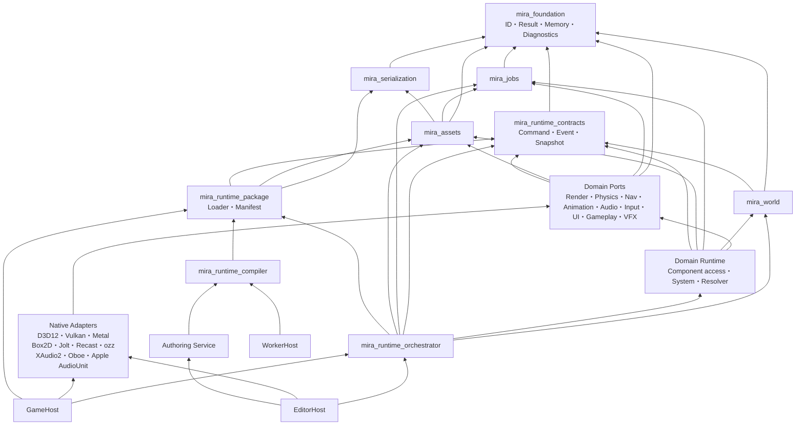
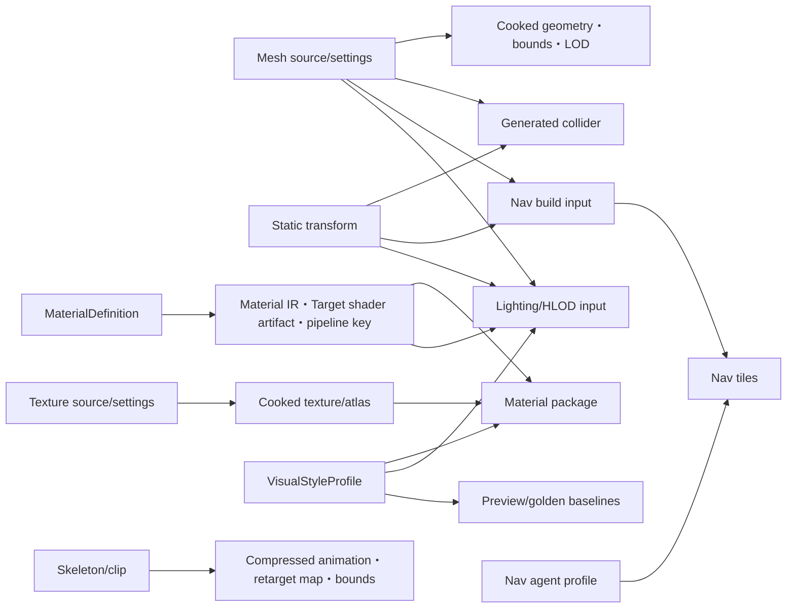

# Miraikanai Engine Runtime連携・寿命・性能規約

- 文書版: 2.2
- 作成日: 2026-07-19
- 最終更新日: 2026-07-20
- 対象: Game Runtime、Editor Play、Asset Runtime、Native Adapter、AI生成構造化データ／C++
- 状態: プロジェクト公式の規範設計レビュー版
- 上位文書: [AIネイティブ独自ゲームエンジン 設計計画書](./2026-07-18-ai-native-game-engine-authoring-design.md)
- Game実装方式: [Miraikanai Engine C++実行コード・構造化ゲームデータ規約](./2026-07-19-cpp-structured-game-data-design.md)
- 基盤規約: [Miraikanai Engine 基盤アーキテクチャ規約](./2026-07-19-engine-foundation-architecture-design.md)
- Memory／Pointer規約: [Miraikanai Engine AI可読Memory／Pointerアーキテクチャ規約](./2026-07-20-ai-readable-memory-pointer-architecture-design.md)
- C++言語・Modules規約: [Miraikanai Engine C++23・Named Modules・`import std`移行規約](./2026-07-20-cpp23-modules-import-std-transition-design.md)
- Authoring規約: [Miraikanai Engine Authoring Model／Project State規約](./2026-07-19-authoring-model-project-state-design.md)
- Native Game規約: [Miraikanai Engine NativeGameModuleアーキテクチャ規約](./2026-07-19-native-game-module-architecture-design.md)
- Renderer／Asset規約: [Rendering／Render Graph](./2026-07-19-rendering-render-graph-architecture-design.md)／[Asset Pipeline／Content Package](./2026-07-19-asset-pipeline-content-packaging-design.md)
- Particle／VFX規約: [Miraikanai Engine 独自Particle／VFX Platformアーキテクチャ規約](./2026-07-20-particle-vfx-architecture-design.md)
- Player I/O規約: [Input](./2026-07-19-input-action-device-architecture-design.md)／[UI・Text](./2026-07-19-ui-text-localization-accessibility-design.md)／[Audio](./2026-07-19-audio-mixer-spatial-architecture-design.md)
- Editor UI Framework規約: [Miraikanai Engine 独自Editor UI Framework／Shellアーキテクチャ規約](./2026-07-20-editor-ui-framework-architecture-design.md)
- Physics Engine規約: [Miraikanai Engine 独自Physics Platform／Dynamicsアーキテクチャ規約](./2026-07-20-physics-engine-architecture-design.md)
- Navigation規約: [Miraikanai Engine 独自Navigation Platformアーキテクチャ規約](./2026-07-20-navigation-platform-architecture-design.md)
- Simulation連携規約: [Physics／Navigation／Animation連携](./2026-07-19-physics-navigation-animation-architecture-design.md)
- 機能範囲: [Miraikanai Engine 2D／3D機能計画](./2026-07-19-2d-3d-capability-plan.md)
- Collision詳細規約: [Miraikanai Engine Collision／Colliderアーキテクチャ規約](./2026-07-19-collision-collider-architecture-design.md)
- モバイル規約: [Miraikanai Engine モバイルPlatformアーキテクチャ規約](./2026-07-19-mobile-platform-architecture-design.md)
- AI実装・保守規約: [Miraikanai Engine AI実装・保守ガバナンス規約](./2026-07-19-ai-engine-development-governance-design.md)
- 実行可能契約規約: [Miraikanai Engine 実行可能契約・Schema・Codegen規約](./2026-07-19-executable-contract-schema-codegen-design.md)
- AI検証規約: [Miraikanai Engine AI検証・評価・来歴規約](./2026-07-19-ai-verification-evaluation-provenance-design.md)

## 1. 結論

Miraikanai EngineのRuntimeは、各Subsystemが互いを直接操作する構造にしない。`RuntimeOrchestrator`だけが固定されたphase順序でSubsystemを呼び出し、Subsystem間の情報交換は、型付きcommand、型付きevent、不変snapshot、version付きAssetだけに限定する。

この設計により、次を同時に成立させる。

- AI、GameplayDefinition、Editor、NativeGameModule（Project C++）がEngine内部pointerを直接操作しない。
- Physics、Navigation、Animation、Rendering、Audio等の外部Library型をEngineの公開契約へ漏らさない。
- 構造変更、非同期結果、Physics event、Asset hot reloadの反映時点が一意になる。
- object、borrow、job、GPU resourceの寿命と無効化条件を機械検査できる。
- CPU／GPU／memory budgetをSubsystem単位で測定し、最適化の成否を数値で判断できる。
- 大量配置、burst生成、敵味方を問わない同時VFXを個数だけで拒否せず、制作意図を保ったboundedなRuntime表現へCookし、統合負荷試験で成立性を証明できる。
- 失敗時に部分的なWorld、部分的なAsset、GPU使用中resourceの解放を公開しない。

外部の公式資料はAPIとLibraryの事実を定める。本書のphase順序、memory配分、queue容量、failure policyは、それらの事実を満たすためにMiraikanai Engineが独自に確定するプロジェクト公式規約である。

## 2. 規範の範囲と優先順位

### 2.1 文書ごとの決定権

| 文書 | 決定する範囲 |
|---|---|
| AIネイティブ設計計画書 | Product目標、AI／人間の制作経路、段階計画、MVP |
| C++実行コード・構造化ゲームデータ規約 | Game実行言語、GameplayDefinition、CookedGameplayPackage、NativeGameModule、AI実装選択 |
| 基盤アーキテクチャ規約 | C++、module、依存、所有権の一般則、Build、directory |
| 本書 | Runtime phase、Subsystem連携、参照無効化、Asset version、memory／performance budget、障害復旧 |
| Particle／VFX規約 | VFX Asset／Graph／Compiler、CPU／GPU execution、VFX lifecycle／Command、VFX固有budget／failure／test |
| Collision／Collider規約 | Body／Collider／Shape／Material／Filter、Query、Contact／Trigger、Cook、Editor／AI操作 |
| 2D／3D機能計画 | 各Capabilityの機能、品質tier、Authoring、表現方式 |
| モバイルPlatform規約 | Android／Apple lifecycle、Adapter、実機memory／performance、package、Store |

重複箇所では、上表でその項目の決定権を持つ文書を適用する。直接矛盾を発見した場合は実装者が片方を暗黙に選ばず、文書修正とADRを先に行う。

### 2.2 用語

- **Authoritative state**: Save、replay、gameplay判定へ影響するRuntime状態。
- **Presentation state**: Rendering、Audio、VFX、非authoritative UI等、再生成可能な表示状態。
- **Structural mutation**: Entity生成／破棄、Component追加／削除、親子構造変更、Runtime Asset layout変更。
- **Boundary**: 構造変更またはversion swapを許可する、明示されたtick／frame上の一点。
- **Handle**: generation検査を持つ非所有参照。
- **Borrow**: scope、phase、epochのいずれかで期限が切れる非所有access。
- **Lease**: 所有Subsystemがobjectまたはversionをretireしないことを、限定scopeで保証するmove-only token。
- **Snapshot**: 作成後に変更されず、consumerが元Worldへ書き戻せない値集合。
- **Scale intent**: Projectが必要とする総配置数、最大同時存在数、生成burst、可視範囲、相互作用範囲、VFX同時性、TargetをGame用語で表したAuthoring要件。
- **Gameplay fidelity floor**: 敵数、Damage、collision、goal、timing等、最適化で黙って弱めてはならない観測可能な最低挙動。
- **Representation plan**: Scale intentをFull Entity、低頻度／休眠state、render instance、HLOD、streaming cell、VFX Artifact等へ変換するCook済み計画。
- **Project official default**: ADRで改定されるまで、CIとReviewが用いる合否値。

### 2.3 対象外

本書は初期製品で次を設計対象外とする。

- 複数machineへ分散するWorld simulation
- rollback multiplayerとcross-platform bitwise determinism
- Runtime中のnative C++ module unload
- AIによる任意Shader、navmesh polygon、Physics native objectの直接生成
- 外部Libraryの内部allocator、solver、codec自体の再実装

### 2.4 Platform適用

本書のphase、typed contract、handle、borrow、Asset promotion、failure原則は`windows_desktop_v1`、`android_mobile_v1`、`apple_mobile_v1`で共通とする。D3D12、XAudio2、Windows Job Object、CNG、QPC等の記述は`windows_desktop_v1`のAdapterまたはReference測定であり、共通Portの唯一実装を意味しない。Android／AppleのOS lifecycle、Vulkan／Metal、Oboe／AudioUnit、mobile memory class、thermal／Store gateはモバイル規約を適用する。

Shipping mobile RuntimeはAI Orchestrator、compiler、hot-code-reload serverを同梱しない。Runtime生成は検証済み構造化dataだけに限定し、共通phaseへ投入する前にmobile policy validationを通す。

## 3. Runtime module依存

### 3.1 依存DAG



矢印は依存元から依存先を示す。`Ports`、`DomainRuntime`、`Adapters`のedgeは各concrete targetへ許可する上限であり、使わない依存を一律linkする意味ではない。CMake configure時に実際のtarget edgeを検査し、循環または未許可edgeを失敗させる。

### 3.2 target責務

| target分類 | 所有するもの | 依存を禁止するもの |
|---|---|---|
| `mira_foundation` | ID、Result、memory resource、clock primitive、diagnostics primitive | World、domain、vendor API |
| `mira_runtime_contracts` | typed command／event、phase ID、snapshot schema、共通value type | domain実装、vendor API、Editor |
| `mira_world` | Runtime entity location、component chunk、StableId対応表 | Renderer、Physics、Nav等の実装 |
| Domain Port | Engine-owned interface、domain data、validator、telemetry schema | World実装、他Domain、他Domain Adapter、vendor型 |
| Domain Runtime | 自Domainのcomponent query、System、resolver、typed command／event生成 | 他Domain target、vendor型、phase外mutation |
| Native Adapter | vendor型との変換、vendor object寿命、conformance test | Runtime World、Authoring schema、AI、他Adapter |
| `mira_runtime_orchestrator` | phase順序、buffer merge、boundary、fault遷移 | vendor型、Editor widget |
| `mira_runtime_package` | versioned binary manifest、loader、Runtime向けschema | Authoring object、Editor、vendor型 |
| Runtime Compiler | 承認Authoring revisionからRuntime packageをcook | live Runtime pointer |
| EditorHost | Authoring Service、Presentation専用Preview Orchestrator、選択Adapterのcomposition | authoritative Play World、NativeGameModule、domain business logic |
| GameHost | Runtime package loader、RuntimeOrchestrator、選択Adapterのcomposition | Authoring Service、Editor |
| WorkerHost | Runtime Compiler、offline Asset／Shader build | live Runtime World、Editor |

RenderingからPhysics、AnimationからNavigation、Gameplay LogicからWorldといった直接呼出しを禁止する。共有が必要な型は`mira_runtime_contracts`へ置くが、単なる再利用を理由に無関係な型を集める`common` moduleにはしない。

各Subsystemは`<domain>_port`、必要なら`<domain>_runtime`、`<domain>_<backend>_adapter`の別CMake targetにする。Domain Runtimeだけが`mira_world`の公開query／lease APIへ依存でき、schema生成された`ComponentAccessManifest`に宣言したread setとwrite setだけを、Orchestratorが許可したphaseで借用する。構造変更はDomain Runtimeからも直接行わず`StructuralCommand`へ変換する。AdapterはWorldへlinkせず、Portが渡した値、handle、owned bufferだけを扱う。Rendering、Audio、VFXはWorld leaseを持たず`RenderSnapshot`／Presentation commandだけを受け取る。GameplayDefinition evaluatorは`gameplay_runtime`内のC++ Systemとしてtyped Capability snapshot／commandを使用し、汎用VM Adapterを持たない。CMake edge検査に加え、manifestと実際のquery／write registrationが一致することをcode generation testで検査する。

### 3.3 Subsystem間の唯一の通信方式

| 方式 | 用途 | 書込可能性 | 寿命 |
|---|---|---|---|
| Typed command | 将来phaseで状態変更を依頼 | producerは追記だけ | consume phaseまで |
| Typed event | 完了した事実を通知 | immutable | buffer sealから宣言delivery phase終了まで。次tick配送を許可 |
| Immutable snapshot | 大量のread-only入力 | consumerから変更不可 | publishからlease終了まで |
| Versioned Asset handle | immutable payload参照 | swapは所有Subsystemだけ | retire条件成立まで |
| Query result | 非同期計算結果 | immutable、version検査必須 | integration phaseまで |

公開eventへpointer、reference、`span`、vendor ID、COM pointer、言語VM stack indexを格納しない。可変長payloadはowned bounded blobまたはStableIdで表す。

## 4. Process、Project、Playのlifecycle

### 4.1 Process状態

```text
Boot
  -> ProjectOpening
  -> Authoring
  -> PlayPreparing
  -> Playing
  -> PlayStopping
  -> Authoring
  -> ProjectClosing
  -> Shutdown
```

回復不能な状態は`Faulted`へ遷移する。`Faulted`から同じPlay sessionへ復帰しない。Editor processを継続できる場合は、journal保全後にProjectを閉じた`Authoring`相当のsafe shellへ戻す。

Shipping GameHostはこのProcess状態と別に`ApplicationState = Starting | Active | Inactive | Suspended | SurfaceUnavailable | Terminating`を持つ。OS callbackはWorldを直接変更せず、bounded lifecycle eventをmain threadへ渡す。Android process killとApple termination通知の不達、surface／drawableだけの消失を正常系として扱い、WorldとGPU surfaceの寿命を分離する。Saveは終了通知だけに依存せずcheckpointとinactive／suspend遷移でcommitする。詳細な遷移、surface generation、background禁止範囲はモバイル規約7節に従う。

### 4.2 Authoring WorldとRuntime World

- `PlayPreparing`は、Commit済み`project_revision`を一つ固定し、そのrevisionからRuntime packageとRuntime Worldを生成する。
- EditorHostは同時に一つのchild GameHostだけを管理し、そのGameHostだけが一つのauthoritative Play sessionとRuntime Worldを所有する。EditorHost内のMaterial／Asset preview worldはPresentation専用の隔離Worldであり、NativeGameModuleをloadせず、Save／replay／gameplay eventへ参加しない。
- Runtime WorldはAuthoring object、Editor hierarchy、undo bufferとpointerを共有しない。
- Play中のAuthoring変更は新しいrevisionとして保存できるが、schemaに`live_edit_policy = restart_play | next_tick | next_render_frame`が明示され、対応typed commandを持つfield以外は実行中Worldへ自動反映しない。fieldの既定値は`restart_play`、`next_tick`の適用点は`T00`、`next_render_frame`の適用点は`R10`に固定する。
- `PlayStopping`ではRuntime Worldを破棄する。Runtime変更をAuthoringへ戻す場合は、値を抽出した`ApplyBackChangeSet`を別Transactionとしてpreview、validate、commitする。
- Runtime handle、Physics ID、GPU handle、GameplayStateStore内部slotを`ApplyBackChangeSet`へ含めない。

### 4.3 object lifetime階層

長い順に次の階層を守る。

```text
Process
  Project
    Authoring Revision / Asset Registry
      Play Session
        Runtime World
          Tick
            Phase
              Job / Callback
        Render Frame [0..2]
          GPU queue submission
```

短い寿命のobjectは長い寿命のobjectを所有しない。長い寿命から短い寿命への参照はhandleまたはleaseとし、破棄順序を逆転させない。

## 5. 60 Hz fixed tickの唯一の実行順序

### 5.1 tick条件

- C1／C2はexactly 60 Hz、`fixed_delta = 1/60 s`。ProfileとReplay headerへ値を保存するが60以外をvalidation errorとし、別rateはC3のADR、全Physics／Animation／Replay fixture改訂なしに追加しない。
- wall-clock蓄積から最大4 stepまでcatch-upし、それ以上は時間をclampしてtelemetryへ記録する。
- simulation tickはGame simulation threadが開始・終了を所有する。
- Workerはimmutable inputから結果またはprivate bufferを作るだけで、Worldへ直接書かない。
- 一つのtickがfaultした場合、そのtickのWorld snapshotをpublishしない。

### 5.2 phase表

| 順序 | Phase ID | 実行内容 | 状態変更 |
|---:|---|---|---|
| 0 | `T00_BoundaryApply` | 前tickで封印したStructural command、互換なAsset／GameplayDefinitionSet swapを適用 | 構造変更を許可 |
| 1 | `T10_InputLatch` | device inputをtick番号付き`InputSnapshot`へ固定 | Input stateだけ |
| 2 | `T20_AsyncIntegrate` | deadline前に完了したNav、streaming、tool結果をversion検査して統合 | 定義済みresult fieldだけ |
| 3 | `T30_PrePhysics` | C++ gameplay、AI behavior、Cook済みrule／ability evaluator | Simulation commandを生成 |
| 4 | `T40_MotionIntent` | root-motion proposal、character motor、kinematic targetを解決 | Physics inputを生成 |
| 5 | `T50_PhysicsStep` | Box2D／Jolt fixed step | Physics Adapter内部だけ |
| 6 | `T60_PhysicsIntegrate` | native eventをcopy／normalizeし、dynamic transformをWorldへwrite-back | Physics所有fieldだけ |
| 7 | `T70_PostPhysics` | contact／trigger event配送、damage、quest、Cook済みpost-physics rule | 非構造fieldとcommand生成 |
| 8 | `T80_AnimationFinalize` | authoritative transformからblend、IK、pose、boundsを確定 | Animation stateだけ |
| 9 | `T90_PresentationBuild` | Audio、VFX、UI、camera向けevent batchを作成 | Presentation bufferだけ |
| 10 | `T100_ReplayCheckpoint` | input、accepted async result、state hash、必要checkpointを記録 | Replay streamだけ |
| 11 | `T110_Publish` | 次tick commandを封印し、不変`RenderSnapshot`をpublish | snapshot publishだけ |

`TickPhaseId`のserialized値は表の順序そのもの、すなわち`T00=0x0000`から`T110=0x000b`に固定する。`RuntimeMessageHeader.producer_phase_id`ではrender phaseを`R00=0x0100`から`R70=0x0107`、外部latch sourceを`InputDevice=0x0200`、`IoCompletion=0x0201`、`AudioCallback=0x0202`、`AssetWorker=0x0203`とする。`0xffff`はinvalid、未登録値はschema validation errorである。

Phaseの追加、削除、順序変更はpublic behavior変更であり、ADR、replay fixture更新、全Domain conformance testを必要とする。

### 5.3 command分類

| 種類 | 例 | 適用時点 |
|---|---|---|
| `StructuralCommand` | create／destroy entity、add／remove component、reparent | 次の`T00` |
| `SimulationCommand<P>` | force、velocity、motor target、gameplay value | 型で宣言したconsume phase。過ぎていれば次tick |
| `PresentationCommand` | sound、visual particle、camera shake、notification | 同tick`T90`または次presentation frame |
| `AuthoringChangeSet` | Scene、GameplayDefinition、Asset設定、C++変更 | Runtime tickでは適用しない |

`SimulationCommand`はcompile-timeで`consume_phase`を持つ。任意phase名や同じSubsystemへの再入呼出しを許可しない。

`PresentationCommand`は`T90`より前にsealされたものだけを同tickの`T90`でconsumeする。`T90`中またはそれ以後に生成されたものは次presentation frameへ送る。

command headerもeventと同じ32 byteの`RuntimeMessageHeader`を持ち、同じ順序でmergeする。各command schemaは`combine_policy = single | sum | min | max | ordered_list`と`conflict_key`を一つ宣言する。`conflict_key`はschema生成の`{type_id, target_id, field_id}`とし、`single`対象への複数commandはconflictとしてtickをfaultする。`sum`はcanonical message順に逐次加算し、`min`／`max`はNaN／Infをvalidationで拒否してから適用し、`ordered_list`はcanonical message順を保持する。暗黙のlast-write-winsと並列reduction順を使わない。

`T00`はsealed Structural command全体のhandle、precondition、conflict、必要slot／chunk容量を先に検査・予約する。create／destroy／add／remove／reparentは、live location tableを変更せず`StructuralMutationPlan`とdestination chunkへ構築し、全command成功後の一つのcommit pointでchunk owner、location table、World epochを公開する。commit前の失敗はstagingだけを破棄し、live Worldを変更しない。予約後のbuild／commit pathはallocationしない。

### 5.4 event順序と非再入性

すべてのcommand／eventはschema generatorが作る次のheaderを持つ。field順、幅、alignmentを変えない。

```text
RuntimeMessageHeader (alignas(8), exactly 32 bytes)
  tick_id:            uint64
  producer_phase_id:  uint16
  type_id:            uint16
  producer_system_id: uint32
  producer_sequence:  uint32
  payload_offset:     uint32
  payload_size:       uint32
  flags:              uint32
```

`flags`はbit 0～7をpriority（0が最低、255が最高）、bit 8をcritical、bit 9～31を0に固定する。`payload_offset`は当該bufferのpayload arena先頭からのbyte offsetである。C++型はstandard-layoutかつtrivially-copyableとし、`sizeof == 32`、`alignof == 8`を`static_assert`する。永続化時はnative paddingを保存せず、fieldごとのcanonical encodingを使う。

最終配送順は`{tick_id, producer_phase_id, producer_system_id, producer_sequence}`の昇順である。`type_id`は1～65,534、`producer_system_id`は1～`2^32-1`とし、0と`type_id=65,535`をinvalid／reservedにする。IDはCapability manifestが割り当て、runtime registration順から生成しない。Cook時に`type_id`と`producer_system_id`の重複を拒否する。

単一threadのproducerはtick開始時にsequenceを0へresetし、追記ごとにincrementする。並列producerはatomic counterを使わず、各private job bufferへcanonicalな`logical_work_id: uint64`と`local_sequence: uint32`を付ける。system seal時に`{logical_work_id, local_sequence}`順でbufferをmergeし、最終`producer_sequence`を0から再採番する。重複`logical_work_id`、重複local sequence、32 bit wrapはauthoritative faultとする。memory address、worker index、completion順、OS thread schedulingを順序keyに使わない。

各event型はcompile-timeの`delivery_phase`を一つ持つ。eventがそのphaseより前に生成された場合は同tick、そのphase中または後に生成された場合は次tickで配送する。event handlerが生成したeventを現在配送中のlistへ挿入しない。これによりcallbackの再入、順序依存、無限event chainを防ぐ。

### 5.5 非同期結果

- Requestは単調増加`request_id: uint64`、`request_tick: uint64`、`deadline_tick: uint64`、owner handle、input revision、対象Asset／Navmesh versionを持つ。authoritative requestのdeadlineはwall-clockではなくtickで表す。
- `T20`開始時にcompletion queueを一度latchし、latch後に到着した結果は次tickへ送る。完了結果は最短でもrequestの次tickの`T20`で、`request_id`昇順に統合する。
- `T20`のtickが`deadline_tick`を超えた結果は`DeadlineExceeded`として破棄する。wall-clock durationは性能診断にだけ使い、accept判定へ使わない。
- owner generation、input revision、target versionのいずれかが一致しなければ結果を破棄し、`stale_result`を計測する。
- cancellation後に完了した結果も破棄する。
- replayは「結果内容とacceptしたtick」を記録する。Replay中は記録済み結果を同tickで注入し、worker完了時刻を再現条件にしない。

Replay digestはSHA-256で統一する。初期値は`SHA256("MIRA_REPLAY_V1\0" || 32 byte build_manifest_hash || project_seed_le)`とする。毎tick、ASCII domain tag `MIRA_REPLAY_TICK_V1\0`、前digest 32 byte、`tick_id_le`、続いてInputSnapshot、accepted async result、canonical authoritative component delta、PhysicsのEngine可視state、persistent GameplayState delta、RNG stateの各sectionを`section_id: uint16`、`byte_length: uint64`、canonical bytesの順に連結してSHA-256を更新する。section内はfield ID順・Entity StableId byte順とする。pointer、padding、Presentation state、worker順序を含めない。Development／Profileは60 tickごとにdomain tag `MIRA_REPLAY_FULL_V1\0`を用いたcanonical full-state SHA-256も記録し、rolling digestとの最初の不一致tickを報告する。

### 5.6 deterministic randomness

Authoritative gameplay乱数は、C++ `std::mt19937`と同じ32 bit Mersenne TwisterをEngine-owned `DeterministicRngV1`として実装し、624個の`uint32` state、`index: uint32`、`draw_count: uint64`をSave／Replayへ明示保存する。parameterは`w=32, n=624, m=397, r=31, a=0x9908b0df, u=11, d=0xffffffff, s=7, b=0x9d2c5680, t=15, c=0xefc60000, l=18, f=1812433253`に固定する。

32 bit seed `z`からの初期化は`state[0]=z`、`state[i]=1812433253 * (state[i-1] xor (state[i-1] >> 30)) + i mod 2^32`を`i=1..623`へ適用し、`index=624`とする。`index==624`では次のtwist式を`i=0..623`へ適用してから`index=0`へresetし、その後に一つの値をtemperする。

```text
y = (state[i] & 0x80000000) | (state[(i + 1) % 624] & 0x7fffffff)
state[i] = state[(i + 397) % 624] xor (y >> 1) xor ((y & 1) ? 0x9908b0df : 0)

x = state[index++]
x ^= x >> 11
x ^= (x << 7)  & 0x9d2c5680
x ^= (x << 15) & 0xefc60000
x ^= x >> 18
```

全演算は`uint32`のmodulo `2^32`で行う。`next_u32()`は上記出力ごとに`draw_count`を1増やす。`uniform_below(bound)`は`bound`を1以上の`uint32`に限定し、`limit = floor(2^32 / bound) * bound`を`uint64`で計算して`x < limit`まで`next_u32()`を引き直し、`x % bound`を返す。`uniform_f32()`は`(next_u32() >> 8) * 2^-24`で`[0,1)`を返す。authoritative codeでは`std::uniform_*`、`std::shuffle`、vendor乱数分布を使わず、Engine APIだけを使う。

- Project seedは`uint64`。
- system stream seedは`SHA256(project_seed_le || producer_system_id_le)`のdigest byte 0～3をlittle-endian `uint32`として読む。
- parallel job seedは`SHA256(system_seed_le || tick_id_le || logical_job_id_le)`のdigest byte 0～3をlittle-endian `uint32`として読む。
- `logical_job_id`はarchetype、chunk、tile等のcanonical work IDであり、worker indexではない。
- system streamを複数threadから共有せず、各jobはlocal streamを持つ。
- RNG draw countとstateをauthoritative state hashへ含める。
- Asset生成のseedはGameSpecへ明示保存し、再cookで同じstreamを使う。
- UUID、session nonce、credential等のsecurity用途には使用せず、`IPlatformCrypto`のOS cryptographic RNGを使う。Windows AdapterはCNGを使用する。

Algorithm変更は`DeterministicRngV2`として別versionを追加し、既存Projectを暗黙に切り替えない。Pre-1.0 migrationはoffline migratorでseedとalgorithm versionを変換する。

## 6. Rendering、Audio、Asset promotionの順序

### 6.1 render frame

`windows_desktop_v1` referenceは3 frames-in-flightとし、`RenderFrameMemory[3]`、transient descriptor領域、submission recordをそれぞれ分離する。Mobileは`mobile_baseline`を2、`mobile_standard`／`mobile_high`を3に固定し、Profile外の値を拒否する。

| 順序 | Render phase | 契約 |
|---:|---|---|
| 0 | `R00_AcquireSnapshot` | 完全にpublish済みの最新`RenderSnapshot`をlease |
| 1 | `R10_PromoteAssets` | interface-compatibleなready Asset versionをframe境界でswap |
| 2 | `R20_ExtractCullLod` | snapshotからvisible set、LOD、material packetを生成 |
| 3 | `R30_CompileRenderGraph` | resource lifetime、alias、barrier、queue依存を確定 |
| 4 | `R40_Record` | workerごとのcommand listへ記録 |
| 5 | `R50_Submit` | Backend queueをsubmission dependencyで接続してsubmit |
| 6 | `R60_Present` | 現在generationのsurfaceへpresent |
| 7 | `R70_Retire` | 全last-use submission完了objectだけを解放・再利用 |

RenderingはRuntime Worldへ書き戻さない。visibility、occlusion history、temporal historyはPresentation stateであり、Save／replay hashへ含めない。

### 6.2 queue同期

- 共通契約は`GpuSubmissionSerial { queue_id, value }`を使い、同じresource byte rangeへ書き込むqueueは同時に一つだけとする。
- queue間のwrite→read、read→write、write→writeは明示dependencyで順序付け、Render GraphのEngine-owned access／stage／layoutをD3D12 Enhanced Barriers、Vulkan barrier／layout、Metal encoder／hazard ruleへcompileする。
- Render Graph外でresource stateを変更できるのは各Graphics Adapterの限定upload／present APIだけである。
- barrierまたはqueue依存を推測で省略しない。Profileで不要と証明されたtransitionも、API上不要であることをRender Graph ruleとして表現する。

`windows_desktop_v1`は次を追加適用する。

- D3D12 AdapterはNuGet `Microsoft.Direct3D.D3D12` 1.619.4、`D3D12SDKVersion=619`を使用し、Enhanced BarriersをHard gateとする。Host packaging、DLL hash、export規約は基盤規約13章へ従う。
- 初期D3D12構成はdirect、compute、copyを各1 queueとし、queueごとに一つの単調増加`uint64` fence timelineを持つ。fence値を巻き戻さず、複数queueから同じfenceをsignalしない。
- state transition、UAV、alias barrierはRender Graph compilerがEnhanced Barrierのsync、access、layoutへcompileし、`ID3D12GraphicsCommandList7::Barrier`だけを発行する。legacy `ResourceBarrier`を発行しない。

Vulkan／Metalのqueue、barrier、drawable、surface generationはモバイル規約10節へ従い、D3D12 fenceまたはresource state enumを共通schemaへ保存しない。

### 6.3 audio

- `T90`が`AudioCommand`をbounded queueへ送る。
- Audio control threadがvoice生成、破棄、routing、stream refillを所有する。
- XAudio2、Oboe、AudioUnit callbackはpreallocated fixed-size completion eventまたはPCM ringだけをnon-blocking queueへ渡す。
- callback内でallocation、file I/O、lock待機、voice破棄、Engine log formatting、Gameplay／AI呼出しを禁止する。
- callback eventはAudio control threadが回収し、必要なgameplay通知は次tickの`T20`へ値として渡す。

### 6.4 Asset promotion

Assetのstaging完了は即時にlive pointerを書き換えない。

- dependency closureごとに単調増加`AssetGenerationId: uint64`を割り当てる。CPU payload、GPU upload、Physics／Nav data、Audio decodeを含む全Domain artifactがreadyになり、検証と必要なGPU submissionが完了するまで`Staging`から`Ready`へ遷移させない。
- Simulationで使うgenerationのactivation pointは`T00`とする。`RenderSnapshot`、Physics／Nav command、Audio commandはlogical `AssetHandle`ではなく、activation時に固定した`AssetVersionHandle`と`AssetGenerationId`を保持する。
- Renderingは`R10`で取得済み`RenderSnapshot`が要求するgeneration全体をleaseする。必要versionが一つでもreadyでなければ新snapshotを部分描画せず、直前の完全なsnapshot／generationを継続して`promotion_wait`を記録する。
- Rendering専用generationは`R10`、Audio専用generationはAudio control block境界でactivationできる。
- consumerは処理途中にlogical `AssetHandle`を再resolveしない。既存consumerは旧generationのleaseを完了できる。
- interfaceまたはstate schemaが非互換ならPlay session中にswapせず、`restart_required`を返す。

ここでいうatomic promotionは、すべてのthreadが同じwall-clock時刻にpointerを交換する意味ではない。一つのconsumer transaction／snapshotがdependency closure内の新旧versionを混在させないことを意味する。

## 7. 状態の書込権限

### 7.1 Transform authority

| object種別 | authoritative writer | 他Subsystemの扱い |
|---|---|---|
| Static entity | `T00`のStructural command | Physics／Nav／Renderは読取・derived data生成 |
| Dynamic rigid body | Physics `T60` | Gameplayはforce／velocity commandだけ |
| Kinematic body | Character motorがtargetを提出、Physicsが解決結果を書く | Animation／Gameplayはresolved transformを読む |
| 非Physics gameplay entity | Gameplay system | Renderはsnapshotだけを読む |
| Skeletal bone pose | Animation `T80` | Physics ragdollが有効なboneだけPhysics inputを合成 |
| UI layout transform | UI layout system | Renderはsnapshotだけを読む |
| Render interpolation transform | Rendering | Presentation専用。Worldへ戻さない |
| GPU particle transform | VFX／GPU | gameplay判定へ利用しない |

同じfieldへ複数Subsystemが書く構成を禁止する。blendが必要な場合は、入力fieldを分け、一つのresolverが最終fieldを所有する。

RagdollではPhysics `T60`が別fieldの`RagdollPoseInput`へbody poseを書き、Animation `T80`がanimation poseとのweight付き解決後に最終`SkeletonPose`を書く。Physics Adapterが最終bone poseへ直接書かない。

一つのEntityへauthoritative `DynamicBody2D`と`DynamicBody3D`を同時付与することをschema validatorで拒否する。Hybrid sceneの見た目は、一方のauthoritative body transformを2D／3D両方のPresentation componentが読む。

### 7.2 root motion

一つのcharacterについて、`root_motion_owner`を次のどちらか一つに固定する。

- `animation`: Animationがdeltaを提案し、Character motorがcollision解決後のtransformを確定する。
- `gameplay_motor`: Gameplay motorが移動を確定し、Animationは速度からposeを合わせる。

`animation` modeでは`T40`がanimation clockの`[time_begin, time_end]`を一度だけ確定し、その区間からroot deltaだけをsampleする。`T80`は同じ区間から最終poseをsampleし、clockを二度advanceしない。`gameplay_motor` modeではroot deltaを0として同じ区間のin-place poseをsampleする。

両方のdeltaを加算しない。mode変更は`T00`でのみ行い、同tick内では不変とする。

### 7.3 Physics event

- Sceneが2D／3D Physicsを同時に有効化する場合、generated Producer Registryは`Physics2DStep`の`producer_system_id`を`Physics3DStep`より小さく固定する。`T50`は2D Worldをstepして内部workerをjoinし、その後3D Worldをstepしてjoinする。Stable ID生成順やthread完了順でこの順を変えず、Libraryのnested waitとworker oversubscriptionを避けるため両Worldを同時実行しない。2D shapeと3D shapeの直接collisionは行わず、両World間のinteractionは`T60`で正規化したEventをGameplayが次tick Commandへ変換する。
- `T60`の統合も同じ`producer_system_id`昇順とし、native callback完了順を使わない。
- native contact callbackではWorldを変更しない。
- Adapterは必要な値をpreallocated thread-local bufferへcopyする。
- `T60`でEngine StableId／handleへ変換し、generationを検査してからnormalizeする。
- body pair、shape slot、Contact／Trigger／Hit payload、event kind、binary32正規化、canonical sortはCollision詳細規約10.1～10.2節を正本とする。Gameplay payloadはBackend間で意味が一致しないsolver impulseではなく`approach_speed_mps`を持つ。
- 最終eventはCollision詳細規約のcanonical key順にsortし、その順に`producer_sequence`を割り当てる。native callback thread、callback arrival、vendor event array順を保持しない。
- body／shape破棄後に無効となったnative IDは公開eventへ出さない。
- contact eventを受けたEntityの破棄は次tick`T00`となる。

### 7.4 Navigation

- NavigationのProfile、Backend、Artifact、query schema／status、capacity、AI／Editor、Qualificationは独自Navigation Platform規約を正本とし、本節はRuntime phase、lease、queue、promotionだけを所有する。
- Navmeshはimmutable `NavMeshVersion`として公開する。
- tile rebuildはstaging versionへ行い、依存tile集合の検証後に`T00`でversionをswapする。
- workerごとに専用`NavQueryLease`を割り当て、同じDetour query objectを同時共有しない。
- resultはrequest時のNavmesh versionを持ち、swap後の旧resultを破棄する。
- dynamic obstacle更新は前tickの`T60`完了後にpublishしたPhysics transform snapshotから`T20`で取り込み、Physics objectを直接参照しない。同tick`T50`の結果は次tickまでNav obstacleへ反映しない。
- C1のDetour queryは1 lease当たりnode pool 4,096、corridor polygon ref 2,048、straight-path point 256を上限とする。通常探索がgoal前で終わり、budget超過がなく2 polygon以上前進した場合だけ`PartialPath`となり、requestが`allow_partial=true`のときだけ利用できる。`DT_OUT_OF_NODES`、corridor／point buffer不足、Engine iteration cap到達は`SearchBudgetExceeded`とし、diagnostic用best-effort pathを添付できても成功扱いにせず、配列を暗黙truncateしない。

### 7.5 gameplayとPresentationの分離

Audio、GPU VFX、camera shake、render occlusion結果をauthoritative判定へ使用しない。gameplayへ必要なexplosion、damage volume、visibility ruleはPhysics／World側の独立componentとして表現し、VFXはその結果を購読する。

## 8. Runtime data storage

### 8.1 公式ECS基準

Runtime Worldの標準storageは独自のarchetype chunk方式とする。

- chunk payloadは16 KiB、先頭64 byte alignment。
- ComponentごとのSoA列をchunk内に配置する。
- Entity location tableは`EntityHandle -> {archetype_id, chunk_id, row, generation}`を保持する。
- create、destroy、add／remove componentはStructural commandとして`T00`だけで実行する。
- chunk移動時にComponent addressは無効になる。
- iteration順序は`archetype_id`、`chunk_id`、rowの昇順を規範順序とする。

16 KiBは初期公式値であり、8／16／32 KiBのbenchmarkとcache／fragmentation計測を伴うADRでだけ変更できる。

基準benchmarkはReference CPUのProfile Build、固定seedで各caseを60秒warm-up後600 tick測定する。

| Case | Dataset／処理 | 必須metric |
|---|---|---|
| Hot scan | 250,000 entity、32 byte＋16 byte＋4 byteの3列を全件readし、先頭2列をwrite | tick P50／P95、L1／LLC miss、memory bandwidth |
| Structural churn | 100,000 entity、16 archetype、毎tick5,000 entityを決定論的にadd／remove移動 | `T00` P50／P95、copy bytes、allocation count |
| Sparse query | 200,000 entity、64 archetype中8 archetypeだけが3列queryへ一致 | query P50／P95、visited／matched row、branch miss |
| Mixed lifetime | 50,000 create＋50,000 destroyを60 tick反復し、generation検査を同時実行 | P95、peak bytes、retired slot、fragmentation |

この表のfragmentationは`(committed chunk payload bytes - live component bytes) / committed chunk payload bytes`、memory値はMiB=`2^20` bytes、P95は全測定tickを昇順にしてnearest-rank `ceil(0.95 × N)`番目と定義する。

8／16／32 KiBは同一binary内のtemplate specialization、同一入力順、同一thread数で比較する。16 KiBから変更できる条件は、全correctness test合格に加え、少なくとも二caseでP95を10%以上改善し、いずれのcaseもP95とpeak memoryを5%超悪化させないこととする。

### 8.2 hot／cold分離

- 頻繁に同時走査するscalar／small vectorをhot componentへ置く。
- debug name、editor metadata、長い文字列、可変長配列はcold tableまたはAsset blobへ置く。
- 256 byteを超えるComponent、可変長data、non-trivially relocatable objectをchunkへ直接置かず、domain-owned typed handleを格納する。
- `StableId`はsave／authoring対応が必要なEntityのmapping tableへ一度保持し、各hot componentへ重複させない。
- Entityごとのvirtual `Update()`と個別heap objectを禁止する。

Domain内部で純粋SoA、sparse set、poolが優れる場合は、公開World契約を変えずにprivate storageとして採用できる。採用条件は対象DomainのReference sceneでP95を10%以上またはpeak memoryを15%以上改善し、もう一方とload timeを5%超悪化させず、上表の該当synthetic caseでも回帰しないことである。ADRへ入力fixture、archetype基準との比較、memory増減、iteration／mutation P95を記録する。

### 8.3 queryとborrow

World queryは`ReadLease<Component...>`または`WriteLease<Component...>`を返す。

- leaseはmove-onlyで、生成phaseとWorld epochを保持する。
- `WriteLease`の排他単位は`{component_type_id, chunk_id, half-open row range}`であり、重なる範囲は同時に一ownerだけが持つ。schedulerが`archetype_id`、`chunk_id`、row順に重ならない範囲を割り当てた場合だけ並列writeを許可する。
- Structural mutation、phase終了、tick終了のいずれかでepochが変わる。
- Developmentではaccessごとにepochとthread affinityを検査する。
- lease、span、referenceをmember、event、job capture、coroutine stateへ保存しない。

### 8.4 大量配置・大量生成のRepresentation Plan

大量制作のSourceを、Scene内に同じ重さのEntityを列挙したものとしてRuntimeへ直送しない。AI／人間は`RuntimeScaleIntentV1`へ少なくとも次を記録し、Runtime CompilerがTarget別`RuntimeRepresentationPlanV1`へ解決する。

```text
experience_role
total_authored_count
peak_live_count
peak_spawn_per_tick
peak_visible_count
interaction_radius
visibility_radius
simultaneous_vfx_envelope
gameplay_fidelity_floor
target_profile_set
```

`experience_role`は`authoritative_actor | interactive_prop | decorative_instance | presentation_effect`のclosed enumとする。自由文字列の「軽量」「背景扱い」で権限を下げない。

| Sourceの意味 | 許可するRuntime表現 | 禁止する変換 |
|---|---|---|
| Authoritative actor | Full Entity、契約済みsimulation LOD、休眠state record、streaming cell | 敵数、HP、Damage、collision、goal参加、入力への応答を黙って削る |
| Interactive prop | Full Entity、休眠state record、partition単位activate | interaction可能範囲内のrender-only化、mutable Physics objectのstatic batch化 |
| Decorative instance | Render instance、spatial batch、HLOD、streaming cell | 個別Gameplay eventを持つobjectとの意味混同 |
| Presentation effect | VFX Artifact、aggregate emitter、quality variant、距離／画面影響度culling | authoritative Gameplay state、Damage、AI perceptionの代用 |

Runtime Compilerは次の順にRepresentation Planを作る。

1. 同一Asset／Material／mobility／interaction契約を分類する。
2. Gameplay fidelity floorを満たす個体だけにauthoritative stateを割り当てる。「遠距離だから敵を消す」のではなく、Projectが宣言したsimulation LOD contractがある場合だけFull Entityと休眠state間を遷移させる。
3. decorative dataをspatial cell、instance batch、HLODへCookし、総配置数ではなく最大resident／visible working setをboundedにする。
4. Structural create／destroyを`T00`の事前予約済みbatchへまとめ、stable poolを持つDomainではslotをPlay開始またはloading境界でreserveする。poolはlifecycle最適化であり、Gameplay上の最大同時数を下げる理由にしない。
5. VFXはParticle／VFX規約のCPU／GPU Artifact、aggregate Event、instance pool、overdraw／spawn budgetへ解決する。
6. Target別cost estimateとProject固有の統合負荷traceを生成し、14.6節の実測Gateへ渡す。

総配置数または生成要求が既定fixtureを超えること自体はSource authoringの拒否理由にしない。Sourceはprocedural descriptor、recipe、spatial partition等のbounded表現で保存できる。ただし、現在Targetでbounded working set、queue、memory、frame deadlineを満たすRepresentation Planが得られないProjectを、Play可能またはShipping可能と偽ってはならない。

Presentation品質だけのLOD、instance化、HLOD、culling、VFX quality variantは、Style契約とvisual diffを満たす場合に自動適用できる。敵数、味方数、Damage、collision、navigation、goal、spawn timing等のGameplay fidelity floorを変える案は`GameplayScaleChangeProposalV1`としてBefore／After、理由、Target影響を示し、人間承認後の別ChangeSetにする。

## 9. ID、pointer、borrow、leaseの寿命

### 9.1 runtime handle

`EntityHandle`、`AssetHandle<T>`、`AssetVersionHandle<T>`、`ResourceHandle<T>`、`VoiceHandle`等はすべてtypedな`index32 + generation32`とする。`AssetHandle<T>`はlogical Asset slot table、`AssetVersionHandle<T>`はimmutable payload version tableの別slotを参照し、同じindex空間を共有しない。

- `index=0`、`generation=0`、64 bit値0はinvalidとし、valid indexとgenerationは1から開始する。
- 比較／diagnostic用packed値は`(uint64(generation) << 32) | index`、serializationは`index: uint32`、`generation: uint32`の順のlittle-endianとする。
- slot再利用時にincrementする。
- wrapするslotは永久retireする。
- index空間を使い切った場合は`HandleSpaceExhausted`で生成を拒否し、既存slotを上書きしない。
- handleはobjectを所有せず、保存dataへ書かない。
- resolve失敗は`InvalidHandle`であり、null objectへ暗黙変換しない。
- Developmentはowner、作成tick、破棄tickをdiagnostic tableへ保持する。

| Handle | resolveを許可するowner／context | cross-threadの渡し方 |
|---|---|---|
| `EntityHandle` | Game simulation threadの現在phase | Workerへはhandle＋immutable snapshot。WorkerはWorldへresolveしない |
| `AssetHandle`／`AssetVersionHandle` | Asset Registry。成功時に`AssetReadLease`を返す | typed handleを値渡しし、利用threadでlease取得 |
| `ResourceHandle` | Render record／submission context | immutable render packet内のhandle。native pointerは渡さない |
| `PhysicsBodyHandle` | Physics Adapterの`T40`～`T60` | Physics command／copied eventだけ |
| `VoiceHandle` | Audio control thread | `AudioCommand`だけ |

owner外から直接slot tableを読むAPIを公開しない。

公開APIのhandle、lease、viewはMemory／Pointer規約の`PointerContractV1`を持つ。resolveはowner context内でhandle kindごとの`Result<ReadLease<T>>`または`Result<ImmutableView<T>>`を返し、null object、native pointer、unchecked referenceへ暗黙変換しない。Project C++とAI生成C++はslot table layout、generation counter、owner registryへ到達しない。

### 9.2 borrow無効化表

| borrow | 有効範囲 | 即時無効化条件 |
|---|---|---|
| Component lease | 現在phase | Structural mutation、phase終了、World破棄 |
| `FrameMemory` span | 現在CPU frame／全consumer job完了まで | frame arena reset |
| `RenderFrameMemory` span | 対応frame slot | slotの全GPU submission完了後のreset |
| Scratch span | 現在scope／job | scope終了、job完了 |
| Physics native view | Adapter callback内 | callback return、step終了 |
| Nav query temporary | `NavQueryLease` scope | lease返却、Navmesh version retire |
| Audio callback buffer | callback内 | callback return |
| Asset payload lease | lease scope | lease release後。version swap自体では既存leaseはretire待ち |

「実際にはまだ生きていることが多い」は寿命保証にならない。表より長く保持する必要がある場合は、値をcopyするかStable handleを渡して利用時に再resolveする。

### 9.3 job capture

Job packetに許可するのは次だけである。

- owned value
- immutable snapshot
- generation handle
- Asset version handle
- cancellation token
- job専用memory resource

World pointer、Component reference、borrowed span、GameplayStateStore内部pointer、native Physics body pointer、D3D12／Vulkan／Metal resource pointerをcaptureしない。Job開始時とcompletion統合時の二回、handleとversionを検査する。

Contract compilerは`PointerContractV1.job_capturable`をJob packet schemaとC++ AST scanへ投影する。fieldが未登録、またはborrow／lease／writer／scratch blockを含むpacketはBuild時に拒否し、AIがcopy可否を推測しない。

### 9.4 Asset version

Asset Registryがすべてのpayload versionを単一所有する。`shared_ptr`でAsset所有権を分散させない。

```text
AssetHandle<T>          logical slotへの非所有参照
AssetVersionHandle<T>   immutable payload versionへの非所有参照
AssetReadLease<T>       scope中のretireを防ぐmove-only lease
AssetGenerationId       dependency closureを一括識別するuint64
```

旧versionは次をすべて満たした時だけ解放する。

1. live logical slotから参照されていない。
2. CPU `AssetReadLease`数が0。
3. 利用した全GPU queueのlast-use `GpuSubmissionSerial`が完了。
4. Audio／Physics／Nav Adapterのdomain leaseが0。
5. build／debug captureがpinしていない。

### 9.5 GPU resource

- EngineのGPU resource wrapperはmove-onlyで、backend allocationとnative resourceを一体所有する。
- Descriptor／binding handleはresourceを所有しない。
- command recording時にresource versionとdescriptor rangeをsubmission recordへ登録する。
- destroy要求は`RetireRecord`を作るだけで、全`GpuSubmissionSerial`完了までnative object、heap range、descriptor／binding rangeを解放しない。
- alias resourceはRender Graphが非重複lifetimeを証明し、alias barrierと最初の完全初期化を生成した場合だけ許可する。
- D3D12MA、VMA、`MTLHeap`は`IGpuAllocator` Adapter内だけで使い、vendor allocation型を公開しない。
- D3D12MA allocatorはdeviceごとに一つとし、通常の内部同期を有効にする。`SINGLETHREADED` flagを使用しない。
- D3D12MA `VirtualBlock`を共有する場合はEngine側mutexまたは単一thread ownerを必須とする。
- VMA allocatorもVulkan deviceごとに一つ、default thread safety有効とし、loading boundary以外でdefragmentationしない。Metalはheapとmemoryless resourceをmobile budgetへ計上する。

### 9.6 Physics、Animation、Gameplay、Audio integration

| Adapter | owner | 公開してよいもの | 禁止事項 |
|---|---|---|---|
| Box2D | Game simulation thread、step内部worker | Engine handleへ変換した値event | `b2BodyId`等をWorld／GameplayDefinitionへ保存、callback中World変更 |
| Jolt | Physics Adapter、Jolt lock contract | Engine handle、copied contact data | unlocked body pointer保持、contact callback中Physics変更 |
| Recast／Detour | immutable mesh version、worker別query lease | path point、status、version | shared mutable query object、polygon refの永続保存 |
| ozz-animation | immutable skeleton／clipはAsset Registry、contextはinstance | copied pose／bounds／root-motion delta | instance contextの同時write |
| XAudio2 | Audio control thread | VoiceHandle、copied completion event | callback内block／allocation／DestroyVoice |
| Oboe | Audio control thread＋audio callback | VoiceHandle、preallocated PCM／completion | callback内block／allocation／JNI／log |
| Apple AudioUnit | Audio control thread＋audio callback | VoiceHandle、preallocated PCM／route event | callback内block／allocation／UIKit／log |

Jolt `BodyID`は再利用・無効化され得るため利用時にlock／validityを検査する。複数body lockはJoltのmulti-lock APIを用いて一貫順序を維持する。Physics update完了後にだけ`T60`へ進む。

Jolt 5.6.0はCPU rigid-body機能だけを利用する。`JPH_USE_DX12`、`JPH_USE_VK`、`JPH_USE_MTL`、`JPH_USE_CPU_COMPUTE`をすべて`OFF`にし、追加されたGPU compute／hair simulationをMiraikanaiのRendererへ接続しない。

Joltのstep temporary allocationはPhysics Domain内の32 MiB固定`TempAllocator`をWorldごとに一つ持ち、`PhysicsSystem::Update`完了後に全Jobの終了を確認してresetする。C1 GameHostのactive World上限は独自Physics Platform規約どおり2D一つ、3D一つであり、二つ目の3D TempAllocatorを同じ96 MiBへ暗黙追加しない。枯渇時は一般heapへfallbackせずPhysics stepをfaultする。

GameplayDefinition evaluatorはC++ Runtime Systemであり、VM、bytecode、GC、FFIを持たない。DefinitionはCook時にevent index、flat node table、constant poolへ変換する。任意loop／recursionを禁止し、State Machineは一instance一phase一transition、Behavior TreeはDefinitionごとの`max_node_visits_per_tick`、collection／task／commandはMCDとTarget Profileの上限を必須とする。上限不在またはProfile超過はCook errorである。

Evaluation開始時にimmutable Definition／state view、phase専用command buffer、state-delta journalを作る。World変更はcommand、state変更はdeltaへ記録し、node visit、Capability、state schema、command semantic、wall budgetをすべて満たした場合だけ一transactionとしてsealする。Budget超過時は未seal delta／commandを破棄し、authoritative tickをpublishしない。simulation thread上で0.25 msを超え得るCapabilityはasync requestにする。

ozzのSkeletonとAnimation payloadはimmutable versionとして共有し、`SamplingJob::Context`、local transform output、blend scratchはanimation instanceまたはjobごとに分離する。

## 10. Asset依存、再構築、hot reload

### 10.1 artifact key

すべてのderived artifactは次からcontent-addressed keyを作る。

```text
ArtifactKey = SHA256(
  source_content_hash,
  normalized_import_settings_hash,
  schema_version,
  tool_id,
  tool_version,
  target_platform_profile,
  ordered_dependency_artifact_keys
)
```

timestamp、absolute path、pointer、worker順序をkeyへ含めない。

上記関数は文字列連結ではなく、ASCII domain tag `MIRA_ARTIFACT_V1\0`の後に各引数を`field_id: uint16`、`byte_length: uint64`、canonical bytesの順で格納するtagged tupleである。field IDは上から1～7、`schema_version`は`uint32`、`tool_id`と`tool_version`はNFC UTF-8 stringとする。dependency listは要素数`uint32`に続き、各要素を`dependency_role_id: uint32`、RFC 9562 UUIDのnetwork byte orderによる16 byte StableId、32 byte ArtifactKeyで格納する。未知field ID、重複field、欠落field、末尾byteを拒否する。

永続content hash、source hash、settings hash、artifact keyはすべてSHA-256の32 byte値とし、text表現は64文字lowercase hexadecimalに固定する。Runtimeは`IPlatformCrypto`を使用し、Windows AdapterはCNG、Android／Appleはモバイル規約のPlatform crypto Adapter、Node.js toolは標準`node:crypto`を使用する。同一fixtureで全実装のbyte一致を検査する。

SHA-256へ渡すcanonical byte streamは次に固定する。

- 画像、mesh、audio、Project C++等のopaque source fileは変換前のraw byte列をhashする。GameSpec、World Model、GameplayDefinition、Asset metadata等のschema objectはparseとvalidation後に以下のcanonical encodingをhashする。
- Schema objectはfieldの32 bit numeric ID昇順。
- Integerはschema幅のlittle-endian、boolは`0x00`／`0x01`。
- FloatはIEEE 754 binary32／binary64のlittle-endianとし、`-0`を`+0`へ正規化する。NaN／Infをschema validatorで拒否する。
- StringはUnicode NFCへ正規化したUTF-8とし、byte長を`uint32`で前置する。
- Arrayは順序を保持し、要素数を`uint32`で前置する。
- Mapはcanonical key byte列のunsigned lexicographic順。重複keyを拒否する。
- Optionalはpresence byteの後に値を置く。struct padding、pointer、source pathを含めない。
- `ordered_dependency_artifact_keys`は`dependency_role_id`、dependency StableId、ArtifactKeyの順でsortする。

Schema objectを保存したAuthoring fileの空白やfield記述順はhashへ影響しない。opaque source fileとProject C++ sourceの空白はraw contentの一部なのでhashへ影響する。C++とTypeScriptのcanonical encoderを同じschema fixtureでbyte比較する。

### 10.2 invalidation graph



変更時の規則は次のとおりである。

| 変更 | 必ずinvalidateするもの |
|---|---|
| Mesh source／import settings | cooked geometry、bounds、LOD、生成collider、関連Nav tile、baked lighting／HLOD |
| Static transform | static Physics aggregate、関連Nav tile、lightmap／probe、HLOD。Mesh payload自体は再cookしない |
| Texture | cooked texture／atlas、参照Material package。alpha由来colliderを明示使用する場合はそのcollider |
| MaterialDefinition | Material IR、Target別DXIL／SPIR-V／metallib variant、pipeline key、参照package、baked lighting |
| VisualStyleProfile | Material template解決、Lighting、Camera、Post、VFX、UI、Preview／golden |
| Nav agent profile | 該当agentのNav tile、query cache |
| Skeleton／clip | compressed animation、retarget map、animation bounds |
| GameplayDefinition | CookedGameplayPackage、event index、Capability／State layout／dependency manifest |
| NativeGameModule（Project C++） | 対象module binary、ABI manifest、関連test。Play中hot unloadはしない |

### 10.3 transactional build

1. dependency closureを計算し、一つの`AssetGenerationId`を割り当てる。
2. すべての新artifactをgeneration専用stagingへbuildする。
3. hash、schema、cross-reference、budget、platform compatibility、Domain conformanceを検査する。
4. GPU upload submission、Audio decode、Physics／Nav buildを含むclosure全体のreadinessを確認する。
5. generation manifestを同一volumeのtemporary fileへ保存・検証し、一回のreplaceで`Ready`として公開する。この時点ではlive consumer bindingを変更しない。
6. Simulation、Rendering、Audioは6.4節のboundaryで、generation単位にversion leaseを取得する。
7. 一つでも失敗した場合は旧manifestと旧artifact setをliveのまま維持する。
8. 未参照artifactはgrace periodとpin確認後にgarbage collectする。

部分的に新しいMaterialと古いShader、古いNav tileと新しいlink等をlive setとして公開しない。

### 10.4 hot reload互換性

各runtime Asset compilerは、consumerから見える型、dimension class、semantic、layout、parameter schemaを10.1節のcanonical encodingでserializeし、SHA-256の`RuntimeInterfaceHash`を生成する。同じlogical Assetでhashが一致する場合だけin-place promotion候補とし、一致しなければ`restart_required`とする。

| 対象 | Play中に許可 | 非互換時 |
|---|---|---|
| Texture／mesh payload | `RuntimeInterfaceHash`が一致 | Play restart |
| Material | `ShaderInterfaceHash`と`ParameterSchemaHash`が一致 | Play restart |
| Static collider | staging worldでbuild／query test合格後、`T00`で置換 | 旧collider維持、restart要求 |
| Dynamic／kinematic collider | 不可 | Play restart |
| Navmesh | 完全な新versionを`T00` swap | stale query破棄 |
| GameplayDefinitionSet | `StateLayoutHash`と`CapabilityManifestHash`が一致し、Stable State／node IDを維持 | 旧setとstateを維持してrestart要求 |
| Native C++ extension | 不可 | Host rebuild／restart |

## 11. CPU memory規約

### 11.1 計測境界

本章11.1～11.5の2 GiBは`windows_desktop_v1` reference game runtimeのEngine-controlled CPU allocation budgetである。First-party allocation、allocator hookを持つvendor allocation、mapped Assetのresident charge、thread stack予約を所属Domainへ計上する。GPU heap、OS graphics driver共有memory、別processのAI Orchestrator／compilerは含めず、個別telemetryとする。

Android／Appleは同じMemory Domainと80／90／100%のfailure原則を使うが、絶対値はモバイル規約13節の`mobile_baseline`／`mobile_standard`／`mobile_high`を適用する。Apple unified memoryではGPU allocationもprocess footprintへ現れ得るため、CPUとGPUを単純加算せずprocess、Engine CPU、GPUの三gateを個別に判定する。

Process private working setも必ず記録し、C1 baselineから5%を超える増加をregressionとする。2 GiBのDomain計測とprivate working setを混同しない。

本書のCPU「soft budget」はOSがProcessを即時killしないという意味であり、任意超過を許す意味ではない。100%では`BudgetMemoryResource`がnonessential allocationを拒否し、必須allocationの再試行失敗はfault、CI／Cookはbudget超過で不合格とする。OS Job Objectで強制するtool childのhard commit limitとは区別する。

### 11.2 Windows reference game profile

| Parent domain | Child budget | MiB |
|---|---|---:|
| Core World／Save | ECS・World 128、snapshot／bridge 32、Save／Replay 64、stack／system 32 | 256 |
| Rendering CPU／upload | Render world／extract 48、VFX CPU simulation 32、Shader／Material／PSO metadata 32、descriptor metadata 16、upload staging 96、reserve 32 | 256 |
| Physics／Navigation／Animation | Physics 96、Navigation 64、Animation 64、reserve 32 | 256 |
| Unassigned headroom | ownerなし。通常allocation、cache、Domain貸借へ使用禁止 | 128 |
| Audio | decoded／stream ring 96、voice／control 16、reserve 16 | 128 |
| Asset streaming | compressed cache 256、decode／transcode 256、hot cache 192、dependency metadata 32、reserve 32 | 768 |
| Frame／Job transient | Frame 32、RenderFrame 48（16×3）、Job scratch 40、reserve 8 | 128 |
| Emergency | diagnostics、journal、controlled shutdown専用 | 128 |
| **合計** |  | **2048** |

Unassigned headroom 128 MiBはReference fixture、Before／After、peak memory、allocation count、10分soak、人間Reviewを持つADRでだけDomainへ再配分できる。GameplayDefinitionのunloaded packageはAsset streaming、active immutable definitionとGameplayStateStoreはCore World／Save、evaluation scratchはFrame／Job transientへchargeする。Third-party allocationはAdapterの所属Domainへchargeする。

### 11.3 Editor profile

Editor process groupの初期soft budgetは4 GiBとし、Play Runtimeの2 GiBを含める。C1から`EditorHost`とPreview用`GameHost`を別Processにし、EditorHost＋当該GameHostのgroup aggregateを4 GiBへ収める。各Process内のDomain tagとProcess別telemetryも保持し、C++変更時はGameHostを終了して新binaryで再起動する。AI Orchestrator、DXC、Asset compiler等のtool child processはこの表に含めず、Process別capとgroup telemetryを持つ。

| Domain | MiB |
|---|---:|
| Play Runtime Domains | 2048 |
| Authoring World／undo／revision | 512 |
| Asset import／Derived Data Cache client | 512 |
| UI／preview／thumbnail | 384 |
| AI bridge／schema／diagnostics | 256 |
| Editor reserve | 384 |
| **合計** | **4096** |

Playしていない間もPlay Runtimeの2 GiBを長寿命Authoring cacheへ転用しない。`PlayPreparing`の直前にevictできる一時preview／import bufferだけは最大512 MiBをmode-exclusive loanとして利用でき、Play要求時に同期evictして0へ戻せない場合はPlay開始を`EditorModeLoanOutstanding`で拒否する。Editor reserve 384 MiBのうち128 MiBはjournal、diagnostic、controlled shutdown専用Emergencyで貸さず、残り256 MiBだけを11.4節の期限付き貸借対象とする。

#### 11.3.1 Tool child process group

Editorが起動したAI／compile／import processと全descendantはWindows Job Objectへ割り当て、Editor 4 GiBとは別にtool group全体4,096 MiBのhard commit limitを設定する。親Jobとtool tree別のnested Jobに`JOB_OBJECT_LIMIT_JOB_MEMORY`と`JOB_OBJECT_LIMIT_KILL_ON_JOB_CLOSE`を設定し、breakawayを許可しない。個別reservationと同時実行上限は次に固定する。

| Tool process tree | Soft target | Hard reservation／limit | 同時heavy job |
|---|---:|---:|---:|
| `AiOrchestrator` | 512 MiB | 1,024 MiB | 1 process |
| Asset／Runtime Compiler `WorkerHost` | 1,536 MiB | 2,048 MiB | 1 |
| DXC／Shader Compiler | 512 MiB | 1,024 MiB | 1 |
| Native C++ Build tree | 2,048 MiB | 3,072 MiB | 1 |

Schedulerは実行中treeのhard reservation合計が4,096 MiBを超えるjobを開始せず`ToolMemoryReservationUnavailable`で待機させる。`AiOrchestrator`稼働中はNative Build 3,072 MiB、またはAsset 2,048 MiB＋DXC 1,024 MiBまでを同時許可できる。Native BuildのNinja compile並列数は`min(max(P - 4, 1), 6)`を上限とし、予約内でProcess commitが90%へ達したら新規compile開始を止める。

Job Object hard limit到達、child crash、timeoutでは当該treeを終了し、staging artifactと未Commit AI提案を破棄してEditorを継続する。`AiOrchestrator`はEngine側session recordから新nonceで再接続できるが、未完了responseをCommit済みとして復元しない。外部から起動されたCodex／Claude等のHost processはEngine所有Job Objectへ強制加入させず、本group外として表示する。それでもChangeSet、schema、budget、approvalのCommit gateは同一である。

### 11.4 threshold、貸借、OOM

次の`global 1920 MiB`はactive Play Runtimeの2 GiBからRuntime Emergency 128 MiBを除いた範囲を指す。Editor Authoring partitionも2 GiBのうちEditor Emergency 128 MiBを除く別の1,920 MiB scopeを持ち、Play中に両scopeを横断して貸借しない。非Play時の唯一の例外は11.3節のmode-exclusive loanである。

- 80%: 通常状態へ戻すeviction目標。
- 90%: warning。nonessential cacheのeviction／quality縮小を開始する。
- 100%: Domain cap。nonessential allocationを拒否する。
- Emergency reserveは通常処理、cache拡張、品質維持へ貸さない。
- Unassigned headroomとEmergency reserve以外の未使用Parent budgetは、一つのload jobまたは最大120 frameだけ他Parentへ貸せる。
- 借用bytesは貸出元、借用先、global totalの三つへ記録し、global 1920 MiBを超えない。
- 120 frameを超える借用はbudget設定不良としてCIを失敗させ、暗黙に恒久化しない。
- 必須allocation失敗時はcache eviction後に一度だけretryする。再失敗したWorld／Physics／Render Graphは不整合のまま継続せずfaultする。
- Emergencyからのallocationはfixed diagnostic pathだけに許可し、通常objectのconstructorを呼ばない。

### 11.5 arenaとpool

- `FrameMemory`はthreadごとに所有し、全consumer job完了後にresetする。
- `RenderFrameMemory`はframe slotの全`GpuSubmissionSerial`が完了してからresetする。
- `ScratchMemory`はscope／job終了で一括解放する。
- `PoolMemory`はsize分布とchurnが安定したprivate typeだけに採用する。
- `std::pmr::monotonic_buffer_resource::release()`後の全borrowは無効である。
- Process global default `memory_resource`を変更しない。
- hot pathでupstream fallbackが発生した場合、Developmentはそのframeを性能失敗として記録する。
- hot pathの最終upstreamはbudget failureまたは`null_memory_resource`相当とし、Shippingでも一般heapへ暗黙fallbackしない。
- すべてのallocation siteは`MemoryContractV1`または承認済みVendor Adapter mappingを持ち、Contract欠落をUnassigned Domainへ課金して継続しない。

## 12. GPU memory規約

### 12.1 Windows reference budget

`windows_desktop_v1`のGPU Project budgetは`min(5632 MiB, 0.80 × DXGI Budget)`とする。Android／Appleはモバイル規約13節のGPU working setを使用する。

| Domain | MiB |
|---|---:|
| Texture | 3072 |
| Geometry | 1024 |
| Render target／transient | 1024 |
| Shader／descriptor | 256 |
| Emergency reserve | 256 |
| **合計** | **5632（5.5 GiB）** |

OS budgetが小さい場合は、critical resourceと256 MiB reserveを先に確保し、texture mip、streaming distance、shadow、transient resolutionの順にQuality Profileを下げる。

### 12.2 allocationとbudget

以下は`windows_desktop_v1` D3D12 Adapterへ適用する。VulkanはVMA heap budget、AppleはMetal allocationとprocess footprintを`IGpuAllocator`共通counterへ変換し、mobile thresholdとfailure policyはモバイル規約に従う。

- deviceごとにD3D12MA allocatorを一つ生成する。
- D3D12MAのCPU allocation callbackをRendering CPU Domainへ接続する。D3D12MA自体は内部CPU OOMのgraceful recoveryを保証しないため、callbackがallocationを満たせない場合はpreallocated fatal recordへ`FatalD3D12MaCpuOom`を書き、`RaiseFailFastException`でProcessを終了して`nullptr`をD3D12MAへ返さない。Editorは次回起動時にjournalから回復する。事前のDomain cap、allocator metadata reserve、resource creation rate制限で到達を防ぐ。
- 毎frameのbudget確認にはD3D12MA `GetBudget`とDXGI通知を使う。
- 全allocation統計の走査はProfile capture／diagnostic時だけ実行する。
- Engine wrapperの`GpuAllocationClass::NonEssential`は`D3D12MA_ALLOCATION_FLAG_WITHIN_BUDGET`へ変換し、budget超過を拒否する。
- background threadでのD3D12 resource生成もdriver hitchを起こし得るため、生成時間とmain/render thread stallを必ず計測する。
- resource作成完了を即時live化せず、`R10`でpromotionする。

### 12.3 aliasとdefragmentation

- aliasはRender Graphがlifetime非重複、heap compatibility、barrier、完全初期化を証明する場合だけ許可する。
- Runtime play中に自動defragmentationを行わない。
- defragmentationはEditorまたはloading boundaryで、非alias・移動可能resourceだけを対象にする。
- 一passは最大64 MiBか64 allocationの先に達した方で終了する。
- 対象poolへの新規allocationを一時停止し、copy、submission completion wait、handle swap、旧allocation retireの順で行う。
- pass失敗時はsource allocationを維持し、部分swapを公開しない。

### 12.4 Windows D3D12 device removed

1. 新規Render submitとPlay進行を停止する。
2. DRED有効時はbreadcrumb／page fault、無効時は`GetDeviceRemovedReason`とEngine breadcrumbを取得し、Project revision、直前frame、resource名を関連付ける。
3. すべてのGPU handle generationをinvalidateする。
4. queue、descriptor heap、resource、allocator、deviceを依存の逆順で破棄する。
5. CPU／cooked artifactからdevice、allocator、heap、PSO、resident resourceを再構築する。
6. 完全なframe setを作れた場合だけEditor previewを再開する。
7. 復旧に失敗した場合はAuthoring journalを保存し、通常MiraEditor ShellとはProcess／resource寿命を分離したGPU非依存のWin32 recovery entryへ移る。提供する操作はProject recovery、diagnostic保存、再起動、終了だけとする。Shipping Gameはpreallocated crash recordを書き、interactive sessionではOS-native error dialogを表示して非0 codeで終了する。GPU描画を必要とするerror sceneへ遷移しない。

Android Vulkan device lost、Apple drawable不在／Metal command errorはD3D12 DRED手順を模倣せず、モバイル規約のsurface generationとPlatform診断を使う。surfaceだけの消失はWorld faultにせず再作成し、device／command errorは新規submitを止め、Saveとpreallocated diagnosticを保全して安全終了する。

Device removal後の未完了fenceが進むことを期待して待機し続けない。

## 13. bounded queueとoverflow

### 13.1 初期capacity

capacityは全TargetのC1 reference profileで共通の初期hard limitであり、mobileでも暗黙縮小しない。合計58.9375 MiBを選択memory classのEngine CPU budgetへchargeする。Project Profileが変更する場合はmemory budget、stress test、replay fixtureを再承認する。表のEntry capacityとPayload arenaは、tick／boundary bufferでは一面当たり、Audio ringではring全体の値である。

| Queue／buffer | Entry capacity | Payload arena | Max payload／entry | charge先 | critical reserve |
|---|---:|---:|---:|---|---:|
| Structural command | 16,384 / tick | 2 MiB | 16 KiB | ECS・World | 0 |
| Simulation command総数 | 65,536 / tick | 4 MiB | 16 KiB | ECS・World | 0 |
| Normalized Physics event | 65,536 / tick | 4 MiB | 256 B | Physics | 0 |
| Navigation request／result | 各4,096 / tick | 各8 MiB | 64 KiB | Navigation | 0 |
| Presentation event | 32,768 / tick | 4 MiB | 8 KiB | snapshot／bridge | 1,024 |
| Audio command | 8,192 entries | 1 MiB | 4 KiB | Audio | 512 |
| Audio callback completion | 4,096 entries | 256 KiB | 64 B | Audio | 256 |
| Asset promotion | 1,024 / boundary | 1 MiB | 4 KiB | dependency metadata | 64 |

entry headerは5.4節のexactly 32 byte `RuntimeMessageHeader`とし、可変payloadをoffset＋lengthでbounded arenaへ格納する。tick／boundary bufferはcurrent／nextの二面を起動時に全量予約し、Audio ringは単一bounded ringとする。Navigationだけはrequest面とresult面を一つずつ持ち、各面が4,096 header＋8 MiB arenaである。header＋arenaの予約量はStructural 5.0000 MiB、Simulation 12.0000 MiB、Physics 12.0000 MiB、Navigation 16.2500 MiB、Presentation 10.0000 MiB、Audio command 1.2500 MiB、Audio callback 0.3750 MiB、Asset promotion 2.0625 MiB、合計58.9375 MiBである。すべて64 KiBの整数倍であり、この実commit量を所属Memory Domainへchargeする。次の予約後残量は11.2節のWindows profileだけに適用する: ECS・World 111.0000 MiB、snapshot／bridge 22.0000 MiB、Physics 84.0000 MiB、Navigation 47.7500 MiB、Audio voice／control 14.3750 MiB、dependency metadata 29.9375 MiB。Mobileはaggregate Engine CPU capへ同じqueue量をchargeし、`RenderFrameMemory`はBaseline 32 MiB（16×2）、Standard／High 48 MiB（16×3）とする。

Navigation 64 MiBの内訳はqueue 16.25 MiB、live 2D／3D Nav payload合計36 MiB、query lease pool 4 MiB、TileCache／dynamic obstacle 4 MiB、metadata 3.75 MiBに固定する。staging Nav payloadはReadyまではAsset streamingのdecode／transcode、Ready後はhot cacheへchargeする。`T00` promotion時に新payloadをNavigationへ移し、旧payloadをAsset streaming hot cacheへretagしてlease終了を待つ。retire待ちNav generationは一つだけとし、そのleaseが0になるまで次のNav promotionを延期する。旧payloadが120 frame以内にretireできない場合は11.4節の期限違反としてCIを失敗させ、それ以上のlive promotionを停止する。これによりNav hot reloadのために64 MiBを暗黙超過しない。

critical reserveは表のEntry capacityに含まれ、noncritical producerは使用できない。critical reserveを持つqueueはpayload arenaの末尾1/8、すなわちPresentation 512 KiB、Audio command 128 KiB、Audio callback 32 KiB、Asset promotion 128 KiBもcritical専用とする。entry数、個別payload、arenaのどれか一つでも上限へ達した時点でoverflow policyを適用する。Asset promotionの一entryは一artifactではなく一`AssetGenerationId`を表し、closureを分割しない。

priorityとcritical bitはcommand／event schemaおよびCapability manifestが固定し、AI、GameplayDefinition、Project dataのpayloadから上げられない。criticalを許可するのはEngine-ownedのvoice stop／release、resource retire、controlled shutdown、generation rollbackだけとする。

### 13.2 overflow policy

| 種類 | overflow時 |
|---|---|
| Structural／Simulation／Physics | 当該tickをpublishせず`AuthoritativeQueueOverflow`でPlay sessionをfault |
| Navigation | 新規requestを`QueueFull`で拒否。既受付resultは失わない |
| Presentation | lowest priorityからdropし、drop数を記録。authoritative用途に昇格させない |
| Audio | critical stop／release用reserveを維持し、低priority playをdrop |
| Asset promotion | 残りを次boundaryへ延期。依存closureの一部だけpromoteしない |

Presentation／Audioのdropはpriority昇順、同priorityではcanonical message key降順、すなわち後発messageから行う。Asset generationの延期は`AssetGenerationId`降順、すなわち古いready generationを先に維持する。これらのtie-breakをthread completion順にしない。

Shippingでauthoritative eventを黙ってdropしない。Developmentは容量の80%超をwarning、95%超をperformance gate failureとする。

### 13.3 thread topologyとJob priority

初期GameHostはmain／window-input、Game simulation、Render submission、Audio control、I/O completionを専用threadとし、共有worker poolを一つ持つ。Libraryごとの独立worker poolを作らない。

`windows_desktop_v1`では次を適用する。

- `GetSystemCpuSetInformation`が成功した場合、`Allocated == 0`または`AllocatedToTargetProcess == 1`のCPU Setのうち最大`EfficiencyClass`に属するlogical processor数を`P`とし、`shared_worker_pool_count = clamp(P - 4, 1, 12)`。一時的な`Parked` flagはcapacityから除外せずtelemetryへ記録する。
- CPU Set情報を取得できない場合はactive logical processor数`L`から`shared_worker_pool_count = clamp(L - 4, 1, 12)`。
- workerは`SetThreadSelectedCpuSets`で上記performance CPU Setをsoft affinityとして指定し、選択集合、実行CPU、migrationをtelemetryへ記録する。
- この節で算出した共有pool総数を`shared_worker_pool_count`とする。Physics規約のTarget Profileが固定する`physics_worker_count`はそのpool内でPhysicsへ許可する最大同時slot数であり、別poolのthread数ではない。
- Box2DはEngine worker poolへenqueueし、`workerCount = physics_worker_count`とする。`shared_worker_pool_count < physics_worker_count`ではPlay準備を拒否する。
- JoltはEngine-owned `JobSystem` bridgeを使い、同じworker poolを共有し、同時実行を`physics_worker_count` slotへ制限する。
- GameplayDefinition evaluationはT30／T70のC++ Gameplay Systemが所有する。Workerへ渡す場合はimmutable definition／state snapshotとprivate outputだけにし、World／GameplayStateStoreへ直接writeしない。
- file／network待機をworkerでblockせず、I/O completion threadがowned resultを`T20`へ渡す。

worker計算で差し引く4 logical processorはmain／window-input、Game simulation、Render submission、Audio controlのlatency-sensitive実行余地である。I/O completion threadは通常completion portでblockし、長いCPU処理を行わないため予約数へ加えない。I/O completionで0.25 msを超える処理はworker jobへ移す。

Android／Appleでは起動時のonline logical processor数`L`から`shared_worker_pool_count = clamp(L - 4, 1, 8)`を初期値とし、hard affinityを設定しない。Android ADPF／Performance HintとApple QoSはPlatform Adapterがroleを伝える補助に限定し、Gameplay結果を変えない。`Serious`以上のthermal stateでは新規Streaming／BackgroundTool jobを止め、critical worker数をPlay中に変更しない。

Job priorityは`CriticalSimulation`、`CriticalRender`、`Streaming`、`BackgroundTool`の四段階とする。Critical jobを待っている間に下位priority jobがworkerを占有し続けないよう、長いStreaming／Tool jobは最大0.50 msのcooperative sliceまたは明示yield pointを持つ。

`shared_worker_pool_count`、`physics_worker_count`、Box2D `workerCount`、Jolt job設定はPlay開始時に固定し、Replay headerへdependency versionと共に保存する。Replayは記録値を使用し、現在hardwareが必要thread数を提供できない場合は結果を推測せず`ReplayEnvironmentMismatch`で開始を拒否する。

## 14. 性能budgetと合格条件

### 14.1 Windows reference条件

- Windows 11 25H2 x64、OS build 26200.8875をReference imageとする。Support最小はbuild family 26200。
- 1920×1080、60 Hz
- AMD Ryzen 5 5600（6 core／12 thread、SMT有効）
- 16 GiB DDR4-3200 CL16 dual-channel
- Samsung 970 EVO Plus 1 TB（PCIe 3.0 x4）
- NVIDIA RTX 3060 12 GBとAMD RX 6600 8 GBを同一CPU systemで交換して測定
- NVIDIA RTX 3060はGeForce Game Ready Driver 610.74 WHQL、AMD RX 6600はAdrenalin 26.6.4 WHQL Recommended
- 固定power profile、固定Build manifest
- Windows `High performance` power plan、Game Mode有効、Hardware-accelerated GPU scheduling有効
- VSync／frame limiter無効、tearing許可、Reference Quality Profile固定
- Profile Build。性能runではDREDとGPU-based validationを無効にし、同じBuildの別diagnostic runでDREDを有効にする
- 30秒のscripted sequenceを3回warm-upし、同じ入力traceの120秒runを5回測定し、各runのP95からmedianを採用
- 測定後に同じC1 sceneと入力traceで10分間のsoakを追加

driver package version、DXGIが報告するdriver version、Windows build／UBR、BIOS、motherboard、memory timing、SSD firmware、HAGS状態はbenchmark manifestへ記録する。月次Windows updateまたはGPU driver更新をSupport環境へ採用する前に、同じEngine commit、C1 package、input traceで旧／新baselineを測定し、Enhanced Barriers feature probe、golden image、DRED diagnostic run、120秒×5性能run、10分soakを再合格させる。更新後の数値は別baseline IDとして保存し、旧測定へ上書きしない。上記SKUを交換する場合は旧／新hardwareで同じcommitを測定したbridge baselineとADRを先に作る。

GPU vendor間で絶対値が異なるため、両reference GPUを別baselineとして保持し、片方だけの合格でC2へ昇格しない。

#### 14.1.1 Advanced desktop qualification lane

Portable Rasterの最低Production保証は14.1節のRyzen 5 5600＋RTX 3060／RX 6600から変更しない。GPU-driven、1440p、120 fps、Ray Tracing、Path Tracing、Neural Rendering、Vendor Reconstructionは追加laneで検証し、最低要件へ暗黙昇格させない。

| Lane | CPU／Memory | GPU | 必須測定 |
|---|---|---|---|
| `desktop_advanced_nvidia_v1` | Ryzen 7 7800X3D、32 GiB DDR5-6000 CL30 | GeForce RTX 5070 12 GB | 1440p60、1080p120、DLSS、RT／Neural |
| `desktop_advanced_amd_v1` | 同上 | Radeon RX 9070 16 GB | 1440p60、1080p120、FSR、RT／Neural |
| `desktop_advanced_intel_v1` | 同上 | Intel Arc B580 12 GB | 1440p60、1080p120、XeSS、RT／Neural |

SSDはSamsung 990 PRO 2 TB、Windows power／HAGS／Game Mode／VSync条件は14.1節と同じとする。Renderer Qualification Ownerは、実装計画で各SKUを取得した時点の最新WHQL driverを公式配布元から取得し、installer SHA-256、package version、DXGI version、VBIOS、motherboard BIOSを`AdvancedRendererBaselineV1`へ固定する。値が未記録のlaneを実行済みまたはProduction qualifiedと表示しない。

Advanced Rasterの追加Gateは2560×1440 real 60 fpsと1920×1080 real 120 fpsである。3840×2160 display 60 fpsはQualified Temporal Reconstructionを使用できるが、real frameが60 fps deadlineを満たすことを必要とし、Frame Generationで合格を代用しない。Vendor固有Capabilityは対応するlaneで個別判定し、一Vendorの成功を他Vendorへ一般化しない。

全percentileはwarm-upを除く全sampleを昇順にし、nearest-rank `ceil(p × N)`番目を採る。5 runのmedianは各run値を昇順にした3番目である。CPU timestampはQueryPerformanceCounter、GPU passはD3D12 timestamp queryとqueue frequencyで測り、CPU／GPU相関には`GetClockCalibration`を使用する。

Android／AppleのReference条件はRetail model名ではなくモバイル規約18.3節のCapability Signature laneを使う。30／60 fpsのP95、deadline miss 1%以下、10分run、30分thermal soak、2時間enduranceを実機で測定し、Emulator／Simulator値で代用しない。Platform timestampはmonotonic clockとVulkan／Metal GPU timestampをAdapterが共通nanosecondへ変換し、変換精度とavailabilityをmanifestへ記録する。

`CPU input-to-submit critical path`は、ある`tick_id`の`T10_InputLatch`先頭から、そのtickを含む最初の`RenderSnapshot`をGraphics Adapterへ`R50_Submit`した呼出しのreturnまでのwall durationである。tickが測定run中に一度もsubmitされなければ欠測として除外せずhard failureとする。`GPU frame`は当該snapshotの最初のGPU pass timestampから最終UI／composite pass timestampまでとし、PresentのVSync待機を含めない。

### 14.2 frame budget

次表は60 fps Targetに適用する。`windows_desktop_v1`とmobile 60 fpsは同じ14.00 ms soft／16.67 ms deadlineを使う。

| Metric | Soft target | Hard acceptance |
|---|---:|---:|
| CPU input-to-submit critical path P95 | 14.00 ms | 16.67 ms以下 |
| GPU frame P95 | 14.00 ms | 16.67 ms以下 |
| CPU frame P99.9（10分soak） | 33.33 ms以下 | 50.00 msを超えるframe 0件 |
| GPU frame P99.9（10分soak） | 33.33 ms以下 | 50.00 msを超えるframe 0件 |
| Audio callback P99 | 0.25 ms以下 | 1.00 ms未満、allocation／block 0 |
| main/render threadのAsset promotion slice | 0.50 ms以下 | 1.00 ms以下 |
| Packaged C1 GameHost warm-cache起動→操作可能frame P95 | 5.00 s以下 | 8.00 s以下 |
| C1 Scene reload P95 | 2.00 s以下 | 3.00 s以下 |

`16.67 ms`を常用目標にせず、2.67 ms以上のheadroomを確保する。

Mobile 30 fps TargetはCPU／GPU P95 soft 28.00 ms、deadline 33.33 ms、120 fps optionalは7.00 ms／8.33 msとする。いずれもsimulationは60 Hzを維持し、mobile deadline missはwarm-up後10分で1%以下とする。MobileのSubsystem配分はQuality Profileと実機baselineで管理し、次のdesktop 14.3／14.4表を倍化して自動採用しない。

Warm-cache起動は同じpackageを一度起動して操作可能frame到達後に正常終了し、OSを再起動せず、各runでGameHost Processを新規起動して10回測定する。Scene reloadは同一Processで20回測定する。最初のcold launchも別metricとして記録するが、OS／security scanner cacheを固定できないためC1 hard gateには使わない。

### 14.3 CPU subsystem soft cap

| Critical path group | P95 soft cap |
|---|---:|
| `T00`＋`T10` | 0.50 ms |
| `T20` | 0.25 ms |
| Gameplay Logic | 1.50 ms |
| Motion＋Animation | 1.50 ms |
| Physics | 2.50 ms |
| Nav result integration | 0.25 ms |
| PostPhysics＋Presentation | 0.75 ms |
| Snapshot＋Replay | 0.75 ms |
| Simulation thread小計 | 8.00 ms |
| Render extract＋Render Graph＋submit | 4.00 ms |
| scheduling／sync／OS jitter headroom | 2.00 ms |
| **Critical path soft target** | **14.00 ms** |

Nav pathfinding、Asset decode、Shader compile等のworker jobは上表へ計算時間を隠さず、queue latency、wall time、CPU timeを別metricとして持つ。main thread integrationだけを`T20`へ計上する。

### 14.4 GPU pass soft cap

| Pass group | P95 soft cap |
|---|---:|
| Shadow | 2.00 ms |
| Visibility／Depth | 1.50 ms |
| Opaque／Material／Lighting | 3.00 ms |
| Transparent／VFX | 1.50 ms |
| Atmosphere／Environment | 2.00 ms |
| Post／Exposure | 1.00 ms |
| UI／Composite | 0.50 ms |
| Copy／Queue sync | 0.50 ms |
| Headroom | 2.00 ms |
| **合計** | **14.00 ms** |

2D sceneも同じ上限で測定するが、未使用の3D pass budgetを別機能の無制限な余裕として扱わない。2D専用baselineを保持する。

高度機能の初期incremental soft capを次に固定する。これらは追加予算ではなく、上表のPassを置換または内包する内数である。Profile compilerは同時選択したPassのworst-case合計と2.00 ms headroomが14.00 msへ収まらないProfileを拒否する。

| Advanced pass group | GPU P95 soft cap | 計上先 |
|---|---:|---|
| Temporal Reconstruction／Upscale | 1.50 ms | Post／Exposureを置換 |
| Frame Generation execution | 2.50 ms | base GPU frame外のpresent metricとして別記録 |
| RT Shadow＋Reflection | 2.50 ms | Shadow、Lightingの内数 |
| RTGI／Radiance Cache | 3.00 ms | Lighting、Environmentの内数 |
| Neural Reconstruction／Denoise | 2.00 ms | 対象RT／Post passの内数 |

Frame Generationは`real_fps`と`displayed_fps`を分離し、generated frameをCPU／GPU frame P95、Simulation deadline、Capability gateのsampleへ含めない。base real frameのCPU／GPU P95が16.67 ms以下、10分runのdeadline miss 0、real render rate 60 fps以上の場合だけ有効にできる。

120 fps TargetはCPU／GPU P95 soft 7.00 ms、deadline 8.33 msを使う。Path Tracing Editor Referenceはこのframe budgetを使わず、samples／pixel、収束時間、reference image error、peak GPU memoryを別Gateにする。Runtime Path Tracingは専用Profileが60 fps hard acceptanceへ合格するまでProduction Capabilityにしない。

### 14.5 Capability gate

CapabilityをC2 Productionへ昇格するには、次をすべて満たす。

1. 2Dまたは3Dの対象Reference sceneがある。
2. RTX 3060とRX 6600の両方でCPU／GPU hard acceptanceを満たす。
3. Domain memory、queue、descriptor、Asset promotionのhard limitを超えない。
4. baseline比でframe P95が5%かつ0.2 msを超えて悪化しない。
5. memory peak／allocation countがbaseline比5%を超えて悪化しない。
6. 意図的なbaseline更新にはBefore／After、原因、品質差、人間承認がある。
7. Native Raster CapabilityはTemporal Reconstruction／Frame Generation無効でもhard acceptanceを満たす。
8. Vendor ProviderはSDK／model／driver／署名／license lockとbridge baselineを持つ。
9. 新最適化経路は同一fixtureでP95が5%以上かつ0.20 ms以上改善し、visual／memory／fault regressionがない。

### 14.6 統合密度fixtureと制作Gate

Subsystem単体の最大値を別々のrunで満たしただけでは、大量戦闘の成立証明にしない。各Projectは`RuntimeScaleIntentV1`から、実際に同時発生し得る次の負荷を一つの決定論的`IntegratedScaleFixtureV1`へ生成する。

- resident／visibleなstatic、dynamic、decorative object
- 敵、味方、projectile、interactive propのpeak live数
- 最悪の合法な1 tickおよび1秒spawn／destroy列
- Physics contact、Navigation request、Animation、Gameplay Logicの同時peak
- 敵味方双方のhit、trail、area、projectile、explosion VFXとAudio／Camera presentation
- Camera移動、streaming cell境界、LOD遷移、Asset promotionが重なる区間

fixtureはGame Briefで承認された最大同時性を下回ってはならず、Runtime Compilerが個数を丸めて合格しやすくしてはならない。2D／3D機能計画の組込みfixtureは最低比較線であり、Projectの上限ではない。Project intentが組込みfixtureを超える場合はProject固有fixtureを優先する。

測定は14.1節の120秒×5、10分soak、Target別実機条件を使い、次をすべて満たす。

1. frame、Subsystem、memory、queue、descriptor、VFX overdrawの既存hard gateに合格する。
2. authoritative spawn、Damage、collision、goal eventのdropが0である。
3. `GameplayStateStore`、Replay hash、敵味方の最終countと結果がReference simulationと一致する。
4. Presentation degradationを発生させた場合、drop／LOD／quality切替が規定priorityどおりで、重要なcombat cueの最低可視性を満たす。
5. spawn frame、streaming境界、VFX burstのCPU／GPU P99.9 spikeが14.2節を満たす。

不合格時はSourceを削除せず`OptimizationRequired`にする。AIは、spatial partition、streaming、instance／batch、HLOD、pool予約、hot／cold分離、simulation LOD、aggregate VFX、CPU／GPU VFX、overdraw削減の順に候補を作り、同一fixtureでBefore／Afterを測定する。Presentation-only変更で合格できなければ、Gameplay変更案を自動Commitせず人間へ提示する。Targetを外す判断も人間承認を必要とする。

## 15. failureとrecovery

### 15.1 failure matrix

| Failure | 検出点 | 状態変更 | Recovery／結果 |
|---|---|---|---|
| Invalid／stale handle | resolve | なし | typed error。Development assertion＋履歴 |
| Borrow epoch違反 | access | なし | Development fail-fast、CI failure |
| Authoritative queue overflow | phase seal | tick publishなし | EditorはPlay停止してAuthoringへ戻る。Shippingはlast valid snapshot上のpreallocated fault overlay後にsession終了 |
| Stale async result | `T20` | なし | discard＋telemetry |
| GameplayDefinition step／wall budget超過 | Gameplay transaction seal | 当該state delta／command bufferを破棄、tick publishなし | Editor Play停止、Shipping session fault、Replayへfault記録 |
| Physics Adapter invariant | `T50`／`T60` | tick publishなし | Play session fault |
| Nav no path | query result | なし | typed `NoPath`。faultにしない |
| Asset build failure | staging validation | live set変更なし | 旧version継続、修正診断 |
| Asset promotion非互換 | boundary | live set変更なし | restart required |
| CPU Domain OOM | allocation | 一度だけevict/retry | 必須Domainはsession／job fault |
| GPU budget圧迫 | budget poll／通知 | 段階的Quality縮小 | critical不足ならrender fault |
| GPU resource allocation失敗 | Graphics／allocator Adapter result | live handle生成なし | nonessentialはevict後1回retry、criticalはrender fault |
| D3D12MA内部CPU OOM | allocator callback | 状態継続を保証しない | preallocated fatal record、Process終了、次回Editor起動でjournal回復 |
| Windows D3D12 device removed | submit／present | Play／render停止 | 利用可能なDRED／Engine breadcrumb取得、再構築。失敗時EditorはGPU不要safe shell、ShippingはOS-native error後に終了 |
| Android／Apple surface消失 | lifecycle／present | render停止、World保持 | generationをinvalidateし、新surfaceでsize-dependent resourceだけ再作成 |
| Vulkan device lost／Metal command error | submit completion | 新規submit停止 | Save／diagnostic保全後に安全終了。surface消失と混同しない |
| Mobile memory／thermal critical | Platform signal／budget poll | Quality縮退、download停止 | Save優先。整合性を保てなければ安全終了 |
| Mobile audio interruption／route change | Audio Adapter | voice stateをpause／再構成 | callback外でsession／streamを再構成し、次boundaryで再開 |
| Audio presentation overflow | enqueue | 低priority soundだけdrop | critical command維持、counter |
| Save失敗 | temp write／flush／replace | in-memory state変更なし | target／backup／journalを検証し、最新valid generationへ回復 |
| AI／Editor ChangeSet不正 | validation | Authoring state変更なし | field単位errorと修正案 |
| Scale intentに有効なRepresentation Planがない | Source／Cook validation | Source revision維持、Play／Package promotionなし | `OptimizationRequired`として候補、cost差、未達Gateを提示 |
| 統合密度fixture不合格 | Profile Gate | Qualified Artifact／Package変更なし | 同一fixtureで自動最適化を再測定。Gameplay変更とTarget除外は人間承認 |

### 15.2 GameplayDefinition transaction

Authoritative Gameplay stateはEngine-owned、schema付き`GameplayStateStore`だけに置く。Cooked definitionはimmutableであり、C++ object layout、pointer、call stackをSave／Replay対象の永続状態にしない。

- Evaluation開始時に`GameplayStateStore`のimmutable view、phase専用command buffer、state-delta journalを作る。
- Capability callはWorldを即時変更せずcommand bufferへ、state writeはdelta journalへ記録する。
- Evaluationが正常終了し、node visit、Capability、state schema、command semantic、wall budgetをすべて通過した場合だけ、state deltaとcommand bufferを一つのtransactionとしてsealする。
- tickをまたぐ待機はEngine-owned `GameplayTask {task_id, state_id, wake_tick, bounded_parameters}`として`GameplayStateStore`へ明示し、次の該当event／tickで評価する。Coroutine、yield、任意call stack保存を持たない。
- Budget、forbidden Capability、invalid transition、state schema違反時はstate deltaと未seal commandをすべて破棄する。前phaseですでに適用済みのstateを暗黙rollbackしたように見せない。
- authoritative faultは`{tick_id, definition_instance_id, entrypoint_id, evaluation_sequence, fault_code}`をReplayへ記録する。Replay時は該当Evaluationを実行せず同じfaultを注入する。C2性能試験中のfaultは1件でも不合格とする。

### 15.3 save atomicity

Save formatとrecovery algorithmは全Target共通とし、filesystem操作は`IAtomicFileStore`の`flush_file`、`replace_with_backup`、`flush_directory`へ隔離する。Save serviceだけがtarget／temporary／backupへアクセスし、同時reader／writerを許可しない。`replace_with_backup`成功後はtargetが新generation、既存targetがあった場合は指定backupが旧generation、temporaryが不存在でなければならない。複数directory entryを一命令で更新できないPlatformでは、途中状態をjournalから回復できることを契約とし、三fileの同時atomicityを偽って宣言しない。

Save file headerは72 byteに固定し、8 byte magic `MIRASAV1`、`format_version: uint32=1`、`schema_version: uint32`、`save_generation: uint64`、`payload_length: uint64`、32 byte payload SHA-256、`reserved: uint32=0`、`header_crc32c: uint32`の順にlittle-endianで格納する。header CRC32Cは最後のchecksum fieldを除く先頭68 byteへ適用し、payloadはheader直後から`payload_length` byteちょうどとする。末尾byte、size overflow、hash不一致を拒否する。

append-only save journalは8 byte magic `MIRASVJ1`で開始し、各recordを`record_size: uint32`、`generation: uint64`、`state: uint8`、3 byte zero、10.1節形式のUTF-8 file名、32 byte SHA-256、zero padding、`crc32c: uint32`の順にlittle-endianで格納する。paddingはrecord全体を8 byte倍数にする0～7 byteで、0以外を拒否する。`record_size`は64～65,536の8 byte倍数、file名は1～32,768 byteのbasenameだけとし、separator、drive、`..`を拒否する。CRC32Cはchecksum fieldを除くrecord全体へ、reflected polynomial `0x82F63B78`、initial `0xffffffff`、final XOR `0xffffffff`で計算する。record追記後に`IAtomicFileStore::flush_file`する。状態値は`Begin=1`、`Replaced=2`、`Committed=3`だけを許可する。

1. target、temporary、backupを同一volumeに置き、`Begin`をjournalへflushする。
2. generation固有temporary fileへwriteし、`flush_file`、再読込、length／SHA-256／schema validationを行う。
3. 既存targetがある場合は世代固有の`backup.<old_generation>`を指定して`replace_with_backup`する。初回Saveも同じAdapterのatomic replaceを使う。
4. targetを再openしてlength／hashを検査し、`Replaced`、続いて`Committed`をjournalへflushする。
5. Runtime handle、pointer、native IDをSave schema validationで拒否する。backupは次のgenerationがCommitするまで削除しない。

Windows Adapterは既存targetで`ReplaceFileW`、初回で`MoveFileExW(..., MOVEFILE_WRITE_THROUGH)`、flushで`FlushFileBuffers`を使う。Androidはapp-private internal storageの同一directoryで、旧targetがあれば`rename(target, backup)`→`fsync(directory)`、次に`rename(temporary, target)`→`fsync(directory)`を行う。AppleもApplication Support内の同一手順とし、fileには`fsync`、利用可能な場合は`F_FULLFSYNC`、各rename後はdirectory syncを行う。各rename失敗を無視せずjournalを未Commitのまま保ち、起動時recoveryへ渡す。Symlink、path traversal、別volume置換を全Adapterで拒否する。

起動時はjournalをCRCが正しい最後のrecordまで読む。targetが完全検証できればその最大generation、targetが不正ならbackup、置換途中でtarget／backupが不正ならBegin recordが指すtemporaryの順で検証し、最も新しいvalid generationだけを開く。候補が複数同generationでhash不一致なら自動選択せず`SaveRecoveryConflict`で停止する。突然の電源断に対して単一renameだけを完全durabilityと主張せず、valid hash付きtarget／backup／journalから回復可能であることをcontractとする。

journalが1 MiBまたは1,024 recordの先に達した場合、次のSave commit後に直近2世代の`Committed` chainだけを新journalへ書いてflushし、旧journalを世代付きbackupにして`replace_with_backup`する。起動時はcurrent journalが不正ならjournal backupも同じparserで検証する。

## 16. Observability

### 16.1 共通trace context

次をCPU span、job、event、GPU marker、errorへ共通付与する。

```text
project_revision
play_session_id
world_id
tick_id
phase_id
frame_id
job_id
producer_system_id
asset_version
trace_id
```

Shippingでは個人情報、source path、AI promptを除去するが、budget、fault code、frame／tick相関は残す。

### 16.2 必須counter

- phase／Subsystem CPU P50、P95、P99.9
- GPU pass、queue overlap、barrier、submission wait
- queue current、peak、overflow、drop priority
- handle resolve failure、generation mismatch、slot retire
- borrow epoch violation
- memory current、peak、allocation count、upstream fallback、borrowed bytes
- Asset cache hit、build／promotion latency、stale version、retire待ち
- Physics body／contact／event、Nav request／stale result、Animation instance
- GameplayDefinition evaluation／node visit、Capability call、state transaction、task、memory、budget fault
- Scale intent、Representation別authored／resident／active／visible count、spawn／destroy peak、pool hit／miss、streaming／simulation LOD遷移、Optimization Receipt
- Audio callback P99、queue、underrun
- GPU committed、resident、Platform budget、D3D12MA／VMA／Metal allocation、descriptor／binding使用量
- surface generation、orientation、drawable取得失敗、memory pressure、thermal、frame pacing、audio route／interruption

## 17. Test、sanitizer、CI

### 17.1 必須test

| Test群 | 証明するもの |
|---|---|
| Phase contract | 12 tick phaseと8 render phaseの順序、禁止再入、consume phase、Component read／write set |
| Handle property | generation、slot再利用、wrap retire、random invalid handle |
| Borrow lifetime | structural mutation、phase、tick、arena reset後の無効化 |
| ECS property | archetype移動、iteration順、structural command merge |
| Adapter／Gameplay conformance | Box2D／Jolt event・invalid ID・lock、Recast version、GameplayDefinition bound／state rollback／invalid transition、ozz context、XAudio2／Oboe／AudioUnit callback |
| Asset graph | dependency closure、hash決定性、generation非混在、失敗時旧set維持、boundary promotion |
| GPU lifetime | backend別submission、descriptor／binding非所有、alias barrier、device／surface failure |
| Memory | Domain cap、貸借期限、OOM injection、arena reset、zero-live |
| Replay | input＋async acceptance tickから同一state hash |
| Failure injection | queue overflow、cancel race、GameplayDefinition budget fault、Save write／flush／replace各段階のProcess killとrecovery、hot reload非互換 |
| Performance | 2D／3D Reference scene、Project固有Integrated Scale Fixture、allocation count、queue peak、spawn／streaming／VFX burst spike、10分soak、authoritative drop 0 |
| Mobile lifecycle | suspend／resume、surface再作成、process kill Save recovery、rotation／resize、audio interruption |
| Mobile endurance | physical device memory、30分thermal、2時間endurance、16 KiB／archive package |

### 17.2 sanitizerとrace検証

- WindowsのMSVC／clang-cl CIでAddressSanitizerを実行する。
- LLVM ThreadSanitizerはWindowsを公式support対象としていないため、Windows full Engineへ「TSan済み」と表示しない。
- platform非依存のFoundation、Jobs、Runtime Contracts、Asset graphはLinux Clang CI targetも用意し、ThreadSanitizerを実行する。
- Windows固有部分はthread-affinity assertion、lock-order checker、borrow epoch、randomized stress、別jobのApplication Verifier＋GFlags Full PageHeapで補完する。
- AndroidはHWASan実機jobとShipping候補GWP-ASan、AppleはASan、TSan、Main Thread Checker、Metal validationを分離して実行する。
- DREDはDevelopmentとProfile diagnostic runで有効、Profile performance runとShippingでは無効とする。
- GPU-based validationは小規模Graphics CIで実行し、性能runでは無効にする。

### 17.3 CIの拒否条件

- target依存DAG違反
- `toolchain.lock.json`、CI image、compiler／SDK／dependency／driver baseline manifestのversion、hash、署名不一致
- CX0 Public Header／CX3 Module interfaceへのvendor型流出
- `ComponentAccessManifest`外のWorld query／write registration
- raw owning pointer、明示`new`／`delete`、Asset／Entityの`shared_ptr`
- phase外Structural mutation
- event／command schemaへのpointerまたはunbounded payload
- hot pathの一般heap allocation増加
- Debug Layer error／warning、sanitizer error
- performance／memory／queue hard gate超過
- artifact再現hash不一致
- Android AABのABI／16 KiB alignment／PAD／permission不一致、Apple archive／privacy／entitlement不一致
- Shipping mobile packageまたはdownload chunkへのcompiler、debug server、shader source、実行code、credential混入

## 18. AI生成構造化データ／C++への適用

AIがLevel 0の自然言語指示からGameplayDefinitionまたはC++を選んでも、本書を免除しない。

- GameplayDefinitionはMCDの有限・bounded Capabilityだけを使い、World、Physics、Nav、GPU、Audio native objectへ触れない。
- NativeGameModule（Project C++）は公開Domain Port、Runtime Contract、handle／lease APIだけを利用する。
- AI生成C++が新phase、queue、thread、memory Domain、public dependencyを追加する提案はArchitecture Changeとして人間承認を必要とする。
- performanceを理由にraw pointer、global singleton、vendor型、phase外mutationへ迂回しない。
- AIは大量という要求を固定個数上限へ即時変換せず、総配置、peak live／visible、spawn burst、interaction範囲、敵味方VFX同時性、Gameplay fidelity floorへ分解し、`RuntimeScaleIntentV1`とTarget別Representation Planを提示する。
- AIはPresentation-onlyのinstance／batch／HLOD／streaming／VFX qualityを自動提案できるが、敵味方数、Damage、collision、navigation、goal、spawn timingを下げて性能合格を作らない。これらの変更は`GameplayScaleChangeProposalV1`と人間承認を必須にする。
- AIが「最適化済み」「快適」と表示できるのは、対象Targetの`IntegratedScaleFixtureV1`に最新の合格Receiptがある場合だけである。cost estimateだけの場合は`Predicted`、未達は`OptimizationRequired`と表示する。
- C++が必要かどうかはGameplay Capability Contract、Capability gap、profile、memory、latency、頻度から判断し、AIの主観だけで決めない。必要Budget fieldが存在しなければBlockingとし、同一fixtureを10分×3回測定して最悪P95／peak／deadline missで判定する。
- 構造化実装のP95とpeakが割当Budgetの80%以下かつdeadline miss 0なら維持し、80–100%はCook／index／layout最適化とC++候補を比較し、100%超またはmiss発生時にC++候補を作る。C++化の改善が5%未満または測定Noise内なら構造化実装を維持する。閾値変更はBenchmarkとADRを要する。
- 生成物は同じunit、property、ASan、performance、dependency gateを通過するまでCommitしない。
- Engine coreのR4 SourceもAIが隔離Worktreeへ生成できるが、mainへの自動Promotionは行わず、Domain ownerと独立Reviewerを必須にする。
- Android／AppleのShipping Runtimeでは、AIが生成・取得できるものを検証済み構造化dataへ限定し、C++、managed／native code、shaderの生成、post-install remote download、JIT、dynamic loadを許可しない。Store審査対象base packageのoffline compile済みshaderは通常Buildとして扱う。

## 19. Phase 0へ固定する成果物

Engine feature実装前に次を完成させる。

1. 設計文書Indexに列挙した10規範文書の承認。
2. 基盤規約の`toolchain.lock.json`、固定offline layout、CI image digest、bootstrap照合。
3. `mira_runtime_contracts`のtarget、Domain Port／Runtime／Adapter分離、依存DAG、`ComponentAccessManifest`検査。
4. `TickPhaseId`、`RenderPhaseId`、typed command／event header。
5. generation slot table、`ReadLease`／`WriteLease`、debug epoch。
6. 16 KiB archetype chunkの基準benchmark。
7. Domain memory resource、budget、tracking、failure injection。
8. bounded queueとauthoritative overflow test。
9. Asset artifact key、dependency closure、staging／atomic promotion fixture。
10. Agility SDK 1.619.4のHost export／DLL hash／Enhanced Barriers gate、D3D12 queue別retire record、device-removed test harness。
11. 共通Adapter conformance harnessと、最初の2D sliceで使うBox2D、Grid Navigation、GameplayDefinition cook／transaction、XAudio2 fixture。Jolt、Recast／Detourの32-bit ref capacity／Artifact／query status、ozz fixtureは3D Capability C0開始条件とする。
12. phase／Subsystem telemetry schemaとProfile capture。
13. Windows ASan、Linux portable-module TSan、static analysis CI。
14. Target／Distribution／Lifecycle／Display／Platform Port schemaと、未実装Targetの`UnsupportedTarget` contract test。
15. Android／Apple toolchain profile、Vulkan／Metal submission record、VMA／MTLHeap lifetime conformance plan。
16. Mobile memory／thermal／surface／audio failure fixture、AAB／archive package validator、data-only Runtime AI gate。
17. MCDのRequirement、Type、Operation、State machine、Capability、Policyと、C++／TS／Cooked binary generated projection。
18. `TaskSpecification`、署名済み`TaskAuthorizationEnvelope`、Risk別Gate、Source Worker／Promotion境界。
19. `AiTaskLifecycle`、`ChangeSetCommit`、`SourcePromotion`、`AsyncResultPublish`、`AssetVersionSwap`のTLA+ modelとtransition conformance。
20. Verification／Generation／Review／Promotion Receipt、Requirement Coverage Matrix、SPDX SBOM、SLSA build provenance接続。
21. Provider projection conformance、AI Eval 3 run、External Evidence freshness、Prompt injection／Path／Network／Secret negative fixture。

上記は実装taskの細分化ではなく、実装開始前に満たすcontractの完了条件である。承認後の実装計画書でfile、target、test、順序、milestoneへ分解する。

項目17–21は全RiskのSchema、拒否動作、追跡境界をPhase 0で固定する意味であり、R3–R5機能を同時に公開する意味ではない。A0ではR0–R2に必要なBinding、Gate、Receipt、Modelだけを実行可能にし、Source Promotion、Engine保守、Release provenanceはガバナンス規約のA1–A3を満たすまで`CapabilityNotActivated`とする。

## 20. 公式資料と規範決定の対応

### 20.1 外部事実と本Engineの決定

| 一次資料 | 確認した外部事実 | 本書で固定したMiraikanai規範 |
|---|---|---|
| C++ Core Guidelines | raw pointerは非所有、RAII、単一所有は`unique_ptr`、実在する共有所有だけ`shared_ptr` | Runtime objectはtyped handle、Asset Registry単一所有、borrow epoch |
| C++ `monotonic_buffer_resource` | individual deallocateを回収せず、`release`が全allocationを解放 | Frame／Scratch arenaの一括resetとreset後borrow無効化 |
| C++ `mersenne_twister_engine` | parameterizedな決定論的pseudo-random engineを規定 | Engine-owned `DeterministicRngV1`と明示state serialization |
| NIST SHA-256／Windows CNG | SHA-256は32 byte digestを生成し、CNGがWindows実装を提供 | content、artifact、replay hashをSHA-256へ統一 |
| Direct3D 12 | applicationがresource state、queue同期、resource lifetimeを管理し、Enhanced Barriersはoptional feature queryを必要とする | Enhanced BarriersをHard gateにし、Render Graphだけがbarrier／queue依存を生成し、全queue fence後にretire |
| D3D12 descriptor資料 | descriptorはresource参照寿命を保持しない | descriptorとresourceを別所有し、両方をfence-deferred release |
| D3D12MA | allocationがresourceを保持し、budget、alias、defrag APIとthread safety contractを提供 | 一device一allocator、normal thread safety、bounded loading defrag、vendor型隔離 |
| Box2D | opaque IDはvalidity検査が必要で、eventはstep後にbufferから読め、callbackはworkerで呼ばれ得る | native ID非公開、callbackはcopyだけ、`T60` normalize |
| Jolt 5.6.0 | `BodyID`は無効化され得てlock APIが必要、contact callbackは複数thread／body lock中 | multi-lock利用、callback中変更禁止、step join後に統合。GPU／hair機能は無効 |
| Recast／Detour | queryはNavmeshに対してpath／corridorを計算し、tile変更で参照前提が変わる | immutable Navmesh version、worker別query object、stale result破棄 |
| ozz-animation | runtime dataはimmutable、jobはcaller提供bufferを使い、Sampling Contextを必要とする | immutable Asset共有、instance／job別contextとoutput |
| XAudio2 | callbackは短時間で、disk、block、同期、重い処理を避ける必要がある | callback P99 0.25 ms、preallocated queue、DestroyVoiceはcontrol thread |
| LLVM sanitizers | AddressSanitizerはmemory errorを検出し、ThreadSanitizerの公式platform一覧にWindowsはない | Windows ASan＋race assertion、portable moduleはLinux TSan |
| Windows CPU Sets | `EfficiencyClass`の数値が高いCPU Setほど高速で低電力効率 | 最大classをworker候補にし、専用thread分を4 logical processor予約 |
| Windows Job Objects | process treeへmemory limitと終了時通知を適用できる | Editor-launched tool treeを4 GiB group capと個別reservationで隔離 |
| Windows file API | `ReplaceFileW`はbackup付き置換をまとめて行うがWRITE_THROUGH flagは未support、`MoveFileExW`はWRITE_THROUGHを提供、`FlushFileBuffers`はfile bufferをdeviceへflushする | 同一volume temp、世代付きbackup、append-only journal、各段階kill recovery |
| Windows fail-fast API | `RaiseFailFastException`は通常のexception handlerを迂回してProcessを終了する | graceful recoveryを保証しないD3D12MA内部CPU OOMだけに限定 |
| Windows release情報 | 25H2はbuild 26200で更新提供中、26H1は新規device向けで既存deviceへのin-place updateではない | Support最小を25H2、Reference imageを26200.8875に固定 |
| Android／Apple lifecycle、Vulkan／Metal、Audio、memory API | surface、process、audio route、memory／thermal signalはPlatformごとに異なる | 共通ApplicationState／surface generation／Platform Portへ正規化し、実機gateはモバイル規約に固定 |
| Android／Apple Store code rule | 審査後に任意codeを取得・実行する設計は安全性とStore適合を失う | Shipping Runtime AIを検証済み構造化dataへ限定 |
| NVIDIA／AMD公式driver | RTX 3060向け610.74とRX 6600向け26.6.4がWHQL release | 初期GPU baseline driverを固定し、更新はbridge baseline後だけ採用 |

外部資料がMiraikanaiの12 tick phase、16 KiB chunk、2 GiB配分、queue capacity、14 ms targetを推奨しているわけではない。これらは外部contractを満たし、Reference sceneで検証する本プロジェクトの公式初期値である。

### 20.2 参照一次資料

- [C++ Core Guidelines: Resource management](https://isocpp.github.io/CppCoreGuidelines/CppCoreGuidelines#S-resource)
- [C++ draft: `monotonic_buffer_resource`](https://eel.is/c++draft/mem.res.monotonic.buffer.mem)
- [C++ draft: Random number generation](https://eel.is/c++draft/rand)
- [NIST FIPS 180-4 Secure Hash Standard](https://csrc.nist.gov/pubs/fips/180-4/upd1/final)
- [Microsoft: Creating a Hash with CNG](https://learn.microsoft.com/en-us/windows/win32/seccng/creating-a-hash-with-cng)
- [Windows 11 release information](https://learn.microsoft.com/en-us/windows/release-health/windows11-release-information)
- [NVIDIA GeForce Game Ready Driver 610.74](https://www.nvidia.com/en-us/geforce/news/gfecnt/20267/doom-the-dark-ages-revelations-geforce-game-ready-driver/)
- [AMD Radeon RX 6600 Driver 26.6.4](https://www.amd.com/en/support/downloads/drivers.html/graphics/radeon-rx/radeon-rx-6000-series/amd-radeon-rx-6600.html)
- [Microsoft C++ AddressSanitizer](https://learn.microsoft.com/en-us/cpp/sanitizers/asan?view=msvc-170)
- [LLVM AddressSanitizer](https://clang.llvm.org/docs/AddressSanitizer.html)
- [LLVM ThreadSanitizer supported platforms](https://clang.llvm.org/docs/ThreadSanitizer.html)
- [Direct3D 12: Important changes from Direct3D 11](https://learn.microsoft.com/en-us/windows/win32/direct3d12/important-changes-from-directx-11-to-directx-12)
- [Direct3D 12 multi-engine synchronization](https://learn.microsoft.com/en-us/windows/win32/direct3d12/user-mode-heap-synchronization)
- [Fence-based resource management](https://learn.microsoft.com/en-us/windows/win32/direct3d12/fence-based-resource-management)
- [D3D12 Descriptors Overview](https://learn.microsoft.com/en-us/windows/win32/direct3d12/descriptors-overview)
- [D3D12 Resource Binding Flow of Control](https://learn.microsoft.com/en-us/windows/win32/direct3d12/resource-binding-flow-of-control)
- [D3D12 Resource Barriers](https://learn.microsoft.com/en-us/windows/win32/direct3d12/using-resource-barriers-to-synchronize-resource-states-in-direct3d-12)
- [D3D12 Enhanced Barriers specification](https://microsoft.github.io/DirectX-Specs/d3d/D3D12EnhancedBarriers.html)
- [`D3D12_FEATURE_DATA_D3D12_OPTIONS12`](https://learn.microsoft.com/en-us/windows/win32/api/d3d12/ns-d3d12-d3d12_feature_data_d3d12_options12)
- [Stable DirectX 12 Agility SDK releases](https://devblogs.microsoft.com/directx/directx12agility/)
- [NuGet `Microsoft.Direct3D.D3D12` 1.619.4](https://www.nuget.org/packages/Microsoft.Direct3D.D3D12/1.619.4)
- [Agility SDK setup and exported symbols](https://devblogs.microsoft.com/directx/gettingstarted-dx12agility/)
- [Device Removed Extended Data](https://learn.microsoft.com/en-us/windows/win32/direct3d12/use-dred)
- [D3D12 Residency Starter Library](https://learn.microsoft.com/en-us/samples/microsoft/directx-graphics-samples/d3d12-residency-starter-library-win32/)
- [D3D12MA Quick start and resource ownership](https://gpuopen-librariesandsdks.github.io/D3D12MemoryAllocator/html/quick_start.html)
- [D3D12MA General considerations and thread safety](https://gpuopen-librariesandsdks.github.io/D3D12MemoryAllocator/html/general_considerations.html)
- [D3D12MA Statistics and budget](https://gpuopen-librariesandsdks.github.io/D3D12MemoryAllocator/html/statistics.html)
- [D3D12MA Optimal allocation](https://gpuopen-librariesandsdks.github.io/D3D12MemoryAllocator/html/optimal_allocation.html)
- [D3D12MA Resource aliasing](https://gpuopen-librariesandsdks.github.io/D3D12MemoryAllocator/html/resource_aliasing.html)
- [D3D12MA Defragmentation](https://gpuopen-librariesandsdks.github.io/D3D12MemoryAllocator/html/defragmentation.html)
- [Box2D Documentation](https://box2d.org/documentation/)
- [Box2D Events](https://box2d.org/documentation/group__events.html)
- [Box2D World and callbacks](https://box2d.org/documentation/group__world.html)
- [Jolt Physics 5.6 architecture、body locking、callbacks](https://jrouwe.github.io/JoltPhysicsDocs/5.6.0/)
- [Jolt Physics 5.6.0 release](https://github.com/jrouwe/JoltPhysics/releases/tag/v5.6.0)
- [Jolt Physics documentation archive](https://jrouwe.github.io/JoltPhysicsDocs/)
- [Recast Navigation repository](https://github.com/recastnavigation/recastnavigation)
- [Detour `dtNavMeshQuery`](https://recastnav.com/classdtNavMeshQuery.html)
- [Windows `SYSTEM_CPU_SET_INFORMATION` and `EfficiencyClass`](https://learn.microsoft.com/en-us/windows/win32/api/winnt/ns-winnt-system_cpu_set_information)
- [Windows CPU Sets](https://learn.microsoft.com/en-us/windows/win32/procthread/cpu-sets)
- [Windows Job Objects](https://learn.microsoft.com/en-us/windows/win32/procthread/job-objects)
- [`JOBOBJECT_EXTENDED_LIMIT_INFORMATION`](https://learn.microsoft.com/en-us/windows/win32/api/winnt/ns-winnt-jobobject_extended_limit_information)
- [Windows `FlushFileBuffers`](https://learn.microsoft.com/en-us/windows/win32/api/fileapi/nf-fileapi-flushfilebuffers)
- [Windows `ReplaceFileW`](https://learn.microsoft.com/en-us/windows/win32/api/winbase/nf-winbase-replacefilew)
- [Windows `MoveFileExW`](https://learn.microsoft.com/en-us/windows/win32/api/winbase/nf-winbase-movefileexw)
- [Windows `RaiseFailFastException`](https://learn.microsoft.com/en-us/windows/win32/api/errhandlingapi/nf-errhandlingapi-raisefailfastexception)
- [ozz-animation runtime](https://guillaumeblanc.github.io/ozz-animation/documentation/animation_runtime/)
- [ozz-animation multithread sample](https://guillaumeblanc.github.io/ozz-animation/samples/multithread/)
- [XAudio2 callbacks](https://learn.microsoft.com/en-us/windows/win32/xaudio2/xaudio2-callbacks)
- [XAudio2 introduction](https://learn.microsoft.com/en-us/windows/win32/xaudio2/xaudio2-introduction)
- [モバイルPlatformアーキテクチャ規約の一次資料一覧](./2026-07-19-mobile-platform-architecture-design.md#23-一次資料)

公開Web文書の生成versionと固定tagが一致しない場合、実装のsource of truthはDependency lockに固定したtagのheader、source、同梱documentation、conformance fixtureとする。移動する`main` branchや別versionのWeb文書を根拠に、Adapter contractを暗黙変更しない。

## 21. 未確定事項の扱い

本書には、Phase 0実装を止める未確定の設計選択肢を残さない。数値を将来計測で変更できる箇所も、現時点の合否値、変更手順、変更権限を明記した。

実装中に公式資料と異なる挙動、Reference hardware差、性能未達を発見した場合は、次のいずれかで処理する。

1. 実装bugなら規範を変えず修正する。
2. Dependency差なら固定tagのconformance fixtureを追加する。
3. 数値が不適切なら再現可能なBenchmark、代替値、影響、rollback条件をADRへ記録して本書を改訂する。
4. Product scopeが変わるなら上位計画書から改訂する。

「実装者が適切に判断する」「必要に応じて調整する」だけで終了する項目は認めない。
