# Miraikanai Engine AI可読Capability Portfolio／MVP製品化・将来Roadmap規約

- 文書版: 1.0
- 作成日: 2026-07-20
- 最終更新日: 2026-07-20
- 対象: Offline Single-player MVP製品化、将来の汎用Engine化、不足Capabilityの所有境界、成熟度、着手Gate、AI向け説明
- 状態: プロジェクト公式の規範設計レビュー版
- Product設計: [AIネイティブ独自ゲームエンジン 設計計画書](./2026-07-18-ai-native-game-engine-authoring-design.md)
- 共通機能範囲: [Miraikanai Engine 2D／3D機能計画](./2026-07-19-2d-3d-capability-plan.md)
- 将来機能入口: [Miraikanai Engine Domain Pack／将来Capability規約](./2026-07-19-domain-pack-future-capability-roadmap.md)
- 実行可能契約: [Miraikanai Engine 実行可能契約・Schema・Codegen規約](./2026-07-19-executable-contract-schema-codegen-design.md)
- Project状態: [Miraikanai Engine Authoring Model／Project State規約](./2026-07-19-authoring-model-project-state-design.md)
- Runtime: [Miraikanai Engine Runtime連携・寿命・性能規約](./2026-07-19-runtime-integration-lifetime-performance-design.md)
- Game System／World境界: [AIネイティブ独自ゲームエンジン 設計計画書](./2026-07-18-ai-native-game-engine-authoring-design.md)／[Miraikanai Engine 2D／3D機能計画](./2026-07-19-2d-3d-capability-plan.md)
- Platform: [Windows規約](./2026-07-19-windows-platform-distribution-design.md)／[Mobile規約](./2026-07-19-mobile-platform-architecture-design.md)
- AI権限と検証: [AI実装・保守ガバナンス規約](./2026-07-19-ai-engine-development-governance-design.md)／[AI検証・評価・来歴規約](./2026-07-19-ai-verification-evaluation-provenance-design.md)

## 1. 結論

Miraikanai Engineは、不足機能を一つの巨大な「将来機能一覧」へ置かず、次の二つの時間軸を一つの`CapabilityPortfolioV1`で管理する。

1. **MVP製品化軸**: Windowsを先行し、2D top-down actionと3D compact third-person action arenaを、offline single-player製品として作成、保存、Package、Install、起動、診断、更新判断できる状態へ閉じる。
2. **汎用Engine軸**: Platform Service、Extension、Collaboration、Timeline／Media、Terrain／Foliage、Multiplayer／Online、Advanced Physics／Animation、追加Platform／XR、Mod／UGC／LiveOpsを、独立Capabilityとして段階導入する。

全Capabilityは、製品上の到達点を示す`capability_tier`と、実Artifactで証明済みかを示す`activation_state`を分離する。文書にC2またはC3と書かれていても、`production` ReceiptがないCapabilityをAI、Editor、Build、Projectが利用可能と扱ってはならない。

将来Capabilityは、実装を前倒ししなくても、Coreを後から破壊しやすい境界だけを先に固定する。先行固定するのはOwner、Authority、Source／Derived分離、依存、Security class、AI禁止推論、Entry Gate、Failure policyである。Backend、Provider、Protocol、数値Budgetは実測または正式仕様がない段階で推測固定しない。

## 2. 決定権と対象外

### 2.1 本書が決定するもの

| 主題 | 本書の決定 |
|---|---|
| Portfolio | 不足Capabilityの一意な一覧、目的、優先度、依存、所有文書、実装順 |
| 成熟度 | `capability_tier`と`activation_state`の分離、許可遷移、AI表示規則 |
| MVP製品化 | Engine機能実装だけでなく、clean installからplay、save、diagnosis、packageまでの製品完了条件 |
| 将来境界 | Platform Service、Extension、Collaboration、Timeline／Media、Terrain／Foliage、Networking等の先行契約 |
| AI可読性 | Portfolio schema、Query、Gap説明、禁止推論、Evidence、Diagnostic |
| 詳細化順序 | 個別正式仕様へ進むEntry Gateと、まだEnvelopeに留める条件 |

### 2.2 各文書が引き続き決定するもの

| 主題 | 正本 |
|---|---|
| 2D／3D C0～C3の製品機能とWork Package | 2D／3D機能計画 |
| Genre Pack、Template、AI vocabulary | Domain Pack／将来Capability規約 |
| State owner、Command／Event／Snapshot | Game System規約、Runtime規約 |
| Project Revision、ChangeSet、Undo、Recovery | Authoring Model規約 |
| Package、Patch、DLC、Asset VFS | Asset Pipeline規約 |
| Platform lifecycle、Store package、signing | Windows／Mobile規約 |
| Capability Schema、Codegen、MCP projection | 実行可能契約規約 |
| Risk、Approval、Promotion、Receipt | AIガバナンス／検証規約 |

個別正式仕様は本書のCapability identity、tier、Entry Gateを無断で変更しない。本書はSubsystem内部API、Backend algorithm、Shader、Solver、Codec、Transportを決めない。

### 2.3 対象外

- 有名EngineのAPI名、Class hierarchy、Project形式、Plugin ABIの模倣。
- すべての将来Capabilityを同時に実装または同時にProduction化する計画。
- 未選定Provider、Store、Backend、Hardware、Protocolの仮IDや仮Default。
- Offline MVPへAccount、Network、広告、課金、Cloud依存を持ち込むこと。
- Capability一覧を理由に空Module、空Directory、placeholder APIをPhase 0へ作ること。
- AIが「一般的なEngineならある」という理由だけで未Active Capabilityを生成、近似、Commitすること。

## 3. 有名Engine比較から採用する原則

外部EngineはCoverageと責務分離のEvidenceとして参照し、Miraikanai固有の正本にはしない。比較基準日は2026-07-20とする。

### 3.1 Unreal Engine 5.8

Unreal EngineはModuleをEditor Tool、Runtime機能、Library等の独立単位とし、Plugin descriptorからRuntime、Developer、Editor等のload種別を分離する。PluginはcodeとContentを含められ、EngineまたはProject単位で有効化できる。

Source ControlはEditor内のstatus、checkout／lock、history、diffを提供する。Multi-User EditingはSource Controlと別のclient／server sessionとしてTransactionを同期し、Gameplay replicationとは別機能である。

Landscape／Foliage、Sequencer、Media Framework、Gameplay Replication、Online Servicesは独立Subsystemである。Online ServicesはAuth、Achievement、Commerce、Leaderboard、Lobby、Session等の共通InterfaceをProvider Pluginへ接続するが、公式資料上もBetaまたは旧Online Subsystemとの選択が残る。

Miraikanaiは次を採用する。

- Runtime、Editor、Tool、Providerのload／permission種別を分ける。
- VCS、Multi-User、Gameplay Networkingを別Capabilityにする。
- Terrain、Foliage、Timeline、Media、Online Serviceを万能World／Game Systemへ集約しない。
- 「Interfaceが存在する」と「Shipping実績がある」を別の`activation_state`にする。

参照:

- [Unreal Engine 5.8 Plugins](https://dev.epicgames.com/documentation/en-us/unreal-engine/plugins-in-unreal-engine)
- [Unreal Engine Modules](https://dev.epicgames.com/documentation/unreal-engine/unreal-engine-modules)
- [Source Control](https://dev.epicgames.com/documentation/en-us/unreal-engine/source-control-in-unreal-engine)
- [Multi-User Editing](https://dev.epicgames.com/documentation/unreal-engine/multi-user-editing-overview-for-unreal-engine)
- [Landscape](https://dev.epicgames.com/documentation/en-us/unreal-engine/landscape-outdoor-terrain-in-unreal-engine)
- [Foliage](https://dev.epicgames.com/documentation/unreal-engine/foliage-mode-in-unreal-engine)
- [Sequencer](https://dev.epicgames.com/documentation/unreal-engine/sequencer-cinematic-editor-unreal-engine)
- [Media Framework](https://dev.epicgames.com/documentation/unreal-engine/media-framework-in-unreal-engine)
- [Networking](https://dev.epicgames.com/documentation/unreal-engine/networking-and-multiplayer-in-unreal-engine)
- [Online Services](https://dev.epicgames.com/documentation/unreal-engine/online-services-in-unreal-engine)

### 3.2 Unity

UnityはEngine組込み機能、Unity Package Manager package、Editor拡張、Unity Gaming Servicesを分離する。Terrainは組込み制作機能、Timelineや追加ToolはPackage、VideoはRuntime Component、Custom Editor WindowはEditor API、Version Controlは独立製品／Editor連携である。

MultiplayerはNetcode for GameObjectsとNetcode for Entitiesを用途別に分け、Transport、Multiplayer Tools、Dedicated Server、Lobby、Relay、Matchmaker等を別Package／Serviceにする。Multiplayer Services SDKはSessionを接続・Groupingの上位抽象として統合する。Authentication、Cloud Save、Analytics、Remote Config、IAP等もEngine CoreではなくService群である。

Miraikanaiは次を採用する。

- Engine CoreとProvider-backed Serviceを分ける。
- Packageごとにversion、dependency、Target、maturityを管理する。
- Timeline、Terrain、Networking等を追加可能な独立Capabilityとして扱う。
- Local／Null ProviderとProduction Providerを同じInterfaceで検証する。

一方、PackageやNetcodeの選択肢が複数あることをAIへ自由選択させない。Project ProfileとCapability Resolverが一つのQualified経路を選び、Version lockとMigration Receiptを必須にする。

参照:

- [Unity Package Manager](https://docs.unity3d.com/Manual/upm-ui.html)
- [Unity Terrain](https://docs.unity3d.com/Manual/script-Terrain.html)
- [Unity Video Player](https://docs.unity3d.com/Manual/class-VideoPlayer.html)
- [Unity Editor Window](https://docs.unity3d.com/Manual/UIE-HowTo-CreateEditorWindow.html)
- [Unity Version Control](https://docs.unity.com/en-us/unity-version-control)
- [Unity Multiplayer](https://docs.unity.com/en-us/multiplayer)
- [Unity Services](https://docs.unity.com/en-us)

### 3.3 Godot 4.7

GodotはScene Layer、Server Layer、Driver／Platform、Coreを分離し、EditorPluginでDock、Inspector、Import、Gizmo等を拡張する。GDExtensionはEngineを再compileせずnative shared libraryを接続する別境界である。Version ControlはEditor Pluginとして接続する。

Networkingはlow-level protocol、`MultiplayerPeer`、SceneTree上のhigh-level Multiplayer APIを分離する。High-level APIが存在してもSecurityを自動保証せず、server authority、入力検証、rate limitをProjectが設計する必要があることを公式資料が明示する。

Miraikanaiは次を採用する。

- 小さなCoreと明示的なExtension Point。
- Editor extension、Import extension、Native extensionを別種別にする。
- Transport、Peer／Session、Gameplay authorityを別層にする。
- 小規模EngineでもSecurityとProvider責務を省略しない。

Miraikanaiは任意Script Editor Pluginまたは任意shared library loadを採用しない。Godotの分離原則だけを参照し、Miraikanaiでは署名Manifest、Risk class、Build／Promotion、permission、Target Qualificationを必須にする。

参照:

- [Godot Editor Plugins](https://docs.godotengine.org/en/4.7/tutorials/plugins/editor/index.html)
- [Godot Making Plugins](https://docs.godotengine.org/en/stable/tutorials/plugins/editor/making_plugins.html)
- [Godot GDExtension](https://docs.godotengine.org/en/4.7/engine_details/engine_api/gdextension/index.html)
- [Godot Version Control](https://docs.godotengine.org/en/4.7/tutorials/best_practices/version_control_systems.html)
- [Godot High-level Multiplayer](https://docs.godotengine.org/en/4.7/tutorials/networking/high_level_multiplayer.html)

## 4. Portfolioの二軸Model

### 4.1 `capability_tier`

`capability_tier`は製品上の到達点であり、実装済み状態ではない。

| Tier | 意味 | 例 |
|---|---|---|
| `c0_contract` | identity、型、Owner、禁止境界、fake／reference fixture | Platform Service Port、Networking eligibility |
| `c1_mvp` | Offline single-player MVPの必須経路 | local save、Package、2D／3D C1 |
| `c2_production` | Production制作範囲または高度な単一機能 | Terrain、Foliage、Timeline、Platform Provider |
| `c3_general` | 汎用Engine／大規模／Online／特殊Device | Multiplayer、Multi-User、XR、UGC |
| `research` | 製品契約へ入れない比較研究 | Soft body、distributed simulation |

### 4.2 `activation_state`

`activation_state`はEvidenceに基づく現在状態である。

```text
absent
  -> planned
  -> contract_only
  -> prototype
  -> qualified
  -> production
  -> deprecated
  -> retired
```

許可遷移は隣接する前進、`prototype -> contract_only`、`qualified -> prototype`、`production -> qualified`、`production -> deprecated -> retired`だけとする。Security incident、重大回帰、license失効、Provider停止時は降格できる。`planned -> production`、`prototype -> production`の直接遷移を禁止する。

状態の意味を次へ固定する。

| State | AI／Editor表示 | Project利用 | Production package |
|---|---|---|---|
| `absent` | 通常非表示 | 不可 | 不可 |
| `planned` | Gap説明だけ | 不可 | 不可 |
| `contract_only` | 型と未実装理由を表示 | fake fixtureだけ | 不可 |
| `prototype` | Experimental明示 | 隔離Project／Targetだけ | 不可 |
| `qualified` | 対象Receiptと制限を表示 | allowlisted Project | 個別承認 |
| `production` | 通常選択可能 | 可 | 可 |
| `deprecated` | 新規選択不可 | Migration inputだけ | 既存Support policy次第 |
| `retired` | Migration toolだけ | 不可 | 不可 |

### 4.3 Priority

Priorityは機能の価値だけでなく、現在のCoreを後から壊す可能性で決める。

| Priority | 定義 |
|---|---|
| `p0_blocker` | 次のWork PackageまたはMVPを開始できない |
| `p1_boundary` | 実装は後でもOwner／Authority／Schema境界を今固定する |
| `p2_product` | 3D C1後にProduction価値が高い |
| `p3_general` | 汎用化または特定Project要求で着手する |
| `research` | Product Profileへ掲載しない |

## 5. `CapabilityPortfolioEntryV1`

Portfolioの正本は自由文Tableではなく、MCDから生成する`CapabilityPortfolioEntryV1`配列とする。

```text
CapabilityPortfolioEntryV1
  capability_ref: McdContractRefV1
  display_name_key: LocalizationKeyRefV1
  summary_key: LocalizationKeyRefV1
  owner_document_ref: DocumentRefV1
  owner_domain: McdContractRefV1

  capability_tier: enum
  activation_state: enum
  priority: enum
  product_horizons[]: enum
  target_profiles[]: TargetProfileRefV1
  excluded_target_profiles[]: TargetProfileRefV1

  source_contract_refs[]: McdContractRefV1
  derived_artifact_contract_refs[]: McdContractRefV1
  operation_refs[]: McdContractRefV1
  query_refs[]: McdContractRefV1
  diagnostic_family_ref: McdContractRefV1

  state_owner_ref: McdContractRefV1
  authority_model_ref: McdContractRefV1
  runtime_phase_refs[]: McdContractRefV1
  dependency_capability_refs[]: McdContractRefV1
  conflict_capability_refs[]: McdContractRefV1

  security_risk_class: enum
  data_classification_refs[]: McdContractRefV1
  permission_refs[]: McdContractRefV1
  performance_budget_ref: optional McdContractRefV1
  fallback_policy_ref: McdContractRefV1

  entry_gate_refs[]: RequirementRefV1
  qualification_gate_refs[]: RequirementRefV1
  activation_receipt_refs[]: ArtifactRefV1
  known_gap_refs[]: FindingRefV1
  external_evidence_refs[]: EvidenceRefV1

  ai_visibility: enum
  ai_allowed_operation_refs[]: McdContractRefV1
  ai_forbidden_inference_refs[]: McdContractRefV1
  human_approval_policy_ref: McdContractRefV1

  introduced_contract_set
  last_reviewed_at
  provenance
```

Array、Map、Graphの上限はTarget ProfileまたはProfile Contractを必須にする。`activation_receipt_refs`が空の`production`入力、owner不在、fallback不在、禁止推論不在、循環dependencyをPortfolio compilerが拒否する。

### 5.1 Product horizon

`product_horizons`は次のclosed enumとする。

- `mvp_2d_offline`
- `mvp_3d_offline`
- `mobile_offline`
- `production_authoring`
- `general_engine`
- `online_game`
- `large_world`
- `xr_specialized`
- `research_only`

Genre名をProduct horizonにしない。Genre固有の要求はDomain PackがCapabilityへ解決する。

### 5.2 AI visibility

| Value | 意味 |
|---|---|
| `hidden` | 通常Prompt、Tool、候補一覧へ出さない |
| `explain_only` | Gap、理由、Entry Gateだけ説明できる |
| `proposal_only` | ChangeSet候補を作れるがActivateできない |
| `bounded_edit` | allowlisted typed Operationだけ提案できる |
| `active_use` | Production Manifest範囲で通常利用できる |

`planned`と`contract_only`は最大`explain_only`、`prototype`は最大`proposal_only`、`qualified`はPolicy付き`bounded_edit`、`production`だけ`active_use`になれる。

### 5.3 AI禁止推論の標準Catalog

最低限、次の禁止推論IDを共通Catalogへ持つ。

| ID | 禁止内容 |
|---|---|
| `inference.capability.planned_means_available` | Roadmap記載を利用可能と解釈する |
| `inference.capability.tier_means_activated` | C1／C2／C3を実装済みと解釈する |
| `inference.capability.target_support_by_brand` | OS／GPU／Store名からCapabilityを推測する |
| `inference.capability.unsupported_approximation` | 未対応機能を別機能で成功扱いする |
| `inference.capability.provider_selection_without_receipt` | Providerを名前、人気、価格だけで選ぶ |
| `inference.capability.editor_network_equals_game_network` | Multi-UserとGameplay Networkingを混同する |
| `inference.capability.platform_service_equals_multiplayer` | Account／Achievement等とReplicationを混同する |
| `inference.capability.presentation_controls_gameplay` | Media、VFX、Foliage表示をGameplay authorityへ使う |
| `inference.capability.future_contract_allows_empty_api` | 将来契約を理由に空実装を追加する |

## 6. Portfolio全体構造

```mermaid
flowchart TD
  Portfolio["CapabilityPortfolioV1"]
  Mvp["MVP Productization"]
  Boundary["P1 Boundary Contracts"]
  Product["C2 Production Capabilities"]
  General["C3 General Engine"]
  Research["Research Envelopes"]

  Portfolio --> Mvp
  Portfolio --> Boundary
  Portfolio --> Product
  Portfolio --> General
  Portfolio --> Research

  Mvp --> Release["Release Readiness"]
  Mvp --> LocalProfile["Local Player Profile"]
  Mvp --> OfflineServices["Offline Platform Service"]
  Mvp --> Support["Support／Privacy／Recovery"]

  Boundary --> Extension["Extension／Package"]
  Boundary --> Collaboration["Collaboration／VCS"]
  Boundary --> Timeline["Timeline／Media"]
  Boundary --> NetworkEligibility["Network Eligibility"]

  Product --> Terrain["Terrain／Foliage"]
  Product --> PlatformProvider["Platform Service Provider"]
  Product --> AdvancedMotion["Ragdoll／Vehicle／Retarget"]

  General --> Multiplayer["Multiplayer／Online"]
  General --> MultiUser["Remote Multi-User"]
  General --> PlatformExpansion["Linux／macOS／Web／Console／XR"]
  General --> Ugc["Mod／UGC／LiveOps"]
```



矢印は実装依存ではなくPortfolio分類である。実依存は各Entryの`dependency_capability_refs`だけを正本とし、図から推測しない。

## 7. Offline Single-player MVP製品化

### 7.1 MVPの意味

MVP完了はEditorでReference Sceneが動くことではない。新しい開発環境またはclean machine相当fixtureで、次を一方向に通す。

```text
Project create／open
  -> Authoring
  -> Validate
  -> Play
  -> Save／Load
  -> Cook
  -> Package
  -> Install／launch
  -> First-run settings
  -> Offline play
  -> Checkpoint／resume
  -> Failure diagnosis
  -> Support bundle／data reset
  -> Uninstall／upgrade decision
```

MVP GameはNetwork、Account、Provider outage、Store loginなしでTitleからResultまで成立しなければならない。Networkが存在する開発機だけで合格させない。

### 7.2 `capability.product.release_readiness_v1`

このCapabilityは各Subsystemを再実装せず、製品として必要なclosureとEvidenceを所有する。

```text
ProductReleaseReadinessManifestV1
  project_revision
  source_tree_hash
  contract_set_hash
  target_profile
  distribution_profile
  capability_manifest_hash
  content_package_set_hash
  executable_artifact_hash
  installation_receipt
  first_run_receipt
  settings_receipt
  save_load_receipt
  accessibility_receipt
  localization_receipt
  performance_receipt
  crash_recovery_receipt
  privacy_receipt
  sbom_ref
  license_notice_ref
  known_limitations[]
  support_policy_ref
```

Manifestはtest結果の自由文集約ではなく、各正本Receiptへのhash参照である。必須Receipt欠落、異なるSource tree、異なるContract set、異なるTargetのReceipt混在を拒否する。

#### MVP Gate

1. clean build、incremental build、no-op buildが対象Toolchainで再現する。
2. clean install相当環境で外部開発Toolなしに起動する。
3. Network deny、Provider未設定、AccountなしでTitle、Play、Pause、Result、Save／Loadが成立する。
4. Input、Audio、Display、Language、Accessibility設定がProject sourceを変更せず保存される。
5. Corrupt save、missing optional Asset、device loss、audio route loss、storage fullの宣言済みfailureがある。
6. Crash後に部分Saveを正規Saveとして表示しない。
7. Shipping packageにEditor、AI credential、Source、Debug-only Tool、unsigned executableを含めない。
8. SBOM、license notice、privacy disclosure、known limitationがPackage hashへ結び付く。
9. Windows、Android、Appleの該当Package Gateを個別に通し、一Target成功を他Targetへ一般化しない。

### 7.3 `capability.player.local_profile_v1`

Gameplay Save、Project状態、Editor user stateを同じProfileへ混在させない。

```text
LocalPlayerProfileV1
  profile_id
  profile_schema_version
  settings_document_ref
  input_binding_document_ref
  accessibility_document_ref
  locale_selection
  save_catalog_ref
  consent_record_refs[]
  created_at_monotonic_context
  migration_history[]
```

C1は一つのactive local profile、原子的なsettings保存、少なくとも一つのrecoverable gameplay save pathを必須にする。複数User Account、cross-device merge、Cloud conflict、Platform Account bindingはPlatform Service C2以後である。

`SaveCatalogV1`はslot display metadata、generation、schema、content package set、checksum、statusを持つ。Runtime handle、native path、pointer、localized display textを永続identityにしない。Save payloadの形式とatomicityはRuntime／Platform正本へ従う。

### 7.4 `capability.platform.services.offline_v1`

Offline MVPでもPlatform Service Portの不在をimplicit `nullptr`分岐にしない。`OfflinePlatformServiceProviderV1`をC1 reference providerとする。

提供するのは次だけである。

- stable local player scope。
- connectivity=`offline`。
- Providerを必要としないlocal entitlement=`base_game_installed`。
- Account、Achievement、Leaderboard、Cloud Save、Commerce、Push、Analytics、Remote Configが`capability_unavailable`であるというtyped応答。
- Development fixture用の明示fake結果。Shippingでは無効。

Offline Providerはオンライン機能を偽装しない。Local achievement表示を提供する場合もPlatform achievementと同じCapability IDを使わない。

### 7.5 Player-facing support／privacy

MVPは開発者用Debug機能だけでなく、利用者が安全に問題を報告またはデータを消去できる次のCapabilityを持つ。

- Version、Build、Target、Device、Capability Signatureを表示するAbout／Support画面。
- 明示操作で生成するbounded Support Bundle。
- Crash upload、Analytics、AI Provider送信を既定Offまたは未実装として正確に表示する。
- Local profile、Save、Cache、Logを範囲別に削除するData Reset。
- Log／Crash retentionと最大disk budget。
- Safe modeまたはlast-known-good quality profileへの明示起動経路。
- 操作不能時のkeyboard／controller recovery path。

Support BundleはCredential、raw Save secret、User document、arbitrary filesystem、Prompt本文を含めない。生成前Previewとredaction summaryを表示する。

### 7.6 MVP Documentation／Reference Artifact

Engine製品MVPはArchitecture文書だけで完了しない。最低限、次をversioned artifactとしてPackageまたは配布物へ含める。

- 2D Action Reference Project。
- 3D TPS Reference Project。
- Project作成からFirst PlayableまでのQuick Start。
- Capability MatrixとTarget別Known Limitations。
- Save／Update互換性方針。
- Crash／Support Bundle取得手順。
- Third-party notice、license、privacy説明。
- AIが生成した箇所と人間がReviewすべき箇所を示すProvenance view。

Reference ProjectはScreenshotだけでなく、Source、Cooked Package、expected Receipt、test traceを固定する。

## 8. Platform Service／Player Service

### 8.1 分離

Platform ServiceはGameplay Networkingではない。次を別Capability IDにする。

| Service | Capability ID |
|---|---|
| Local／Platform Account | `capability.platform.account_v1` |
| Authentication | `capability.platform.authentication_v1` |
| Achievement | `capability.platform.achievement_v1` |
| Leaderboard | `capability.platform.leaderboard_v1` |
| Cloud Save | `capability.platform.cloud_save_v1` |
| Commerce／IAP | `capability.platform.commerce_v1` |
| Push Notification | `capability.platform.push_notification_v1` |
| Analytics | `capability.platform.analytics_v1` |
| Remote Config | `capability.platform.remote_config_v1` |
| Crash Upload | `capability.platform.crash_upload_v1` |
| Social／Friends | `capability.platform.social_v1` |
| Moderation／Reporting | `capability.platform.moderation_v1` |

一つのSDK導入を理由に全Serviceを有効化しない。Capabilityごとにpermission、privacy、data region、offline behavior、test account、receipt、server authority、age／child policyを持つ。

### 8.2 Architecture

```text
Game System／UI
  -> typed PlatformServiceRequestV1
  -> Engine-owned Platform Service Port
  -> Offline | Test | Qualified Provider Adapter
  -> Platform SDK／Backend
  -> normalized Result／Event／Receipt
```

Game code、GameplayDefinition、AI OperationへProvider SDK型、token、callback、error codeを公開しない。Provider callbackはbounded queueへcopyし、宣言phaseでconsumeする。

### 8.3 SecurityとFailure

- Credential、client secret、signing keyをProject source、AI context、Game logへ置かない。
- ClientをCommerce、Cloud economy、Leaderboard integrityの唯一Authorityにしない。
- Consent前のAnalytics、Crash upload、Personal data送信を禁止する。
- Timeout、offline、account switch、token expiry、partial outageをService別typed statusにする。
- Provider outageでoffline single-playerの起動、local settings、local saveを壊さない。
- Cloud conflictをtimestampだけで自動上書きせず、generation、schema、content set、device branchを比較する。
- Purchase成功はProvider verification ReceiptなしにGameplay entitlementへ反映しない。

### 8.4 Phase

| Phase | Deliverable |
|---|---|
| PS0 | MCD、Offline Provider、fake Provider、permission／privacy schema |
| PS1 | Platform account／achievementの一Provider prototype |
| PS2 | Cloud SaveまたはCommerceを一つずつ個別Qualification |
| PS3 | Provider切替、cross-platform Account、Social／Moderation |

PS1以後はMobile C1完了、Store test account、Privacy review、Backend／offline fixtureがEntry Gateである。Platform ServiceをMVP offline Gameのhard dependencyにしない。

## 9. Extension SDK／Package／Plugin

### 9.1 Extension種別

「Plugin」を一つの権限階層にしない。

| Kind | 内容 | 初期Risk |
|---|---|---|
| `data_pack` | Domain Pack、Template、Schema instance、Asset | R2 |
| `editor_projection` | 登録済みOperationを呼ぶPanel／Inspector projection | R2／R3 |
| `import_adapter` | untrusted Sourceを共通IRへ変換するsandbox worker | R3 |
| `platform_service_provider` | Platform SDK／Backend Adapter | R4 |
| `native_game_module` | Project固有Gameplay C++ | R3 |
| `engine_extension` | Engine Public Portへ接続するFirst／approved third-party native code | R4 |
| `build_tool_extension` | Toolchain、Cook、Packageへの限定Step | R4 |

Editor Processへ任意binaryをloadするExtension、arbitrary post-install command、unbounded network、Engine private header accessをC1／C2へ導入しない。

### 9.2 `ExtensionManifestV1`

```text
extension_id
extension_version
extension_kind
publisher_identity
engine_contract_range
public_port_refs[]
provided_capability_refs[]
required_capability_refs[]
target_profiles[]
permission_refs[]
process_model
entry_points[]
artifact_hashes[]
signature
license
sbom_ref
configuration_schema_ref
migration_steps[]
fallback_policy_ref
qualification_receipt_refs[]
```

Manifestは未知permission、曖昧version range、循環dependency、unsigned binary、Target不一致、ReceiptなしProduction宣言を拒否する。

### 9.3 Public Port

ExtensionはEngine内部object pointerを取得せず、versioned Public Portを使用する。

- typed value input／output。
- bounded buffer／queue。
- explicit lifetimeとcancel。
- thread／phase制約。
- deterministic fixtureまたは非決定性の明示。
- memory／time budget。
- failure isolation。
- capability／permission check。

Public Port追加は「将来便利そう」で行わない。最低二つの独立consumer、または一つのProduction consumerと明示的な再利用要件をEntry Gateにする。

### 9.4 Phase

MVPでは`data_pack`、既存NativeGameModule、First-party internal AdapterだけをProduction対象とする。External SDKはC3ではなく、Core Public Portが二つ以上の実consumerで安定し、compatibility corpus、versioning、deprecation、security reviewが成立した時点でC2候補にできる。

Marketplace、automatic install、third-party binary distributionはExternal SDK完成後の別Capabilityであり、SDKと同時実装しない。

## 10. Collaboration／VCS／Multi-User

### 10.1 三分離

| Capability | 所有するもの | 所有しないもの |
|---|---|---|
| Authoring Collaboration | ChangeSet、revision、conflict、provenance | Git commit、remote session |
| VCS Adapter | status、diff、lock、history、submit proposal | Project DB、Undo |
| Multi-User Session | presence、session、transaction distribution | Gameplay replication、Save authority |

GitをProject databaseまたはUndo systemにしない。Multi-Userの通信経路をGameplay Networkへ再利用しない。

### 10.2 MVP

MVP C1は次を必須にする。

- text-diffable Source。
- Stable IDを保つ三者比較。
- 同一Project Revisionへの競合ChangeSet検出。
- Binary／large Assetの編集Owner表示。
- AI ChangeSetのbase revision、Diff、provenance。
- VCS未導入でも全Authoring機能が成立。

### 10.3 VCS C2

`VersionControlPortV1`は次のread／proposal Operationを持つ。

- Query workspace status。
- Query file／Asset history。
- Generate text／semantic diff。
- Acquire／release Asset lock。
- Prepare submit proposal。
- Read submit result。

Credential入力、remote URL変更、branch delete、force push、history rewrite、merge conflict自動解決をAI Toolへ公開しない。最初のAdapter候補はGit status／diffとAsset Lock brokerであり、Perforce等は同じPortへ個別Qualificationする。

### 10.4 Multi-User C3 Entry Gate

- Authoring ChangeSetの全Operationがdeterministic apply／rejectできる。
- Stable ID、Scene shard、Asset lock、conflict policyがProduction。
- Session serverがProject source of truthにならず、persist時に通常Gatewayを通る。
- identity、authorization、encryption、reconnect、history、abuse、large Asset transferのThreat Modelが承認済み。
- 同一Editor version、Contract set、Project revisionのSession join検証がある。

## 11. Timeline／Media／Capture

### 11.1 所有境界

Camera Sequenceだけを汎用Timelineに拡張しない。共通Timelineはclock、track ordering、binding、clip、event schedulingを所有し、各DomainがTrack payloadの意味を所有する。

| Domain | 所有 |
|---|---|
| Timeline | document、clock、track／clip、binding、evaluation order |
| Camera | Camera Rig／Lens／Shot／Cut |
| Animation | Clip、Pose、root motion、Animation Event |
| Audio | Cue、Voice、Bus、sample scheduling |
| UI | subtitle／overlay presentation |
| Gameplay | authoritative typed Event／Command |
| Media Adapter | file／stream、decode、frame／audio output、codec capability |
| Capture Adapter | image／audio encode、container、segment、recovery |

### 11.2 `TimelineDocumentV1`

```text
timeline_id
clock_domain
frame_rate
duration
bindings[]
tracks[]
sub_timelines[]
markers[]
fallback_policy_ref
target_profiles[]
```

Track kindは`camera`、`animation`、`audio`、`media`、`ui`、`vfx`、`property`、`authoritative_event`、`presentation_event`のclosed enumとする。任意function name、Script callback、native pointerを保存しない。

Gameplayへ影響するTrackは`simulation_fixed` clock、registered Event／Command、deterministic evaluation、Save／Replay contractを必須にする。`cinematic`、`media_clock`、`editor_preview`の結果をPhysics、AI perception、Damage、Save authorityへ使わない。

### 11.3 Media

`MediaSourceV1`はlocal packaged asset、image sequence、approved stream、platform-specific variantを区別する。Codec、container、decode path、hardware accelerationはTarget別`MediaCapabilitySignatureV1`へ解決する。

- 未対応CodecをOS任せで成功扱いしない。
- Packageへ含まれないlocal absolute pathをShipping Sourceにしない。
- Stream URLはNetwork／privacy／content policyを別途必要とする。
- AudioとVideoのclock、seek、drop、subtitle、localizationを明示する。
- Media decode failureでGameplay Eventを発火または省略しない。

### 11.4 Phase

| Phase | Deliverable |
|---|---|
| TL0 | Timeline schema、fake evaluator、Camera Sequence mapping |
| TL1 | C1の短いin-engine sequence、Animation／Audio／UI／typed Event |
| TL2 | Media playback Adapter、subtitle／localization、Target Qualification |
| TL3 | Capture／encode、interchange、advanced cinematic workflow |

Offline MVPに動画再生を必須化しない。ただしIntro、Tutorial、Endingで動画が要求された場合に、未対応を汎用UI animationで偽装しないCapability Gapを返せるTL0契約を持つ。

## 12. Terrain／Foliage

### 12.1 分離

Terrain／FoliageをRenderer Effectまたは巨大`TerrainManager`にしない。

```text
TerrainSourceDocumentV1
  -> Terrain Compiler
  -> Render Patch Artifact
  -> Collision Height／Mesh Artifact
  -> Navigation Source／Tile Artifact
  -> Gameplay Surface Artifact
  -> Streaming／Residency Plan

FoliageSourceDocumentV1
  -> Scatter Compiler
  -> Render Instance／Impostor Artifact
  -> Collision Subset Artifact
  -> Navigation Obstacle／Cost Artifact
  -> Interaction Spawn Recipe
```

Render、Collision、Navigation、Gameplay Surfaceは同じSource revisionを参照するが、互いのDerived Artifactを正本にしない。

### 12.2 Source

Terrain Sourceはheight source、mesh region、layer、hole、spline／road influence、paint operation、streaming region、LOD Profileを持つ。Foliage Sourceはspecies／mesh role、scatter rule、seed、density、slope／height／surface filter、clearance、wind profile、collision subset、interaction policyを持つ。

AIは頂点またはinstanceの巨大配列を直接生成せず、bounded brush、spline、region、scatter rule、query replacement Commandを提案する。EngineがPreviewとCommit直前に同じseed／revisionから展開し、hash差を拒否する。

### 12.3 Invariant

- Terrain LODでCollision height、Nav reachability、Gameplay Surfaceを黙って変更しない。
- Foliage impostor／cullingでGameplay collision対象またはharvestable identityを削除しない。
- Cell境界のheight、normal、material、collision、nav seamを個別fixtureで検証する。
- Runtime terrain deformationはC2初期Scopeへ含めず、明示Capabilityにする。
- Foliage windとGPU animationをPhysics／AI perceptionへ逆入力しない。
- General Mesh fallbackは小規模C1 Sceneだけに許可し、Terrain Capability対応と表示しない。

### 12.4 Entry Gate

Terrain／Foliage個別正式仕様は3D C1、World Streaming Plan、LOD Contract、Asset residency、Physics／Nav分離がProductionまたはQualifiedになった後に承認する。先にSchemaだけをActive Catalogへ掲載しない。

## 13. Multiplayer／Online

### 13.1 今固定する境界

MVPへNetworking Runtimeを実装しないが、single-player専用の暗黙global stateも作らない。Game SystemのState owner、Command、Event、Snapshot、authority fieldをNetwork eligibilityの基礎にする。

`NetworkEligibilityDescriptorV1`は次を持つ。

```text
game_system_ref
state_owner_ref
authoritative_state_refs[]
client_intent_command_refs[]
replicable_event_refs[]
prediction_eligible_state_refs[]
private_state_refs[]
save_only_state_refs[]
presentation_only_state_refs[]
stable_identity_policy_ref
determinism_level
serialization_budget_ref
security_class
```

Descriptorは「Multiplayer対応」の宣言ではない。将来の監査入力であり、MVP Capability ManifestへNetworkingを掲載しない。

### 13.2 将来の層

```text
Platform Account／Auth
  -> Online Session／Lobby／Matchmaking
  -> Transport／Connection
  -> Replication／Interest
  -> Prediction／Reconciliation
  -> Gameplay Authority
  -> Hosting／Operations／Moderation
```

各層を別Capabilityにする。Auth成功をGame session参加許可と同一視せず、Transport接続をreplication readyと同一視しない。

### 13.3 Formal Spec Entry Gate

- Offline 2D／3D C1がProductionで、Networkingなしの基準State hashとBudgetがある。
- Network対象Gameのplayer count、latency region、authority、hosting、cheat modelが具体化している。
- Transport／Provider比較を行うReference fixtureがある。
- Save、Replay、Level transition、Asset／Contract version compatibilityのNetwork policyが決められる。
- Threat Modelがclient、server、service、moderator、attacker、credentialを区別する。
- Dedicated server package、headless performance、fault injection環境を準備できる。

### 13.4 禁止

- Single-player TPSをNetwork-readyと表示する。
- Editor Multi-User protocolをGameplayへ流用する。
- Client Transform、Damage、Inventory、Purchaseを無検証でAuthorityにする。
- Packet loss時にauthoritative Eventを黙ってdropする。
- predictionとvisual interpolationを同じStateへ二重適用する。
- Provider SDKをGame System APIへ公開する。

## 14. Advanced Physics／Animation

次は独立Capability Envelopeとして保持する。

| Capability | Tier | Entry Gate |
|---|---|---|
| Ragdoll | C2 | Skeleton／Joint mapping、Animation pose writer分離、Save／Replay |
| Vehicle | C2 | Character authority分離、wheel／motor／surface contract、vehicle fixture |
| Retarget | C2 | semantic bone、reference pose、error corpus |
| Motion Warping | C2 | root motion／Character Motor単一writer |
| Advanced Crowd | C2 | Navigation proposal／Character authority分離 |
| Cloth／Hair | Research | Presentation／Collision／Gameplay境界、Target budget |
| Soft Body／Flesh | Research | dedicated solver／Asset／Editor／Save contract |
| Fluid Physics | Research | Water presentation／CPU Queryとの重複解消 |
| ML Motion | Research | model provenance、fallback、latency、determinism |

Envelope段階でVendor API、Solver値、Node Catalogを決めない。Projectが必要とする一Capabilityを個別に正式仕様化し、まとめて「Advanced Physics」として昇格しない。

## 15. Platform Expansion／XR

追加TargetはBackendのcompile成功だけで対応扱いにしない。

| Target | 先に必要なもの |
|---|---|
| Linux Game | Window、Vulkan、Audio、Input、filesystem、package、driver matrix |
| macOS Game | Metal、App lifecycle、input、notarization、package、Apple target分離 |
| Web | WASM、WebGPU／fallback、browser storage、audio gesture、network sandbox、package size |
| Console | NDA SDK隔離、credential、package、certification、controller、suspend、storage |
| XR／OpenXR | pose authority、stereo view、late update、tracking loss、comfort、input、performance |

Portable FoundationをLinux CIで検証することはLinux Game Product対応ではない。iOS／iPadOS対応をmacOS Game対応へ一般化しない。Camera Virtual ProductionをXR Gameplay対応へ一般化しない。

## 16. Mod／UGC／LiveOps

### 16.1 分離

| Capability | 内容 |
|---|---|
| Mod Package | User導入のdata／approved extension |
| UGC Service | upload、scan、moderation、distribution、takedown |
| Live Content | signed data-only content更新 |
| Remote Config | bounded runtime parameter selection |
| Economy／Season | server-authoritative progression／content schedule |

Patch／DLCがあることをMod対応と表示しない。AI生成Asset stagingがあることをUGC対応と表示しない。

### 16.2 Entry Gate

- Extension Manifest、permission、signature、sandboxがProduction。
- Package rollback、Save compatibility、content ownership、license、moderation、takedownが定義済み。
- Runtime arbitrary code、Shader、native binaryをdata-only updateへ混入できない。
- Offline behavior、service outage、content removal後のSave policyがある。
- child safety、privacy、abuse、copyrightのReview ownerがいる。

## 17. AI Operation

Portfolioへ対するAI公開Operationを次へ限定する。

| Operation | Risk | 結果 |
|---|---:|---|
| `operation.capability.query_portfolio` | R1 | filter済みEntry Snapshot |
| `operation.capability.explain_gap` | R1 | 不足理由、依存、Entry Gate、fallback |
| `operation.capability.compare_targets` | R1 | Target別差とEvidence |
| `operation.capability.propose_priority_change` | R2 | Portfolio ChangeSet |
| `operation.capability.propose_contract_scope` | R2／R3 | 個別正式仕様のScope案 |
| `operation.capability.request_prototype` | R3／R4 | 隔離Prototype Task案 |

AIへ次を公開しない。

- activation state直接write。
- Receipt生成または署名。
- Provider install／credential設定。
- Extension binary load。
- Network／Account／Commerceの実操作。
- Production Manifestへの直接掲載。
- Gate、Budget、Threat Modelの削除または緩和。

### 17.1 `CapabilityGapExplanationV1`

```text
requested_intent
resolved_capability_refs[]
current_activation_states[]
unavailable_reasons[]
missing_dependency_refs[]
supported_alternatives[]
forbidden_approximations[]
entry_gate_refs[]
estimated_scope_class
target_impacts[]
evidence_refs[]
blocking_questions[]
```

`supported_alternatives`は同じUser intentを満たす承認済みCapabilityだけを掲載する。Art Direction、Gameplay rule、Security、data ownershipを変える代替は自動適用せず、別Proposalにする。

## 18. Diagnostic

| Diagnostic | 条件 | 結果 |
|---|---|---|
| `MIRAKAN-CAPABILITY-OWNER_MISSING` | Owner文書／Domainなし | Portfolio compile拒否 |
| `MIRAKAN-CAPABILITY-INVALID_STATE_TRANSITION` | 非許可状態遷移 | Commit拒否 |
| `MIRAKAN-CAPABILITY-RECEIPT_REQUIRED` | ProductionにReceiptなし | Activation拒否 |
| `MIRAKAN-CAPABILITY-TARGET_NOT_QUALIFIED` | Target Receiptなし | Package拒否 |
| `MIRAKAN-CAPABILITY-DEPENDENCY_UNAVAILABLE` | 必須依存が非Active | Apply／Cook拒否 |
| `MIRAKAN-CAPABILITY-FALLBACK_MISSING` | 非Hard Target機能にfallbackなし | Contract拒否 |
| `MIRAKAN-CAPABILITY-FORBIDDEN_INFERENCE` | AIが禁止近似を提案 | ChangeSet生成拒否 |
| `MIRAKAN-CAPABILITY-PROVIDER_NOT_QUALIFIED` | Provider Receiptなし | Provider利用拒否 |
| `MIRAKAN-CAPABILITY-PERMISSION_DENIED` | Extension／Service権限不足 | Operation拒否 |
| `MIRAKAN-CAPABILITY-EVIDENCE_STALE` | Receipt入力hash不一致 | State降格／再Qualification |
| `MIRAKAN-CAPABILITY-MVP_CLOSURE_INCOMPLETE` | 製品化Receipt欠落 | Release拒否 |

Diagnosticは不足Capability、現在state、必要Gate、該当Target、fallback有無、Owner文書を含める。自由文の「未対応です」だけを返さない。

## 19. Delivery Roadmap

本書は既存Work Packageの順序を置換せず、不足Capabilityの設計・実装を次へ接続する。

| 順序 | Portfolio Deliverable | 既存Work Packageとの接続 | 完了Evidence |
|---:|---|---|---|
| 1 | `CapabilityPortfolioEntryV1`、state machine、lint、Query | WP0 | schema／transition／negative fixture |
| 2 | MVP Release Readiness Manifest、Offline Provider、Local Profile contract | WP1 | headless save／load、offline query、profile migration |
| 3 | clean launch、first-run settings、Support Bundle、data reset | WP2 | Windows package fixture、privacy／recovery receipt |
| 4 | 2D ActionのMVP closure | WP3 | Title→Result→Save→Package→clean launch |
| 5 | AI Gap Explanation／Portfolio projection | WP4 | unsupported intent、forbidden approximation、direct activation 0 |
| 6 | 3D TPSのMVP closure | WP5 | 3D integrated gate＋product readiness |
| 7 | Mobile offline closure | WP6 | Network deny、Store package、thermal、privacy |
| 8 | Extension Port、VCS Adapter、Timeline TL0 | WP7a前後 | contract／sandbox／conflict／fake evaluator |
| 9 | Terrain／Foliage、Platform Service Provider、Media TL2を個別昇格 | WP7b | Capability別Receipt、fallback、ablation |
| 10 | Multiplayer、Multi-User、追加Platform、UGCを個別仕様化 | WP8以後 | Threat Model、prototype、非退行、個別承認 |

同じ順序番号内のCapabilityを同時実装する必要はない。一つずつ計測、無効化、rollback、fallbackを証明する。

### 19.1 個別正式仕様の作成順

Portfolio承認後、次の順に別文書へ詳細化する。

1. MVP Productization／Release Readiness。
2. Platform Service／Player Service。
3. Extension SDK／Package。
4. Collaboration／VCS。
5. Timeline／Media／Capture。
6. Terrain／Foliage。
7. Multiplayer／Online。
8. Advanced Physics／Animation、追加Platform／XR、Mod／UGC／LiveOpsはProject要求順。

1は実装前に必須である。2～6はOwner／Authority／Schema envelopeをPhase 0～3で固定できるが、実装Taskは既存Entry Gate後に作る。7以後は具体的Product requirementなしにProvider、Protocol、Budgetを固定しない。

## 20. Verification

### 20.1 Schema／State

- 全EntryのOwner、tier、state、priority、Target、fallback、AI禁止推論が存在する。
- dependency graphが非循環である。
- ReceiptなしProduction、stale Receipt、Target混在を拒否する。
- downgrade、deprecate、retire、Provider失効を再現する。
- current Catalogと文書Tableのdriftが0件である。

### 20.2 MVP

- Network deny、Accountなし、Providerなしで2D／3D Reference Gameが成立する。
- settings、input binding、accessibility、locale、save catalogが再起動後に保持される。
- corrupt／old schema／future schema／storage full／partial writeを安全に処理する。
- clean packageがEditor／AI／Source／Credentialを含まない。
- clean environmentで起動、save、resume、support bundle、data resetが動作する。

### 20.3 AI

- `planned`、`contract_only`、`prototype`を利用可能と回答しない。
- Multiplayer、Multi-User、Platform Serviceを混同しない。
- Terrain mesh fallbackをTerrain Production対応と表現しない。
- Ragdoll、Vehicle、Cloud Save、Video等の未対応要求へ、禁止近似を行わない。
- Gap説明がOwner、依存、Entry Gate、Target、Evidenceを返す。
- Activation、Receipt署名、Provider install、credential操作をTool listへ公開しない。

### 20.4 External comparison update

外部Engine比較は年一回または関連Capability設計着手時に公式資料を再確認する。外部Engineのversion更新だけでMiraikanaiのCapability stateを変更しない。比較更新はEvidence revisionだけを更新し、Project判断変更は別ADRとPortfolio ChangeSetを必要とする。

## 21. Risk

| Risk | 対策 |
|---|---|
| 将来機能一覧が空API実装を誘発する | `planned`／`contract_only`はActive Catalog非掲載、Directory作成禁止 |
| Capability数が増えAIが選べない | Horizon、Target、state、permissionでbounded projection |
| Tierと実装済み状態が混同される | `capability_tier`と`activation_state`を別Fieldに固定 |
| Provider SDKがCoreへ漏れる | Engine-owned Port、Adapter、Provider別Receipt |
| Extensionが任意code実行入口になる | kind別Risk、Manifest、sandbox、permission、signature |
| VCSがProject DBになる | Authoring Revisionを正本、VCSはAdapter |
| Multi-UserとGameplay Networkが混ざる | Capability ID、Threat Model、Protocol、Serverを分離 |
| Timelineが任意Script schedulerになる | closed Track kind、clock domain、typed Event |
| Terrain表示がGameplay正本になる | Source revision共有、Derived owner分離 |
| Offline MVPがOnline Serviceに依存する | Offline Provider、Network deny Gate |
| 有名Engineの機能追従でScopeが膨張する | Coverage Evidenceに限定し、Product Gateを優先 |
| 大量の仕様を一括実装する | 個別Entry Gate、ablation、Receipt、rollback |

## 22. Definition of Done

本書の設計完了条件は次である。

1. MVPと将来汎用化が同じPortfolio Schemaで区別される。
2. Tier、activation、priority、Target、Owner、Authority、fallback、AI禁止推論が型として定義される。
3. Offline MVPの製品完了closureがEditor内PlayだけでなくPackage／clean launch／save／supportまで定義される。
4. Platform Service、Extension、Collaboration、Timeline／Media、Terrain／Foliage、Multiplayerの責務境界とEntry Gateが定義される。
5. Advanced Physics／Animation、追加Platform／XR、Mod／UGC／LiveOpsが独立Envelopeを持つ。
6. 有名Engine比較が公式資料へ結び付き、模倣ではなくMiraikanaiの設計判断へ変換される。
7. AIが未対応機能を利用可能と誤認、近似、直接Activateできない。
8. 既存Work Packageを置換せず、不足Capabilityの詳細化・実装順が接続される。
9. 未記入placeholder、暗黙Default、Owner不在、実装開始を止める設計選択肢が残っていない。

本書の完了は各Capabilityの実装完了を意味しない。各Capabilityは所有文書、実装計画、Prototype、Qualification Receipt、Target別Promotionを個別に必要とする。
